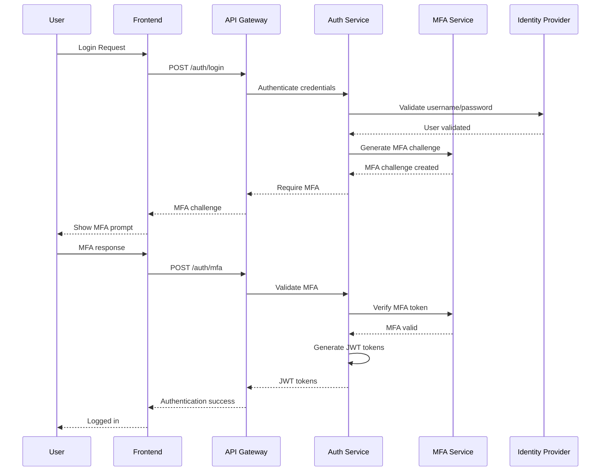

# 🔐 Authentication & Authorization

**Purpose**: Comprehensive identity and access management strategy  
**Last Updated**: 2026-02-03  
**Status**: 🔄 In Progress - Core auth implemented, advanced features in progress

---

## 📋 Overview

This document describes the authentication and authorization strategy for our microservices platform. It covers identity management, access control, session management, and security best practices.

---

## 🎯 Authentication Strategy

### **Multi-Factor Authentication (MFA)**

#### **Authentication Flow**


#### **MFA Implementation**
```go
// MFA Service Implementation
type MFAService struct {
    totp     *totp.TOTP
    sms      SMSService
    email    EmailService
    storage  Storage
}

func (m *MFAService) GenerateMFASecret(userID string) (*MFASecret, error) {
    secret, err := totp.Generate(totp.GenerateOpts{
        Issuer:      "Microservices Platform",
        AccountName: userID,
    })
    if err != nil {
        return nil, err
    }
    
    // Store encrypted secret
    encryptedSecret, err := m.encryptSecret(secret.Secret())
    if err != nil {
        return nil, err
    }
    
    m.storage.StoreMFASecret(userID, encryptedSecret)
    
    return &MFASecret{
        Secret:  secret.Secret(),
        QRCode:  secret.QRCode(),
        Backup:  secret.BackupCodes(),
    }, nil
}

func (m *MFAService) ValidateTOTP(userID, token string) (bool, error) {
    encryptedSecret, err := m.storage.GetMFASecret(userID)
    if err != nil {
        return false, err
    }
    
    secret, err := m.decryptSecret(encryptedSecret)
    if err != nil {
        return false, err
    }
    
    return totp.Validate(token, secret), nil
}
```

### **JWT Token Management**

#### **Token Structure**
```json
{
  "header": {
    "alg": "RS256",
    "typ": "JWT",
    "kid": "2023-01-key-id"
  },
  "payload": {
    "sub": "user-12345",
    "iss": "auth-service",
    "aud": ["api-gateway", "order-service"],
    "exp": 1643942400,
    "iat": 1643938800,
    "nbf": 1643938800,
    "jti": "token-uuid-12345",
    "scope": ["read", "write", "admin"],
    "roles": ["admin", "order-manager"],
    "permissions": [
      "orders:*",
      "customers:read",
      "payments:write"
    ],
    "session_id": "session-uuid-67890",
    "mfa_verified": true,
    "ip_address": "192.168.1.100",
    "user_agent": "Mozilla/5.0..."
  },
  "signature": "RS256-signature-hash"
}
```

#### **Token Generation**
```go
type TokenService struct {
    privateKey *rsa.PrivateKey
    publicKey  *rsa.PublicKey
    issuer     string
    audience   []string
}

func (t *TokenService) GenerateTokens(user *User) (*TokenPair, error) {
    now := time.Now()
    
    // Access Token (15 minutes)
    accessToken := jwt.NewWithClaims(jwt.SigningMethodRS256, jwt.MapClaims{
        "sub":           user.ID,
        "iss":           t.issuer,
        "aud":           t.audience,
        "exp":           now.Add(15 * time.Minute).Unix(),
        "iat":           now.Unix(),
        "jti":           uuid.New().String(),
        "scope":         user.Scopes,
        "roles":         user.Roles,
        "permissions":   user.Permissions,
        "session_id":    user.SessionID,
        "mfa_verified":  user.MFAVerified,
    })
    
    // Refresh Token (7 days)
    refreshToken := jwt.NewWithClaims(jwt.SigningMethodRS256, jwt.MapClaims{
        "sub":        user.ID,
        "iss":        t.issuer,
        "aud":        []string{"auth-service"},
        "exp":        now.Add(7 * 24 * time.Hour).Unix(),
        "iat":        now.Unix(),
        "jti":        uuid.New().String(),
        "session_id": user.SessionID,
        "type":       "refresh",
    })
    
    accessTokenString, err := accessToken.SignedString(t.privateKey)
    if err != nil {
        return nil, err
    }
    
    refreshTokenString, err := refreshToken.SignedString(t.privateKey)
    if err != nil {
        return nil, err
    }
    
    return &TokenPair{
        AccessToken:  accessTokenString,
        RefreshToken: refreshTokenString,
        TokenType:    "Bearer",
        ExpiresIn:    900, // 15 minutes
    }, nil
}
```

---

## 🛡️ Authorization Strategy

### **Role-Based Access Control (RBAC)**

#### **Role Definitions**
```yaml
# Role Hierarchy
roles:
  super_admin:
    name: "Super Administrator"
    description: "Full system access"
    permissions:
      - "*:*"  # All permissions
    inherits: []
    
  admin:
    name: "Administrator"
    description: "Administrative access"
    permissions:
      - "users:*"
      - "roles:*"
      - "permissions:*"
      - "audit:*"
    inherits: []
    
  order_manager:
    name: "Order Manager"
    description: "Order management access"
    permissions:
      - "orders:*"
      - "customers:read"
      - "products:read"
      - "inventory:read"
    inherits: []
    
  customer_service:
    name: "Customer Service"
    description: "Customer support access"
    permissions:
      - "customers:*"
      - "orders:read"
      - "products:read"
      - "reviews:*"
    inherits: []
    
  analyst:
    name: "Business Analyst"
    description: "Analytics and reporting access"
    permissions:
      - "analytics:*"
      - "reports:*"
      - "orders:read"
      - "customers:read"
    inherits: []
```

#### **Permission System**
```go
type Permission struct {
    ID          string `json:"id"`
    Resource    string `json:"resource"`
    Action      string `json:"action"`
    Scope       string `json:"scope"`
    Description string `json:"description"`
}

type Role struct {
    ID          string       `json:"id"`
    Name        string       `json:"name"`
    Description string       `json:"description"`
    Permissions []Permission `json:"permissions"`
    Inherited   []string     `json:"inherited"`
}

type User struct {
    ID          string   `json:"id"`
    Username    string   `json:"username"`
    Email       string   `json:"email"`
    Roles       []string `json:"roles"`
    Permissions []string `json:"permissions"`
    Active      bool     `json:"active"`
}

// Authorization Service
type AuthService struct {
    roleRepo    RoleRepository
    userRepo    UserRepository
    cache       Cache
}

func (a *AuthService) CheckPermission(userID, resource, action string) (bool, error) {
    // Check cache first
    cacheKey := fmt.Sprintf("perm:%s:%s:%s", userID, resource, action)
    if cached, err := a.cache.Get(cacheKey); err == nil {
        return cached.(bool), nil
    }
    
    user, err := a.userRepo.GetUser(userID)
    if err != nil {
        return false, err
    }
    
    // Check direct permissions
    for _, permission := range user.Permissions {
        if a.matchPermission(permission, resource, action) {
            a.cache.Set(cacheKey, true, 5*time.Minute)
            return true, nil
        }
    }
    
    // Check role permissions
    for _, roleID := range user.Roles {
        role, err := a.roleRepo.GetRole(roleID)
        if err != nil {
            continue
        }
        
        for _, permission := range role.Permissions {
            if a.matchPermission(permission.Resource+":"+permission.Action, resource, action) {
                a.cache.Set(cacheKey, true, 5*time.Minute)
                return true, nil
            }
        }
    }
    
    a.cache.Set(cacheKey, false, 5*time.Minute)
    return false, nil
}

func (a *AuthService) matchPermission(permission, resource, action string) bool {
    // Wildcard permission
    if permission == "*:*" {
        return true
    }
    
    // Resource wildcard
    if strings.HasPrefix(permission, "*:") && strings.HasSuffix(permission, ":"+action) {
        return true
    }
    
    // Action wildcard
    if strings.HasSuffix(permission, ":*") && strings.HasPrefix(permission, resource+":") {
        return true
    }
    
    // Exact match
    return permission == resource+":"+action
}
```

### **Attribute-Based Access Control (ABAC)**

#### **Policy Definition**
```yaml
# ABAC Policies
policies:
  - name: "order_access_policy"
    description: "Control access to orders based on user attributes"
    rules:
      - effect: "allow"
        actions: ["read", "write"]
        resources: ["orders"]
        conditions:
          - attribute: "user.roles"
            operator: "contains"
            value: "order_manager"
          - attribute: "order.customer_id"
            operator: "equals"
            attribute: "user.id"
            
      - effect: "allow"
        actions: ["read"]
        resources: ["orders"]
        conditions:
          - attribute: "user.roles"
            operator: "contains"
            value: "customer_service"
          - attribute: "order.region"
            operator: "equals"
            attribute: "user.region"
            
  - name: "payment_access_policy"
    description: "Control access to payment operations"
    rules:
      - effect: "allow"
        actions: ["write"]
        resources: ["payments"]
        conditions:
          - attribute: "user.roles"
            operator: "contains"
            value: "payment_processor"
          - attribute: "payment.amount"
            operator: "less_than"
            value: 10000
            
      - effect: "deny"
        actions: ["write"]
        resources: ["payments"]
        conditions:
          - attribute: "user.mfa_verified"
            operator: "equals"
            value: false
```

#### **ABAC Implementation**
```go
type PolicyEngine struct {
    policies []Policy
    cache    Cache
}

type Policy struct {
    Name        string   `json:"name"`
    Description string   `json:"description"`
    Rules       []Rule   `json:"rules"`
}

type Rule struct {
    Effect     string      `json:"effect"`
    Actions    []string    `json:"actions"`
    Resources  []string    `json:"resources"`
    Conditions []Condition `json:"conditions"`
}

type Condition struct {
    Attribute string `json:"attribute"`
    Operator  string `json:"operator"`
    Value     interface{} `json:"value"`
}

func (p *PolicyEngine) Evaluate(userID, resource, action string, context map[string]interface{}) (bool, error) {
    // Get user attributes
    user, err := p.getUserAttributes(userID)
    if err != nil {
        return false, err
    }
    
    // Merge user attributes with context
    attributes := p.mergeAttributes(user, context)
    
    for _, policy := range p.policies {
        for _, rule := range policy.Rules {
            if p.matchRule(rule, resource, action, attributes) {
                return rule.Effect == "allow", nil
            }
        }
    }
    
    return false, nil // Default deny
}

func (p *PolicyEngine) matchRule(rule Rule, resource, action string, attributes map[string]interface{}) bool {
    // Check action match
    if !p.matchList(rule.Actions, action) {
        return false
    }
    
    // Check resource match
    if !p.matchList(rule.Resources, resource) {
        return false
    }
    
    // Check all conditions
    for _, condition := range rule.Conditions {
        if !p.evaluateCondition(condition, attributes) {
            return false
        }
    }
    
    return true
}

func (p *PolicyEngine) evaluateCondition(condition Condition, attributes map[string]interface{}) bool {
    value, exists := attributes[condition.Attribute]
    if !exists {
        return false
    }
    
    switch condition.Operator {
    case "equals":
        return value == condition.Value
    case "contains":
        if slice, ok := value.([]string); ok {
            for _, item := range slice {
                if item == condition.Value {
                    return true
                }
            }
        }
        return false
    case "less_than":
        if num, ok := value.(float64); ok {
            if threshold, ok := condition.Value.(float64); ok {
                return num < threshold
            }
        }
        return false
    case "greater_than":
        if num, ok := value.(float64); ok {
            if threshold, ok := condition.Value.(float64); ok {
                return num > threshold
            }
        }
        return false
    default:
        return false
    }
}
```

---

## 🔐 Session Management

### **Session Security**

#### **Session Configuration**
```go
type SessionConfig struct {
    Name           string        `json:"name"`
    Secret         string        `json:"secret"`
    MaxAge         time.Duration `json:"max_age"`
    HTTPOnly       bool          `json:"http_only"`
    Secure         bool          `json:"secure"`
    SameSite       string        `json:"same_site"`
    Rolling        bool          `json:"rolling"`
    RenewBefore    time.Duration `json:"renew_before"`
}

type SessionManager struct {
    config    SessionConfig
    store     SessionStore
    crypto    CryptoService
    blacklist BlacklistService
}

func (s *SessionManager) CreateSession(user *User, clientInfo *ClientInfo) (*Session, error) {
    sessionID := s.generateSessionID()
    
    session := &Session{
        ID:        sessionID,
        UserID:    user.ID,
        CreatedAt: time.Now(),
        ExpiresAt: time.Now().Add(s.config.MaxAge),
        ClientInfo: ClientInfo{
            IPAddress:   clientInfo.IPAddress,
            UserAgent:   clientInfo.UserAgent,
            Device:      clientInfo.Device,
            Location:    clientInfo.Location,
        },
        MFAVerified: user.MFAVerified,
        Active:      true,
    }
    
    // Encrypt session data
    encryptedSession, err := s.crypto.Encrypt(session)
    if err != nil {
        return nil, err
    }
    
    // Store session
    err = s.store.Store(sessionID, encryptedSession, s.config.MaxAge)
    if err != nil {
        return nil, err
    }
    
    return session, nil
}

func (s *SessionManager) ValidateSession(sessionID string) (*Session, error) {
    // Check blacklist
    if s.blacklist.IsBlacklisted(sessionID) {
        return nil, errors.New("session is blacklisted")
    }
    
    // Retrieve session
    encryptedSession, err := s.store.Get(sessionID)
    if err != nil {
        return nil, err
    }
    
    // Decrypt session
    session, err := s.crypto.Decrypt(encryptedSession)
    if err != nil {
        return nil, err
    }
    
    // Check expiration
    if time.Now().After(session.ExpiresAt) {
        s.DestroySession(sessionID)
        return nil, errors.New("session expired")
    }
    
    // Check if session is active
    if !session.Active {
        return nil, errors.New("session is inactive")
    }
    
    // Rolling session renewal
    if s.config.Rolling && time.Until(session.ExpiresAt) < s.config.RenewBefore {
        session.ExpiresAt = time.Now().Add(s.config.MaxAge)
        s.store.Store(sessionID, encryptedSession, s.config.MaxAge)
    }
    
    return session, nil
}
```

#### **Session Middleware**
```go
func SessionMiddleware(sessionManager *SessionManager) func(http.Handler) http.Handler {
    return func(next http.Handler) http.Handler {
        return http.HandlerFunc(func(w http.ResponseWriter, r *http.Request) {
            // Extract session token from cookie or header
            sessionToken := s.extractSessionToken(r)
            if sessionToken == "" {
                next.ServeHTTP(w, r)
                return
            }
            
            // Validate session
            session, err := sessionManager.ValidateSession(sessionToken)
            if err != nil {
                // Clear invalid session
                s.clearSessionCookie(w)
                next.ServeHTTP(w, r)
                return
            }
            
            // Add session to context
            ctx := context.WithValue(r.Context(), "session", session)
            next.ServeHTTP(w, r.WithContext(ctx))
        })
    }
}

func extractSessionToken(r *http.Request) string {
    // Try cookie first
    cookie, err := r.Cookie("session_token")
    if err == nil {
        return cookie.Value
    }
    
    // Try Authorization header
    authHeader := r.Header.Get("Authorization")
    if strings.HasPrefix(authHeader, "Bearer ") {
        return strings.TrimPrefix(authHeader, "Bearer ")
    }
    
    return ""
}
```

---

## 🔍 Security Monitoring

### **Authentication Monitoring**

#### **Security Events**
```go
type SecurityEvent struct {
    ID          string                 `json:"id"`
    Type        string                 `json:"type"`
    UserID      string                 `json:"user_id,omitempty"`
    IPAddress   string                 `json:"ip_address"`
    UserAgent   string                 `json:"user_agent"`
    Timestamp   time.Time              `json:"timestamp"`
    Severity    string                 `json:"severity"`
    Description string                 `json:"description"`
    Metadata    map[string]interface{} `json:"metadata"`
}

type SecurityMonitor struct {
    eventStore EventStore
    alerting   AlertingService
    analytics  AnalyticsService
}

func (s *SecurityMonitor) LogLoginAttempt(userID, ipAddress, userAgent string, success bool) {
    event := &SecurityEvent{
        ID:          uuid.New().String(),
        Type:        "login_attempt",
        UserID:      userID,
        IPAddress:   ipAddress,
        UserAgent:   userAgent,
        Timestamp:   time.Now(),
        Severity:    s.getSeverity(success),
        Description: s.getLoginDescription(success),
        Metadata: map[string]interface{}{
            "success": success,
        },
    }
    
    s.eventStore.Store(event)
    
    // Check for suspicious patterns
    s.detectSuspiciousActivity(event)
}

func (s *SecurityMonitor) detectSuspiciousActivity(event *SecurityEvent) {
    // Check for multiple failed logins
    failedLogins := s.eventStore.GetRecentEvents("login_attempt", event.IPAddress, 15*time.Minute)
    failedCount := 0
    for _, e := range failedLogins {
        if e.Metadata["success"].(bool) == false {
            failedCount++
        }
    }
    
    if failedCount > 5 {
        s.alerting.SendAlert(&Alert{
            Type:        "brute_force_attack",
            Severity:    "high",
            IPAddress:   event.IPAddress,
            Description: fmt.Sprintf("Multiple failed login attempts from %s", event.IPAddress),
        })
    }
    
    // Check for impossible travel
    if event.UserID != "" {
        lastLogin := s.eventStore.GetLastSuccessfulLogin(event.UserID)
        if lastLogin != nil {
            if s.detectImpossibleTravel(lastLogin, event) {
                s.alerting.SendAlert(&Alert{
                    Type:        "impossible_travel",
                    Severity:    "critical",
                    UserID:      event.UserID,
                    Description: fmt.Sprintf("Impossible travel detected for user %s", event.UserID),
                })
            }
        }
    }
}
```

---

## 🔧 Implementation Examples

### **API Gateway Authentication**

#### **Kong Plugin Configuration**
```yaml
# JWT Plugin
apiVersion: configuration.konghq.com/v1
kind: KongPlugin
metadata:
  name: jwt-auth
  namespace: production
plugin: jwt
config:
  secret_is_base64: false
  key_claim_name: "iss"
  algorithm: "RS256"
  run_on_preflight: true

---
# ACL Plugin
apiVersion: configuration.konghq.com/v1
kind: KongPlugin
metadata:
  name: acl-plugin
  namespace: production
plugin: acl
config:
  whitelist:
    - admin
    - order-manager
    - customer-service

---
# Rate Limiting Plugin
apiVersion: configuration.konghq.com/v1
kind: KongPlugin
metadata:
  name: rate-limiting
  namespace: production
plugin: rate-limiting
config:
  minute: 100
  hour: 1000
  policy: redis
```

### **Service-to-Service Authentication**

#### **mTLS Configuration**
```yaml
# Istio Destination Rule
apiVersion: networking.istio.io/v1beta1
kind: DestinationRule
metadata:
  name: order-service
  namespace: production
spec:
  host: order-service.production.svc.cluster.local
  trafficPolicy:
    tls:
      mode: ISTIO_MUTUAL
    connectionPool:
      tcp:
        maxConnections: 100
      http:
        http1MaxPendingRequests: 50
        maxRequestsPerConnection: 10

---
# Service Account
apiVersion: v1
kind: ServiceAccount
metadata:
  name: order-service
  namespace: production
---
apiVersion: apps/v1
kind: Deployment
metadata:
  name: order-service
  namespace: production
spec:
  template:
    spec:
      serviceAccountName: order-service
```

---

## 📚 Related Documentation

### **Implementation Guides**
- [Security Architecture](./SECURITY_ARCHITECTURE.md) - Overall security framework
- [Network Security](./NETWORK_SECURITY.md) - Network isolation and mTLS
- [Data Protection](./DATA_PROTECTION.md) - Encryption and key management
- [Security Monitoring](./SECURITY_MONITORING.md) - Threat detection

### **External Resources**
- [OAuth 2.0 and OpenID Connect](https://openid.net/connect/)
- [JWT Best Practices](https://auth0.com/blog/json-web-token-best-practices/)
- [OWASP Authentication Cheat Sheet](https://cheatsheetseries.owasp.org/cheatsheets/Authentication_Cheat_Sheet.html)

---

**Last Updated**: 2026-02-03  
**Review Cycle**: Monthly  
**Maintained By**: Security & Platform Engineering Teams
