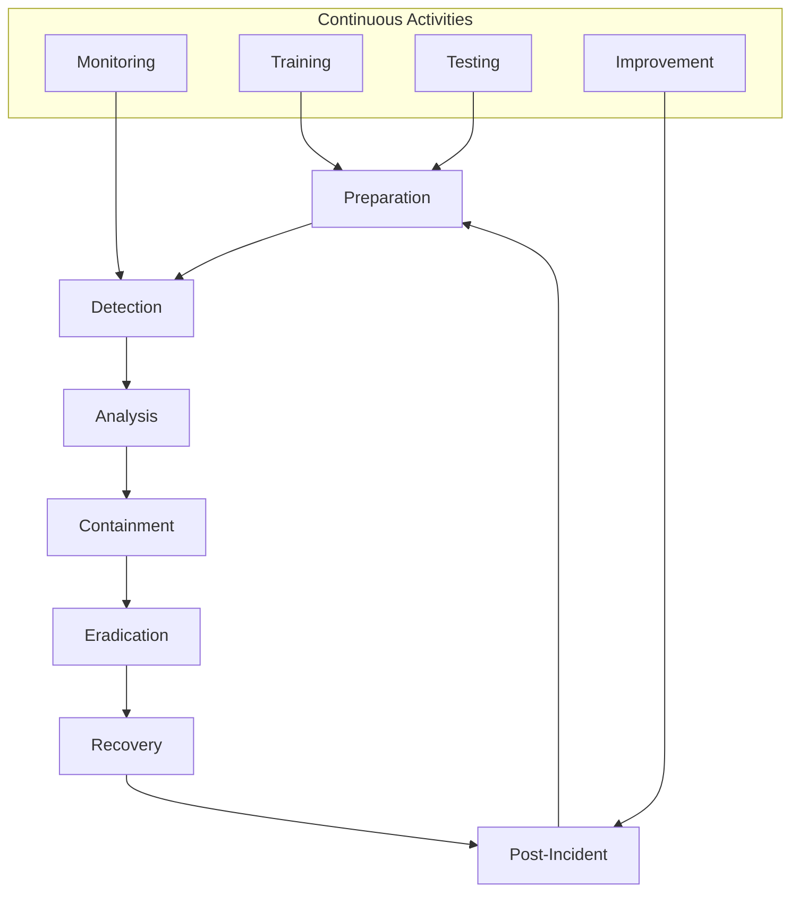

# 🚨 Incident Response

**Purpose**: Comprehensive security incident response procedures  
**Last Updated**: 2026-02-03  
**Status**: 🔄 In Progress - Framework defined, procedures being implemented

---

## 📋 Overview

This document describes the security incident response framework for our microservices platform. It covers incident detection, response procedures, communication protocols, and post-incident activities.

---

## 🎯 Incident Response Framework

### **Incident Lifecycle**



### **Incident Classification**

#### **Severity Levels**

##### **🔴 CRITICAL (P0)**
- **Impact**: Complete system outage or major security breach
- **Response Time**: Immediate (within 5 minutes)
- **Escalation**: Immediate management notification
- **Examples**:
  - Data breach with customer data exposure
  - Complete service outage
  - Ransomware attack
  - Major security vulnerability exploitation

##### **🟠 HIGH (P1)**
- **Impact**: Significant service degradation or security incident
- **Response Time**: Within 15 minutes
- **Escalation**: Team lead notification
- **Examples**:
  - Partial service outage
  - Suspicious security activity
  - Performance degradation >50%
  - Minor data exposure

##### **🟡 MEDIUM (P2)**
- **Impact**: Limited impact or security concern
- **Response Time**: Within 1 hour
- **Escalation**: Service owner notification
- **Examples**:
  - Security configuration issue
  - Minor performance degradation
  - Suspicious login attempts
  - Vulnerability identified

##### **🟢 LOW (P3)**
- **Impact**: Informational or minor issue
- **Response Time**: Within 24 hours
- **Escalation**: Team notification
- **Examples**:
  - Security best practice violation
  - Minor configuration issue
  - Informational security event
  - Documentation update needed

---

## 🚨 Detection & Analysis

### **Detection Sources**

#### **Automated Detection**
```yaml
# Security Monitoring Rules
detection_rules:
  - name: "brute_force_attack"
    description: "Multiple failed login attempts"
    condition:
      - metric: "failed_login_rate"
        operator: ">"
        threshold: 10
        time_window: "5m"
    severity: "high"
    
  - name: "unusual_data_access"
    description: "Unusual data access patterns"
    condition:
      - metric: "data_access_anomaly_score"
        operator: ">"
        threshold: 0.8
        time_window: "1h"
    severity: "medium"
    
  - name: "suspicious_api_calls"
    description: "Suspicious API call patterns"
    condition:
      - metric: "api_anomaly_score"
        operator: ">"
        threshold: 0.7
        time_window: "30m"
    severity: "medium"
```

#### **Manual Detection**
- **Security Team Reviews**: Regular security log analysis
- **User Reports**: Security incident reporting
- **Third-party Notifications**: External security alerts
- **Compliance Audits**: Security audit findings

### **Incident Analysis**

#### **Initial Analysis Checklist**
```markdown
## Initial Analysis Checklist

### 📊 Incident Assessment
- [ ] **Incident Type**: Determine incident category
- [ ] **Severity Level**: Assign appropriate severity
- [ ] **Impact Assessment**: Evaluate business impact
- [ ] **Scope**: Determine affected systems and data

### 🔍 Technical Analysis
- [ ] **Timeline**: Create incident timeline
- [ ] **Root Cause**: Identify potential root causes
- [ ] **Affected Systems**: List all affected components
- [ ] **Data Impact**: Assess data exposure or corruption

### 👥 Stakeholder Notification
- [ ] **Incident Commander**: Assign incident commander
- [ ] **Technical Team**: Notify relevant technical teams
- [ ] **Management**: Notify management if high severity
- [ ] **Legal/Compliance**: Notify if data breach

### 📝 Documentation
- [ ] **Incident Ticket**: Create incident tracking ticket
- [ ] **Initial Report**: Document initial findings
- [ ] **Action Log**: Start detailed action log
- [ ] **Evidence Collection**: Begin evidence preservation
```

#### **Triage Process**
```go
type IncidentTriage struct {
    incidentStore IncidentStore
    alerting      AlertingService
    classification ClassificationService
}

func (t *IncidentTriage) TriageIncident(event *SecurityEvent) (*Incident, error) {
    // Classify incident
    classification, err := t.classification.Classify(event)
    if err != nil {
        return nil, err
    }
    
    // Create incident
    incident := &Incident{
        ID:          uuid.New().String(),
        Title:       classification.Title,
        Description: classification.Description,
        Severity:    classification.Severity,
        Status:      "open",
        CreatedAt:   time.Now(),
        Events:      []*SecurityEvent{event},
        Metadata: map[string]interface{}{
            "source":      event.Source,
            "category":    classification.Category,
            "impact":      classification.Impact,
            "affected":    classification.AffectedSystems,
        },
    }
    
    // Store incident
    err = t.incidentStore.Store(incident)
    if err != nil {
        return nil, err
    }
    
    // Notify stakeholders
    t.notifyStakeholders(incident)
    
    return incident, nil
}

func (t *IncidentTriage) notifyStakeholders(incident *Incident) {
    switch incident.Severity {
    case "critical":
        t.alerting.SendCriticalAlert(incident)
        t.alerting.NotifyManagement(incident)
        t.alerting.NotifyLegalTeam(incident)
    case "high":
        t.alerting.SendHighPriorityAlert(incident)
        t.alerting.NotifyTeamLead(incident)
    case "medium":
        t.alerting.SendMediumPriorityAlert(incident)
        t.alerting.NotifyServiceOwner(incident)
    case "low":
        t.alerting.SendLowPriorityAlert(incident)
    }
}
```

---

## 🛡️ Containment Strategies

### **Containment Actions**

#### **Immediate Containment**
```yaml
# Automated Containment Actions
containment_actions:
  - name: "isolate_compromised_service"
    description: "Isolate compromised service from network"
    triggers:
      - event_type: "security_breach"
      - severity: "critical"
    actions:
      - type: "network_isolation"
        target: "{{ .service_name }}"
        method: "network_policy"
      - type: "scale_to_zero"
        target: "{{ .service_name }}"
      - type: "create_incident_ticket"
        priority: "critical"
        
  - name: "block_malicious_ip"
    description: "Block malicious IP addresses"
    triggers:
      - event_type: "brute_force_attack"
      - threshold: 10
    actions:
      - type: "firewall_block"
        target: "{{ .ip_address }}"
        duration: "24h"
      - type: "rate_limit"
        target: "{{ .ip_address }}"
        limit: "1/min"
```

#### **Manual Containment Procedures**
```markdown
## Manual Containment Procedures

### 🚨 Service Isolation
1. **Identify Affected Services**
   - Review monitoring dashboards
   - Check service dependencies
   - Document impact scope

2. **Network Isolation**
   ```bash
   # Create network policy to isolate service
   kubectl apply -f security/network-isolation.yaml
   
   # Update firewall rules
   ./scripts/update-firewall.sh --block-service <service-name>
   ```

3. **Scale Down Service**
   ```bash
   # Scale service to zero
   kubectl scale deployment <service-name> --replicas=0
   
   # Stop traffic routing
   kubectl patch service <service-name> -p '{"spec":{"selector":{"version":"disabled"}}}'
   ```

### 🔐 Account Security
1. **Disable Compromised Accounts**
   ```bash
   # Disable user account
   ./scripts/disable-user.sh --user <username>
   
   # Revoke all sessions
   ./scripts/revoke-sessions.sh --user <username>
   ```

2. **Reset Credentials**
   ```bash
   # Force password reset
   ./scripts/force-password-reset.sh --user <username>
   
   # Rotate API keys
   ./scripts/rotate-api-keys.sh --service <service-name>
   ```

### 💾 Data Protection
1. **Backup Critical Data**
   ```bash
   # Create immediate backup
   ./scripts/emergency-backup.sh --database <db-name>
   
   # Verify backup integrity
   ./scripts/verify-backup.sh --backup-id <backup-id>
   ```

2. **Preserve Evidence**
   ```bash
   # Collect system logs
   ./scripts/collect-logs.sh --since "1 hour ago"
   
   # Create system snapshot
   ./scripts/create-snapshot.sh --service <service-name>
   ```
```

---

## 🔧 Eradication & Recovery

### **Eradication Process**

#### **Root Cause Analysis**
```go
type RootCauseAnalyzer struct {
    logAnalyzer    LogAnalyzer
    metricsAnalyzer MetricsAnalyzer
    forensics      ForensicsService
}

func (r *RootCauseAnalyzer) AnalyzeRootCause(incident *Incident) (*RootCause, error) {
    analysis := &RootCause{
        IncidentID: incident.ID,
        Hypotheses: []Hypothesis{},
        Evidence:   []Evidence{},
    }
    
    // Analyze logs
    logEvidence, err := r.logAnalyzer.AnalyzeLogs(incident.TimeRange)
    if err != nil {
        return nil, err
    }
    analysis.Evidence = append(analysis.Evidence, logEvidence...)
    
    // Analyze metrics
    metricsEvidence, err := r.metricsAnalyzer.AnalyzeMetrics(incident.TimeRange)
    if err != nil {
        return nil, err
    }
    analysis.Evidence = append(analysis.Evidence, metricsEvidence...)
    
    // Generate hypotheses
    analysis.Hypotheses = r.generateHypotheses(analysis.Evidence)
    
    // Validate hypotheses
    for i := range analysis.Hypotheses {
        confidence := r.validateHypothesis(analysis.Hypotheses[i], analysis.Evidence)
        analysis.Hypotheses[i].Confidence = confidence
    }
    
    // Select most likely root cause
    analysis.RootCause = r.selectRootCause(analysis.Hypotheses)
    
    return analysis, nil
}
```

#### **Eradication Actions**
```markdown
## Eradication Actions

### 🐛 Vulnerability Remediation
1. **Apply Security Patches**
   ```bash
   # Update vulnerable packages
   ./scripts/apply-security-patches.sh --service <service-name>
   
   # Rebuild and redeploy
   ./scripts/rebuild-service.sh --service <service-name>
   ```

2. **Configuration Fixes**
   ```bash
   # Update security configurations
   ./scripts/update-security-config.sh --service <service-name>
   
   # Validate configuration
   ./scripts/validate-config.sh --service <service-name>
   ```

### 🔄 System Restoration
1. **Restore from Backup**
   ```bash
   # Restore database
   ./scripts/restore-database.sh --backup-id <backup-id>
   
   # Verify data integrity
   ./scripts/verify-data-integrity.sh --database <db-name>
   ```

2. **Service Recovery**
   ```bash
   # Restore service configuration
   ./scripts/restore-service-config.sh --service <service-name>
   
   # Restart service
   kubectl scale deployment <service-name> --replicas=3
   ```

### 🔒 Security Hardening
1. **Enhance Security Controls**
   ```bash
   # Update firewall rules
   ./scripts/update-firewall-rules.sh --enhance
   
   # Enable additional monitoring
   ./scripts/enable-enhanced-monitoring.sh --service <service-name>
   ```

2. **Access Control Review**
   ```bash
   # Review user permissions
   ./scripts/access-review.sh --service <service-name>
   
   # Revoke unnecessary permissions
   ./scripts/revoke-excess-permissions.sh --service <service-name>
   ```
```

### **Recovery Procedures**

#### **Service Recovery**
```yaml
# Recovery Playbook
recovery_playbook:
  name: "service_recovery"
  description: "Recover service after security incident"
  
  steps:
    - name: "verify_eradication"
      description: "Verify threat is completely eradicated"
      actions:
        - type: "security_scan"
          target: "{{ .service_name }}"
        - type: "vulnerability_scan"
          target: "{{ .service_name }}"
        - type: "log_analysis"
          time_range: "last_24h"
          
    - name: "restore_configuration"
      description: "Restore secure configuration"
      actions:
        - type: "apply_secure_config"
          target: "{{ .service_name }}"
        - type: "validate_config"
          target: "{{ .service_name }}"
          
    - name: "gradual_recovery"
      description: "Gradually restore service"
      actions:
        - type: "scale_service"
          target: "{{ .service_name }}"
          replicas: 1
        - type: "health_check"
          target: "{{ .service_name }}"
          timeout: "5m"
        - type: "scale_service"
          target: "{{ .service_name }}"
          replicas: 3
          
    - name: "monitor_recovery"
      description: "Monitor service during recovery"
      actions:
        - type: "enhanced_monitoring"
          target: "{{ .service_name }}"
          duration: "24h"
        - type: "alert_on_anomaly"
          target: "{{ .service_name }}"
```

---

## 📞 Communication Protocols

### **Stakeholder Communication**

#### **Communication Matrix**
```yaml
communication_matrix:
  critical_incident:
    internal:
      - channel: "#security-incidents"
        frequency: "immediate"
        audience: "engineering_team"
        content: "technical_updates"
      - channel: "email"
        frequency: "immediate"
        audience: "management"
        content: "executive_summary"
    external:
      - channel: "customer_notification"
        frequency: "within_1h"
        audience: "affected_customers"
        content: "service_impact"
      - channel: "press_release"
        frequency: "as_needed"
        audience: "public"
        content: "official_statement"
        
  high_incident:
    internal:
      - channel: "#incidents"
        frequency: "every_30m"
        audience: "relevant_teams"
        content: "status_updates"
    external:
      - channel: "status_page"
        frequency: "every_1h"
        audience: "customers"
        content: "service_status"
```

#### **Communication Templates**
```markdown
## Critical Incident - Initial Notification

**TO**: Engineering Team, Management
**SUBJECT**: 🚨 CRITICAL SECURITY INCIDENT - [Incident ID]

**Incident Summary**:
- **Incident ID**: [INC-2026-001]
- **Severity**: Critical
- **Start Time**: [2026-02-03 10:30 UTC]
- **Affected Services**: [order-service, payment-service]
- **Impact**: [Complete service outage, potential data exposure]

**Current Status**:
- [ ] Incident detected and being investigated
- [ ] Containment measures in progress
- [ ] Recovery timeline TBD

**Next Actions**:
1. Incident Commander: [Name]
2. Technical Lead: [Name]
3. Communication Lead: [Name]

**Communication Schedule**:
- Next update: 30 minutes
- Executive briefing: 1 hour
- Customer notification: As needed

**Contact Information**:
- Incident Commander: [phone/email]
- Technical Lead: [phone/email]
- Communication Lead: [phone/email]

---

## Customer Notification Template

**SUBJECT**: Service Issue - We're Working on It

Dear Customer,

We're currently experiencing a technical issue affecting some of our services. Our team is actively working to resolve this as quickly as possible.

**What's Happening**:
- [Brief, non-technical description of the issue]
- [Which services are affected]
- [When we became aware of the issue]

**What We're Doing**:
- [Steps we're taking to resolve the issue]
- [Estimated timeline for resolution]

**What This Means for You**:
- [Impact on customer operations]
- [Alternative workarounds if available]

We'll provide regular updates on our status page at [status-page-url].

Thank you for your patience and understanding.

Best regards,
The [Company Name] Team
```

---

## 📊 Post-Incident Activities

### **Post-Incident Review**

#### **Review Template**
```markdown
## Post-Incident Review

**Incident ID**: [INC-2026-001]
**Review Date**: [2026-02-04]
**Attendees**: [List of attendees]

### 📊 Incident Summary
- **Duration**: [X hours/minutes]
- **Impact**: [Business impact description]
- **Root Cause**: [Final root cause analysis]
- **Resolution**: [How the incident was resolved]

### 🎯 Performance Metrics
- **Detection Time**: [Time from incident start to detection]
- **Response Time**: [Time from detection to response initiation]
- **Containment Time**: [Time from response to containment]
- **Recovery Time**: [Time from containment to full recovery]
- **Total Downtime**: [Total service downtime]

### ✅ What Went Well
- [List of positive aspects]
- [Effective processes]
- [Good decisions made]
- [Team collaboration highlights]

### ❌ What Could Be Improved
- [List of improvement areas]
- [Process gaps]
- [Communication issues]
- [Technical challenges]

### 📋 Action Items
| Item | Owner | Due Date | Status |
|------|-------|----------|---------|
| [Action 1] | [Owner] | [Date] | [Status] |
| [Action 2] | [Owner] | [Date] | [Status] |
| [Action 3] | [Owner] | [Date] | [Status] |

### 📚 Lessons Learned
- [Key lessons from the incident]
- [Preventive measures needed]
- [Process improvements required]
- [Training needs identified]

### 🔄 Follow-up Required
- [Additional monitoring needed]
- [Documentation updates]
- [Training sessions]
- [Process changes]
```

### **Continuous Improvement**

#### **Improvement Tracking**
```go
type ImprovementTracker struct {
    incidentStore IncidentStore
    actionStore   ActionStore
    metrics       MetricsService
}

func (i *ImprovementTracker) TrackImprovements(incidentID string) error {
    incident, err := i.incidentStore.Get(incidentID)
    if err != nil {
        return err
    }
    
    // Generate improvement recommendations
    recommendations := i.generateRecommendations(incident)
    
    // Create action items
    for _, rec := range recommendations {
        action := &ActionItem{
            ID:          uuid.New().String(),
            IncidentID:  incidentID,
            Title:       rec.Title,
            Description: rec.Description,
            Priority:    rec.Priority,
            Category:    rec.Category,
            Owner:       rec.Owner,
            DueDate:     time.Now().Add(rec.Deadline),
            Status:      "open",
            CreatedAt:   time.Now(),
        }
        
        err = i.actionStore.Store(action)
        if err != nil {
            return err
        }
    }
    
    // Track improvement metrics
    i.metrics.TrackIncidentMetrics(incident)
    
    return nil
}

func (i *ImprovementTracker) generateRecommendations(incident *Incident) []Recommendation {
    var recommendations []Recommendation
    
    // Analyze detection time
    if incident.DetectionTime > 15*time.Minute {
        recommendations = append(recommendations, Recommendation{
            Title:       "Improve Detection Time",
            Description: "Implement automated monitoring for faster incident detection",
            Priority:    "high",
            Category:    "monitoring",
            Owner:       "platform-team",
            Deadline:    30 * 24 * time.Hour, // 30 days
        })
    }
    
    // Analyze communication effectiveness
    if incident.CommunicationIssues {
        recommendations = append(recommendations, Recommendation{
            Title:       "Improve Incident Communication",
            Description: "Standardize communication templates and procedures",
            Priority:    "medium",
            Category:    "process",
            Owner:       "incident-response-team",
            Deadline:    14 * 24 * time.Hour, // 14 days
        })
    }
    
    return recommendations
}
```

---

## 📚 Related Documentation

### **Implementation Guides**
- [Security Architecture](./SECURITY_ARCHITECTURE.md) - Overall security framework
- [Security Monitoring](./SECURITY_MONITORING.md) - Threat detection and monitoring
- [Compliance](./COMPLIANCE.md) - Regulatory compliance requirements

### **External Resources**
- [NIST Cybersecurity Framework](https://www.nist.gov/cyberframework)
- [SANS Incident Response](https://www.sans.org/information-security-training/)
- [FIRST Incident Response](https://www.first.org/)

---

**Last Updated**: 2026-02-03  
**Review Cycle**: Monthly  
**Maintained By**: Security & Platform Engineering Teams
