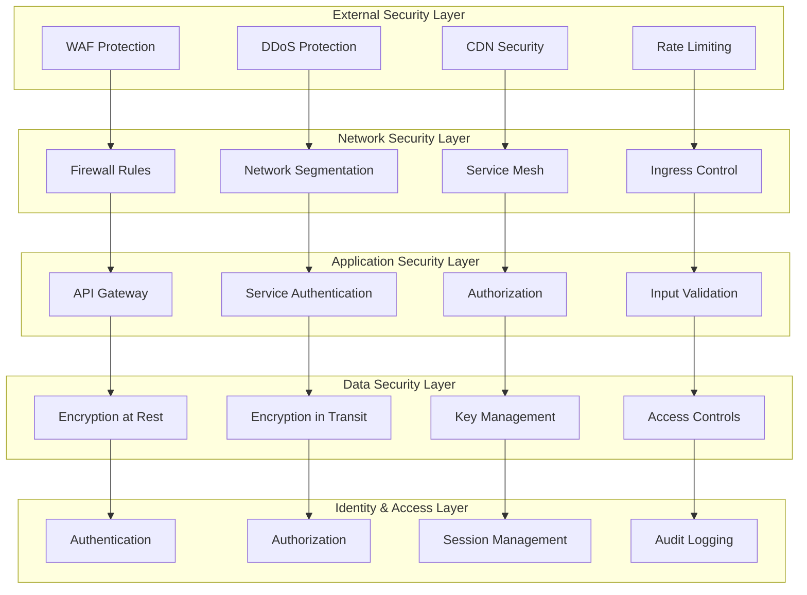
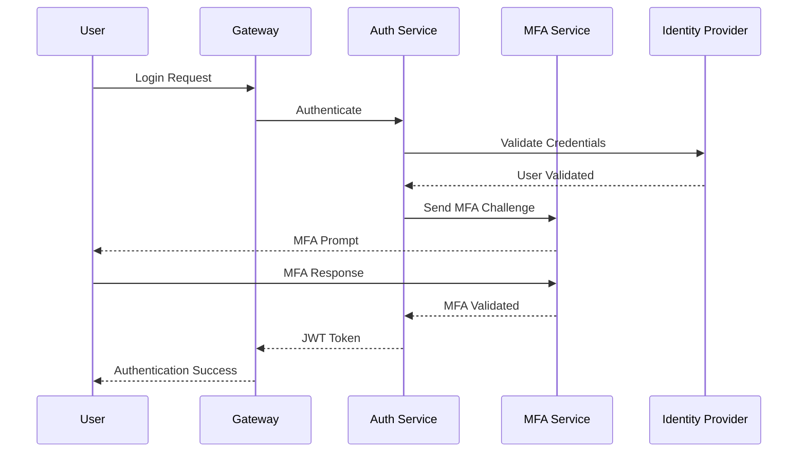
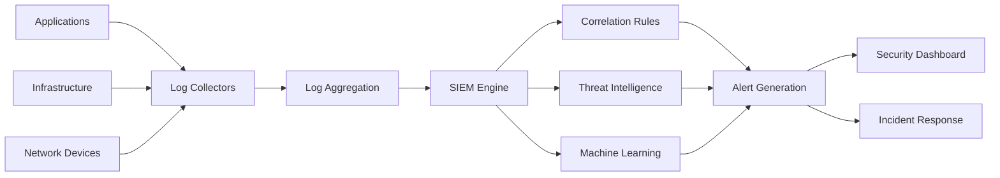
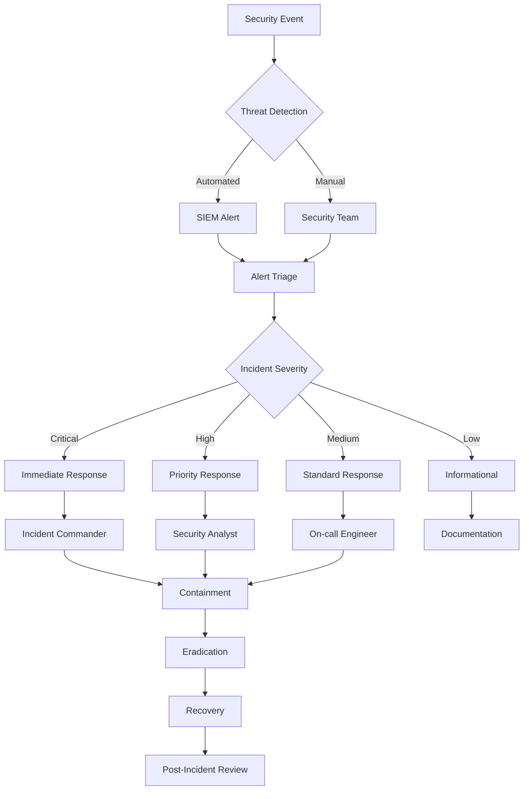

# 🏗️ Security Architecture

**Purpose**: Complete security framework and architecture design  
**Last Updated**: 2026-02-03  
**Status**: 🔄 In Progress - Architecture defined, implementation ongoing

---

## 📋 Overview

This document describes the comprehensive security architecture for our microservices platform. The architecture follows defense-in-depth principles with multiple layers of security controls to protect against various threats.

---

## 🎯 Security Principles

### **Defense in Depth**
- **Multiple Layers**: Security controls at every layer
- **Redundancy**: Multiple security mechanisms
- **Diversity**: Different security approaches
- **Compromise Containment**: Limit blast radius

### **Zero Trust Architecture**
- **Never Trust**: Always verify authentication and authorization
- **Least Privilege**: Minimum necessary access
- **Micro-Segmentation**: Network and application segmentation
- **Continuous Monitoring**: Real-time security monitoring

### **Security by Design**
- **Built-in Security**: Security considerations from design
- **Default Secure**: Secure configurations by default
- **Fail Secure**: Secure failure modes
- **Transparency**: Open and auditable security

---

## 🏗️ Security Architecture Overview

### **Layered Security Model**



---

## 🔐 Identity & Access Management

### **Authentication Architecture**

#### **Multi-Factor Authentication (MFA)**


#### **JWT Token Structure**
```json
{
  "header": {
    "alg": "RS256",
    "typ": "JWT",
    "kid": "key-id"
  },
  "payload": {
    "sub": "user-123",
    "iss": "auth-service",
    "aud": "api-gateway",
    "exp": 1643942400,
    "iat": 1643938800,
    "jti": "token-id",
    "scope": ["read", "write"],
    "roles": ["admin", "user"],
    "permissions": ["orders:read", "payments:write"]
  },
  "signature": "signature-hash"
}
```

### **Authorization Architecture**

#### **Role-Based Access Control (RBAC)**
```yaml
# Role Definitions
roles:
  - name: "admin"
    permissions:
      - "*:*"  # All permissions
    
  - name: "order-manager"
    permissions:
      - "orders:*"
      - "customers:read"
      - "products:read"
    
  - name: "customer-service"
    permissions:
      - "customers:*"
      - "orders:read"
      - "products:read"

# Service Permissions
services:
  - name: "order-service"
    permissions:
      - "orders:create"
      - "orders:read"
      - "orders:update"
      - "payments:create"
    
  - name: "payment-service"
    permissions:
      - "payments:*"
      - "orders:read"
```

---

## 🌐 Network Security

### **Network Segmentation**

#### **Kubernetes Network Policies**
```yaml
# Default deny all traffic
apiVersion: networking.k8s.io/v1
kind: NetworkPolicy
metadata:
  name: default-deny-all
  namespace: production
spec:
  podSelector: {}
  policyTypes:
  - Ingress
  - Egress

---
# Allow traffic from gateway to services
apiVersion: networking.k8s.io/v1
kind: NetworkPolicy
metadata:
  name: allow-gateway-to-services
  namespace: production
spec:
  podSelector:
    matchLabels:
      app: order-service
  policyTypes:
  - Ingress
  ingress:
  - from:
    - podSelector:
        matchLabels:
          app: api-gateway
    ports:
    - protocol: TCP
      port: 8080

---
# Allow service-to-service communication
apiVersion: networking.k8s.io/v1
kind: NetworkPolicy
metadata:
  name: allow-service-to-service
  namespace: production
spec:
  podSelector:
    matchLabels:
      app: payment-service
  policyTypes:
  - Ingress
  ingress:
  - from:
    - podSelector:
        matchLabels:
          app: order-service
    ports:
    - protocol: TCP
      port: 8080
```

#### **Service Mesh Security**
```yaml
# Istio Service Mesh Configuration
apiVersion: security.istio.io/v1beta1
kind: PeerAuthentication
metadata:
  name: default
  namespace: production
spec:
  mtls:
    mode: STRICT

---
apiVersion: security.istio.io/v1beta1
kind: AuthorizationPolicy
metadata:
  name: order-service-authz
  namespace: production
spec:
  selector:
    matchLabels:
      app: order-service
  rules:
  - from:
    - source:
        principals: ["cluster.local/ns/production/sa/api-gateway"]
  - to:
    - operation:
        methods: ["GET", "POST", "PUT", "DELETE"]
```

---

## 🛡️ Application Security

### **API Security Architecture**

#### **API Gateway Security**
```yaml
# Kong API Gateway Configuration
services:
  - name: order-service
    url: http://order-service.production.svc.cluster.local
    plugins:
      - name: rate-limiting
        config:
          minute: 100
          hour: 1000
      - name: jwt
        config:
          secret_is_base64: false
      - name: acl
        config:
          whitelist:
            - admin
            - order-manager

routes:
  - name: order-routes
    service: order-service
    paths:
      - /api/orders
    methods:
      - GET
      - POST
      - PUT
      - DELETE
    plugins:
      - name: request-size-limiting
        config:
          allowed_payload_size: 10
```

#### **Input Validation**
```go
// Input validation middleware
func ValidationMiddleware(next http.Handler) http.Handler {
    return http.HandlerFunc(func(w http.ResponseWriter, r *http.Request) {
        // Validate content type
        if r.Header.Get("Content-Type") != "application/json" {
            http.Error(w, "Invalid content type", http.StatusBadRequest)
            return
        }
        
        // Validate request size
        if r.ContentLength > 10*1024*1024 { // 10MB limit
            http.Error(w, "Request too large", http.StatusRequestEntityTooLarge)
            return
        }
        
        // Validate JSON structure
        var body map[string]interface{}
        if err := json.NewDecoder(r.Body).Decode(&body); err != nil {
            http.Error(w, "Invalid JSON", http.StatusBadRequest)
            return
        }
        
        next.ServeHTTP(w, r)
    })
}
```

---

## 💾 Data Security

### **Encryption Architecture**

#### **Encryption at Rest**
```yaml
# Kubernetes Secret Encryption
apiVersion: apiserver.config.k8s.io/v1
kind: EncryptionConfiguration
resources:
  - resources:
      - secrets
    providers:
      - aescbc:
          keys:
            - name: key1
              secret: <base64-encoded-32-byte-key>
      - identity: {}

---
# Persistent Volume Encryption
apiVersion: v1
kind: PersistentVolumeClaim
metadata:
  name: encrypted-pvc
  namespace: production
spec:
  accessModes:
    - ReadWriteOnce
  storageClassName: encrypted-ssd
  resources:
    requests:
      storage: 100Gi
```

#### **Encryption in Transit**
```yaml
# TLS Configuration
apiVersion: v1
kind: Secret
metadata:
  name: tls-certificate
  namespace: production
type: kubernetes.io/tls
data:
  tls.crt: <base64-encoded-certificate>
  tls.key: <base64-encoded-private-key>

---
# Service TLS Configuration
apiVersion: v1
kind: Service
metadata:
  name: secure-service
  namespace: production
spec:
  selector:
    app: secure-service
  ports:
  - port: 443
    targetPort: 8443
  tls:
    - secretName: tls-certificate
      ports:
        - port: 443
```

### **Key Management**

#### **HashiCorp Vault Integration**
```yaml
# Vault Configuration
apiVersion: v1
kind: ConfigMap
metadata:
  name: vault-config
  namespace: production
data:
  vault.hcl: |
    ui = true
    
    listener "tcp" {
      address = "0.0.0.0:8200"
      tls_disable = 1
    }
    
    storage "consul" {
      address = "consul.production.svc.cluster.local:8500"
      path = "vault/"
    }
    
    api_addr = "http://vault.production.svc.cluster.local:8200"
    cluster_addr = "http://vault.production.svc.cluster.local:8201"
```

---

## 🔍 Security Monitoring

### **Threat Detection Architecture**

#### **Security Information and Event Management (SIEM)**


#### **Falco Security Rules**
```yaml
# Falco Rules for Container Security
- rule: Detect shell in container
  desc: >
    A shell was spawned by a process in a container.
  condition: >
    spawned_process and
    container and
    proc.name in (bash, sh, zsh, fish, csh, tcsh, ksh) and
    not user_expected_shell_spawn
  output: >
    Shell spawned in container (user=%user.name container=%container.name
    shell=%proc.name parent=%proc.pname cmdline=%proc.cmdline)
  priority: WARNING
  tags: [container, shell]

- rule: Detect sudo usage in container
  desc: >
    Sudo was executed in a container.
  condition: >
    spawned_process and
    container and
    proc.name = sudo and
    not user_expected_sudo_usage
  output: >
    Sudo executed in container (user=%user.name container=%container.name
    command=%proc.cmdline)
  priority: WARNING
  tags: [container, sudo]
```

---

## 🚨 Incident Response Architecture

### **Incident Response Workflow**



### **Automated Response**

#### **Security Automation**
```yaml
# Automated Security Response
apiVersion: v1
kind: ConfigMap
metadata:
  name: security-automation
  namespace: production
data:
  automation.yaml: |
    rules:
      - name: isolate-compromised-pod
        trigger:
          event_type: security_alert
          severity: critical
          source: falco
          rule: detect_shell_in_container
        actions:
          - type: isolate_pod
            parameters:
              pod_name: "{{ .container.name }}"
              namespace: "{{ .kubernetes.namespace_name }}"
          - type: create_ticket
            parameters:
              title: "Security Incident: Compromised Container"
              severity: "critical"
              description: "Container {{ .container.name }} isolated due to suspicious activity"
          - type: notify_team
            parameters:
              channel: "#security-incidents"
              message: "Critical security incident detected in {{ .container.name }}"
```

---

## 🔧 Implementation Details

### **Kubernetes Security**

#### **Pod Security Policies**
```yaml
apiVersion: policy/v1beta1
kind: PodSecurityPolicy
metadata:
  name: restricted-psp
spec:
  privileged: false
  allowPrivilegeEscalation: false
  requiredDropCapabilities:
    - ALL
  volumes:
    - 'configMap'
    - 'emptyDir'
    - 'projected'
    - 'secret'
    - 'downwardAPI'
    - 'persistentVolumeClaim'
  runAsUser:
    rule: 'MustRunAsNonRoot'
  seLinux:
    rule: 'RunAsAny'
  fsGroup:
    rule: 'RunAsAny'
  readOnlyRootFilesystem: true
  securityContext:
    runAsNonRoot: true
    runAsUser: 1000
    fsGroup: 1000
```

#### **RBAC Configuration**
```yaml
apiVersion: rbac.authorization.k8s.io/v1
kind: Role
metadata:
  namespace: production
  name: service-account-role
rules:
- apiGroups: [""]
  resources: ["pods", "services", "configmaps", "secrets"]
  verbs: ["get", "list", "watch"]
- apiGroups: ["apps"]
  resources: ["deployments"]
  verbs: ["get", "list", "watch"]

---
apiVersion: rbac.authorization.k8s.io/v1
kind: RoleBinding
metadata:
  name: service-account-binding
  namespace: production
subjects:
- kind: ServiceAccount
  name: order-service
  namespace: production
roleRef:
  kind: Role
  name: service-account-role
  apiGroup: rbac.authorization.k8s.io
```

---

## 📊 Security Metrics

### **Key Security Indicators (KSIs)**

#### **Security Posture Metrics**
- **Vulnerability Score**: CVSS score aggregation
- **Compliance Score**: Regulatory compliance percentage
- **Security Coverage**: Security controls coverage
- **Risk Score**: Overall security risk assessment

#### **Operational Metrics**
- **Mean Time to Detect (MTTD)**: Threat detection time
- **Mean Time to Respond (MTTR)**: Incident response time
- **False Positive Rate**: Alert accuracy
- **Security Incident Rate**: Incidents per month

#### **Compliance Metrics**
- **Policy Compliance**: Security policy adherence
- **Audit Findings**: Internal/external audit results
- **Training Completion**: Security training coverage
- **Access Review Completion**: Access certification rate

---

## 📚 Related Documentation

### **Implementation Guides**
- [Authentication & Authorization](./AUTH_AUTHZ.md) - Identity management
- [Network Security](./NETWORK_SECURITY.md) - Network isolation
- [Data Protection](./DATA_PROTECTION.md) - Encryption and data security
- [Security Monitoring](./SECURITY_MONITORING.md) - Threat detection

### **Operations**
- [Incident Response](./INCIDENT_RESPONSE.md) - Security incidents
- [Compliance](./COMPLIANCE.md) - Regulatory compliance
- [Security Testing](./SECURITY_TESTING.md) - Security assessments

---

**Last Updated**: 2026-02-03  
**Review Cycle**: Monthly  
**Maintained By**: Security & Platform Engineering Teams
