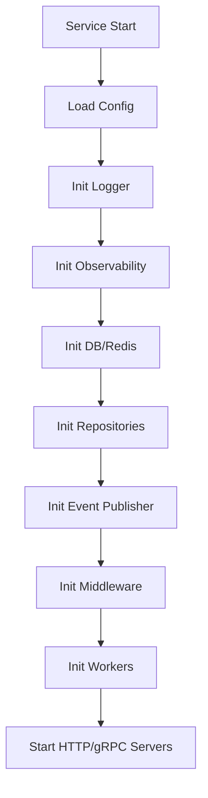
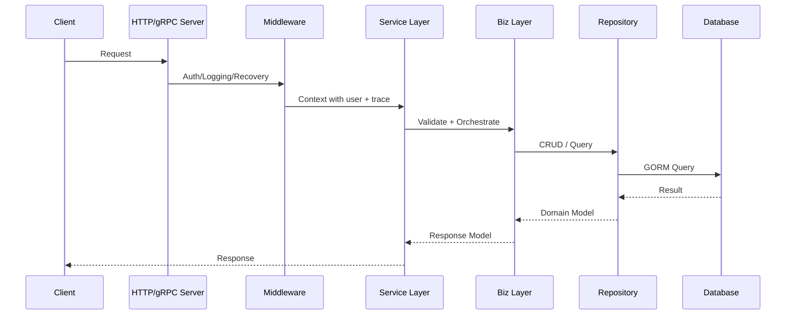
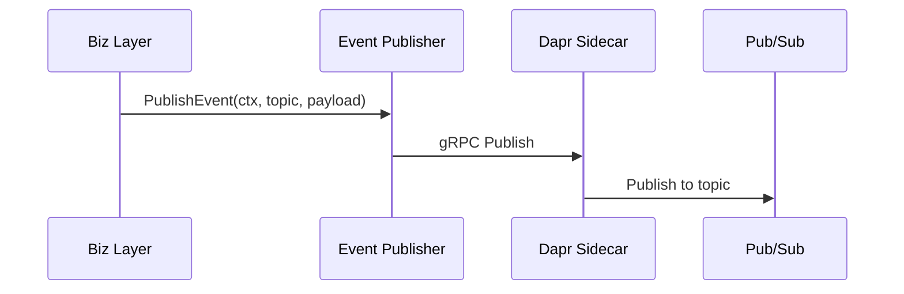
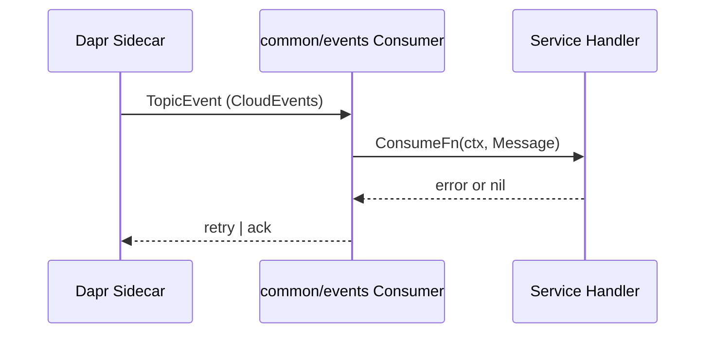
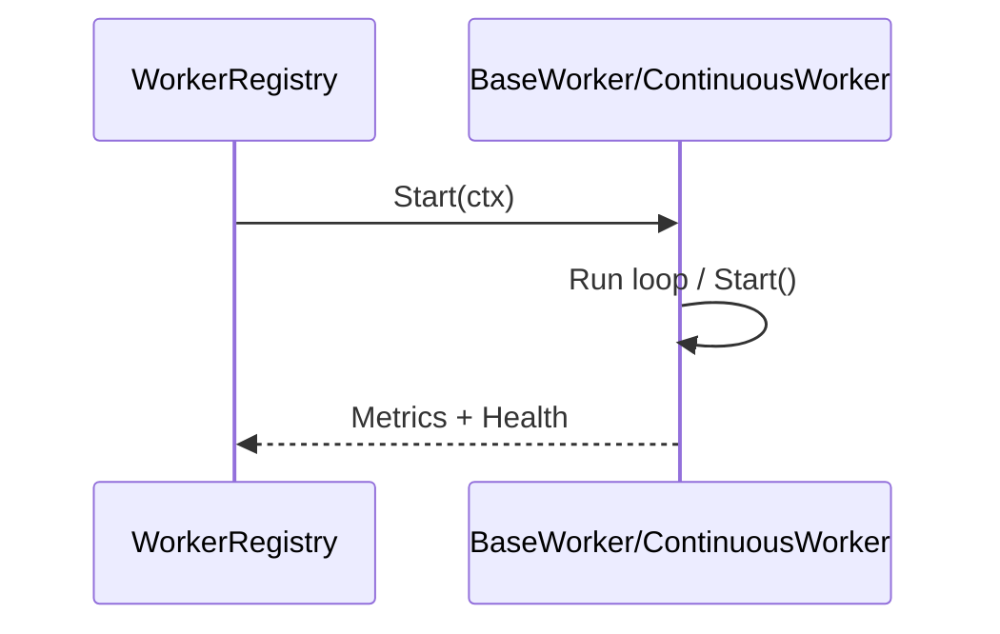

# Common Package Flow

**Last Updated**: 2026-01-20
**Domain**: Platform
**Service**: Common Package (Shared Library)

## 🎯 Scope
This flow describes how services typically use the shared `common` package: configuration, logging, observability, repositories, events, middleware, and workers.

## 🔄 High-Level Service Bootstrap Flow

## 🧱 Core Modules and Responsibilities
- Config loading: [common/config](common/config)
- Structured errors: [common/errors](common/errors)
- Event publishing/consuming: [common/events](common/events)
- HTTP/gRPC middleware: [common/middleware](common/middleware)
- Observability (health/metrics/tracing): [common/observability](common/observability)
- Generic repository layer: [common/repository](common/repository)
- Worker framework: [common/worker](common/worker)
- Utilities and validation: [common/utils](common/utils), [common/validation](common/validation)

## 📦 Typical Runtime Flow (Request → Business → Data)

## 📣 Event Publishing Flow

## 📥 Event Consumption Flow

## ⚙️ Worker Flow (Cron / Continuous)

## 🔍 Key Entry Points
- Event consumer: [common/events/dapr_consumer.go](common/events/dapr_consumer.go)
- Event publisher (gRPC): [common/events/dapr_publisher_grpc.go](common/events/dapr_publisher_grpc.go)
- Repository base: [common/repository/base_repository.go](common/repository/base_repository.go)
- Worker base: [common/worker/base_worker.go](common/worker/base_worker.go)
- Continuous worker: [common/worker/continuous_worker.go](common/worker/continuous_worker.go)
- Metrics interfaces: [common/observability/metrics/interfaces.go](common/observability/metrics/interfaces.go)

## ✅ Recommended Usage Checklist (Per Service)
- Use `config.Loader` to initialize config once during startup.
- Use `middleware.RequestID()`, `middleware.Logging()`, `middleware.Recovery()` as baseline.
- Use `health.Manager` for liveness/readiness endpoints.
- Use `repository.GormRepository` for CRUD and pagination.
- Prefer `events.DaprEventPublisher` for pub/sub (gRPC).
- Use `worker.WorkerRegistry` or `ContinuousWorkerRegistry` for background tasks.
