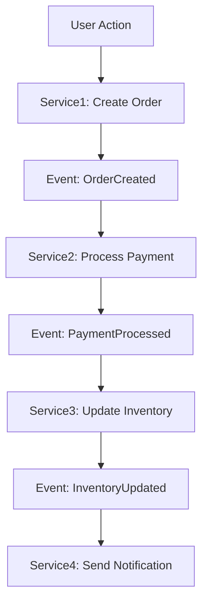

# End-to-End Workflow Review Prompt

**Version**: 1.0  
**Last Updated**: 2026-01-31  
**Purpose**: Complete review of workflow and all participating services focusing on event flow and data flow

---

## How to use this doc

**Prompt to give AI / yourself:**

> Follow **docs/07-development/standards/end-to-end-workflow-review-prompt.md** and run the complete workflow review for **`<workflowName>`** in category **`<category>`**.

Replace `<workflowName>` with the actual workflow (e.g. `complete-order-flow`, `browse-to-purchase`) and `<category>` with the workflow category (e.g. `sequence-diagrams`, `customer-journey`).

---

## Standards (read first)

Before any end-to-end workflow review, apply these docs in order:

1. **[Workflow Documentation Guide](./workflow-documentation-guide.md)** — Flow descriptions, sequence diagrams, integration patterns.
2. **[Event-Driven Architecture Standards](./event-driven-architecture-standards.md)** — Event patterns, data consistency, messaging.
3. **[Service Integration Standards](./service-integration-standards.md)** — API contracts, error handling, monitoring.
4. **[Data Flow Standards](./data-flow-standards.md)** — Data transformation, validation, consistency.

---

## Complete Workflow Review Process

### 1. Workflow Discovery & Mapping

#### 1.1 Analyze Workflow Documentation
- **Read workflow doc**: `docs/05-workflows/{category}/{workflowName}.md` or `.mmd`
- **Extract participants**: Identify all services, actors, and external systems
- **Map flow steps**: Document each step with input/output data
- **Identify decision points**: Business rules and branching logic

#### 1.2 Service Participation Analysis
- **Primary services**: Core services that drive the workflow
- **Supporting services**: Services that provide data or validation
- **External dependencies**: Third-party services, databases, message queues
- **Data stores**: Databases, caches, file systems involved

#### 1.3 Create Service Participation Matrix

| Service | Role | Input Data | Output Data | Events Published | Events Consumed |
|---------|------|------------|-------------|------------------|-----------------|
| Service1 | Primary | Request data | Response data | OrderCreated | PaymentProcessed |
| Service2 | Supporting | Validation data | Status | StatusUpdated | OrderCreated |

### 2. Event Flow Analysis

#### 2.1 Event Mapping
- **Event sequence**: Order of events in the workflow
- **Event producers**: Which services publish which events
- **Event consumers**: Which services consume which events
- **Event data**: Payload structure and required fields

#### 2.2 Event Flow Validation
- **Event consistency**: Ensure event schemas match between producer/consumer
- **Event ordering**: Validate event sequence and dependencies
- **Event reliability**: Check retry logic, dead letter queues, idempotency
- **Event monitoring**: Verify event tracking and observability

#### 2.3 Create Event Flow Diagram


### 3. Workflow Documentation & Checklist Review

#### 3.1 Workflow Documentation Analysis
- **Documentation completeness**: Verify all required sections present
- **Step clarity**: Ensure workflow steps are clear and actionable
- **Business rules**: Validate business logic and constraints
- **Integration points**: Confirm all service dependencies documented

#### 3.2 Workflow Checklist Creation
- Open or create the workflow checklist: **`docs/10-appendix/checklists/workflow/{category}_{workflowName}_workflow_checklist.md`**.
- Align checklist items with workflow documentation standards and business requirements.
- Include items for workflow validation, service integration, and performance verification.
- Mark completed items; add items for remaining work.
- Save/update the file under `docs/10-appendix/checklists/workflow/`.

### 4. Data Flow Analysis

#### 3.1 Data Transformation Mapping
- **Input data**: Original data format and source
- **Transformation points**: Where and how data is transformed
- **Output data**: Final data format and destination
- **Data validation**: Validation rules at each transformation point

#### 3.2 Data Consistency Check
- **Data integrity**: Ensure data consistency across services
- **Transaction boundaries**: Identify transaction scopes and ACID properties
- **Eventual consistency**: Document eventual consistency patterns
- **Data synchronization**: How data stays in sync between services

#### 3.3 Create Data Flow Matrix

| Step | Service | Input Data | Transformation | Output Data | Validation Rules |
|------|---------|------------|----------------|-------------|------------------|
| 1 | Gateway | HTTP Request | JSON to gRPC | gRPC Request | Schema validation |
| 2 | OrderService | Order Request | Business logic | Order Entity | Business rules |
| 3 | PaymentService | Payment Request | Payment processing | Payment Result | Payment validation |

### 5. Service-by-Service Review

For each service identified in the workflow:

#### 5.1 Service Contract Review
- **API endpoints**: Verify endpoints match workflow requirements
- **Request/Response schemas**: Validate data structures
- **Error responses**: Check error handling and status codes
- **Rate limits**: Ensure service can handle workflow load

#### 5.2 Service Implementation Review
- **Business logic**: Verify implementation matches workflow requirements
- **Data persistence**: Check database operations and transactions
- **Event handling**: Validate event publishing and consuming logic
- **Error handling**: Review error scenarios and recovery mechanisms

#### 5.3 Service Integration Points
- **Upstream dependencies**: Services this service calls
- **Downstream consumers**: Services that call this service
- **Event dependencies**: Events this service publishes/consumes
- **Data dependencies**: Shared data stores or caches

### 6. Cross-Service Integration Review

#### 6.1 Service Communication Patterns
- **Synchronous calls**: REST/gRPC API calls between services
- **Asynchronous messaging**: Event-driven communication
- **Data sharing**: Shared databases or data stores
- **Caching strategies**: Cross-service caching patterns

#### 6.2 Integration Reliability
- **Circuit breakers**: Fault tolerance mechanisms
- **Retry logic**: Retry strategies and backoff policies
- **Timeouts**: Request timeout configurations
- **Fallback mechanisms**: What happens when services are unavailable

#### 6.3 Integration Monitoring
- **Distributed tracing**: End-to-end request tracing
- **Service metrics**: Performance metrics for each service
- **Integration metrics**: Communication success/failure rates
- **Business metrics**: Workflow completion rates and SLAs

### 7. Workflow Performance Analysis

#### 7.1 Performance Requirements
- **Response time SLAs**: End-to-end workflow completion time
- **Throughput requirements**: Transactions per second/minute
- **Scalability targets**: Peak load handling capacity
- **Resource utilization**: CPU, memory, network usage

#### 7.2 Performance Bottlenecks
- **Slow services**: Services that impact overall workflow performance
- **Database queries**: Slow or inefficient database operations
- **Network latency**: Inter-service communication delays
- **Resource constraints**: CPU, memory, or I/O limitations

#### 7.3 Performance Optimization
- **Caching strategies**: Where to add caching for better performance
- **Async processing**: Steps that can be made asynchronous
- **Batch processing**: Operations that can be batched
- **Resource scaling**: Services that need horizontal/vertical scaling

### 8. Error Handling & Recovery

#### 8.1 Error Scenario Analysis
- **Service failures**: What happens when individual services fail
- **Network failures**: Communication failures between services
- **Data inconsistencies**: How to handle data sync issues
- **External service failures**: Third-party service unavailability

#### 8.2 Recovery Mechanisms
- **Compensating transactions**: How to rollback distributed transactions
- **Retry strategies**: When and how to retry failed operations
- **Circuit breaker patterns**: Preventing cascade failures
- **Manual intervention**: When human intervention is required

#### 8.3 Error Monitoring & Alerting
- **Error detection**: How errors are detected and reported
- **Alert thresholds**: When to trigger alerts
- **Escalation procedures**: Who gets notified and when
- **Recovery procedures**: Step-by-step recovery instructions

### 9. Security & Compliance Review

#### 9.1 Security Analysis
- **Authentication**: How users/services are authenticated
- **Authorization**: Access control and permissions
- **Data encryption**: Data encryption in transit and at rest
- **Input validation**: Security validation at each service

#### 9.2 Compliance Requirements
- **Data privacy**: PII handling and privacy regulations
- **Audit trails**: Logging and audit requirements
- **Regulatory compliance**: Industry-specific compliance needs
- **Data retention**: Data retention and deletion policies

### 10. Documentation & Knowledge Transfer

#### 10.1 Workflow Documentation Update
- **Update workflow doc**: Ensure documentation reflects current implementation
- **Add service details**: Document all participating services
- **Update sequence diagrams**: Reflect actual event and data flow
- **Add troubleshooting guide**: Common issues and solutions

#### 10.2 Service Documentation Updates
For each participating service:
- **Update service README**: Add workflow participation details
- **Document integration points**: How service integrates with workflow
- **Add monitoring guides**: Service-specific monitoring instructions
- **Update API documentation**: Ensure API docs are current

#### 10.3 Runbook Creation
Create operational runbook: `docs/06-operations/runbooks/{workflowName}-workflow-runbook.md`

```markdown
# {WorkflowName} Workflow Runbook

## Quick Reference
- **Workflow**: {workflowName}
- **Category**: {category}
- **Services**: List of all services
- **SLA**: End-to-end completion time
- **On-call**: Escalation contacts

## Monitoring
- **Dashboard**: Link to monitoring dashboard
- **Key metrics**: Success rate, completion time, error rate
- **Alerts**: Critical alerts and thresholds

## Common Issues
### Issue 1: {Description}
- **Symptoms**: What you see
- **Cause**: Root cause
- **Resolution**: Step-by-step fix
- **Prevention**: How to prevent

## Emergency Procedures
### Service Down
1. Identify failed service
2. Check service health
3. Restart if needed
4. Escalate if restart fails

### Data Inconsistency
1. Identify inconsistent data
2. Stop workflow processing
3. Run data reconciliation
4. Resume processing

## Contacts
- **Primary on-call**: Contact info
- **Secondary on-call**: Contact info
- **Business owner**: Contact info
```

### 11. Testing Strategy

#### 11.1 End-to-End Testing
- **Happy path testing**: Normal workflow completion
- **Error scenario testing**: Various failure modes
- **Performance testing**: Load and stress testing
- **Integration testing**: Service-to-service communication

#### 11.2 Test Data Management
- **Test data setup**: Required test data for workflow
- **Data cleanup**: How to clean up after tests
- **Test environments**: Different environments for testing
- **Test automation**: Automated test suites

### 12. Deployment & Release

#### 12.1 Deployment Strategy
- **Service deployment order**: Which services to deploy first
- **Feature flags**: How to control workflow rollout
- **Rollback procedures**: How to rollback if issues occur
- **Monitoring during deployment**: What to watch during rollout

#### 12.2 Release Checklist
- [ ] All services reviewed and updated
- [ ] Event schemas validated
- [ ] Data flow tested
- [ ] Performance benchmarks met
- [ ] Error handling tested
- [ ] Documentation updated
- [ ] Monitoring configured
- [ ] Runbook created
- [ ] Team trained

### 13. Commit & Release

- **Workflow documentation**: Commit workflow doc updates
- **Service updates**: Commit any service code changes
- **Documentation**: Commit all documentation updates
- **Tagging**: Create workflow release tag if major changes
- **Communication**: Notify team of workflow changes

---

## Summary

**Prompt**: "Follow docs/07-development/standards/end-to-end-workflow-review-prompt.md and run the complete workflow review for **`<workflowName>`** in category **`<category>`**."

**Complete Process**: 
1. **Discover** → Map workflow and participating services
2. **Analyze** → Event flow, data flow, service interactions  
3. **Review** → Each service's role and implementation
4. **Validate** → Integration points and reliability
5. **Optimize** → Performance and error handling
6. **Secure** → Security and compliance review
7. **Document** → Update all documentation and create runbooks
8. **Test** → End-to-end testing strategy
9. **Deploy** → Release strategy and monitoring
10. **Release** → Commit, tag, and communicate changes

This ensures complete coverage of the workflow from business logic down to technical implementation, focusing on **event flow**, **data flow**, and **service integration** rather than detailed service code review.