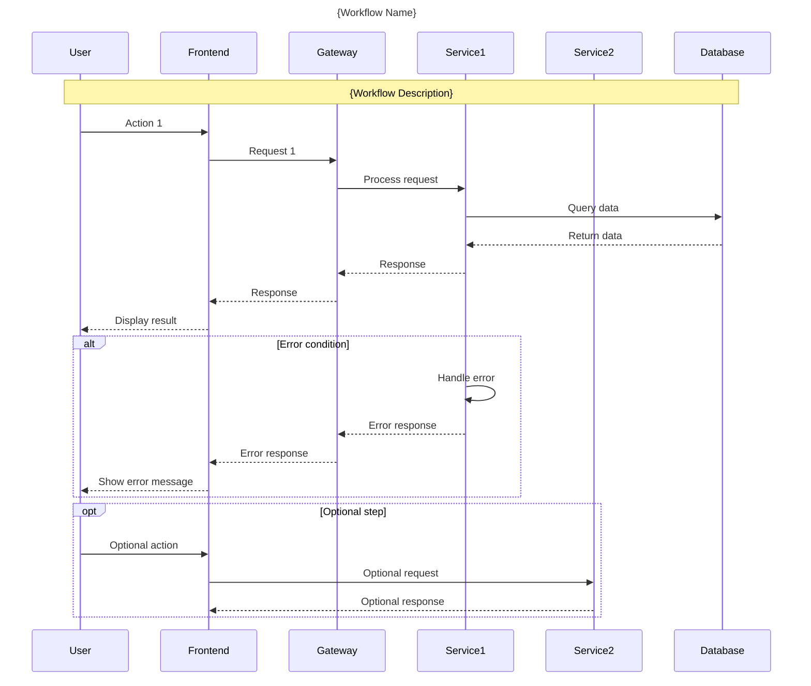

# Workflow Review & Release Prompt

**Version**: 1.0  
**Last Updated**: 2026-01-31  
**Purpose**: Single prompt/process for reviewing and releasing any workflow documentation

---

## How to use this doc

**Prompt to give AI / yourself:**

> Follow **docs/07-development/standards/workflow-review-release-prompt.md** and run the process for workflow **`<workflowName>`** in category **`<category>`**.

Replace `<workflowName>` with the actual workflow (e.g. `browse-to-purchase`, `order-fulfillment`, `complete-order-flow`) and `<category>` with the workflow category (e.g. `customer-journey`, `operational-flows`, `integration-flows`, `sequence-diagrams`).

---

## Standards (read first)

Before any workflow documentation change, apply these docs in order:

1. **[Documentation Standards](./documentation-standards.md)** — Writing style, structure, formatting, diagrams.
2. **[Workflow Documentation Guide](./workflow-documentation-guide.md)** — Flow descriptions, sequence diagrams, integration patterns.
3. **[Business Process Review Checklist](./business-process-review-checklist.md)** — Accuracy, completeness, stakeholder alignment.

---

## Process for `workflowName` in `category`

Use this process for the workflow identified by **`workflowName`** in category **`category`**.  
Paths and commands below use these variables; replace them with the real workflow and category names.

### 1. Index & review workflow documentation

- Index and understand the **`workflowName`** workflow: file `docs/05-workflows/{category}/{workflowName}.md` or `.mmd`.
- Review documentation structure: overview, participants, steps, decision points, error handling, integrations.
- Validate against business requirements and current system implementation.
- List any **P0 / P1 / P2** issues (Critical / High / Medium priority).

### 2. Workflow categories and validation

#### 2.1 Customer Journey Workflows
For workflows in **`customer-journey/`**:
- **User experience flow**: Clear step-by-step user actions
- **System interactions**: Backend services involved at each step
- **Decision points**: User choices and system validations
- **Error scenarios**: What happens when things go wrong
- **Success criteria**: How to measure workflow completion

#### 2.2 Operational Flows
For workflows in **`operational-flows/`**:
- **Business process**: Clear operational procedures
- **Role responsibilities**: Who does what at each step
- **System automation**: Automated vs manual steps
- **Approval workflows**: Required approvals and escalations
- **SLA requirements**: Time constraints and performance targets

#### 2.3 Integration Flows
For workflows in **`integration-flows/`**:
- **Service interactions**: Which services communicate
- **Data flow**: What data is exchanged
- **Event patterns**: Synchronous vs asynchronous communication
- **Error handling**: Retry logic, circuit breakers, fallbacks
- **Monitoring**: How to track integration health

#### 2.4 Sequence Diagrams
For workflows in **`sequence-diagrams/`**:
- **Mermaid syntax**: Valid mermaid diagram syntax
- **Participant clarity**: Clear service/actor names
- **Message flow**: Logical sequence of interactions
- **Error paths**: Alternative flows for failures
- **Timing constraints**: Critical timing requirements

### 3. Checklist & todo for `workflowName`

- Open or create the checklist: **`docs/10-appendix/checklists/v3/{category}_{workflowName}_workflow_checklist_v3.md`**.
- Align items with workflow documentation standards and business requirements.
- Mark completed items; add items for remaining work.
- Save/update the file under `docs/10-appendix/checklists/v3/`.

### 4. Dependencies & integrations

#### 4.1 Service dependencies
- **Identify services**: List all services involved in the workflow
- **Verify APIs**: Ensure API contracts match workflow steps
- **Check versions**: Validate service versions support required features
- **Integration points**: Document all service-to-service interactions

#### 4.2 External dependencies
- **Third-party services**: Payment gateways, shipping providers, etc.
- **External APIs**: Rate limits, authentication, error handling
- **Data sources**: External databases, file systems, message queues
- **Infrastructure**: Load balancers, CDNs, caching layers

### 5. Validation & testing

#### 5.1 Workflow accuracy
- **Business validation**: Confirm workflow matches business requirements
- **Technical validation**: Verify technical implementation aligns with documentation
- **Stakeholder review**: Get approval from business stakeholders
- **End-to-end testing**: Validate complete workflow execution

#### 5.2 Documentation quality
- **Clarity**: Easy to understand for target audience
- **Completeness**: All steps and scenarios covered
- **Consistency**: Terminology and format consistent across docs
- **Visual aids**: Diagrams support text descriptions

### 6. Documentation structure

#### 6.1 Workflow Document Template

Use this template for **`docs/05-workflows/{category}/{workflowName}.md`**:

```markdown
# {WorkflowName} Workflow

**Version**: 1.0  
**Last Updated**: YYYY-MM-DD  
**Category**: {Category}  
**Status**: [Active/Draft/Deprecated]

## Overview

Brief description of the workflow purpose and business value.

## Participants

### Primary Actors
- **Actor 1**: Role and responsibilities
- **Actor 2**: Role and responsibilities

### Systems/Services
- **Service 1**: Purpose in this workflow
- **Service 2**: Purpose in this workflow

## Prerequisites

### Business Prerequisites
- Required business conditions
- Necessary approvals or setup

### Technical Prerequisites
- System requirements
- Data requirements
- Configuration needs

## Workflow Steps

### Main Flow

1. **Step 1**: Description
   - **Actor**: Who performs this step
   - **System**: Which system is involved
   - **Input**: Required data/conditions
   - **Output**: Expected result
   - **Duration**: Expected time to complete

2. **Step 2**: Description
   - **Actor**: Who performs this step
   - **System**: Which system is involved
   - **Input**: Required data/conditions
   - **Output**: Expected result
   - **Duration**: Expected time to complete

### Alternative Flows

#### Alternative Flow 1: {Scenario Name}
**Trigger**: When this alternative flow is triggered
**Steps**:
1. Alternative step 1
2. Alternative step 2
3. Return to main flow or end

#### Alternative Flow 2: {Scenario Name}
**Trigger**: When this alternative flow is triggered
**Steps**:
1. Alternative step 1
2. Alternative step 2
3. Return to main flow or end

### Error Handling

#### Error Scenario 1: {Error Type}
**Trigger**: What causes this error
**Impact**: Business impact of the error
**Resolution**:
1. Immediate actions
2. Recovery steps
3. Prevention measures

#### Error Scenario 2: {Error Type}
**Trigger**: What causes this error
**Impact**: Business impact of the error
**Resolution**:
1. Immediate actions
2. Recovery steps
3. Prevention measures

## Business Rules

### Validation Rules
- Rule 1: Description and enforcement point
- Rule 2: Description and enforcement point

### Business Constraints
- Constraint 1: Description and rationale
- Constraint 2: Description and rationale

## Integration Points

### Service Integrations
| Service | Integration Type | Purpose | Error Handling |
|---------|------------------|---------|----------------|
| Service1 | Synchronous API | Purpose | Retry logic |
| Service2 | Event-driven | Purpose | Dead letter queue |

### External Integrations
| External System | Integration Type | Purpose | SLA |
|-----------------|------------------|---------|-----|
| Payment Gateway | REST API | Process payments | 99.9% |
| Shipping Provider | Webhook | Track shipments | 99.5% |

## Performance Requirements

### Response Times
- Step 1: < 2 seconds
- Step 2: < 5 seconds
- End-to-end: < 30 seconds

### Throughput
- Peak load: X transactions per minute
- Average load: Y transactions per minute

### Availability
- Target uptime: 99.9%
- Maximum downtime: 8.76 hours per year

## Monitoring & Metrics

### Key Metrics
- **Success rate**: Percentage of successful completions
- **Completion time**: Average time to complete workflow
- **Error rate**: Percentage of failed attempts
- **Abandonment rate**: Percentage of incomplete workflows

### Alerts
- **Critical**: Workflow success rate < 95%
- **Warning**: Average completion time > SLA
- **Info**: Error rate trending upward

### Dashboards
- Business metrics dashboard
- Technical performance dashboard
- Error tracking dashboard

## Testing Strategy

### Test Scenarios
1. **Happy path**: Normal successful completion
2. **Edge cases**: Boundary conditions and limits
3. **Error scenarios**: Various failure modes
4. **Performance**: Load and stress testing

### Test Data
- Required test data sets
- Data setup procedures
- Data cleanup procedures

## Troubleshooting

### Common Issues
- **Issue 1**: Symptoms, causes, and resolution
- **Issue 2**: Symptoms, causes, and resolution

### Debug Procedures
1. Initial diagnosis steps
2. Log analysis procedures
3. System health checks
4. Escalation procedures

## Changelog

### Version 1.0 (YYYY-MM-DD)
- Initial workflow documentation
- Added error handling scenarios
- Defined performance requirements

## References

- [Related Workflows](./related-workflow.md)
- [API Documentation](../04-apis/related-api.md)
- [Service Documentation](../03-services/related-service.md)
- [Sequence Diagrams](../sequence-diagrams/related-diagram.mmd)
```

#### 6.2 Sequence Diagram Template

For **`.mmd`** files in **`sequence-diagrams/`**, use this structure:



#### 6.3 README.md Updates

Update category **`README.md`** files to include the new/updated workflow:

```markdown
# {Category} Workflows

## Overview
Description of this workflow category.

## Workflows

### Active Workflows
- **[{WorkflowName}](./{workflowName}.md)** - Brief description
- **[Other Workflow](./other-workflow.md)** - Brief description

### Draft Workflows
- **[Draft Workflow](./draft-workflow.md)** - Brief description

## Quick Reference

### Common Patterns
- Pattern 1: Description
- Pattern 2: Description

### Integration Points
- Service integrations used across workflows
- Common external dependencies

## Related Documentation
- [Service Documentation](../03-services/)
- [API Documentation](../04-apis/)
```

### 7. Validation & review

#### 7.1 Technical validation
- **Mermaid diagrams**: Validate syntax using mermaid CLI or online editor
- **Links**: Check all internal and external links work
- **Code examples**: Verify any code snippets are accurate
- **API references**: Ensure API calls match current service contracts

#### 7.2 Business validation
- **Stakeholder review**: Get approval from business owners
- **Process accuracy**: Confirm workflow matches actual business process
- **Compliance**: Ensure workflow meets regulatory requirements
- **User experience**: Validate from end-user perspective

### 8. Commit & release

- Commit with conventional commits: `docs(workflows): update {workflowName} workflow`, `feat(workflows): add {workflowName} workflow`.
- If this is a **major workflow update**: create a new Git tag (e.g. `workflows-v1.2.0`) and push:
  - `git tag -a workflows-v1.2.0 -m "workflows-v1.2.0: {workflowName} workflow updates"`
  - `git push origin main && git push origin workflows-v1.2.0`
- If **minor update**: push branch only: `git push origin <branch>`.

---

## Summary

- **Prompt**: "Follow docs/07-development/standards/workflow-review-release-prompt.md and run the process for workflow **`<workflowName>`** in category **`<category>`**."
- **Process**: Index → review workflow documentation → validate by category → checklist v3 for workflow → check dependencies → validate accuracy → update documentation structure → technical validation → business validation → commit → tag (if major release) → push.
