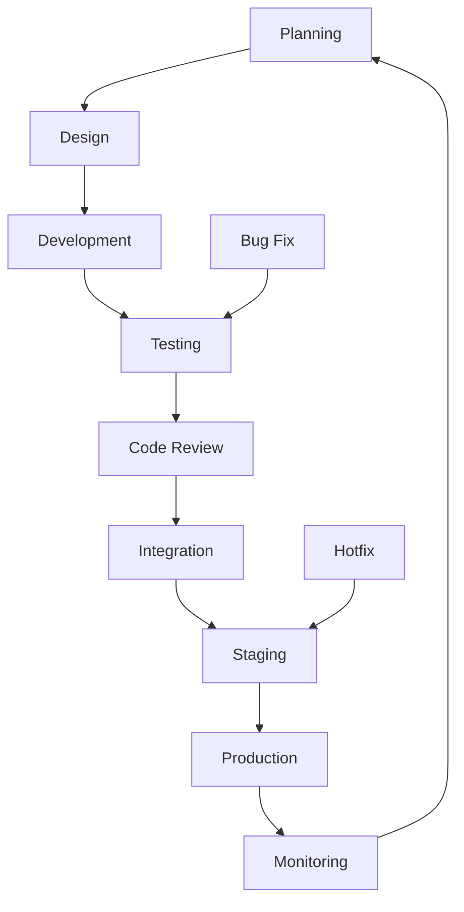

# Development Workflows

**Purpose**: Standardized workflows for development processes  
**Audience**: All developers, tech leads, and release managers  

---

## 🚀 Quick Navigation

### **Core Workflows**
- **[Git Workflow](./git-workflow.md)** - Branching strategy and Git best practices
- **[Feature Development](./feature-development.md)** - End-to-end feature development process
- **[Release Process](./release-process.md)** - Release and deployment workflow
- **[Hotfix Process](./hotfix-process.md)** - Emergency fix procedures

### **Quality Workflows**
- **[Code Review Process](./code-review-process.md)** - Code review standards and procedures
- **[Testing Workflow](./testing-workflow.md)** - Testing strategies and processes
- **[Bug Fix Process](./bug-fix-process.md)** - Bug fixing workflow
- **[Documentation Process](./documentation-process.md)** - Documentation standards

---

## 🎯 Workflow Philosophy

Our development workflows are designed to ensure:

### **Quality & Reliability**
- ✅ Code reviews for all changes
- ✅ Comprehensive testing requirements
- ✅ Automated quality checks
- ✅ Staged deployment process

### **Collaboration & Communication**
- ✅ Clear processes and responsibilities
- ✅ Regular team synchronization
- ✅ Knowledge sharing and documentation
- ✅ Constructive feedback culture

### **Efficiency & Velocity**
- ✅ Streamlined processes
- ✅ Automated tooling where possible
- ✅ Clear decision points
- ✅ Minimal bottlenecks

---

## 🔄 Development Lifecycle

### Phase Descriptions

#### **1. Planning**
- Requirements analysis
- Technical design
- Resource estimation
- Risk assessment

#### **2. Design**
- Architecture decisions
- API design
- Database schema
- Security considerations

#### **3. Development**
- Feature implementation
- Unit testing
- Documentation
- Code quality checks

#### **4. Testing**
- Integration testing
- Performance testing
- Security testing
- User acceptance testing

#### **5. Code Review**
- Peer review process
- Architecture review (if needed)
- Security review (if needed)
- Documentation review

#### **6. Integration**
- Merge to integration branch
- Automated testing
- System integration
- Performance validation

#### **7. Staging**
- Deploy to staging
- End-to-end testing
- User acceptance testing
- Performance validation

#### **8. Production**
- Deploy to production
- Monitoring setup
- Rollback preparation
- Success validation

#### **9. Monitoring**
- Performance monitoring
- Error tracking
- User feedback
- Continuous improvement

---

## 📋 Workflow Selection Guide

### **Choose Your Workflow**

#### **New Feature Development**
📖 **[Feature Development](./feature-development.md)**
- Use for: New features, enhancements, major changes
- Timeframe: Days to weeks
- Process: Planning → Design → Development → Review → Deploy

#### **Bug Fixes**
📖 **[Bug Fix Process](./bug-fix-process.md)**
- Use for: Non-critical bugs, improvements
- Timeframe: Hours to days
- Process: Analysis → Fix → Test → Deploy

#### **Critical Issues**
📖 **[Hotfix Process](./hotfix-process.md)**
- Use for: Production outages, security issues
- Timeframe: Minutes to hours
- Process: Emergency fix → Quick test → Immediate deploy

#### **Regular Releases**
📖 **[Release Process](./release-process.md)**
- Use for: Scheduled releases, version updates
- Timeframe: Weekly/Bi-weekly
- Process: Preparation → Testing → Release → Validation

---

## 🎯 Role Responsibilities

### **Developers**
- Follow established workflows
- Write quality code and tests
- Participate in code reviews
- Document changes
- Monitor production issues

### **Tech Leads**
- Review architecture and design
- Mentor developers
- Ensure quality standards
- Resolve technical conflicts
- Approve significant changes

### **QA Engineers**
- Develop test strategies
- Execute test plans
- Report and track bugs
- Validate fixes
- Ensure quality standards

### **DevOps Engineers**
- Maintain CI/CD pipelines
- Monitor infrastructure
- Handle deployments
- Manage environments
- Ensure reliability

### **Product Managers**
- Define requirements
- Prioritize features
- Coordinate releases
- Gather user feedback
- Manage product roadmap

---

## 📊 Workflow Metrics

### **Quality Metrics**
- **Code Review Coverage**: 100% of changes reviewed
- **Test Coverage**: 80%+ for business logic
- **Defect Rate**: < 5% of changes require fixes
- **Rollback Rate**: < 1% of deployments

### **Velocity Metrics**
- **Lead Time**: < 2 days from start to production
- **Cycle Time**: < 1 day from PR to merge
- **Deployment Frequency**: Multiple times per day
- **Recovery Time**: < 1 hour for production issues

### **Collaboration Metrics**
- **Review Response Time**: < 4 hours
- **PR Merge Time**: < 24 hours
- **Knowledge Sharing**: Regular documentation updates
- **Team Satisfaction**: Regular feedback surveys

---

## 🔧 Tools & Integration

### **Development Tools**
- **GitLab**: Code repository, CI/CD, code review
- **VS Code/GoLand**: IDE with extensions
- **Docker**: Local development environment
- **Tilt**: Hot reload and orchestration

### **Quality Tools**
- **golangci-lint**: Code quality and linting
- **SonarQube**: Code analysis and quality metrics
- **Postman/Insomnia**: API testing
- **Jest/Go Test**: Unit and integration testing

### **Collaboration Tools**
- **Slack**: Team communication
- **Miro/Jira**: Project management
- **Confluence**: Documentation and knowledge sharing
- **GitLab Issues**: Bug tracking and feature requests

### **Monitoring Tools**
- **Prometheus/Grafana**: Metrics and monitoring
- **Jaeger**: Distributed tracing
- **ELK Stack**: Logging and log analysis
- **Sentry**: Error tracking and alerting

---

## 🔄 Continuous Improvement

### **Regular Reviews**
- **Monthly**: Workflow efficiency review
- **Quarterly**: Process optimization
- **Semi-annually**: Tool evaluation
- **Annually**: Major process updates

### **Feedback Loops**
- **Retrospectives**: Regular team retrospectives
- **Surveys**: Team satisfaction surveys
- **Metrics Review**: Performance metric analysis
- **Process Audits**: Regular workflow audits

### **Improvement Process**
1. **Identify Issues**: Recognize workflow problems
2. **Analyze Root Cause**: Understand underlying issues
3. **Propose Solutions**: Suggest improvements
4. **Test Changes**: Pilot new processes
5. **Implement**: Roll out successful changes
6. **Monitor**: Track improvement effectiveness

---

## 📚 Learning Resources

### **Internal Resources**
- **[Architecture Decisions](../../08-architecture-decisions/README.md)**: Technical decisions
- **[Development Standards](../standards/README.md)**: Coding standards
- **[Service Documentation](../../03-services/README.md)**: Service implementations
- **[Platform Engineering](../standards/platform-engineering/README.md)**: Advanced patterns

### **External Resources**
- **[DevOps Handbook](https://itrevolution.com/the-devops-handbook/)**: DevOps practices
- **[Continuous Delivery](https://continuousdelivery.com/)**: Deployment strategies
- **[Lean Software Development](https://leanpub.com/leansoftwaredevelopment)**: Lean principles
- **[Accelerate](https://itrevolution.com/the-technology-leaders-manual/)**: Science of DevOps

---

## 🆘 Getting Help

### **Immediate Support**
- **Slack #workflows**: Workflow-specific questions
- **Tech Lead**: Process and technical questions
- **Scrum Master**: Process improvement suggestions
- **Team Lead**: Team-specific workflow issues

### **Escalation Path**
1. **Team Discussion**: Discuss with immediate team
2. **Tech Lead**: Technical workflow questions
3. **Engineering Manager**: Process and policy questions
4. **Architecture Board**: Major workflow changes

### **Documentation**
- **Process Wiki**: Internal process documentation
- **Decision Log**: Workflow change decisions
- **Best Practices**: Team best practices
- **Troubleshooting**: Common workflow issues

---

**Last Updated**: February 3, 2026  
**Review Cycle**: Monthly or when processes change  
**Maintained By**: Engineering Leadership Team
