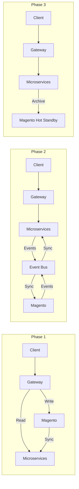

# 🛍️ Magento to Microservices Migration Guide

**Purpose**: Complete migration from Magento to new microservices platform  
**Last Updated**: 2026-02-03  
**Status**: ✅ Ready for implementation

---

## 📋 Overview

This guide provides a comprehensive **3-phase migration approach** for migrating from Magento to the new microservices platform. It focuses on **zero-downtime migration** with **gradual cutover** and **automatic rollback** capabilities.

### 🎯 Migration Scope

#### **Magento Modules to Microservices**
- **Catalog Management** → [Catalog Service](../../03-services/catalog/)
- **Customer Management** → [Customer Service](../../03-services/customer/)
- **Order Management** → [Order Service](../../03-services/order/)
- **Payment Processing** → [Payment Service](../../03-services/payment/)
- **Shipping & Fulfillment** → [Fulfillment Service](../../03-services/fulfillment/)
- **Product Reviews** → [Review Service](../../03-services/review/)
- **Search & Navigation** → [Search Service](../../03-services/search/)
- **Promotions & Coupons** → [Promotion Service](../../03-services/promotion/)
- **Loyalty & Rewards** → [Loyalty Service](../../03-services/loyalty-rewards/)
- **Inventory / Stock** → [Warehouse Service](../../03-services/warehouse/)

> [!WARNING]
> **This migration has 3 non-trivial technical challenges** that must be addressed before starting:
> 1. **EAV schema** — Magento stores attributes (firstname, price, description…) in `*_varchar`, `*_int`, `*_decimal` sub-tables. Naive `SELECT *` queries will be missing all attributes. See `data-migration-guide.md` Step 1.2.
> 2. **Integer → UUID ID mapping** — Magento uses `entity_id` (int), microservices use UUIDs. A `magento_id_map` cross-reference table must be established before any data is migrated. See `data-migration-guide.md` Step 1.4.
> 3. **True CDC vs. polling** — Real-time sync uses Debezium (MySQL binlog), NOT `updated_at` polling. Polling misses DELETEs and is clock-skew sensitive. See `sync-service-implementation.md`.

---

## 🎯 Migration Strategy

### **3-Phase Approach**
1. **Phase 1: Read-Only Migration** - Gateway-level smart routing
2. **Phase 2: Read-Write Migration** - Gradual dual-write with event bus
3. **Phase 3: Full Cutover** - Gradual service migration with hot standby

### **Migration Principles**
- **Zero Downtime**: Maintain business continuity throughout migration
- **Data Integrity**: Ensure no data loss with real-time synchronization
- **Easy Rollback**: Instant fallback via feature flags
- **Performance Improvement**: Better performance and scalability
- **Risk Mitigation**: Gradual migration with comprehensive monitoring

---

## 📚 Available Migration Guides

### **🚀 Phase-by-Phase Documentation**

#### **[Phase 1: Read-Only Migration](./phase-1-read-only.md)**
- **Smart Routing**: API Gateway routes read APIs to microservices
- **Real-time CDC**: Debezium MySQL binlog sync (Magento → Microservices)
- **Automatic Fallback**: Feature flags disable on failures
- **Zero Risk**: Magento remains source of truth for writes

#### **[Phase 2: Read-Write Migration](./phase-2-read-write.md)**
- **Gradual Dual-Write**: Enable write APIs by service (Customer → Catalog → Order)
- **Dapr Pub/Sub Sync**: Bidirectional sync via platform event bus (no separate Kafka)
- **Timestamp Conflict Resolution**: Newer write wins per entity type
- **Rollback**: Feature flag disable reverts to Magento in < 10s

#### **[Phase 3: Full Cutover](./phase-3-full-cutover.md)**
- **Gradual Service Migration**: 100% traffic by service (Week 1-6)
- **Magento Hot Standby**: Keep Magento for 1-month rollback window
- **Archive Service**: Final data sync to Magento
- **Performance Optimization**: Remove dual-write overhead

### **📋 Implementation Guides**

#### **[Step-by-Step Migration](./step-by-step-migration.md)**
- **Detailed Procedures**: Step-by-step implementation for each phase
- **Code Examples**: Complete implementation examples
- **Validation Scripts**: Data consistency and performance validation
- **Troubleshooting**: Common issues and solutions

#### **[Data Migration Guide](./data-migration-guide.md)**
- **Data Extraction**: Scripts to extract data from Magento
- **Data Transformation**: Convert data formats and structures
- **Real-time Sync**: CDC implementation for continuous sync
- **Data Validation**: Ensure data integrity and consistency

#### **[Sync Service Implementation](./sync-service-implementation.md)**
- **CDC Engine**: Change Data Capture implementation
- **Real-time Sync**: 1-second interval synchronization
- **Error Handling**: Retry logic and error recovery
- **Monitoring**: Metrics, health checks, and performance tuning

---

## 🏗️ Architecture Overview

---

## � Migration Timeline

### **Phase 1: Read-Only Migration (2-3 weeks)**
- **Week 1**: Deploy microservices and sync service
- **Week 2**: Configure gateway routing and feature flags
- **Week 3**: Validate and monitor read operations

### **Phase 2: Read-Write Migration (4-6 weeks)**
- **Week 1-2**: Customer service write migration
- **Week 3-4**: Catalog service write migration
- **Week 5-6**: Order service write migration

### **Phase 3: Full Cutover (8-10 weeks)**
- **Week 1-2**: Customer service 100% cutover
- **Week 3-4**: Catalog service 100% cutover
- **Week 5-6**: Order service gradual cutover
- **Week 7-8**: Performance optimization
- **Month 2**: Magento decommissioning

---

## 🎯 Success Metrics

### **Technical Metrics**
- **Zero Downtime**: 99.9%+ uptime during migration
- **Data Consistency**: < 2 seconds lag for critical data
- **Performance**: < 300ms response time for all operations
- **Rollback Time**: < 5 minutes to fallback to Magento

### **Business Metrics**
- **Revenue Impact**: No negative impact on revenue
- **Customer Experience**: Maintain or improve satisfaction
- **Feature Parity**: 100% functionality coverage
- **Cost Efficiency**: Reduced infrastructure costs

---

## 🚀 Quick Start

### **For Migration Team**
1. **[Phase 1](./phase-1-read-only.md)** - Start with read-only migration
2. **[Step-by-Step Guide](./step-by-step-migration.md)** - Follow detailed procedures
3. **[Monitoring Setup](./phase-1-read-only.md#-monitoring-validation)** - Implement monitoring
4. **[Rollback Procedures](./phase-1-read-only.md#-rollback-procedures)** - Prepare rollback

### **For Development Team**
1. **[Service Documentation](../../03-services/)** - Review individual services
2. **[API Documentation](../../04-apis/README.md)** - Understand API specifications
3. **[Development Standards](../../07-development/README.md)** - Follow coding standards

---

## 📞 Support & Resources

### **Documentation**
- **[Architecture](../../01-architecture/README.md)** - System architecture
- **[Operations](../../06-operations/README.md)** - Platform operations
- **[Development](../../07-development/README.md)** - Development standards

### **Communication Channels**
- **Migration Status**: #magento-migration
- **Issues**: #migration-issues
- **Emergency**: #migration-emergency

### **Team Contacts**
- **Migration Lead**: migration-lead@company.com
- **Infrastructure**: infra-team@company.com
- **Database**: dba-team@company.com

---

## 🔗 Related Documentation

### **Platform Documentation**
- **[Services](../../03-services/README.md)** - Individual service details
- **[APIs](../../04-apis/README.md)** - API specifications
- **[Operations](../../06-operations/README.md)** - Platform operations

### **Migration Documentation**
- **[General Migration](../README.md)** - Other migration guides
- **[K8S Migration](../K8S_MIGRATION_QUICK_GUIDE.md)** - Kubernetes migration

---

**Last Updated**: 2026-02-21  
**Review Cycle**: Weekly during active migration  
**Maintained By**: Migration Team & Platform Engineering
