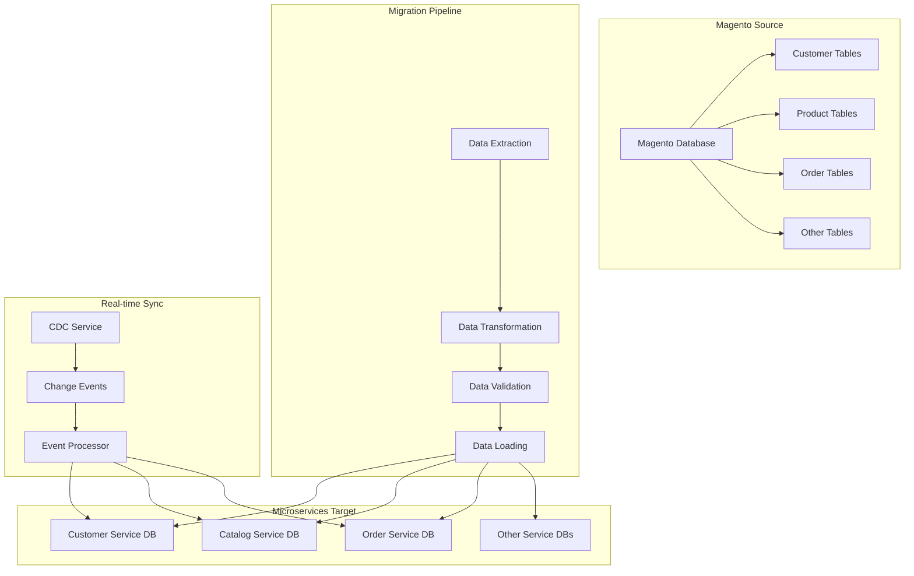

# 📊 Data Migration Guide

**Purpose**: Complete data migration procedures from Magento to microservices  
**Last Updated**: 2026-02-03  
**Status**: ✅ Ready for implementation

---

## 📋 Overview

This guide provides comprehensive procedures for migrating data from Magento to the new microservices platform. It covers data extraction, transformation, validation, and loading procedures for all data types.

---

## 🎯 Data Migration Scope

### **Magento Tables to Microservices**

| Magento Table | Microservices Service | Data Type | Priority |
|---------------|---------------------|-----------|----------|
| `customer_entity` + EAV sub-tables | Customer Service | Customer Data | High |
| `customer_address_entity` + EAV sub-tables | Customer Service | Address Data | High |
| `catalog_product_entity` + EAV sub-tables | Catalog Service | Product Data | High |
| `catalog_category_entity` + EAV sub-tables | Catalog Service | Category Data | High |
| `sales_order` + `sales_order_payment` | Order Service | Order Data | High |
| `sales_order_item` | Order Service | Order Items | High |
| `cataloginventory_stock_item` | Warehouse Service | Stock Levels | High |
| `salesrule` + `salesrule_coupon` | Promotion Service | Coupons/Promotions | High |
| `sales_creditmemo` | Payment Service | Refund History | Medium |
| `magento_reward` | Loyalty Service | Loyalty Points | Medium |
| `wishlist` + `wishlist_item` | Customer Service | Wishlist Data | Medium |
| `review` + `rating_option_vote` | Review Service | Review Data | Medium |
| `newsletter_subscriber` | Customer Service | Newsletter Data | Low |

> [!IMPORTANT]
> **ID Mapping Required**: Magento uses auto-increment integers as primary keys. Microservices use UUIDs. A cross-reference table (`magento_id_map`) **must be created before any data migration** to track the mapping. See [Section 1.4 Identity Mapping](#step-14-identity-mapping) below.

> [!WARNING]
> **EAV Complexity**: Magento Customer, Product, and Category entities use an Entity-Attribute-Value (EAV) schema. Attributes such as `firstname`, `lastname`, `price`, `description` are NOT in the main entity table — they are spread across `*_varchar`, `*_int`, `*_decimal`, `*_datetime`, `*_text` sub-tables keyed by `attribute_id`. The transformation scripts below handle this correctly by joining all sub-tables.

---

## 🏗️ Data Migration Architecture



---

## 🚀 Phase 1: Initial Data Migration

### **Step 1.1: Data Extraction**

#### **Customer Data Extraction**
```bash
#!/bin/bash
# extract-customer-data.sh

# Configuration — load from environment (set by K8s Job + Secret)
# Secret ref: kubectl create secret generic magento-db-creds \
#   --from-literal=host=magento-db.production.svc.cluster.local \
#   --from-literal=user=magento_user \
#   --from-literal=password=<actual-password> \
#   --from-literal=dbname=magento_db
MAGENTO_DB_HOST="${MAGENTO_DB_HOST}"
MAGENTO_DB_USER="${MAGENTO_DB_USER}"
MAGENTO_DB_PASS="${MAGENTO_DB_PASS}"
MAGENTO_DB_NAME="${MAGENTO_DB_NAME}"
EXTRACT_DIR="customer-extracts"

# Create extract directory
mkdir -p $EXTRACT_DIR

echo "Extracting customer data from Magento..."

# Extract customer entities
mysqldump -h $MAGENTO_DB_HOST -u $MAGENTO_DB_USER -p$MAGENTO_DB_PASS $MAGENTO_DB_NAME \
  --single-transaction \
  --routines \
  --triggers \
  --where="created_at >= '2020-01-01'" \
  customer_entity \
  customer_entity_varchar \
  customer_entity_int \
  customer_entity_decimal \
  customer_entity_datetime \
  customer_entity_text \
  > $EXTRACT_DIR/customer_entities.sql

# Extract customer addresses
mysqldump -h $MAGENTO_DB_HOST -u $MAGENTO_DB_USER -p$MAGENTO_DB_PASS $MAGENTO_DB_NAME \
  --single-transaction \
  --routines \
  --triggers \
  customer_address_entity \
  customer_address_entity_varchar \
  customer_address_entity_int \
  customer_address_entity_decimal \
  customer_address_entity_datetime \
  customer_address_entity_text \
  > $EXTRACT_DIR/customer_addresses.sql

# Extract customer groups
mysqldump -h $MAGENTO_DB_HOST -u $MAGENTO_DB_USER -p$MAGENTO_DB_PASS $MAGENTO_DB_NAME \
  --single-transaction \
  customer_group \
  > $EXTRACT_DIR/customer_groups.sql

echo "Customer data extraction completed"
```

#### **Product Data Extraction**
```bash
#!/bin/bash
# extract-product-data.sh

echo "Extracting product data from Magento..."

# Extract product entities
mysqldump -h $MAGENTO_DB_HOST -u $MAGENTO_DB_USER -p$MAGENTO_DB_PASS $MAGENTO_DB_NAME \
  --single-transaction \
  --routines \
  --triggers \
  catalog_product_entity \
  catalog_product_entity_varchar \
  catalog_product_entity_int \
  catalog_product_entity_decimal \
  catalog_product_entity_datetime \
  catalog_product_entity_text \
  > product-extracts/catalog_products.sql

# Extract categories
mysqldump -h $MAGENTO_DB_HOST -u $MAGENTO_DB_USER -p$MAGENTO_DB_PASS $MAGENTO_DB_NAME \
  --single-transaction \
  catalog_category_entity \
  catalog_category_entity_varchar \
  catalog_category_entity_int \
  catalog_category_entity_decimal \
  catalog_category_entity_datetime \
  catalog_category_entity_text \
  > product-extracts/catalog_categories.sql

echo "Product data extraction completed"
```

#### **Order Data Extraction**
```bash
#!/bin/bash
# extract-order-data.sh

echo "Extracting order data from Magento..."

# Extract orders
mysqldump -h $MAGENTO_DB_HOST -u $MAGENTO_DB_USER -p$MAGENTO_DB_PASS $MAGENTO_DB_NAME \
  --single-transaction \
  --routines \
  --triggers \
  sales_order \
  sales_order_grid \
  > order-extracts/sales_orders.sql

# Extract order items
mysqldump -h $MAGENTO_DB_HOST -u $MAGENTO_DB_USER -p$MAGENTO_DB_PASS $MAGENTO_DB_NAME \
  --single-transaction \
  sales_order_item \
  > order-extracts/sales_order_items.sql

echo "Order data extraction completed"
```

### **Step 1.2: Data Transformation**

> [!IMPORTANT]
> The queries below use proper EAV joins to retrieve Magento attributes. Never use `GROUP_CONCAT` with hardcoded attribute IDs — attribute IDs differ between Magento installations. Always look up IDs via `eav_attribute` first.

#### **Customer Data Transformation**
```javascript
// transform-customer-data.js
// Credentials loaded from environment variables (set by K8s Secret + Job spec)
const mysql = require('mysql2/promise');
const { v4: uuidv4 } = require('uuid');

class CustomerDataTransformer {
    constructor() {
        this.magentoConnection = null;
        this.microConnection = null;
        this.attrMap = {}; // attribute_code → attribute_id map
    }

    async init() {
        this.magentoConnection = await mysql.createConnection({
            host: process.env.MAGENTO_DB_HOST,
            user: process.env.MAGENTO_DB_USER,
            password: process.env.MAGENTO_DB_PASS,
            database: process.env.MAGENTO_DB_NAME
        });
        this.microConnection = await mysql.createConnection({
            host: process.env.MICRO_DB_HOST,
            user: process.env.MICRO_DB_USER,
            password: process.env.MICRO_DB_PASS,
            database: process.env.MICRO_DB_NAME
        });
        await this.loadAttributeMap();
    }

    // Resolve attribute_code → attribute_id dynamically (safe across Magento versions)
    async loadAttributeMap() {
        const [rows] = await this.magentoConnection.execute(`
            SELECT attribute_id, attribute_code
            FROM eav_attribute
            WHERE entity_type_id = (
                SELECT entity_type_id FROM eav_entity_type WHERE entity_type_code = 'customer'
            )
        `);
        for (const row of rows) {
            this.attrMap[row.attribute_code] = row.attribute_id;
        }
    }

    async transformCustomers() {
        console.log('Transforming customer data (full EAV join)...');

        // Pull all EAV varchar + int attributes in one query via PIVOT-style subqueries
        const [rows] = await this.magentoConnection.execute(`
            SELECT
                ce.entity_id,
                ce.website_id,
                ce.email,
                ce.created_at,
                ce.updated_at,
                ce.is_active,
                MAX(CASE WHEN cev.attribute_id = ? THEN cev.value END) AS firstname,
                MAX(CASE WHEN cev.attribute_id = ? THEN cev.value END) AS lastname,
                MAX(CASE WHEN cev.attribute_id = ? THEN cev.value END) AS middlename,
                MAX(CASE WHEN cev.attribute_id = ? THEN cev.value END) AS prefix,
                MAX(CASE WHEN cev.attribute_id = ? THEN cev.value END) AS suffix,
                MAX(CASE WHEN cevt.attribute_id = ? THEN cevt.value END) AS dob,
                MAX(CASE WHEN cevi.attribute_id = ? THEN cevi.value END) AS gender
            FROM customer_entity ce
            LEFT JOIN customer_entity_varchar cev  ON ce.entity_id = cev.entity_id
            LEFT JOIN customer_entity_datetime cevt ON ce.entity_id = cevt.entity_id
            LEFT JOIN customer_entity_int cevi      ON ce.entity_id = cevi.entity_id
            WHERE ce.created_at >= '2020-01-01'
            GROUP BY ce.entity_id
            ORDER BY ce.entity_id
        `, [
            this.attrMap['firstname'],
            this.attrMap['lastname'],
            this.attrMap['middlename'],
            this.attrMap['prefix'],
            this.attrMap['suffix'],
            this.attrMap['dob'],
            this.attrMap['gender'],
        ]);

        const transformedCustomers = [];
        for (const row of rows) {
            // Look up UUID from identity map (created in Step 1.4)
            const uuid = await this.lookupOrCreateUUID('customer', row.entity_id);
            transformedCustomers.push({
                id: uuid,
                magento_id: row.entity_id,
                email: row.email,
                firstName: row.firstname || '',
                lastName: row.lastname || '',
                middleName: row.middlename || '',
                prefix: row.prefix || '',
                suffix: row.suffix || '',
                dob: row.dob || null,
                gender: row.gender || null,
                websiteId: row.website_id,
                isActive: row.is_active === 1,
                createdAt: row.created_at,
                updatedAt: row.updated_at,
                source: 'magento'
            });
        }
        return transformedCustomers;
    }

    async lookupOrCreateUUID(entityType, magentoId) {
        const [rows] = await this.microConnection.execute(
            'SELECT new_uuid FROM magento_id_map WHERE entity_type = ? AND magento_id = ?',
            [entityType, magentoId]
        );
        if (rows.length > 0) return rows[0].new_uuid;
        const newUUID = uuidv4();
        await this.microConnection.execute(
            'INSERT INTO magento_id_map (entity_type, magento_id, new_uuid) VALUES (?, ?, ?)',
            [entityType, magentoId, newUUID]
        );
        return newUUID;
    }

    async loadCustomers(customers) {
        console.log(`Loading ${customers.length} customers...`);

        for (const customer of customers) {
            try {
                await this.microConnection.execute(`
                    INSERT INTO customers (
                        id, email, first_name, last_name, middle_name, prefix, suffix,
                        dob, taxvat, gender, website_id, is_active, disable_auto_group_change,
                        created_at, updated_at, source
                    ) VALUES (?, ?, ?, ?, ?, ?, ?, ?, ?, ?, ?, ?, ?, ?, ?, ?)
                    ON DUPLICATE KEY UPDATE
                        email = VALUES(email),
                        first_name = VALUES(first_name),
                        last_name = VALUES(last_name),
                        updated_at = VALUES(updated_at)
                `, [
                    customer.id, customer.email, customer.firstName, customer.lastName,
                    customer.middleName, customer.prefix, customer.suffix,
                    customer.dob, customer.taxvat, customer.gender, customer.websiteId,
                    customer.isActive, customer.disableAutoGroupChange,
                    customer.createdAt, customer.updatedAt, customer.source
                ]);
            } catch (error) {
                console.error(`Failed to load customer ${customer.id}:`, error);
            }
        }
    }

    async loadAddresses(addresses) {
        console.log(`Loading ${addresses.length} addresses...`);

        for (const address of addresses) {
            try {
                await this.microConnection.execute(`
                    INSERT INTO customer_addresses (
                        id, customer_id, first_name, last_name, middle_name, company,
                        street, city, region, region_code, postcode, country,
                        telephone, fax, vat_id, is_active, created_at, updated_at, source
                    ) VALUES (?, ?, ?, ?, ?, ?, ?, ?, ?, ?, ?, ?, ?, ?, ?, ?, ?, ?)
                    ON DUPLICATE KEY UPDATE
                        customer_id = VALUES(customer_id),
                        updated_at = VALUES(updated_at)
                `, [
                    address.id, address.customerId, address.firstName, address.lastName,
                    address.middleName, address.company, JSON.stringify(address.street),
                    address.city, address.region, address.regionCode, address.postcode,
                    address.country, address.telephone, address.fax, address.vatId,
                    address.isActive, address.createdAt, address.updatedAt, address.source
                ]);
            } catch (error) {
                console.error(`Failed to load address ${address.id}:`, error);
            }
        }
    }

    async run() {
        await this.init();
        
        // Transform and load customers
        const customers = await this.transformCustomers();
        await this.loadCustomers(customers);
        
        // Transform and load addresses
        const addresses = await this.transformCustomerAddresses();
        await this.loadAddresses(addresses);
        
        console.log('Customer data transformation completed');
        
        await this.magentoConnection.end();
        await this.microConnection.end();
    }
}

// Run transformation
const transformer = new CustomerDataTransformer();
transformer.run().catch(console.error);
```

#### **Product Data Transformation**
```javascript
// transform-product-data.js
class ProductDataTransformer {
    async transformProducts() {
        console.log('Transforming product data...');

        const [rows] = await this.magentoConnection.execute(`
            SELECT 
                cpe.entity_id,
                cpe.attribute_set_id,
                cpe.type_id,
                cpe.sku,
                cpe.has_options,
                cpe.required_options,
                cpe.created_at,
                cpe.updated_at,
                GROUP_CONCAT(
                    CASE cpev.attribute_id
                        WHEN 73 THEN cpev.value  -- name
                        WHEN 74 THEN cpev.value  -- url_key
                        WHEN 75 THEN cpev.value  -- url_path
                        WHEN 76 THEN cpev.value  -- image
                        WHEN 77 THEN cpev.value  -- small_image
                        WHEN 78 THEN cpev.value  -- thumbnail
                        WHEN 79 THEN cpev.value  -- description
                        WHEN 80 THEN cpev.value  -- short_description
                        WHEN 81 THEN cpev.value  -- meta_title
                        WHEN 82 THEN cpev.value  -- meta_keyword
                        WHEN 83 THEN cpev.value  -- meta_description
                        WHEN 96 THEN cpev.value  -- status
                        WHEN 121 THEN cpev.value -- visibility
                    END
                ) as attributes,
                GROUP_CONCAT(
                    CASE cpei.attribute_id
                        WHEN 60 THEN cpei.value  -- price
                        WHEN 61 THEN cpei.value  -- special_price
                        WHEN 62 THEN cpei.value  -- special_from_date
                        WHEN 63 THEN cpei.value  -- special_to_date
                        WHEN 64 THEN cpei.value  -- cost
                        WHEN 65 THEN cpei.value  -- tier_price
                        WHEN 66 THEN cpei.value  -- msrp
                    END
                ) as prices
            FROM catalog_product_entity cpe
            LEFT JOIN catalog_product_entity_varchar cpev ON cpe.entity_id = cpev.entity_id
            LEFT JOIN catalog_product_entity_decimal cpei ON cpe.entity_id = cpei.entity_id
            GROUP BY cpe.entity_id
            ORDER BY cpe.entity_id
        `);

        const transformedProducts = [];
        
        for (const row of rows) {
            const attributes = this.parseAttributes(row.attributes);
            const prices = this.parsePrices(row.prices);
            
            const product = {
                id: row.entity_id,
                attributeSetId: row.attribute_set_id,
                typeId: row.type_id,
                sku: row.sku,
                name: attributes.name || '',
                urlKey: attributes.url_key || '',
                urlPath: attributes.url_path || '',
                image: attributes.image || '',
                smallImage: attributes.small_image || '',
                thumbnail: attributes.thumbnail || '',
                description: attributes.description || '',
                shortDescription: attributes.short_description || '',
                metaTitle: attributes.meta_title || '',
                metaKeywords: attributes.meta_keyword || '',
                metaDescription: attributes.meta_description || '',
                status: parseInt(attributes.status) || 1,
                visibility: parseInt(attributes.visibility) || 4,
                hasOptions: row.has_options === 1,
                requiredOptions: row.required_options === 1,
                price: parseFloat(prices.price) || 0,
                specialPrice: parseFloat(prices.special_price) || null,
                specialFromDate: prices.special_from_date || null,
                specialToDate: prices.special_to_date || null,
                cost: parseFloat(prices.cost) || 0,
                msrp: parseFloat(prices.msrp) || 0,
                createdAt: row.created_at,
                updatedAt: row.updated_at,
                source: 'magento'
            };

            transformedProducts.push(product);
        }

        return transformedProducts;
    }

    parsePrices(pricesString) {
        if (!pricesString) return {};
        
        const prices = {};
        const parts = pricesString.split(',');
        
        // Simplified parser - in production, you'd need robust parsing
        return prices;
    }

    async loadProducts(products) {
        console.log(`Loading ${products.length} products...`);

        for (const product of products) {
            try {
                await this.microConnection.execute(`
                    INSERT INTO products (
                        id, attribute_set_id, type_id, sku, name, url_key, url_path,
                        image, small_image, thumbnail, description, short_description,
                        meta_title, meta_keywords, meta_description, status, visibility,
                        has_options, required_options, price, special_price,
                        special_from_date, special_to_date, cost, msrp,
                        created_at, updated_at, source
                    ) VALUES (?, ?, ?, ?, ?, ?, ?, ?, ?, ?, ?, ?, ?, ?, ?, ?, ?, ?, ?, ?, ?, ?, ?, ?, ?, ?, ?, ?)
                    ON DUPLICATE KEY UPDATE
                        name = VALUES(name),
                        price = VALUES(price),
                        updated_at = VALUES(updated_at)
                `, [
                    product.id, product.attributeSetId, product.typeId, product.sku,
                    product.name, product.urlKey, product.urlPath, product.image,
                    product.smallImage, product.thumbnail, product.description,
                    product.shortDescription, product.metaTitle, product.metaKeywords,
                    product.metaDescription, product.status, product.visibility,
                    product.hasOptions, product.requiredOptions, product.price,
                    product.specialPrice, product.specialFromDate, product.specialToDate,
                    product.cost, product.msrp, product.createdAt, product.updatedAt,
                    product.source
                ]);
            } catch (error) {
                console.error(`Failed to load product ${product.id}:`, error);
            }
        }
    }
}
```

### **Step 1.3: Data Validation**

#### **Data Validation Script**
```bash
#!/bin/bash
# validate-data-migration.sh

echo "Validating data migration..."

# Validate customer data
echo "Validating customer data..."
MAGENTO_CUSTOMERS=$(mysql -h $MAGENTO_DB_HOST -u $MAGENTO_DB_USER -p$MAGENTO_DB_PASS $MAGENTO_DB_NAME -e "
  SELECT COUNT(*) FROM customer_entity WHERE created_at >= '2020-01-01'
" | tail -1)

MICRO_CUSTOMERS=$(mysql -h $MICRO_DB_HOST -u $MICRO_DB_USER -p$MICRO_DB_PASS $MICRO_DB_NAME -e "
  SELECT COUNT(*) FROM customers WHERE source = 'magento'
" | tail -1)

echo "Magento Customers: $MAGENTO_CUSTOMERS"
echo "Microservices Customers: $MICRO_CUSTOMERS"

if [ "$MAGENTO_CUSTOMERS" -eq "$MICRO_CUSTOMERS" ]; then
    echo "✅ Customer count matches"
else
    echo "❌ Customer count mismatch"
    exit 1
fi

# Validate product data
echo "Validating product data..."
MAGENTO_PRODUCTS=$(mysql -h $MAGENTO_DB_HOST -u $MAGENTO_DB_USER -p$MAGENTO_DB_PASS $MAGENTO_DB_NAME -e "
  SELECT COUNT(*) FROM catalog_product_entity
" | tail -1)

MICRO_PRODUCTS=$(mysql -h $MICRO_DB_HOST -u $MICRO_DB_USER -p$MICRO_DB_PASS $MICRO_DB_NAME -e "
  SELECT COUNT(*) FROM products WHERE source = 'magento'
" | tail -1)

echo "Magento Products: $MAGENTO_PRODUCTS"
echo "Microservices Products: $MICRO_PRODUCTS"

if [ "$MAGENTO_PRODUCTS" -eq "$MICRO_PRODUCTS" ]; then
    echo "✅ Product count matches"
else
    echo "❌ Product count mismatch"
    exit 1
fi

# Validate order data
echo "Validating order data..."
MAGENTO_ORDERS=$(mysql -h $MAGENTO_DB_HOST -u $MAGENTO_DB_USER -p$MAGENTO_DB_PASS $MAGENTO_DB_NAME -e "
  SELECT COUNT(*) FROM sales_order
" | tail -1)

MICRO_ORDERS=$(mysql -h $MICRO_DB_HOST -u $MICRO_DB_USER -p$MICRO_DB_PASS $MICRO_DB_NAME -e "
  SELECT COUNT(*) FROM orders WHERE source = 'magento'
" | tail -1)

echo "Magento Orders: $MAGENTO_ORDERS"
echo "Microservices Orders: $MICRO_ORDERS"

if [ "$MAGENTO_ORDERS" -eq "$MICRO_ORDERS" ]; then
    echo "✅ Order count matches"
else
    echo "❌ Order count mismatch"
    exit 1
fi

echo "Data validation completed successfully"
```

---

## Step 1.4: Identity Mapping

Magento uses auto-increment integer IDs. Microservices use UUIDs. Before migrating any data, create this mapping table in the **microservices database**:

```sql
-- Run in microservices DB before starting any migration job
CREATE TABLE IF NOT EXISTS magento_id_map (
    entity_type   VARCHAR(64)  NOT NULL,  -- 'customer', 'product', 'order', 'category'
    magento_id    BIGINT       NOT NULL,
    new_uuid      UUID         NOT NULL DEFAULT gen_random_uuid(),
    created_at    TIMESTAMPTZ  NOT NULL DEFAULT NOW(),
    PRIMARY KEY (entity_type, magento_id),
    UNIQUE (new_uuid)
);
```

This table is written **before** loading any entity and is referenced by all subsequent migrations. Cross-service references (e.g., order.customer_id) are resolved through this table:

```sql
-- Example: resolve Magento customer_id on an order to UUID
SELECT m.new_uuid
FROM magento_id_map m
WHERE m.entity_type = 'customer'
  AND m.magento_id  = <magento_order.customer_id>;
```

---

## Step 1.5: Payment & Refund History Migration

```bash
#!/bin/bash
# extract-payment-data.sh

echo "Extracting payment & refund history..."

mysqldump -h "${MAGENTO_DB_HOST}" -u "${MAGENTO_DB_USER}" -p"${MAGENTO_DB_PASS}" "${MAGENTO_DB_NAME}" \
  --single-transaction \
  sales_payment_transaction \
  sales_creditmemo \
  sales_creditmemo_item \
  sales_creditmemo_grid \
  > payment-extracts/payment_history.sql

echo "Payment history extraction completed"
```

```sql
-- Transform: sales_payment_transaction → payment_service.payment_records
INSERT INTO payment_records (
    id, order_id, gateway_txn_id, method, amount, currency,
    status, created_at, source
)
SELECT
    gen_random_uuid(),
    m_order.new_uuid,
    spt.txn_id,
    spt.method,
    spt.additional_information::json->>'amount_ordered',
    spt.additional_information::json->>'order_currency_code',
    spt.is_closed::boolean,
    spt.created_at,
    'magento'
FROM sales_payment_transaction_staging spt
JOIN magento_id_map m_order ON m_order.entity_type = 'order' AND m_order.magento_id = spt.order_id;
```

---

## Step 1.6: Inventory / Stock Migration

> [!IMPORTANT]
> Inventory is high-velocity data. Do **not** do a one-time dump and call it done. The Debezium CDC (Phase 2 sync) must be running and caught up **before** you cut over catalog reads to microservices, otherwise stock levels will be stale and you risk overselling.

```sql
-- Initial snapshot: cataloginventory_stock_item → warehouse_service.stock_items
INSERT INTO stock_items (
    id, sku, product_id, qty, is_in_stock, min_qty, manage_stock, source
)
SELECT
    gen_random_uuid(),
    cpe.sku,
    m_prod.new_uuid,
    csi.qty,
    csi.is_in_stock,
    csi.min_qty,
    csi.manage_stock,
    'magento'
FROM cataloginventory_stock_item csi
JOIN catalog_product_entity cpe ON cpe.entity_id = csi.product_id
JOIN magento_id_map m_prod ON m_prod.entity_type = 'product' AND m_prod.magento_id = csi.product_id;
```

---

## Step 1.7: Promotion & Coupon Migration

```bash
mysqldump -h "${MAGENTO_DB_HOST}" -u "${MAGENTO_DB_USER}" -p"${MAGENTO_DB_PASS}" "${MAGENTO_DB_NAME}" \
  --single-transaction \
  salesrule \
  salesrule_coupon \
  salesrule_product_attribute \
  salesrule_customer \
  > promotion-extracts/promotions.sql
```

```sql
-- salesrule → promotion_service.rules
INSERT INTO promotion_rules (
    id, name, description, is_active, coupon_type, discount_amount,
    discount_type, uses_per_customer, from_date, to_date, source
)
SELECT
    gen_random_uuid(),
    sr.name, sr.description, sr.is_active,
    sr.coupon_type, sr.discount_amount, sr.simple_action,
    sr.uses_per_customer, sr.from_date, sr.to_date,
    'magento'
FROM salesrule_staging sr;

-- salesrule_coupon → promotion_service.coupons
INSERT INTO coupons (
    id, rule_id, code, usage_limit, usage_per_customer, times_used, expiration_date
)
SELECT
    gen_random_uuid(),
    pr.id,  -- looked up via magento_id_map
    sc.code, sc.usage_limit, sc.usage_per_customer, sc.times_used, sc.expiration_date
FROM salesrule_coupon_staging sc
JOIN magento_id_map m ON m.entity_type = 'promotion_rule' AND m.magento_id = sc.rule_id
JOIN promotion_rules pr ON pr.id = m.new_uuid;
```

---

## Step 1.8: Loyalty Points Migration

```sql
-- magento_reward → loyalty_service.point_balances
INSERT INTO loyalty_point_balances (
    customer_id, points_balance, points_used, source
)
SELECT
    m_cust.new_uuid,
    mr.points_balance,
    mr.points_used,
    'magento'
FROM magento_reward_staging mr
JOIN magento_id_map m_cust ON m_cust.entity_type = 'customer' AND m_cust.magento_id = mr.customer_id;
```

---

## 🔄 Phase 2: Real-Time Sync Implementation

### **Sync Service Architecture**

#### **Database Change Detection**
```go
// sync-service/main.go
package main

import (
    "context"
    "database/sql"
    "encoding/json"
    "log"
    "time"
    _ "github.com/go-sql-driver/mysql"
)

type SyncService struct {
    magentoDB    *sql.DB
    microDB      *sql.DB
    syncInterval  time.Duration
    lastSyncTime map[string]time.Time
}

type ChangeRecord struct {
    Table      string                 `json:"table"`
    RecordID   int64                  `json:"record_id"`
    Action     string                 `json:"action"` // INSERT, UPDATE, DELETE
    Data       map[string]interface{} `json:"data"`
    Timestamp  time.Time              `json:"timestamp"`
}

func main() {
    sync := &SyncService{
        syncInterval: 1 * time.Second,
        lastSyncTime: make(map[string]time.Time),
    }
    
    sync.init()
    sync.startSyncLoop()
}

func (s *SyncService) init() {
    // Connect to Magento database
    var err error
    s.magentoDB, err = sql.Open("mysql", "magento_user:password@tcp(magento-db:3306)/magento_db")
    if err != nil {
        log.Fatal("Failed to connect to Magento database:", err)
    }
    
    // Connect to microservices database
    s.microDB, err = sql.Open("mysql", "micro_user:password@tcp(microservices-db:3306)/microservices_db")
    if err != nil {
        log.Fatal("Failed to connect to microservices database:", err)
    }
    
    // Initialize last sync times
    s.lastSyncTime["customer_entity"] = time.Now().Add(-24 * time.Hour)
    s.lastSyncTime["catalog_product_entity"] = time.Now().Add(-24 * time.Hour)
    s.lastSyncTime["sales_order"] = time.Now().Add(-24 * time.Hour)
}

func (s *SyncService) startSyncLoop() {
    ticker := time.NewTicker(s.syncInterval)
    defer ticker.Stop()
    
    for {
        select {
        case <-ticker.C:
            s.syncAllTables()
        }
    }
}

func (s *SyncService) syncAllTables() {
    tables := []string{
        "customer_entity",
        "catalog_product_entity", 
        "sales_order",
    }
    
    for _, table := range tables {
        if err := s.syncTable(table); err != nil {
            log.Printf("Error syncing table %s: %v", table, err)
        }
    }
}

func (s *SyncService) syncTable(table string) error {
    lastSync := s.lastSyncTime[table]
    
    // Get changes from Magento
    changes, err := s.getChanges(table, lastSync)
    if err != nil {
        return err
    }
    
    // Apply changes to microservices
    for _, change := range changes {
        if err := s.applyChange(change); err != nil {
            log.Printf("Error applying change %v: %v", change, err)
        }
    }
    
    // Update last sync time
    s.lastSyncTime[table] = time.Now()
    
    log.Printf("Synced %d changes from %s", len(changes), table)
    return nil
}

func (s *SyncService) getChanges(table string, since time.Time) ([]ChangeRecord, error) {
    query := `
        SELECT * FROM ` + table + ` 
        WHERE updated_at > ? 
        ORDER BY updated_at ASC
    `
    
    rows, err := s.magentoDB.Query(query, since)
    if err != nil {
        return nil, err
    }
    defer rows.Close()
    
    var changes []ChangeRecord
    
    for rows.Next() {
        change, err := s.scanChange(table, rows)
        if err != nil {
            return nil, err
        }
        changes = append(changes, change)
    }
    
    return changes, nil
}

func (s *SyncService) applyChange(change ChangeRecord) error {
    switch change.Table {
    case "customer_entity":
        return s.applyCustomerChange(change)
    case "catalog_product_entity":
        return s.applyProductChange(change)
    case "sales_order":
        return s.applyOrderChange(change)
    default:
        return fmt.Errorf("unknown table: %s", change.Table)
    }
}

func (s *SyncService) applyCustomerChange(change ChangeRecord) error {
    // Get full customer data from Magento
    customerData, err := s.getCustomerData(change.RecordID)
    if err != nil {
        return err
    }
    
    // Transform data
    transformedCustomer := s.transformCustomer(customerData)
    
    // Apply to microservices database
    return s.saveCustomer(transformedCustomer)
}

func (s *SyncService) getCustomerData(customerID int64) (map[string]interface{}, error) {
    query := `
        SELECT 
            ce.*,
            GROUP_CONCAT(
                CASE cev.attribute_id
                    WHEN 1 THEN cev.value
                    WHEN 2 THEN cev.value
                    WHEN 5 THEN cev.value
                END
            ) as attributes
        FROM customer_entity ce
        LEFT JOIN customer_entity_varchar cev ON ce.entity_id = cev.entity_id
        WHERE ce.entity_id = ?
        GROUP BY ce.entity_id
    `
    
    row := s.magentoDB.QueryRow(query, customerID)
    
    var id int64
    var websiteID int
    var email, createdAt, updatedAt string
    var isActive, disableAutoGroupChange int
    var attributes string
    
    err := row.Scan(&id, &websiteID, &email, &createdAt, &updatedAt, 
                   &isActive, &disableAutoGroupChange, &attributes)
    if err != nil {
        return nil, err
    }
    
    return map[string]interface{}{
        "id": id,
        "website_id": websiteID,
        "email": email,
        "created_at": createdAt,
        "updated_at": updatedAt,
        "is_active": isActive,
        "disable_auto_group_change": disableAutoGroupChange,
        "attributes": attributes,
    }, nil
}

func (s *SyncService) transformCustomer(data map[string]interface{}) map[string]interface{} {
    attributes := s.parseAttributes(data["attributes"].(string))
    
    return map[string]interface{}{
        "id": data["id"],
        "email": data["email"],
        "first_name": attributes["firstname"],
        "last_name": attributes["lastname"],
        "website_id": data["website_id"],
        "is_active": data["is_active"],
        "created_at": data["created_at"],
        "updated_at": data["updated_at"],
        "source": "magento",
    }
}

func (s *SyncService) saveCustomer(customer map[string]interface{}) error {
    query := `
        INSERT INTO customers (
            id, email, first_name, last_name, website_id, 
            is_active, created_at, updated_at, source
        ) VALUES (?, ?, ?, ?, ?, ?, ?, ?, ?)
        ON DUPLICATE KEY UPDATE
            email = VALUES(email),
            first_name = VALUES(first_name),
            last_name = VALUES(last_name),
            updated_at = VALUES(updated_at)
    `
    
    _, err := s.microDB.Exec(query,
        customer["id"], customer["email"], customer["first_name"],
        customer["last_name"], customer["website_id"], customer["is_active"],
        customer["created_at"], customer["updated_at"], customer["source"],
    )
    
    return err
}

func (s *SyncService) parseAttributes(attributesString string) map[string]string {
    // Parse Magento EAV attributes
    // This is a simplified implementation
    attributes := make(map[string]string)
    
    // In production, you'd need robust parsing based on attribute IDs
    return attributes
}
```

#### **Error Handling and Retry Logic**
```go
// sync-service/error-handler.go
package main

import (
    "log"
    "time"
)

type ErrorHandler struct {
    maxRetries    int
    retryInterval time.Duration
    errorCounts   map[string]int
}

func NewErrorHandler() *ErrorHandler {
    return &ErrorHandler{
        maxRetries:    3,
        retryInterval: 5 * time.Second,
        errorCounts:   make(map[string]int),
    }
}

func (e *ErrorHandler) HandleError(operation string, err error) error {
    e.errorCounts[operation]++
    
    log.Printf("Error in %s (attempt %d): %v", operation, e.errorCounts[operation], err)
    
    if e.errorCounts[operation] >= e.maxRetries {
        log.Printf("Max retries reached for %s, giving up", operation)
        return err
    }
    
    // Wait before retry
    time.Sleep(e.retryInterval * time.Duration(e.errorCounts[operation]))
    
    return nil // Retry
}

func (e *ErrorHandler) ResetError(operation string) {
    delete(e.errorCounts, operation)
}

func (e *ErrorHandler) GetErrorStats() map[string]int {
    stats := make(map[string]int)
    for k, v := range e.errorCounts {
        stats[k] = v
    }
    return stats
}
```

---

## 📊 Monitoring and Validation

### **Sync Monitoring**
```bash
#!/bin/bash
# monitor-sync.sh

echo "Monitoring sync service..."

# Check sync service health
if ! curl -f http://sync-service:8080/health > /dev/null 2>&1; then
    echo "❌ Sync service unhealthy"
    exit 1
fi

# Check sync lag
SYNC_LAG=$(curl -s http://sync-service:8080/api/v1/sync-lag | jq '.lag_seconds')
echo "Sync lag: ${SYNC_LAG}s"

# Check error rate
ERROR_RATE=$(curl -s http://sync-service:8080/api/v1/error-rate | jq '.rate')
echo "Error rate: ${ERROR_RATE}%"

# Check sync status
curl -s http://sync-service:8080/api/v1/sync-status | jq '.'
```

### **Data Consistency Validation**
```bash
#!/bin/bash
# validate-consistency.sh

SERVICE=$1
SAMPLE_SIZE=${2:-100}

echo "Validating consistency for $SERVICE..."

# Get random sample from Magento
MAGENTO_SAMPLE=$(mysql -h $MAGENTO_DB_HOST -u $MAGENTO_DB_USER -p$MAGENTO_DB_PASS $MAGENTO_DB_NAME -e "
  SELECT entity_id FROM ${SERVICE}_table ORDER BY RAND() LIMIT $SAMPLE_SIZE
")

# Check each record
echo "$MAGENTO_SAMPLE" | while read -r id; do
    if [ "$id" != "entity_id" ]; then
        # Get from Magento
        MAGENTO_RECORD=$(mysql -h $MAGENTO_DB_HOST -u $MAGENTO_DB_USER -p$MAGENTO_DB_PASS $MAGENTO_DB_NAME -e "
          SELECT * FROM ${SERVICE}_table WHERE entity_id = $id
        ")
        
        # Get from microservices
        MICRO_RECORD=$(curl -s "http://api.company.com/api/v1/$SERVICE/$id")
        
        # Compare timestamps
        MAGENTO_TIME=$(echo "$MAGENTO_RECORD" | awk '{print $NF}')
        MICRO_TIME=$(echo "$MICRO_RECORD" | jq -r '.updatedAt')
        
        if [ "$MAGENTO_TIME" = "$MICRO_TIME" ]; then
            echo "✅ Record $id: Consistent"
        else
            echo "❌ Record $id: Inconsistent"
        fi
    fi
done
```

---

## 📋 Migration Checklists

### **Pre-Migration Checklist**
- [ ] Database backups completed
- [ ] Migration environment prepared
- [ ] Data mapping documented
- [ ] Transformation scripts tested
- [ ] Validation procedures ready

### **Migration Checklist**
- [ ] Data extraction completed
- [ ] Data transformation completed
- [ ] Data loading completed
- [ ] Data validation passed
- [ ] Sync service deployed

### **Post-Migration Checklist**
- [ ] Real-time sync working
- [ ] Data consistency validated
- [ ] Performance benchmarks met
- [ ] Monitoring systems active
- [ ] Rollback procedures tested

---

## 🚨 Troubleshooting

### **Common Issues**

#### **Data Type Mismatches**
```bash
# Check for data type issues
mysql -h $MAGENTO_DB_HOST -u $MAGENTO_DB_USER -p$MAGENTO_DB_PASS $MAGENTO_DB_NAME -e "
  DESCRIBE customer_entity
"

mysql -h $MICRO_DB_HOST -u $MICRO_DB_USER -p$MICRO_DB_PASS $MICRO_DB_NAME -e "
  DESCRIBE customers
"
```

#### **Performance Issues**
```bash
# Check query performance
mysql -h $MAGENTO_DB_HOST -u $MAGENTO_DB_USER -p$MAGENTO_DB_PASS $MAGENTO_DB_NAME -e "
  EXPLAIN SELECT * FROM customer_entity WHERE updated_at > '2023-01-01'
"
```

#### **Sync Lag**
```bash
# Check sync service logs
kubectl logs -f deployment/sync-service | grep "lag"

# Check database performance
kubectl exec -it sync-service -- mysqladmin process-status -h $MAGENTO_DB_HOST
```

---

## 📞 Support

- **Migration Team**: migration-team@company.com
- **Database Team**: dba-team@company.com
- **Infrastructure**: infra-team@company.com

---

**Last Updated**: February 3, 2026  
**Review Cycle: Weekly during migration  
**Maintained By**: Migration Team & Platform Engineering
