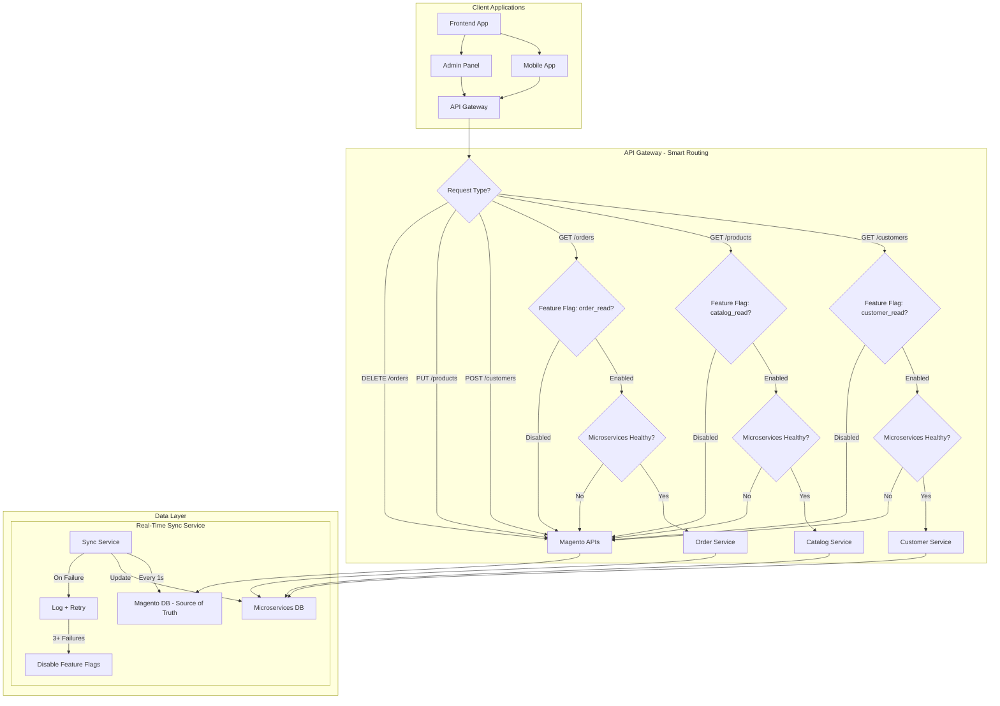

# 📖 Phase 1: Read-Only Migration (Gateway-Level Routing)

**Purpose**: Phase 1 migration with smart routing at API Gateway level  
**Last Updated**: 2026-02-03  
**Status**: ✅ Ready for implementation

---

## 📋 Phase 1 Overview

This phase focuses on **smart routing at the API Gateway level** where:
- **Read APIs** (GET, LIST, SEARCH) are routed to **New Microservices**
- **Write APIs** (POST, PUT, DELETE) continue to use **Magento**
- **Real-time sync** from Magento → Microservices every 1 second
- **Automatic fallback** to Magento if microservices fail

### **🎯 Key Benefits**
- **Zero Risk**: Magento remains source of truth for writes
- **Easy Rollback**: Instant fallback by disabling feature flags
- **Gradual Migration**: Test read operations without affecting writes
- **Performance Testing**: Benchmark microservices vs Magento

---

## 🏗️ Architecture Diagram



---

## 🎯 Phase 1 Objectives

### **Primary Goals**
- [ ] Deploy microservices for read operations only
- [ ] Set up real-time sync (1s interval) from Magento to microservices
- [ ] Configure API Gateway smart routing with feature flags
- [ ] Implement automatic fallback mechanism
- [ ] Monitor performance and data consistency

### **Success Criteria**
- **Zero Downtime**: No impact on write operations
- **Data Latency**: < 2 seconds data sync latency
- **Fallback Time**: < 5 seconds to fallback to Magento
## 🚀 Implementation Steps

### **Step 1: Initial Data Migration**

#### **1.1 Data Extraction from Magento**

#### **Prerequisites**
- Magento database access credentials
- Sufficient disk space for data exports
- Database backup completed
- Migration environment prepared

#### **Data Extraction Scripts**
```bash
#!/bin/bash
# extract-magento-data.sh

echo "Starting Magento data extraction..."

# Create extract directory
mkdir -p magento-extracts
cd magento-extracts

# Extract customer data
echo "Extracting customer data..."
mysqldump -h $MAGENTO_DB_HOST -u $MAGENTO_DB_USER -p$MAGENTO_DB_PASS $MAGENTO_DB_NAME \
  --single-transaction \
  --routines \
  --triggers \
  --where="created_at >= '2020-01-01'" \
  customer_entity customer_entity_varchar customer_entity_int \
  customer_entity_decimal customer_entity_datetime customer_entity_text \
  > customer-data.sql

# Extract customer addresses
echo "Extracting customer addresses..."
mysqldump -h $MAGENTO_DB_HOST -u $MAGENTO_DB_USER -p$MAGENTO_DB_PASS $MAGENTO_DB_NAME \
  --single-transaction \
  --routines \
  --triggers \
  customer_address_entity customer_address_entity_varchar \
  customer_address_entity_int customer_address_entity_decimal \
  customer_address_entity_datetime customer_address_entity_text \
  > customer-addresses.sql

echo "Data extraction completed"
```

### **Step 2: Data Transformation**

#### **2.1 Transformation Service Setup**
```bash
# Deploy transformation service
kubectl apply -f configs/transformation-service.yaml

# Configure environment
kubectl set env deployment/transformation-service \
  MAGENTO_DB_HOST=$MAGENTO_DB_HOST \
  MICRO_DB_HOST=$MICRO_DB_HOST \
  BATCH_SIZE=1000

# Start transformation
kubectl scale deployment/transformation-service --replicas=2
```

#### **2.2 Data Validation**
```bash
#!/bin/bash
# validate-initial-migration.sh

echo "Validating initial data migration..."

# Validate customer data
MAGENTO_CUSTOMERS=$(mysql -h $MAGENTO_DB_HOST -u $MAGENTO_DB_USER -p$MAGENTO_DB_PASS $MAGENTO_DB_NAME -e "
  SELECT COUNT(*) FROM customer_entity WHERE created_at >= '2020-01-01'
" | tail -1)

MICRO_CUSTOMERS=$(mysql -h $MICRO_DB_HOST -u $MICRO_DB_USER -p$MICRO_DB_PASS $MICRO_DB_NAME -e "
  SELECT COUNT(*) FROM customers WHERE source = 'magento'
" | tail -1)

echo "Magento Customers: $MAGENTO_CUSTOMERS"
echo "Microservices Customers: $MICRO_CUSTOMERS"

if [ "$MAGENTO_CUSTOMERS" -eq "$MICRO_CUSTOMERS" ]; then
    echo "✅ Customer count matches"
else
    echo "❌ Customer count mismatch"
    exit 1
fi

echo "Initial data validation completed successfully"
```

### **Step 3: Deploy Real-Time Sync Service**

#### **3.1 Sync Service Deployment**
```bash
# Deploy sync service
kubectl apply -f configs/sync-service.yaml

# Configure environment
kubectl set env deployment/sync-service \
  SYNC_INTERVAL=1 \
  MAX_RETRIES=3 \
  BATCH_SIZE=100

# Start sync service
kubectl scale deployment/sync-service --replicas=1

# Verify deployment
kubectl get pods -l app=sync-service
```

### **Step 4: API Gateway Configuration**

#### **4.1 Gateway Routing Rules**
```yaml
# api-gateway-routing.yaml
apiVersion: networking.istio.io/v1beta1
kind: VirtualService
metadata:
  name: api-routing
  namespace: production
spec:
  hosts:
  - api.company.com
  gateways:
  - api-gateway
  http:
  - match:
    - uri:
        prefix: "/api/v1/customers"
      method:
        exact: GET
    route:
    - destination:
        host: customer-service-readonly
      port:
        number: 8080
      weight: 100
  - match:
    - uri:
        prefix: "/api/v1/customers"
      method:
        oneOf: [POST, PUT, DELETE, PATCH]
    route:
    - destination:
        host: magento-api
      port:
        number: 80
      weight: 100
```

---

## 📊 Monitoring & Validation

### **Data Consistency Validation**
```bash
#!/bin/bash
# check-data-consistency.sh

SERVICE=$1
SAMPLE_SIZE=${2:-100}

echo "Checking data consistency for $SERVICE..."

# Get sample records from Magento
MAGENTO_SAMPLE=$(mysql -h $MAGENTO_DB_HOST -u $MAGENTO_DB_USER -p$MAGENTO_DB_PASS $MAGENTO_DB_NAME -e "
  SELECT entity_id, updated_at FROM ${SERVICE}_table 
  ORDER BY RAND() LIMIT $SAMPLE_SIZE
")

# Compare with microservices
echo "$MAGENTO_SAMPLE" | while read -r id updated_at; do
    if [ "$id" != "entity_id" ]; then
        # Get from microservices
        MICRO_DATA=$(curl -s "http://customer-service-readonly:8080/api/v1/$SERVICE/$id")
        MICRO_UPDATED=$(echo $MICRO_DATA | jq -r '.updatedAt')
        
        # Calculate time difference
        MAGENTO_TIME=$(date -d "$updated_at" +%s)
        MICRO_TIME=$(date -d "$MICRO_UPDATED" +%s)
        DIFF=$((MICRO_TIME - MAGENTO_TIME))
        
        if [ $DIFF -gt 5 ]; then
            echo "⚠️ High latency for $SERVICE record $id: ${DIFF}s"
        else
            echo "✅ Record $id: OK (${DIFF}s lag)"
        fi
    fi
done
```

---

## 🔄 Step 5: Testing and Validation

### **5.1 End-to-End Testing**
```bash
#!/bin/bash
# e2e-test-phase1.sh

echo "Running Phase 1 end-to-end tests..."

# Test 1: Create customer in Magento
MAGENTO_RESPONSE=$(curl -s -X POST "http://magento-api/api/v1/customers" \
  -H "Content-Type: application/json" \
  -d '{"firstname": "Test", "lastname": "User", "email": "test@example.com"}')

MAGENTO_CUSTOMER_ID=$(echo $MAGENTO_RESPONSE | jq -r '.customer_id')

# Wait for sync
sleep 5

# Test 2: Read customer from microservices
MICRO_RESPONSE=$(curl -s "http://api.company.com/api/v1/customers/$MAGENTO_CUSTOMER_ID")
MICRO_EMAIL=$(echo $MICRO_RESPONSE | jq -r '.email')

if [ "$MICRO_EMAIL" = "test@example.com" ]; then
    echo "✅ Customer successfully synced to microservices"
else
    echo "❌ Customer not found in microservices"
    exit 1
fi

echo "Phase 1 E2E tests completed successfully"
```

---

## 📋 Phase 1 Checklist

### **Pre-Migration Checklist**
- [ ] Magento database backup completed
- [ ] Data extraction scripts tested
- [ ] Transformation service deployed
- [ ] Validation procedures ready
- [ ] Rollback procedures tested

### **Migration Checklist**
- [ ] Data extraction completed successfully
- [ ] Data transformation completed without errors
- [ ] Data validation passed (100% match)
- [ ] Real-time sync service deployed and running
- [ ] API Gateway routing configured
- [ ] Monitoring systems active

### **Post-Migration Checklist**
- [ ] All data synchronized between systems
- [ ] Data latency < 2 seconds
- [ ] Read operations working from microservices
- [ ] Write operations still going to Magento
- [ ] Feature flags working correctly
- [ ] Monitoring alerts configured

---

## 📞 Support & Contacts

### **Phase 1 Team**
- **Migration Lead**: migration-lead@company.com
- **Database**: dba-team@company.com
- **Infrastructure**: infra-team@company.com

### **Communication Channels**
- **Phase 1 Status**: #phase1-migration
- **Issues**: #migration-issues
- **Emergency**: #migration-emergency

---

## 🔗 Related Documentation

- **[Data Migration Guide](./data-migration-guide.md)** - Detailed data migration procedures
- **[Sync Service Implementation](./sync-service-implementation.md)** - Real-time sync service details
- **[Phase 2: Read-Write Migration](./phase-2-read-write.md)** - Next phase procedures

---

**Last Updated**: February 3, 2026  
**Review Cycle**: Continuous monitoring during Phase 1  
**Maintained By**: Migration Team & Platform Engineering
