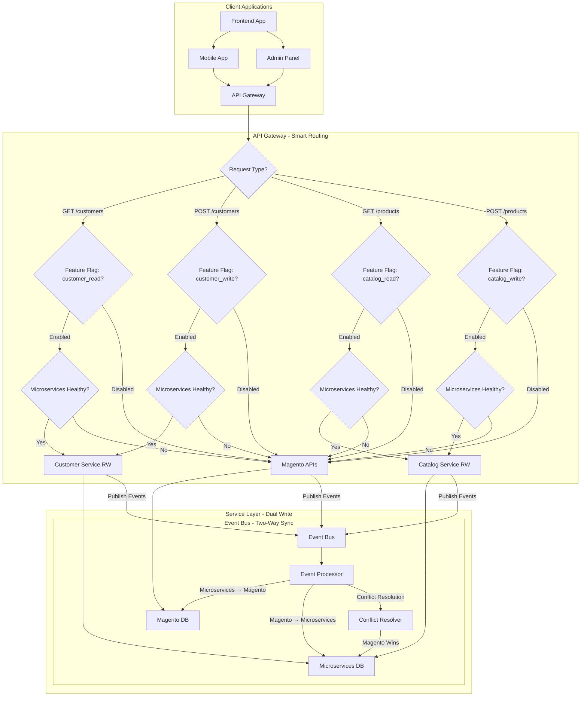

# ✏️ Phase 2: Read-Write Migration (Gradual Dual-Write)

**Purpose**: Phase 2 migration with gradual dual-write and two-way synchronization  
**Last Updated**: 2026-02-03  
**Status**: ✅ Ready for implementation

---

## 📋 Phase 2 Overview

This phase focuses on **gradual dual-write migration** where:
- **Read & Write APIs** are gradually enabled for microservices by service
- **Dual-write pattern**: Client → Microservices → Event → Magento
- **Two-way sync**: Magento ↔ Microservices via Event Bus
- **Hybrid consistency**: Strong for critical data, eventual for non-critical
- **Automatic rollback**: Feature flags disable on microservices failures

### **🎯 Migration Priority**
1. **Customer Service** (Low risk - enable first)
2. **Catalog Service** (Medium risk - enable second)
3. **Order Service** (High risk - enable last)

---

## 🏗️ Architecture Diagram



---

## 🎯 Phase 2 Objectives

### **Primary Goals**
- [ ] Enable write APIs for microservices gradually by service
- [ ] Implement dual-write pattern with event-driven synchronization
- [ ] Set up two-way data sync between Magento and microservices
- [ ] Implement hybrid consistency model
- [ ] Maintain instant rollback capability via feature flags

### **Success Criteria**
- **Zero Downtime**: No service interruption during migration
- **Data Consistency**: < 5 seconds lag for critical data
- **Write Performance**: < 500ms response time for write operations
- **Rollback Time**: < 10 seconds to fallback to Magento

---

## 🚀 Implementation Steps

### **Step 1: Event Bus Infrastructure**

#### **1.1 Deploy Event Bus (Kafka)**
```yaml
# kafka-cluster.yaml
apiVersion: kafka.strimzi.io/v1beta2
kind: Kafka
metadata:
  name: migration-event-bus
  namespace: production
spec:
  kafka:
    version: 3.5.0
    replicas: 3
    listeners:
      - name: plain
        port: 9092
        type: internal
        tls: false
    config:
      offsets.topic.replication.factor: 3
      transaction.state.log.replication.factor: 3
      default.replication.factor: 3
      min.insync.replicas: 2
    storage:
      type: persistent-claim
      size: 100Gi
  zookeeper:
    replicas: 3
    storage:
      type: persistent-claim
      size: 10Gi
```

#### **1.2 Event Topics**
```yaml
# event-topics.yaml
apiVersion: kafka.strimzi.io/v1beta2
kind: KafkaTopic
metadata:
  name: customer-events
  namespace: production
spec:
  partitions: 6
  replicas: 3
---
apiVersion: kafka.strimzi.io/v1beta2
kind: KafkaTopic
metadata:
  name: catalog-events
  namespace: production
spec:
  partitions: 6
  replicas: 3
---
apiVersion: kafka.strimzi.io/v1beta2
kind: KafkaTopic
metadata:
  name: order-events
  namespace: production
spec:
  partitions: 6
  replicas: 3
```

### **Step 2: Event Processor Service**

#### **2.1 Event Processor Deployment**
```yaml
# event-processor.yaml
apiVersion: apps/v1
kind: Deployment
metadata:
  name: event-processor
  namespace: production
spec:
  replicas: 2
  selector:
    matchLabels:
      app: event-processor
  template:
    metadata:
      labels:
        app: event-processor
    spec:
      containers:
      - name: event-processor
        image: event-processor:latest
        env:
        - name: KAFKA_BOOTSTRAP_SERVERS
          value: "migration-event-bus-bootstrap:9092"
        - name: MAGENTO_DB_HOST
          value: "magento-db.production.svc.cluster.local"
        - name: MICRO_DB_HOST
          value: "microservices-db.production.svc.cluster.local"
        command: ["./event-processor"]
        args: ["--dual-write", "--conflict-resolution=magento-wins"]
```

### **Step 3: Update Microservices for Dual-Write**

#### **3.1 Customer Service with Event Publishing**
```go
// customer-service/handlers.go
func (h *CustomerHandler) CreateCustomer(w http.ResponseWriter, r *http.Request) {
    var customer Customer
    json.NewDecoder(r.Body).Decode(&customer)
    
    // Insert into microservices database
    customerID, err := h.insertCustomer(&customer)
    if err != nil {
        http.Error(w, err.Error(), http.StatusInternalServerError)
        return
    }
    
    // Publish event for Magento sync
    event := Event{
        ID:          fmt.Sprintf("customer-created-%d", customerID),
        Type:        "customer_created",
        Service:     "customer",
        Action:      "create",
        Data: map[string]interface{}{
            "id":         customerID,
            "email":      customer.Email,
            "first_name": customer.FirstName,
            "last_name":  customer.LastName,
        },
        Timestamp:   time.Now(),
        Source:      "microservices",
        Consistency: "strong", // Customer data is critical
    }
    
    h.publishEvent(&event, "customer-events")
    
    customer.ID = customerID
    json.NewEncoder(w).Encode(customer)
}
```

### **Step 4: Service Migration Sequence**

#### **4.1 Customer Service Migration**
```bash
#!/bin/bash
# migrate-customer-service-phase2.sh

echo "Starting Customer Service Phase 2 Migration..."

# Enable write feature flag
curl -X POST "http://feature-flag-service:8080/api/v1/flags/customer_write" \
  -H "Content-Type: application/json" \
  -d '{
    "enabled": true,
    "auto_disable_on_failure": true,
    "health_check_interval": 30
  }'

# Monitor for 30 minutes
./scripts/monitor-service-migration.sh --service=customer --duration=1800

# Validate data consistency
./scripts/validate-dual-write.sh --service=customer --sample-size=1000

echo "Customer Service Phase 2 Migration completed"
```

#### **4.2 Catalog Service Migration**
```bash
#!/bin/bash
# migrate-catalog-service-phase2.sh

echo "Starting Catalog Service Phase 2 Migration..."

curl -X POST "http://feature-flag-service:8080/api/v1/flags/catalog_write" \
  -H "Content-Type: application/json" \
  -d '{"enabled": true, "auto_disable_on_failure": true}'

./scripts/monitor-service-migration.sh --service=catalog --duration=1800
./scripts/validate-dual-write.sh --service=catalog --sample-size=500

echo "Catalog Service Phase 2 Migration completed"
```

#### **4.3 Order Service Migration**
```bash
#!/bin/bash
# migrate-order-service-phase2.sh

echo "Starting Order Service Phase 2 Migration (High Risk)..."

# Create backup
./scripts/backup-order-data.sh

# Enable with stricter monitoring
curl -X POST "http://feature-flag-service:8080/api/v1/flags/order_write" \
  -H "Content-Type: application/json" \
  -d '{
    "enabled": true,
    "auto_disable_on_failure": true,
    "health_check_interval": 10,
    "strict_validation": true
  }'

# Extended monitoring
./scripts/monitor-service-migration.sh --service=order --duration=7200

echo "Order Service Phase 2 Migration completed"
```

---

## 📊 Monitoring & Validation

### **Key Metrics**
```go
var (
    eventProcessingTotal = promauto.NewCounterVec(prometheus.CounterOpts{
        Name: "event_processing_total",
        Help: "Total number of events processed",
    }, []string{"service", "direction", "status"})
    
    dataConsistencyLag = promauto.NewGaugeVec(prometheus.GaugeOpts{
        Name: "data_consistency_lag_seconds",
        Help: "Data lag between systems",
    }, []string{"service", "consistency_type"})
    
    conflictResolutionTotal = promauto.NewCounterVec(prometheus.CounterOpts{
        Name: "conflict_resolution_total",
        Help: "Total number of conflict resolutions",
    }, []string{"service", "winner"})
)
```

### **Data Consistency Validation**
```bash
#!/bin/bash
# validate-dual-write.sh

SERVICE=$1
SAMPLE_SIZE=${2:-100}

echo "Validating dual-write consistency for $SERVICE..."

# Test write operation
TEST_ID=$(date +%s)
TEST_DATA='{"email":"test'$TEST_ID'@example.com","first_name":"Test","last_name":"User"}'

# Write to microservices
RESPONSE=$(curl -s -X POST "http://api.company.com/api/v1/$SERVICE" \
  -H "Content-Type: application/json" \
  -d "$TEST_DATA")

RECORD_ID=$(echo $RESPONSE | jq -r '.id')

# Wait for event processing
sleep 5

# Check Magento
MAGENTO_RECORD=$(mysql -h $MAGENTO_DB_HOST -u $MAGENTO_DB_USER -p$MAGENTO_DB_PASS $MAGENTO_DB_NAME -e "
  SELECT * FROM ${SERVICE}_table WHERE entity_id = $RECORD_ID
")

if [ -n "$MAGENTO_RECORD" ]; then
    echo "✅ Record $RECORD_ID successfully synced to Magento"
else
    echo "❌ Record $RECORD_ID not found in Magento"
fi

# Test reverse sync
mysql -h $MAGENTO_DB_HOST -u $MAGENTO_DB_USER -p$MAGENTO_DB_PASS $MAGENTO_DB_NAME -e "
  UPDATE ${SERVICE}_table SET email = 'updated$TEST_ID@example.com' WHERE entity_id = $RECORD_ID
"

sleep 5

# Check microservices
UPDATED_RECORD=$(curl -s "http://api.company.com/api/v1/$SERVICE/$RECORD_ID")
UPDATED_EMAIL=$(echo $UPDATED_RECORD | jq -r '.email')

if [ "$UPDATED_EMAIL" = "updated$TEST_ID@example.com" ]; then
    echo "✅ Reverse sync working correctly"
else
    echo "❌ Reverse sync failed"
fi
```

---

## 🔄 Rollback Procedures

### **Service-Specific Rollback**
```bash
#!/bin/bash
# rollback-service-phase2.sh

SERVICE=$1

echo "Starting rollback for $SERVICE..."

# Disable write feature flag
curl -X POST "http://feature-flag-service:8080/api/v1/flags/${SERVICE}_write" \
  -H "Content-Type: application/json" \
  -d '{"enabled": false}'

# Stop event processing for this service
curl -X POST "http://event-processor:8080/api/v1/disable-service" \
  -H "Content-Type: application/json" \
  -d "{\"service\": \"$SERVICE\"}"

echo "Rollback for $SERVICE completed"
```

### **Emergency Rollback**
```bash
#!/bin/bash
# emergency-rollback-phase2.sh

echo "Starting emergency Phase 2 rollback..."

# Disable all write flags
for service in customer catalog order; do
    curl -X POST "http://feature-flag-service:8080/api/v1/flags/${service}_write" \
      -H "Content-Type: application/json" \
      -d '{"enabled": false}'
done

# Stop event processor
kubectl scale deployment event-processor --replicas=0

echo "Emergency Phase 2 rollback completed"
```

---

## 📋 Phase 2 Checklist

### **Pre-Migration Checklist**
- [ ] Phase 1 read-only migration stable
- [ ] Event bus infrastructure deployed
- [ ] Event processor service running
- [ ] Microservices updated for dual-write
- [ ] API Gateway updated for write routing
- [ ] Monitoring systems enhanced

### **Migration Checklist**
- [ ] Customer service write migration completed
- [ ] Catalog service write migration completed
- [ ] Order service write migration completed
- [ ] Data consistency validated
- [ ] Performance benchmarks met
- [ ] Conflict resolution working

### **Post-Migration Checklist**
- [ ] All services at 100% read-write
- [ ] Two-way sync working correctly
- [ ] Data consistency < 5 seconds
- [ ] Performance targets met
- [ ] Team training completed

---

## 📞 Support & Contacts

### **Phase 2 Team**
- **Migration Lead**: migration-lead@company.com
- **Infrastructure**: infra-team@company.com
- **Database**: dba-team@company.com
- **Event Bus**: events-team@company.com

### **Communication Channels**
- **Phase 2 Status**: #phase2-migration
- **Issues**: #migration-issues
- **Emergency**: #migration-emergency

---

## 🔗 Related Documentation

### **Migration Documentation**
- **[Phase 1: Read-Only Migration](./phase-1-read-only.md)** - Previous phase procedures
- **[Phase 3: Full Cutover](./phase-3-full-cutover.md)** - Next phase procedures
- **[Step-by-Step Migration](./step-by-step-migration.md)** - Complete migration guide

---

**Last Updated**: February 3, 2026  
**Review Cycle**: Continuous monitoring during Phase 2  
**Maintained By**: Migration Team & Platform Engineering
