# ✏️ Phase 2: Read-Write Migration (Gradual Dual-Write)

**Purpose**: Phase 2 migration with gradual dual-write and two-way synchronization  
**Last Updated**: 2026-02-21  
**Status**: ✅ Ready for implementation

---

## 📋 Phase 2 Overview

This phase focuses on **gradual dual-write migration** where:
- **Read & Write APIs** are gradually enabled for microservices by service
- **Dual-write pattern**: Client → Microservices → Event → Magento
- **Two-way sync**: Magento ↔ Microservices via Event Bus
- **Hybrid consistency**: Strong for critical data, eventual for non-critical
- **Automatic rollback**: Feature flags disable on microservices failures

### **🎯 Migration Priority**
1. **Customer Service** (Low risk - enable first)
2. **Catalog Service** (Medium risk - enable second)
3. **Order Service** (High risk - enable last)

---

## 🏗️ Architecture Diagram

```mermaid
graph TB
    subgraph "Client Applications"
        A[Frontend App] --> B[Mobile App]
        A --> C[Admin Panel]
        B --> D[API Gateway]
        C --> D
    end
    
    subgraph "API Gateway - Smart Routing"
        D --> E{Request Type?}
        E -->|GET /customers| F{Feature Flag: customer_read?}
        E -->|POST /customers| G{Feature Flag: customer_write?}
        E -->|GET /products| H{Feature Flag: catalog_read?}
        E -->|POST /products| I{Feature Flag: catalog_write?}
        
        F -->|Enabled| J{Microservices Healthy?}
        G -->|Enabled| K{Microservices Healthy?}
        H -->|Enabled| L{Microservices Healthy?}
        I -->|Enabled| M{Microservices Healthy?}
        
        F -->|Disabled| N[Magento APIs]
        G -->|Disabled| N
        H -->|Disabled| N
        I -->|Disabled| N
        
        J -->|Yes| O[Customer Service RW]
        K -->|Yes| O
        L -->|Yes| P[Catalog Service RW]
        M -->|Yes| P
        
        J -->|No| N
        K -->|No| N
        L -->|No| N
        M -->|No| N
    end
    
    subgraph "Service Layer - Dual Write"
        O --> Q[Microservices DB]
        P --> Q
        N --> R[Magento DB]
        
        subgraph "Event Bus - Two-Way Sync"
            S[Event Bus] --> T[Event Processor]
            T -->|Microservices → Magento| R
            T -->|Magento → Microservices| Q
            T -->|Conflict Resolution| U[Conflict Resolver]
            U -->|Magento Wins| Q
        end
        
        O -->|Publish Events| S
        P -->|Publish Events| S
        N -->|Publish Events| S
    end
```



---

## 🎯 Phase 2 Objectives

### **Primary Goals**
- [ ] Enable write APIs for microservices gradually by service
- [ ] Implement dual-write pattern with event-driven synchronization
- [ ] Set up two-way data sync between Magento and microservices
- [ ] Implement hybrid consistency model
- [ ] Maintain instant rollback capability via feature flags

### **Success Criteria**
- **Zero Downtime**: No service interruption during migration
- **Data Consistency**: < 5 seconds lag for critical data
- **Write Performance**: < 500ms response time for write operations
- **Rollback Time**: < 10 seconds to fallback to Magento

---

## 🚀 Implementation Steps

### **Step 1: Event Bus Infrastructure**

> [!IMPORTANT]
> **Do NOT deploy a separate Kafka cluster** for Phase 2 migration. The platform already runs Dapr Pub/Sub with Redis Streams. Use the existing `pubsub` component. This avoids operating two competing event systems simultaneously.

#### **1.1 Dapr Pub/Sub Configuration (already in platform)**

```yaml
# Already deployed — no additional infra required
# Verify with:
kubectl get components -n production pubsub
# Expected: dapr.io/v1alpha1/Component pubsub (Redis Streams)
```

#### **1.2 Migration-specific Dapr Topics**

The Debezium sync service (Phase 1) already publishes to these topics:

| Topic | Publisher | Consumers |
|---|---|---|
| `migration.customer.changed` | Sync Service | Customer Service |
| `migration.product.changed` | Sync Service | Catalog Service |
| `migration.order.changed` | Sync Service | Order Service |
| `migration.stock.changed` | Sync Service | Warehouse Service |
| `migration.dlq` | Dapr (auto) | Ops team via DLQ handler |

For dual-write (microservices → Magento sync), add reverse topics:

```yaml
# Add subscriptions in the Magento sync-adapter service
apiVersion: dapr.io/v1alpha1
kind: Subscription
metadata:
  name: reverse-sync-customer
  namespace: migration
spec:
  pubsubname: pubsub
  topic: customer.updated           # Platform's existing domain topic
  route: /reverse-sync/customer
  deadLetterTopic: migration.dlq
---
apiVersion: dapr.io/v1alpha1
kind: Subscription
metadata:
  name: reverse-sync-order
  namespace: migration
spec:
  pubsubname: pubsub
  topic: order.placed
  route: /reverse-sync/order
  deadLetterTopic: migration.dlq
```

### **Step 2: Conflict Resolution Strategy**

> [!WARNING]
> "Magento wins" is **not sufficient** in Phase 2. During dual-write, both Magento and the microservice can mutate the same record concurrently. Without proper conflict detection, the last write wins arbitrarily and silently overwrites legitimate changes.

#### **2.1 Timestamp-Based Conflict Resolution**

Every entity in the microservice DB carries an `updated_at` timestamp. The Magento sync adapter compares timestamps before applying a change:

```go
// magento-sync-adapter/conflict_resolver.go
func (r *ConflictResolver) ResolveCustomerChange(ctx context.Context, event MigrationEvent) error {
    // Fetch current state from microservices DB
    current, err := r.customerRepo.FindByMagentoID(ctx, event.MagentoID)
    if err != nil && !errors.Is(err, ErrNotFound) {
        return err
    }
    if current == nil {
        // No conflict: new record, apply directly
        return r.customerRepo.UpsertFromMigration(ctx, event)
    }

    magentoUpdatedAt := event.UpdatedAt
    microUpdatedAt := current.UpdatedAt

    if magentoUpdatedAt.After(microUpdatedAt) {
        // Magento change is newer: apply to microservices
        return r.customerRepo.UpsertFromMigration(ctx, event)
    }
    if microUpdatedAt.After(magentoUpdatedAt) {
        // Microservices change is newer: sync back to Magento instead
        return r.magentoAdapter.UpdateCustomer(ctx, current)
    }
    // Equal timestamps: idempotent, skip
    return nil
}
```

#### **2.2 Conflict Resolution Policy by Data Type**

| Entity | Policy | Rationale |
|---|---|---|
| Customer profile (name, email) | Timestamp-based | Both sides can legitimately update |
| Order status | Microservices wins | Order state machine is in microservice |
| Inventory (stock qty) | Microservices wins | Real-time reservations live in microservice |
| Product price | Admin decision | Pricing is always written from Seller Centre |
| Coupon usage count | Sum / reconcile | Both sides may increment concurrently |

#### **2.3 Reverse Sync Adapter Deployment**

```yaml
# magento-sync-adapter.yaml
apiVersion: apps/v1
kind: Deployment
metadata:
  name: magento-sync-adapter
  namespace: migration
spec:
  replicas: 2
  selector:
    matchLabels:
      app: magento-sync-adapter
  template:
    metadata:
      labels:
        app: magento-sync-adapter
      annotations:
        dapr.io/enabled: "true"
        dapr.io/app-id: "magento-sync-adapter"
        dapr.io/app-port: "8080"
    spec:
      containers:
      - name: magento-sync-adapter
        image: magento-sync-adapter:latest
        env:
        - name: MAGENTO_DB_HOST
          valueFrom:
            secretKeyRef:
              name: magento-db-creds
              key: host
        - name: MAGENTO_DB_PASS
          valueFrom:
            secretKeyRef:
              name: magento-db-creds
              key: password
        - name: CONFLICT_RESOLUTION_MODE
          value: "timestamp"  # timestamp | microservices-wins | magento-wins
```

### **Step 3: Update Microservices for Dual-Write**

#### **3.1 Customer Service with Event Publishing**
```go
// customer-service/handlers.go
func (h *CustomerHandler) CreateCustomer(w http.ResponseWriter, r *http.Request) {
    var customer Customer
    json.NewDecoder(r.Body).Decode(&customer)
    
    // Insert into microservices database
    customerID, err := h.insertCustomer(&customer)
    if err != nil {
        http.Error(w, err.Error(), http.StatusInternalServerError)
        return
    }
    
    // Publish event for Magento sync
    event := Event{
        ID:          fmt.Sprintf("customer-created-%d", customerID),
        Type:        "customer_created",
        Service:     "customer",
        Action:      "create",
        Data: map[string]interface{}{
            "id":         customerID,
            "email":      customer.Email,
            "first_name": customer.FirstName,
            "last_name":  customer.LastName,
        },
        Timestamp:   time.Now(),
        Source:      "microservices",
        Consistency: "strong", // Customer data is critical
    }
    
    h.publishEvent(&event, "customer-events")
    
    customer.ID = customerID
    json.NewEncoder(w).Encode(customer)
}
```

### **Step 4: Service Migration Sequence**

#### **4.1 Customer Service Migration**
```bash
#!/bin/bash
# migrate-customer-service-phase2.sh

echo "Starting Customer Service Phase 2 Migration..."

# Enable write feature flag
curl -X POST "http://feature-flag-service:8080/api/v1/flags/customer_write" \
  -H "Content-Type: application/json" \
  -d '{
    "enabled": true,
    "auto_disable_on_failure": true,
    "health_check_interval": 30
  }'

# Monitor for 30 minutes
./scripts/monitor-service-migration.sh --service=customer --duration=1800

# Validate data consistency
./scripts/validate-dual-write.sh --service=customer --sample-size=1000

echo "Customer Service Phase 2 Migration completed"
```

#### **4.2 Catalog Service Migration**
```bash
#!/bin/bash
# migrate-catalog-service-phase2.sh

echo "Starting Catalog Service Phase 2 Migration..."

curl -X POST "http://feature-flag-service:8080/api/v1/flags/catalog_write" \
  -H "Content-Type: application/json" \
  -d '{"enabled": true, "auto_disable_on_failure": true}'

./scripts/monitor-service-migration.sh --service=catalog --duration=1800
./scripts/validate-dual-write.sh --service=catalog --sample-size=500

echo "Catalog Service Phase 2 Migration completed"
```

#### **4.3 Order Service Migration**
```bash
#!/bin/bash
# migrate-order-service-phase2.sh

echo "Starting Order Service Phase 2 Migration (High Risk)..."

# Create backup
./scripts/backup-order-data.sh

# Enable with stricter monitoring
curl -X POST "http://feature-flag-service:8080/api/v1/flags/order_write" \
  -H "Content-Type: application/json" \
  -d '{
    "enabled": true,
    "auto_disable_on_failure": true,
    "health_check_interval": 10,
    "strict_validation": true
  }'

# Extended monitoring
./scripts/monitor-service-migration.sh --service=order --duration=7200

echo "Order Service Phase 2 Migration completed"
```

---

## 📊 Monitoring & Validation

### **Key Metrics**
```go
var (
    eventProcessingTotal = promauto.NewCounterVec(prometheus.CounterOpts{
        Name: "event_processing_total",
        Help: "Total number of events processed",
    }, []string{"service", "direction", "status"})
    
    dataConsistencyLag = promauto.NewGaugeVec(prometheus.GaugeOpts{
        Name: "data_consistency_lag_seconds",
        Help: "Data lag between systems",
    }, []string{"service", "consistency_type"})
    
    conflictResolutionTotal = promauto.NewCounterVec(prometheus.CounterOpts{
        Name: "conflict_resolution_total",
        Help: "Total number of conflict resolutions",
    }, []string{"service", "winner"})
)
```

### **Data Consistency Validation**
```bash
#!/bin/bash
# validate-dual-write.sh

SERVICE=$1
SAMPLE_SIZE=${2:-100}

echo "Validating dual-write consistency for $SERVICE..."

# Test write operation
TEST_ID=$(date +%s)
TEST_DATA='{"email":"test'$TEST_ID'@example.com","first_name":"Test","last_name":"User"}'

# Write to microservices
RESPONSE=$(curl -s -X POST "http://api.company.com/api/v1/$SERVICE" \
  -H "Content-Type: application/json" \
  -d "$TEST_DATA")

RECORD_ID=$(echo $RESPONSE | jq -r '.id')

# Wait for event processing
sleep 5

# Check Magento
MAGENTO_RECORD=$(mysql -h $MAGENTO_DB_HOST -u $MAGENTO_DB_USER -p$MAGENTO_DB_PASS $MAGENTO_DB_NAME -e "
  SELECT * FROM ${SERVICE}_table WHERE entity_id = $RECORD_ID
")

if [ -n "$MAGENTO_RECORD" ]; then
    echo "✅ Record $RECORD_ID successfully synced to Magento"
else
    echo "❌ Record $RECORD_ID not found in Magento"
fi

# Test reverse sync
mysql -h $MAGENTO_DB_HOST -u $MAGENTO_DB_USER -p$MAGENTO_DB_PASS $MAGENTO_DB_NAME -e "
  UPDATE ${SERVICE}_table SET email = 'updated$TEST_ID@example.com' WHERE entity_id = $RECORD_ID
"

sleep 5

# Check microservices
UPDATED_RECORD=$(curl -s "http://api.company.com/api/v1/$SERVICE/$RECORD_ID")
UPDATED_EMAIL=$(echo $UPDATED_RECORD | jq -r '.email')

if [ "$UPDATED_EMAIL" = "updated$TEST_ID@example.com" ]; then
    echo "✅ Reverse sync working correctly"
else
    echo "❌ Reverse sync failed"
fi
```

---

## 🔄 Rollback Procedures

### **Service-Specific Rollback**
```bash
#!/bin/bash
# rollback-service-phase2.sh

SERVICE=$1

echo "Starting rollback for $SERVICE..."

# Disable write feature flag
curl -X POST "http://feature-flag-service:8080/api/v1/flags/${SERVICE}_write" \
  -H "Content-Type: application/json" \
  -d '{"enabled": false}'

# Stop event processing for this service
curl -X POST "http://event-processor:8080/api/v1/disable-service" \
  -H "Content-Type: application/json" \
  -d "{\"service\": \"$SERVICE\"}"

echo "Rollback for $SERVICE completed"
```

### **Emergency Rollback**
```bash
#!/bin/bash
# emergency-rollback-phase2.sh

echo "Starting emergency Phase 2 rollback..."

# Disable all write flags
for service in customer catalog order; do
    curl -X POST "http://feature-flag-service:8080/api/v1/flags/${service}_write" \
      -H "Content-Type: application/json" \
      -d '{"enabled": false}'
done

# Stop event processor
kubectl scale deployment event-processor --replicas=0

echo "Emergency Phase 2 rollback completed"
```

---

## 📋 Phase 2 Checklist

### **Pre-Migration Checklist**
- [ ] Phase 1 read-only migration stable
- [ ] Event bus infrastructure deployed
- [ ] Event processor service running
- [ ] Microservices updated for dual-write
- [ ] API Gateway updated for write routing
- [ ] Monitoring systems enhanced

### **Migration Checklist**
- [ ] Customer service write migration completed
- [ ] Catalog service write migration completed
- [ ] Order service write migration completed
- [ ] Data consistency validated
- [ ] Performance benchmarks met
- [ ] Conflict resolution working

### **Post-Migration Checklist**
- [ ] All services at 100% read-write
- [ ] Two-way sync working correctly
- [ ] Data consistency < 5 seconds
- [ ] Performance targets met
- [ ] Team training completed

---

## 📞 Support & Contacts

### **Phase 2 Team**
- **Migration Lead**: migration-lead@company.com
- **Infrastructure**: infra-team@company.com
- **Database**: dba-team@company.com
- **Event Bus**: events-team@company.com

### **Communication Channels**
- **Phase 2 Status**: #phase2-migration
- **Issues**: #migration-issues
- **Emergency**: #migration-emergency

---

## 🔗 Related Documentation

### **Migration Documentation**
- **[Phase 1: Read-Only Migration](./phase-1-read-only.md)** - Previous phase procedures
- **[Phase 3: Full Cutover](./phase-3-full-cutover.md)** - Next phase procedures
- **[Step-by-Step Migration](./step-by-step-migration.md)** - Complete migration guide

---

**Last Updated**: February 3, 2026  
**Review Cycle**: Continuous monitoring during Phase 2  
**Maintained By**: Migration Team & Platform Engineering
