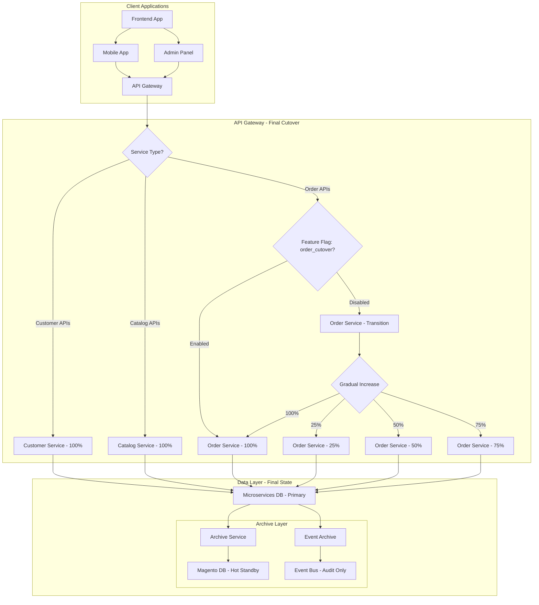

# 🚀 Phase 3: Full Cutover (Gradual Service Migration)

**Purpose**: Phase 3 complete cutover with gradual service migration and Magento hot standby  
**Last Updated**: 2026-02-21  
**Status**: ✅ Ready for implementation

---

## 📋 Phase 3 Overview

This phase focuses on **gradual service cutover** where:
- **100% traffic** gradually routed to microservices by service
- **Magento** becomes **hot standby** for 1 month
- **Archive service** handles final data sync to Magento
- **Event bus** kept for audit, then stopped
- **Performance optimization** for full production load

### **🎯 Migration Priority**
1. **Customer Service** (Low risk - Week 1-2)
2. **Catalog Service** (Medium risk - Week 3-4)
3. **Order Service** (High risk - Week 5-6)

---

## 🏗️ Architecture Diagram



---

## 🎯 Phase 3 Objectives

### **Primary Goals**
- [ ] Gradual cutover all services to microservices (100% traffic)
- [ ] Implement archive service for final data sync to Magento
- [ ] Keep Magento as hot standby for 1 month
- [ ] Optimize microservices for full production load
- [ ] Maintain rollback capability for 1 month

### **Success Criteria**
- **Zero Downtime**: No service interruption during cutover
- **Performance**: < 200ms response time for all operations
- **Throughput**: Handle 10x current production load
- **Rollback**: < 5 minutes to enable Magento if needed
- **Archive**: 100% data integrity in Magento archive

---

## 🚀 Implementation Steps

### **Step 1: Archive Service Infrastructure**

#### **1.1 Archive Service Deployment**
```yaml
# archive-service.yaml
apiVersion: apps/v1
kind: Deployment
metadata:
  name: archive-service
  namespace: production
spec:
  replicas: 2
  selector:
    matchLabels:
      app: archive-service
  template:
    metadata:
      labels:
        app: archive-service
    spec:
      containers:
      - name: archive-service
        image: archive-service:latest
        env:
        - name: MICRO_DB_HOST
          value: "microservices-db.production.svc.cluster.local"
        - name: MAGENTO_DB_HOST
          value: "magento-db.production.svc.cluster.local"
        - name: ARCHIVE_INTERVAL
          value: "3600" # 1 hour
        command: ["./archive-service"]
        args: ["--final-sync", "--compress"]
```

### **Step 2: Service Cutover Sequence**

#### **2.1 Customer Service Cutover (Week 1-2)**
```bash
#!/bin/bash
# cutover-customer-service.sh

echo "Starting Customer Service Cutover (Week 1-2)..."

# Enable 100% cutover
curl -X POST "http://feature-flag-service:8080/api/v1/flags/customer_cutover" \
  -H "Content-Type: application/json" \
  -d '{"enabled": true, "percentage": 100}'

# Disable dual-write
curl -X POST "http://event-processor:8080/api/v1/disable-service" \
  -H "Content-Type: application/json" \
  -d '{"service": "customer"}'

# Start archive service
curl -X POST "http://archive-service:8080/api/v1/start-archive" \
  -H "Content-Type: application/json" \
  -d '{"service": "customer", "interval": 3600}'

# Monitor for 7 days
for day in {1..7}; do
    echo "Day $day monitoring..."
    ./scripts/monitor-service-health.sh --service=customer --duration=86400
done

echo "Customer Service Cutover completed"
```

#### **2.2 Order Service Gradual Cutover (Week 5-6)**
```bash
#!/bin/bash
# cutover-order-service-gradual.sh

echo "Starting Order Service Gradual Cutover..."

percentages=(25 50 75 100)
durations=(3 3 4 4) # days per step

for i in "${!percentages[@]}"; do
    percentage=${percentages[$i]}
    duration=${durations[$i]}
    
    echo "Increasing order service traffic to $percentage% for $duration days..."
    
    curl -X POST "http://feature-flag-service:8080/api/v1/flags/order_cutover" \
      -H "Content-Type: application/json" \
      -d "{\"enabled\": true, \"percentage\": $percentage}"
    
    # Monitor for specified duration
    for day in $(seq 1 $duration); do
        ./scripts/monitor-service-health.sh --service=order --duration=86400
        
        # Check if stable
        if ! ./scripts/check-service-stability.sh --service=order; then
            echo "⚠️ Service unstable, rolling back..."
            curl -X POST "http://feature-flag-service:8080/api/v1/flags/order_cutover" \
              -H "Content-Type: application/json" \
              -d '{"enabled": false}'
            exit 1
        fi
    done
done

echo "Order Service Cutover completed"
```

### **Step 3: Performance Optimization**

#### **3.1 Remove Dual-Write Overhead**
```bash
# Stop reverse-sync adapter (no longer needed after cutover)
kubectl scale deployment magento-sync-adapter -n migration --replicas=0

# Stop Debezium connector
kubectl delete deployment debezium-sync-consumer -n migration

# Update services to remove migration event handlers
kubectl apply -f configs/optimized-services.yaml
```

### **Step 4: Payment Transaction Final Reconciliation**

Before cutting over, reconcile payment transaction history between Magento and microservices:

```bash
#!/bin/bash
# payment-reconciliation.sh
# Run this in Phase 3 BEFORE disabling Magento payment writes

echo "Running payment reconciliation..."

MAGENTO_TXNS=$(mysql -h "${MAGENTO_DB_HOST}" -u "${MAGENTO_DB_USER}" \
  -p"${MAGENTO_DB_PASS}" "${MAGENTO_DB_NAME}" -e "
  SELECT COUNT(*), SUM(amount) FROM sales_payment_transaction
    WHERE created_at >= '2020-01-01'
" | tail -1)

MICRO_TXNS=$(psql "${MICRO_DB_DSN}" -t -c "
  SELECT COUNT(*), SUM(amount) FROM payment_records
    WHERE source = 'magento'
")

echo "Magento transactions: ${MAGENTO_TXNS}"
echo "Microservices transactions: ${MICRO_TXNS}"

# Fail cutover if mismatch (ops team reviews)
if [ "${MAGENTO_TXNS}" != "${MICRO_TXNS}" ]; then
    echo "❌ Payment reconciliation mismatch — DO NOT PROCEED with cutover"
    exit 1
fi
echo "✅ Payment reconciliation passed"
```

```sql
-- Spot-check: verify high-value orders have matching payment records
SELECT
    o.increment_id,
    o.grand_total,
    pr.amount,
    ABS(o.grand_total - pr.amount) AS diff
FROM sales_order o
JOIN magento_id_map m ON m.entity_type = 'order' AND m.magento_id = o.entity_id
JOIN payment_records pr ON pr.order_id = m.new_uuid
WHERE ABS(o.grand_total - pr.amount) > 0.01
ORDER BY diff DESC
LIMIT 20;
```

### **Step 5: Loyalty Points Final Sync**

```sql
-- Before Magento loyalty module is decommissioned, do a final point balance sync.
-- Run this AFTER the last loyalty transaction processes in Magento.
INSERT INTO loyalty_point_balances (customer_id, points_balance, source)
SELECT
    m.new_uuid,
    mr.points_balance,
    'magento_final_sync'
FROM magento_reward mr
JOIN magento_id_map m ON m.entity_type = 'customer' AND m.magento_id = mr.customer_id
ON CONFLICT (customer_id) DO UPDATE
    SET points_balance = EXCLUDED.points_balance,
        updated_at = NOW()
WHERE magento_reward.updated_at > loyalty_point_balances.updated_at;
```

#### **3.2 Resource Scaling**
```yaml
# optimized-scaling.yaml
apiVersion: autoscaling/v2
kind: HorizontalPodAutoscaler
metadata:
  name: customer-service-hpa-optimized
  namespace: production
spec:
  scaleTargetRef:
    apiVersion: apps/v1
    kind: Deployment
    name: customer-service
  minReplicas: 5
  maxReplicas: 50
  metrics:
  - type: Resource
    resource:
      name: cpu
      target:
        type: Utilization
        averageUtilization: 60
```

---

## 🔄 Rollback Procedures

### **Emergency Rollback (1-Month Window)**

#### **Quick Rollback Script**
```bash
#!/bin/bash
# emergency-rollback.sh

SERVICE=$1

echo "Starting emergency rollback for $SERVICE..."

# Disable cutover feature flag
curl -X POST "http://feature-flag-service:8080/api/v1/flags/${SERVICE}_cutover" \
  -H "Content-Type: application/json" \
  -d '{"enabled": false}'

# Enable Magento write access
curl -X POST "http://magento-admin:8080/api/v1/enable-write" \
  -H "Content-Type: application/json" \
  -d "{\"service\": \"$SERVICE\"}"

# Update API Gateway routing
kubectl patch virtualservice api-routing -n production --type='json' -p='[
  {"op": "replace", "path": "/spec/http/0/route/0/weight", "value": 0},
  {"op": "replace", "path": "/spec/http/0/route/1/weight", "value": 100}
]'

echo "Emergency rollback for $SERVICE completed"
```

---

## 📋 Phase 3 Checklist

### **Phase 3 Checklist**

**Pre-Cutover**
- [ ] Phase 2 dual-write stable for 2+ weeks
- [ ] Archive service deployed and tested
- [ ] Payment reconciliation script run and passed
- [ ] Loyalty points final sync completed
- [ ] All inventory stock levels verified between systems
- [ ] All active coupon codes migrated and tested
- [ ] Rollback procedures tested in staging

**Cutover**
- [ ] Customer service 100% cutover completed
- [ ] Catalog service 100% cutover completed
- [ ] Warehouse/Inventory service confirmed live
- [ ] Order service gradual cutover completed (25% → 50% → 75% → 100%)
- [ ] Payment service cutover (new transactions only via microservice)
- [ ] Debezium sync and reverse-sync adapter stopped
- [ ] Magento write endpoints disabled

**Post-Cutover**
- [ ] All services at 100% traffic
- [ ] Performance targets met (< 200ms p99)
- [ ] Magento hot standby responding to health checks
- [ ] 1-month rollback window monitoring active
- [ ] Magento decommission date scheduled

---

## 📞 Support & Contacts

### **Phase 3 Team**
- **Migration Lead**: migration-lead@company.com
- **Infrastructure**: infra-team@company.com
- **Database**: dba-team@company.com
- **Performance**: perf-team@company.com

---

## 🔗 Related Documentation

- **[Phase 1: Read-Only Migration](./phase-1-read-only.md)** - Previous phase
- **[Phase 2: Read-Write Migration](./phase-2-read-write.md)** - Previous phase

---

**Last Updated**: February 3, 2026  
**Review Cycle**: Continuous monitoring during Phase 3  
**Maintained By**: Migration Team & Platform Engineering
