# 🔄 Sync Service Implementation Guide

**Purpose**: Complete implementation guide for real-time sync from Magento to microservices  
**Last Updated**: 2026-02-21  
**Status**: ✅ Ready for implementation

---

## 📋 Overview

This guide provides implementation details for the real-time sync service. It uses **Debezium** (MySQL binlog-based CDC — not `updated_at` polling) to capture changes reliably from Magento, including INSERTs, UPDATEs, and DELETEs. Events are forwarded to microservices via **Dapr Pub/Sub** (the platform's existing event infrastructure — no separate Kafka cluster needed).

> [!IMPORTANT]
> **Why Debezium instead of `updated_at` polling?**
> Polling on `updated_at` misses DELETE operations entirely and is vulnerable to clock skew and timestamp collisions. Debezium reads MySQL binary logs, capturing every row-level change reliably with exact before/after state.

---

## 🏗️ Sync Service Architecture

```mermaid
graph TB
    subgraph "Magento MySQL"
        A[customer_entity] --> B[MySQL Binlog]
        C[catalog_product_entity] --> B
        D[sales_order] --> B
        E[cataloginventory_stock_item] --> B
    end

    subgraph "Debezium CDC"
        B --> F[Debezium MySQL Connector]
        F --> G[Change Events Stream]
    end

    subgraph "Sync Consumer Service"
        G --> H[Change Event Consumer]
        H --> I[ID Mapper — int to UUID]
        I --> J[Transformer]
        J --> K[Dapr Pub/Sub Publisher]
        K --> L[Error Handler + DLQ]
    end

    subgraph "Platform Event Bus — Dapr + Redis Streams"
        K --> M[migration.customer.changed]
        K --> N[migration.product.changed]
        K --> O[migration.order.changed]
        K --> P[migration.stock.changed]
    end

    subgraph "Microservices Consumers"
        M --> Q[Customer Service]
        N --> R[Catalog Service]
        O --> S[Order Service]
        P --> T[Warehouse Service]
    end

    subgraph "Monitoring"
        U[Prometheus Metrics] --> V[Alert Manager]
    end
```



---

## 🚀 Step 1: Debezium MySQL Connector Setup

> [!IMPORTANT]
> MySQL **must have binlog enabled** before deploying Debezium. Verify with: `SHOW VARIABLES LIKE 'log_bin';`

### **1.1 Enable MySQL Binlog on Magento DB**

Add to MySQL config (`/etc/mysql/conf.d/binlog.cnf`):
```ini
[mysqld]
log_bin           = mysql-bin
binlog_format     = ROW           # Must be ROW, not STATEMENT
binlog_row_image  = FULL          # Capture full before/after row images
expire_logs_days  = 7
server_id         = 1             # Unique ID, must not conflict with replicas
```

Create Debezium replication user:
```sql
CREATE USER 'debezium'@'%' IDENTIFIED BY '${DEBEZIUM_PASS}';
GRANT SELECT, RELOAD, SHOW DATABASES, REPLICATION SLAVE, REPLICATION CLIENT ON *.* TO 'debezium'@'%';
FLUSH PRIVILEGES;
```

### **1.2 Debezium Connector Configuration**

Deploy as Kubernetes ConfigMap + Connector registration:

```yaml
# debezium-connector-config.yaml — deployed via Kafka Connect REST API
# Note: Debezium is deployed as a sidecar next to the sync consumer,
# using the embedded engine mode (no separate Kafka Connect cluster needed).
apiVersion: v1
kind: ConfigMap
metadata:
  name: debezium-connector-config
  namespace: migration
data:
  connector.json: |
    {
      "name": "magento-mysql-connector",
      "config": {
        "connector.class": "io.debezium.connector.mysql.MySqlConnector",
        "database.hostname": "${MAGENTO_DB_HOST}",
        "database.port": "3306",
        "database.user": "debezium",
        "database.password": "${DEBEZIUM_PASS}",
        "database.server.id": "184054",
        "database.server.name": "magento",
        "database.include.list": "${MAGENTO_DB_NAME}",
        "table.include.list": "${MAGENTO_DB_NAME}.customer_entity,${MAGENTO_DB_NAME}.customer_address_entity,${MAGENTO_DB_NAME}.catalog_product_entity,${MAGENTO_DB_NAME}.sales_order,${MAGENTO_DB_NAME}.cataloginventory_stock_item,${MAGENTO_DB_NAME}.salesrule_coupon",
        "include.schema.changes": "false",
        "snapshot.mode": "initial",
        "offset.storage": "org.apache.kafka.connect.storage.FileOffsetBackingStore",
        "offset.storage.file.filename": "/var/debezium/offsets/offsets.dat",
        "offset.flush.interval.ms": "1000"
      }
    }
```

### **1.3 Sync Consumer — Go Service**

```go
// sync-service/main.go
package main

import (
    "context"
    "encoding/json"
    "fmt"
    "log"
    "os"
    "time"

    dapr "github.com/dapr/go-sdk/client"
    _ "github.com/go-sql-driver/mysql"
    "github.com/prometheus/client_golang/prometheus"
    "github.com/prometheus/client_golang/prometheus/promhttp"
    "net/http"
)

// DebeziumEvent is the envelope Debezium wraps around binlog row events.
type DebeziumEvent struct {
    Payload struct {
        Before map[string]interface{} `json:"before"` // null on INSERT
        After  map[string]interface{} `json:"after"`  // null on DELETE
        Source struct {
            Table string `json:"table"`
            TsMs  int64  `json:"ts_ms"`
        } `json:"source"`
        Op string `json:"op"` // "c"=INSERT, "u"=UPDATE, "d"=DELETE, "r"=snapshot
    } `json:"payload"`
}

type SyncService struct {
    daprClient  dapr.Client
    idMapper    *IdentityMapper
    transformer *DataTransformer
    metrics     *Metrics
}

func NewSyncService() (*SyncService, error) {
    daprClient, err := dapr.NewClient()
    if err != nil {
        return nil, fmt.Errorf("failed to create Dapr client: %v", err)
    }
    return &SyncService{
        daprClient:  daprClient,
        idMapper:    NewIdentityMapper(os.Getenv("MICRO_DB_DSN")),
        transformer: NewDataTransformer(),
        metrics:     NewMetrics(),
    }, nil
}

// HandleChange is called for every binlog event from Debezium.
func (s *SyncService) HandleChange(ctx context.Context, eventBytes []byte) error {
    var event DebeziumEvent
    if err := json.Unmarshal(eventBytes, &event); err != nil {
        return err
    }

    p := event.Payload
    table := p.Source.Table
    op := p.Op

    start := time.Now()

    // Determine the row data and whether it's a delete
    rowData := p.After
    if op == "d" {
        rowData = p.Before // For deletes, use the before image
    }
    if rowData == nil {
        return nil // snapshot tombstone, skip
    }

    // Map Magento integer ID → platform UUID
    entityType := tableToEntityType(table)
    magentoID := int64(rowData["entity_id"].(float64))
    platformID, err := s.idMapper.GetOrCreate(ctx, entityType, magentoID)
    if err != nil {
        return err
    }
    rowData["id"] = platformID
    rowData["magento_id"] = magentoID

    // Transform field names (Magento → microservice schema)
    transformed, topic, err := s.transformer.Transform(table, op, rowData)
    if err != nil {
        s.metrics.errCount.WithLabelValues(table, "transform").Inc()
        return err
    }

    // Publish via Dapr pub/sub (platform's existing Redis Streams bus)
    payload, _ := json.Marshal(transformed)
    if err := s.daprClient.PublishEvent(ctx, "pubsub", topic, payload); err != nil {
        s.metrics.errCount.WithLabelValues(table, "publish").Inc()
        return err
    }

    s.metrics.syncDuration.WithLabelValues(table).Observe(time.Since(start).Seconds())
    s.metrics.syncCount.WithLabelValues(table, op).Inc()
    return nil
}

func tableToEntityType(table string) string {
    switch table {
    case "customer_entity":               return "customer"
    case "customer_address_entity":       return "address"
    case "catalog_product_entity":        return "product"
    case "sales_order":                   return "order"
    case "cataloginventory_stock_item":   return "stock"
    default:                             return table
    }
}
```

### **1.4 Dapr Subscription — Microservice Consumer Side**

Each microservice subscribes to its migration topic via Dapr:

```yaml
# dapr-subscription-migration.yaml
apiVersion: dapr.io/v1alpha1
kind: Subscription
metadata:
  name: migration-customer-subscription
  namespace: production
spec:
  pubsubname: pubsub
  topic: migration.customer.changed
  route: /migration/customer
  deadLetterTopic: migration.dlq
---
apiVersion: dapr.io/v1alpha1
kind: Subscription
metadata:
  name: migration-stock-subscription
  namespace: production
spec:
  pubsubname: pubsub
  topic: migration.stock.changed
  route: /migration/stock
  deadLetterTopic: migration.dlq
```

Customer Service handles migration events idempotently:

```go
// customer-service/migration_handler.go
// POST /migration/customer — called by Dapr for each binlog event
func (h *MigrationHandler) HandleCustomerChange(ctx context.Context, event MigrationEvent) error {
    // Idempotency: skip if already processed
    if exists, _ := h.repo.ExistsByMagentoID(ctx, event.MagentoID); exists && event.Op == "c" {
        return nil
    }
    switch event.Op {
    case "c", "u", "r": // insert, update, or snapshot
        return h.repo.UpsertFromMigration(ctx, event)
    case "d":
        return h.repo.SoftDeleteByMagentoID(ctx, event.MagentoID)
    }
    return nil
}
```
```go
package main

import (
    "context"
    "database/sql"
    "encoding/json"
    "fmt"
    "log"
    "os"
    "os/signal"
    "syscall"
    "time"
    
    "github.com/confluentinc/confluent-kafka-go/v2/kafka"
    _ "github.com/go-sql-driver/mysql"
    "github.com/prometheus/client_golang/prometheus"
    "github.com/prometheus/client_golang/prometheus/promhttp"
    "net/http"
)

type SyncService struct {
    config           *Config
    magentoDB        *sql.DB
    microDB          *sql.DB
    kafkaProducer     *kafka.Producer
    cdcEngine         *CDCEngine
    changeProcessor   *ChangeProcessor
    transformer       *DataTransformer
    dataLoader        *DataLoader
    errorHandler      *ErrorHandler
    metrics           *Metrics
}

type Config struct {
    MagentoDBHost     string `env:"MAGENTO_DB_HOST" envDefault:"magento-db.production.svc.cluster.local"`
    MagentoDBUser     string `env:"MAGENTO_DB_USER" envDefault:"magento_user"`
    MagentoDBPass     string `env:"MAGENTO_DB_PASS" envDefault:"password"`
    MagentoDBName     string `env:"MAGENTO_DB_NAME" envDefault:"magento_db"`
    
    MicroDBHost       string `env:"MICRO_DB_HOST" envDefault:"microservices-db.production.svc.cluster.local"`
    MicroDBUser       string `env:"MICRO_DB_USER" envDefault:"micro_user"`
    MicroDBPass       string `env:"MICRO_DB_PASS" envDefault:"password"`
    MicroDBName       string `env:"MICRO_DB_NAME" envDefault:"microservices_db"`
    
    KafkaBootstrap    string `env:"KAFKA_BOOTSTRAP_SERVERS" envDefault:"migration-event-bus-bootstrap:9092"`
    SyncInterval      int    `env:"SYNC_INTERVAL" envDefault:"1"`
    MaxRetries        int    `env:"MAX_RETRIES" envDefault:"3"`
    BatchSize         int    `env:"BATCH_SIZE" envDefault:"100"`
    
    MetricsPort       int    `env:"METRICS_PORT" envDefault:"8080"`
    HealthPort        int    `env:"HEALTH_PORT" envDefault:"8081"`
}

func main() {
    // Load configuration
    config := loadConfig()
    
    // Initialize sync service
    syncService, err := NewSyncService(config)
    if err != nil {
        log.Fatalf("Failed to initialize sync service: %v", err)
    }
    
    // Start service
    if err := syncService.Start(); err != nil {
        log.Fatalf("Failed to start sync service: %v", err)
    }
}

func NewSyncService(config *Config) (*SyncService, error) {
    service := &SyncService{
        config: config,
    }
    
    // Initialize databases
    if err := service.initDatabases(); err != nil {
        return nil, fmt.Errorf("failed to initialize databases: %v", err)
    }
    
    // Initialize Kafka producer
    if err := service.initKafkaProducer(); err != nil {
        return nil, fmt.Errorf("failed to initialize Kafka producer: %v", err)
    }
    
    // Initialize components
    service.cdcEngine = NewCDCEngine(service.magentoDB, service.config.SyncInterval)
    service.changeProcessor = NewChangeProcessor(service.microDB, service.kafkaProducer)
    service.transformer = NewDataTransformer()
    service.dataLoader = NewDataLoader(service.microDB)
    service.errorHandler = NewErrorHandler(config.MaxRetries)
    service.metrics = NewMetrics()
    
    return service, nil
}

func (s *SyncService) Start() error {
    ctx, cancel := context.WithCancel(context.Background())
    defer cancel()
    
    // Setup graceful shutdown
    setupGracefulShutdown(cancel)
    
    // Start metrics server
    go s.startMetricsServer()
    
    // Start health server
    go s.startHealthServer()
    
    // Start CDC engine
    return s.cdcEngine.Start(ctx, s.processChange)
}

func (s *SyncService) processChange(change *ChangeRecord) error {
    // Process change through pipeline
    start := time.Now()
    
    // Transform data
    transformedData, err := s.transformer.Transform(change)
    if err != nil {
        return s.errorHandler.HandleError("transform", err)
    }
    
    // Load to microservices
    err = s.dataLoader.Load(transformedData)
    if err != nil {
        return s.errorHandler.HandleError("load", err)
    }
    
    // Update metrics
    s.metrics.RecordSyncDuration(change.Table, time.Since(start))
    s.metrics.IncrementSyncCount(change.Table, "success")
    
    return nil
}
```

### **CDC Engine Implementation**

#### **cdc/engine.go**
```go
package cdc

import (
    "context"
    "database/sql"
    "fmt"
    "log"
    "time"
)

type CDCEngine struct {
    db            *sql.DB
    syncInterval   time.Duration
    lastSyncTimes  map[string]time.Time
    tableSchemas  map[string]*TableSchema
    changeHandler  ChangeHandler
}

type ChangeHandler func(*ChangeRecord) error

type TableSchema struct {
    TableName    string
    PrimaryKey    string
    TimestampCol  string
    Columns       []Column
}

type Column struct {
    Name     string
    Type     string
    Nullable bool
}

type ChangeRecord struct {
    Table      string                 `json:"table"`
    RecordID   int64                  `json:"record_id"`
    Action     string                 `json:"action"` // INSERT, UPDATE, DELETE
    Data       map[string]interface{} `json:"data"`
    Timestamp  time.Time              `json:"timestamp"`
}

func NewCDCEngine(db *sql.DB, syncInterval int) *CDCEngine {
    return &CDCEngine{
        db:           db,
        syncInterval: time.Duration(syncInterval) * time.Second,
        lastSyncTimes: make(map[string]time.Time),
        tableSchemas: make(map[string]*TableSchema),
    }
}

func (c *CDCEngine) Start(ctx context.Context, handler ChangeHandler) error {
    // Initialize table schemas
    if err := c.initTableSchemas(); err != nil {
        return fmt.Errorf("failed to initialize table schemas: %v", err)
    }
    
    // Initialize last sync times
    c.initializeLastSyncTimes()
    
    // Start sync loop
    ticker := time.NewTicker(c.syncInterval)
    defer ticker.Stop()
    
    log.Printf("CDC Engine started with %s sync interval", c.syncInterval)
    
    for {
        select {
        case <-ctx.Done():
            return nil
        case <-ticker.C:
            if err := c.syncAllTables(handler); err != nil {
                log.Printf("Error during sync: %v", err)
            }
        }
    }
}

func (c *CDCEngine) initTableSchemas() error {
    schemas := []TableSchema{
        {
            TableName:   "customer_entity",
            PrimaryKey:  "entity_id",
            TimestampCol: "updated_at",
            Columns: []Column{
                {Name: "entity_id", Type: "int", Nullable: false},
                {Name: "website_id", Type: "smallint", Nullable: false},
                {Name: "email", Type: "varchar", Nullable: false},
                {Name: "created_at", Type: "datetime", Nullable: false},
                {Name: "updated_at", Type: "datetime", Nullable: false},
                {Name: "is_active", Type: "tinyint", Nullable: false},
            },
        },
        {
            TableName:   "catalog_product_entity",
            PrimaryKey:  "entity_id",
            TimestampCol: "updated_at",
            Columns: []Column{
                {Name: "entity_id", Type: "int", Nullable: false},
                {Name: "attribute_set_id", Type: "smallint", Nullable: false},
                {Name: "type_id", Type: "smallint", Nullable: false},
                {Name: "sku", Type: "varchar", Nullable: false},
                {Name: "created_at", Type: "datetime", Nullable: false},
                {Name: "updated_at", Type: "datetime", Nullable: false},
            },
        },
        {
            TableName:   "sales_order",
            PrimaryKey:  "entity_id",
            TimestampCol: "updated_at",
            Columns: []Column{
                {Name: "entity_id", Type: "int", Nullable: false},
                {Name: "state", Type: "varchar", Nullable: false},
                {Name: "status", Type: "varchar", Nullable: false},
                {Name: "grand_total", Type: "decimal", Nullable: false},
                {Name: "created_at", Type: "datetime", Nullable: false},
                {Name: "updated_at", Type: "datetime", Nullable: false},
            },
        },
    }
    
    for _, schema := range schemas {
        c.tableSchemas[schema.TableName] = &schema
    }
    
    return nil
}

func (c *CDCEngine) initializeLastSyncTimes() {
    for tableName := range c.tableSchemas {
        // Start from 24 hours ago for initial sync
        c.lastSyncTimes[tableName] = time.Now().Add(-24 * time.Hour)
    }
}

func (c *CDCEngine) syncAllTables(handler ChangeHandler) error {
    for tableName := range c.tableSchemas {
        if err := c.syncTable(tableName, handler); err != nil {
            log.Printf("Error syncing table %s: %v", tableName, err)
            continue
        }
    }
    return nil
}

func (c *CDCEngine) syncTable(tableName string, handler ChangeHandler) error {
    schema := c.tableSchemas[tableName]
    if schema == nil {
        return fmt.Errorf("schema not found for table %s", tableName)
    }
    
    lastSync := c.lastSyncTimes[tableName]
    
    // Get changes since last sync
    changes, err := c.getChanges(schema, lastSync)
    if err != nil {
        return fmt.Errorf("failed to get changes for %s: %v", tableName, err)
    }
    
    if len(changes) == 0 {
        return nil
    }
    
    log.Printf("Found %d changes in %s", len(changes), tableName)
    
    // Process each change
    for _, change := range changes {
        if err := handler(change); err != nil {
            log.Printf("Error processing change %v: %v", change, err)
            continue
        }
    }
    
    // Update last sync time
    c.lastSyncTimes[tableName] = time.Now()
    
    return nil
}

func (c *CDCEngine) getChanges(schema *TableSchema, since time.Time) ([]*ChangeRecord, error) {
    query := fmt.Sprintf(`
        SELECT * FROM %s 
        WHERE %s > ? 
        ORDER BY %s ASC
        LIMIT ?
    `, schema.TableName, schema.TimestampCol, schema.TimestampCol)
    
    rows, err := c.db.Query(query, since, c.config.BatchSize)
    if err != nil {
        return nil, err
    }
    defer rows.Close()
    
    var changes []*ChangeRecord
    
    for rows.Next() {
        change, err := c.scanChange(schema, rows)
        if err != nil {
            return nil, err
        }
        changes = append(changes, change)
    }
    
    return changes, nil
}

func (c *CDCEngine) scanChange(schema *TableSchema, rows *sql.Rows) (*ChangeRecord, error) {
    // Create a map to hold row data
    columns, err := rows.Columns()
    if err != nil {
        return nil, err
    }
    
    values := make([]interface{}, len(columns))
    valuePtrs := make([]interface{}, len(columns))
    for i := range values {
        valuePtrs[i] = &values[i]
    }
    
    if err := rows.Scan(valuePtrs...); err != nil {
        return nil, err
    }
    
    // Create data map
    data := make(map[string]interface{})
    for i, col := range columns {
        data[col] = values[i]
    }
    
    // Extract primary key and timestamp
    recordID, ok := data[schema.PrimaryKey].(int64)
    if !ok {
        return nil, fmt.Errorf("invalid primary key type for %s", schema.PrimaryKey)
    }
    
    timestampStr, ok := data[schema.TimestampCol].(string)
    if !ok {
        return nil, fmt.Errorf("invalid timestamp type for %s", schema.TimestampCol)
    }
    
    timestamp, err := time.Parse("2006-01-02 15:04:05", timestampStr)
    if err != nil {
        return nil, fmt.Errorf("failed to parse timestamp: %v", err)
    }
    
    // Determine action (INSERT/UPDATE/DELETE)
    action := "UPDATE"
    if data["deleted_at"] != nil {
        action = "DELETE"
    }
    
    return &ChangeRecord{
        Table:     schema.TableName,
        RecordID:  recordID,
        Action:    action,
        Data:      data,
        Timestamp: timestamp,
    }, nil
}
```

### **Change Processor Implementation**

#### **processor/processor.go**
```go
package processor

import (
    "database/sql"
    "encoding/json"
    "fmt"
    "log"
    
    "github.com/confluentinc/confluent-kafka-go/v2/kafka"
)

type ChangeProcessor struct {
    db          *sql.DB
    kafkaProducer *kafka.Producer
    transformer  *DataTransformer
}

type ProcessedChange struct {
    Table       string                 `json:"table"`
    RecordID    int64                  `json:"record_id"`
    Action      string                 `json:"action"`
    Data        map[string]interface{} `json:"data"`
    TargetTable string                 `json:"target_table"`
    ProcessedAt time.Time              `json:"processed_at"`
}

func NewChangeProcessor(db *sql.DB, kafkaProducer *kafka.Producer) *ChangeProcessor {
    return &ChangeProcessor{
        db:          db,
        kafkaProducer: kafkaProducer,
        transformer:  NewDataTransformer(),
    }
}

func (p *ChangeProcessor) Process(change *ChangeRecord) error {
    // Transform data based on target service
    processedChange, err := p.transformer.Transform(change)
    if err != nil {
        return fmt.Errorf("transformation failed: %v", err)
    }
    
    // Publish to Kafka for async processing
    if err := p.publishToKafka(processedChange); err != nil {
        return fmt.Errorf("failed to publish to Kafka: %v", err)
    }
    
    // Also apply directly to database for immediate consistency
    if err := p.applyToDatabase(processedChange); err != nil {
        log.Printf("Warning: Failed to apply to database: %v", err)
        // Don't fail the sync, just log the error
    }
    
    return nil
}

func (p *ChangeProcessor) publishToKafka(change *ProcessedChange) error {
    topic := fmt.Sprintf("%s-changes", change.Table)
    
    message, err := json.Marshal(change)
    if err != nil {
        return err
    }
    
    // Create Kafka message
    msg := &kafka.Message{
        TopicPartition: kafka.TopicPartition{
            Topic:     &topic,
            Partition: kafka.PartitionAny,
        },
        Value: message,
        Headers: []kafka.Header{
            {Key: "table", Value: []byte(change.Table)},
            {Key: "action", Value: []byte(change.Action)},
            {Key: "record_id", Value: []byte(fmt.Sprintf("%d", change.RecordID))},
        },
    }
    
    // Produce message
    return p.kafkaProducer.Produce(msg, nil)
}

func (p *ChangeProcessor) applyToDatabase(change *ProcessedChange) error {
    switch change.TargetTable {
    case "customers":
        return p.applyCustomerChange(change)
    case "products":
        return p.applyProductChange(change)
    case "orders":
        return p.applyOrderChange(change)
    default:
        return fmt.Errorf("unknown target table: %s", change.TargetTable)
    }
}

func (p *ChangeProcessor) applyCustomerChange(change *ProcessedChange) error {
    switch change.Action {
    case "INSERT", "UPDATE":
        query := `
            INSERT INTO customers (
                id, email, first_name, last_name, website_id, 
                is_active, created_at, updated_at, source
            ) VALUES (?, ?, ?, ?, ?, ?, ?, ?, ?)
            ON DUPLICATE KEY UPDATE
                email = VALUES(email),
                first_name = VALUES(first_name),
                last_name = VALUES(last_name),
                updated_at = VALUES(updated_at)
        `
        
        _, err := p.db.Exec(query,
            change.RecordID,
            change.Data["email"],
            change.Data["first_name"],
            change.Data["last_name"],
            change.Data["website_id"],
            change.Data["is_active"],
            change.Data["created_at"],
            change.Data["updated_at"],
            "magento",
        )
        return err
        
    case "DELETE":
        query := `DELETE FROM customers WHERE id = ?`
        _, err := p.db.Exec(query, change.RecordID)
        return err
        
    default:
        return fmt.Errorf("unsupported action: %s", change.Action)
    }
}
```

### **Data Transformer Implementation**

#### **transformer/transformer.go**
```go
package transformer

import (
    "fmt"
    "time"
)

type DataTransformer struct {
    fieldMappings map[string]map[string]string
}

func NewDataTransformer() *DataTransformer {
    return &DataTransformer{
        fieldMappings: map[string]map[string]string{
            "customer_entity": {
                "entity_id":    "id",
                "email":        "email",
                "firstname":    "first_name",
                "lastname":     "last_name",
                "website_id":   "website_id",
                "is_active":    "is_active",
                "created_at":   "created_at",
                "updated_at":   "updated_at",
            },
            "catalog_product_entity": {
                "entity_id":           "id",
                "sku":                 "sku",
                "attribute_set_id":    "attribute_set_id",
                "type_id":             "type_id",
                "has_options":         "has_options",
                "required_options":    "required_options",
                "created_at":          "created_at",
                "updated_at":          "updated_at",
            },
            "sales_order": {
                "entity_id":    "id",
                "state":       "state",
                "status":      "status",
                "grand_total": "total_amount",
                "created_at":  "created_at",
                "updated_at":  "updated_at",
            },
        },
    }
}

func (t *DataTransformer) Transform(change *ChangeRecord) (*ProcessedChange, error) {
    // Determine target table
    targetTable := t.getTargetTable(change.Table)
    if targetTable == "" {
        return nil, fmt.Errorf("no target table mapping for %s", change.Table)
    }
    
    // Transform field names
    transformedData := t.transformFields(change.Table, change.Data)
    
    // Add metadata
    transformedData["source"] = "magento"
    transformedData["synced_at"] = time.Now().UTC().Format(time.RFC3339)
    
    return &ProcessedChange{
        Table:       change.Table,
        RecordID:    change.RecordID,
        Action:      change.Action,
        Data:        transformedData,
        TargetTable: targetTable,
        ProcessedAt: time.Now(),
    }, nil
}

func (t *DataTransformer) getTargetTable(sourceTable string) string {
    switch sourceTable {
    case "customer_entity", "customer_address_entity":
        return "customers"
    case "catalog_product_entity", "catalog_category_entity":
        return "products"
    case "sales_order", "sales_order_item":
        return "orders"
    default:
        return ""
    }
}

func (t *DataTransformer) transformFields(sourceTable string, data map[string]interface{}) map[string]interface{} {
    mappings := t.fieldMappings[sourceTable]
    if mappings == nil {
        return data
    }
    
    transformed := make(map[string]interface{})
    
    for sourceField, targetField := range mappings {
        if value, exists := data[sourceField]; exists {
            transformed[targetField] = value
        }
    }
    
    return transformed
}
```

---

## 📊 Monitoring and Metrics

### **Metrics Implementation**

#### **metrics/metrics.go**
```go
package metrics

import (
    "github.com/prometheus/client_golang/prometheus"
    "github.com/prometheus/client_golang/prometheus/promhttp"
    "net/http"
)

type Metrics struct {
    syncDuration    *prometheus.HistogramVec
    syncCount       *prometheus.CounterVec
    errorCount      *prometheus.CounterVec
    lagGauge        *prometheus.GaugeVec
    batchSizeGauge  prometheus.Gauge
}

func NewMetrics() *Metrics {
    return &Metrics{
        syncDuration: promauto.NewHistogramVec(
            prometheus.HistogramOpts{
                Name:    "sync_duration_seconds",
                Help:    "Time taken to sync changes",
                Buckets: prometheus.DefBuckets,
            },
            []string{"table", "status"},
        ),
        syncCount: promauto.NewCounterVec(
            prometheus.CounterOpts{
                Name: "sync_total",
                Help:    "Total number of sync operations",
            },
            []string{"table", "status"},
        ),
        errorCount: promauto.NewCounterVec(
            prometheus.CounterOpts{
                Name:    "sync_errors_total",
                Help:    "Total number of sync errors",
            },
            []string{"table", "error_type"},
        ),
        lagGauge: promauto.NewGaugeVec(
            prometheus.GaugeOpts{
                Name: "sync_lag_seconds",
                Help:    "Current sync lag in seconds",
            },
            []string{"table"},
        ),
        batchSizeGauge: promauto.NewGauge(
            prometheus.GaugeOpts{
                Name:    "sync_batch_size",
                Help:    "Current batch size for sync operations",
            },
        ),
    }
}

func (m *Metrics) RecordSyncDuration(table string, duration time.Duration) {
    m.syncDuration.WithLabelValues(table, "success").Observe(duration.Seconds())
}

func (m *Metrics) IncrementSyncCount(table, status string) {
    m.syncCount.WithLabelValues(table, status).Inc()
}

func (m *Metrics) IncrementErrorCount(table, errorType string) {
    m.errorCount.WithLabelValues(table, errorType).Inc()
}

func (m *Metrics) UpdateLag(table string, lag time.Duration) {
    m.lagGauge.WithLabelValues(table).Set(lag.Seconds())
}

func (m *Metrics) UpdateBatchSize(size int) {
    m.batchSizeGauge.Set(float64(size))
}

func (m *Metrics) StartMetricsServer(port int) {
    http.Handle("/metrics", promhttp.Handler())
    go func() {
        log.Printf("Metrics server started on port %d", port)
        log.Fatal(http.ListenAndServe(fmt.Sprintf(":%d", port), nil))
    }()
}
```

### **Health Check Implementation**

#### **health/health.go**
```go
package health

import (
    "database/sql"
    "encoding/json"
    "net/http"
    "time"
)

type HealthChecker struct {
    magentoDB *sql.DB
    microDB   *sql.DB
}

type HealthStatus struct {
    Status    string                 `json:"status"`
    Timestamp time.Time              `json:"timestamp"`
    Checks    map[string]CheckResult  `json:"checks"`
}

type CheckResult struct {
    Status  string `json:"status"`
    Message string `json:"message"`
    Latency string `json:"latency"`
}

func NewHealthChecker(magentoDB, microDB *sql.DB) *HealthChecker {
    return &HealthChecker{
        magentoDB: magentoDB,
        microDB:   microDB,
    }
}

func (h *HealthChecker) CheckHealth() HealthStatus {
    status := HealthStatus{
        Timestamp: time.Now(),
        Checks:    make(map[string]CheckResult),
    }
    
    allHealthy := true
    
    // Check Magento database
    if result := h.checkDatabase(h.magentoDB, "magento"); result.Status != "healthy" {
        allHealthy = false
    }
    status.Checks["magento_database"] = result
    
    // Check microservices database
    if result := h.checkDatabase(h.microDB, "microservices"); result.Status != "healthy" {
        allHealthy = false
    }
    status.Checks["microservices_database"] = result
    
    // Check sync lag
    if result := h.checkSyncLag(); result.Status != "healthy" {
        allHealthy = false
    }
    status.Checks["sync_lag"] = result
    
    // Set overall status
    if allHealthy {
        status.Status = "healthy"
    } else {
        status.Status = "unhealthy"
    }
    
    return status
}

func (h *HealthChecker) checkDatabase(db *sql.DB, name string) CheckResult {
    start := time.Now()
    
    err := db.Ping()
    latency := time.Since(start)
    
    if err != nil {
        return CheckResult{
            Status:  "unhealthy",
            Message: fmt.Sprintf("Database %s connection failed: %v", name, err),
            Latency: latency.String(),
        }
    }
    
    return CheckResult{
        Status:  "healthy",
        Message: fmt.Sprintf("Database %s connection successful", name),
        Latency: latency.String(),
    }
}

func (h *HealthChecker) checkSyncLag() CheckResult {
    // Check sync lag for all tables
    maxLag := h.getMaxSyncLag()
    
    if maxLag > 30*time.Second {
        return CheckResult{
            Status:  "unhealthy",
            Message: fmt.Sprintf("Sync lag too high: %v", maxLag),
            Latency: "0s",
        }
    }
    
    return CheckResult{
        Status:  "healthy",
        Message: fmt.Sprintf("Sync lag acceptable: %v", maxLag),
        Latency: "0s",
    }
}

func (h *HealthChecker) getMaxSyncLag() time.Duration {
    // Implementation to get max sync lag from metrics
    // This would query the metrics or database for last sync times
    return time.Duration(0)
}

func (h *HealthChecker) StartHealthServer(port int) {
    http.HandleFunc("/health", func(w http.ResponseWriter, r *http.Request) {
        status := h.CheckHealth()
        
        w.Header().Set("Content-Type", "application/json")
        
        if status.Status == "healthy" {
            w.WriteHeader(http.StatusOK)
        } else {
            w.WriteHeader(http.StatusServiceUnavailable)
        }
        
        json.NewEncoder(w).Encode(status)
    })
    
    go func() {
        log.Printf("Health server started on port %d", port)
        log.Fatal(http.ListenAndServe(fmt.Sprintf(":%d", port), nil))
    }()
}
```

---

## 🚀 Deployment

### **Docker Configuration**

#### **Dockerfile**
```dockerfile
FROM golang:1.21-alpine AS builder

WORKDIR /app
COPY go.mod go.sum ./
RUN go mod download

COPY . .
RUN CGO_ENABLED=0 GOOS=linux go build -a -installsuffix cgo -o sync-service ./cmd/sync-service

FROM alpine:latest

RUN apk --no-cache add ca-certificates tzdata
WORKDIR /root/

COPY --from=builder /app/sync-service .

EXPOSE 8080 8081

CMD ["./sync-service"]
```

#### **docker-compose.yml**
```yaml
version: '3.8'

services:
  sync-service:
    build: .
    environment:
      - MAGENTO_DB_HOST=magento-db
      - MAGENTO_DB_USER=magento_user
      - MAGENTO_DB_PASS=password
      - MAGENTO_DB_NAME=magento_db
      - MICRO_DB_HOST=microservices-db
      - MICRO_DB_USER=micro_user
      - MICRO_DB_PASS=password
      - MICRO_DB_NAME=microservices_db
      - KAFKA_BOOTSTRAP_SERVERS=kafka:9092
      - SYNC_INTERVAL=1
      - MAX_RETRIES=3
      - BATCH_SIZE=100
    ports:
      - "8080:8080"  # Metrics
      - "8081:8081"  # Health
    depends_on:
      - magento-db
      - microservices-db
      - kafka
    restart: unless-stopped
    healthcheck:
      test: ["CMD", "wget", "--no-verbose", "--tries=1", "--spider", "http://localhost:8081/health"]
      interval: 30s
      timeout: 10s
      retries: 3
```

### **Kubernetes Deployment**

#### **k8s-deployment.yaml**
```yaml
apiVersion: apps/v1
kind: Deployment
metadata:
  name: sync-service
  namespace: production
spec:
  replicas: 2
  selector:
    matchLabels:
      app: sync-service
  template:
    metadata:
      labels:
        app: sync-service
    spec:
      containers:
      - name: sync-service
        image: sync-service:latest
        env:
        - name: MAGENTO_DB_HOST
          value: "magento-db.production.svc.cluster.local"
        - name: MAGENTO_DB_USER
          valueFrom:
            secretKeyRef:
              name: magento-db-secret
              key: username
        - name: MAGENTO_DB_PASS
          valueFrom:
            secretKeyRef:
              name: magento-db-secret
              key: password
        - name: MAGENTO_DB_NAME
          value: "magento_db"
        - name: MICRO_DB_HOST
          value: "microservices-db.production.svc.cluster.local"
        - name: MICRO_DB_USER
          valueFrom:
            secretKeyRef:
              name: microservices-db-secret
              key: username
        - name: MICRO_DB_PASS
          valueFrom:
            secretKeyRef:
              name: microservices-db-secret
              key: password
        - name: MICRO_DB_NAME
          value: "microservices_db"
        - name: KAFKA_BOOTSTRAP_SERVERS
          value: "migration-event-bus-bootstrap:9092"
        - name: SYNC_INTERVAL
          value: "1"
        - name: MAX_RETRIES
          value: "3"
        - name: BATCH_SIZE
          value: "100"
        ports:
        - containerPort: 8080
          name: metrics
        - containerPort: 8081
          name: health
        livenessProbe:
          httpGet:
            path: /health
            port: 8081
          initialDelaySeconds: 30
          periodSeconds: 10
        readinessProbe:
          httpGet:
            path: /health
            port: 8081
          initialDelaySeconds: 5
          periodSeconds: 5
        resources:
          requests:
            memory: "256Mi"
            cpu: "250m"
          limits:
            memory: "512Mi"
            cpu: "500m"
---
apiVersion: v1
kind: Service
metadata:
  name: sync-service
  namespace: production
spec:
  selector:
    app: sync-service
  ports:
  - name: metrics
    port: 8080
    targetPort: 8080
  - name: health
    port: 8081
    targetPort: 8081
---
apiVersion: v1
kind: ServiceMonitor
metadata:
  name: sync-service
  namespace: production
  labels:
    app: sync-service
spec:
  selector:
    matchLabels:
      app: sync-service
  endpoints:
  - port: metrics
```

---

## 📋 Configuration

### **Environment Variables**

| Variable | Description | Default |
|----------|-------------|---------|
| `MAGENTO_DB_HOST` | Magento database host | `magento-db.production.svc.cluster.local` |
| `MAGENTO_DB_USER` | Magento database user | `magento_user` |
| `MAGENTO_DB_PASS` | Magento database password | - |
| `MAGENTO_DB_NAME` | Magento database name | `magento_db` |
| `MICRO_DB_HOST` | Microservices database host | `microservices-db.production.svc.cluster.local` |
| `MICRO_DB_USER` | Microservices database user | `micro_user` |
| `MICRO_DB_PASS` | Microservices database password | - |
| `MICRO_DB_NAME` | Microservices database name | `microservices_db` |
| `KAFKA_BOOTSTRAP_SERVERS` | Kafka bootstrap servers | `migration-event-bus-bootstrap:9092` |
| `SYNC_INTERVAL` | Sync interval in seconds | `1` |
| `MAX_RETRIES` | Maximum retry attempts | `3` |
| `BATCH_SIZE` | Batch size for sync operations | `100` |
| `METRICS_PORT` | Metrics server port | `8080` |
| `HEALTH_PORT` | Health check port | `8081` |

---

## 📊 Performance Tuning

### **Database Optimization**

#### **Connection Pooling**
```go
// database/pool.go
package database

import (
    "database/sql"
    "time"
)

type ConnectionPool struct {
    db *sql.DB
}

func NewConnectionPool(dsn string, maxOpenConns, maxIdleConns int, connMaxLifetime time.Duration) (*ConnectionPool, error) {
    db, err := sql.Open("mysql", dsn)
    if err != nil {
        return nil, err
    }
    
    db.SetMaxOpenConns(maxOpenConns)
    db.SetMaxIdleConns(maxIdleConns)
    db.SetConnMaxLifetime(connMaxLifetime)
    
    return &ConnectionPool{db: db}, nil
}
```

### **Batch Processing**

#### **Batch Processor**
```go
// processor/batch.go
package processor

type BatchProcessor struct {
    batchSize    int
    maxWaitTime  time.Duration
    buffer       []*ChangeRecord
    processor     func([]*ChangeRecord) error
    flushTimer    *time.Timer
}

func NewBatchProcessor(batchSize int, maxWaitTime time.Duration, processor func([]*ChangeRecord) error) *BatchProcessor {
    return &BatchProcessor{
        batchSize:   batchSize,
        maxWaitTime: maxWaitTime,
        buffer:      make([]*ChangeRecord, 0, batchSize),
        processor:   processor,
    }
}

func (b *BatchProcessor) Add(change *ChangeRecord) error {
    b.buffer = append(b.buffer, change)
    
    if len(b.buffer) >= b.batchSize {
        return b.flush()
    }
    
    if b.flushTimer == nil {
        b.flushTimer = time.AfterFunc(b.maxWaitTime, b.flush)
    }
    
    return nil
}

func (b *BatchProcessor) flush() error {
    if len(b.buffer) == 0 {
        return nil
    }
    
    if b.flushTimer != nil {
        b.flushTimer.Stop()
        b.flushTimer = nil
    }
    
    err := b.processor(b.buffer)
    b.buffer = b.buffer[:0] // Reset buffer
    
    return err
}
```

---

## 📞 Support

- **Development**: sync-service-team@company.com
- **Infrastructure**: infra-team@company.com
- **Database**: dba-team@company.com

---

**Last Updated**: February 3, 2026  
**Review Cycle: Monthly  
**Maintained By**: Sync Service Team
