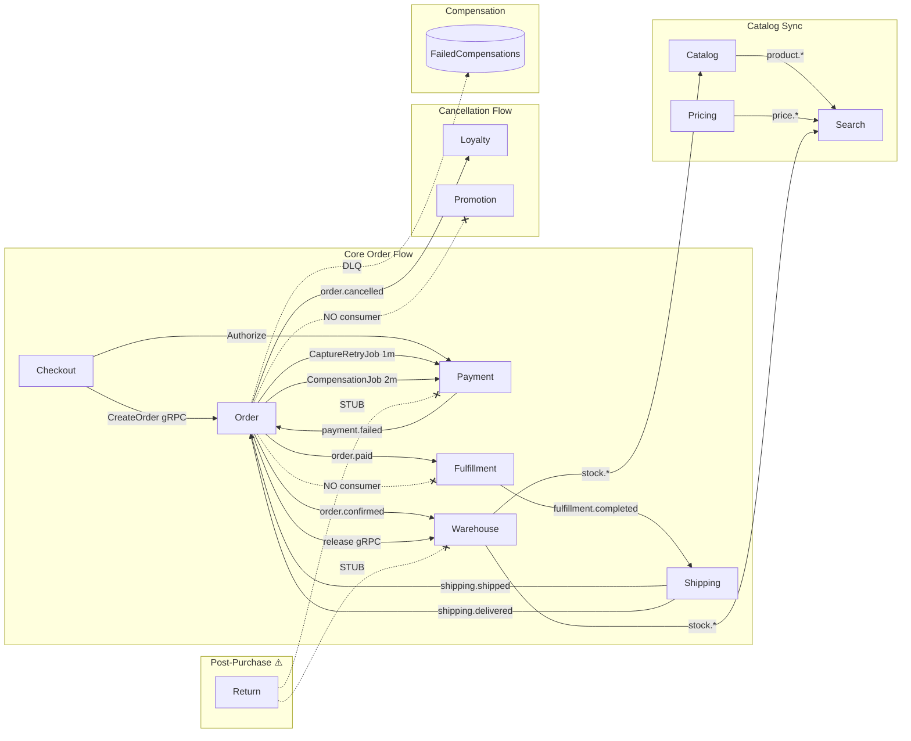
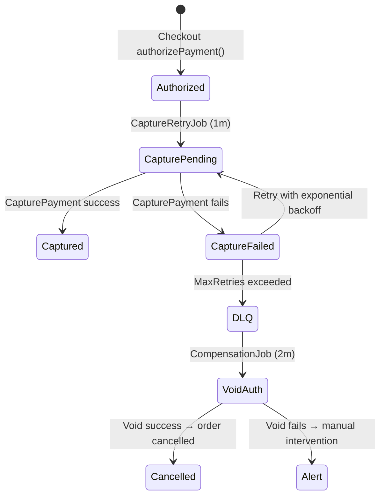

# Business Logic Review — E-commerce Microservices Platform (v2 — Re-indexed)
> **Date**: 2026-02-14 | **Reviewer**: Agent | **Version**: v5.1
> **Scope**: Full codebase re-index of 21 Go services + 2 frontends

---

## 1. Architecture Overview

### Service Maturity Matrix

| Service | Outbox | Event Idempotency | DLQ/Failed Events | Transactions | Critical? | Maturity |
|---------|--------|-------------------|-------------------|-------------|-----------|----------|
| **Order** | ✅ | ✅ (all 4 consumers) | ✅ FailedCompensation | ✅ | 🔴 | Production |
| **Checkout** | ❌ (uses Order's) | ✅ (Redis) | ✅ cart_cleanup | ✅ (errgroup) | 🔴 | Production |
| **Payment** | ✅ (outbox worker) | ✅ (Redis + gateway) | ✅ | ✅ (distributed lock) | 🔴 | Production |
| **Warehouse** | ✅ (transactional) | ❌ | ✅ | ✅ (TOCTOU fix) | 🔴 | Production |
| **Fulfillment** | ⚠️ (best-effort pub) | ✅ (eventbus/idempotency) | ❌ | ✅ (InTx) | 🟡 | Near-prod |
| **Shipping** | ✅ | ❌ | ❌ | ✅ (TransactionManager) | 🟡 | Near-prod |
| **Catalog** | ✅ | ❌ | ❌ | ✅ | 🟡 | Near-prod |
| **Pricing** | ✅ (worker/outbox) | ❌ | ❌ | ✅ | 🟡 | Near-prod |
| **Promotion** | ✅ | ❌ | ❌ | ✅ | 🟡 | Partial |
| **Loyalty** | ❌ | ✅ (TransactionExists) | ❌ | ✅ (InTx) | 🟡 | Near-prod |
| **Return** | ❌ | ❌ | ❌ | ✅ (WithTransaction) | 🟡 | **STUB** |
| **Customer** | ❌ | ❌ | ❌ | ✅ | 🟢 | Near-prod |
| **Notification** | ❌ | ❌ | ❌ | — | 🟢 | Functional |
| **Search** | — (consumer only) | ❌ | ❌ | — | 🟢 | Near-prod |

---

## 2. Data Consistency Risks

### 🔴 RISK-001: Checkout SAGA-001 Void Failure → Money Stuck
- **Flow**: `authorizePayment()` succeeds → `createOrderAndConfirmReservations()` fails → `VoidAuthorization` also fails
- **Current**: `confirm.go:286-294` — void attempt, failure only logged as CRITICAL. **No DLQ entry created.**
- **Impact**: Customer's money held indefinitely on their card
- **Fix**: Add DLQ entry + alert when void fails (2h effort)

### 🔴 RISK-002: Return Service Refund Is a STUB — No Actual Money Movement
- **Flow**: Return approved → status=`completed` → `processReturnRefund()` called
- **Current**: `refund.go:9-14` — **Entire function is just a log statement + `return nil`**. No payment service call, no gRPC client, no event published.
- **Impact**: Returns marked as "completed" without any refund being initiated. Customer never gets money back.
- **Evidence**: `restockReturnedItems()` is also a stub (log + return nil). Neither function is even called from anywhere in the codebase (grep found 0 call sites).
- **Fix**: Implement payment service gRPC client integration + outbox for refund events (8h+ effort)

### 🔴 RISK-003: Return Service Restock Is a STUB — Inventory Never Returned
- **Flow**: Return received+inspected → items marked restockable → `restockReturnedItems()` called
- **Current**: `restock.go:9-14` — **Same as refund: just a log statement.**
- **Impact**: Returned items never added back to warehouse inventory. Permanent stock shrinkage per return.
- **Fix**: Implement warehouse reservation/inventory service integration (4h effort)

### 🔴 RISK-004: Return Items Use Hardcoded Placeholder Data
- **Flow**: `CreateReturnRequest()` → creates return items
- **Current**: `return.go:127-133` — ProductID=`"stub-product"`, ProductSKU=`"stub-sku"`, ProductName=`"Stub Product"`, UnitPrice=`10.0`, RefundAmount=`10.0 * quantity`
- **Impact**: All return items have wrong product info and wrong refund amounts
- **Fix**: Fetch actual order item details from Order service before creating return items (4h effort)

### 🟡 RISK-005: Promotion Usage Not Reversed on Order Cancellation
- **Flow**: Checkout applies promo → `order.cancelled` event published → Promotion service has **NO consumer** for this event
- **Current**: Grep confirms zero `order.cancelled` references in promotion service
- **Impact**: Customer loses promo usage slot permanently
- **Fix**: Add `order.cancelled` event consumer in promotion service to reverse usage (4h effort)

### 🟡 RISK-006: Fulfillment Not Notified of Order Cancellation
- **Flow**: Order cancelled → warehouse reservations released (sync gRPC) → `order.status.changed` event published
- **Current**: Fulfillment does NOT consume `order.cancelled` or `order.status.changed`
- **Impact**: If order cancelled after fulfillment started, warehouse keeps picking/packing items for a cancelled order
- **Fix**: Add fulfillment event consumer for order cancellation (4h effort)

### 🟡 RISK-007: Return Events Published Without Outbox
- **Flow**: Return status updated → `eventPublisher.PublishReturnApproved/Rejected/Completed` called
- **Current**: Events published with `_ =` (error discarded) OUTSIDE the DB transaction. If event publish fails, return is committed but downstream services never notified.
- **Impact**: Approved returns never generate shipping labels; completed returns never trigger refunds (if refunds were implemented)
- **Fix**: Add transactional outbox pattern to return service (6h effort)

### ✅ ~~RISK-008: Loyalty Points Not Reversed on Cancel~~ (CORRECTED)
- **Previous checklist said this was missing. This was WRONG.**
- **Actual**: Loyalty-rewards has a well-implemented `handleOrderCancelled()` in `worker/event/order_events.go:78-125` with:
  - `TransactionExists("order_cancellation", orderID)` for idempotency
  - `FindBySourceID("order", orderID)` to find original points
  - `DeductPoints()` to reverse exact amount
  - Full error logging and NACK for retry

---

## 3. Saga / Retry / Compensate Pattern Audit

### Payment Saga ✅ (Well-Implemented)

| Component | Status | Notes |
|-----------|--------|-------|
| Phase 1: Authorize + State tracking | ✅ | `PaymentSagaState` field on order |
| Phase 2: Capture retry (exponential backoff) | ✅ | `CaptureRetryJob` (1m, max retries) |
| Phase 3: Compensation (void + cancel order) | ✅ | `PaymentCompensationJob` (2m, DLQ, alerts) |
| DLQ for exhausted retries | ✅ | `FailedCompensation` table + repo |
| Alert on critical failures | ✅ | `AlertService.TriggerAlert()` |
| Event idempotency (all 4 consumers) | ✅ | `EventIdempotencyRepo` per consumer |

### Order Cancellation Flow ✅ (Partial)

| Step | Status | Notes |
|------|--------|-------|
| Status validation (can't cancel completed) | ✅ | |
| Release warehouse reservations (sync gRPC) | ✅ | With 3x retry + exponential backoff |
| Update order status + CancelledAt | ✅ | |
| Prometheus metrics | ✅ | `OrdersCancelledTotal`, `OrderStatusChangesTotal` |
| Status history entry | ✅ | `createStatusHistory()` |
| Publish status changed event | ✅ | |
| Loyalty points reversed | ✅ | Consumer in loyalty-rewards |
| Promotion usage reversed | ❌ | **No consumer in promotion service** |
| Fulfillment notified to stop | ❌ | **No consumer in fulfillment** |
| Refund initiated | ✅ | `CancellationUsecase.InitiateRefund()` |

### Warehouse Outbox ✅ (Well-Implemented)

| Component | Status | Notes |
|-----------|--------|-------|
| Transactional outbox write | ✅ | Reservation + outbox in same DB tx |
| Outbox worker polling | ✅ | Polls + publishes pending events |
| Reservation expiry cleanup | ✅ | `ExpireReservation` worker |
| TOCTOU race prevention | ✅ | Transaction-based `ReserveStock` (P0-5 FIX) |
| Stock movement audit trail | ✅ | Full inventory logging |

### Checkout SAGA-001 ⚠️ (Partial)

| Component | Status | Notes |
|-----------|--------|-------|
| Payment void on order failure | ✅ | `confirm.go:286-294` |
| DLQ for void failure | ❌ | **Only logged as CRITICAL** |
| Reservation release on failure | ✅ | `releaseReservationsAndCleanupCart` |
| Cart cleanup DLQ | ✅ | `failedCompensationRepo` |
| Idempotency (prevent duplicate orders) | ✅ | Redis + 24h TTL |

---

## 4. Edge Cases

### EC-001: Concurrent Checkout of Same Cart
- **Risk**: Two simultaneous requests both pass idempotency check, both authorize payment
- **Current**: Redis set is done AFTER success, not as `SETNX` lock at start
- **Fix**: Use `SETNX` at START of ConfirmCheckout

### EC-002: Payment Authorization Expires Before Capture
- **Risk**: `CaptureRetryJob` has max retries but no `authorization_expires_at` check
- **Fix**: Check expiry before capture attempt

### EC-003: Price Change During Active Checkout
- **Risk**: Race between `calculateTotals` and `createOrder` — customer sees one price, charged another
- **Fix**: Compare calculated price at order creation; reject if different

### EC-004: Fulfillment Batch Picking Uses Best-Effort Events
- **Risk**: `batch_picking.go:131` — Comment says "best-effort; outbox would be stronger"
- **Impact**: Picklist created in DB but status change event may not reach downstream
- **Fix**: Add outbox to fulfillment event publishing

### EC-005: Return Eligibility Check Allows Nil CompletedAt
- **Risk**: `return.go:373-380` — If `CompletedAt` is nil but status is "delivered", 30-day window check is skipped entirely
- **Impact**: Returns could be requested indefinitely for orders with missing completion timestamps
- **Fix**: Fall back to `UpdatedAt` or block return if `CompletedAt` is nil

---

## 5. Implementation Priority Matrix

### 🔴 P0 — Data Loss / Money at Risk

| # | Issue | Service(s) | Effort | Status |
|---|-------|------------|--------|--------|
| RISK-001 | SAGA-001 void failure no DLQ | checkout | 2h | `[ ]` |
| RISK-002 | Return refund is STUB | return, payment | 8h | `[ ]` |
| RISK-003 | Return restock is STUB | return, warehouse | 4h | `[ ]` |
| RISK-004 | Return items hardcoded data | return | 4h | `[ ]` |
| EC-001 | Concurrent checkout duplicate payment | checkout | 4h | `[ ]` |

### 🟡 P1 — Business Logic Correctness

| # | Issue | Service(s) | Effort | Status |
|---|-------|------------|--------|--------|
| RISK-005 | Promotion not reversed on cancel | promotion | 4h | `[ ]` |
| RISK-006 | Fulfillment not notified on cancel | fulfillment | 4h | `[ ]` |
| RISK-007 | Return events no outbox | return | 6h | `[ ]` |
| EC-002 | Auth expiry not checked before capture | order/worker | 2h | `[ ]` |
| EC-003 | Price change during checkout race | checkout | 4h | `[ ]` |

### 🟢 P2 — Robustness

| # | Issue | Service(s) | Effort | Status |
|---|-------|------------|--------|--------|
| EC-004 | Fulfillment best-effort events | fulfillment | 6h | `[ ]` |
| EC-005 | Return eligibility nil CompletedAt | return | 1h | `[ ]` |
| — | Add idempotency to warehouse consumers | warehouse | 4h | `[ ]` |
| — | Add idempotency to shipping consumers | shipping | 4h | `[ ]` |
| — | Add outbox to loyalty-rewards | loyalty-rewards | 6h | `[ ]` |
| — | Add DLQ/failed events to search | search | 4h | `[ ]` |

---

## 6. Cross-Service Event Contract Audit

| Event Topic | Publisher | Consumer(s) | Outbox | Idempotency | Status |
|-------------|-----------|-------------|--------|-------------|--------|
| `order.confirmed` | Order | Warehouse, Payment | ✅ | ✅ | ✅ |
| `order.paid` | Order | Fulfillment | ✅ | ✅ | ✅ |
| `order.status.changed` | Order | Loyalty, Notification | ✅ | ✅ | ⚠️ Missing: promotion, fulfillment |
| `order.cancelled` | Order | Loyalty | ✅ | ✅ | ⚠️ Missing: promotion, fulfillment |
| `order.completed` | Order | Loyalty | ✅ | ✅ | ✅ |
| `payment.confirmed` | Payment | Order | ✅ | ✅ | ✅ |
| `payment.failed` | Payment | Order | ✅ | ✅ | ✅ |
| `fulfillment.completed` | Fulfillment | Shipping | ⚠️ best-effort | ❌ | ⚠️ |
| `shipping.shipped` | Shipping | Order | ✅ | ✅ | ✅ |
| `shipping.delivered` | Shipping | Order | ✅ | ✅ | ✅ |
| `warehouse.stock.updated` | Warehouse | Catalog, Search | ✅ | ❌ | ⚠️ |
| `product.*` | Catalog | Search | ✅ | ❌ | ⚠️ |
| `price.*` | Pricing | Search | ✅ | ❌ | ⚠️ |
| `return.requested` | Return | — | ❌ | ❌ | 🔴 No outbox, no consumers |
| `return.approved` | Return | — | ❌ | ❌ | 🔴 No outbox, no consumers |
| `return.completed` | Return | — | ❌ | ❌ | 🔴 No outbox, no consumers |

---

## 7. Corrections from Previous Review (v5.0 → v5.1)

| Item | v5.0 Claim | v5.1 Correction |
|------|-----------|-----------------|
| RISK-008 | Loyalty points NOT reversed | **WRONG** — `handleOrderCancelled()` fully implemented with idempotency |
| Return refund | Listed as "needs outbox" | **More severe** — Entire refund function is a STUB (log only) |
| Return restock | Not mentioned | **STUB** — `restockReturnedItems()` is just a log statement |
| Return item data | Not mentioned | **HARDCODED** — "stub-product", UnitPrice=10.0 |
| Return events | Listed as needing outbox | **Double issue** — no outbox AND errors silently discarded (`_ =`) |
| EC-004 | Not mentioned | **NEW** — Fulfillment explicitly comments "outbox would be stronger" |
| EC-005 | Not mentioned | **NEW** — Return eligibility skips 30-day check when CompletedAt is nil |
| Search DLQ | "DLQ + sync job" | **Actually no DLQ** — grep found zero DLQ/dead-letter references in search |

---

## 8. Recommendations Summary

1. **Immediate (P0)**: The **return service** is the biggest gap — refund, restock, and item data are all stubs. This means the entire return/exchange workflow is non-functional for financial operations. Fix return service first (16h total).
2. **Short-term (P1)**: Add `order.cancelled` consumers for promotion reversal and fulfillment cancellation. Add checkout SAGA-001 DLQ for void failure.
3. **Medium-term (P2)**: Add outbox to fulfillment, loyalty-rewards. Add event idempotency to warehouse, shipping consumers. Add DLQ to search.
4. **Monitoring**: Add Prometheus metrics for outbox queue depth, DLQ entry count, saga state distribution, event processing lag.
