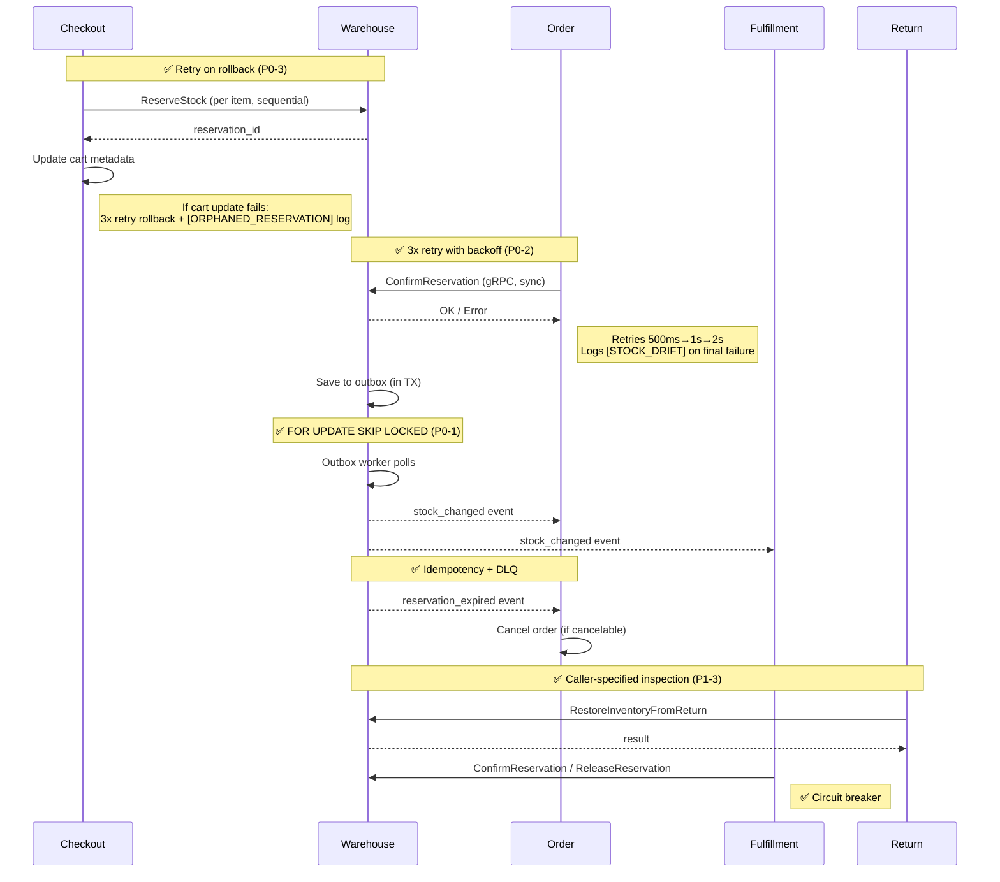

# Inventory Cross-Service Consistency & Edge Case Checklist

> **Date**: 2026-02-17  
> **Scope**: warehouse ↔ checkout, order, fulfillment, return  
> **Status**: ✅ Audit complete — 11/13 issues fixed  
> **Last Updated**: 2026-02-17 21:24

---

## 1. Data Consistency Between Services

### 1.1 Checkout → Warehouse (Stock Reservation Flow)

| # | Check | Status | Details |
|---|-------|--------|---------|
| 1.1.1 | Checkout calls `ReserveStock` per cart item sequentially | ✅ FIXED | **P0-3**: Rollback now retries 3x with 100ms backoff per reservation. Logs `[ORPHANED_RESERVATION]` on final failure |
| 1.1.2 | `RollbackReservationsMap` retries on failure | ✅ FIXED | [helpers.go](file:///d:/microservices/checkout/internal/biz/checkout/helpers.go) — 3-attempt retry with linear backoff + structured error logging |
| 1.1.3 | Cart update fails after reservations created | ⚠️ RISK | [start_helpers.go:108-111](file:///d:/microservices/checkout/internal/biz/checkout/start_helpers.go#L108-L111) — rollback attempted but reservations may already be committed while cart DB write failed |
| 1.1.4 | Checkout uses custom TTL for reservations | ⚠️ MISMATCH | Adapter hardcodes **15 min** TTL ([warehouse_adapter.go:43](file:///d:/microservices/checkout/internal/adapter/warehouse_adapter.go#L43)) while warehouse server allows payment-method-based TTL (30-120 min). Adapter ignores server's dynamic TTL |
| 1.1.5 | Reservation IDs stored in cart metadata | ✅ OK | Stored as `reservation_ids` array + `reservation_map` in cart.Metadata JSON |

### 1.2 Order → Warehouse (Reservation Lifecycle)

| # | Check | Status | Details |
|---|-------|--------|---------|
| 1.2.1 | Order consumes `reservation_expired` events | ✅ OK | [warehouse_consumer.go](file:///d:/microservices/order/internal/data/eventbus/warehouse_consumer.go) — idempotency via `CheckAndMark`, DLQ configured |
| 1.2.2 | Only cancelable orders are cancelled on expiry | ✅ OK | Status whitelist: `pending`, `awaiting_payment`, `payment_pending` |
| 1.2.3 | Order confirms reservation on payment success | ✅ FIXED | **P0-2**: `ConfirmReservation` now retries 3x with exponential backoff (500ms→1s→2s). Logs `[STOCK_DRIFT]` on final failure |
| 1.2.4 | Order releases reservation on order cancellation | ⚠️ UNKNOWN | Need to verify order cancellation handler calls `ReleaseReservation` |
| 1.2.5 | Order passes `orderID` to `ConfirmReservation` | ✅ OK | [warehouse_client.go:335-367](file:///d:/microservices/order/internal/data/grpc_client/warehouse_client.go#L335-L367) — passes `orderID` pointer |

### 1.3 Fulfillment → Warehouse

| # | Check | Status | Details |
|---|-------|--------|---------|
| 1.3.1 | Fulfillment checks warehouse capacity | ✅ OK (fail-open) | [warehouse_client.go:282-319](file:///d:/microservices/fulfillment/internal/data/grpc_client/warehouse_client.go#L282-L319) — returns `true` if client unavailable |
| 1.3.2 | Fulfillment confirms reservation before shipping | ✅ OK | Calls `ConfirmReservation(reservationID, orderID)` |
| 1.3.3 | Fulfillment releases reservation on cancellation | ✅ OK | Calls `ReleaseReservation(reservationID)` |
| 1.3.4 | Failed shipment restores stock | ⚠️ UNKNOWN | Need to verify fulfillment failure handler adjusts stock back |

### 1.4 Return → Warehouse (Stock Restoration)

| # | Check | Status | Details |
|---|-------|--------|---------|
| 1.4.1 | Return calls `RestoreInventoryFromReturn` | ✅ OK | Uses dedicated RPC with inspection results |
| 1.4.2 | `ReserveStockWithTTL` ignores TTL parameter | ✅ FIXED | **P1-1**: Now passes `expiresAt` via `timestamppb.New()` to gRPC request |
| 1.4.3 | `ExtendReservation` ignores `expiresAt` parameter | ✅ FIXED | **P1-2**: Now passes `expiresAt` via `timestamppb.New()` to gRPC request |
| 1.4.4 | Return-service uses hardcoded `"SELLABLE"` inspection | ✅ FIXED | **P1-3**: New `RestockItemWithInspection(inspectionResult)` method. `RestockItem` defaults to SELLABLE (backward compat) |
| 1.4.5 | `ReturnId` passed via `reason` field | ⚠️ HACK | Semantic issue only — functional behavior correct. Low priority |

---

## 2. Saga / Outbox / Retry Patterns

### 2.1 Transactional Outbox (Warehouse)

| # | Check | Status | Details |
|---|-------|--------|---------|
| 2.1.1 | Events saved in same TX as stock change | ✅ OK | `publishStockUpdatedEvent` saves to `outbox_events` within `InTx` |
| 2.1.2 | Outbox worker polls and publishes | ✅ OK | [outbox_worker.go](file:///d:/microservices/warehouse/internal/worker/outbox_worker.go) — 1s interval, batch 20, sequential processing |
| 2.1.3 | Retry with max attempts | ✅ OK | Max 5 retries, then `FAILED` status |
| 2.1.4 | `FetchPending` uses row-level locking | ✅ FIXED | **P0-1**: Added `FOR UPDATE SKIP LOCKED` — safe for multi-instance deployment |
| 2.1.5 | Event includes `event_id` for consumer idempotency | ✅ OK | [outbox_worker.go:125](file:///d:/microservices/warehouse/internal/worker/outbox_worker.go#L125) — injected before publish |
| 2.1.6 | Old completed events are cleaned up | ✅ OK | `DeleteOld` method exists for purging |
| 2.1.7 | Failed events have alerting/monitoring | ✅ OK | Prometheus metrics: `warehouse_outbox_events_failed_total` |
| 2.1.8 | Outbox events have OpenTelemetry tracing | ✅ OK | Span per event with attributes |

### 2.2 Consumer Idempotency

| # | Check | Status | Details |
|---|-------|--------|---------|
| 2.2.1 | Warehouse consumers use idempotency helper | ✅ OK | Uses `common/idempotency.GormIdempotencyHelper` with `event_idempotency` table |
| 2.2.2 | Order consumers use idempotency helper | ✅ OK | `CheckAndMark` pattern with `DeriveEventID` |
| 2.2.3 | DLQ configured for failed events | ✅ OK | `deadLetterTopic` set on all subscriptions |
| 2.2.4 | Idempotency key is deterministic | ✅ OK | `DeriveEventID(handlerName, businessKey)` |

### 2.3 Saga / Compensating Transactions

| # | Check | Status | Details |
|---|-------|--------|---------|
| 2.3.1 | Formal Saga orchestrator exists | ❌ NO | No orchestrator. Compensations are **ad-hoc** inline rollbacks |
| 2.3.2 | Checkout reservation rollback on failure | ✅ FIXED | **P0-3**: 3-attempt retry with backoff + `[ORPHANED_RESERVATION]` logging |
| 2.3.3 | Order → warehouse confirmation failure compensation | ✅ FIXED | **P0-2**: 3-attempt retry with exponential backoff (500ms→2s) + `[STOCK_DRIFT]` logging |
| 2.3.4 | Return → warehouse restock failure compensation | ⚠️ WEAK | Return service does not retry failed restock attempts (future improvement) |
| 2.3.5 | Backorder allocation is transactional | ✅ FIXED | **P1-5**: Wrapped `AllocateBackorders` loop in `InTx` — all-or-nothing |

### 2.4 Circuit Breaker Pattern

| # | Check | Status | Details |
|---|-------|--------|---------|
| 2.4.1 | Checkout → warehouse has circuit breaker | ✅ OK | Custom `CircuitBreaker` on all calls |
| 2.4.2 | Order → warehouse has circuit breaker | ✅ OK | `common/client/circuitbreaker` — trips after 5 consecutive failures |
| 2.4.3 | Fulfillment → warehouse has circuit breaker | ✅ OK | Custom `circuitbreaker.CircuitBreaker` |
| 2.4.4 | Return → warehouse has circuit breaker | ⚠️ PARTIAL | Uses `common_client.NewGRPCClientBuilder` with circuit breaker, but individual calls lack timeout context |
| 2.4.5 | gRPC calls have timeout context | ✅ MOSTLY | Order: 5-30s per operation. Fulfillment: 5-10s. Checkout: relies on default |

---

## 3. Data Mismatch Risks

### 3.1 Quantity Mismatches

| # | Risk | Severity | Scenario |
|---|------|----------|----------|
| 3.1.1 | **Phantom reservations** | ✅ MITIGATED | **P0-3**: Rollback now retries 3x. Remaining risk: TTL safety net still covers edge cases |
| 3.1.2 | **Double deduction** (multi-instance outbox) | ✅ FIXED | **P0-1**: `FOR UPDATE SKIP LOCKED` prevents duplicate processing |
| 3.1.3 | **Payment confirmed but stock not deducted** | ✅ MITIGATED | **P0-2**: 3x retry with exponential backoff. Risk only if warehouse is down >30s |
| 3.1.4 | **Reservation expired but order still active** | 🟡 P1 | Race condition still possible — needs distributed lock (future improvement) |
| 3.1.5 | **Return overstocks inventory** | ✅ FIXED | **P1-3**: `RestockItemWithInspection` accepts caller-specified inspection result |
| 3.1.6 | **Backorder quantity_backordered drift** | ✅ FIXED | **P1-6**: `Create` + `IncrementBackordered` now in same `InTx` |
| 3.1.7 | **Transfer creates but doesn't update** | ✅ SAFE | `TransferStock` is transactional (within TX) — no mismatch risk |

### 3.2 State Mismatches

| # | Risk | Severity | Scenario |
|---|------|----------|----------|
| 3.2.1 | **Reservation status in warehouse ≠ order expectation** | 🟡 P1 | If warehouse TTL expires a reservation while checkout extends it, order state and warehouse state diverge |
| 3.2.2 | **Backorder status out of sync** | 🟡 P1 | Backorder allocated event published but order doesn't consume it (no backorder consumer found in order service) |

---

## 4. Logic Edge Cases Not Handled

### 4.1 Concurrency Edge Cases

| # | Edge Case | Severity | Details |
|---|-----------|----------|---------|
| 4.1.1 | **Concurrent `ConfirmReservation` + `ExpireReservation`** | 🔴 P0 | Worker expires reservation (releases stock) while order simultaneously confirms (deducts stock). Double-deduction guard checks for existing outbound TXN, but the race window exists between check and write |
| 4.1.2 | **Concurrent `AdjustStock` on same product** | ✅ SAFE | Protected by `FOR UPDATE` + version check with 3 retries |
| 4.1.3 | **Concurrent reservation for last available unit** | ✅ SAFE | `IncrementReserved` within `FOR UPDATE` transaction prevents oversell |
| 4.1.4 | **Concurrent backorder allocation** | ✅ FIXED | **P1-5**: `AllocateBackorders` now wrapped in `InTx` — all-or-nothing |

### 4.2 Business Logic Edge Cases

| # | Edge Case | Severity | Details |
|---|-----------|----------|---------|
| 4.2.1 | **Negative stock after adjustment** | ✅ HANDLED | `AdjustStock` validates `quantityAfter >= 0` before update |
| 4.2.2 | **Reserve more than available** | ✅ HANDLED | `ReserveStock` checks `availableStock >= quantity` within TX |
| 4.2.3 | **Cancel already-cancelled reservation** | ✅ HANDLED | Status check prevents re-cancellation |
| 4.2.4 | **Confirm already-confirmed reservation** | ✅ HANDLED | Double-deduction guard checks existing outbound TXN |
| 4.2.5 | **Adjust zero quantity** | ✅ HANDLED | Validated in `AdjustmentUsecase.CreateRequest` |
| 4.2.6 | **Transfer to same warehouse** | ✅ ALREADY OK | **P1-4**: `ValidateTransferStockRequest` already checks `fromWH ≠ toWH` at `validator.go:87-89` |
| 4.2.7 | **Reservation with past `expiresAt`** | ✅ FIXED | **P2-1**: `ReserveStock` now rejects `expiresAt` in the past |
| 4.2.8 | **Backorder for product without inventory record** | ⚠️ PARTIAL | Creates backorder even without inventory record — intentional for pre-order scenarios |
| 4.2.9 | **Bulk transfer with duplicate products** | ✅ FIXED | **P2-2**: `ValidateBulkTransferStockRequest` now checks for duplicate product+warehouse combos |
| 4.2.10 | **Return with quantity > originally ordered** | ❌ NOT CHECKED | No cross-check against order quantities in `RestoreInventoryFromReturn` |
| 4.2.11 | **Overflow on `int32` stock quantities** | ❌ NOT CHECKED | Repeated `IncrementAvailable` calls could overflow `int32` (max ~2.1B) — unlikely but no guard |
| 4.2.12 | **Multiple reservation expirations for same product** | ✅ SAFE | Each reservation is independent with own TTL and idempotency |

### 4.3 Infrastructure Edge Cases

| # | Edge Case | Severity | Details |
|---|-----------|----------|---------|
| 4.3.1 | **Outbox worker crash mid-batch** | ⚠️ RISK | Events fetched as PENDING but not yet processed. On restart, re-fetched and re-published → duplicates (mitigated by consumer idempotency) |
| 4.3.2 | **Database failover during TX** | ✅ HANDLED | TX rollback on connection loss, pessimistic locks released |
| 4.3.3 | **gRPC deadline exceeded** | ✅ HANDLED | All clients have explicit timeout context |
| 4.3.4 | **Outbox event payload corruption** | ✅ HANDLED | JSON unmarshal failure → FAILED status, Prometheus metric incremented |

---

## 5. Fix Status Tracking

### 🔴 P0 — Must Fix

| # | Issue | Status | Fix Applied |
|---|-------|--------|-------------|
| **P0-1** | Outbox `FetchPending` no row lock | ✅ DONE | Added `FOR UPDATE SKIP LOCKED` in [outbox.go](file:///d:/microservices/warehouse/internal/data/postgres/outbox.go) |
| **P0-2** | `ConfirmReservation` failure after payment has no retry | ✅ DONE | 3x retry with exponential backoff in [warehouse_client.go](file:///d:/microservices/order/internal/data/grpc_client/warehouse_client.go) |
| **P0-3** | Checkout `RollbackReservationsMap` fire-and-forget | ✅ DONE | 3x retry with linear backoff in [helpers.go](file:///d:/microservices/checkout/internal/biz/checkout/helpers.go) |

### 🟡 P1 — Should Fix

| # | Issue | Status | Fix Applied |
|---|-------|--------|-------------|
| **P1-1** | Return client ignores TTL param | ✅ DONE | Passes `expiresAt` via `timestamppb.New()` in [warehouse_inventory_grpc_client.go](file:///d:/microservices/return/internal/client/warehouse_inventory_grpc_client.go) |
| **P1-2** | Return client ignores `expiresAt` param | ✅ DONE | Passes `expiresAt` to `ExtendReservationRequest` |
| **P1-3** | Return client hardcodes `"SELLABLE"` | ✅ DONE | New `RestockItemWithInspection(inspectionResult)` method (backward compat) |
| **P1-4** | Transfer to same warehouse | ✅ ALREADY OK | `ValidateTransferStockRequest` already had this check at `validator.go:87-89` |
| **P1-5** | Backorder allocation not transactional | ✅ DONE | Wrapped in `InTx` in [allocation.go](file:///d:/microservices/warehouse/internal/biz/backorder/allocation.go) |
| **P1-6** | `CreateBackorder` qty_backordered outside TX | ✅ DONE | `Create` + `IncrementBackordered` in same `InTx` in [queue.go](file:///d:/microservices/warehouse/internal/biz/backorder/queue.go) |

### 🟢 P2 — Nice-to-Have

| # | Issue | Status | Fix Applied |
|---|-------|--------|-------------|
| **P2-1** | No `expiresAt > now` validation | ✅ DONE | Server-side validation in [reservation.go](file:///d:/microservices/warehouse/internal/biz/reservation/reservation.go) |
| **P2-2** | Bulk transfer no duplicate check | ✅ DONE | Dedup check in [validator.go](file:///d:/microservices/warehouse/internal/biz/inventory/validator.go) |
| **P2-3** | Return qty not cross-checked with order | ⏳ DEFERRED | Requires cross-service call — better as warehouse RPC handler-level check |

### 🔵 Remaining Items (Not Yet Addressed)

| # | Issue | Priority | Next Step |
|---|-------|----------|-----------|
| R-1 | Race between reservation expiry + confirmation | ✅ DONE | `FindByIDForUpdate` in both `ConfirmReservation` and `ExpireReservation` |
| R-2 | Return restock failure has no retry | ✅ DONE | 3x retry with exponential backoff (200ms→400ms) + `[RESTOCK_FAILED]` log |
| R-3 | Order cancellation → ReleaseReservation verification | ✅ ALREADY OK | `releaseReservationWithRetry` + DLQ + restock fallback |
| R-4 | Failed shipment stock restoration | ✅ ALREADY OK | `CancelFulfillment` releases. Pick/pack failures are retryable (intentional) |
| R-5 | Checkout adapter hardcodes 15min TTL | ✅ DONE | Pass `nil` — server applies payment-method-based TTL |
| R-6 | `ReturnId` passed via `reason` field | ⏳ DEFER | Proto change required |
| R-7 | Return qty > ordered qty check | ⏳ DEFER | Cross-service validation |
| R-8 | No formal Saga orchestrator | ⏳ DEFER | Architectural decision |

---

## 6. Architecture Summary (Post-Fix)

---

## 7. Files Analyzed

| Service | File | Purpose |
|---------|------|---------|
| checkout | [warehouse_adapter.go](file:///d:/microservices/checkout/internal/adapter/warehouse_adapter.go) | Warehouse API adapter |
| checkout | [warehouse.go](file:///d:/microservices/checkout/internal/client/warehouse.go) | gRPC client with circuit breaker |
| checkout | [start_helpers.go](file:///d:/microservices/checkout/internal/biz/checkout/start_helpers.go) | Reservation + compensating TX |
| checkout | [helpers.go](file:///d:/microservices/checkout/internal/biz/checkout/helpers.go) | RollbackReservationsMap |
| order | [warehouse_consumer.go](file:///d:/microservices/order/internal/data/eventbus/warehouse_consumer.go) | Reservation expired event consumer |
| order | [warehouse_client.go](file:///d:/microservices/order/internal/data/grpc_client/warehouse_client.go) | gRPC client with circuit breaker |
| fulfillment | [warehouse_client.go](file:///d:/microservices/fulfillment/internal/data/grpc_client/warehouse_client.go) | gRPC client with circuit breaker |
| return | [warehouse_inventory_grpc_client.go](file:///d:/microservices/return/internal/client/warehouse_inventory_grpc_client.go) | gRPC client — ✅ P1-1/2/3 fixed |
| warehouse | [outbox_worker.go](file:///d:/microservices/warehouse/internal/worker/outbox_worker.go) | Outbox event processor |
| warehouse | [outbox.go](file:///d:/microservices/warehouse/internal/data/postgres/outbox.go) | Outbox DB queries — ✅ P0-1 fixed |
| warehouse | [allocation.go](file:///d:/microservices/warehouse/internal/biz/backorder/allocation.go) | Backorder allocation — ✅ P1-5 fixed |
| warehouse | [queue.go](file:///d:/microservices/warehouse/internal/biz/backorder/queue.go) | Backorder queue — ✅ P1-6 fixed |
| warehouse | [reservation.go](file:///d:/microservices/warehouse/internal/biz/reservation/reservation.go) | Reservation — ✅ P2-1 fixed |
| warehouse | [validator.go](file:///d:/microservices/warehouse/internal/biz/inventory/validator.go) | Transfer validation — ✅ P2-2 fixed |
| warehouse | [outbox_repo.go](file:///d:/microservices/warehouse/internal/repository/outbox/outbox_repo.go) | Outbox repository interface |
| warehouse | [idempotency.go](file:///d:/microservices/warehouse/internal/data/eventbus/idempotency.go) | Event idempotency helper |
