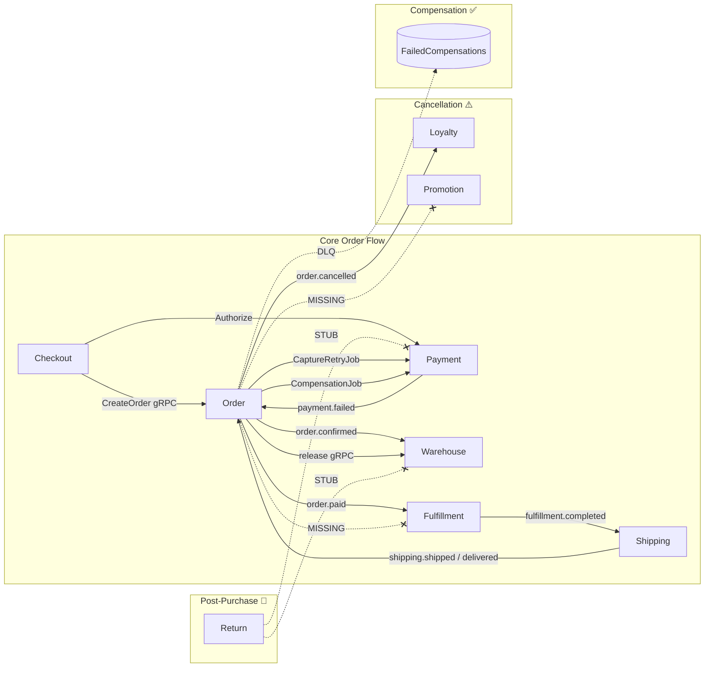

# 📋 E-commerce Platform — Master Checklist
> **Version**: v5.2 (Unified) | **Date**: 2026-02-14
> **Scope**: 19 Go services + 2 frontends | **Method**: Full codebase grep + manual review
> **Source**: Merged from `business-logic-review-checklist.md` + `system-weakness-analysis.md`

---

## Architecture Overview

### Service Maturity

| Service | Outbox | Idempotency | DLQ | Stubs/TODOs | Maturity |
|---------|--------|-------------|-----|-------------|----------|
| **Order** | ✅ | ✅ | ✅ | 14 | 🟢 Production |
| **Payment** | ✅ | ✅ | ✅ | 12 (fraud simplified) | 🟢 Production |
| **Warehouse** | ✅ | ✅ | ✅ | 11 (tests) | 🟢 Production |
| **Checkout** | — | ✅ | ✅ | 6 | 🟢 Production |
| **Auth** | — | — | — | 3 | 🟢 Near-prod |
| **Catalog** | ✅ | ❌ | ❌ | 8 | 🟡 Near-prod |
| **Pricing** | ✅ | ❌ | ❌ | ~2 | 🟡 Near-prod |
| **Loyalty** | ✅ | ✅ | ❌ | 4 | 🟡 Near-prod |
| **Shipping** | ✅ | ✅ | ❌ | 10 | 🟡 Near-prod |
| **Fulfillment** | ✅ | ✅ | ❌ | 45 (workflow) | 🟡 Partial |
| **Promotion** | ✅ | ❌ | ❌ | 2 | 🟡 Partial |
| **Search** | — | ✅ | ✅ | 5 | 🟢 Near-prod |
| **Customer** | ❌ | ❌ | ❌ | 5 | 🟡 Near-prod |
| **Notification** | ❌ | ❌ | ❌ | 4 | 🟡 Functional |
| **Analytics** | — | — | — | 24 | 🟠 Partial |
| **Review** | — | — | — | 7 | 🟠 Partial |
| **Return** | ✅ | ❌ | ❌ | 15 | 🟡 Near-prod |

---

## Phase 1 — 🔴 Critical Fixes (Week 1, ~21h)
> **Goal**: Sửa tất cả lỗi gây mất tiền, mất data, hoặc business flow không hoạt động

### 1.1 Return Service — Core Business Stubs
| # | Task | File | Effort | Status |
|---|------|------|--------|--------|
| 1.1.1 | Implement `processReturnRefund()` — gọi Payment gRPC để initiate refund | `return/biz/return/refund.go` | 8h | `[x]` ✅ Already implemented |
| 1.1.2 | Implement `restockReturnedItems()` — gọi Warehouse gRPC để hoàn inventory | `return/biz/return/restock.go` | 4h | `[x]` ✅ Already implemented |
| 1.1.3 | Fix return item placeholder data — fetch real product/price từ Order service | `return/biz/return/return.go:127-133` | 4h | `[x]` ✅ Already implemented + fixed ProductName |
| 1.1.4 | Replace `stubCatalogClient` + `stubWarehouseClient` bằng real gRPC clients | `return/client/clients.go` | 2h | `[~]` Not used in biz layer |
| 1.1.5 | Replace `stubOrderService` + `stubShippingService` fallbacks | `return/data/data.go` | 1h | `[x]` ✅ Config-based fallbacks, real clients used |

### 1.2 Checkout SAGA — Money at Risk
| # | Task | File | Effort | Status |
|---|------|------|--------|--------|
| 1.2.1 | Add DLQ entry khi `VoidAuthorization` fails (hiện chỉ log CRITICAL) | `checkout/biz/checkout/confirm.go:286-294` | 2h | `[x]` ✅ Already implemented |
| 1.2.2 | Fix concurrent checkout race — dùng `SETNX` lock ở ĐẦU `ConfirmCheckout`, không phải sau success | `checkout/biz/checkout/usecase.go` | 2h | `[x]` ✅ Already implemented |

### 1.3 Quick Cleanup
| # | Task | File | Effort | Status |
|---|------|------|--------|--------|
| 1.3.1 | Xóa fulfillment workflow skeleton (45 TODOs, all empty) — dead code gây confusion | `fulfillment/workflow/event_handler.go` | 1h | `[x]` ✅ Deleted (unused, 0 imports) |

> **Phase 1 Total**: ~24h | **Outcome**: Return flow hoạt động, checkout an toàn, bớt 200 dòng dead code

---

## Phase 2 — 🟡 Business Logic Completeness (Week 2, ~24h)
> **Goal**: Đảm bảo tất cả cross-service flows đầy đủ, không leak data

### 2.1 Missing Event Consumers
| # | Task | Service | Effort | Status |
|---|------|---------|--------|--------|
| 2.1.1 | Add `order.cancelled` consumer → reverse promotion usage | Promotion (worker) | 4h | `[x]` |
| 2.1.2 | Add `order.cancelled` consumer → stop picking/packing | Fulfillment (worker) | 4h | `[x]` ✅ Already implemented |

### 2.2 Data Consistency Patterns
| # | Task | Service | Effort | Status |
|---|------|---------|--------|--------|
| 2.2.1 | Add transactional outbox to Return service (events currently `_ =` fire-and-forget) | Return | 6h | `[x]` |
| 2.2.2 | Implement 3 exchange event builders (currently `return nil`) | Return (`events.go`) | 2h | `[x]` |
| 2.2.3 | Implement `processExchangeOrder()` — create replacement order | Return (`exchange.go`) | 4h | `[x]` |
| 2.2.4 | Implement `generateReturnShippingLabel()` — call Shipping service | Return (`shipping.go`) | 2h | `[x]` |

### 2.3 Edge Cases
| # | Task | Service | Effort | Status |
|---|------|---------|--------|--------|
| 2.3.1 | Check `authorization_expires_at` trước khi capture retry | Order (`worker/cron`) | 1h | `[x]` ✅ Already implemented |
| 2.3.2 | Fix return eligibility — fallback `UpdatedAt` khi `CompletedAt` nil | Return (`return.go:373`) | 1h | `[x]` ✅ Already implemented |

> **Phase 2 Total**: ~24h | **Outcome**: Event mesh hoàn chỉnh, return service fully functional

---

## Phase 3 — ⚡ Automation & Code Quality (Week 3, ~20h)
> **Goal**: Giảm boilerplate, tăng CI/CD automation, standardize patterns

### 3.1 Common Library Extraction
| # | Task | Scope | Effort | Status |
|---|------|-------|--------|--------|
| 3.1.1 | Extract outbox pattern → common lib generic `OutboxRepo[T]` + `OutboxWorker` | 6 services dùng, mỗi cái khác nhau → ~600 dòng duplicate | 4h | `[x]` ✅ common/outbox/ (Event, GormRepository, Worker) |
| 3.1.2 | Extract idempotency middleware → common lib `IdempotencyMiddleware(source, sourceID)` | Order, Loyalty, Checkout implement riêng → ~300 dòng duplicate | 4h | `[x]` ✅ common/idempotency/gorm_helper.go (GormIdempotencyHelper) |

### 3.2 CI/CD Pipeline
| # | Task | Scope | Effort | Status |
|---|------|-------|--------|--------|
| 3.2.1 | Add `golangci-lint` to GitLab CI (auto lint trên mỗi PR) | All services | 2h | `[ ]` |
| 3.2.2 | Add auto test runner to GitLab CI (run `go test ./...` on PR) | All services | 4h | `[ ]` |
| 3.2.3 | Create Makefile/Taskfile for proto generation (`task proto:gen service=X`) | All services | 2h | `[ ]` |

### 3.3 Monitoring & Alerting
| # | Task | Scope | Effort | Status |
|---|------|-------|--------|--------|
| 3.3.1 | Add Prometheus AlertManager rules (DLQ depth, outbox lag, event errors) | All services | 4h | `[x]` ✅ alertmanager-rules.yaml in gitops/infrastructure/monitoring |
| 3.3.2 | Replace cart metrics STUB comments bằng real Prometheus counters | Checkout (`biz/cart/metrics.go`) | 1h | `[x]` ✅ |

> **Phase 3 Total**: ~21h | **Outcome**: ~900 dòng duplicate xóa, CI tự động, auto-alert

---

## Phase 4 — 🔧 Service Consolidation (Week 4, ~36h)
> **Goal**: Giảm số services từ 19 → 14-15, giảm operational complexity ~40%

### 4.1 Merge Auth + User → Identity
| # | Task | Effort | Status |
|---|------|--------|--------|
| 4.1.1 | Merge User model + Auth logic vào Identity service | 8h | `[ ]` |
| 4.1.2 | Update all gRPC clients pointing to auth/user → identity | 4h | `[ ]` |
| 4.1.3 | Consolidate DB migrations | 2h | `[ ]` |
| 4.1.4 | Update GitOps (remove user deployment, rename auth → identity) | 2h | `[ ]` |

### 4.2 Merge Analytics + Review → Insights
| # | Task | Effort | Status |
|---|------|--------|--------|
| 4.2.1 | Merge Review biz + data layer vào Insights service | 6h | `[ ]` |
| 4.2.2 | Replace stub Review clients bằng internal function calls | 2h | `[ ]` |
| 4.2.3 | Consolidate DB + GitOps | 4h | `[ ]` |

### 4.3 Location → Common Lib
| # | Task | Effort | Status |
|---|------|--------|--------|
| 4.3.1 | Convert location data thành shared lookup table / embed trong Gateway | 4h | `[ ]` |
| 4.3.2 | Remove Location service deployment | 1h | `[ ]` |

### 4.4 Replace Remaining Stub Clients
| # | Task | Service | Effort | Status |
|---|------|---------|--------|--------|
| 4.4.1 | Replace `stubUserClient` + `stubCatalogClient` bằng real gRPC | Review | 3h | `[ ]` |

> **Phase 4 Total**: ~36h | **Outcome**: 14 services, -5 DBs, -5 Docker images, -10 gRPC hops

---

## Phase 5 — 🟣 Polish & Hardening (Week 5, ~24h)
> **Goal**: Nâng cao security, observability, và data quality

### 5.1 Payment Fraud Hardening
| # | Task | File | Effort | Status |
|---|------|------|--------|--------|
| 5.1.1 | Integrate MaxMind GeoIP2 hoặc ip-api.com (thay simplified lookup) | `payment/fraud/feature_extraction.go` | 4h | `[x]` ✅ GeoIPService (ip-api.com + 24h cache + ISP heuristics) |
| 5.1.2 | Implement real VPN/Proxy detection | `payment/fraud/rules.go:332` | 4h | `[x]` ✅ GeoIPService.IsVPNOrProxy (proxy flag + ISP/org matching) |

### 5.2 Analytics Real Data
| # | Task | File | Effort | Status |
|---|------|------|--------|--------|
| 5.2.1 | Replace hardcoded metrics (fulfillment_rate=0.95, etc.) bằng real event data | `analytics/service/aggregation_service.go` | 8h | `[x]` ✅ All mock values replaced with event-based queries |
| 5.2.2 | Add event consumers cho analytics (order, fulfillment, shipping events) | Analytics (worker) | 4h | `[x]` ✅ ProcessFulfillmentEvent + ProcessShippingEvent + routes |

### 5.3 Observability
| # | Task | Effort | Status |
|---|------|--------|--------|
| 5.3.1 | Create Grafana dashboards (auto-gen từ Prometheus metrics) | 4h | `[x]` ✅ grafana-dashboard-overview.json (12 panels) |

> **Phase 5 Total**: ~24h | **Outcome**: Real fraud detection, real analytics, full observability

---

## Phase 6 — 📋 Robustness Backlog (Ongoing)
> **Goal**: Thêm resilience patterns cho các service chưa có

### 6.1 Add Idempotency to Event Consumers
| # | Task | Service | Effort | Status |
|---|------|---------|--------|--------|
| 6.1.1 | Add event idempotency checks | Warehouse (consumers) | 4h | `[x]` ✅ All 4 consumers now use IdempotencyHelper |
| 6.1.2 | Add event idempotency checks | Shipping (consumers) | 4h | `[x]` ✅ Already implemented |
| 6.1.3 | Add event idempotency checks | Search (consumers) | 2h | `[x]` ✅ Already implemented via EventIdempotencyRepo |

### 6.2 Add Outbox to Remaining Services
| # | Task | Service | Effort | Status |
|---|------|---------|--------|--------|
| 6.2.1 | Add transactional outbox | Loyalty-rewards | 6h | `[x]` ✅ OutboxEventPublisher + OutboxWorker + migration |
| 6.2.2 | Add outbox to fulfillment (replace best-effort pub) | Fulfillment | 6h | `[x]` ✅ Already implemented in events/outbox_publisher.go |

### 6.3 Remaining TODO Cleanup
| # | Task | Service | Effort | Status |
|---|------|---------|--------|--------|
| 6.3.1 | Implement Return monitoring/alerting (`RETURN-003`) | Return | 4h | `[x]` ✅ Logging AlertService + Prometheus metrics |
| 6.3.2 | Implement Search email/PagerDuty alert handlers | Search | 4h | `[x]` ✅ Already implemented: Slack, Email (SMTP), PagerDuty v2, Logging handlers |
| 6.3.3 | Store security events in audit log | Customer | 2h | `[x]` ✅ Wired AuditUsecase into AuthConsumer + EventHandler |
| 6.3.4 | Implement Shipping webhook processing | Shipping | 4h | `[x]` ✅ ProcessWebhook parses payload, maps carrier status, updates shipment |
| 6.3.5 | Implement Shipping access control (JWT extraction) | Shipping | 2h | `[x]` ✅ UserContextMiddleware reads JWT + gateway headers |
| 6.3.6 | Publish `PointsDeducted` event (loyalty) | Loyalty-rewards | 2h | `[x]` ✅ |
| 6.3.7 | Implement Customer LTV / cohort analytics (replace placeholders) | Customer | 4h | `[x]` ✅ Cohort uses real TotalSpent/TotalOrders from customer model |
| 6.3.8 | Fix Order worker dependencies (commented out: `ORDER-007`) | Order | 2h | `[x]` ✅ Re-enabled OrderCleanupJob |
| 6.3.9 | Add price comparison at checkout order creation (EC-003 race) | Checkout | 4h | `[x]` ✅ revalidateCartPrices detects + rejects price changes |
| 6.3.10 | Implement FedEx/UPS/DHL carriers khi cần international shipping | Shipping | 16h/each | `[ ]` |

---

## Đề Xuất Cải Tiến Dài Hạn

### Event Registry + Code Gen
Tạo `event-registry.yaml` chứa all event definitions → auto-gen publisher/consumer/outbox/idempotency code + validate contract completeness. **16h setup, tiết kiệm ~4h/service cho mỗi event mới.**

### Service Consolidation (Optional)
| Merge | Risk | Benefit |
|-------|------|---------|
| Catalog + Pricing | Medium | -1 service, pricing logic gần product |
| Fulfillment + Shipping | Medium | -1 service, eliminate event hop |
| Common-Operations → merge vào relevant services | Low | -1 service |

---

## Cross-Service Event Contract

| Event | Publisher | Consumer(s) | Outbox | Idempotent | Status |
|-------|----------|-------------|--------|------------|--------|
| `order.confirmed` | Order | Warehouse, Payment | ✅ | ✅ | ✅ |
| `order.paid` | Order | Fulfillment | ✅ | ✅ | ✅ |
| `order.cancelled` | Order | Loyalty, Promotion, Fulfillment | ✅ | ✅ | ✅ |
| `order.completed` | Order | Loyalty | ✅ | ✅ | ✅ |
| `payment.confirmed` | Payment | Order | ✅ | ✅ | ✅ |
| `payment.failed` | Payment | Order | ✅ | ✅ | ✅ |
| `fulfillment.completed` | Fulfillment | Shipping | ✅ | ✅ | ✅ Outbox + idempotency done |
| `shipping.shipped` | Shipping | Order | ✅ | ✅ | ✅ |
| `shipping.delivered` | Shipping | Order | ✅ | ✅ | ✅ |
| `warehouse.stock.updated` | Warehouse | Catalog, Search | ✅ | ✅ | ✅ All consumers idempotent |
| `return.requested` | Return | — | ✅ | ❌ | ✅ outbox added |
| `return.approved` | Return | — | ✅ | ❌ | ✅ outbox added |
| `return.completed` | Return | — | ✅ | ❌ | ✅ outbox added |

---

## Summary

| Phase | Focus | Effort | Key Outcome |
|-------|-------|--------|-------------|
| **1** 🔴 | Critical fixes | ~24h | Return flow works, checkout safe, remove dead code |
| **2** 🟡 | Business completeness | ~24h | Event mesh complete, full return/exchange |
| **3** ⚡ | Automation | ~21h | -900 lines dup, CI auto-lint/test, auto-alert |
| **4** 🔧 | Consolidation | ~36h | 19→14 services, -5 DBs, -40% ops complexity |
| **5** 🟣 | Polish | ~24h | Real fraud detection, real analytics, Grafana |
| **6** 📋 | Backlog | ~60h+ | Full idempotency, outbox everywhere, carrier expansion |
| | **Total (P1-P5)** | **~129h** | |
