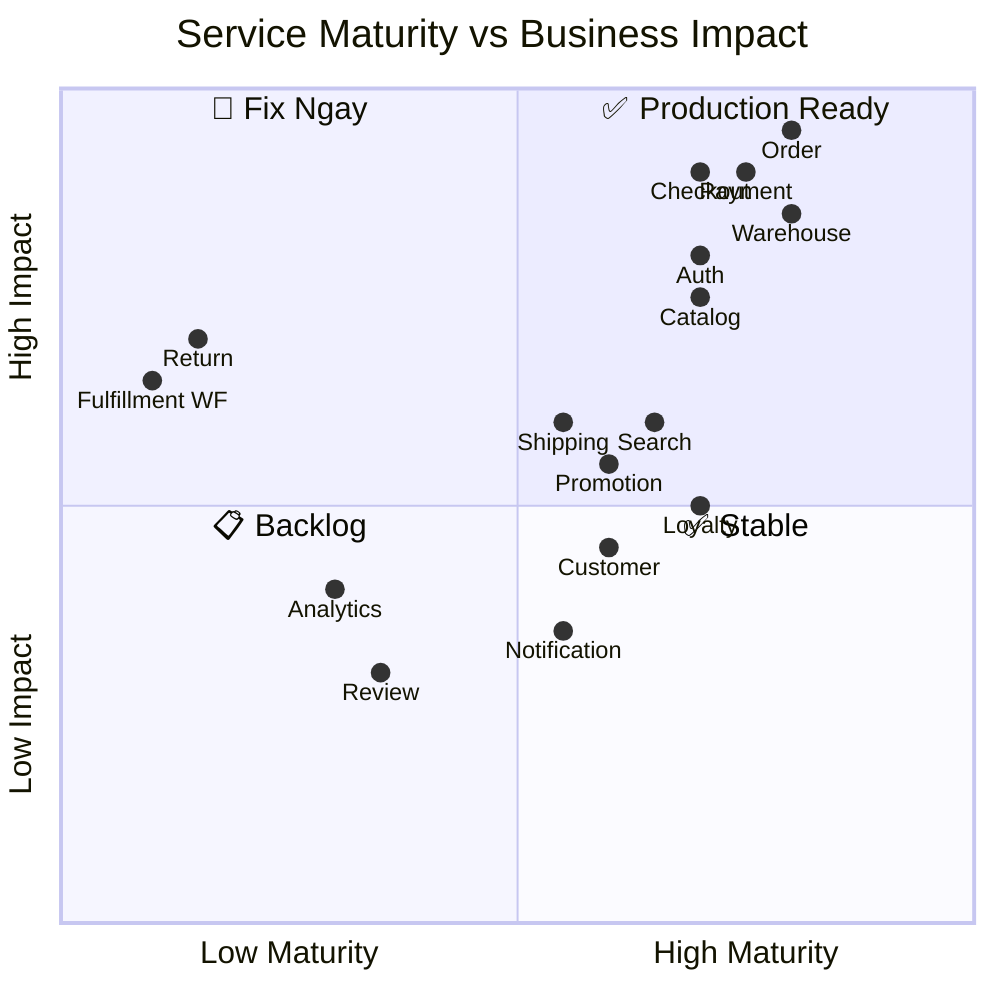
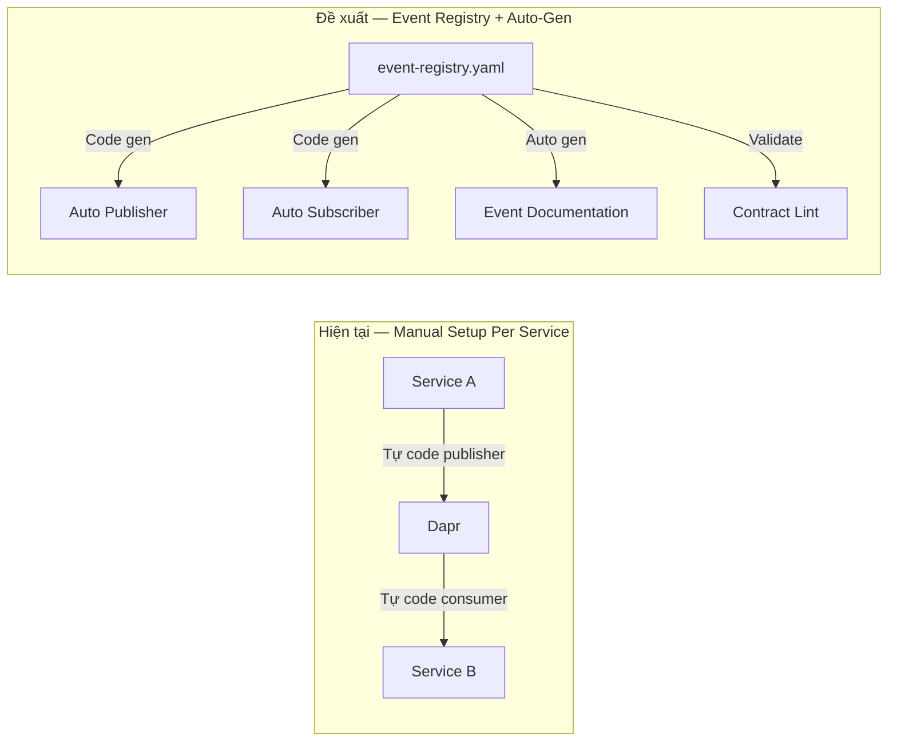
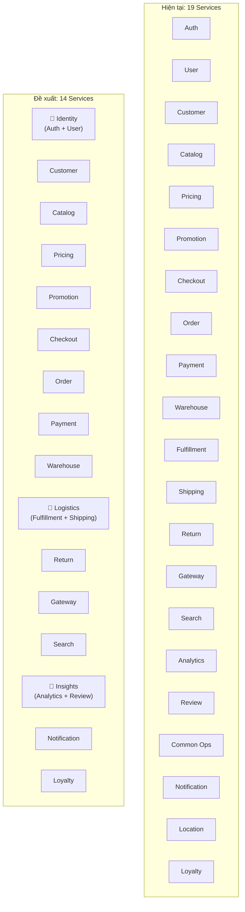

# Phân Tích Điểm Yếu Hệ Thống — Roadmap Giảm Complexity
> **Date**: 2026-02-14 | **Scope**: 19 Go services + 2 frontends
> **Phương pháp**: Grep toàn bộ codebase cho `TODO`, `FIXME`, `stub`, `placeholder`, `simplified`

---

## 1. Tổng Quan Tình Trạng — Mỗi Service Đang Ở Đâu?



### Heat Map: Số lượng Stub/TODO per Service

| Service | Stubs | TODOs | Simplified | Placeholders | **Tổng** | Severity |
|---------|-------|-------|------------|--------------|----------|----------|
| 🔴 **Return** | 10 | 3 | 8 | 6 | **27** | Critical |
| 🔴 **Fulfillment** (workflow) | 0 | **45** | 0 | 0 | **45** | Critical |
| 🟡 **Analytics** | 6 | 6 | 4 | 8 | **24** | Medium |
| 🟡 **Shipping** | 2 | 6 | 4 | 5 | **17** | Medium |
| 🟡 **Payment** (fraud) | 0 | 0 | 10 | 2 | **12** | Medium |
| 🟡 **Customer** (analytics) | 0 | 6 | 2 | 4 | **12** | Low-Med |
| 🟡 **Order** | 3 | 3 | 3 | 5 | **14** | Low |
| 🟡 **Review** | 4 | 3 | 0 | 0 | **7** | Low |
| 🟢 **Checkout** | 3 | 0 | 3 | 0 | **6** | Low |
| 🟢 **Catalog** | 1 | 0 | 5 | 2 | **8** | Low |
| 🟢 **Search** | 0 | 1 | 4 | 3 | **8** | Low |
| 🟢 **Notification** | 1 | 3 | 0 | 0 | **4** | Low |
| 🟢 **Loyalty** | 0 | 2 | 2 | 0 | **4** | Low |
| 🟢 **Auth** | 0 | 3 | 0 | 0 | **3** | Low |
| 🟢 **Promotion** | 0 | 0 | 2 | 0 | **2** | Low |

---

## 2. 🔴 Chưa Implement — Phải Làm

### 2.1 Return Service — Gần như toàn bộ là STUB

**Mức độ**: 🔴 Critical — Return flow **không hoạt động** cho business operations

| Function | File | Tình trạng | Impact |
|----------|------|------------|--------|
| `processReturnRefund()` | `biz/return/refund.go` | ❌ Chỉ log + return nil | Customer không nhận được refund |
| `restockReturnedItems()` | `biz/return/restock.go` | ❌ Chỉ log + return nil | Inventory không được hoàn lại |
| `processExchangeOrder()` | `biz/return/exchange.go` | ❌ Chỉ log + return nil | Exchange không tạo order mới |
| `generateReturnShippingLabel()` | `biz/return/shipping.go` | ❌ Chỉ log + return nil | Không có shipping label cho return |
| `buildExchangeApprovedEvent()` | `biz/return/events.go` | ❌ return nil | Event không được build |
| `buildExchangeCompletedEvent()` | `biz/return/events.go` | ❌ return nil | Event không được build |
| `buildExchangeOrderEvent()` | `biz/return/events.go` | ❌ return nil | Event không được build |
| Return item data | `biz/return/return.go:127-133` | ❌ Hardcoded `"stub-product"`, price=10.0 | Sai product info + refund amount |
| `stubCatalogClient` | `client/clients.go` | ❌ Returns fake data | Không lấy được giá thật |
| `stubWarehouseClient` | `client/clients.go` | ❌ Returns fake data | Không check inventory |
| `stubOrderService` | `data/data.go` | ❌ Fallback khi chưa config | Order data giả |
| `stubShippingService` | `data/data.go` | ❌ Fallback khi chưa config | Shipping data giả |
| Monitoring/Alerting | `biz/monitoring.go` | ❌ 3x TODO cho alerts + metrics | Không có alert khi lỗi |

**📌 Giải pháp**: Implement return service đầy đủ — cần ~40h effort. Ưu tiên: refund → restock → exchange → shipping label.

---

### 2.2 Fulfillment Workflow Engine — Skeleton Code

**Mức độ**: 🔴 Critical — Workflow engine có 45+ TODOs, toàn bộ phase logic là empty

File: `internal/workflow/event_handler.go` — **Mỗi function chỉ chứa TODO comment**:

| Phase Group | Functions | Tình trạng |
|-------------|-----------|------------|
| Phase init/complete/fail/timeout | 4 handlers | ❌ All empty TODOs |
| Warehouse Assignment | `initWarehouseAssignment()` | ❌ TODO: Call warehouse service |
| Picking | `initPicking()` | ❌ TODO: Generate picking list |
| Packing | `initPacking()` | ❌ TODO: Assign packer |
| Quality Control | `initQC()` | ❌ TODO: Assign QC inspector |
| Shipping Prep | `initShippingPrep()` | ❌ TODO: Create shipment |
| Label Generation | `initLabelGeneration()` | ❌ TODO: Generate label |
| Tracking | `initTracking()` | ❌ TODO: Activate tracking |
| In Transit | `initInTransit()` | ❌ TODO: Monitor tracking |
| Delivery | `initDelivery()` | ❌ TODO: Confirm delivery |
| Event publishing | 10 functions | ❌ All TODOs |

Ngoài ra: `TODO-1 FIX: Wire QC usecase` trong `fulfillment_service.go`

**📌 Giải pháp**: Workflow engine này **không cần thiết ngay** vì fulfillment đã có flow hoạt động qua `batch_picking.go` + `fulfillment_usecase.go`. Workflow engine là **phiên bản nâng cấp** cho tương lai. **Có thể defer** và focus vào core flow.

---

### 2.3 Shipping — Missing Carrier Providers

| Item | File | Tình trạng |
|------|------|------------|
| FedEx provider | `carrierfactory/factory.go:86` | ❌ TODO: Implement |
| UPS provider | `carrierfactory/factory.go:89` | ❌ TODO: Implement |
| DHL provider | `carrierfactory/factory.go:92` | ❌ TODO: Implement |
| Webhook processing | `service/shipment.go:500` | ❌ TODO: Proper implementation |
| Access control (user extraction) | `biz/shipment/access_control.go` | ❌ Placeholder — no JWT extraction |

**📌 Giải pháp**: GHN (Giao Hàng Nhanh) đã implement. FedEx/UPS/DHL **chỉ cần khi mở rộng international**. Có thể defer.

---

### 2.4 Payment Fraud — Simplified Detection

| Item | File | Tình trạng |
|------|------|------------|
| GeoIP lookup | `fraud/feature_extraction.go:146` | ❌ Simplified — no real GeoIP service |
| VPN/Proxy detection | `fraud/rules.go:332` | ❌ Simplified — no real check |
| Country risk mapping | `fraud/feature_extraction.go:115` | ⚠️ Hardcoded mapping |
| Account age calculation | `fraud/service.go:213` | ⚠️ Simplified — should call User service |

**📌 Giải pháp**: Integrate MaxMind GeoIP2 database (~$99/yr) hoặc ip-api.com (free tier). ~8h effort.

---

### 2.5 Analytics — Nhiều Placeholder Calculations

| Item | Tình trạng |
|------|------------|
| Fulfillment metrics | Hardcoded: `order_fulfillment_rate = 0.95`, `avg_fulfillment_time = 24.5h` |
| Cancellation/Return rates | Hardcoded: `0.03`, `0.02` |
| CAC (Customer Acquisition Cost) | Placeholder — needs marketing spend data |
| Retention/Churn rate | Placeholder calculation |
| Revenue margin | Placeholder — needs cost data |
| Product category/brand in queries | TODO: Join with actual tables |
| Real-time product metrics | Stub — no Redis counters |
| Service integration | Entire `stubs.go` — all cross-service calls disabled |

**📌 Giải pháp**: Analytics cần data từ nhiều services khác. Giải quyết bằng **event consumers** — subscribe events từ order, fulfillment, shipping → tự tính metrics thật. ~16h effort.

---

## 3. ⚡ Có Thể Setup Auto — Giảm Complexity

### 3.1 Code Generation — Giảm Boilerplate

| Pattern lặp lại | Ở đâu | Auto bằng cách nào | Tiết kiệm |
|-----------------|-------|---------------------|-----------|
| **gRPC client stubs** | Return, Review, Analytics, Customer → all có `stubXxxClient` | **Code gen** từ proto files: `protoc --go-grpc_out` + auto-connect logic | ❌ Xóa 200+ dòng stub code |
| **Event publisher boilerplate** | Mỗi service viết lại `PublishEvent(topic, data)` | **Common lib** đã có nhưng mỗi service wrap thêm wrapper | ⚠️ Standardize pattern |
| **Outbox pattern** | 6 services implement riêng, mỗi cái hơi khác nhau | **Common lib outbox** — generic `OutboxRepo[T]` + `OutboxWorker` | ❌ Xóa 600+ dòng duplicate |
| **Idempotency check** | Order, Loyalty, Checkout implement riêng | **Common middleware** — generic `IdempotencyMiddleware(source, sourceID)` | ❌ Xóa 300+ dòng |
| **Wire DI** | Mỗi service có `wire.go` + `wire_gen.go` riêng | ✅ Đã auto (Wire code gen) | Đã tối ưu |
| **DB migration** | Mỗi service dùng Goose | ✅ Đã standardize | Đã tối ưu |
| **Prometheus metrics** | Mỗi service define metrics riêng | **Common metrics builder** — `metrics.Register("order", "operations_total", ...)` | ⚠️ Standardize |

### 3.2 Infrastructure Automation

| Hiện tại | Có thể làm tự động | Tool | Effort |
|----------|-------------------|------|--------|
| Manual service deploy | ✅ Đã auto (ArgoCD GitOps) | ArgoCD | Đã có |
| Manual DB migration | ✅ Đã auto (Goose in init container) | Goose | Đã có |
| Manual proto compile | `protoc` commands manually | **Makefile/Taskfile** — `task proto:generate service=order` | 2h |
| No auto testing | Test suite exists nhưng chạy manual | **GitLab CI pipeline** — auto test on PR | 4h |
| No auto linting | Linting manual | **golangci-lint** in CI | 2h |
| No health check dashboard | Prometheus metrics exist nhưng không dashboard | **Grafana dashboards** — auto-gen từ metrics | 8h |
| Manual log review | Structured logging nhưng không aggregated | **Loki/ELK** stack với auto-alert rules | 16h |
| No auto alerting | Search/Return/Checkout có alert stubs | **Prometheus AlertManager** rules | 4h |

### 3.3 Event-Driven Auto-Setup



**Ý tưởng**: Tạo 1 file `event-registry.yaml` chứa tất cả event definitions:
```yaml
events:
  order.confirmed:
    publisher: order
    consumers: [warehouse, payment]
    schema: OrderConfirmedEvent
    outbox: true
    idempotency: true

  return.approved:
    publisher: return
    consumers: [payment, warehouse, notification]
    schema: ReturnApprovedEvent
    outbox: true  # → Auto-generate outbox code
    idempotency: true  # → Auto-generate idempotency check
```

Từ registry này → code gen publisher/consumer boilerplate + validate contract completeness. **Effort**: 16h setup, nhưng tiết kiệm 4h/service cho mỗi event mới.

---

## 4. 🔧 Giảm Complexity — Service Consolidation

### 4.1 Potential Service Merges

| Merge Candidates | Lý do | Risk | Recommendation |
|-----------------|-------|------|----------------|
| **User + Auth** | Auth phụ thuộc hoàn toàn vào User. Cùng domain "Identity". | Low | ✅ **Nên merge** — giảm 1 service + 1 DB + gRPC hop |
| **Catalog + Pricing** | Pricing gần như luôn đi kèm Catalog. Price là attribute của Product. | Medium | ⚠️ **Xem xét** — tách giúp pricing rules phức tạp không ảnh hưởng catalog |
| **Fulfillment + Shipping** | Fulfillment "completed" → Shipping "created" luôn đi cùng. | Medium | ⚠️ **Xem xét** — nhưng shipping có carrier integration phức tạp riêng |
| **Analytics + Review** | Cả hai đều read-heavy, không critical. | Low | ✅ **Nên merge** — giảm 1 service |
| **Location** → **Common lib** | Chỉ là lookup data (Country → Province → District → Ward). | Low | ✅ **Nên convert thành shared DB table** hoặc API trong Gateway |
| **Common-Operations** → merge | Task orchestration + MinIO — rất ít logic | Low | ⚠️ Có thể merge vào relevant services |

### 4.2 Reduce Services: Từ 19 → 14-15



**Giảm được**:
- 5 services bớt → 5 PostgreSQL databases bớt
- 5 Docker images bớt (10 binaries bớt vì dual-binary)
- 5 Consul registrations bớt
- 5 ArgoCD applications bớt
- ~10 gRPC hops bớt (internal calls trở thành function calls)
- Location → lookup table in Gateway hoặc common lib

---

## 5. 🧹 Quick Wins — Dưới 4h Effort

| # | Action | Service | Effort | Impact |
|---|--------|---------|--------|--------|
| 1 | **Xóa fulfillment workflow skeleton** — chỉ gây confusion | Fulfillment | 1h | Giảm 200+ dòng dead code |
| 2 | **Replace return item placeholders** — fetch from Order service | Return | 2h | Fix wrong refund amounts |
| 3 | **Add Prometheus AlertManager rules** cho DLQ depth | All | 4h | Auto-alert khi events stuck |
| 4 | **Standardize outbox → common lib** — extract pattern | Common | 4h | Giảm 600+ dòng duplicate |
| 5 | **Add `SETNX` to checkout idempotency** | Checkout | 2h | Fix race condition |
| 6 | **Add auth expiry check before capture** | Order (worker) | 1h | Prevent expired auth capture |
| 7 | **Delete stub clients, use real gRPC** | Review, Return | 4h | Connect to actual services |
| 8 | **Add cart metrics (Prometheus)** | Checkout | 1h | Replace STUB comments |
| 9 | **Makefile for proto generation** | All | 2h | Auto `protoc --go-grpc_out` |
| 10 | **Add golangci-lint to CI** | GitLab CI | 2h | Catch issues before merge |

---

## 6. 📊 Prioritized Roadmap

### Sprint 1 (1 week) — 🔴 Critical + Quick Wins
| Task | Effort | Reduces Complexity? |
|------|--------|-------------------|
| Fix return item placeholder data (fetch real product/price from Order) | 4h | ✅ Removes 5 placeholders |
| Implement `processReturnRefund()` (call Payment gRPC) | 8h | ✅ Core business function |
| Implement `restockReturnedItems()` (call Warehouse gRPC) | 4h | ✅ Core business function |
| Add DLQ to checkout SAGA-001 void failure | 2h | ✅ Safety net |
| Add `SETNX` to checkout idempotency | 2h | ✅ Fix race condition |
| Delete fulfillment workflow skeleton | 1h | ✅ Remove 200 lines dead code |
| **Total** | **21h** | |

### Sprint 2 (1 week) — 🟡 P1 Issues + Automation
| Task | Effort | Reduces Complexity? |
|------|--------|-------------------|
| Add `order.cancelled` consumer to Promotion | 4h | ✅ Business correctness |
| Add `order.cancelled` consumer to Fulfillment | 4h | ✅ Business correctness |
| Add outbox to Return service events | 6h | ✅ Data consistency |
| Extract common outbox pattern → common lib | 4h | ✅✅ Remove 600 lines dup |
| Makefile for proto generation | 2h | ✅ Dev productivity |
| **Total** | **20h** | |

### Sprint 3 (1 week) — 🟢 Consolidation
| Task | Effort | Reduces Complexity? |
|------|--------|-------------------|
| Merge Auth + User → Identity service | 16h | ✅✅ -1 service, -1 DB |
| Merge Analytics + Review → Insights service | 12h | ✅✅ -1 service, -1 DB |
| Location → common lib lookup | 4h | ✅ -1 service |
| Add golangci-lint + auto test to CI | 4h | ✅ Quality automation |
| **Total** | **36h** | |

### Sprint 4 (1 week) — 🟣 Polish
| Task | Effort | Reduces Complexity? |
|------|--------|-------------------|
| Extract common idempotency middleware | 4h | Remove 300 lines dup |
| Add Grafana dashboards (auto-gen from metrics) | 8h | Observability |
| Implement real fraud GeoIP (MaxMind) | 8h | Security |
| Replace review stub clients with real gRPC | 4h | Remove stubs |
| **Total** | **24h** | |

---

## 7. Kết Luận

### Bức tranh tổng thể

| Metric | Hiện tại | Sau Roadmap |
|--------|----------|-------------|
| **Services** | 19 + 2 FE | 14-15 + 2 FE |
| **Stubs/TODOs** | ~100+ | ~20 (acceptable simplified) |
| **Duplicate code** | ~1500 lines (outbox + idempotency + clients) | ~200 lines |
| **Dead code** | 200+ lines (fulfillment workflow) | 0 |
| **CI automation** | Build only | Build + Lint + Test + Proto gen |
| **Alerting** | Stub/manual | Prometheus AlertManager auto-alert |
| **Return flow** | ❌ Non-functional | ✅ Full refund + restock + exchange |
| **Cross-service events** | 2 missing consumers | ✅ Complete event mesh |

### Complexity Score (ước tính)

```
Trước:  19 services × (deploy + monitor + debug + test) = 76 units
Sau:    14 services × (deploy + monitor + debug + test) = 56 units
        + Auto CI/CD/Alert: -10 units
        
Giảm: ~40% operational complexity
```

> **💡 Insight chính**: Hệ thống không cần thêm features mới — cần **hoàn thiện** features đã có (return, analytics, fraud) và **consolidate** services dư (auth+user, analytics+review, location). Mỗi service bớt = 1 DB bớt + 1 Docker image bớt + 1 deploy pipeline bớt + giảm debugging surface.
