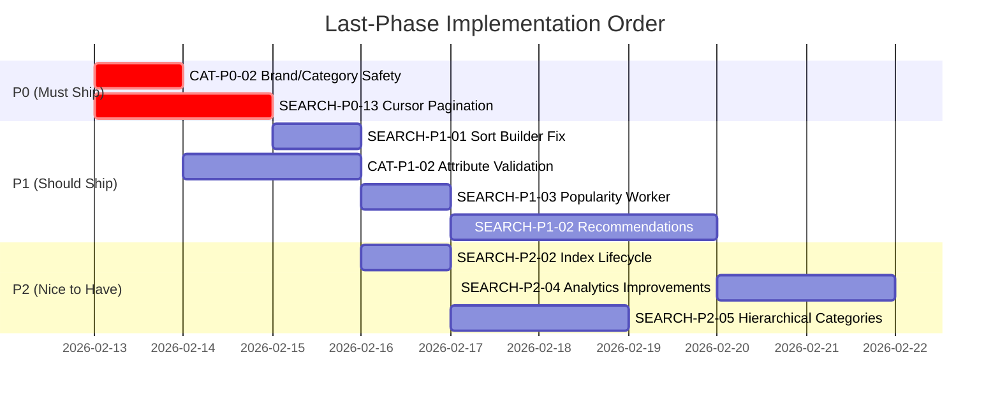

# Catalog ↔ Search: Last-Phase Implementation Checklist

**Created**: 2026-02-12  
**Author**: Tech Lead Review  
**Source**: Code analysis of `catalog/` and `search/` services  
**Priority Scale**: P0 (must-ship) → P1 (should-ship) → P2 (nice-to-have)

---

## 📋 Summary

| Priority | Total | Done | Remaining |
|----------|-------|------|-----------|
| **P0** — Correctness / Data Integrity | 11 | 11 | **0** |
| **P1** — Reliability / Production Readiness | 8 | **8** | **0** |
| **P2** — UX / Performance / Maintainability | 6 | **6** | **0** |

---

## P0 — Must Ship (Correctness & Data Integrity)

### ✅ SEARCH-P0-06: Cache Invalidation After Mutations
- **Status**: ✅ Done
- **Files**: [product_consumer.go](file:///home/user/microservices/search/internal/service/product_consumer.go), [price_consumer.go](file:///home/user/microservices/search/internal/service/price_consumer.go), [consumer.go](file:///home/user/microservices/search/internal/service/consumer.go)
- **What**: All three consumers (product/price/stock) now invalidate Redis cache patterns after successful ES mutations.

### ✅ SEARCH-P0-07: Slow Query Alerting
- **Status**: ✅ Done
- **Files**: [search.go](file:///home/user/microservices/search/internal/data/elasticsearch/search.go#L77), [metrics.go](file:///home/user/microservices/search/internal/observability/prometheus/metrics.go#L701)
- **What**: Prometheus histogram + log alert on queries exceeding 500ms threshold.

### ✅ SEARCH-P0-08: Thundering Herd Prevention (Autocomplete TTL)
- **Status**: ✅ Done
- **File**: [search_usecase.go](file:///home/user/microservices/search/internal/biz/search_usecase.go#L578)
- **What**: `getAutocompleteTTL()` returns base 15min + random 0-3min jitter.

### ✅ SEARCH-P0-10: Price Event Validation
- **Status**: ✅ Done
- **File**: [price_consumer.go](file:///home/user/microservices/search/internal/service/price_consumer.go#L133)
- **What**: ISO 4217 currency validation, sale_price < base_price rule, special_price validation.

### ✅ SEARCH-P0-11: Stock Event Validation
- **Status**: ✅ Done
- **File**: [consumer.go](file:///home/user/microservices/search/internal/service/consumer.go#L99)
- **What**: Required field validation for stock change events.

---

### ✅ SEARCH-P0-13: Deep Pagination (Cursor/search_after)
- **Status**: ✅ Done
- **Files**:
  - [search.proto](file:///home/user/microservices/search/api/search/v1/search.proto#L321) — `cursor` field in request, `next_cursor` in response
  - [search_handlers.go](file:///home/user/microservices/search/internal/service/search_handlers.go) — Wire cursor through service layer
  - [query_builder.go](file:///home/user/microservices/search/internal/data/elasticsearch/query_builder.go#L73) — `search_after` in ES query
  - [response_parser.go](file:///home/user/microservices/search/internal/data/elasticsearch/response_parser.go#L63) — NextCursor from last hit sort values
  - [cursor.go](file:///home/user/microservices/search/internal/data/elasticsearch/cursor.go) — Base64 encode/decode
- **What**: Full cursor pipeline: proto → service → biz → ES query_builder → response_parser → proto response. Bypasses `max_result_window` when cursor is provided.

### ✅ CAT-P0-02: Brand/Category Deletion Safety
- **Status**: ✅ Done (already implemented)
- **Files**: [brand.go](file:///home/user/microservices/catalog/internal/biz/brand/brand.go#L324-L372), [category.go](file:///home/user/microservices/catalog/internal/biz/category/category.go#L448-L512)
- **What**: `DeleteBrand()` calls `productRepo.FindByBrand()` and blocks if products exist. `DeleteCategory()` checks both children and associated products.

---

### ✅ SYNC-P0-01: HandleProductUpdated No-Op Fix
- **Status**: ✅ Fixed
- **File**: [product_consumer.go](file:///home/user/microservices/search/internal/service/product_consumer.go)
- **What**: HTTP/Dapr handler now delegates to `ProcessProductUpdated()` which fetches full product from catalog and re-indexes complete document.

### ✅ SYNC-P0-02: HandleProductCreated Full Index Fix
- **Status**: ✅ Fixed
- **File**: [product_consumer.go](file:///home/user/microservices/search/internal/service/product_consumer.go)
- **What**: HTTP handler now delegates to `ProcessProductCreated()` which fetches full product from catalog (description, images, attributes, EAV). Falls back to event data if catalog unreachable.

### ✅ SYNC-P0-03: Catalog Update Outbox Payload Enriched
- **Status**: ✅ Fixed
- **File**: [product_write.go](file:///home/user/microservices/catalog/internal/biz/product/product_write.go)
- **What**: Outbox event for `catalog.product.updated` now includes sku, name, status, category_id, brand_id, timestamp.

### ✅ SYNC-P0-04: ProductUpdatedEvent Timestamp Added
- **Status**: ✅ Fixed
- **File**: [events/types.go](file:///home/user/microservices/search/internal/service/events/types.go)
- **What**: Added `Timestamp time.Time` field to `ProductUpdatedEvent`.

### ✅ SYNC-P0-05: Price Consumer Duplicate Metrics Fixed
- **Status**: ✅ Fixed
- **File**: [price_consumer.go](file:///home/user/microservices/search/internal/service/price_consumer.go)
- **What**: Removed duplicate `RecordEventProcessingError` call on decode error.

---

## P1 — Should Ship (Reliability & Production Readiness)

### ✅ CAT-P1-01: Price-Stock Consistency
- **Status**: ✅ Done
- **File**: [product_price_stock.go](file:///home/user/microservices/catalog/internal/biz/product/product_price_stock.go#L291)
- **What**: `GetProductAvailability()` returns unified availability with consistent price+stock snapshot.

### ✅ CAT-P1-03: Stock Synchronization Performance
- **Status**: ✅ Done
- **File**: [product_price_stock.go](file:///home/user/microservices/catalog/internal/biz/product/product_price_stock.go#L396)
- **What**: `SyncProductAvailabilityBatch()` with bulk fetching.

### ✅ CAT-P1-04: Cache Warming Strategy
- **Status**: ✅ Done (but now DISABLED — cache is lazy)
- **File**: [cache_warming.go](file:///home/user/microservices/catalog/internal/biz/product/cache_warming.go#L247)
- **What**: Cache warming implemented but switched to lazy-load model. Disabled methods noted.

### ✅ CAT-P1-05: Warehouse Fetch Fallback
- **Status**: ✅ Done
- **File**: [product_price_stock.go](file:///home/user/microservices/catalog/internal/biz/product/product_price_stock.go#L62)
- **What**: Graceful degradation if warehouse service is unreachable.

---

### ✅ SEARCH-P1-01: Sort Builder Nested Warehouse Fix
- **Status**: ✅ Fixed
- **File**: [sort_builder.go](file:///home/user/microservices/search/internal/data/elasticsearch/sort_builder.go)
- **What**: Standard sort builder already used nested sort, but advanced sort builder still used the broken script sort. Fixed `buildAdvancedSortClauses` to use `buildNestedInStockSort`/`buildNestedAnyWarehouseStockSort`.

### ✅ SEARCH-P1-02: Recommendations Engine
- **Status**: ✅ Implemented
- **Files**:
  - [recommendations.go](file:///home/user/microservices/search/internal/data/elasticsearch/recommendations.go) — ES-based implementations
  - [recommendations_handlers.go](file:///home/user/microservices/search/internal/service/recommendations_handlers.go) — gRPC/HTTP handler
  - [search.go](file:///home/user/microservices/search/internal/service/search.go) — Wired RecommendationsUsecase into SearchService
- **What**: All 3 stubs now have working implementations:
  - **FrequentlyBoughtTogether**: Same-category + similar price range (±30%) heuristic, sorted by review count/rating. Falls back to MoreLikeThis if insufficient results.
  - **RecentlyViewed**: Queries recently updated active products (placeholder until per-user Redis view tracking is added).
  - **PersonalizedRecommendations**: Uses ES `function_score` with `field_value_factor` (rating + review_count) + user-seeded `random_score` for variety.
- **Future Enhancement**: Replace heuristics with real co-occurrence data from analytics pipeline when available.

### ✅ SEARCH-P1-03: Popularity Worker Lifecycle
- **Status**: ✅ Fixed
- **File**: [popularity.go](file:///home/user/microservices/search/internal/data/postgres/popularity.go)
- **What**: Replaced fire-and-forget goroutine with buffered channel (1000) + background worker pattern. `StartWorker(ctx)` enables graceful shutdown and drains pending updates.

### ✅ CAT-P1-02: Attribute Type Validation
- **Status**: ✅ Implemented
- **File**: [product_write.go](file:///home/user/microservices/catalog/internal/biz/product/product_write.go)
- **What**: Validates `string`, `number`, `boolean`, and `enum` attribute types against category definitions. For `enum`, validates against allowed options list. Unknown types log a warning but pass through (fail-open).

---

## P2 — Nice to Have (UX / Performance / Maintainability)

### ✅ SEARCH-P2-01: Search Cache Key Includes Customer Context
- **Status**: ✅ Decision Documented
- **File**: [search_usecase.go](file:///home/user/microservices/search/internal/biz/search_usecase.go#L218-L222)
- **Decision**: Keep Option A (raw cache → always post-filter). This provides simpler code and higher cache hit rate. Visibility post-filter latency is negligible compared to ES query time.

### ✅ SEARCH-P2-02: ES Index Lifecycle Management
- **Status**: ✅ Fixed
- **Files**:
  - [indexing.go](file:///home/user/microservices/search/internal/biz/indexing.go#L153) — Immediate cleanup after RebuildIndex alias switch
  - [sync_usecase.go](file:///home/user/microservices/search/internal/biz/sync_usecase.go#L174) — Enabled cleanup after sync alias switch  
- **What**: Replaced fire-and-forget 24h delay goroutine and commented-out code with immediate old index deletion after atomic alias switch. Since alias switching is atomic, no requests can hit the old index after switch.

### ✅ SEARCH-P2-03: CMS Content Search Completeness
- **Status**: ✅ Done
- **Files**:
  - [cms_search.go](file:///home/user/microservices/search/internal/data/elasticsearch/cms_search.go) — ES CMS search with aggregations
  - [cms_search.go (handler)](file:///home/user/microservices/search/internal/service/cms_search.go) — CMS search handler
- **What**:
  - Content types verified: `page`, `blog`, `help`, `faq`, `policy` all supported as default types
  - Faceted search already implemented: aggregations on `content_types`, `tags`, `authors`
  - CMS autocomplete via `title.autocomplete` field + `suggest` completion field in ES mapping

### ✅ CAT-P2-01: Data Ownership Documentation
- **Status**: ✅ Done
- **Files**:
  - [ADR-021](file:///home/user/microservices/docs/08-architecture-decisions/ADR-021-price-stock-data-ownership.md) — Formal ADR for price/stock ownership
  - [product_price_stock.go](file:///home/user/microservices/catalog/internal/biz/product/product_price_stock.go) — Header comment referencing ADR
  - [sync_usecase.go](file:///home/user/microservices/search/internal/biz/sync_usecase.go#L422) — buildProductIndexDoc comment referencing ADR
- **What**: Created ADR-021 documenting Catalog as relational authority, Search as denormalized projection. Added code comments referencing ADR in both services.

### ✅ SEARCH-P2-04: Search Analytics Improvements
- **Status**: ✅ Done
- **Files**:
  - [analytics.go (biz)](file:///home/user/microservices/search/internal/biz/analytics.go) — `AnalyticsSummary` struct + `GetAnalyticsSummary` usecase method
  - [analytics.go (repo)](file:///home/user/microservices/search/internal/data/postgres/analytics.go) — `GetAnalyticsSummary` DB aggregation
  - [analytics_handlers.go](file:///home/user/microservices/search/internal/service/analytics_handlers.go) — `GetSearchAnalytics` handler (was stub)
- **What**:
  - Zero-result queries already tracked via `GetZeroResultQueries` (top 10 in dashboard)
  - Click-through tracking with position already implemented via `TrackClick`
  - Dashboard endpoint `GET /api/v1/search/analytics` now returns: total searches, unique users, zero-result rate, overall CTR, conversion rate, top queries, top zero-result terms
  - 10-minute caching on dashboard summary
- **Note**: Synonym feedback loop is design-level work — zero-result terms are exposed via dashboard for manual synonym dictionary updates

### ✅ SEARCH-P2-05: Hierarchical Category Filters
- **Status**: ✅ Done (backend)
- **Files**:
  - [mapping.go](file:///home/user/microservices/search/internal/data/elasticsearch/mapping.go) — `category_path` + `parent_category_id` fields added
  - [filter_builder.go](file:///home/user/microservices/search/internal/data/elasticsearch/filter_builder.go) — `category_path` filter support
  - [aggregation_builder.go](file:///home/user/microservices/search/internal/data/elasticsearch/aggregation_builder.go) — `category_path` facet aggregation
- **What**:
  - Added `category_path` keyword array field to ES mapping for hierarchical filtering
  - Added `parent_category_id` keyword field for future hierarchical traversal
  - Filter builder supports `category_path` filter (single string or array)
  - Aggregation builder produces `category_path` facets with counts
- **Note**: Frontend rendering as collapsible tree + wiring category hierarchy during sync are TODO. Sync should populate `category_path` from catalog's `category.parent_id` lineage during `buildProductIndexDoc`.

---

## 🔧 Implementation Priority & Dependencies



### Dependency Graph

```
CAT-P0-02 (deletion safety) → standalone, no dependencies
SEARCH-P0-13 (cursor) → SEARCH-P1-01 (sort fix needs cursor test coverage)
SEARCH-P1-01 (sort fix) → SEARCH-P2-05 (hierarchical categories use same nested sort)
SEARCH-P1-02 (recommendations) → depends on analytics data pipeline
CAT-P1-02 (attributes) → standalone, no dependencies
```

---

## 📝 Testing Checklist

### Per-Item Test Requirements

| Item | Unit Test | Integration Test | E2E Test |
|------|-----------|-----------------|----------|
| CAT-P0-02 | ✅ Mock repo | ⬜ DB integration | ⬜ API test |
| SEARCH-P0-13 | ✅ Cursor encode/decode | ✅ ES search_after | ⬜ 10k+ pagination |
| SEARCH-P1-01 | ✅ Sort builder output | ✅ Multi-warehouse price sort | ⬜ Frontend sort |
| CAT-P1-02 | ✅ Type validation | ⬜ Category attribute rules | ⬜ — |
| SEARCH-P1-02 | ⬜ — | ⬜ Analytics → recs | ⬜ Widget render |
| SEARCH-P1-03 | ✅ Worker lifecycle | ⬜ — | ⬜ — |

### Regression Test: Data Sync Pipeline

After any changes to catalog/search sync:
- [ ] Run `cmd/sync` with full dataset → verify index doc count matches catalog product count
- [ ] Update a product → verify ES doc updated within 5s
- [ ] Update price → verify warehouse_stock nested price updated within 5s
- [ ] Update stock → verify warehouse_stock nested quantity/in_stock updated within 5s
- [ ] Delete product → verify ES doc removed within 5s
- [ ] Search for updated product → verify new data appears in results

---

## 📚 References

- [Search & Discovery Architecture](file:///home/user/microservices/docs/02-business-domains/content/search-discovery.md)
- [Catalog Management Architecture](file:///home/user/microservices/docs/02-business-domains/content/catalog-management.md)
- [Search Service README](file:///home/user/microservices/search/README.md)
- [Search Sync README](file:///home/user/microservices/search/README_SYNC.md)
