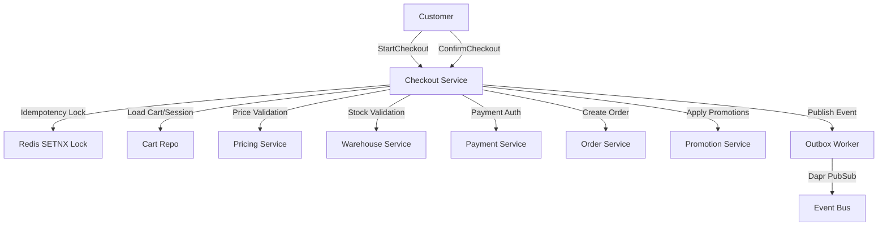

# 🛒 Checkout Flow Comprehensive Review — Shopify / Shopee / Lazada Pattern Analysis

## Overview
This document provides a detailed review of the checkout flow business logic in the current codebase, comparing against industry-leading e-commerce platforms (Shopify, Shopee, Lazada). It identifies data consistency issues, saga/outbox pattern implementations, and edge cases not handled by the current system.

## Last Updated: 2026-02-19

---

## 🏗️ Architecture Overview



---

## 📊 Cross-Service Data Consistency Matrix

### Price Consistency
| Step | Service | Validation | Status |
|------|---------|-----------|--------|
| Add to Cart | Pricing → Checkout | CalculatePrice → store in cart item | ✅ |
| Preview | Checkout (cached prices) | RevalidatePrices=false | ⚠️ May be stale |
| Confirm | Pricing → Checkout | RevalidatePrices=true → fresh prices | ✅ |
| Create Order | Checkout → Order | Totals passed as-is | ❌ No server-side revalidation |

### Stock Consistency
| Step | Service | Validation | Status |
|------|---------|-----------|--------|
| Add to Cart | Warehouse → Checkout | CheckStock (non-binding) | ✅ |
| Start Checkout | Warehouse → Checkout | CheckStock + ReserveStock (15min TTL) | ✅ |
| Confirm Checkout | Warehouse → Checkout | GetReservation + expiry check + ExtendReservation | ✅ |
| Create Order | Order → Warehouse | confirmOrderReservations | ✅ |
| **Gap** | Partial ExtendReservation failure has no rollback | | ❌ |

### Promotion Consistency
| Step | Service | Validation | Status |
|------|---------|-----------|--------|
| Apply Coupon | Promotion → Checkout | ValidateCoupon / ValidatePromotions | ✅ |
| Confirm | Checkout → Promotion | ApplyPromotion (post-order, best-effort + DLQ) | ✅ |
| Cancel Order | Order → Promotion | ReleasePromotionUsage via event consumer | ✅ |
| **Gap** | No atomic reserve-and-validate → race between validate and apply | | ⚠️ |

### Payment Consistency
| Step | Service | Validation | Status |
|------|---------|-----------|--------|
| Validate | Payment → Checkout | ValidatePaymentMethodOwnership | ✅ |
| Authorize | Payment → Checkout | AuthorizePayment (pre-order) | ✅ |
| Void on Failure | Payment → Checkout | VoidAuthorization with DLQ for failures | ✅ (DLQ exists) |
| Capture | Order → Payment | Handled by Order service | ✅ |
| **Gap** | DLQ `void_authorization` handler not implemented in worker | | ❌ |

---

## 🔍 Current Implementation Analysis

### Key Files:
1. **Checkout Service**:
   - `checkout/internal/biz/checkout/confirm.go` — Main orchestrator (600+ lines)
   - `checkout/internal/biz/checkout/pricing_engine.go` — Unified pricing calculation
   - `checkout/internal/biz/checkout/payment.go` — Payment authorization
   - `checkout/internal/worker/cron/failed_compensation.go` — DLQ compensation worker
   - `checkout/internal/worker/outbox/worker.go` — Outbox event publisher

2. **Order Service**:
   - `order/internal/biz/order/create.go` — Order creation

---

## 🚨 Critical Issues (P0)

### P0-1: No Order-Side Total Verification
- **File**: `order/internal/biz/order/create.go:70-73`
- **Current**: Order service trusts checkout service totals without verification
- **Risk**: Checkout could send incorrect totals that Order service accepts
- **Solution**: Implement server-side total recalculation on Order service
- **Shopify pattern**: Order service recalculates totals from line items

### P0-2: No Atomic Reserve-and-Validate for Promotions
- **File**: `checkout/internal/biz/checkout/confirm.go:389-445`
- **Current**: Validate → Create Order → Apply Promotion (separate steps)
- **Risk**: Promo validation passes but apply fails after order creation
- **Solution**: Implement atomic validate-and-reserve operation
- **Shopee pattern**: Single atomic operation that reserves promo usage

### P0-3: Stock Reservation Leak on Payment Failure
- **File**: `checkout/internal/biz/checkout/confirm.go:315-325`
- **Current**: Payment failure returns error but doesn't release reservations
- **Risk**: Stock remains locked for payment TTL even if checkout fails
- **Solution**: Add reservation release on payment authorization failure

### P0-4: No Timeout on Promotion Apply Loop
- **File**: `checkout/internal/biz/checkout/confirm.go:392-445`
- **Current**: Promotion apply calls without context timeout
- **Risk**: Slow promotion service → unbounded checkout latency
- **Solution**: Add context with timeout for promotion service calls

---

## 🟡 High Impact Issues (P1)

### P1-1: No Price Revalidation at StartCheckout
- **File**: `checkout/internal/biz/checkout/start.go`
- **Current**: StartCheckout only validates stock, not prices
- **Risk**: Customer sees outdated price from cart, discovers change at ConfirmCheckout
- **Solution**: Add optional price revalidation at StartCheckout with change notification

### P1-2: Sequential Reservation Validation
- **File**: `checkout/internal/biz/checkout/confirm.go:491-517`
- **Current**: extractAndValidateReservations calls GetReservation sequentially
- **Impact**: 10-item cart = 10 serial gRPC calls, adding ~500ms-2s
- **Solution**: Parallelize with errgroup or add batch gRPC endpoint

### P1-3: N+1 Catalog Query in Pricing Loop
- **File**: `checkout/internal/biz/checkout/pricing_engine.go:267-272`
- **Current**: For each cart item, catalogClient.GetProduct() is called inside promotion loop
- **Impact**: 10 items = 10 extra gRPC calls just to get category/brand
- **Solution**: Batch fetch or pre-cache product details before loop

### P1-4: Hardcoded Currency Fallback
- **Files**: `checkout/internal/biz/checkout/payment.go:104`, `pricing_engine.go:384`
- **Current**: Multiple hardcoded "USD" fallbacks
- **Risk**: Incorrect currency for non-USD stores
- **Solution**: Centralize default currency in config service

---

## 🔵 Edge Cases & Limitations (P2)

### P2-1: No Max Cart Items Limit
- **Current**: No validation on number of items in cart
- **Risk**: Cart with 1000 items = 1000 gRPC calls for validation
- **Solution**: Add MaxCartItems config (recommended: 100)
- **Shopee limit**: ~50 items, **Lazada**: ~150 items

### P2-2: Guest Checkout Promo Limitations
- **File**: `checkout/internal/biz/checkout/validation.go:155`
- **Current**: ValidatePromoCode requires non-nil *customerID
- **Solution**: Support guest promo validation with session-based tracking

### P2-3: No Partial Fulfillment Support
- **Current**: If one item is out of stock, entire order fails
- **Solution**: Implement partial fulfillment with customer consent

### P2-4: No Fraud Detection Integration
- **Current**: No fraud checks before payment authorization
- **Solution**: Integrate fraud detection service at payment step

---

## 🛡️ Saga/Compensation Pattern Assessment

### ConfirmCheckout Compensation Matrix
```
Step 1: Load session/cart           → No compensation needed
Step 2: Validate prerequisites      → No compensation needed
Step 3: Calculate totals (pricing)  → No compensation needed (read-only)
Step 4: Authorize payment           → VOID payment on subsequent failure   ✅
Step 5: Extend reservations         → RELEASE reservations on Order fail   ❌ No explicit rollback
Step 6: Create order                → VOID payment if order creation fails ✅
Step 7: Apply promotions            → Best-effort + DLQ                    ✅
Step 8: Finalize cart               → Best-effort + DLQ                    ✅
```

### Outbox Pattern Assessment
| Feature | Status | Notes |
|---------|--------|-------|
| Outbox table exists | ✅ | migrations/004_create_outbox_table.sql |
| Worker polls 1s | ✅ | Efficient for near-real-time delivery |
| Batch processing (50) | ✅ | Prevents overload |
| Stuck event recovery | ✅ | recoverStuckEvents method |
| Dedup on publish | ❌ | No idempotency key → duplicate possible |
| Retention cleanup | ✅ | 30-day, cleans published + failed |

---

## 📋 Comprehensive Review Checklist

### 1. Price & Stock Validation
- [ ] Prices are revalidated at ConfirmCheckout with fresh data from pricing service
- [ ] Stock reservations are extended before payment with appropriate TTL
- [ ] Failed payment authorization releases stock reservations
- [ ] Order service verifies totals against line items
- [ ] Price changes at checkout show clear customer notification

### 2. Promotion & Discount
- [ ] Promo codes are validated before order creation
- [ ] Promotion usage is applied only after order is successfully created
- [ ] Failed promo apply operations are retried via DLQ
- [ ] Free shipping discounts are capped at actual shipping cost
- [ ] Promo usage is released on order cancellation

### 3. Payment Handling
- [ ] Payment methods are validated before authorization
- [ ] Failed payment authorization voids the transaction
- [ ] Void operations for failed orders are retried via DLQ
- [ ] Payment gateway timeouts are handled appropriately
- [ ] Fraud detection is integrated before payment

### 4. Order Creation
- [ ] Order service validates received data
- [ ] Cart is marked as completed after successful order
- [ ] Checkout session is cleaned up after order creation
- [ ] Order creation uses transactional outbox pattern for event publishing
- [ ] Order status events are published with all necessary details

### 5. Error Handling
- [ ] All external service calls have context timeouts
- [ ] Failed compensation operations are retried with exponential backoff
- [ ] Maximum retry limit is configured with alerting
- [ ] Stuck outbox events are recovered from processing state
- [ ] All errors are properly logged with context information

### 6. Performance & Scalability
- [ ] Stock and price validation calls are parallelized
- [ ] Promotion service calls use batch operations when possible
- [ ] Cart item limit is enforced to prevent overload
- [ ] Idempotency lock TTL matches expected checkout duration
- [ ] External service calls are cached appropriately

### 7. Observability
- [ ] Checkout duration metrics are collected
- [ ] Failed operations have error codes and messages
- [ ] Promotions applied and discounts calculated are logged
- [ ] Stock reservation failures are monitored
- [ ] Payment authorization failures trigger alerts

---

## 🚀 Remediation Roadmap

### Phase 1 — Immediate (Money/Data Risk)
1. P0-3: Fix stock reservation leak on payment failure
2. P0-4: Add timeout to promotion apply loop
3. Implement order-side total verification
4. Add reservation rollback for failed payment

### Phase 2 — Short-term (Reliability)
5. P1-1: Add price revalidation at StartCheckout
6. P1-2: Parallelize reservation validation
7. P1-3: Batch catalog queries in pricing loop
8. P1-4: Centralize currency configuration

### Phase 3 — Medium-term (E-commerce Quality)
9. P2-1: Add max cart items limit
10. P2-2: Support guest checkout promo codes
11. Implement partial fulfillment support
12. Integrate fraud detection service

### Phase 4 — Long-term (Industry Parity)
13. Atomic promotion reserve-and-validate operation
14. Advanced fraud scoring and prevention
15. Multi-currency support from config
16. Personalized pricing and promotions

---

## 📚 References
- **Shopify Checkout Architecture**: https://shopify.engineering/checkout-architecture
- **Shopee Checkout Flow**: https://shopee.sg/blog/checkout-experience
- **Lazada Checkout Optimization**: https://lazada.tech/checkout-optimization
