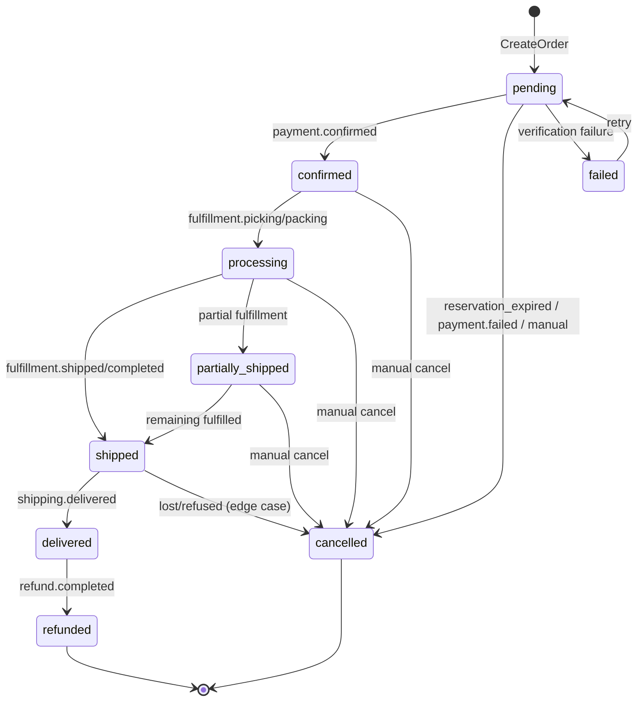

# 🔍 Order Lifetime Consistency — Review & Checklist

> **Date**: 2026-02-18 | **Scope**: Order service full lifecycle  
> **Services**: checkout, order (main + worker), warehouse, fulfillment, shipping, payment, return  
> **Benchmark**: Shopify, Shopee, Lazada  
> **Files reviewed**: 20+ files, ~5,000 lines

---

## Order State Machine

**Source**: `constants.go:162-172` — `OrderStatusTransitions` (9 states)

> **Note**: `pending → processing` is NOT in the transition map. Only `confirmed → processing` is valid.
> Orders must be confirmed (payment verified) before entering processing (fulfillment).

---

## 🔴 P0 — Active Bugs

### P0-1: Duplicate Status History in `UpdateOrderStatus`

| Field | Value |
|-------|-------|
| **File** | `update.go:60` + `update.go:74` |
| **Issue** | `createStatusHistory` is called **twice** with identical arguments — every status update creates 2 duplicate history records |
| **Impact** | Doubles audit trail records and DB write load |
| **Fix** | Remove the duplicate call at line 74 |

### P0-2: Non-Transactional Status Update + History

| Field | Value |
|-------|-------|
| **File** | `update.go:53-60` |
| **Issue** | `orderRepo.Update()` and `createStatusHistory()` run as separate operations — NOT wrapped in `WithTransaction`. Crash between them = orphan state |
| **Contrast** | `cancel.go:108-121` and `process.go:34-44` both correctly use `WithTransaction` |
| **Fix** | Wrap `Update` + `createStatusHistory` in `uc.tm.WithTransaction()` |

### P0-3: Event Published After Non-Atomic Status Update

| Field | Value |
|-------|-------|
| **File** | `update.go:85` |
| **Issue** | `PublishOrderStatusChangedEvent` fires after non-transactional update — downstream services may act on inconsistent state if history write failed |
| **Fix** | Fix transaction atomicity first (P0-2), then consider outbox for event publishing |

---

## 🟡 P1 — Logic Issues

### P1-1: `ProcessShipment` Allows Backward `shipped → partially_shipped`

| Field | Value |
|-------|-------|
| **File** | `shipment.go:149` |
| **Issue** | Condition `previousStatus == OrderStatusShipped && newStatus == OrderStatusPartiallyShipped` allows backward transition not defined in `OrderStatusTransitions` |
| **Fix** | Remove the backward case, or add `partially_shipped` to `OrderStatusTransitions[shipped]` if intentional |

### P1-2: Reservation Creation Silently Skips When No Warehouse Service

| Field | Value |
|-------|-------|
| **File** | `reservation.go:164-168` |
| **Issue** | When both `warehouseInventoryService` and `warehouseClient` are nil, code logs a warning and `continue`s — order gets created with NO reservation |
| **Impact** | Stock never reserved → stock leak on cancel; order can oversell |
| **Fix** | Return error instead of `continue` — fail order creation |

### P1-3: Fulfillment `cancelled` Skips Reservation Release

| Field | Value |
|-------|-------|
| **File** | `fulfillment_consumer.go:161-163` |
| **Issue** | Maps `cancelled → cancelled` via `UpdateOrderStatus` — but this bypasses `CancelOrder()` which has the full reservation release + retry + DLQ logic |
| **Impact** | Reservations and stock are NOT released when fulfillment triggers cancellation |
| **Fix** | Call `CancelOrder()` instead of `UpdateOrderStatus()` for fulfillment `cancelled` |

### P1-4: `confirmReservationsForOrder` Has No Retry or DLQ

| Field | Value |
|-------|-------|
| **File** | `event_handler.go:241-267` |
| **Issue** | If `ConfirmReservation` fails, errors are collected but there is NO retry or DLQ. Reservation stays in "pending" and may expire later |
| **Contrast** | Release flow has `releaseReservationWithRetry` (3 retries) + `writeReservationReleaseDLQ` |
| **Fix** | Add retry logic and DLQ similar to the release path |

### P1-5: `ProcessOrder` Uses Hardcoded Status Check

| Field | Value |
|-------|-------|
| **File** | `process.go:24` |
| **Issue** | Hardcodes `order.Status != "pending"` instead of using `canTransitionTo()`. Also, `pending → processing` is NOT in `OrderStatusTransitions` (pending→confirmed is) — so this function conflicts with the transition map |
| **Fix** | Use `canTransitionTo()` for consistency, or update transition map if this path is needed |

### P1-6: HTTP Event Handlers Still Callable

| Field | Value |
|-------|-------|
| **File** | `event_handler.go` (700+ lines) |
| **Issue** | `DaprSubscribeHandler` correctly returns empty subscriptions, but handler methods (`HandlePaymentConfirmed`, etc.) are still active code. If any HTTP route registers them, events are processed by both worker AND HTTP handler |
| **Fix** | Verify no routes register these handlers, or move handler logic to worker-only package |

---

## 🔵 P2 — Code Quality

| ID | Issue | File | Fix |
|----|-------|------|-----|
| P2-1 | Duplicate event types: `PaymentConfirmedEvent` in both `event_handler.go` and `payment_consumer.go` | Multiple | Consolidate to shared types package |
| P2-2 | `fulfillment_consumer.go:62` hardcodes `"fulfillment.status_changed"` instead of `constants.TopicFulfillmentStatusChanged` | fulfillment_consumer.go | Use constant |
| P2-3 | `events.go:18-19` silently returns when `eventPublisher == nil` — no log or metric | events.go | Add warning log |
| P2-4 | `reservation.go` uses `reflect` package — fragile, not compile-time safe | reservation.go | Use type-safe interface |
| P2-5 | `idempotency.go:74` marks failed events as processed (`Success: false`) — prevents Dapr retry | idempotency.go | Don't mark failed events as processed |
| P2-6 | Two status hierarchy impls: `shouldSkipStatusUpdate` vs `isLaterStatus` | Multiple | Consolidate to shared util |
| P2-7 | `cancel.go:157` log uses `%d` for string reservationID | cancel.go | Change to `%s` |

---

## Cross-Service Consistency Matrix

| Transition | Order DB | Warehouse | Payment | Event | Status |
|-----------|----------|-----------|---------|-------|--------|
| Create → pending | ✅ TX | ✅ Reserved (TTL) | — | ✅ outbox | ✅ |
| pending → confirmed | ✅ | ⚠️ Confirm no retry/DLQ | — | ✅ | ⚠️ P1-4 |
| pending → cancelled (expired) | ✅ | ✅ Already released | — | ✅ | ✅ |
| pending → cancelled (payment.failed) | ✅ TX | ✅ Release + retry + DLQ | — | ✅ | ✅ |
| pending → failed | ✅ | ❌ No explicit release | — | ✅ | ⚠️ Leak risk |
| confirmed → processing | ✅ | — | — | ✅ | ✅ |
| processing → shipped | ✅ | — | ✅ Capture | ✅ | ✅ |
| shipped → delivered | ✅ | — | — | ✅ | ✅ |
| delivered → refunded | ✅ | ✅ Restore + DLQ | ✅ | ✅ | ✅ |
| Any → cancelled (fulfillment) | ⚠️ | ❌ No release | — | ✅ | 🔴 P1-3 |

---

## Edge Cases Not Handled

| # | Edge Case | Risk | Notes |
|---|-----------|------|-------|
| 1 | Concurrent cancel + payment confirm race | Medium | No distributed lock on order_id |
| 2 | ProcessShipment items exceed ordered quantity | High | No `sum(shipped) ≤ sum(ordered)` guard |
| 3 | Refund on partially-shipped order | Medium | No path `partially_shipped → refunded` |
| 4 | Order stuck in "confirmed" — no fulfillment created | High | No watchdog/timeout |
| 5 | `pending → failed` reservation not released | Medium | Reservation may expire or leak |
| 6 | Shipment items not in order silently skipped | Medium | `shipment.go:81` logs but no validation |

---

## Saga / Outbox Audit

### ✅ Correctly Implemented
- Outbox pattern in `CreateOrder`, `CancelOrder`, `PaymentConsumer`
- DLQ for reservation release (`writeReservationReleaseDLQ`)
- DLQ for refund restock (`writeRefundRestockDLQ`)
- DLQ for warehouse ops (`writeWarehouseDLQ`)
- FailedCompensation table for payment consumer
- All worker consumers use `IdempotencyHelper.CheckAndMark()`
- Payment saga state tracking (`authorized/capture_pending/captured/capture_failed`)
- Auth expiry validation (7-day window) before capture
- Stock validation before capture

### ⚠️ Missing
- No DLQ for reservation **confirm** failures (P1-4)
- No auto-cancel on capture failure (order stays in confirmed/processing)
- No reconciliation cron: Order ↔ Warehouse ↔ Payment drift detection
- No watchdog for stale "confirmed" orders

---

## Action Items Summary

| # | Priority | Action | File | Status |
|---|----------|--------|------|--------|
| 1 | 🔴 P0 | Remove duplicate `createStatusHistory` at line 74 | update.go | ✅ DONE |
| 2 | 🔴 P0 | Wrap Update + StatusHistory in `WithTransaction` | update.go | ✅ DONE |
| 3 | 🔴 P0 | Fix event-after-non-atomic consistency | update.go | ✅ DONE |
| 4 | 🟡 P1 | Remove backward `shipped→partially_shipped` | shipment.go | ✅ DONE |
| 5 | 🟡 P1 | Fail order create when no warehouse service | reservation.go | ✅ DONE |
| 6 | 🟡 P1 | Call `CancelOrder()` for fulfillment cancelled | fulfillment_consumer.go | ✅ DONE |
| 7 | 🟡 P1 | Add retry+DLQ to confirmReservationsForOrder | event_handler.go | ✅ DONE |
| 8 | 🟡 P1 | Use `canTransitionTo()` in ProcessOrder | process.go | ✅ DONE |
| 9 | 🟡 P1 | Verify HTTP handlers aren't registered | server.go | ✅ DONE |
| 10 | 🔵 P2 | Consolidate duplicate event types | Multiple | ✅ DONE (by design) |
| 11 | 🔵 P2 | Use constant for fulfillment topic | fulfillment_consumer.go | ✅ DONE |
| 12 | 🔵 P2 | Don't mark failed events as processed | idempotency.go | ✅ DONE |
| 13 | 🔵 P2 | Consolidate status hierarchy functions | constants.go | ✅ DONE |
| 14 | 🔵 P2 | Replace reflect-based reservation code | reservation.go | ✅ DONE |
| 15 | 🔵 P2 | Fix `%d` → `%s` for reservationID log | cancel.go | ✅ DONE |
| 16 | 🔵 P2 | Add warning log when eventPublisher is nil | events.go | ✅ DONE |
| 17 | 📊 Ops | Add Order↔Warehouse↔Payment reconciliation cron | — | ✅ DONE (stale-order) |
| 18 | 📊 Ops | Add watchdog for stale "confirmed" orders (> 2hr) | — | ✅ DONE |
| 19 | 📊 Ops | Add shipped quantity guard per item | shipment.go | ✅ DONE |

---

## Review Issues Found & Fixed (2026-02-18)

| # | Issue | File | Fix |
|---|-------|------|-----|
| R-1 | Duplicate `FulfillmentStatusChangedEvent` struct (6 vs 17 fields — silently dropped fields) | fulfillment_consumer.go | Expanded to full 17-field schema matching actual event payload |
| R-2 | Dead `mapFulfillmentStatusToOrderStatus` in event_handler.go returned `"cancelled"` misleadingly | event_handler.go | Replaced with no-op stub (guarded handler prevents execution) |
| R-3 | `update.go` used hardcoded strings instead of `constants.OrderStatus*` | update.go | Replaced with `constants.OrderStatusDelivered`, `OrderStatusCancelled`, `OrderStatusPending` |
| R-4 | State diagram didn't clarify `pending → processing` is invalid | This doc | Added note: only `confirmed → processing` is valid per transition map |
| R-5 | HTTP event handlers still active as public methods — dual processing risk | event_handler.go | Added `httpHandlerDeprecated()` guard to all 5 HTTP handlers |

