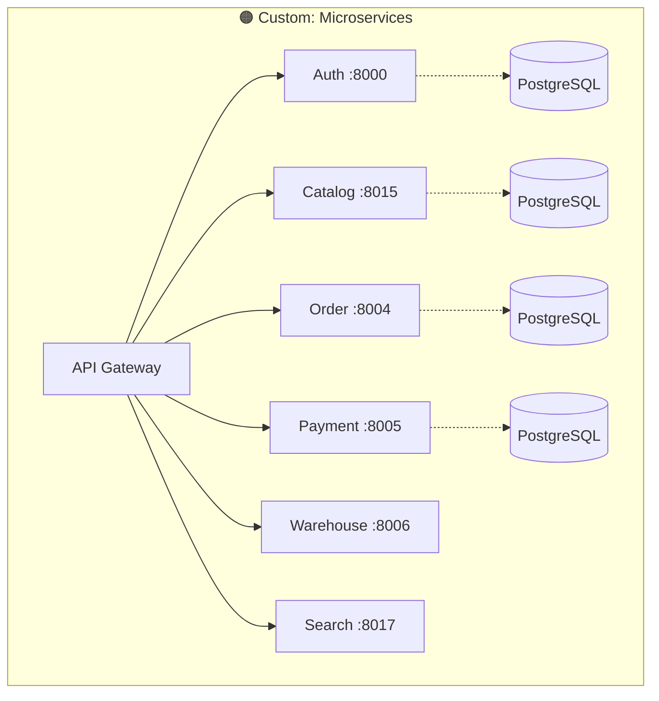
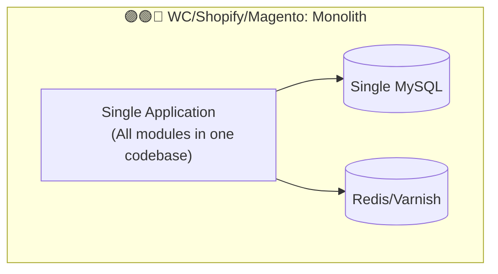

# So sánh Platform E-commerce: Custom Microservices vs WooCommerce vs Shopify vs Magento
> **Date**: 2026-02-14 | **Version**: v1.1 (updated post-session commit)

---

## 1. Tổng quan Platform

| Tiêu chí | 🟠 Custom Microservices (Hệ thống hiện tại) | 🟣 WooCommerce | 🟢 Shopify | 🔵 Magento (Adobe Commerce) |
|----------|------|------|------|------|
| **Kiến trúc** | Microservices (21 Go services) | Monolith (WordPress plugin) | SaaS / Monolith hosted | Monolith (PHP, modular) |
| **Ngôn ngữ** | Go, React, Next.js | PHP (WordPress) | Ruby on Rails (closed) | PHP (Magento Framework) |
| **Database** | PostgreSQL per service | MySQL (shared) | MySQL (managed, closed) | MySQL (shared) |
| **Hosting** | Self-hosted K8s (K3d/ArgoCD) | Self-hosted / Any hosting | Shopify Cloud (managed) | Self-hosted / Adobe Cloud |
| **Open Source** | ✅ Private source, full ownership | ✅ GPL v2 | ❌ Closed source | ⚠️ Open Source (CE) / Closed (EE) |
| **Chi phí** | Infra + dev team | Free plugin + hosting | $29-299/mo + transaction fees | Free (CE) / $$$$ (EE) |
| **Target** | Custom enterprise, VN market | SMB, bloggers, WP users | D2C brands, SMB-Enterprise | Enterprise, B2B complex |

---

## 2. Kiến trúc & Scalability

### Điểm khác biệt lớn nhất: Microservices vs Monolith

| Khía cạnh | 🟠 Custom | 🟣 WooCommerce | 🟢 Shopify | 🔵 Magento |
|-----------|-----------|----------------|------------|------------|
| **Scale từng module** | ✅ Scale Order riêng, Payment riêng | ❌ Scale cả WordPress | ✅ Shopify lo (nhưng không kiểm soát) | ❌ Scale cả app (horizontal scaling limited) |
| **Database isolation** | ✅ DB riêng per service | ❌ Shared DB, 60+ tables | ❌ Không access DB | ❌ Shared DB, 300+ tables |
| **Deploy độc lập** | ✅ Deploy 1 service không ảnh hưởng service khác | ❌ Deploy = update toàn bộ WP | ✅ Shopify deploy (bạn không cần lo) | ❌ Deploy = downtime toàn bộ |
| **Fault isolation** | ✅ Payment crash ≠ Catalog down | ❌ Plugin crash = site down | ✅ Shopify lo | ❌ Module crash = site down |
| **Complexity** | 🔴 Rất cao (21 services + event flows + K8s = cần team lớn) | 🟢 Thấp | 🟢 Thấp nhất | 🟡 Trung bình-Cao |

---

## 3. Tính năng E-commerce Core

### 3.1 Checkout & Order Flow

| Tính năng | 🟠 Custom | 🟣 WooCommerce | 🟢 Shopify | 🔵 Magento |
|-----------|-----------|----------------|------------|------------|
| **Cart management** | ✅ RDBMS + Redis session | ✅ WP Session/Cookie | ✅ Cart API | ✅ Quote system |
| **Multi-step checkout** | ✅ Custom flow (stock validate → reserve → pay → order) | ✅ Via plugins | ✅ Checkout UI Extensions | ✅ Native multi-step |
| **Stock reservation** | ✅ TTL-based reservation + expiry worker | ❌ Chỉ reduce on order | ✅ 10-min reservation | ✅ Reservation trước pay |
| **Idempotency** | ✅ Redis + DB (prevent duplicate orders) | ❌ Không built-in | ✅ Built-in | ⚠️ Partial |
| **Payment Saga** | ✅ 3-phase (authorize → capture retry → compensation + DLQ) | ❌ Sync payment only | ✅ Shopify Payments internal | ❌ Sync payment |
| **Order cancellation** | ✅ Reservation release + refund + loyalty reversal + events | ✅ Basic cancel + restock | ✅ Full cancel flow | ✅ Credit memo system |

### 3.2 Payment Processing

| Tính năng | 🟠 Custom | 🟣 WooCommerce | 🟢 Shopify | 🔵 Magento |
|-----------|-----------|----------------|------------|------------|
| **Payment gateways** | Stripe, VNPay, MoMo + COD | 100+ plugins (Stripe, PayPal, etc.) | Shopify Payments + 100+ providers | PayPal, Stripe, Braintree, etc. |
| **VN-specific gateways** | ✅ VNPay, MoMo native | ⚠️ Via 3rd-party plugin | ⚠️ Limited VN support | ⚠️ Via extension |
| **Gateway failover** | ✅ Automatic failover between gateways | ❌ | ❌ | ❌ |
| **Fraud detection** | ✅ GeoIP + VPN/proxy detection + ML model | ❌ Plugin-based | ✅ Shopify Protect | ⚠️ Signifyd/etc integration |
| **Circuit breaker** | ✅ Per-gateway circuit breakers | ❌ | ✅ Internal | ❌ |
| **Rate limiting** | ✅ Per-gateway rate limits | ❌ | ✅ Internal | ❌ |
| **Reconciliation** | ✅ Automated reconciliation job | ❌ Manual | ✅ Shopify Balance | ⚠️ Manual/3rd party |
| **Auth + Capture** | ✅ Separate authorize → delayed capture | ✅ Gateway-dependent | ✅ Native | ✅ Native |

### 3.3 Inventory & Warehouse

| Tính năng | 🟠 Custom | 🟣 WooCommerce | 🟢 Shopify | 🔵 Magento |
|-----------|-----------|----------------|------------|------------|
| **Multi-warehouse** | ✅ Full multi-warehouse | ❌ Single stock location | ✅ Multi-location | ✅ Multi-source inventory (MSI) |
| **Stock reservation** | ✅ Transactional outbox + TTL expiry | ❌ | ✅ Basic | ✅ Reservation (MSI) |
| **Backorder management** | ✅ BackorderQueue + auto-fill | ✅ Basic allow/disallow | ✅ Continue selling | ✅ Backorder per product |
| **Inventory transfers** | ✅ Between warehouses | ❌ | ✅ Transfers between locations | ✅ Source transfer |
| **Batch picking** | ✅ Optimized pick path | ❌ | ❌ (3rd party: ShipHero) | ❌ (3rd party) |
| **Bin/Aisle location** | ✅ Full WMS features | ❌ | ❌ | ❌ |

### 3.4 Search & Catalog

| Tính năng | 🟠 Custom | 🟣 WooCommerce | 🟢 Shopify | 🔵 Magento |
|-----------|-----------|----------------|------------|------------|
| **Search engine** | Elasticsearch (full-text, faceted, autocomplete) | MySQL LIKE queries | Shopify Search & Discovery | Elasticsearch (native in 2.4+) |
| **EAV attributes** | ✅ Custom EAV in Catalog service | ❌ WP meta (slow) | ❌ Metafields (limited query) | ✅ Full EAV (nổi tiếng phức tạp) |
| **Real-time sync** | ✅ Event-driven (product/price/stock → ES) | ❌ On-demand reindex | ✅ Automatic | ⚠️ Cron-based reindex |
| **Synonyms** | ✅ Built-in synonym management | ❌ Plugin | ✅ Built-in | ✅ Native |
| **ML features** | ✅ Feature extraction for recommendations | ❌ | ✅ Shopify AI | ⚠️ Adobe Sensei (EE only) |

---

## 4. Event-Driven Architecture — Điểm vượt trội

| Khía cạnh | 🟠 Custom | 🟣 WooCommerce | 🟢 Shopify | 🔵 Magento |
|-----------|-----------|----------------|------------|------------|
| **Event system** | Dapr PubSub (Redis Streams) — async, decoupled | WordPress Hooks (sync, in-process) | Webhooks (HTTP callback) | Magento Events/Observers (sync, in-process) |
| **Transactional outbox** | ✅ 8 services (order, payment, warehouse, fulfillment, shipping, pricing, loyalty, return) | ❌ | ❌ | ❌ |
| **Event idempotency** | ✅ DB-level per consumer | ❌ | ❌ (webhook retry is "at least once") | ❌ |
| **Saga pattern** | ✅ Multi-phase payment saga with DLQ + compensation | ❌ | ❌ (internal, closed) | ❌ |
| **Dead Letter Queue** | ✅ Failed events tracked + alert | ❌ | ❌ | ❌ |

> **Tại sao điều này quan trọng?**
> - WordPress hooks chạy **đồng bộ** — nếu 1 hook chậm, toàn bộ request bị block
> - Shopify webhooks có thể bị **miss** nếu endpoint down — không có replay mechanism
> - Magento observers chạy **đồng bộ** và có thể gây performance bottleneck
> - Custom system: Events là **bất đồng bộ**, retry tự động, idempotent, có outbox đảm bảo delivery

---

## 5. DevOps & Deployment

| Khía cạnh | 🟠 Custom | 🟣 WooCommerce | 🟢 Shopify | 🔵 Magento |
|-----------|-----------|----------------|------------|------------|
| **Infrastructure** | K8s (K3d) + ArgoCD GitOps | cPanel / VPS / WP hosting | Shopify Cloud (managed) | Cloud / On-prem / Adobe Cloud |
| **CI/CD** | GitLab CI + ArgoCD auto-sync | FTP / Git deploy plugins | Shopify CLI / GitHub integration | CI/CD tự setup |
| **Container** | ✅ Docker (dual-binary: service + worker) | ❌ (có thể Docker hóa nhưng không native) | ❌ Closed | ⚠️ Có thể nhưng phức tạp |
| **Zero-downtime deploy** | ✅ Rolling update per service | ❌ Maintenance mode | ✅ Always up | ⚠️ Tùy setup |
| **Auto-scaling** | ✅ K8s HPA per service | ❌ Manual | ✅ Shopify managed | ⚠️ Manual / Cloud managed |
| **Observability** | Prometheus metrics + OpenTelemetry tracing | ❌ WP Debug Log | ✅ Shopify Analytics | ⚠️ New Relic/etc integration |
| **Service discovery** | Consul | ❌ N/A | ❌ N/A | ❌ N/A |

---

## 6. Điểm yếu của hệ thống hiện tại so với Platforms

| Điểm yếu | Chi tiết | WC/Shopify/Magento có? |
|-----------|----------|----------------------|
| 🔴 **Không có plugin ecosystem** | Mọi tính năng phải tự code | ✅ WC: 59,000+ plugins, Shopify: 8,000+ apps |
| 🔴 **Không có CMS/Content** | Không có blog, landing pages | ✅ WC = WordPress CMS, Shopify có Online Store |
| 🔴 **Complexity quá cao** | 21 services + event flows + K8s = cần team lớn | ✅ 1 người có thể chạy WC/Shopify |
| 🟡 **Không có POS** | Không hỗ trợ bán tại cửa hàng | ✅ Shopify POS, Magento POS extensions |
| 🟡 **Email marketing** | Chỉ có notification service cơ bản | ✅ Mailchimp/Klaviyo integrated |
| 🟡 **SEO tools** | Không có built-in SEO | ✅ WC: Yoast SEO, Shopify: built-in |
| 🟡 **Themes / Storefront** | 1 Next.js frontend (tự maintain) | ✅ WC: 1000+ themes, Shopify: 100+ themes |

---

## 7. Điểm mạnh của hệ thống hiện tại — Không platform nào có

| Điểm mạnh | Chi tiết | Platform nào có? |
|-----------|----------|-----------------|
| ✅ **Payment Saga 3-phase** | Authorize → Capture retry → Compensation + DLQ + Alert | ❌ Không platform nào |
| ✅ **Transactional Outbox** | Guaranteed event delivery, không lose data | ❌ Không platform nào |
| ✅ **VN gateway native** | VNPay + MoMo + Stripe với circuit breaker + failover | ⚠️ WC/Shopify cần plugin, Magento cần extension |
| ✅ **Multi-warehouse WMS** | Bin location, batch picking, optimized pick path | ❌ WC không có, Shopify/Magento rất basic |
| ✅ **Per-service scaling** | Payment spike? Scale chỉ payment service | ❌ Monolith phải scale tất cả |
| ✅ **Database isolation** | Payment data riêng biệt, security tốt hơn | ❌ Shared DB = 1 SQL injection → all data |
| ✅ **Loyalty system đầy đủ** | Tiers, campaigns, points, referrals, rewards | ⚠️ Shopify: plugin. WC: plugin. Magento EE: built-in |
| ✅ **Event idempotency** | Không duplicate processing | ❌ Không platform nào |
| ✅ **Full observability** | Prometheus + OpenTelemetry per service | ❌ WC/Magento phải tự setup |

---

## 8. Ma trận Quyết định

| Khi nào chọn gì? | Custom Microservices | WooCommerce | Shopify | Magento |
|-------------------|---------------------|-------------|---------|---------|
| **< 100 sản phẩm, 1 người** | ❌ Overkill | ✅ | ✅✅ | ❌ |
| **SMB, 1000 sản phẩm** | ❌ Overkill | ✅ | ✅✅ | ⚠️ |
| **D2C brand, scaling** | ⚠️ Nếu cần VN-specific | ⚠️ Performance issues | ✅✅ | ✅ |
| **Multi-warehouse, WMS** | ✅✅ | ❌ | ⚠️ | ✅ |
| **Enterprise, B2B** | ✅✅ | ❌ | ⚠️ Plus plan | ✅✅ |
| **VN market, COD + VNPay** | ✅✅ Best fit | ⚠️ Plugin quality varies | ⚠️ Limited VN | ⚠️ Extension |
| **Cần hoàn toàn customize** | ✅✅ Own everything | ✅ Open source | ❌ Locked | ✅ Open source (CE) |
| **Team < 3 devs** | ❌ Quá phức tạp | ✅ | ✅✅ | ⚠️ |
| **Team 5+ devs, long-term** | ✅✅ | ❌ Scale issues | ⚠️ Vendor lock-in | ✅ |

---

## 9. Kết luận

### Hệ thống hiện tại phù hợp khi:
1. 🏢 **Enterprise scale** — cần multi-warehouse, custom payment flows, VN-specific gateways
2. 🔧 **Full ownership** — không muốn vendor lock-in, kiểm soát 100% source code
3. 📈 **High throughput** — cần scale từng service độc lập theo load thực tế
4. 🔒 **Data isolation** — yêu cầu security cao, PCI compliance per-service
5. 🇻🇳 **VN market** — VNPay/MoMo/COD là first-class citizens, không phải plugin

### Không phù hợp khi:
1. 👤 Team nhỏ (< 3 devs) — complexity quá cao để maintain
2. 🚀 Cần go-live nhanh — Shopify launch trong 1 ngày, custom cần hàng tháng
3. 📝 Cần CMS/Blog — không có content management
4. 🔌 Cần hệ sinh thái plugin — mọi thứ phải tự build
5. 💰 Budget thấp — infra K8s + team Go devs ≠ rẻ

> **Bottom line**: Hệ thống hiện tại đang build những thứ mà **Magento Enterprise mất $200k+/năm license** để có — payment saga, multi-warehouse WMS, event-driven architecture, transactional outbox, fraud detection. Tradeoff là phải có team mạnh để maintain. Core flows (checkout → order → payment → fulfillment → shipping → return) đã hoàn thiện.
