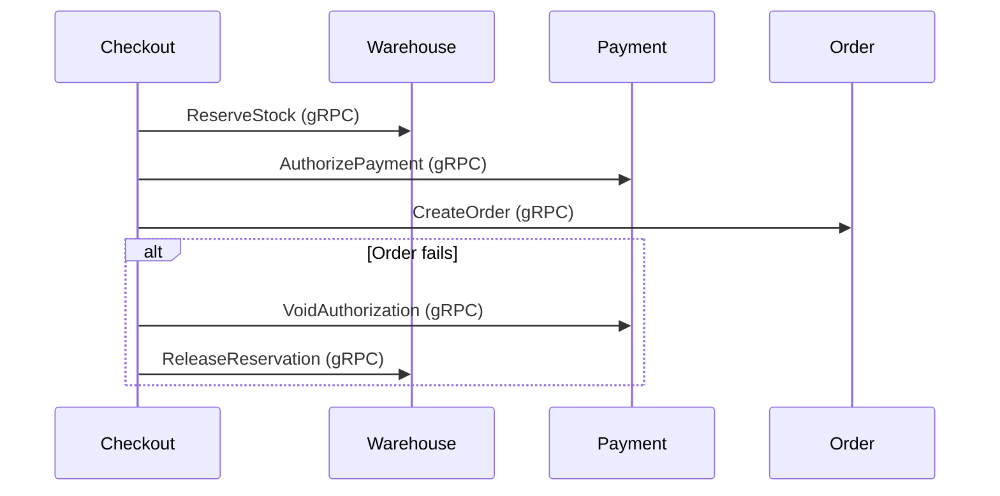

# 🔗 QA Integration Test Checklist — Cross-Service Flows
> **Version**: v5.3 | **Date**: 2026-02-15
> **Scope**: gRPC service-to-service calls + Dapr PubSub event flows
> **Dependencies**: Consul (service discovery), Dapr (PubSub), Redis, PostgreSQL, Elasticsearch
> **Execution Plan**: [View Plan](./qa-integration-test-execution-plan.md)

---

## 🔴 P0 — Critical Cross-Service Flows

### 1. Checkout → Order → Payment SAGA

> **Services**: Checkout, Order, Payment, Warehouse
> **Pattern**: Orchestrated saga with compensation

| # | Test Case | Services | Status |
|---|-----------|----------|--------|
| 1.1 | `TestCheckoutSaga_AllSucceed` — stock reserved + payment authorized + order created | CK → WH, PAY, ORD | `[ ]` |
| 1.2 | `TestCheckoutSaga_PaymentAuthFails` — stock released, order not created | CK → WH, PAY | `[ ]` |
| 1.3 | `TestCheckoutSaga_OrderCreationFails` — payment voided + stock released | CK → PAY, WH | `[ ]` |
| 1.4 | `TestCheckoutSaga_VoidAuthFails` — DLQ entry created (RISK-001) | CK → PAY | `[ ]` |
| 1.5 | `TestCheckoutSaga_StockReservationFails` — no payment auth attempted | CK → WH | `[ ]` |
| 1.6 | `TestCheckoutSaga_ConcurrentDuplicate` — Redis SETNX blocks duplicate (EC-001) | CK | `[ ]` |
| 1.7 | `TestCheckoutSaga_PriceDrift` — revalidateCartPrices rejects stale prices (EC-003) | CK → PRI | `[ ]` |

---

### 2. Payment Capture Saga (Async)

> **Services**: Order (worker), Payment
> **Pattern**: Async retry with exponential backoff + DLQ + compensation

| # | Test Case | Services | Status |
|---|-----------|----------|--------|
| 2.1 | `TestCaptureRetry_SuccessOnFirstAttempt` — payment captured, order → `paid` | ORD → PAY | `[ ]` |
| 2.2 | `TestCaptureRetry_SuccessOnThirdAttempt` — retry with backoff succeeds | ORD → PAY | `[ ]` |
| 2.3 | `TestCaptureRetry_AuthExpired` — skips capture, initiates void (EC-002) | ORD → PAY | `[ ]` |
| 2.4 | `TestCaptureRetry_MaxRetriesExhausted` — moves to FailedCompensation DLQ | ORD → PAY | `[ ]` |
| 2.5 | `TestCompensation_VoidAndCancelOrder` — void auth + cancel order + alert | ORD → PAY | `[ ]` |
| 2.6 | `TestCompensation_VoidFails` — alert triggered, manual intervention | ORD → PAY | `[ ]` |

---

### 3. Order Cancellation (Multi-Service)

> **Services**: Order, Warehouse (gRPC), Loyalty, Promotion, Fulfillment (events)

| # | Test Case | Services | Status |
|---|-----------|----------|--------|
| 3.1 | `TestCancelOrder_ReleasesStock` — Warehouse gRPC `ReleaseReservation` called (3x retry) | ORD → WH | `[ ]` |
| 3.2 | `TestCancelOrder_ReversesLoyalty` — `order.cancelled` → Loyalty deducts points | ORD → LR | `[ ]` |
| 3.3 | `TestCancelOrder_ReversesPromotion` — `order.cancelled` → Promotion reverses usage | ORD → PROMO | `[ ]` |
| 3.4 | `TestCancelOrder_StopsFulfillment` — `order.cancelled` → Fulfillment stops picking | ORD → FF | `[ ]` |
| 3.5 | `TestCancelOrder_InitiatesRefund` — calls `CancellationUsecase.InitiateRefund()` | ORD → PAY | `[ ]` |
| 3.6 | `TestCancelOrder_SendsNotification` — `order.status.changed` → email/SMS sent | ORD → NOTIF | `[ ]` |

---

### 4. Fulfillment → Shipping Pipeline

> **Services**: Order, Fulfillment, Warehouse, Shipping

| # | Test Case | Services | Status |
|---|-----------|----------|--------|
| 4.1 | `TestOrderPaid_CreatesFulfillment` — `order.paid` → Fulfillment created | ORD → FF | `[ ]` |
| 4.2 | `TestFulfillmentCompleted_CreatesShipment` — `fulfillment.completed` → Shipping created | FF → SH | `[ ]` |
| 4.3 | `TestShippingShipped_UpdatesOrder` — `shipping.shipped` → Order status → shipped | SH → ORD | `[ ]` |
| 4.4 | `TestShippingDelivered_UpdatesOrder` — `shipping.delivered` → Order status → delivered | SH → ORD | `[ ]` |
| 4.5 | `TestFulfillmentEvent_Outbox` — event written to outbox, not best-effort (EC-004) | FF | `[ ]` |

---

### 5. Return & Refund Flow

> **Services**: Return, Order, Payment, Warehouse, Shipping

| # | Test Case | Services | Status |
|---|-----------|----------|--------|
| 5.1 | `TestReturnRequest_FetchesOrderItems` — real product data from Order gRPC (not "stub-product") | RET → ORD | `[ ]` |
| 5.2 | `TestReturnApproved_ProcessesRefund` — calls Payment gRPC `RefundPayment` | RET → PAY | `[ ]` |
| 5.3 | `TestReturnApproved_RestocksItems` — calls Warehouse gRPC `AdjustStock` | RET → WH | `[ ]` |
| 5.4 | `TestReturnApproved_GeneratesLabel` — calls Shipping gRPC for return label | RET → SH | `[ ]` |
| 5.5 | `TestExchange_CreatesNewOrder` — exchange creates replacement order via Order gRPC | RET → ORD | `[ ]` |
| 5.6 | `TestReturnEvents_ViaOutbox` — return.requested/approved/completed via outbox (RISK-007) | RET | `[ ]` |

---

## 🟡 P1 — Event Contract Verification

### 6. Event Publisher → Consumer Contract Tests

> Verify that published event payloads match consumer expectations for each topic.

| # | Event Topic | Publisher | Consumer(s) | Outbox | Idempotent | Status |
|---|-------------|-----------|-------------|--------|------------|--------|
| 6.1 | `order.confirmed` | Order | Warehouse, Payment | ✅ | ✅ | `[ ]` |
| 6.2 | `order.paid` | Order | Fulfillment | ✅ | ✅ | `[ ]` |
| 6.3 | `order.cancelled` | Order | Loyalty, Promotion, Fulfillment | ✅ | ✅ | `[ ]` |
| 6.4 | `order.completed` | Order | Loyalty | ✅ | ✅ | `[ ]` |
| 6.5 | `payment.confirmed` | Payment | Order | ✅ | ✅ | `[ ]` |
| 6.6 | `payment.failed` | Payment | Order | ✅ | ✅ | `[ ]` |
| 6.7 | `fulfillment.completed` | Fulfillment | Shipping | ✅ | ✅ | `[ ]` |
| 6.8 | `shipping.shipped` | Shipping | Order | ✅ | ✅ | `[ ]` |
| 6.9 | `shipping.delivered` | Shipping | Order | ✅ | ✅ | `[ ]` |
| 6.10 | `warehouse.stock.updated` | Warehouse | Catalog, Search | ✅ | ✅ | `[ ]` |
| 6.11 | `return.requested` | Return | — | ✅ | ❌ | `[ ]` |
| 6.12 | `return.approved` | Return | — | ✅ | ❌ | `[ ]` |
| 6.13 | `return.completed` | Return | — | ✅ | ❌ | `[ ]` |
| 6.14 | `auth.user.created` | Auth | Customer | — | — | `[ ]` |
| 6.15 | `customer.created` | Customer | Loyalty | — | — | `[ ]` |

### 7. Event Processing Resilience

| # | Test Case | Scope | Status |
|---|-----------|-------|--------|
| 7.1 | `TestEventIdempotency_AllOrderConsumers` — duplicate events processed once | Order (4 consumers) | `[ ]` |
| 7.2 | `TestEventIdempotency_WarehouseConsumers` — uses `IdempotencyHelper` | Warehouse (4 consumers) | `[ ]` |
| 7.3 | `TestEventIdempotency_ShippingConsumer` — dedup by event ID | Shipping | `[ ]` |
| 7.4 | `TestEventIdempotency_SearchConsumers` — `EventIdempotencyRepo` | Search (5+ consumers) | `[ ]` |
| 7.5 | `TestEventIdempotency_LoyaltyConsumer` — `TransactionExists()` check | Loyalty | `[ ]` |
| 7.6 | `TestOutbox_EventDelivered` — outbox worker polls + publishes pending events | All outbox services | `[ ]` |
| 7.7 | `TestOutbox_RetryOnPublishFailure` — failed publish retried on next poll | All outbox services | `[ ]` |
| 7.8 | `TestNACK_RetriggersEvent` — consumer NACK → Dapr redelivers event | All consumers | `[ ]` |

---

### 8. gRPC Client Integration

> Verify all gRPC client connections work with Consul service discovery.

| # | Caller | Callee(s) | Critical Methods | Status |
|---|--------|-----------|-----------------|--------|
| 8.1 | Checkout | Catalog | `GetProduct`, `GetProductBatch` | `[ ]` |
| 8.2 | Checkout | Pricing | `CalculatePrice`, `GetPricing` | `[ ]` |
| 8.3 | Checkout | Promotion | `ApplyPromotion`, `ValidateCoupon` | `[ ]` |
| 8.4 | Checkout | Warehouse | `ReserveStock`, `ReleaseReservation` | `[ ]` |
| 8.5 | Checkout | Payment | `AuthorizePayment`, `VoidAuthorization` | `[ ]` |
| 8.6 | Checkout | Order | `CreateOrder` | `[ ]` |
| 8.7 | Checkout | Shipping | `GetShippingRates` | `[ ]` |
| 8.8 | Order | Payment | `CapturePayment`, `VoidAuthorization` | `[ ]` |
| 8.9 | Order | Warehouse | `ReleaseReservation` | `[ ]` |
| 8.10 | Order | Notification | `SendNotification` | `[ ]` |
| 8.11 | Fulfillment | Order | `GetOrder` | `[ ]` |
| 8.12 | Fulfillment | Warehouse | `GetStock`, `UpdateStock` | `[ ]` |
| 8.13 | Return | Order | `GetOrder`, `GetOrderItems` | `[ ]` |
| 8.14 | Return | Shipping | `CreateReturnShipment` | `[ ]` |
| 8.15 | Search | Catalog | `GetProduct`, `ListProducts` | `[ ]` |
| 8.16 | Search | Pricing | `GetPricing` | `[ ]` |
| 8.17 | Search | Warehouse | `GetStock` | `[ ]` |
| 8.18 | Loyalty | Customer | `GetCustomer` | `[ ]` |
| 8.19 | Loyalty | Notification | `SendNotification` | `[ ]` |
| 8.20 | Loyalty | Order | `GetOrder` | `[ ]` |

---

### 9. Data Synchronization Flows

| # | Test Case | Source → Target | Status |
|---|-----------|-----------------|--------|
| 9.1 | `TestProductSync_CatalogToSearch` — product created → indexed in Elasticsearch | Catalog → Search | `[ ]` |
| 9.2 | `TestPriceSync_PricingToSearch` — price updated → search index updated | Pricing → Search | `[ ]` |
| 9.3 | `TestStockSync_WarehouseToSearch` — stock changed → availability updated in search | Warehouse → Search | `[ ]` |
| 9.4 | `TestStockSync_WarehouseToCatalog` — stock changed → catalog cache invalidated | Warehouse → Catalog | `[ ]` |
| 9.5 | `TestSearchSyncJob_FullReindex` — cron job reindexes all products | Search | `[ ]` |
| 9.6 | `TestESAlias_WritesCorrectIndex` — all writes go to `products_search` alias, not standalone `products` | Search | `[ ]` |

---

## 🟢 P2 — Infrastructure Integration

### 10. Dapr PubSub Infrastructure

| # | Test Case | Scope | Status |
|---|-----------|-------|--------|
| 10.1 | `TestDaprSidecar_InjectedAllPods` — `daprd` present in all service pods | All services | `[ ]` |
| 10.2 | `TestDaprPubsub_CrossNamespace` — `pubsub-redis` accessible from all namespaces | All namespaces | `[ ]` |
| 10.3 | `TestDaprSubscription_Programmatic` — Go code subscriptions registered | Search worker | `[ ]` |
| 10.4 | `TestDaprSubscription_Declarative` — K8s YAML subscriptions loaded | Loyalty worker | `[ ]` |
| 10.5 | `TestNetworkPolicy_AllowsDapr` — Dapr sidecar→sidecar communication not blocked | All services | `[ ]` |

### 11. Database & External Services

| # | Test Case | Scope | Status |
|---|-----------|-------|--------|
| 11.1 | `TestPostgres_Connectivity` — each service connects to its DB | All 19 services | `[ ]` |
| 11.2 | `TestPostgres_Migration` — Goose migrations apply cleanly | All services | `[ ]` |
| 11.3 | `TestRedis_Connectivity` — Redis cache/lock operations work | Checkout, Payment, Search | `[ ]` |
| 11.4 | `TestElasticsearch_Connectivity` — ES index CRUD operations | Search | `[ ]` |
| 11.5 | `TestConsul_ServiceRegistration` — all services registered for gRPC discovery | All services | `[ ]` |
| 11.6 | `TestMinIO_FileUpload` — file upload/download operations | Common Operations | `[ ]` |
| 11.7 | `TestVault_SecretAccess` — secrets fetched via External Secrets Operator | All services | `[ ]` |

---

## 📊 Integration Test Summary

| Category | Test Cases | Priority |
|----------|-----------|----------|
| Checkout SAGA | 7 | 🔴 P0 |
| Payment Capture Saga | 6 | 🔴 P0 |
| Order Cancellation | 6 | 🔴 P0 |
| Fulfillment → Shipping | 5 | 🔴 P0 |
| Return & Refund | 6 | 🔴 P0 |
| Event Contracts | 15 | 🟡 P1 |
| Event Resilience | 8 | 🟡 P1 |
| gRPC Clients | 20 | 🟡 P1 |
| Data Sync | 6 | 🟡 P1 |
| Dapr Infrastructure | 5 | 🟢 P2 |
| DB & External | 7 | 🟢 P2 |
| **Total** | **~91** | |
