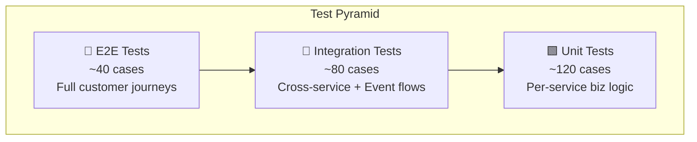

# 🧪 QA Test Case Plan — All Services & Integration Flows
> **Version**: v5.3 | **Date**: 2026-02-15
> **Scope**: 19 Go services + 2 frontends + cross-service integration flows
> **Method**: Based on codebase review, event contracts, gRPC dependency map, and existing v5 checklists

---

## 📋 Document Index

| # | Document | Coverage | Test Cases |
|---|----------|----------|------------|
| 1 | [qa-unit-test-checklist.md](qa-unit-test-checklist.md) | Per-service unit/biz logic tests | ~120 cases |
| 2 | [qa-integration-test-checklist.md](qa-integration-test-checklist.md) | Cross-service flows (gRPC + Events) | ~80 cases |
| 3 | [qa-e2e-test-checklist.md](qa-e2e-test-checklist.md) | Customer journeys + full flows | ~40 cases |
| 4 | [qa-nonfunctional-test-checklist.md](qa-nonfunctional-test-checklist.md) | Performance, security, resilience | ~30 cases |

---

## 🎯 Testing Strategy

### Priority Matrix

| Priority | Focus | When to Run |
|----------|-------|-------------|
| 🔴 P0 — Critical | Money flows, data consistency, auth | Every PR + deploy |
| 🟡 P1 — Important | Business logic correctness, event contracts | Every sprint |
| 🟢 P2 — Standard | Edge cases, UI, analytics accuracy | Release candidate |
| ⚪ P3 — Nice-to-have | Performance, load testing | Monthly |

---

## 🏗️ Service Test Coverage Status

### Core Business Services

| Service | Unit Tests | Integration | E2E | Priority |
|---------|-----------|-------------|-----|----------|
| Auth | `[ ]` | `[ ]` | `[ ]` | 🔴 P0 |
| User | `[ ]` | `[ ]` | `[ ]` | 🟡 P1 |
| Customer | `[ ]` | `[ ]` | `[ ]` | 🟡 P1 |
| Catalog | `[ ]` | `[ ]` | `[ ]` | 🟡 P1 |
| Pricing | `[ ]` | `[ ]` | `[ ]` | 🔴 P0 |
| Promotion | `[ ]` | `[ ]` | `[ ]` | 🟡 P1 |
| Checkout | `[ ]` | `[ ]` | `[ ]` | 🔴 P0 |
| Order | `[ ]` | `[ ]` | `[ ]` | 🔴 P0 |
| Payment | `[ ]` | `[ ]` | `[ ]` | 🔴 P0 |
| Warehouse | `[ ]` | `[ ]` | `[ ]` | 🔴 P0 |
| Fulfillment | `[ ]` | `[ ]` | `[ ]` | 🟡 P1 |
| Shipping | `[ ]` | `[ ]` | `[ ]` | 🟡 P1 |
| Return | `[ ]` | `[ ]` | `[ ]` | 🔴 P0 |

### Platform & Operational Services

| Service | Unit Tests | Integration | E2E | Priority |
|---------|-----------|-------------|-----|----------|
| Gateway | `[ ]` | `[ ]` | `[ ]` | 🔴 P0 |
| Search | `[ ]` | `[ ]` | `[ ]` | 🟡 P1 |
| Analytics | `[ ]` | `[ ]` | `[ ]` | 🟢 P2 |
| Review | `[ ]` | `[ ]` | `[ ]` | 🟢 P2 |
| Common Ops | `[ ]` | `[ ]` | `[ ]` | 🟢 P2 |
| Notification | `[ ]` | `[ ]` | `[ ]` | 🟡 P1 |
| Location | `[ ]` | `[ ]` | `[ ]` | 🟢 P2 |
| Loyalty | `[ ]` | `[ ]` | `[ ]` | 🟡 P1 |

---

## 📊 Cross-References

- **Business Logic Reviews**: [business-logic-review-checklist.md](business-logic-review-checklist.md)
- **Event Pipeline Audit**: [dapr-event-pipeline-audit-checklist.md](dapr-event-pipeline-audit-checklist.md)
- **System Weakness Analysis**: [system-weakness-analysis.md](system-weakness-analysis.md)
- **Master Implementation Checklist**: [master-checklist.md](master-checklist.md)
- **Workflow Docs**: [docs/05-workflows/](../../../05-workflows/README.md)
