# 📋 Step-by-Step Implementation Checklist v5.3
> **Date**: 2026-02-15 | **Version**: v5.3  
> **Source**: Consolidated from `master-checklist.md`, `future-sessions-checklist.md`, `active/INDEX.md`, `qa-test-plan`, and codebase re-audit  
> **Scope**: 19 Go services + 2 frontends — remaining work only  
> **Total Estimated Effort**: ~220h across 7 phases

---

## Current Status Summary

```mermaid
pie title Completion Status (by Phase)
    "✅ Done (Phase 1-3, 5-6 core)" : 45
    "🟡 CI/CD Pipeline" : 4
    "🟡 Common Lib Adoption" : 10
    "🔴 Service Consolidation" : 18
    "🔴 QA Test Coverage" : 15
    "🟢 Documentation" : 3
    "🟢 Future Features" : 5
```



| Previous Phase | Status | Notes |
|---------------|--------|-------|
| Phase 1 — Critical Fixes | ✅ Done | Return stubs implemented, checkout SAGA safe, dead code removed |
| Phase 2 — Business Logic | ✅ Done | Event consumers added, outbox + exchange implemented |
| Phase 3.1 — Common Lib | ✅ Done | `common/outbox`, `common/idempotency` extracted (v1.10.0) |
| Phase 3.3 — Monitoring | ✅ Done | AlertManager rules, Grafana dashboard, cart metrics |
| Phase 5 — Polish | ✅ Done | GeoIP fraud, real analytics, Grafana |
| Phase 6 — Robustness | ✅ Mostly | Idempotency + outbox added to warehouse, shipping, search, loyalty, fulfillment |
| Dapr Pipeline Fixes | ✅ Done | Sidecar injection, GitOps configs, ES index fixes |

---

## 🔴 Phase A — CI/CD Pipeline & Developer Tooling (~8h)
> **Priority**: HIGH — Prevents regressions, enables faster iteration  
> **Prerequisite**: None  
> **Skills**: [commit-code](file:///d:/microservices/.agent/skills/commit-code/SKILL.md)

### A.1 GitLab CI — Auto Lint
| Step | Action | Details | Effort | Status |
|------|--------|---------|--------|--------|
| A.1.1 | Create `.golangci.yml` config | At repo root. Enable: `errcheck`, `staticcheck`, `unused`, `govet`, `ineffassign`. Disable: `typecheck` (proto-gen false positives) | 30m | `[ ]` |
| A.1.2 | Add lint stage to `.gitlab-ci.yml` | `go install github.com/golangci/golangci-lint/cmd/golangci-lint@latest && golangci-lint run ./...` | 1h | `[ ]` |
| A.1.3 | Fix existing lint errors (if any) | Run locally first per service, fix blocking errors | 30m | `[ ]` |

### A.2 GitLab CI — Auto Test
| Step | Action | Details | Effort | Status |
|------|--------|---------|--------|--------|
| A.2.1 | Add test stage to `.gitlab-ci.yml` | `go test -race -cover ./...` per service | 1h | `[ ]` |
| A.2.2 | Add coverage threshold | Fail PR if coverage drops below X% (suggest 40% initially) | 1h | `[ ]` |
| A.2.3 | Cache `go mod` between pipelines | Use GitLab CI `cache: paths: [~/.cache/go-build, ~/go/pkg/mod]` | 30m | `[ ]` |

### A.3 Proto Generation Makefile
| Step | Action | Details | Effort | Status |
|------|--------|---------|--------|--------|
| A.3.1 | Create root `Taskfile.yml` | `task proto:gen SERVICE=order` → runs `protoc --go_out --go-grpc_out` | 1h | `[ ]` |
| A.3.2 | Add `buf.yaml` lint for proto files | Ensures proto style consistency and breaking change detection | 1h | `[ ]` |
| A.3.3 | Document in project README | Quick instructions for running proto gen | 30m | `[ ]` |

**Verify**: Run lint + test locally on 3 services (order, payment, checkout) before pushing CI config.

---

## 🔴 Phase B — Common Library Adoption (~20h)
> **Priority**: HIGH — Eliminates ~900 lines duplicate code  
> **Prerequisite**: `common` v1.10.0 already tagged  
> **Skills**: [use-common-lib](file:///d:/microservices/.agent/skills/use-common-lib/SKILL.md)

### B.1 Adopt `common/outbox` (replace local implementations)
| Step | Service | Current State | Action | Effort | Status |
|------|---------|--------------|--------|--------|--------|
| B.1.1 | `loyalty-rewards` | Local `OutboxEvent` + `OutboxRepo` + `OutboxEventPublisher` | Replace with `common/outbox.GormRepository` + `outbox.Worker`. Keep service-specific event mapping | 3h | `[x]` ✅ Already adopted `common/outbox` |
| B.1.2 | `return` | Local `OutboxEvent` + `OutboxRepo` + outbox worker | Same as above — replace underlying outbox impl | 3h | `[x]` ✅ Migrated to `common/outbox` (2026-02-15) |
| B.1.3 | `fulfillment` | Local `events/outbox_publisher.go` | Verify impl matches `common/outbox` interface, migrate if divergent | 2h | `[x]` ✅ Already adopted `common/outbox` |

**Per-service steps**:
1. `go get gitlab.com/ta-microservices/common@v1.10.0`
2. Replace local `OutboxEvent` model → import `outbox.Event` from common
3. Replace local `OutboxRepo` → use `outbox.GormRepository`
4. Replace local outbox worker → use `outbox.Worker`
5. Keep service-specific `EventPublisher` (maps domain events → outbox entries)
6. Run `go build ./...` → fix imports
7. Run `go test -v ./internal/biz/...` → verify
8. Delete old local files

### B.2 Adopt `common/idempotency`
| Step | Service | Current State | Action | Effort | Status |
|------|---------|--------------|--------|--------|--------|
| B.2.1 | `warehouse` | Local `IdempotencyHelper` in `eventbus/idempotency.go` | Migrate to `common/idempotency.GormIdempotencyHelper` | 2h | `[x]` ✅ Type-aliased to common (2026-02-15), upgraded common v1.9.5→v1.10.0 |
| B.2.2 | `loyalty-rewards` | Uses `TransactionExists` (custom) | Migrate to `GormIdempotencyHelper` | 2h | `[x]` 🟡 Skip — uses business-level idempotency via `points_transactions` table, not event dedup. Valid pattern. |
| B.2.3 | `return` | No idempotency on event consumers | Add `GormIdempotencyHelper` to all consumers | 2h | `[-]` Deferred — interface exists but no consumers implemented yet. Will use common when consumers added. |
| B.2.4 | `fulfillment` | Has local `eventbus/idempotency` | Verify or migrate | 2h | `[x]` ✅ Type-aliased to common (2026-02-15) |
| B.2.5 | `shipping` | Has local idempotency | Verify or migrate to common | 1h | `[x]` ✅ Type-aliased to common (2026-02-15), upgraded common v1.9.5→v1.10.0 |
| B.2.6 | `search` | Has `EventIdempotencyRepo` (local) | Verify or migrate | 1h | `[-]` Deferred — different interface pattern (IsProcessed/MarkProcessed + CleanupOldEvents/CleanupByTopic), used by 3 consumers + tests. Higher effort (~2h). |

**Per-service steps**:
1. Add migration: `CREATE TABLE IF NOT EXISTS event_idempotency (...)` from `common/idempotency/migration_template.sql`
2. Replace local code with `idempotency.NewGormIdempotencyHelper(db, "service-name", logger)`
3. Update consumer code: `if helper.IsDuplicate(ctx, source, sourceID) { return nil }`
4. Run tests → verify
5. Delete old local idempotency code

### B.3 Extract to Common (new packages)
| Step | Pattern | From | Effort | Status |
|------|---------|------|--------|--------|
| B.3.1 | `GeoIPService` | `payment/biz/fraud/geoip_service.go` → `common/geoip/` | 3h | `[x]` ✅ Already in `common/geoip/`, payment already imports it |
| B.3.2 | Standardize `OutboxSaver` interface | `loyalty-rewards/biz/events/outbox_publisher.go` pattern | 2h | `[-]` Deferred — all services already follow same `saveOutboxEvent()` pattern consistently. Formalizing adds marginal value. |

**Verify**: `go build ./...` passes for all modified services. No `replace` directives in any `go.mod`.

---

## 🟡 Phase C — Service Consolidation (~36h)
> **Priority**: MEDIUM — Reduces 19→14 services, -40% ops complexity  
> **Prerequisite**: Phases A, B done (so CI catches regressions)  
> **Skills**: [navigate-service](file:///d:/microservices/.agent/skills/navigate-service/SKILL.md), [setup-gitops](file:///d:/microservices/.agent/skills/setup-gitops/SKILL.md)

### C.1 Merge Auth + User → Identity Service (~16h)

| Step | Action | Details | Effort | Status |
|------|--------|---------|--------|--------|
| C.1.1 | Create `identity/` service directory | Copy `auth/` as base, scaffold new service structure | 1h | `[ ]` |
| C.1.2 | Merge User models into Identity | Move `user/internal/biz/user/` types, usecase → `identity/internal/biz/user/` | 3h | `[ ]` |
| C.1.3 | Merge User data layer | Move `user/internal/data/` repos → `identity/internal/data/` | 2h | `[ ]` |
| C.1.4 | Merge User gRPC service handler | Move `user/internal/service/` → `identity/internal/service/user_service.go` | 1h | `[ ]` |
| C.1.5 | Consolidate DB migrations | Combine `auth/migrations/` + `user/migrations/` → sequential numbering | 1h | `[ ]` |
| C.1.6 | Update Wire DI | Merge both `wire.go` → single provider set | 1h | `[ ]` |
| C.1.7 | Update all gRPC clients | Grep all services for `auth.` and `user.` proto imports → update to `identity.` | 3h | `[ ]` |
| C.1.8 | Update GitOps | New `identity` deployment, remove `user` deployment, rename `auth` → `identity` | 2h | `[ ]` |
| C.1.9 | Update ArgoCD app configs | Remove `user` app, rename `auth` → `identity` | 1h | `[ ]` |
| C.1.10 | Update service discovery (Consul) | Register `identity` service, deregister `auth` + `user` | 1h | `[ ]` |

### C.2 Merge Analytics + Review → Insights Service (~12h)

| Step | Action | Details | Effort | Status |
|------|--------|---------|--------|--------|
| C.2.1 | Create `insights/` directory from `analytics/` base | Keep analytics as primary, extend | 1h | `[ ]` |
| C.2.2 | Merge Review biz + data layer | Move `review/internal/biz/review/` → `insights/internal/biz/review/` | 3h | `[ ]` |
| C.2.3 | Merge Review gRPC service | Add Review proto + handler to Insights service | 2h | `[ ]` |
| C.2.4 | Replace stub Review clients | `stubUserClient + stubCatalogClient` → internal function calls or real gRPC | 2h | `[ ]` |
| C.2.5 | Consolidate DB migrations + GitOps | Merge DBs, update deployments | 2h | `[ ]` |
| C.2.6 | Remove old `analytics/` + `review/` directories | After verification | 1h | `[ ]` |
| C.2.7 | Update consumer routes | Merge event consumer routes from both services | 1h | `[ ]` |

### C.3 Location → Common Lib (~5h)

| Step | Action | Effort | Status |
|------|--------|--------|--------|
| C.3.1 | Extract location data into `common/location/` | Country → Province → District → Ward lookup tables | 3h | `[ ]` |
| C.3.2 | Add location lookup API to Gateway | Embed as in-memory lookup (data changes infrequently) | 1h | `[ ]` |
| C.3.3 | Remove Location service deployment | Delete GitOps + ArgoCD config | 1h | `[ ]` |

### C.4 Replace Remaining Stub Clients (~3h)

| Step | Service | Stubs | Action | Effort | Status |
|------|---------|-------|--------|--------|--------|
| C.4.1 | `review` → `insights` | `stubUserClient`, `stubCatalogClient` | Wire real gRPC clients via service discovery | 3h | `[ ]` |

**Verify**: All services build, gRPC clients resolve, end-to-end order flow works.

---

## 🟡 Phase D — QA Test Coverage (~50h)
> **Priority**: MEDIUM — Critical for production confidence  
> **Prerequisite**: Phase A (CI auto-runs tests)  
> **Skills**: [write-tests](file:///d:/microservices/.agent/skills/write-tests/SKILL.md)  
> **Rules**: Follow [testcase.md](memory://testcase.md) — testify, table-driven, run after write

### D.1 P0 Unit Tests — Money & Auth (~20h)

| Step | Service | Focus Areas | Cases | Effort | Status |
|------|---------|-------------|-------|--------|--------|
| D.1.1 | `payment` | Authorization, capture, void, refund, fraud scoring, webhook processing | ~15 | 4h | `[/]` In Progress |
| D.1.2 | `order` | State machine, cancellation saga, capture retry, compensation DLQ | ~15 | 4h | `[ ]` |
| D.1.3 | `checkout` | SAGA-001 (confirm→void→DLQ), idempotency, price revalidation | ~12 | 3h | `[ ]` |
| D.1.4 | `warehouse` | Reserve/release/confirm atomicity, TOCTOU fix, expiry cleanup | ~12 | 3h | `[ ]` |
| D.1.5 | `auth` | JWT generation/validation, token refresh, RBAC | ~8 | 2h | `[ ]` |
| D.1.6 | `gateway` | Route matching, JWT middleware, rate limiting, CORS | ~8 | 2h | `[ ]` |
| D.1.7 | `return` | Refund flow, restock flow, eligibility check, exchange | ~10 | 2h | `[ ]` |

**Per-service pattern**:
```bash
# 1. Write tests
# 2. Run
go test -v ./internal/biz/<package>/...
# 3. Check coverage
go test -cover ./internal/biz/<package>/...
# 4. Target: >60% biz layer coverage
```

### D.2 P1 Unit Tests — Business Logic (~15h)

| Step | Service | Focus Areas | Cases | Effort | Status |
|------|---------|-------------|-------|--------|--------|
| D.2.1 | `catalog` | Product CRUD, EAV attributes, variant management, outbox events | ~10 | 2h | `[ ]` |
| D.2.2 | `pricing` | Price calculation, tier pricing, effective dates, outbox | ~10 | 2h | `[ ]` |
| D.2.3 | `promotion` | Coupon validation, usage tracking, usage reversal on cancel | ~10 | 2h | `[ ]` |
| D.2.4 | `fulfillment` | Batch picking, status transitions, assignment logic | ~10 | 2h | `[ ]` |
| D.2.5 | `shipping` | Carrier selection (GHN), tracking update, webhook parse | ~8 | 2h | `[ ]` |
| D.2.6 | `loyalty-rewards` | Points earn/deduct, tier calculation, order cancel reversal | ~8 | 2h | `[ ]` |
| D.2.7 | `customer` | Profile CRUD, LTV/cohort analytics, audit logging | ~8 | 2h | `[ ]` |
| D.2.8 | `notification` | Template rendering, channel dispatch (email/push/SMS) | ~6 | 1h | `[ ]` |

### D.3 Integration Tests — Cross-Service (~10h)

| Step | Flow | Services Involved | Cases | Effort | Status |
|------|------|-------------------|-------|--------|--------|
| D.3.1 | Happy path: Cart → Checkout → Order → Payment → Fulfillment → Shipping | checkout, order, payment, warehouse, fulfillment, shipping | ~8 | 3h | `[ ]` |
| D.3.2 | Cancellation: Order → Void → Release Stock → Reverse Loyalty → Reverse Promo | order, payment, warehouse, loyalty, promotion | ~6 | 2h | `[ ]` |
| D.3.3 | Return: Request → Approve → Refund → Restock | return, payment, warehouse | ~5 | 2h | `[ ]` |
| D.3.4 | Event contracts: All pub/sub event payloads match expected schema | all event-publishing services | ~10 | 3h | `[ ]` |

### D.4 Non-Functional Tests (~5h)

| Step | Area | Details | Effort | Status |
|------|------|---------|--------|--------|
| D.4.1 | Load test: Checkout throughput | `k6` or `vegeta` — target 100 concurrent checkouts | 2h | `[ ]` |
| D.4.2 | Security: SQL injection + auth bypass | Basic fuzzing on gateway endpoints | 2h | `[ ]` |
| D.4.3 | Resilience: Service crash recovery | Kill payment during capture → verify retry/compensation | 1h | `[ ]` |

---

## 🟢 Phase E — Documentation Cleanup (~6h)
> **Priority**: LOW — Improves developer experience  
> **Prerequisite**: None (can be done in parallel)

| Step | Action | Details | Effort | Status |
|------|--------|---------|--------|--------|
| E.1 | Standardize service doc headers | Add Owner, Last Updated, Architecture link to each service doc | 1h | `[x]` ✅ Added to 24 service docs (2026-02-15). Template at `docs/templates/service-doc-template.md` |
| E.2 | Update root `README.md` links | Point to consolidated `docs/03-services/core-services/` | 30m | `[x]` ✅ Links verified correct, date updated (2026-02-15) |
| E.3 | Create `scaffold-new-service` skill | Template for creating service #20+ following conventions | 2h | `[x]` ✅ Created `.agent/skills/scaffold-new-service/SKILL.md` (2026-02-15) |
| E.4 | Create `manage-secrets` skill | Best practices for Vault/Env vars, rotation | 1h | `[x]` ✅ Created `.agent/skills/manage-secrets/SKILL.md` (2026-02-15) |
| E.5 | Create `database-maintenance` skill | Backup/Restore/Point-in-time recovery flows | 1h | `[x]` ✅ Created `.agent/skills/database-maintenance/SKILL.md` (2026-02-15) |
| E.6 | Archive deprecated checklists | Move `active/checkout-process-logic-checklist.md`, `active/common_package_issues.md` → `archive/` | 30m | `[x]` ✅ Moved to `checklists/archive/` (2026-02-15) |

---

## 🟢 Phase F — Active Issues Resolution (~16h)
> **Priority**: LOW-MEDIUM — Addresses remaining items from domain-specific reviews  
> **Source**: [active/INDEX.md](file:///d:/microservices/docs/10-appendix/checklists/active/INDEX.md)

### F.1 Critical Active Issues (from INDEX.md Top 10)

| Step | Issue ID | Domain | Description | Effort | Status |
|------|----------|--------|-------------|--------|--------|
| F.1.1 | ARGOCD-P0-1 | Infrastructure | Hardcoded secrets in Git → migrate to Sealed Secrets | 8h | `[ ]` |
| F.1.2 | PAY-P0-12 | Payment | Webhook rate limiting not enforced | 2h | `[ ]` |
| F.1.3 | PAY-P0-13 | Payment | Request size validation missing | 1h | `[ ]` |
| F.1.4 | PROD-P0-2 | Production | Catalog admin endpoints auth verification | 1h | `[ ]` |

### F.2 Update Active Checklist Statuses

| Step | File | Action | Effort | Status |
|------|------|--------|--------|--------|
| F.2.1 | `gateway-jwt-security-review.md` | Move FIXED issues from PENDING → RESOLVED | 30m | `[ ]` |
| F.2.2 | `common-package-refactoring-review.md` | Restructure PENDING section by priority | 30m | `[ ]` |
| F.2.3 | `production-readiness-issues.md` | Re-sort by proper execution rules format | 30m | `[ ]` |
| F.2.4 | Regenerate `active/INDEX.md` | Update status, P0/P1 counts after fixes | 30m | `[ ]` |

### F.3 Dapr Event Pipeline — Remaining Verifications

| Step | Action | Effort | Status |
|------|--------|--------|--------|
| F.3.1 | Verify cross-namespace `pubsub-redis` access from pricing-dev, search-dev | 1h | `[~]` ⏸ BLOCKED — requires K8s cluster access (unreachable 2026-02-15). Code review confirms: Dapr annotations present on pricing/search deployments, `infrastructure-egress` component provides Redis+Dapr egress rules, `pubsub-redis` component in `infrastructure` ns. Needs live `kubectl get component` verification. |
| F.3.2 | Delete orphan `products` ES index (empty, superseded by `products_search` alias) | 15m | `[~]` ⏸ BLOCKED — requires K8s cluster access. Needs: `kubectl exec` into ES pod to delete index. |
| F.3.3 | Re-run search sync + verify 8000+ documents indexed | 30m | `[~]` ⏸ BLOCKED — requires K8s cluster access. Sync job exists at `search/base/sync-job.yaml`. |
| F.3.4 | Test real-time price update → search result update | 30m | `[~]` ⏸ BLOCKED — requires K8s cluster access. Event pipeline code verified: pricing outbox → `pricing.price.updated` → search-worker `price_consumer.go`. |
| F.3.5 | Test real-time stock update → search result update | 30m | `[~]` ⏸ BLOCKED — requires K8s cluster access. Event pipeline code verified: warehouse → `warehouse.inventory.stock_changed` → search-worker `stock_consumer.go`. |

---

## 🟢 Phase G — Future Capabilities (Backlog, ~80h+)
> **Priority**: LOW — Strategic features for business expansion  
> **When**: After Phases A-F are stable

### G.1 International Shipping
| Step | Action | Effort | Status |
|------|--------|--------|--------|
| G.1.1 | Implement FedEx carrier provider | 16h | `[x]` ✅ Done (2026-02-15). 3 files: `client.go` (main provider), `types.go` (API DTOs), `api.go` (HTTP/OAuth2). 28 tests, 90.1% coverage. Integrated in carrier factory. |
| G.1.2 | Implement UPS carrier provider | 16h | `[x]` ✅ Done (2026-02-15). 3 files: `client.go`, `types.go`, `api.go`. 22 tests, 83.7% coverage. UPS-specific: string-based values, numeric service codes, Basic Auth OAuth. |
| G.1.3 | Implement DHL carrier provider | 16h | `[x]` ✅ Done (2026-02-15). 3 files: `client.go`, `types.go`, `api.go`. 20 tests, 92.3% coverage. DHL-specific: API key auth (no OAuth), product codes, basic field validation (no standalone address API). |

### G.2 Missing E-commerce Capabilities
| Step | Feature | Description | Effort | Status |
|------|---------|-------------|--------|--------|
| G.2.1 | Wallet & Store Credit | `Deposit`, `Withdraw`, `Transfer` + "Refund to Wallet" | 20h | `[ ]` |
| G.2.2 | Gift Cards | Issue, redeem, partial balance, digital delivery | 16h | `[ ]` |
| G.2.3 | Subscriptions & Recurring | Recurring orders, billing scheduler, subscribe-and-save | 24h | `[ ]` |
| G.2.4 | GDPR "Right to be Forgotten" | `DeleteUser` saga across all services, `ExportUserData` | 16h | `[ ]` |
| G.2.5 | Multi-Currency & FX | `Money` pattern, `ExchangeRate` provider | 12h | `[ ]` |

### G.3 Event Registry (Long-term)
| Step | Action | Effort | Status |
|------|--------|--------|--------|
| G.3.1 | Create `event-registry.yaml` definition file | 4h | `[ ]` |
| G.3.2 | Build code generator (publisher/consumer/outbox boilerplate) | 8h | `[ ]` |
| G.3.3 | Build contract validation linter | 4h | `[ ]` |

---

## 📊 Effort Summary

| Phase | Focus | Tasks | Effort | Priority |
|-------|-------|-------|--------|----------|
| **A** | CI/CD Pipeline | 9 | ~8h | 🔴 HIGH |
| **B** | Common Library Adoption | 11 | ~20h | 🔴 HIGH |
| **C** | Service Consolidation | 14 | ~36h | 🟡 MEDIUM |
| **D** | QA Test Coverage | 20 | ~50h | 🟡 MEDIUM |
| **E** | Documentation | 6 | ~6h | 🟢 LOW |
| **F** | Active Issues | 12 | ~16h | 🟡 MEDIUM |
| **G** | Future Capabilities | 11 | ~80h+ | 🟢 BACKLOG |
| | **Total** | **83 tasks** | **~216h** | |

---

## 🗓️ Suggested Sprint Plan

| Sprint | Duration | Phases | Focus |
|--------|----------|--------|-------|
| **Sprint 1** (Week 1) | 40h | A + B.1–B.2 | CI/CD + common outbox/idempotency adoption |
| **Sprint 2** (Week 2) | 40h | D.1 + F.1 | P0 unit tests + critical active issues |
| **Sprint 3** (Week 3) | 40h | C.1 + C.2 | Merge Auth+User, Analytics+Review |
| **Sprint 4** (Week 4) | 40h | D.2 + D.3 + C.3 | P1 unit tests + integration tests + Location cleanup |
| **Sprint 5** (Week 5) | 40h | D.4 + E + F.2–F.3 | Non-functional tests + docs + checklist updates |
| **Backlog** | Ongoing | G | International shipping, Wallet, Gift Cards, etc. |

---

## ✅ Execution Rules (Reference)

1. **Before starting any task**: Read the relevant skill SKILL.md
2. **After writing code**: Always `go build ./...` then `go test -v ./...`
3. **After writing tests**: Follow [testcase.md](memory://testcase.md) rules (testify, table-driven, require/assert)
4. **Before committing**: Follow [commit-code](file:///d:/microservices/.agent/skills/commit-code/SKILL.md) skill (`go mod tidy`, no `replace` directives, CHANGELOG)
5. **Track progress**: Update this checklist's `[ ]` → `[x]` as items complete
6. **Cross-reference**: If fixing an issue from `active/`, also update the active checklist file

---

## 📚 Related Documents

- [Master Checklist (Done items)](file:///d:/microservices/docs/10-appendix/checklists/v5/master-checklist.md)
- [Active Issues INDEX](file:///d:/microservices/docs/10-appendix/checklists/active/INDEX.md)
- [QA Test Plan](file:///d:/microservices/docs/10-appendix/checklists/v5/qa-test-plan-readme.md)
- [Future Sessions](file:///d:/microservices/docs/10-appendix/checklists/v5/future-sessions-checklist.md)
- [System Weakness Analysis](file:///d:/microservices/docs/10-appendix/checklists/v5/system-weakness-analysis.md)
- [Missing Functional Capabilities](file:///d:/microservices/docs/10-appendix/checklists/v5/missing-functional-checklist.md)
- [Session Handoff](file:///d:/microservices/docs/10-appendix/checklists/v5/session-handoff-checklist.md)
