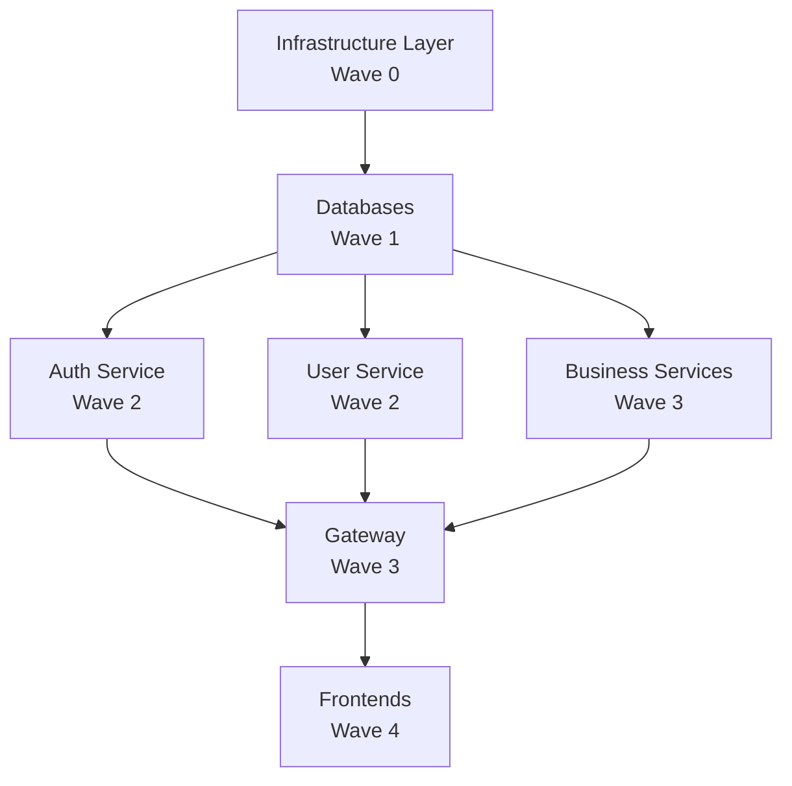

# GitOps Codebase Index

**Repository**: `/gitops` (Main GitOps Configuration Repository)  
**Purpose**: Kubernetes manifest management for microservices platform  
**Pattern**: Kustomize + ArgoCD GitOps  
**Last Indexed**: February 4, 2026  
**Status**: 🔄 Active Development

---

## 📊 Repository Statistics

| Metric | Count |
|--------|-------|
| **Total Services** | 23 (21 Go services + 2 Node.js apps) |
| **YAML Manifests** | 374+ files |
| **Environments** | 2 (dev, production) |
| **Infrastructure Components** | 12+ (databases, monitoring, ingress, etc.) |
| **ArgoCD Applications** | 46+ (23 per environment) |
| **Kustomize Overlays** | 46+ |
| **Lines of YAML** | ~25,000+ |

---

## 🗂️ Directory Structure

```
gitops/
├── bootstrap/                          # ArgoCD Bootstrap Applications
│   └── root-app-dev.yaml              # Dev environment root app
│
├── environments/                       # Environment-Specific Configurations
│   ├── dev/                           # Development Environment
│   │   ├── apps/                      # Application manifests (23 files)
│   │   │   ├── *-app.yaml            # ArgoCD Application per service
│   │   ├── projects/                  # ArgoCD Projects
│   │   │   └── dev-project.yaml      # Dev project RBAC
│   │   ├── resources/                 # Dev-specific resources
│   │   └── kustomization.yaml        # Dev environment kustomization
│   │
│   └── production/                    # Production Environment
│       ├── apps/                      # Application manifests (23 files)
│       ├── projects/                  # ArgoCD Projects
│       │   └── production-project.yaml
│       ├── resources/                 # Production-specific resources
│       └── kustomization.yaml        # Production kustomization
│
├── apps/                              # Service Application Manifests
│   ├── {service}/                    # Per-service directory (23 services)
│   │   ├── base/                     # Base Kustomize manifests
│   │   │   ├── kustomization.yaml
│   │   │   ├── deployment.yaml
│   │   │   ├── service.yaml
│   │   │   ├── configmap.yaml
│   │   │   ├── migration-job.yaml    # (if applicable)
│   │   │   ├── worker-deployment.yaml # (if applicable)
│   │   │   ├── servicemonitor.yaml   # (if applicable)
│   │   │   ├── pdb.yaml              # (if applicable)
│   │   │   └── serviceaccount.yaml   # (if applicable)
│   │   │
│   │   └── overlays/                 # Environment-specific overlays
│   │       ├── dev/
│   │       │   ├── kustomization.yaml
│   │       │   └── configmap.yaml    # (if needed)
│   │       └── production/           # ⚠️ Missing for most services
│   │           └── kustomization.yaml
│
├── infrastructure/                    # Infrastructure Components
│   ├── databases/                    # Database configurations
│   ├── monitoring/                   # Prometheus, Grafana, Jaeger
│   ├── ingress/                      # NGINX Ingress controller
│   ├── service-discovery/            # Consul, Dapr components
│   ├── storage/                      # PV, PVC, StorageClass
│   ├── security/                     # Network policies, RBAC
│   ├── secrets/                      # Secret management
│   ├── operators/                    # Kubernetes operators
│   ├── namespaces.yaml              # Namespace definitions
│   ├── namespaces-with-env.yaml     # Environment-aware namespaces
│   ├── serviceaccounts.yaml         # Service accounts
│   ├── network-policies.yaml        # Network policies
│   ├── environment-configmaps.yaml  # Environment configs
│   └── kustomization.yaml           # Infrastructure kustomization
│
├── clusters/                         # Cluster-Specific Configurations
│   ├── dev/                         # Dev cluster (k3d)
│   └── production/                  # Production cluster
│
├── docs/                            # Documentation
│   └── (various guides)
│
├── scripts/                         # Utility Scripts
│
├── README.md                        # Main documentation
├── PRODUCTION_READINESS_CHECKLIST.md
├── DEPLOYMENT_READINESS_CHECK.md
├── DEPLOYMENT_SEQUENCE.md
├── INFRASTRUCTURE_DEPLOYMENT_SEQUENCE.md
└── VAULT_SETUP_GUIDE.md
```

---

## 🎯 Service Inventory

### Core Services (5)
| Service | Type | Database | Workers | Status |
|---------|------|----------|---------|--------|
| **auth** | Go/Kratos | PostgreSQL | No | ✅ Deployed |
| **user** | Go/Kratos | PostgreSQL | No | ✅ Deployed |
| **customer** | Go/Kratos | PostgreSQL | Yes | ✅ Deployed |
| **gateway** | Go/Kratos | No | No | ✅ Deployed |
| **common-operations** | Go/Kratos | PostgreSQL | Yes | ✅ Deployed |

### Product & Catalog (4)
| Service | Type | Database | Workers | Status |
|---------|------|----------|---------|--------|
| **catalog** | Go/Kratos | PostgreSQL | Yes | ✅ Deployed |
| **search** | Go/Kratos | Elasticsearch | Yes | ✅ Deployed |
| **pricing** | Go/Kratos | PostgreSQL | Yes | ✅ Deployed |
| **promotion** | Go/Kratos | PostgreSQL | No | ✅ Deployed |

### Order & Fulfillment (5)
| Service | Type | Database | Workers | Status |
|---------|------|----------|---------|--------|
| **order** | Go/Kratos | PostgreSQL | Yes | ✅ Deployed |
| **payment** | Go/Kratos | PostgreSQL | Yes | ✅ Deployed |
| **shipping** | Go/Kratos | PostgreSQL | Yes | ✅ Deployed |
| **warehouse** | Go/Kratos | PostgreSQL | Yes | ✅ Deployed |
| **fulfillment** | Go/Kratos | PostgreSQL | Yes | ✅ Deployed |

### Support Services (5)
| Service | Type | Database | Workers | Status |
|---------|------|----------|---------|--------|
| **notification** | Go/Kratos | PostgreSQL | Yes | ✅ Deployed |
| **analytics** | Go/Kratos | PostgreSQL | No | ✅ Deployed |
| **location** | Go/Kratos | PostgreSQL | No | ✅ Deployed |
| **review** | Go/Kratos | PostgreSQL | No | ✅ Deployed |
| **loyalty-rewards** | Go/Kratos | PostgreSQL | No | ✅ Deployed |

### Business Logic (2)
| Service | Type | Database | Workers | Status |
|---------|------|----------|---------|--------|
| **checkout** | Go/Kratos | PostgreSQL | No | ✅ Deployed |
| **return** | Go/Kratos | PostgreSQL | No | ✅ Deployed |

### Frontend Applications (2)
| Service | Type | Framework | Status |
|---------|------|-----------|--------|
| **admin** | Node.js | React + Vite | ✅ Deployed |
| **frontend** | Node.js | Next.js | ✅ Deployed |

**Total Services**: 23 (21 Go microservices + 2 Node.js apps)

---

## 🏗️ Infrastructure Components

### Databases
- **PostgreSQL**: Primary database for all services
  - Location: `infrastructure/databases/`
  - Deployment: StatefulSet
  - Persistence: PVC
  - Status: ✅ Deployed

### Caching & State
- **Redis**: Cache and Dapr state store
  - Location: `infrastructure/storage/redis.yaml`
  - Components: Cache, PubSub, StateStore
  - Status: ✅ Deployed

### Service Discovery
- **Consul**: Service registry and configuration
  - Location: `infrastructure/service-discovery/consul-current.yaml`
  - Status: ✅ Deployed
  - Note: ⚠️ Needs HA configuration

### Message Bus
- **Dapr PubSub**: Redis-based pub/sub
  - Location: `infrastructure/service-discovery/pubsub-redis.yaml`
  - Status: ✅ Deployed

### Search Engine
- **Elasticsearch**: Product search indexing
  - Location: `infrastructure/monitoring/elasticsearch-current.yaml`
  - Status: ✅ Deployed
  - Used by: search service

### Monitoring & Observability
- **Prometheus**: Metrics collection
  - Location: `infrastructure/monitoring/prometheus.yaml`
  - Status: ✅ Deployed
  - Scrape targets: All services with ServiceMonitor

- **Grafana**: Metrics visualization
  - Location: `infrastructure/monitoring/grafana.yaml`
  - Status: ✅ Deployed

- **Jaeger**: Distributed tracing
  - Location: `infrastructure/monitoring/jaeger.yaml`
  - Status: ✅ Deployed

### Ingress
- **NGINX Ingress Controller**
  - Location: `infrastructure/ingress/nginx-ingress.yaml`
  - Status: ✅ Deployed
  - Note: ⚠️ TLS configuration pending

### Security
- **Network Policies**: Basic pod network isolation
  - Location: `infrastructure/network-policies.yaml`
  - Status: ⚠️ Partial (needs completion)

---

## 🔑 Key Configuration Patterns

### Deployment Pattern (Go Services)
```yaml
apiVersion: apps/v1
kind: Deployment
metadata:
  name: {service}
  labels:
    app.kubernetes.io/name: {service}
    app.kubernetes.io/component: backend
    app.kubernetes.io/managed-by: kustomize
  annotations:
    argocd.argoproj.io/sync-wave: "2"
spec:
  replicas: 1  # Dev only
  revisionHistoryLimit: 1
  template:
    metadata:
      annotations:
        dapr.io/enabled: "true"
        dapr.io/app-id: "{service}"
        dapr.io/app-port: "{http_port}"
        dapr.io/app-protocol: "http"
    spec:
      imagePullSecrets:
      - name: registry-api-tanhdev
      securityContext:
        runAsNonRoot: true
        runAsUser: 65532
        fsGroup: 65532
      containers:
      - name: {service}
        image: registry-api.tanhdev.com/{service}:latest
        ports:
        - name: http-svc
          containerPort: 8000  # Varies by service
        - name: grpc-svc
          containerPort: 9000  # Varies by service
        resources:
          requests:
            memory: "128Mi"
            cpu: "100m"
          limits:
            memory: "512Mi"
            cpu: "500m"
        livenessProbe:
          httpGet:
            path: /health
            port: 8000
        readinessProbe:
          httpGet:
            path: /health
            port: 8000
```

### ArgoCD Application Pattern
```yaml
apiVersion: argoproj.io/v1alpha1
kind: Application
metadata:
  name: {service}-{environment}
  namespace: argocd
  labels:
    app.kubernetes.io/name: {service}
    app.kubernetes.io/environment: {environment}
    app.kubernetes.io/component: application
spec:
  project: {environment}  # 'default' for dev environment
  source:
    repoURL: https://gitlab.com/ta-microservices/gitops.git
    targetRevision: main
    path: apps/{service}/overlays/{environment}
  destination:
    server: https://kubernetes.default.svc
    namespace: {service}-{environment}
  syncPolicy:
    automated:
      prune: true
      selfHeal: true
    syncOptions:
    - CreateNamespace=true
    retry:
      limit: 5
      backoff:
        duration: 5s
        factor: 2
        maxDuration: 3m
```

### Kustomize Overlay Pattern (Dev)
```yaml
apiVersion: kustomize.config.k8s.io/v1beta1
kind: Kustomization

resources:
- ../../base

namespace: {service}-dev

commonLabels:
  app.kubernetes.io/environment: dev

images:
- name: registry-api.tanhdev.com/{service}
  newTag: {git-sha}  # e.g., 7274a1b0

# Optional: environment-specific patches
patchesStrategicMerge:
- configmap.yaml  # Dev-specific config
```

---

## 🔐 Security Standards

### Pod Security Context (Enforced)
```yaml
securityContext:
  runAsNonRoot: true    # ✅ All services
  runAsUser: 65532      # ✅ All services (nobody user)
  fsGroup: 65532        # ✅ Most services
```

### Container Security Context (Partial)
```yaml
securityContext:
  runAsNonRoot: true                  # ✅ All services
  runAsUser: 65532                    # ✅ All services
  allowPrivilegeEscalation: false     # ⚠️ Only admin service
  readOnlyRootFilesystem: true        # ⚠️ Only admin service
```

### Network Policies (Basic)
- Location: `infrastructure/network-policies.yaml`
- Status: ⚠️ Basic rules defined, needs per-namespace policies

### Secrets Management
- Current: ⚠️ Secrets in Git (NOT production-ready)
- Required: 🔴 External Secrets Operator + Vault

---

## 📦 Resource Standards

### Standard Resource Allocation
```yaml
resources:
  requests:
    memory: "128Mi"
    cpu: "100m"
  limits:
    memory: "512Mi"
    cpu: "500m"
```

### Replica Configuration
- **Dev**: 1 replica (all services)
- **Production**: ⚠️ Not yet defined (should be 2-3 minimum)

### Health Checks
- **Liveness Probe**: ✅ Present in most services
- **Readiness Probe**: ✅ Present in most services
- **Startup Probe**: ⚠️ Not configured (needed for slow-starting services)

---

## 🚀 Deployment Dependencies

### Service Start Order (Sync Waves)
Current sync wave assignments (inconsistent):
- **Wave 0**: Infrastructure (namespaces, secrets)
- **Wave 1**: location ✅
- **Wave 2**: auth, core services
- **Wave 3**: gateway
- **Wave 10**: admin

**Note**: ⚠️ Sync waves need standardization (see checklist)

### Service Dependencies


---

## 🔄 CI/CD Integration

### Image Registry
- **Registry**: `registry-api.tanhdev.com`
- **Pull Secret**: `registry-api-tanhdev` (per namespace)
- **Tag Strategy**: 
  - ✅ Git SHA (8 chars): auth, catalog, gateway, etc.
  - ⚠️ Semantic version: analytics, warehouse, frontend, etc. (needs fix)

### Image Tag Update Flow
1. CI/CD builds image with git SHA tag
2. CI/CD pushes to registry
3. 🔴 **Manual update** of kustomization.yaml (needs automation)
4. Git commit triggers ArgoCD sync
5. ArgoCD deploys new version

**Issue**: No automated image tag updates (needs ArgoCD Image Updater)

---

## ⚠️ Known Issues & Gaps

### Critical Issues (P0)
1. ~~**ArgoCD Project Inconsistency**~~ ✅ RESOLVED
   - ~~auth-app.yaml: uses `default` instead of `dev`~~
   - ~~common-operations-app.yaml: uses `default` instead of `dev`~~
   - **Status**: All dev apps now standardized to use `project: default`

2. **Missing Production Overlays**
   - 0/23 services have production overlays
   - Blocks production deployment

3. **Image Tag Inconsistency**
   - 12/23 services use semantic versioning instead of git SHA
   - Reduces traceability

4. **Secrets in Git**
   - No External Secrets Operator
   - Secrets stored in manifests (security risk)

5. **Duplicate Field**
   - admin/base/deployment.yaml has duplicate `revisionHistoryLimit`

### High Priority Issues (P1)
1. **Missing ServiceMonitors**
   - Not all services have Prometheus monitoring

2. **Incomplete PodDisruptionBudgets**
   - Only some services have PDB (needed for HA)

3. **No TLS Configuration**
   - Ingress lacks cert-manager integration

4. **Sync Wave Inconsistency**
   - No standardized deployment ordering

### Medium Priority Issues (P2)
1. **No CI Validation Pipeline**
   - No automated manifest validation

2. **Missing Startup Probes**
   - Slow-starting services need startup probes

3. **No HPA Configuration**
   - High-traffic services need autoscaling

---

## 📊 Compliance Status

| Area | Status | Percentage |
|------|--------|------------|
| **ArgoCD Standards** | ✅ Standardized | 100% |
| **Kustomize Structure** | ✅ Good | 85% |
| **Image Management** | 🔴 Inconsistent | 30% |
| **Security** | ⚠️ Partial | 45% |
| **Resource Management** | ⚠️ Needs Work | 75% |
| **Health Checks** | ✅ Good | 80% |
| **Observability** | ✅ Good | 70% |
| **Infrastructure** | ⚠️ Basic | 60% |
| **CI/CD Integration** | ⚠️ Partial | 40% |
| **Production Readiness** | 🔴 Not Ready | 5% |

**Overall Compliance**: ⚠️ **65%** - Good progress, production prep needed

---

## 🎯 Recommended Actions

### Immediate (This Week)
1. ~~Fix ArgoCD project assignments (auth, common-operations)~~ ✅ COMPLETE
2. Standardize image tag format across all services
3. Remove duplicate field from admin deployment
4. Add CI validation pipeline

### Short Term (2 Weeks)
1. Create production overlays for all services
2. Deploy External Secrets Operator
3. Add missing ServiceMonitors
4. Standardize sync wave strategy

### Medium Term (1 Month)
1. Implement automated image tag updates
2. Configure TLS with cert-manager
3. Complete network policies
4. Add PodDisruptionBudgets to all services

### Long Term (2 Months)
1. Implement disaster recovery procedures
2. Complete production RBAC configuration
3. Set up cluster autoscaling
4. Implement GitOps promotion workflow (dev → staging → prod)

---

## 📚 Related Documents

- [GitOps README](../../gitops/README.md)
- [Production Readiness Checklist](../../gitops/PRODUCTION_READINESS_CHECKLIST.md)
- [Deployment Sequence](../../gitops/DEPLOYMENT_SEQUENCE.md)
- [Infrastructure Deployment Sequence](../../gitops/INFRASTRUCTURE_DEPLOYMENT_SEQUENCE.md)
- [Vault Setup Guide](../../gitops/VAULT_SETUP_GUIDE.md)
- [GitOps & ArgoCD Standardization Checklist](./gitops-argocd-standardization-checklist.md)

---

## 📞 Ownership & Maintenance

**Maintainers**: DevOps Team  
**Last Updated**: February 4, 2026  
**Next Review**: Weekly until production ready  
**Repository**: [GitLab - ta-microservices/gitops](https://gitlab.com/ta-microservices/gitops)

---

**Status Legend**:
- ✅ Complete / Compliant
- ⚠️ Partial / Needs Improvement
- 🔴 Critical Issue / Not Ready
- 📦 In Progress
