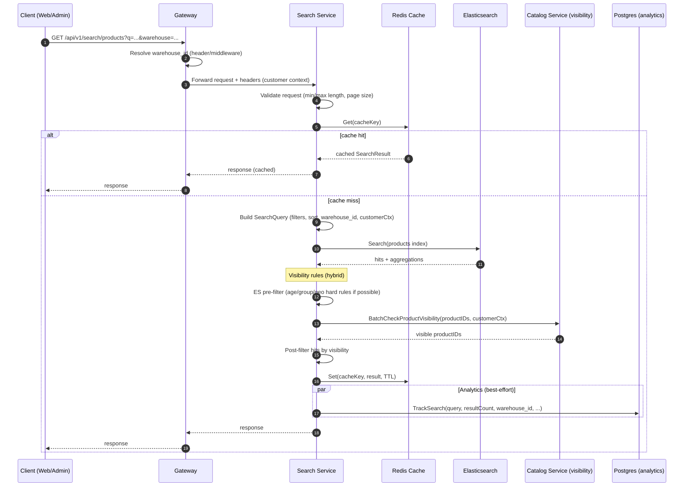
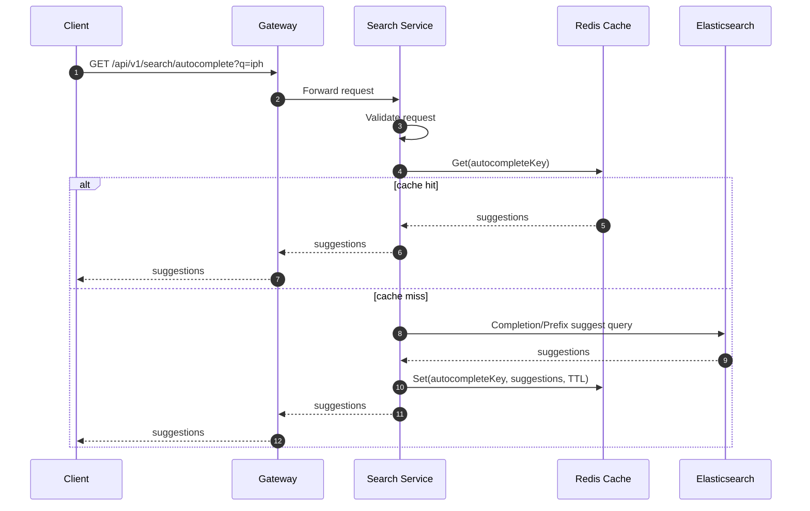
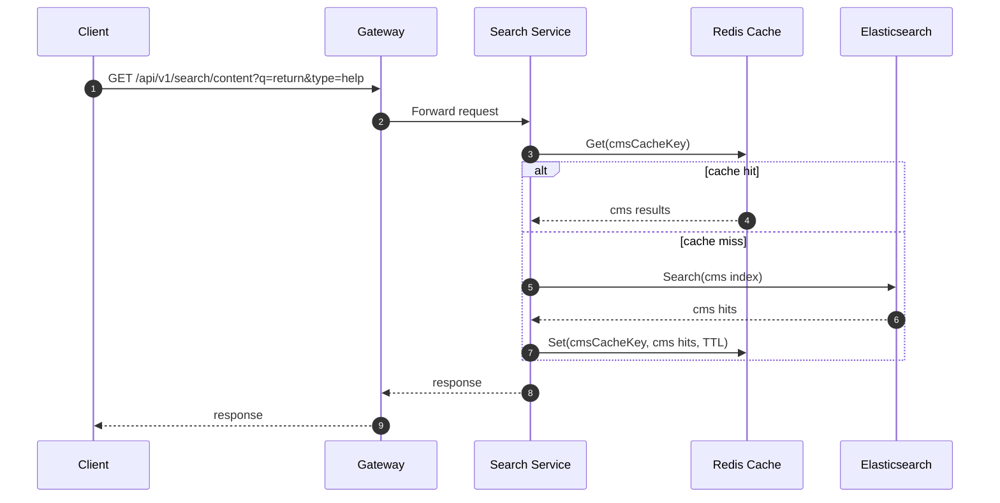
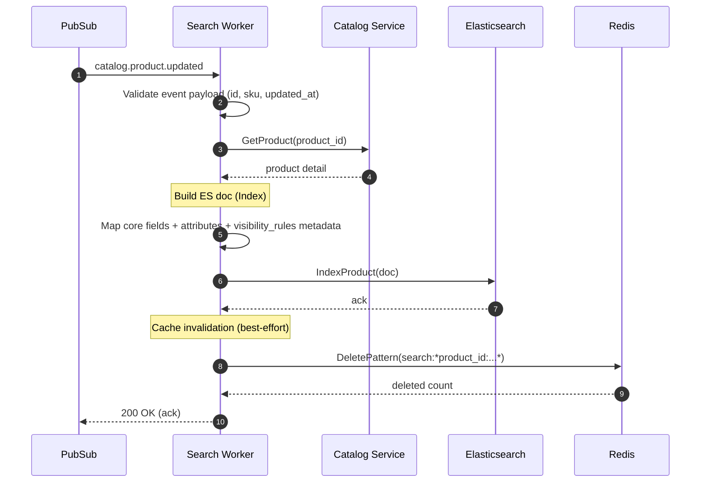
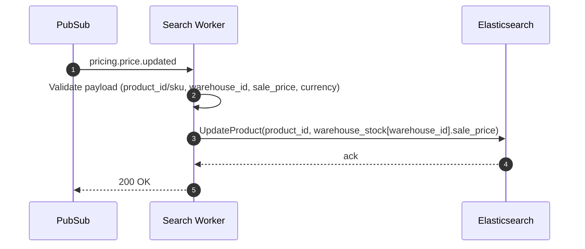
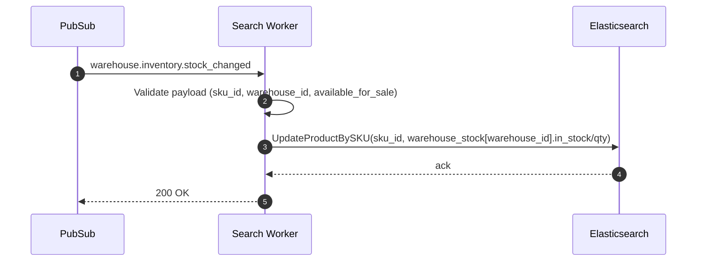
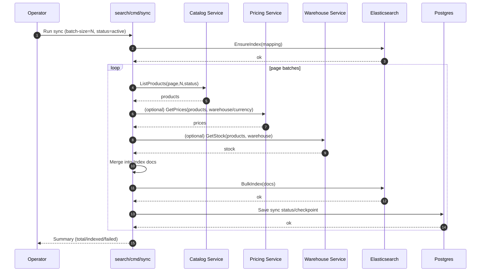
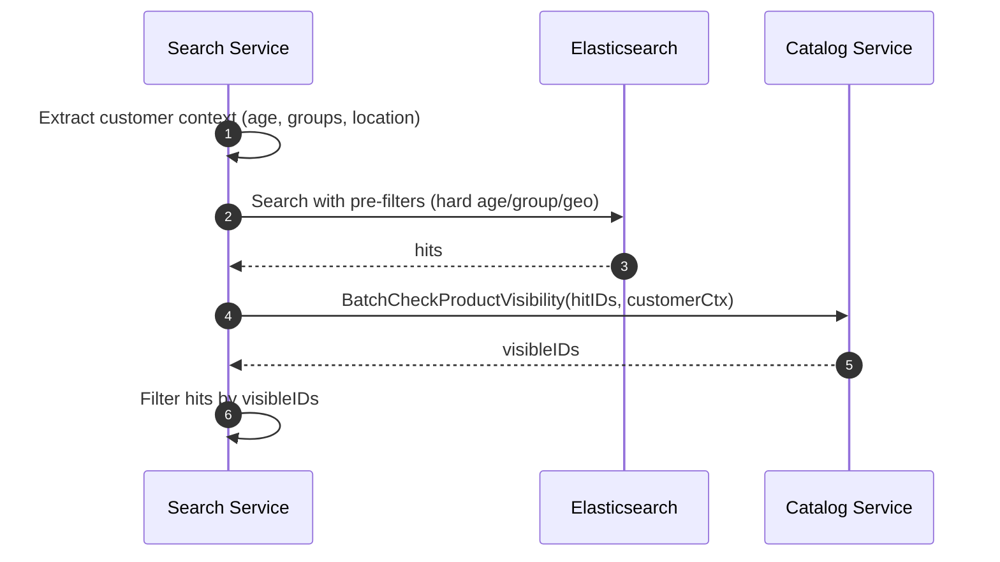

# 🔍 Search Service - Product Discovery Flow (Search + Catalog Integration)

**Last Updated**: 2026-01-18  
**Owner**: Platform Engineering  
**Scope**: Search Service (Elasticsearch read model) + Catalog visibility filtering + Pricing/Warehouse enrichment via events

---

## 1) Goal & Boundary

### What Search Service is responsible for
- Serve **product discovery APIs** (search/list/autocomplete/content search)
- Query Elasticsearch indices (products, cms content)
- Apply **warehouse-aware** filtering/sorting using indexed per-warehouse views
- Apply **visibility rules** (hybrid: ES pre-filter + Catalog post-filter)
- Emit/search analytics events (query/click/conversion tracking)

### What Search Service is NOT responsible for
- Source-of-truth product data (Catalog owns)
- Source-of-truth price rules (Pricing owns)
- Source-of-truth stock/reservation (Warehouse owns)

---

## 2) Request-Time Flow: Search Products

### 2.1 Sequence Diagram (happy path)



### 2.2 Data shaping rules (what Search returns)
- Source fields come from **indexed document** (product read model)
- Warehouse-aware fields are read from `warehouse_stock[]` (ex: `in_stock`, `sale_price`, `quantity`)
- Visibility filtering happens **after** ES returns hits (post-filter), so:
  - Total hits may be adjusted after visibility
  - Pagination must be careful to avoid “empty page after filtering” (see risks section)

---

## 3) Request-Time Flow: Autocomplete



---

## 4) Request-Time Flow: CMS Content Search



---

## 5) Real-Time Indexing Flow (Event-Driven)

### 5.1 High-level event topology

```mermaid
flowchart LR
  CATALOG[Catalog Service] -- catalog.product.created/updated/deleted --> PUB[(Dapr PubSub)]
  PRICING[Pricing Service] -- pricing.price.updated/deleted --> PUB
  WAREHOUSE[Warehouse Service] -- warehouse.inventory.stock_changed --> PUB
  CMS[Catalog CMS] -- catalog.cms.page.* --> PUB

  PUB --> SW[Search Worker (event consumers)]
  SW --> ES[(Elasticsearch)]
  SW --> PG[(Postgres analytics/metadata)]

  SVC[Search API Service] --> ES
  SVC --> R[(Redis cache)]
  SVC --> CATV[Catalog visibility client]
```

### 5.2 Product Created/Updated event handling (happy path)



### 5.3 Price Updated event handling



### 5.4 Stock Changed event handling



---

## 6) Initial Backfill Flow (cmd/sync)

Use this when Elasticsearch is empty, mapping changed, or after major drift.



---

## 7) Visibility Filtering (Hybrid Model)

### 7.1 Strategy
- **Pre-filter in ES** (fast): only simple hard rules that can be represented as filters
- **Post-filter via Catalog** (correct): evaluate full rule engine with customer context

### 7.2 Flow



### 7.3 Fail-open vs fail-closed (policy)
- Default for commerce: **fail-open** (availability) for Catalog visibility check failures
- For compliance categories (age restricted): consider **fail-safe** behavior

---

## 8) Observability & SLO checkpoints

### Key metrics
- Search latency: p50/p95/p99
- Elasticsearch `took` vs total duration
- Cache hit rate (search + autocomplete)
- Event processing lag (consumer)
- Event failures by type + DLQ count

### Recommended SLOs
- p95 search latency < 200ms
- Event processing lag < 5s
- Cache hit rate > 90% for popular queries

---

## 9) Failure Modes (what to expect)

### 9.1 Elasticsearch slow or degraded
- Search API latency increases
- Autocomplete may fall back or timeout

### 9.2 Catalog visibility unavailable
- If fail-open: results may include restricted products (risk)
- If fail-safe: results may be overly strict (lower discovery)

### 9.3 Event consumer blocked
- Index drift grows (stale price/stock)
- Symptoms: search results inconsistent with product detail

---

## 10) Related Docs
- Search sellable view & warehouse strategy: [search-sellable-view-per-warehouse-complete.md](search-sellable-view-per-warehouse-complete.md)
- Visibility filtering design: [search-product-visibility-filtering.md](search-product-visibility-filtering.md)
- Issues checklist: [search-catalog-product-discovery-flow-issues.md](../checklists/search-catalog-product-discovery-flow-issues.md)
