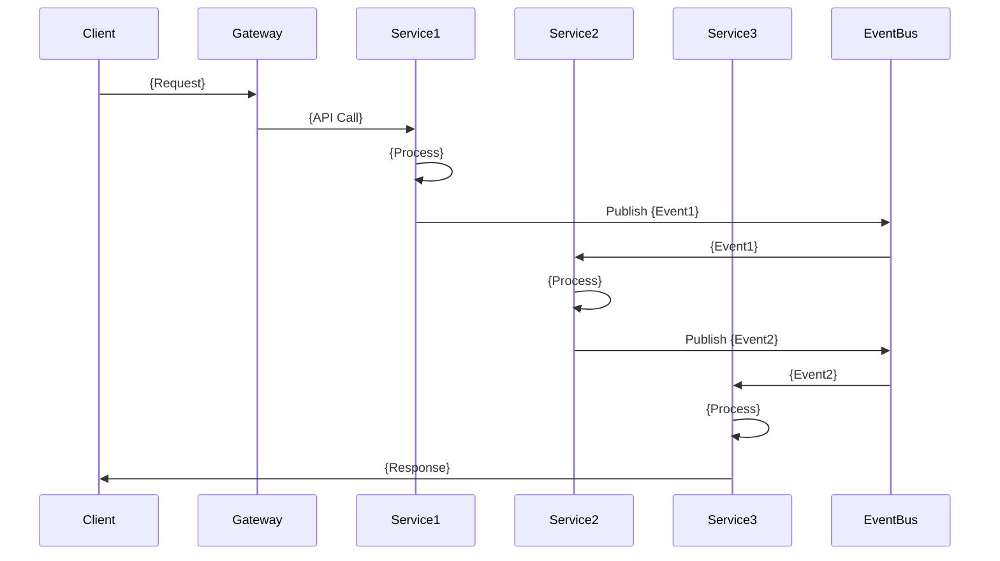
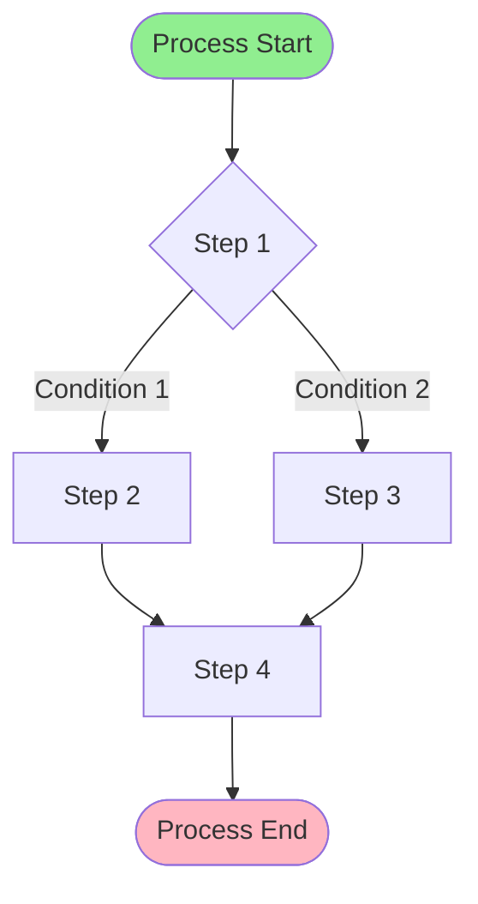
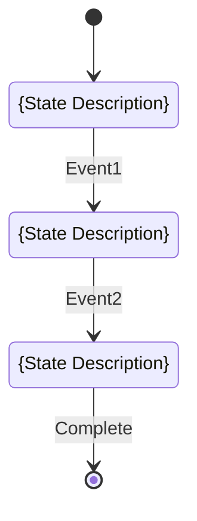
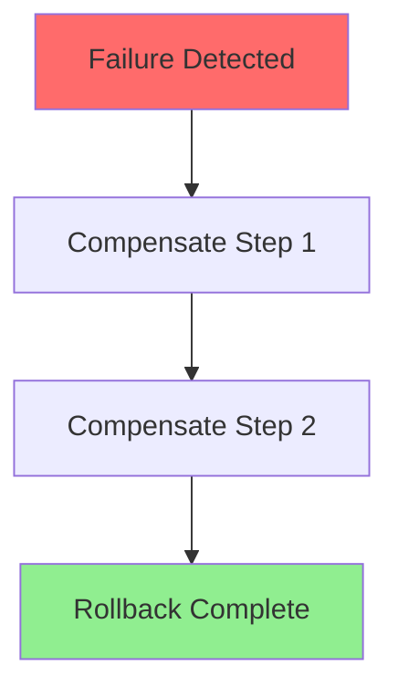

# {Process Name} Process

**Domain:** {Domain Name} (DDD)  
**Process ID:** `{process-id}`  
**Version:** `v{version}`  
**Last Updated:** {YYYY-MM-DD}  
**Status:** {Draft | Active | Deprecated}

## Overview

### Business Context

{Brief description of the business process and its purpose}

### Success Criteria

- {Criterion 1}
- {Criterion 2}
- {Criterion 3}

### Process Scope

**In Scope:**
- {What is included}

**Out of Scope:**
- {What is excluded}

## Services Involved

| Service | Responsibility | Endpoints |
|---------|---------------|-----------|
| {Service Name} | {Responsibility} | `{HTTP Method} {Endpoint}` |
| {Service Name} | {Responsibility} | `{HTTP Method} {Endpoint}` |

### Service Details

#### {Service Name}
- **Port:** {HTTP Port} (HTTP), {gRPC Port} (gRPC)
- **Documentation:** [Service Docs](../services/{service-name}.md)
- **API Spec:** [OpenAPI](../openapi/{service-name}.openapi.yaml)

## Event Flow

### Event Sequence

| Step | Event Type | Topic | Publisher | Subscribers | Payload Schema |
|------|------------|-------|-----------|--------------|----------------|
| 1 | `{service}.{domain}.{action}` | `{topic}` | {Service} | {Service1}, {Service2} | [{schema}](../json-schema/{event-type}.schema.json) |
| 2 | `{service}.{domain}.{action}` | `{topic}` | {Service} | {Service1} | [{schema}](../json-schema/{event-type}.schema.json) |

### Event Details

#### Event 1: `{service}.{domain}.{action}`

**Published By:** {Service Name}  
**Topic:** `{topic}`  
**Schema:** [`{event-type}.schema.json`](../json-schema/{event-type}.schema.json)

**Payload:**
```json
{
  "specversion": "1.0",
  "type": "{service}.{domain}.{action}",
  "source": "https://api.company.com/services/{service-name}",
  "id": "{event-id}",
  "time": "{timestamp}",
  "datacontenttype": "application/json",
  "data": {
    "{field}": "{value}"
  }
}
```

**Subscribers:**
- {Service Name} - {What it does with the event}

## Flow Charts

### Sequence Diagram



### Business Flow Diagram



### State Machine (if applicable)



## Detailed Flow

### Step 1: {Step Name}

**Trigger:** {What triggers this step}

**Actions:**
1. {Action 1}
2. {Action 2}

**Services:**
- {Service Name}: {What it does}

**Events:**
- Publishes: `{event-type}` (if applicable)
- Subscribes: `{event-type}` (if applicable)

**API Calls:**
```bash
# Example API call
curl -X POST http://localhost:{port}/api/v1/{endpoint} \
  -H "Content-Type: application/json" \
  -d '{request-body}'
```

### Step 2: {Step Name}

{Similar structure}

## Error Handling

### Failure Scenarios

| Scenario | Detection | Compensation | Retry Strategy |
|----------|-----------|--------------|----------------|
| {Failure 1} | {How detected} | {Compensation action} | {Retry strategy} |
| {Failure 2} | {How detected} | {Compensation action} | {Retry strategy} |

### Compensation Flow



### Retry Logic

- **Max Retries:** {number}
- **Retry Interval:** {duration}
- **Backoff Strategy:** {exponential|linear|fixed}
- **Dead Letter Queue:** {topic} (if applicable)

## Performance Considerations

- **Expected Duration:** {duration}
- **Bottlenecks:** {potential bottlenecks}
- **Optimization:** {optimization strategies}

## Monitoring & Observability

### Key Metrics

| Metric | Threshold | Alert |
|--------|-----------|-------|
| {Metric Name} | {threshold} | {alert condition} |

### Logging

- **Correlation ID:** Tracked across all services
- **Trace ID:** Distributed tracing (Jaeger)
- **Key Events:** Logged at each step

## Testing

### Test Scenarios

1. **Happy Path**
   - {Description}
   - Expected outcome: {outcome}

2. **Error Scenarios**
   - {Scenario 1}
   - {Scenario 2}

3. **Edge Cases**
   - {Edge case 1}
   - {Edge case 2}

## Related Documentation

- [Event Contracts](../json-schema/) - Event schemas
- [Service Documentation](../services/) - Service details
- [OpenAPI Specs](../openapi/) - API contracts
- [ADR](../adr/) - Architecture decisions

## Version History

| Version | Date | Changes | Author |
|---------|------|---------|--------|
| v1.0.0 | {YYYY-MM-DD} | Initial version | {Author} |

