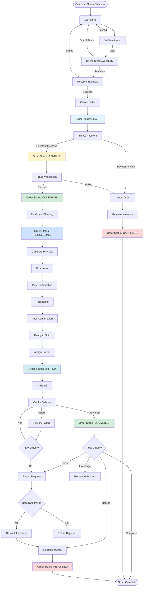
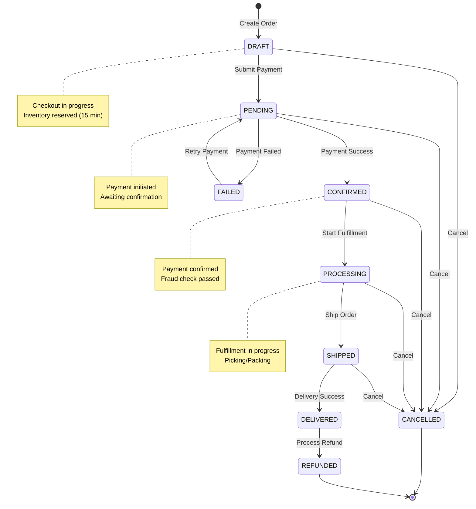
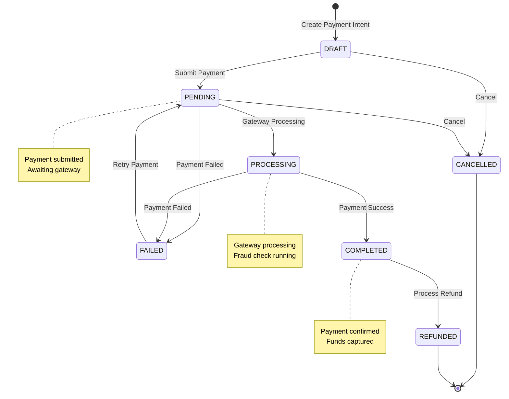
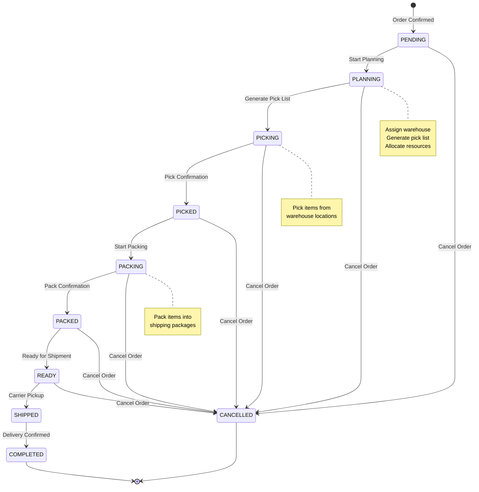
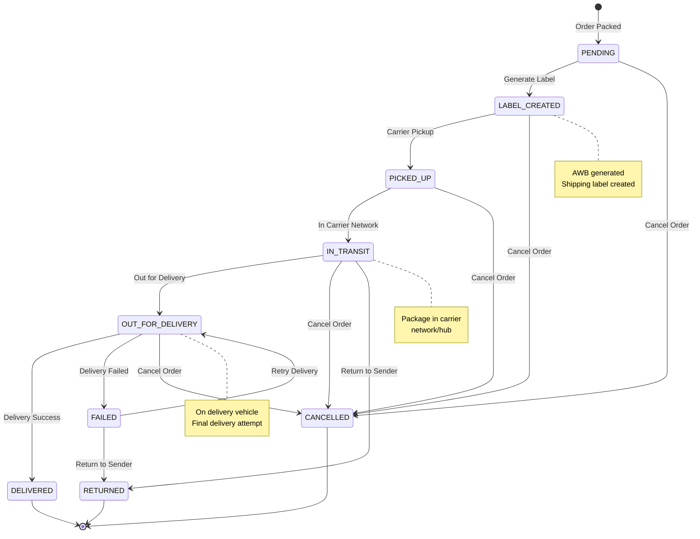
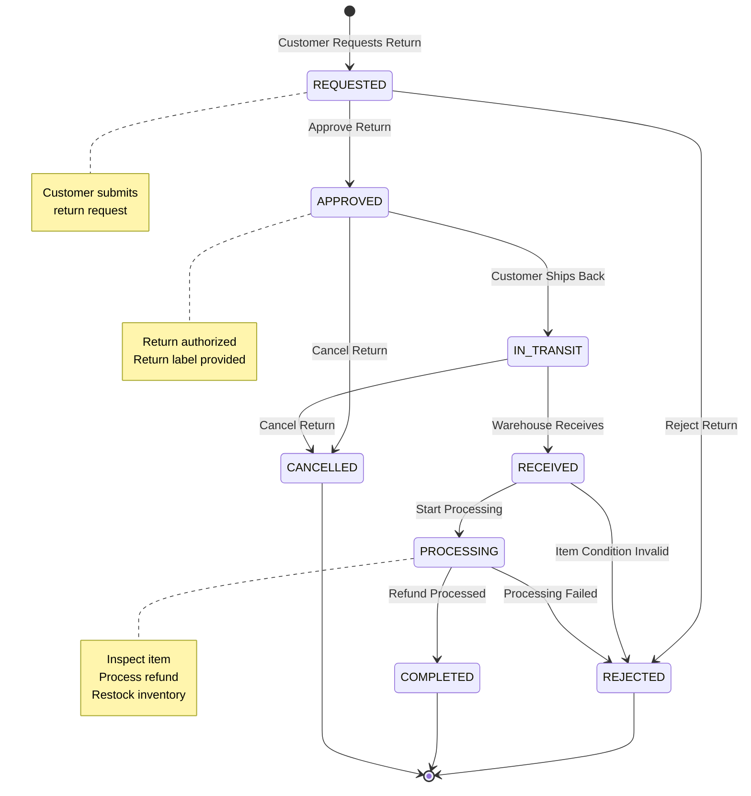
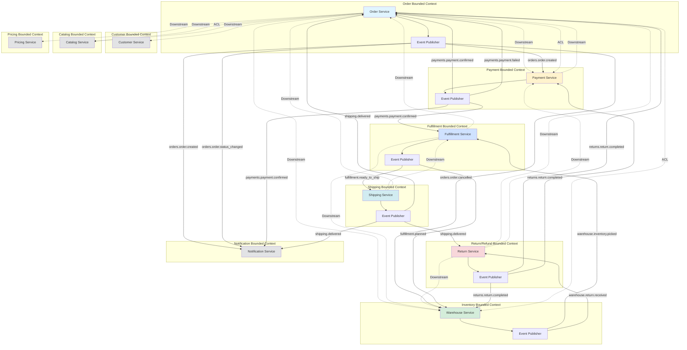

# 📦 Order Business - Complete Guide

> **Comprehensive business guide for Order Management System**  
> **Scale:** 10K orders/day | Multi-warehouse | Event-driven  
> **Status:** Production Ready ✅

---

## 📋 Table of Contents

1. [Global Order Workflow](#section-1--global-order-workflow)
2. [Domain Status Definitions](#section-2--domain-status-enums)
3. [State Machines](#section-3--state-machines)
4. [Event-Driven Checklist](#section-4--event-driven-checklist)
5. [API Design Guidelines](#section-5--api-design-guidelines)
6. [Implementation Checklist](#section-6--implementation-checklist)
7. [DDD Context Map](#section-7--ddd-context-map)

---

## SECTION 1 — GLOBAL ORDER WORKFLOW

### End-to-End Order Lifecycle



### Workflow Stages

**1. Order Creation (Cart → Order)**
- Validate cart items
- Check stock availability
- Reserve inventory (15 min expiry)
- Create order with DRAFT status
- Calculate totals (pricing service)

**2. Payment Processing**
- Initiate payment intent
- Process payment (payment service)
- Update order to PENDING on success
- Cancel order on failure

**3. Fraud Verification**
- Run fraud checks (if enabled)
- Verify customer identity
- Validate payment method
- Update to CONFIRMED on pass

**4. Fulfillment Planning**
- Assign warehouse
- Generate pick list
- Allocate resources
- Update to PROCESSING

**5. Warehouse Operations**
- **Picking**: Pick items from warehouse
- **Pick Confirmation**: Verify picked items
- **Packing**: Pack items into packages
- **Pack Confirmation**: Verify packed items
- **Ready to Ship**: Prepare for carrier pickup

**6. Shipping**
- Assign carrier
- Generate AWB (Air Waybill)
- Handover to carrier
- Update to SHIPPED

**7. Delivery Tracking**
- **In Transit**: Shipment in carrier network
- **Out for Delivery**: On delivery vehicle
- **Delivered**: Successfully delivered
- **Delivery Failed**: Delivery attempt failed

**8. Post-Delivery**
- **Return**: Customer requests return
- **Refund**: Process refund
- **Exchange**: Process exchange
- **Complete**: Order lifecycle complete

---

## SECTION 2 — DOMAIN STATUS ENUMS

### A. OrderStatus

| Status | Description | Example Use Case | Allowed Transitions | Forbidden Transitions |
|--------|-------------|------------------|---------------------|----------------------|
| `DRAFT` | Checkout in progress, not yet submitted | Customer adding items to cart | `PENDING`, `CANCELLED` | `CONFIRMED`, `PROCESSING`, `SHIPPED`, `DELIVERED`, `REFUNDED`, `FAILED` |
| `PENDING` | Order created, awaiting payment | Order created after checkout | `CONFIRMED`, `CANCELLED`, `FAILED` | `DRAFT`, `PROCESSING`, `SHIPPED`, `DELIVERED`, `REFUNDED` |
| `CONFIRMED` | Payment confirmed, fraud check passed | Payment successful, verified | `PROCESSING`, `CANCELLED` | `DRAFT`, `PENDING`, `SHIPPED`, `DELIVERED`, `REFUNDED`, `FAILED` |
| `PROCESSING` | Order in fulfillment (picking/packing) | Warehouse processing order | `SHIPPED`, `CANCELLED` | `DRAFT`, `PENDING`, `CONFIRMED`, `DELIVERED`, `REFUNDED`, `FAILED` |
| `SHIPPED` | Order shipped, in transit | Carrier picked up package | `DELIVERED`, `CANCELLED` | `DRAFT`, `PENDING`, `CONFIRMED`, `PROCESSING`, `REFUNDED`, `FAILED` |
| `DELIVERED` | Order successfully delivered | Customer received package | `REFUNDED` | `DRAFT`, `PENDING`, `CONFIRMED`, `PROCESSING`, `SHIPPED`, `CANCELLED`, `FAILED` |
| `CANCELLED` | Order cancelled (any stage) | Customer cancelled, payment failed | None (terminal) | All other statuses |
| `REFUNDED` | Order refunded after delivery | Return processed, refund issued | None (terminal) | All other statuses |
| `FAILED` | Order failed (payment, verification) | Payment failed, fraud check failed | `PENDING` (retry) | `DRAFT`, `CONFIRMED`, `PROCESSING`, `SHIPPED`, `DELIVERED`, `CANCELLED`, `REFUNDED` |

**Status Transition Rules:**
- Only forward transitions allowed (except `FAILED` → `PENDING` retry)
- `CANCELLED` and `REFUNDED` are terminal states
- `DRAFT` can only transition to `PENDING` or `CANCELLED`
- `DELIVERED` can only transition to `REFUNDED`

### B. PaymentStatus

| Status | Description | Example Use Case | Allowed Transitions | Forbidden Transitions |
|--------|-------------|------------------|---------------------|----------------------|
| `DRAFT` | Payment intent created | Checkout initiated | `PENDING`, `CANCELLED` | `PROCESSING`, `COMPLETED`, `FAILED`, `REFUNDED` |
| `PENDING` | Payment submitted, awaiting processing | Payment gateway processing | `PROCESSING`, `CANCELLED`, `FAILED` | `DRAFT`, `COMPLETED`, `REFUNDED` |
| `PROCESSING` | Payment being processed | Gateway processing payment | `COMPLETED`, `FAILED` | `DRAFT`, `PENDING`, `CANCELLED`, `REFUNDED` |
| `COMPLETED` | Payment successfully completed | Payment confirmed | `REFUNDED` | `DRAFT`, `PENDING`, `PROCESSING`, `CANCELLED`, `FAILED` |
| `FAILED` | Payment failed | Insufficient funds, card declined | `PENDING` (retry) | `DRAFT`, `PROCESSING`, `COMPLETED`, `CANCELLED`, `REFUNDED` |
| `CANCELLED` | Payment cancelled | Customer cancelled payment | None (terminal) | All other statuses |
| `REFUNDED` | Payment refunded | Refund processed | None (terminal) | All other statuses |

### C. FulfillmentStatus

| Status | Description | Example Use Case | Allowed Transitions | Forbidden Transitions |
|--------|-------------|------------------|---------------------|----------------------|
| `PENDING` | Awaiting fulfillment | Order confirmed, not yet started | `PLANNING`, `CANCELLED` | `PICKING`, `PACKING`, `READY`, `SHIPPED`, `COMPLETED` |
| `PLANNING` | Fulfillment plan created | Pick list generated | `PICKING`, `CANCELLED` | `PENDING`, `PACKING`, `READY`, `SHIPPED`, `COMPLETED` |
| `PICKING` | Items being picked | Warehouse picking items | `PICKED`, `CANCELLED` | `PENDING`, `PLANNING`, `PACKING`, `READY`, `SHIPPED`, `COMPLETED` |
| `PICKED` | Items picked, awaiting packing | Pick confirmation done | `PACKING`, `CANCELLED` | `PENDING`, `PLANNING`, `PICKING`, `READY`, `SHIPPED`, `COMPLETED` |
| `PACKING` | Items being packed | Packing in progress | `PACKED`, `CANCELLED` | `PENDING`, `PLANNING`, `PICKING`, `PICKED`, `READY`, `SHIPPED`, `COMPLETED` |
| `PACKED` | Items packed, ready to ship | Pack confirmation done | `READY`, `CANCELLED` | `PENDING`, `PLANNING`, `PICKING`, `PICKED`, `PACKING`, `SHIPPED`, `COMPLETED` |
| `READY` | Ready for carrier pickup | Package ready for shipping | `SHIPPED`, `CANCELLED` | `PENDING`, `PLANNING`, `PICKING`, `PICKED`, `PACKING`, `PACKED`, `COMPLETED` |
| `SHIPPED` | Handed over to carrier | Carrier picked up | `COMPLETED` | All other statuses |
| `COMPLETED` | Fulfillment complete | Delivery confirmed | None (terminal) | All other statuses |
| `CANCELLED` | Fulfillment cancelled | Order cancelled | None (terminal) | All other statuses |

### D. ShippingStatus

| Status | Description | Example Use Case | Allowed Transitions | Forbidden Transitions |
|--------|-------------|------------------|---------------------|----------------------|
| `PENDING` | Awaiting shipping | Order packed, not yet shipped | `LABEL_CREATED`, `CANCELLED` | `IN_TRANSIT`, `OUT_FOR_DELIVERY`, `DELIVERED`, `FAILED`, `RETURNED` |
| `LABEL_CREATED` | Shipping label created | AWB generated | `PICKED_UP`, `CANCELLED` | `PENDING`, `IN_TRANSIT`, `OUT_FOR_DELIVERY`, `DELIVERED`, `FAILED`, `RETURNED` |
| `PICKED_UP` | Carrier picked up package | Package collected by carrier | `IN_TRANSIT`, `CANCELLED` | `PENDING`, `LABEL_CREATED`, `OUT_FOR_DELIVERY`, `DELIVERED`, `FAILED`, `RETURNED` |
| `IN_TRANSIT` | Package in carrier network | Shipment moving through network | `OUT_FOR_DELIVERY`, `CANCELLED`, `RETURNED` | `PENDING`, `LABEL_CREATED`, `PICKED_UP`, `DELIVERED`, `FAILED` |
| `OUT_FOR_DELIVERY` | On delivery vehicle | Out for final delivery | `DELIVERED`, `FAILED`, `CANCELLED` | `PENDING`, `LABEL_CREATED`, `PICKED_UP`, `IN_TRANSIT`, `RETURNED` |
| `DELIVERED` | Successfully delivered | Customer received package | None (terminal) | All other statuses |
| `FAILED` | Delivery attempt failed | Customer not available | `OUT_FOR_DELIVERY` (retry), `RETURNED` | `PENDING`, `LABEL_CREATED`, `PICKED_UP`, `IN_TRANSIT`, `DELIVERED`, `CANCELLED` |
| `RETURNED` | Package returned to sender | Returned to warehouse | None (terminal) | All other statuses |
| `CANCELLED` | Shipping cancelled | Order cancelled before shipping | None (terminal) | All other statuses |

### E. ReturnStatus

| Status | Description | Example Use Case | Allowed Transitions | Forbidden Transitions |
|--------|-------------|------------------|---------------------|----------------------|
| `REQUESTED` | Return request submitted | Customer requests return | `APPROVED`, `REJECTED` | `IN_TRANSIT`, `RECEIVED`, `PROCESSING`, `COMPLETED`, `CANCELLED` |
| `APPROVED` | Return request approved | Return authorized | `IN_TRANSIT`, `CANCELLED` | `REQUESTED`, `REJECTED`, `RECEIVED`, `PROCESSING`, `COMPLETED` |
| `REJECTED` | Return request rejected | Return not authorized | None (terminal) | All other statuses |
| `IN_TRANSIT` | Return shipment in transit | Customer shipping item back | `RECEIVED`, `CANCELLED` | `REQUESTED`, `APPROVED`, `REJECTED`, `PROCESSING`, `COMPLETED` |
| `RECEIVED` | Return item received | Warehouse received return | `PROCESSING`, `REJECTED` | `REQUESTED`, `APPROVED`, `IN_TRANSIT`, `COMPLETED`, `CANCELLED` |
| `PROCESSING` | Return being processed | Inspecting item, processing refund | `COMPLETED`, `REJECTED` | `REQUESTED`, `APPROVED`, `IN_TRANSIT`, `RECEIVED`, `CANCELLED` |
| `COMPLETED` | Return completed | Refund processed, item restocked | None (terminal) | All other statuses |
| `CANCELLED` | Return cancelled | Customer cancelled return | None (terminal) | All other statuses |

---

## SECTION 3 — STATE MACHINES

### A. Order State Machine



**Triggering Events:**
- `order.created` → DRAFT
- `payment.confirmed` → PENDING → CONFIRMED
- `payment.failed` → FAILED
- `fulfillment.started` → PROCESSING
- `shipment.created` → SHIPPED
- `delivery.confirmed` → DELIVERED
- `order.cancelled` → CANCELLED
- `refund.processed` → REFUNDED

**Required Validations:**
- DRAFT → PENDING: Stock available, pricing valid
- PENDING → CONFIRMED: Payment confirmed, fraud check passed
- CONFIRMED → PROCESSING: Inventory confirmed, warehouse assigned
- PROCESSING → SHIPPED: Items picked and packed
- SHIPPED → DELIVERED: Delivery confirmed by carrier

### B. Payment State Machine



**Triggering Events:**
- `payment.intent.created` → DRAFT
- `payment.submitted` → PENDING
- `payment.processing` → PROCESSING
- `payment.confirmed` → COMPLETED
- `payment.failed` → FAILED
- `payment.refunded` → REFUNDED

**Required Validations:**
- DRAFT → PENDING: Payment method valid, amount > 0
- PENDING → PROCESSING: Gateway available, credentials valid
- PROCESSING → COMPLETED: Payment authorized, funds available
- COMPLETED → REFUNDED: Refund amount <= payment amount

### C. Fulfillment State Machine



**Triggering Events:**
- `order.confirmed` → PENDING
- `fulfillment.planned` → PLANNING
- `fulfillment.picklist_generated` → PICKING
- `fulfillment.picked` → PICKED
- `fulfillment.packing_started` → PACKING
- `fulfillment.packed` → PACKED
- `fulfillment.ready_to_ship` → READY
- `shipment.created` → SHIPPED
- `delivery.confirmed` → COMPLETED

**Required Validations:**
- PENDING → PLANNING: Warehouse available, stock confirmed
- PLANNING → PICKING: Pick list valid, items available
- PICKING → PICKED: All items picked, quantities match
- PACKING → PACKED: All items packed, package ready
- READY → SHIPPED: Carrier assigned, AWB generated

### D. Shipping State Machine



**Triggering Events:**
- `fulfillment.ready_to_ship` → PENDING
- `shipping.label_created` → LABEL_CREATED
- `shipping.picked_up` → PICKED_UP
- `shipping.in_transit` → IN_TRANSIT
- `shipping.out_for_delivery` → OUT_FOR_DELIVERY
- `shipping.delivered` → DELIVERED
- `shipping.delivery_failed` → FAILED
- `shipping.returned` → RETURNED

**Required Validations:**
- PENDING → LABEL_CREATED: Carrier selected, address valid
- LABEL_CREATED → PICKED_UP: AWB valid, package ready
- PICKED_UP → IN_TRANSIT: Carrier confirmed pickup
- IN_TRANSIT → OUT_FOR_DELIVERY: Package at local hub
- OUT_FOR_DELIVERY → DELIVERED: Delivery confirmed

### E. Return State Machine



**Triggering Events:**
- `return.requested` → REQUESTED
- `return.approved` → APPROVED
- `return.rejected` → REJECTED
- `return.shipped` → IN_TRANSIT
- `return.received` → RECEIVED
- `return.processing` → PROCESSING
- `return.completed` → COMPLETED

**Required Validations:**
- REQUESTED → APPROVED: Return reason valid, within return window
- APPROVED → IN_TRANSIT: Return label generated, customer notified
- IN_TRANSIT → RECEIVED: Package received, tracking confirmed
- RECEIVED → PROCESSING: Item condition acceptable
- PROCESSING → COMPLETED: Refund processed, inventory restocked

---

## SECTION 4 — EVENT-DRIVEN CHECKLIST

### Event Catalog

#### Order Domain Events

| Event | Producer | Consumer(s) | When Emitted | Business Rules |
|-------|----------|-------------|--------------|----------------|
| `orders.order.created` | Order Service | Payment, Notification, Analytics | Order created (DRAFT) | Must include order_id, user_id, items, total_amount |
| `orders.order.status_changed` | Order Service | Notification, Analytics, Fulfillment | Status updated | Must include old_status, new_status, reason |
| `orders.order.cancelled` | Order Service | Warehouse, Payment, Notification | Order cancelled | Must release inventory, cancel payment if pending |
| `orders.order.completed` | Order Service | Analytics, Loyalty, Notification | Order delivered | Must include final_amount, delivery_date |
| `orders.cart.item_added` | Order Service | Analytics, Recommendation | Item added to cart | Must include product_id, quantity, session_id |
| `orders.cart.checked_out` | Order Service | Analytics, Marketing | Cart checked out | Must include order_id, total_amount, items |

#### Payment Domain Events

| Event | Producer | Consumer(s) | When Emitted | Business Rules |
|-------|----------|-------------|--------------|----------------|
| `payments.payment.intent.created` | Payment Service | Order, Notification | Payment intent created | Must include order_id, amount, payment_method |
| `payments.payment.confirmed` | Payment Service | Order, Fulfillment, Notification | Payment confirmed | Must update order status to CONFIRMED |
| `payments.payment.failed` | Payment Service | Order, Notification | Payment failed | Must cancel order, release inventory |
| `payments.payment.refunded` | Payment Service | Order, Warehouse, Notification | Refund processed | Must update order status to REFUNDED |

#### Fulfillment Domain Events

| Event | Producer | Consumer(s) | When Emitted | Business Rules |
|-------|----------|-------------|--------------|----------------|
| `fulfillment.planned` | Fulfillment Service | Warehouse, Shipping | Fulfillment plan created | Must include warehouse_id, pick_list |
| `fulfillment.picklist_generated` | Fulfillment Service | Warehouse, Order | Pick list generated | Must include items, locations, quantities |
| `fulfillment.picked` | Warehouse Service | Fulfillment, Order | Items picked | Must confirm quantities match pick list |
| `fulfillment.packing_started` | Fulfillment Service | Warehouse, Order | Packing started | Must include package details |
| `fulfillment.packed` | Fulfillment Service | Shipping, Order | Items packed | Must include package_id, weight, dimensions |
| `fulfillment.ready_to_ship` | Fulfillment Service | Shipping, Order | Ready for carrier | Must include package details, warehouse_id |

#### Shipping Domain Events

| Event | Producer | Consumer(s) | When Emitted | Business Rules |
|-------|----------|-------------|--------------|----------------|
| `shipping.label_created` | Shipping Service | Fulfillment, Order, Notification | Shipping label created | Must include AWB, carrier, tracking_url |
| `shipping.picked_up` | Shipping Service | Order, Notification | Carrier picked up | Must update order status to SHIPPED |
| `shipping.in_transit` | Shipping Service | Order, Notification | Package in transit | Must include current_location, estimated_delivery |
| `shipping.out_for_delivery` | Shipping Service | Order, Notification | Out for delivery | Must include delivery_date, driver_info |
| `shipping.delivered` | Shipping Service | Order, Warehouse, Notification | Delivery confirmed | Must update order status to DELIVERED |
| `shipping.delivery_failed` | Shipping Service | Order, Notification | Delivery failed | Must include failure_reason, retry_date |

#### Return Domain Events

| Event | Producer | Consumer(s) | When Emitted | Business Rules |
|-------|----------|-------------|--------------|----------------|
| `returns.return.requested` | Return Service | Order, Notification | Return requested | Must include order_id, item_id, reason |
| `returns.return.approved` | Return Service | Shipping, Notification | Return approved | Must generate return label |
| `returns.return.rejected` | Return Service | Notification | Return rejected | Must include rejection_reason |
| `returns.return.received` | Warehouse Service | Return, Payment | Return received | Must validate item condition |
| `returns.return.completed` | Return Service | Order, Payment, Warehouse | Return completed | Must process refund, restock inventory |

### Event Payload Structures

#### order.created

```json
{
  "event_type": "orders.order.created",
  "event_id": "evt_1234567890",
  "timestamp": "2024-11-12T10:30:00Z",
  "data": {
    "order_id": 12345,
    "order_number": "ORD-2024-001234",
    "user_id": "user-uuid-123",
    "total_amount": 299.99,
    "currency": "USD",
    "payment_method": "credit_card",
    "status": "DRAFT",
    "items": [
      {
        "product_id": "prod-uuid-456",
        "product_sku": "SKU-001",
        "product_name": "Product Name",
        "quantity": 2,
        "unit_price": 149.99,
        "total_price": 299.98,
        "warehouse_id": "wh-uuid-789"
      }
    ],
    "shipping_address": {
      "first_name": "John",
      "last_name": "Doe",
      "address_line1": "123 Main St",
      "city": "New York",
      "state": "NY",
      "postal_code": "10001",
      "country": "US"
    },
    "metadata": {
      "source": "web",
      "campaign": "summer_sale"
    }
  }
}
```

#### payment.confirmed

```json
{
  "event_type": "payments.payment.confirmed",
  "event_id": "evt_1234567891",
  "timestamp": "2024-11-12T10:31:00Z",
  "data": {
    "payment_id": "pay-uuid-123",
    "order_id": 12345,
    "amount": 299.99,
    "currency": "USD",
    "payment_method": "credit_card",
    "transaction_id": "txn_1234567890",
    "processed_at": "2024-11-12T10:31:00Z",
    "gateway_response": {
      "status": "success",
      "authorization_code": "AUTH123"
    }
  }
}
```

#### fulfillment.picked

```json
{
  "event_type": "fulfillment.picked",
  "event_id": "evt_1234567892",
  "timestamp": "2024-11-12T11:00:00Z",
  "data": {
    "fulfillment_id": "fulf-uuid-123",
    "order_id": 12345,
    "warehouse_id": "wh-uuid-789",
    "pick_list_id": "pick-uuid-456",
    "picked_items": [
      {
        "product_id": "prod-uuid-456",
        "product_sku": "SKU-001",
        "quantity_picked": 2,
        "location": "A-12-34",
        "picked_by": "picker-uuid-123",
        "picked_at": "2024-11-12T11:00:00Z"
      }
    ],
    "picked_at": "2024-11-12T11:00:00Z"
  }
}
```

#### shipping.delivered

```json
{
  "event_type": "shipping.delivered",
  "event_id": "evt_1234567893",
  "timestamp": "2024-11-12T14:30:00Z",
  "data": {
    "shipment_id": "ship-uuid-123",
    "order_id": 12345,
    "awb": "AWB123456789",
    "carrier": "fedex",
    "delivered_at": "2024-11-12T14:30:00Z",
    "delivered_to": "John Doe",
    "delivery_location": {
      "address": "123 Main St",
      "city": "New York",
      "state": "NY",
      "postal_code": "10001"
    },
    "signature": "J.Doe",
    "tracking_url": "https://tracking.carrier.com/AWB123456789"
  }
}
```

### Event Processing Checklist

**Order Service:**
- ✅ Subscribe to `payments.payment.confirmed` → Update order to CONFIRMED
- ✅ Subscribe to `payments.payment.failed` → Cancel order, release inventory
- ✅ Subscribe to `shipping.shipment.created` → Update order to SHIPPED
- ✅ Subscribe to `shipping.delivery.confirmed` → Update order to DELIVERED
- ✅ Publish `orders.order.created` on order creation
- ✅ Publish `orders.order.status_changed` on status update
- ✅ Publish `orders.order.cancelled` on cancellation
- ✅ Publish `orders.order.completed` on delivery

**Payment Service:**
- ✅ Subscribe to `orders.order.created` → Create payment intent
- ✅ Publish `payments.payment.confirmed` on payment success
- ✅ Publish `payments.payment.failed` on payment failure
- ✅ Publish `payments.payment.refunded` on refund

**Fulfillment Service:**
- ✅ Subscribe to `orders.order.confirmed` → Start fulfillment planning
- ✅ Publish `fulfillment.planned` on plan creation
- ✅ Publish `fulfillment.picklist_generated` on pick list creation
- ✅ Subscribe to `warehouse.inventory.picked` → Update fulfillment status
- ✅ Publish `fulfillment.packed` on pack completion
- ✅ Publish `fulfillment.ready_to_ship` when ready

**Shipping Service:**
- ✅ Subscribe to `fulfillment.ready_to_ship` → Create shipment
- ✅ Publish `shipping.label_created` on label generation
- ✅ Publish `shipping.picked_up` on carrier pickup
- ✅ Publish `shipping.in_transit` on transit updates
- ✅ Publish `shipping.out_for_delivery` on delivery start
- ✅ Publish `shipping.delivered` on delivery confirmation
- ✅ Publish `shipping.delivery_failed` on delivery failure

**Warehouse Service:**
- ✅ Subscribe to `fulfillment.picklist_generated` → Start picking
- ✅ Publish `warehouse.inventory.picked` on pick completion
- ✅ Subscribe to `returns.return.received` → Restock inventory

**Return Service:**
- ✅ Subscribe to `orders.order.delivered` → Enable return requests
- ✅ Publish `returns.return.requested` on request
- ✅ Publish `returns.return.approved` on approval
- ✅ Subscribe to `warehouse.return.received` → Process refund
- ✅ Publish `returns.return.completed` on completion

---

## SECTION 5 — API DESIGN GUIDELINES

### Order Service APIs

#### POST /api/v1/orders

**Description:** Create a new order from cart

**Request:**
```json
{
  "user_id": "user-uuid-123",
  "session_id": "session-uuid-456",
  "items": [
    {
      "product_id": "prod-uuid-789",
      "product_sku": "SKU-001",
      "quantity": 2,
      "warehouse_id": "wh-uuid-012"
    }
  ],
  "shipping_address": {
    "first_name": "John",
    "last_name": "Doe",
    "address_line1": "123 Main St",
    "city": "New York",
    "state": "NY",
    "postal_code": "10001",
    "country": "US",
    "phone": "+1234567890"
  },
  "billing_address": {
    "first_name": "John",
    "last_name": "Doe",
    "address_line1": "123 Main St",
    "city": "New York",
    "state": "NY",
    "postal_code": "10001",
    "country": "US"
  },
  "payment_method": "credit_card",
  "customer_shipping_address_id": "addr-uuid-345",
  "customer_billing_address_id": "addr-uuid-678",
  "notes": "Please leave at front door",
  "metadata": {
    "source": "web",
    "campaign": "summer_sale"
  }
}
```

**Response:**
```json
{
  "order": {
    "id": 12345,
    "order_number": "ORD-2024-001234",
    "user_id": "user-uuid-123",
    "status": "DRAFT",
    "total_amount": 299.99,
    "currency": "USD",
    "payment_method": "credit_card",
    "items": [
      {
        "id": 1,
        "product_id": "prod-uuid-789",
        "product_sku": "SKU-001",
        "product_name": "Product Name",
        "quantity": 2,
        "unit_price": 149.99,
        "total_price": 299.98,
        "warehouse_id": "wh-uuid-012",
        "reservation_id": 123
      }
    ],
    "shipping_address": { ... },
    "billing_address": { ... },
    "created_at": "2024-11-12T10:30:00Z",
    "updated_at": "2024-11-12T10:30:00Z"
  }
}
```

#### POST /api/v1/orders/{id}/pay

**Description:** Initiate payment for order

**Request:**
```json
{
  "payment_method": "credit_card",
  "payment_details": {
    "card_number": "4111111111111111",
    "expiry_month": 12,
    "expiry_year": 2025,
    "cvv": "123"
  },
  "billing_address": { ... }
}
```

**Response:**
```json
{
  "payment": {
    "id": "pay-uuid-123",
    "order_id": 12345,
    "status": "PENDING",
    "amount": 299.99,
    "currency": "USD",
    "payment_method": "credit_card",
    "transaction_id": null,
    "created_at": "2024-11-12T10:31:00Z"
  }
}
```

#### POST /api/v1/orders/{id}/verify

**Description:** Verify order (fraud check)

**Request:**
```json
{
  "verification_type": "fraud_check",
  "metadata": {
    "ip_address": "192.168.1.1",
    "user_agent": "Mozilla/5.0..."
  }
}
```

**Response:**
```json
{
  "verified": true,
  "verification_result": {
    "score": 85,
    "risk_level": "low",
    "recommendation": "approve"
  }
}
```

#### POST /api/v1/orders/{id}/cancel

**Description:** Cancel an order

**Request:**
```json
{
  "reason": "Customer request",
  "notes": "Customer changed mind",
  "cancelled_by": "user-uuid-123"
}
```

**Response:**
```json
{
  "order": {
    "id": 12345,
    "status": "CANCELLED",
    "cancelled_at": "2024-11-12T10:35:00Z",
    ...
  }
}
```

### Fulfillment Service APIs

#### POST /api/v1/fulfillment/{id}/pick

**Description:** Confirm items picked

**Request:**
```json
{
  "pick_list_id": "pick-uuid-456",
  "picked_items": [
    {
      "product_id": "prod-uuid-789",
      "quantity_picked": 2,
      "location": "A-12-34",
      "picked_by": "picker-uuid-123"
    }
  ]
}
```

**Response:**
```json
{
  "fulfillment": {
    "id": "fulf-uuid-123",
    "status": "PICKED",
    "picked_at": "2024-11-12T11:00:00Z",
    ...
  }
}
```

#### POST /api/v1/fulfillment/{id}/pack

**Description:** Confirm items packed

**Request:**
```json
{
  "package": {
    "weight_kg": 2.5,
    "dimensions": {
      "length_cm": 30,
      "width_cm": 20,
      "height_cm": 15
    },
    "packed_by": "packer-uuid-456",
    "packed_items": [
      {
        "product_id": "prod-uuid-789",
        "quantity": 2
      }
    ]
  }
}
```

**Response:**
```json
{
  "fulfillment": {
    "id": "fulf-uuid-123",
    "status": "PACKED",
    "package_id": "pkg-uuid-789",
    "packed_at": "2024-11-12T11:30:00Z",
    ...
  }
}
```

### Shipping Service APIs

#### POST /api/v1/shipping/{id}/handover

**Description:** Handover package to carrier

**Request:**
```json
{
  "carrier": "fedex",
  "awb": "AWB123456789",
  "handover_at": "2024-11-12T12:00:00Z",
  "tracking_url": "https://tracking.fedex.com/AWB123456789"
}
```

**Response:**
```json
{
  "shipment": {
    "id": "ship-uuid-123",
    "status": "PICKED_UP",
    "awb": "AWB123456789",
    "carrier": "fedex",
    "picked_up_at": "2024-11-12T12:00:00Z",
    ...
  }
}
```

### Data Models

#### Order Model

| Field | Type | Description | Constraints |
|-------|------|-------------|-------------|
| `id` | int64 | Order ID | Primary key, auto-increment |
| `order_number` | string | Unique order number | Format: ORD-YYYY-NNNNNN, unique |
| `user_id` | string (UUID) | User ID | Required, foreign key |
| `status` | OrderStatus enum | Order status | Required, default: DRAFT |
| `total_amount` | decimal | Total order amount | Required, >= 0 |
| `currency` | string | Currency code | Required, ISO 4217, default: USD |
| `payment_method` | string | Payment method | Required |
| `shipping_address` | Address | Shipping address | Required |
| `billing_address` | Address | Billing address | Optional |
| `created_at` | timestamp | Creation timestamp | Auto-set |
| `updated_at` | timestamp | Last update timestamp | Auto-update |
| `cancelled_at` | timestamp | Cancellation timestamp | Nullable |
| `completed_at` | timestamp | Completion timestamp | Nullable |
| `metadata` | JSON | Additional metadata | Optional |

#### OrderItem Model

| Field | Type | Description | Constraints |
|-------|------|-------------|-------------|
| `id` | int64 | Item ID | Primary key |
| `order_id` | int64 | Order ID | Required, foreign key |
| `product_id` | string (UUID) | Product ID | Required |
| `product_sku` | string | Product SKU | Required |
| `product_name` | string | Product name | Required |
| `quantity` | int32 | Quantity | Required, > 0 |
| `unit_price` | decimal | Unit price | Required, >= 0 |
| `total_price` | decimal | Total price | Required, = unit_price * quantity |
| `warehouse_id` | string (UUID) | Warehouse ID | Required |
| `reservation_id` | int64 | Stock reservation ID | Nullable |

#### Payment Model

| Field | Type | Description | Constraints |
|-------|------|-------------|-------------|
| `id` | string (UUID) | Payment ID | Primary key |
| `order_id` | int64 | Order ID | Required, foreign key |
| `status` | PaymentStatus enum | Payment status | Required, default: DRAFT |
| `amount` | decimal | Payment amount | Required, > 0 |
| `currency` | string | Currency code | Required, ISO 4217 |
| `payment_method` | string | Payment method | Required |
| `transaction_id` | string | Gateway transaction ID | Nullable |
| `processed_at` | timestamp | Processing timestamp | Nullable |
| `failed_at` | timestamp | Failure timestamp | Nullable |
| `failure_reason` | string | Failure reason | Nullable |
| `gateway_response` | JSON | Gateway response | Optional |

#### Fulfillment Model

| Field | Type | Description | Constraints |
|-------|------|-------------|-------------|
| `id` | string (UUID) | Fulfillment ID | Primary key |
| `order_id` | int64 | Order ID | Required, foreign key |
| `status` | FulfillmentStatus enum | Fulfillment status | Required, default: PENDING |
| `warehouse_id` | string (UUID) | Warehouse ID | Required |
| `pick_list_id` | string (UUID) | Pick list ID | Nullable |
| `package_id` | string (UUID) | Package ID | Nullable |
| `planned_at` | timestamp | Planning timestamp | Nullable |
| `picked_at` | timestamp | Pick timestamp | Nullable |
| `packed_at` | timestamp | Pack timestamp | Nullable |
| `ready_at` | timestamp | Ready timestamp | Nullable |

#### Package Model

| Field | Type | Description | Constraints |
|-------|------|-------------|-------------|
| `id` | string (UUID) | Package ID | Primary key |
| `fulfillment_id` | string (UUID) | Fulfillment ID | Required, foreign key |
| `weight_kg` | decimal | Package weight | Required, > 0 |
| `dimensions` | Dimensions | Package dimensions | Required |
| `items` | JSON | Packed items | Required |

#### Shipment Model

| Field | Type | Description | Constraints |
|-------|------|-------------|-------------|
| `id` | string (UUID) | Shipment ID | Primary key |
| `order_id` | int64 | Order ID | Required, foreign key |
| `status` | ShippingStatus enum | Shipping status | Required, default: PENDING |
| `awb` | string | Air Waybill number | Required, unique |
| `carrier` | string | Carrier name | Required |
| `tracking_url` | string | Tracking URL | Required |
| `picked_up_at` | timestamp | Pickup timestamp | Nullable |
| `in_transit_at` | timestamp | Transit timestamp | Nullable |
| `out_for_delivery_at` | timestamp | Delivery start timestamp | Nullable |
| `delivered_at` | timestamp | Delivery timestamp | Nullable |
| `delivery_failed_at` | timestamp | Failure timestamp | Nullable |

#### ReturnRequest Model

| Field | Type | Description | Constraints |
|-------|------|-------------|-------------|
| `id` | string (UUID) | Return ID | Primary key |
| `order_id` | int64 | Order ID | Required, foreign key |
| `order_item_id` | int64 | Order item ID | Required |
| `status` | ReturnStatus enum | Return status | Required, default: REQUESTED |
| `reason` | string | Return reason | Required |
| `requested_at` | timestamp | Request timestamp | Auto-set |
| `approved_at` | timestamp | Approval timestamp | Nullable |
| `received_at` | timestamp | Receive timestamp | Nullable |
| `completed_at` | timestamp | Completion timestamp | Nullable |

---

## SECTION 6 — IMPLEMENTATION CHECKLIST

### A. Order Service

#### Order Creation
- [ ] Validate user exists (User Service)
- [ ] Validate products exist (Catalog Service)
- [ ] Validate SKU format and uniqueness
- [ ] Calculate pricing (Pricing Service)
  - [ ] Base price
  - [ ] Discounts (Promotion Service)
  - [ ] Taxes (Pricing Service)
  - [ ] Shipping costs (Shipping Service)
- [ ] Check stock availability (Warehouse Service)
- [ ] Reserve inventory (15 min expiry)
- [ ] Create order with DRAFT status
- [ ] Store order items
- [ ] Store shipping/billing addresses (snapshot)
- [ ] Create status history
- [ ] Emit `orders.order.created` event
- [ ] Send notification (Notification Service)

#### Payment Processing
- [ ] Subscribe to `orders.order.created` → Create payment intent
- [ ] Validate payment method
- [ ] Process payment (Payment Service)
- [ ] Update order status to PENDING
- [ ] Subscribe to `payments.payment.confirmed` → Update to CONFIRMED
- [ ] Subscribe to `payments.payment.failed` → Cancel order
- [ ] Emit `orders.order.status_changed` event

#### Order Cancellation
- [ ] Validate cancellation allowed (status check)
- [ ] Release stock reservations (Warehouse Service)
- [ ] Cancel payment if pending (Payment Service)
- [ ] Update order status to CANCELLED
- [ ] Create status history
- [ ] Emit `orders.order.cancelled` event
- [ ] Send notification

#### Status Management
- [ ] Validate status transitions
- [ ] Update order status
- [ ] Create status history
- [ ] Emit `orders.order.status_changed` event
- [ ] Subscribe to external events for status updates

### B. Payment Service

#### Payment Intent Creation
- [ ] Subscribe to `orders.order.created` → Create payment intent
- [ ] Validate order amount
- [ ] Validate payment method
- [ ] Create payment record with DRAFT status
- [ ] Emit `payments.payment.intent.created` event

#### Payment Processing
- [ ] Submit payment to gateway
- [ ] Update status to PENDING
- [ ] Process payment (gateway integration)
- [ ] Update status to PROCESSING
- [ ] Handle gateway response
- [ ] Update status to COMPLETED on success
- [ ] Update status to FAILED on failure
- [ ] Emit `payments.payment.confirmed` or `payments.payment.failed` event

#### Fraud Check
- [ ] Run fraud check (if enabled)
- [ ] Validate customer identity
- [ ] Check payment method risk
- [ ] Calculate risk score
- [ ] Approve or reject payment

#### Refund Processing
- [ ] Validate refund request
- [ ] Check refund amount <= payment amount
- [ ] Process refund via gateway
- [ ] Update payment status to REFUNDED
- [ ] Emit `payments.payment.refunded` event

### C. Fulfillment Service

#### Fulfillment Planning
- [ ] Subscribe to `orders.order.confirmed` → Start planning
- [ ] Assign warehouse (Warehouse Service)
- [ ] Generate pick list
- [ ] Allocate resources
- [ ] Update fulfillment status to PLANNING
- [ ] Emit `fulfillment.planned` event
- [ ] Emit `fulfillment.picklist_generated` event

#### Picking
- [ ] Subscribe to `fulfillment.picklist_generated` → Start picking
- [ ] Update fulfillment status to PICKING
- [ ] Track pick progress
- [ ] Confirm picked items
- [ ] Update fulfillment status to PICKED
- [ ] Emit `fulfillment.picked` event

#### Packing
- [ ] Start packing process
- [ ] Update fulfillment status to PACKING
- [ ] Create package record
- [ ] Record package weight and dimensions
- [ ] Update fulfillment status to PACKED
- [ ] Emit `fulfillment.packed` event
- [ ] Update fulfillment status to READY
- [ ] Emit `fulfillment.ready_to_ship` event

### D. Shipping Service

#### Shipment Creation
- [ ] Subscribe to `fulfillment.ready_to_ship` → Create shipment
- [ ] Select carrier (based on rules)
- [ ] Generate shipping label
- [ ] Create AWB (Air Waybill)
- [ ] Update shipment status to LABEL_CREATED
- [ ] Emit `shipping.label_created` event

#### Carrier Handover
- [ ] Schedule carrier pickup
- [ ] Confirm carrier pickup
- [ ] Update shipment status to PICKED_UP
- [ ] Emit `shipping.picked_up` event

#### Tracking
- [ ] Subscribe to carrier tracking updates
- [ ] Update shipment status to IN_TRANSIT
- [ ] Emit `shipping.in_transit` event
- [ ] Update shipment status to OUT_FOR_DELIVERY
- [ ] Emit `shipping.out_for_delivery` event
- [ ] Handle delivery confirmation
- [ ] Update shipment status to DELIVERED
- [ ] Emit `shipping.delivered` event
- [ ] Handle delivery failure
- [ ] Update shipment status to FAILED
- [ ] Emit `shipping.delivery_failed` event

### E. Return & Refund Service

#### Return Request
- [ ] Subscribe to `orders.order.delivered` → Enable returns
- [ ] Validate return window (e.g., 30 days)
- [ ] Validate return reason
- [ ] Create return request
- [ ] Update return status to REQUESTED
- [ ] Emit `returns.return.requested` event

#### Return Approval
- [ ] Review return request
- [ ] Approve or reject return
- [ ] If approved: Generate return label
- [ ] Update return status to APPROVED
- [ ] Emit `returns.return.approved` event
- [ ] If rejected: Update status to REJECTED
- [ ] Emit `returns.return.rejected` event

#### Return Processing
- [ ] Subscribe to `warehouse.return.received` → Start processing
- [ ] Validate item condition
- [ ] Update return status to RECEIVED
- [ ] Start processing
- [ ] Update return status to PROCESSING
- [ ] Process refund (Payment Service)
- [ ] Restock inventory (Warehouse Service)
- [ ] Update return status to COMPLETED
- [ ] Emit `returns.return.completed` event

---

## SECTION 7 — DDD CONTEXT MAP

### Domain-Driven Design Context Map



### Bounded Context Relationships

#### Order BC (Upstream)
- **Downstream Dependencies:**
  - Payment BC (payment processing)
  - Inventory BC (stock reservation)
  - Catalog BC (product validation)
  - Pricing BC (price calculation)
  - Customer BC (address validation)

- **Event Publisher:**
  - `orders.order.created`
  - `orders.order.status_changed`
  - `orders.order.cancelled`
  - `orders.order.completed`

- **Event Subscriber:**
  - `payments.payment.confirmed`
  - `payments.payment.failed`
  - `shipping.delivered`
  - `returns.return.completed`

#### Payment BC (Downstream from Order)
- **Upstream Dependencies:**
  - Order BC (order creation)

- **Event Publisher:**
  - `payments.payment.intent.created`
  - `payments.payment.confirmed`
  - `payments.payment.failed`
  - `payments.payment.refunded`

- **Event Subscriber:**
  - `orders.order.created`

#### Inventory BC (Downstream from Order, Fulfillment)
- **Upstream Dependencies:**
  - Order BC (stock reservation)
  - Fulfillment BC (picking operations)

- **Event Publisher:**
  - `warehouse.stock.updated`
  - `warehouse.stock.reserved`
  - `warehouse.stock.released`
  - `warehouse.inventory.picked`
  - `warehouse.return.received`

- **Event Subscriber:**
  - `orders.order.cancelled` (release stock)
  - `fulfillment.picklist_generated` (start picking)
  - `returns.return.completed` (restock)

#### Fulfillment BC (Downstream from Order, Payment)
- **Upstream Dependencies:**
  - Order BC (order confirmation)
  - Inventory BC (picking operations)

- **Event Publisher:**
  - `fulfillment.planned`
  - `fulfillment.picklist_generated`
  - `fulfillment.picked`
  - `fulfillment.packed`
  - `fulfillment.ready_to_ship`

- **Event Subscriber:**
  - `orders.order.confirmed`
  - `warehouse.inventory.picked`

#### Shipping BC (Downstream from Fulfillment)
- **Upstream Dependencies:**
  - Fulfillment BC (ready to ship)
  - Order BC (order tracking)

- **Event Publisher:**
  - `shipping.label_created`
  - `shipping.picked_up`
  - `shipping.in_transit`
  - `shipping.out_for_delivery`
  - `shipping.delivered`
  - `shipping.delivery_failed`

- **Event Subscriber:**
  - `fulfillment.ready_to_ship`

#### Return BC (Downstream from Order, Shipping)
- **Upstream Dependencies:**
  - Order BC (order delivery)
  - Payment BC (refund processing)
  - Inventory BC (restocking)

- **Event Publisher:**
  - `returns.return.requested`
  - `returns.return.approved`
  - `returns.return.rejected`
  - `returns.return.completed`

- **Event Subscriber:**
  - `shipping.delivered`
  - `warehouse.return.received`

### Anti-Corruption Layer (ACL)

**Purpose:** Isolate Order BC from external domain models

**Implementation:**
- **Adapter Pattern:** Convert external models to internal domain models
- **Translation Layer:** Map external events to internal events
- **Validation Layer:** Validate external data before use

**Example:**
```go
// ACL for Payment Service
type PaymentAdapter struct {
    paymentClient PaymentClient
}

func (a *PaymentAdapter) CreatePaymentIntent(ctx context.Context, order *Order) (*PaymentIntent, error) {
    // Convert Order domain model to Payment Service request
    req := &PaymentServiceRequest{
        OrderID: order.ID,
        Amount: order.TotalAmount,
        Currency: order.Currency,
        PaymentMethod: order.PaymentMethod,
    }
    
    // Call Payment Service
    resp, err := a.paymentClient.CreateIntent(ctx, req)
    if err != nil {
        return nil, err
    }
    
    // Convert Payment Service response to internal domain model
    return &PaymentIntent{
        ID: resp.PaymentID,
        OrderID: order.ID,
        Amount: resp.Amount,
        Status: convertPaymentStatus(resp.Status),
    }, nil
}
```

### Integration Patterns

**1. Event-Driven (Async)**
- Use for: Status updates, notifications, analytics
- Pattern: Publish/Subscribe via Dapr Pub/Sub
- Benefits: Loose coupling, scalability, resilience

**2. Request/Response (Sync)**
- Use for: Critical operations (stock check, payment)
- Pattern: HTTP/gRPC calls
- Benefits: Immediate feedback, transaction support

**3. Saga Pattern**
- Use for: Distributed transactions (order creation)
- Pattern: Choreography via events
- Benefits: Eventual consistency, fault tolerance

### Service Communication Matrix

| From Service | To Service | Pattern | Protocol | Purpose |
|--------------|------------|---------|----------|---------|
| Order | Payment | Request/Response | gRPC | Create payment intent |
| Order | Inventory | Request/Response | HTTP | Reserve stock |
| Order | Catalog | Request/Response | gRPC | Validate products |
| Order | Pricing | Request/Response | gRPC | Calculate prices |
| Payment | Order | Event | Dapr Pub/Sub | Payment confirmed |
| Fulfillment | Order | Event | Dapr Pub/Sub | Fulfillment updates |
| Shipping | Order | Event | Dapr Pub/Sub | Delivery updates |
| Return | Order | Event | Dapr Pub/Sub | Return completed |

---

## 📝 Summary

### Document Status

**Version:** 1.0  
**Last Updated:** November 12, 2024  
**Status:** Complete ✅

### Sections Completed

1. ✅ **Section 1:** Global Order Workflow (Mermaid flowchart)
2. ✅ **Section 2:** Domain Status Definitions (5 enums with transitions)
3. ✅ **Section 3:** State Machines (5 state diagrams)
4. ✅ **Section 4:** Event-Driven Checklist (Event catalog + payloads)
5. ✅ **Section 5:** API Design Guidelines (REST APIs + data models)
6. ✅ **Section 6:** Implementation Checklist (5 services)
7. ✅ **Section 7:** DDD Context Map (Bounded contexts + relationships)

### Key Deliverables

- **Workflow Diagrams:** Complete order lifecycle
- **Status Definitions:** 5 domain enums with transition rules
- **State Machines:** 5 Mermaid state diagrams
- **Event Catalog:** 20+ events with payloads
- **API Specifications:** REST APIs with request/response examples
- **Data Models:** 7 complete data models
- **Implementation Checklist:** 100+ checklist items
- **DDD Context Map:** 10 bounded contexts with relationships

### Next Steps

1. Review and validate with stakeholders
2. Implement according to checklist
3. Update as implementation progresses
4. Add sequence diagrams for complex flows
5. Add error handling patterns
6. Add performance benchmarks

---

**Maintained By:** Development Team  
**Documentation Repository:** `/home/tuananh/microservices/docs`

