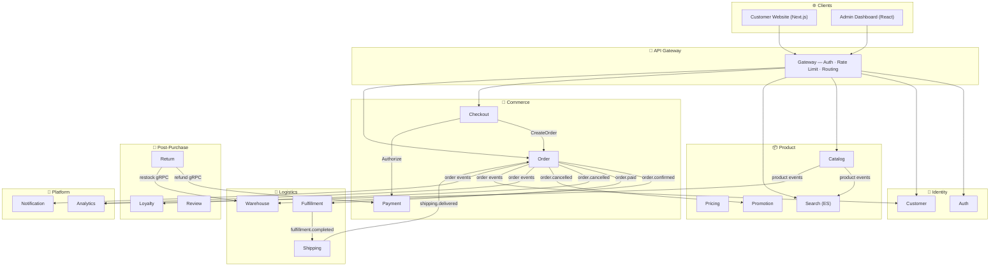

# 🚀 Enterprise E-Commerce Microservices Platform

> **Composable commerce platform** built on 21 Go microservices with event-driven architecture.  
> Handles the complete customer journey: **Browse → Search → Cart → Checkout → Pay → Fulfill → Ship → Return**.

[](https://go.dev/)
[](https://go-kratos.dev/)
[]()
[](https://argo-cd.readthedocs.io/)

---

## 💎 Business Value

| Capability | What It Delivers |
|-----------|-----------------|
| **Full Commerce Flow** | Cart → checkout → payment → fulfillment → shipping → delivery with real-time status |
| **Multi-Gateway Payments** | Stripe, PayPal, VNPay, MoMo with fraud detection (GeoIP + VPN/proxy) |
| **Inventory Management** | Multi-warehouse stock tracking, reservations, low-stock alerts |
| **Multi-Carrier Shipping** | GHN, Grab with webhook tracking and automated label generation |
| **Returns & Exchanges** | Automated refund, restock, exchange order creation, shipping labels |
| **Loyalty & Rewards** | Points system, tier management, referrals, bonus campaigns |
| **Dynamic Pricing** | Rule-based pricing, promotions, coupons, BOGO, tiered discounts |
| **Real-Time Analytics** | Revenue, orders, fulfillment, shipping, customer cohort metrics (event-based) |
| **Intelligent Search** | Full-text + faceted search with Elasticsearch, autocomplete, analytics |
| **Enterprise Security** | JWT + OAuth2 + MFA, rate limiting, audit logging, PCI DSS compliance |

### Design Principles
- **Independent scaling** — each service scales separately (e.g., 10× Order during peak, 1× Analytics)
- **Fault isolation** — if Review crashes, customers still shop and pay
- **Zero-downtime deploys** — GitOps with ArgoCD, automated rollback
- **Event-driven** — services communicate via Dapr PubSub, transactional outbox guarantees delivery

---

## 🤔 Why Build This?

Off-the-shelf platforms (Shopify, WooCommerce, Magento) get you started fast — but hit walls at scale:

| Challenge | Off-the-Shelf | This Platform |
|-----------|--------------|---------------|
| **Vietnam payment gateways** (VNPay, MoMo) | Third-party plugins, unreliable | Native integration, circuit breaker, failover |
| **Multi-warehouse + WMS** | Basic or enterprise-only ($125K+/yr Magento) | Built-in: bin location, batch picking, stock reservation |
| **Peak traffic** (e.g., flash sale) | Scale entire monolith 10× | Scale only Order + Payment 10×, rest unchanged |
| **Transaction fees** | Shopify: 0.5–2% per transaction | $0 — no platform fees |
| **Data ownership** | Shopify holds your data | Self-hosted, full control |
| **Event reliability** | Webhooks can miss, hooks are synchronous | Transactional outbox + async PubSub + DLQ |

> **Bottom line**: This platform delivers what **Magento Enterprise charges $200K+/year** for — payment saga, event-driven architecture, multi-warehouse WMS, fraud detection — with **zero license fees** and **full source ownership**.

📄 [Full comparison: TA Microservices vs Shopify vs WooCommerce vs Magento](01-architecture/platform-comparison-wc-shopify-magento.md)

---

## 🏗️ Architecture



### Technology Stack

| Layer | Technology |
|-------|-----------|
| **Backend** | Go 1.25 · Kratos v2 (Google's microservice framework) |
| **Frontend** | Next.js (customer) · React + Ant Design (admin) |
| **Database** | PostgreSQL 15+ (per-service isolation) |
| **Cache** | Redis 7+ (caching, sessions, distributed locks) |
| **Search** | Elasticsearch 8.11+ |
| **Messaging** | Dapr PubSub (Redis Streams) |
| **API** | gRPC (internal) + REST via gRPC-Gateway (external) |
| **Deploy** | Docker · Kubernetes (k3d) · ArgoCD (GitOps) |
| **Observability** | Prometheus · Grafana · Jaeger (OpenTelemetry) |
| **Shared Library** | `common` v1.10.0 — outbox, idempotency, health, config, server |

---

---

## 🚀 Getting Started

```bash
# Prerequisites: Go 1.25+, Docker, PostgreSQL 15+, Redis 7+, kubectl

# 1. Clone & start infrastructure
docker-compose up -d postgres redis consul

# 2. Start services
tilt up

# 3. Access
#   Customer site:   http://localhost:3000
#   Admin dashboard: http://localhost:3001
#   API Gateway:     http://localhost:8000
#   Monitoring:      http://localhost:10350
```

```bash
# Per-service development
cd <service-name>
make build          # Build service
make run            # Run with hot reload
make test           # Run tests
make api            # Generate proto code
```

---

## 📚 Documentation

| Section | Contents |
|---------|----------|
| [**Service Index**](SERVICE_INDEX.md) | All 21 services — ports, domains, maturity, architecture patterns |
| [**Architecture**](01-architecture/) | System design, event flows, data architecture |
| [**Business Domains**](02-business-domains/) | DDD bounded contexts and domain models |
| [**Service Docs**](03-services/) | Per-service implementation details |
| [**API Specs**](04-apis/) | OpenAPI specs, gRPC protos, event schemas |
| [**Workflows**](05-workflows/) | Order flow, payment flow, fulfillment flow |
| [**Operations**](06-operations/) | Deployment, monitoring, incident response |
| [**Dev Standards**](07-development/) | Coding standards, review process, commit conventions |
| [**ADRs**](08-architecture-decisions/) | Architecture Decision Records |
| [**Checklists**](10-appendix/checklists/v5/) | Master checklist, future sessions, session handoff |

---

## 🏗️ Key Architecture Patterns

| Pattern | Purpose | Used By |
|---------|---------|---------|
| **Transactional Outbox** | Reliable event publishing (DB + event in single transaction) | Order, Loyalty, Return, Fulfillment, Shipping |
| **Event Idempotency** | Deduplicate events with `event_idempotency` table | Warehouse, Search, Shipping, Loyalty |
| **Dead Letter Queue** | Failed event processing → DLQ for manual review | Order, Checkout, Payment, Search |
| **Circuit Breaker** | Prevent cascade failures on downstream service outages | Analytics (PG writes), Gateway |
| **Saga / Compensation** | Distributed transactions with rollback on failure | Checkout → Order → Payment → Warehouse |
| **CQRS** | Separate read/write paths for performance | Search (read-optimized Elasticsearch) |

---

*Last Updated: February 15, 2026 · Platform Team*
