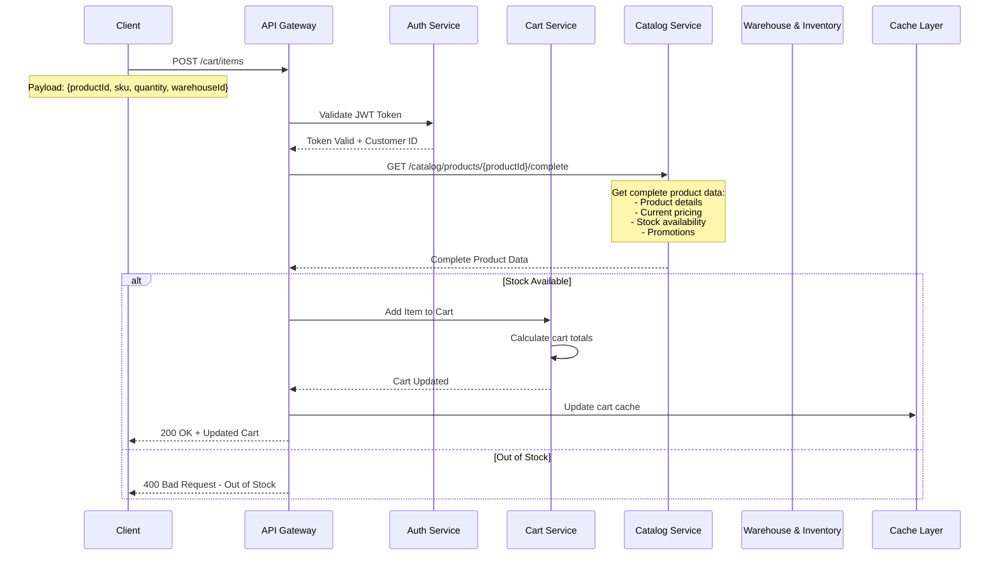
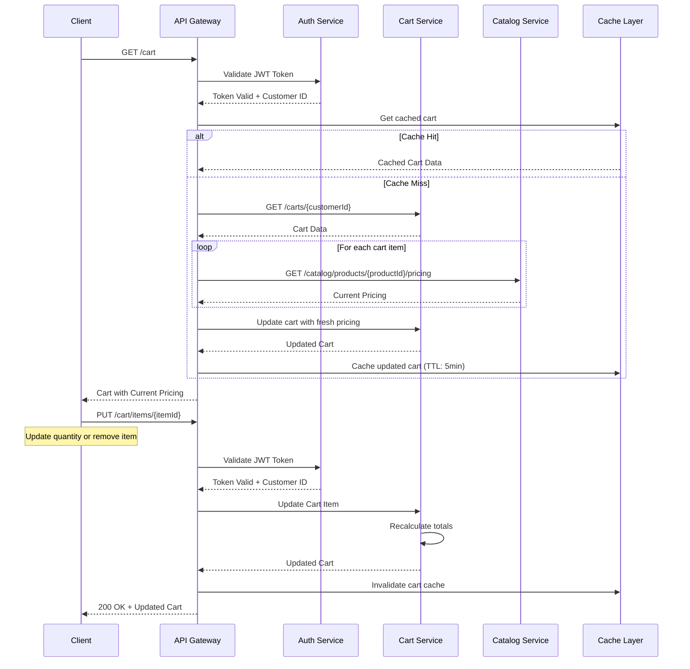
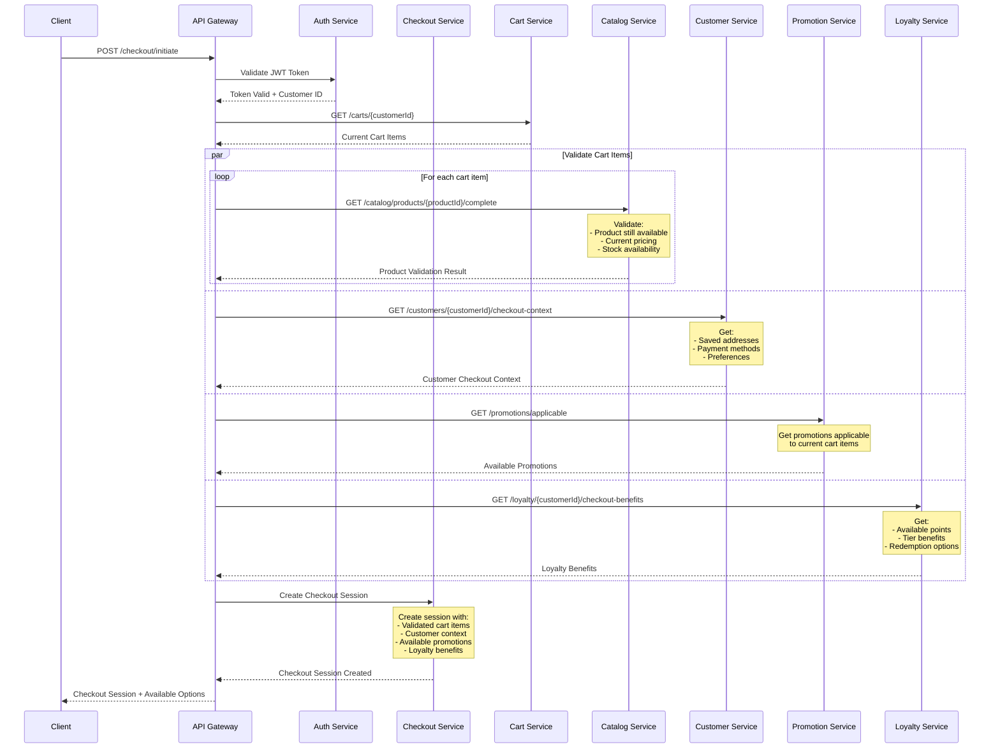
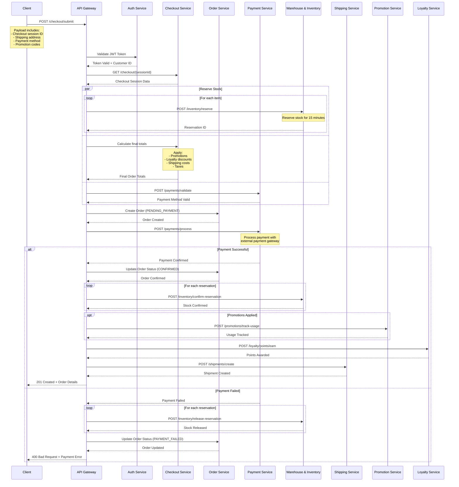
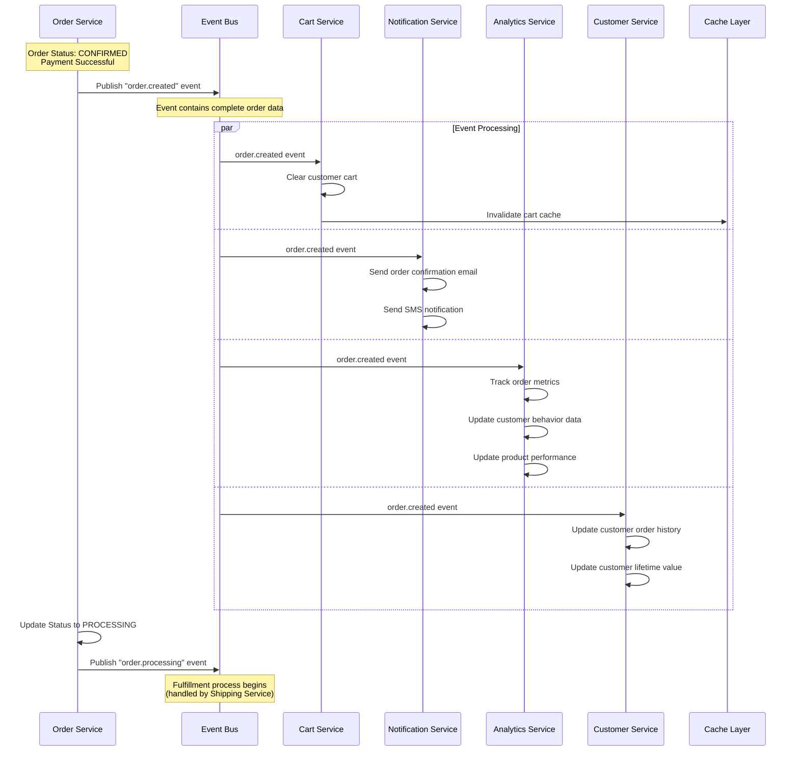

# Complete Checkout Flow - From Cart to Order Completion

## Overview
This document describes the complete checkout flow from adding items to cart through order completion. The flow is broken down into multiple sub-flows that work together to provide a seamless checkout experience.

## Flow Structure
1. **Add to Cart Flow** - Adding products to shopping cart
2. **Cart Management Flow** - View, update, and validate cart
3. **Checkout Initiation Flow** - Start checkout process with validation
4. **Payment Processing Flow** - Handle payment and confirmation
5. **Order Completion Flow** - Finalize order and trigger fulfillment

---

# 1. Add to Cart Flow

## Sequence Diagram - Add to Cart



## Add to Cart API

### Request
```http
POST /api/v1/cart/items
Authorization: Bearer {jwt_token}
Content-Type: application/json

{
  "productId": "PROD-12345",
  "sku": "SKU-ABC-001",
  "quantity": 2,
  "warehouseId": "US-WEST-01"
}
```

### Response
```json
{
  "success": true,
  "cart": {
    "id": "CART-789012",
    "customerId": "CUST-12345",
    "items": [
      {
        "id": "CART_ITEM-001",
        "productId": "PROD-12345",
        "sku": "SKU-ABC-001",
        "name": "Premium Wireless Headphones",
        "quantity": 2,
        "unitPrice": 249.99,
        "totalPrice": 499.98,
        "warehouse": "US-WEST-01",
        "addedAt": "2024-08-10T14:30:00Z"
      }
    ],
    "totals": {
      "subtotal": 499.98,
      "itemCount": 2,
      "currency": "USD"
    },
    "updatedAt": "2024-08-10T14:30:00Z"
  }
}
```

---

# 2. Cart Management Flow

## Sequence Diagram - View/Update Cart



## Cart Management APIs

### Get Cart
```http
GET /api/v1/cart
Authorization: Bearer {jwt_token}
```

### Update Cart Item
```http
PUT /api/v1/cart/items/{itemId}
Authorization: Bearer {jwt_token}
Content-Type: application/json

{
  "quantity": 3
}
```

### Remove Cart Item
```http
DELETE /api/v1/cart/items/{itemId}
Authorization: Bearer {jwt_token}
```

---

# 3. Checkout Initiation Flow

## Sequence Diagram - Start Checkout



## Checkout Initiation API

### Request
```http
POST /api/v1/checkout/initiate
Authorization: Bearer {jwt_token}
```

### Response
```json
{
  "checkoutSessionId": "CHECKOUT-789012",
  "cart": {
    "items": [
      {
        "productId": "PROD-12345",
        "sku": "SKU-ABC-001",
        "name": "Premium Wireless Headphones",
        "quantity": 2,
        "unitPrice": 249.99,
        "totalPrice": 499.98,
        "stockStatus": "available"
      }
    ],
    "totals": {
      "subtotal": 499.98,
      "currency": "USD"
    }
  },
  "customer": {
    "addresses": [
      {
        "id": "ADDR-001",
        "type": "shipping",
        "street": "123 Main St",
        "city": "San Francisco",
        "state": "CA",
        "zipCode": "94105",
        "isDefault": true
      }
    ],
    "paymentMethods": [
      {
        "id": "PM-001",
        "type": "credit_card",
        "last4": "4242",
        "brand": "visa",
        "isDefault": true
      }
    ]
  },
  "promotions": [
    {
      "code": "SUMMER2024",
      "description": "Summer Sale - 20% off",
      "discount": 99.99,
      "applicable": true
    }
  ],
  "loyalty": {
    "availablePoints": 1250,
    "pointsValue": 12.50,
    "tierBenefits": {
      "freeShipping": true,
      "discountPercentage": 5
    }
  }
}
```

---

# 4. Payment Processing Flow

## Sequence Diagram - Process Payment



## Checkout Submit API

### Request
```http
POST /api/v1/checkout/submit
Authorization: Bearer {jwt_token}
Content-Type: application/json

{
  "checkoutSessionId": "CHECKOUT-789012",
  "shippingAddress": {
    "street": "123 Main St",
    "city": "San Francisco",
    "state": "CA",
    "zipCode": "94105",
    "country": "US"
  },
  "billingAddress": {
    "street": "123 Main St",
    "city": "San Francisco",
    "state": "CA",
    "zipCode": "94105",
    "country": "US"
  },
  "paymentMethod": {
    "id": "PM-001",
    "type": "credit_card"
  },
  "shippingMethod": "standard",
  "promotionCodes": ["SUMMER2024"],
  "loyaltyPointsToUse": 500,
  "notes": "Please deliver after 5 PM"
}
```

### Response - Success
```json
{
  "orderId": "ORD-789012",
  "orderNumber": "ORD-2024-001234",
  "status": "CONFIRMED",
  "customerId": "CUST-12345",
  "items": [
    {
      "productId": "PROD-12345",
      "sku": "SKU-ABC-001",
      "name": "Premium Wireless Headphones",
      "quantity": 2,
      "unitPrice": 249.99,
      "totalPrice": 499.98,
      "warehouse": "US-WEST-01"
    }
  ],
  "pricing": {
    "subtotal": 499.98,
    "discounts": [
      {
        "type": "promotion",
        "code": "SUMMER2024",
        "amount": 75.00
      },
      {
        "type": "loyalty_points",
        "pointsUsed": 500,
        "amount": 5.00
      }
    ],
    "totalDiscounts": 80.00,
    "shipping": 15.99,
    "tax": 35.20,
    "total": 471.17,
    "currency": "USD"
  },
  "payment": {
    "transactionId": "txn_1234567890",
    "method": "credit_card",
    "status": "COMPLETED",
    "last4": "4242"
  },
  "shipping": {
    "method": "standard",
    "cost": 15.99,
    "estimatedDelivery": "2024-08-15",
    "trackingNumber": null,
    "warehouse": "US-WEST-01"
  },
  "loyalty": {
    "pointsEarned": 471,
    "pointsUsed": 500,
    "newBalance": 1221
  },
  "timestamps": {
    "createdAt": "2024-08-10T14:30:00Z",
    "confirmedAt": "2024-08-10T14:30:15Z"
  }
}
```

---

# 5. Order Completion Flow

## Sequence Diagram - Complete Order



## Order Completion Events

### order.created Event
```json
{
  "eventId": "evt-order-001",
  "eventType": "order.created",
  "timestamp": "2024-08-10T14:30:00Z",
  "source": "order-service",
  "data": {
    "orderId": "ORD-789012",
    "orderNumber": "ORD-2024-001234",
    "customerId": "CUST-12345",
    "status": "CONFIRMED",
    "items": [
      {
        "productId": "PROD-12345",
        "sku": "SKU-ABC-001",
        "name": "Premium Wireless Headphones",
        "quantity": 2,
        "unitPrice": 249.99,
        "totalPrice": 499.98
      }
    ],
    "totals": {
      "subtotal": 499.98,
      "discounts": 80.00,
      "shipping": 15.99,
      "tax": 35.20,
      "total": 471.17,
      "currency": "USD"
    },
    "customer": {
      "id": "CUST-12345",
      "email": "customer@example.com",
      "tier": "gold"
    },
    "addresses": {
      "shipping": {
        "street": "123 Main St",
        "city": "San Francisco",
        "state": "CA",
        "zipCode": "94105"
      }
    },
    "payment": {
      "method": "credit_card",
      "transactionId": "txn_1234567890"
    },
    "loyalty": {
      "pointsEarned": 471,
      "pointsUsed": 500
    }
  }
}
```

---

# Complete Checkout Flow Summary

## Flow Sequence
```
1. Add to Cart → 2. Cart Management → 3. Checkout Initiation → 4. Payment Processing → 5. Order Completion
```

## Key Integration Points

### Service Dependencies
- **Cart Service**: Manages shopping cart state and persistence
- **Catalog Service**: Product data and pricing orchestration
- **Checkout Service**: Checkout session management and validation
- **Order Service**: Order lifecycle management and status tracking
- **Payment Service**: Payment processing and transaction management
- **Inventory Service**: Stock management and reservations
- **Customer Service**: Customer data, addresses, and preferences
- **Promotion Service**: Discount and promotion management
- **Loyalty Service**: Points, tier benefits, and redemptions
- **Shipping Service**: Shipping calculation and fulfillment coordination
- **Notification Service**: Customer communications and alerts
- **Analytics Service**: Business intelligence and reporting

### Data Flow Optimization
- **Parallel Processing**: Multiple validations happen simultaneously
- **Caching Strategy**: Cart and product data cached for performance
- **Event-Driven**: Order completion triggers async processing
- **Stock Reservations**: Temporary holds during checkout process
- **Graceful Degradation**: Partial failures don't break entire flow
- **Session Management**: Checkout sessions maintain state across steps

### Performance Considerations
- **Cart Cache TTL**: 5 minutes for active carts
- **Stock Reservation Timeout**: 15 minutes during checkout
- **Parallel API Calls**: Reduce checkout initiation time
- **Event-Driven Completion**: Non-blocking order finalization
- **Optimistic Locking**: Prevent cart conflicts during checkout

### Error Handling
- **Stock Validation**: Real-time availability checks
- **Payment Failures**: Automatic stock release and cleanup
- **Session Expiry**: Graceful handling of expired checkout sessions
- **Service Timeouts**: Fallback strategies for service failures
- **Data Consistency**: Transactional integrity across services

### Security Measures
- **JWT Authentication**: Required for all cart and checkout operations
- **Payment Tokenization**: Secure payment method handling
- **Address Validation**: Shipping and billing address verification
- **Fraud Detection**: Integration with payment service fraud checks
- **Rate Limiting**: Prevent abuse of cart and checkout APIs