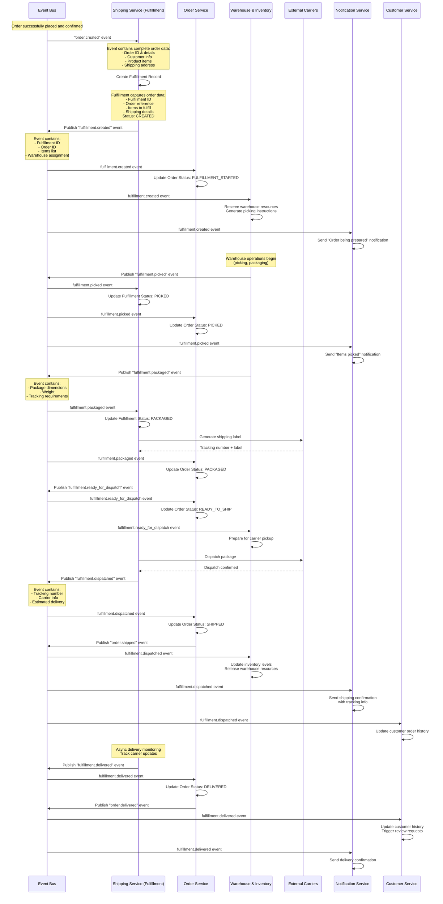

# Fulfillment Order Flow (Shipping Service)

## Overview
This document describes the complete fulfillment flow that occurs after an order is successfully placed. The Shipping Service orchestrates the fulfillment process from order confirmation to delivery completion.

## Sequence Diagram (Event-Driven Fulfillment)



## Event-Driven Fulfillment Flow Steps

### 1. Event-Driven Initiation
```
Event Bus → Shipping Service (Fulfillment)
- Receive "order.created" event with complete order data
- No additional API calls needed - all data in event
- Create fulfillment entity to capture order data
- Initialize fulfillment tracking
```

### 2. Fulfillment Entity Creation (Data Capture Only)
```
Shipping Service Internal Processing:
- Create fulfillment record with order data
- Assign fulfillment ID
- Set initial status: CREATED
- No external service calls - pure data capture
```

### 3. Event Publishing Pattern
```
Shipping Service → Event Bus
- Publish "fulfillment.created" event
- Event contains all necessary data for consumers
- No direct service-to-service calls
- Let consumers update their own data
```

### 4. Event Consumers React Independently
```
Event Bus → Multiple Services (Parallel Processing)

Order Service:
- Listen to fulfillment events
- Update order status accordingly
- Publish order status change events

Warehouse & Inventory Service:
- Listen to fulfillment.created event
- Reserve resources and start operations
- Publish warehouse operation events

Notification Service:
- Listen to all fulfillment events
- Send appropriate customer notifications
- No direct API calls to other services

Customer Service:
- Listen to fulfillment events
- Update customer order history
- Track customer delivery preferences
```

### 5. Warehouse Operations (Event-Driven)
```
Warehouse & Inventory Service (Independent Operations):
- Process fulfillment.created event
- Execute picking and packaging
- Publish progress events:
  - fulfillment.picked
  - fulfillment.packaged
  - fulfillment.ready_for_dispatch

No direct communication with Shipping Service
```

### 6. Shipping Service Reacts to Warehouse Events
```
Shipping Service Event Listeners:
- Listen to warehouse operation events
- Update fulfillment status accordingly
- Handle carrier integration when ready
- Publish shipping events (dispatched, delivered)
```

### 7. Order Service Status Management
```
Order Service Event Listeners:
- fulfillment.created → Order Status: FULFILLMENT_STARTED
- fulfillment.picked → Order Status: PICKED
- fulfillment.packaged → Order Status: PACKAGED
- fulfillment.dispatched → Order Status: SHIPPED
- fulfillment.delivered → Order Status: DELIVERED

Order Service publishes order.status_changed events
```

### 8. Decoupled Notification System
```
Notification Service Event Listeners:
- Listen to all fulfillment and order events
- Send notifications based on event types
- No direct API calls to get additional data
- All necessary data included in events
```

## Event-Driven Architecture

### Fulfillment Events Schema

#### 1. fulfillment.created
```json
{
  "eventId": "evt-001",
  "eventType": "fulfillment.created",
  "timestamp": "2024-08-10T14:30:00Z",
  "source": "shipping-service",
  "data": {
    "fulfillmentId": "FUL-789012",
    "orderId": "ORD-789012",
    "customerId": "CUST-12345",
    "warehouse": {
      "id": "US-WEST-01",
      "name": "California Distribution Center"
    },
    "items": [
      {
        "productId": "PROD-67890",
        "sku": "SKU-ABC-001",
        "quantity": 2,
        "dimensions": {"length": 10, "width": 5, "height": 3},
        "weight": 0.5
      }
    ],
    "shippingAddress": {
      "street": "123 Main St",
      "city": "San Francisco",
      "state": "CA",
      "zipCode": "94105"
    }
  }
}
```

#### 2. fulfillment.picked
```json
{
  "eventId": "evt-002",
  "eventType": "fulfillment.picked",
  "timestamp": "2024-08-10T15:30:00Z",
  "source": "warehouse-service",
  "data": {
    "fulfillmentId": "FUL-789012",
    "orderId": "ORD-789012",
    "pickedItems": [
      {
        "productId": "PROD-67890",
        "sku": "SKU-ABC-001",
        "quantityPicked": 2,
        "pickingLocation": "A-15-C"
      }
    ],
    "pickedBy": "picker-001",
    "pickingCompletedAt": "2024-08-10T15:30:00Z"
  }
}
```

#### 3. fulfillment.packaged
```json
{
  "eventId": "evt-003",
  "eventType": "fulfillment.packaged",
  "timestamp": "2024-08-10T16:00:00Z",
  "source": "warehouse-service",
  "data": {
    "fulfillmentId": "FUL-789012",
    "orderId": "ORD-789012",
    "packages": [
      {
        "packageId": "BOX-001",
        "dimensions": {"length": 30, "width": 20, "height": 15},
        "weight": 1.2,
        "items": ["PROD-67890"]
      }
    ],
    "packagedBy": "packer-001",
    "packagingCompletedAt": "2024-08-10T16:00:00Z"
  }
}
```

#### 4. fulfillment.dispatched
```json
{
  "eventId": "evt-004",
  "eventType": "fulfillment.dispatched",
  "timestamp": "2024-08-10T17:00:00Z",
  "source": "shipping-service",
  "data": {
    "fulfillmentId": "FUL-789012",
    "orderId": "ORD-789012",
    "carrier": "UPS",
    "service": "Ground",
    "trackingNumber": "1Z999AA1234567890",
    "estimatedDelivery": "2024-08-15T18:00:00Z",
    "dispatchedAt": "2024-08-10T17:00:00Z"
  }
}
```

#### 5. fulfillment.delivered
```json
{
  "eventId": "evt-005",
  "eventType": "fulfillment.delivered",
  "timestamp": "2024-08-15T16:30:00Z",
  "source": "shipping-service",
  "data": {
    "fulfillmentId": "FUL-789012",
    "orderId": "ORD-789012",
    "deliveredAt": "2024-08-15T16:30:00Z",
    "deliveredTo": "Customer",
    "signedBy": "John Doe",
    "deliveryProof": "https://proof.example.com/delivery-123.jpg"
  }
}
```

### Service Data Models (Each Service Owns Its Data)

#### Shipping Service (Fulfillment Entity)
```json
{
  "fulfillmentId": "FUL-789012",
  "orderId": "ORD-789012",
  "status": "DISPATCHED",
  "trackingNumber": "1Z999AA1234567890",
  "carrier": "UPS",
  "createdAt": "2024-08-10T14:30:00Z",
  "dispatchedAt": "2024-08-10T17:00:00Z"
}
```

#### Order Service (Order Status)
```json
{
  "orderId": "ORD-789012",
  "status": "SHIPPED",
  "fulfillmentId": "FUL-789012",
  "statusHistory": [
    {"status": "CONFIRMED", "timestamp": "2024-08-10T14:30:00Z"},
    {"status": "FULFILLMENT_STARTED", "timestamp": "2024-08-10T14:30:00Z"},
    {"status": "PICKED", "timestamp": "2024-08-10T15:30:00Z"},
    {"status": "PACKAGED", "timestamp": "2024-08-10T16:00:00Z"},
    {"status": "SHIPPED", "timestamp": "2024-08-10T17:00:00Z"}
  ]
}
```

#### Warehouse Service (Fulfillment Operations)
```json
{
  "fulfillmentId": "FUL-789012",
  "warehouseId": "US-WEST-01",
  "pickingStatus": "COMPLETED",
  "packagingStatus": "COMPLETED",
  "pickedBy": "picker-001",
  "packagedBy": "packer-001",
  "resourcesUsed": ["BOX-001", "TAPE-001"]
}
```

## Fulfillment Status States

### Status Flow
```
CREATED → PICKING → PICKED → PACKAGING → READY_FOR_DISPATCH → DISPATCHED → IN_TRANSIT → DELIVERED
```

### Status Descriptions
- **CREATED**: Fulfillment record created, planning completed
- **PICKING**: Items being collected from warehouse
- **PICKED**: All items collected, ready for packaging
- **PACKAGING**: Items being packaged for shipment
- **READY_FOR_DISPATCH**: Package ready, label generated
- **DISPATCHED**: Package handed to carrier
- **IN_TRANSIT**: Package in carrier network
- **DELIVERED**: Package delivered to customer

## Error Handling & Exception Management

### Common Exception Scenarios

#### 1. Item Not Found During Picking
```json
{
  "exception": "ITEM_NOT_FOUND",
  "productId": "PROD-67890",
  "expectedLocation": "A-15-C",
  "action": "INVENTORY_ADJUSTMENT_REQUIRED",
  "resolution": "Contact customer for substitution or refund"
}
```

#### 2. Packaging Damage
```json
{
  "exception": "PACKAGING_DAMAGE",
  "packageId": "BOX-001",
  "damageType": "FRAGILE_ITEM_BROKEN",
  "action": "REPACKAGE_REQUIRED",
  "resolution": "Replace damaged item and repackage"
}
```

#### 3. Carrier Pickup Failure
```json
{
  "exception": "CARRIER_PICKUP_FAILED",
  "carrier": "UPS",
  "reason": "WEATHER_DELAY",
  "action": "RESCHEDULE_PICKUP",
  "newPickupTime": "2024-08-11T09:00:00Z"
}
```

### Exception Resolution Flow
```
Exception Detected → Shipping Service → Determine Resolution Strategy
├── Auto-resolve (minor issues)
├── Customer notification (delays, substitutions)
├── Manual intervention (complex issues)
└── Order cancellation (unresolvable issues)
```

## Performance Considerations

### Optimization Strategies
- **Batch Processing**: Group multiple orders for efficient picking
- **Route Optimization**: Optimize warehouse picking routes
- **Carrier Selection**: Dynamic carrier selection based on cost/speed
- **Predictive Analytics**: Predict delivery issues and proactively address

### Parallel Processing
- **Multi-warehouse Fulfillment**: Split orders across warehouses if beneficial
- **Concurrent Packaging**: Package multiple items simultaneously
- **Async Notifications**: Send notifications without blocking fulfillment

### Caching Strategy
- **Fulfillment Status**: Cache current status for quick lookups
- **Tracking Information**: Cache carrier tracking data
- **Delivery Estimates**: Cache calculated delivery windows

## Service Responsibilities (Event-Driven)

### Shipping Service (Fulfillment)
**Primary Role**: Data capture and carrier integration
- **Listen to**: order.created events
- **Publish**: fulfillment.created, fulfillment.dispatched, fulfillment.delivered
- **Own Data**: Fulfillment entities, tracking numbers, carrier info
- **No Direct Calls**: To other internal services (except carriers)

### Order Service
**Primary Role**: Order status management and orchestration
- **Listen to**: All fulfillment events
- **Publish**: order.status_changed, order.shipped, order.delivered
- **Own Data**: Order status, status history, order lifecycle
- **Update Logic**: React to fulfillment events to update order status

### Warehouse & Inventory Service
**Primary Role**: Physical fulfillment operations
- **Listen to**: fulfillment.created events
- **Publish**: fulfillment.picked, fulfillment.packaged, fulfillment.ready_for_dispatch
- **Own Data**: Inventory levels, picking operations, packaging data
- **Operations**: Execute physical fulfillment based on events

### Notification Service
**Primary Role**: Customer communication
- **Listen to**: All fulfillment and order events
- **Publish**: notification.sent events
- **Own Data**: Notification history, customer preferences
- **No API Calls**: All data comes from events

### Customer Service
**Primary Role**: Customer data and history
- **Listen to**: fulfillment and order events
- **Publish**: customer.updated events
- **Own Data**: Customer profiles, order history, preferences
- **Update Logic**: Maintain customer order history from events

## Event-Driven Benefits

### 1. Loose Coupling
- Services don't directly call each other
- Each service owns its data and logic
- Easy to add/remove services without breaking others
- Independent deployment and scaling

### 2. Resilience
- If one service is down, others continue working
- Events can be replayed if service recovers
- No cascading failures from direct API calls
- Built-in retry mechanisms with event bus

### 3. Scalability
- Each service can scale independently
- Event bus handles load distribution
- Async processing improves performance
- No blocking operations between services

### 4. Auditability
- Complete event history for debugging
- Easy to trace order fulfillment flow
- Event sourcing enables replay and analysis
- Clear separation of concerns

### 5. Extensibility
- Easy to add new services as event consumers
- New features can listen to existing events
- No need to modify existing services
- Plugin-like architecture

## Integration Points

### External Systems Only
- **Carrier APIs**: UPS, FedEx, DHL, USPS (only Shipping Service calls these)
- **Warehouse Systems**: WMS integration (only Warehouse Service calls these)
- **Payment Gateways**: Only Payment Service integrates
- **Email/SMS Providers**: Only Notification Service integrates

### Internal Communication
- **Event Bus Only**: Kafka, RabbitMQ, or similar
- **No Direct API Calls**: Between internal services
- **Event Schema**: Standardized event formats
- **Event Versioning**: Backward compatibility for schema changes

## Monitoring & Analytics

### Key Metrics
- **Fulfillment Speed**: Time from order to dispatch (target: < 4 hours)
- **Picking Accuracy**: Correct items picked (target: > 99.5%)
- **Packaging Efficiency**: Optimal package utilization (target: > 85%)
- **On-time Delivery**: Delivered within estimated window (target: > 95%)

### Real-time Dashboards
- **Fulfillment Pipeline**: Orders at each stage
- **Warehouse Performance**: Picking and packaging metrics
- **Carrier Performance**: Delivery success rates
- **Exception Tracking**: Active issues requiring attention

### Alerts & Notifications
- **SLA Breaches**: Fulfillment taking longer than expected
- **Inventory Issues**: Items not found during picking
- **Carrier Delays**: Delivery delays from carriers
- **Exception Escalation**: Issues requiring manual intervention

## Future Enhancements

### Advanced Features
- **AI-Powered Optimization**: Machine learning for route and packaging optimization
- **Predictive Delivery**: Predict and prevent delivery issues
- **Autonomous Fulfillment**: Integration with robotic warehouse systems
- **Sustainability Tracking**: Carbon footprint monitoring and optimization