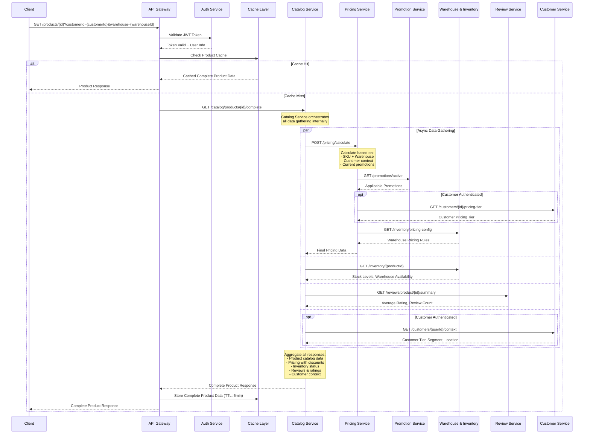

# Get Product API Data Flow

## Overview
This document describes the complete data flow for the `GET /products/{id}` API endpoint, showing how different services collaborate to return comprehensive product information.

## Sequence Diagram (Optimized with Catalog Service Orchestration)



## Optimized Data Flow Steps

### 1. Authentication & Authorization
```
Client → API Gateway → Auth Service
- Validate JWT token
- Extract user context (customer ID, permissions)
- Return user information for personalization
```

### 2. Cache Check
```
API Gateway → Cache Layer
- Check if complete product data exists in cache
- Cache key includes: productId + customerId + warehouseId
- If cache hit: return complete cached data immediately
- If cache miss: proceed with Catalog Service call
```

### 3. Single Orchestrated Call to Catalog Service
```
API Gateway → Catalog Service
- Single call: GET /catalog/products/{id}/complete
- Pass customer context and warehouse preference
- Catalog Service acts as orchestrator for all data gathering
```

### 4. Catalog Service Internal Orchestration (Parallel Async Calls)
```
Catalog Service makes parallel calls to:

├── Pricing Service (SKU + Warehouse based calculation)
│   ├── → Promotion Service (applicable discounts)
│   ├── → Customer Service (customer tier pricing)
│   ├── → Warehouse Service (warehouse pricing config)
│   └── → Loyalty & Rewards Service (loyalty discounts)
│
├── Warehouse & Inventory Service (stock availability)
│
├── Review Service (ratings and reviews)
│
├── Customer Service (customer context - if authenticated)
│
└── Analytics Service (product performance data for recommendations)

All calls execute in parallel for optimal performance
```

### 5. Data Aggregation in Catalog Service
```
Catalog Service:
- Waits for all parallel calls to complete (with timeout)
- Aggregates all responses into single product object
- Handles partial failures gracefully
- Returns complete product data to API Gateway
```

### 6. Response Caching & Return
```
API Gateway:
- Receives complete product data from Catalog Service
- Stores result in cache (5-minute TTL)
- Returns complete product information to client
```

## Benefits of This Approach

### Performance Improvements
- **Reduced Network Calls**: Client makes only 1 API call instead of multiple
- **Parallel Processing**: All data gathering happens in parallel within Catalog Service
- **Single Cache Entry**: Complete product data cached together
- **Reduced Latency**: No sequential API calls from API Gateway

### Simplified Client Integration
- **Single Endpoint**: Client only needs to call one API
- **Complete Data**: All product information returned in one response
- **Consistent Interface**: Same API structure regardless of data sources

### Better Error Handling
- **Graceful Degradation**: If one service fails, return partial data
- **Centralized Logic**: All orchestration logic in Catalog Service
- **Timeout Management**: Single timeout for entire operation

## Sample API Response

```json
{
  "id": "PROD-12345",
  "sku": "SKU-ABC-001",
  "name": "Premium Wireless Headphones",
  "description": "High-quality wireless headphones with noise cancellation",
  "category": {
    "id": "electronics",
    "name": "Electronics",
    "path": "Electronics > Audio > Headphones"
  },
  "brand": {
    "id": "brand-xyz",
    "name": "AudioTech"
  },
  "pricing": {
    "basePrice": 299.99,
    "finalPrice": 224.99,
    "currency": "USD",
    "discounts": [
      {
        "type": "promotion",
        "name": "Summer Sale",
        "amount": 50.00,
        "percentage": 16.67
      },
      {
        "type": "loyalty_tier",
        "name": "Gold Member Discount",
        "amount": 25.00,
        "percentage": 8.33
      }
    ],
    "warehouse": "US-WEST-01"
  },
  "inventory": {
    "inStock": true,
    "quantity": 45,
    "warehouses": [
      {
        "id": "US-WEST-01",
        "name": "California Warehouse",
        "stock": 45,
        "estimatedDelivery": "2-3 days"
      }
    ]
  },
  "reviews": {
    "averageRating": 4.5,
    "totalReviews": 128,
    "ratingDistribution": {
      "5": 65,
      "4": 42,
      "3": 15,
      "2": 4,
      "1": 2
    }
  },
  "loyalty": {
    "pointsEarnable": 225,
    "tierMultiplier": 1.5,
    "customerTier": "gold"
  },
  "recommendations": {
    "relatedProducts": ["PROD-11111", "PROD-22222"],
    "frequentlyBoughtTogether": ["PROD-33333"],
    "viewedAlsoViewed": ["PROD-44444", "PROD-55555"]
  },
  "media": [
    {
      "type": "image",
      "url": "https://cdn.example.com/products/prod-12345/main.jpg",
      "alt": "Premium Wireless Headphones"
    }
  ],
  "attributes": {
    "color": "Black",
    "connectivity": "Bluetooth 5.0",
    "batteryLife": "30 hours",
    "weight": "250g"
  },
  "promotions": [
    {
      "id": "summer-sale-2024",
      "name": "Summer Sale",
      "description": "Get 17% off on selected audio products",
      "validUntil": "2024-08-31T23:59:59Z"
    }
  ]
}
```

## Performance Considerations

### Caching Strategy
- **Cache Key**: `product:{id}:warehouse:{warehouseId}:customer:{customerId}`
- **TTL**: 5 minutes for complete product data (includes pricing)
- **Cache Invalidation**: On inventory updates, price changes, or promotions
- **Cache Warming**: Pre-populate cache for popular products

### Parallel Processing in Catalog Service
- **All External Calls in Parallel**: Pricing, Inventory, Reviews, Customer data
- **Timeout Management**: 2-second timeout per service call
- **Circuit Breaker**: Fail fast if services are consistently down
- **Async Processing**: Non-blocking calls with CompletableFuture/Promises

### Error Handling & Graceful Degradation
```
Catalog Service handles failures gracefully:

├── If Pricing Service fails:
│   └── Return base price from catalog configuration
│
├── If Review Service fails:
│   └── Return product without reviews (reviews: null)
│
├── If Inventory Service fails:
│   └── Show "availability unknown" status
│
├── If Customer Service fails:
│   └── Use default pricing (no personalization)
│
└── Always return core product catalog data
```

### Catalog Service Internal Architecture
```
GET /catalog/products/{id}/complete:

1. Get core product data from local database (fast)
2. Launch parallel async calls to external services
3. Set timeout for all external calls (2 seconds)
4. Aggregate responses as they arrive
5. Return complete data or partial data with error flags
```

## Catalog Service as Orchestrator

### New Responsibilities
The Catalog Service now acts as a **Product Data Orchestrator** with these capabilities:

#### 1. Async Data Aggregation
```javascript
// Pseudo-code for Catalog Service
async getCompleteProduct(productId, customerId, warehouseId) {
  // Get core product data (fast local call)
  const productData = await this.getProductFromDB(productId);
  
  // Launch parallel async calls
  const [pricing, inventory, reviews, customerContext] = await Promise.allSettled([
    this.pricingService.calculate(productId, customerId, warehouseId),
    this.inventoryService.getAvailability(productId, warehouseId),
    this.reviewService.getSummary(productId),
    customerId ? this.customerService.getContext(customerId) : null
  ]);
  
  // Aggregate results with error handling
  return this.aggregateProductData(productData, pricing, inventory, reviews, customerContext);
}
```

#### 2. Circuit Breaker Pattern
- Monitor service health and response times
- Fail fast when services are down
- Return cached or default data during outages

#### 3. Timeout Management
- 2-second timeout for external service calls
- Graceful degradation if services don't respond
- Partial data return with error indicators

### API Enhancements

#### New Endpoint
```
GET /catalog/products/{id}/complete?customerId={id}&warehouse={id}
```

#### Response Structure
```json
{
  "product": { /* core product data */ },
  "pricing": { /* calculated pricing */ },
  "inventory": { /* stock information */ },
  "reviews": { /* ratings and reviews */ },
  "meta": {
    "dataCompleteness": {
      "pricing": "success",
      "inventory": "success", 
      "reviews": "failed",
      "customerContext": "success"
    },
    "responseTime": "150ms",
    "cacheStatus": "miss"
  }
}
```

## Monitoring & Metrics

### Key Metrics to Track
- **Complete API response time** (target: < 200ms)
- **Cache hit ratio** (target: > 80%)
- **Service failure rates** per dependency
- **Data completeness ratio** (target: > 95%)
- **Parallel call efficiency**

### Catalog Service Specific Metrics
- **Orchestration success rate** (target: > 99%)
- **Partial response rate** (when some services fail)
- **Average parallel call completion time**
- **Circuit breaker activation frequency**

### Alerts
- Complete API response time > 500ms
- Cache hit ratio < 70%
- Any dependency service failure rate > 5%
- Data completeness < 90%
- Circuit breaker activated > 3 times in 5 minutes