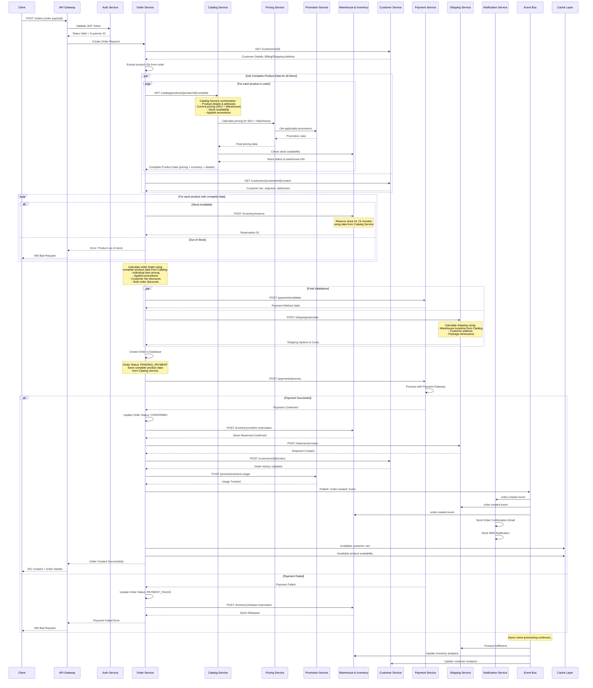

# Place Order API Data Flow

## Overview
This document describes the complete data flow for the `POST /orders` API endpoint, showing the complex orchestration of services required to successfully place an order.

## Sequence Diagram



## Data Flow Steps

### 1. Authentication & Request Validation
```
Client → API Gateway → Auth Service
- Validate JWT token and extract customer ID
- Validate request payload structure
- Check customer permissions for placing orders
```

### 2. Customer Validation
```
Order Service → Customer Service
- Verify customer exists and is active
- Get billing and shipping addresses
- Validate customer credit limits (if applicable)
- Get customer tier for pricing calculations
```

### 3. Get Complete Product Data (Optimized)
```
Order Service → Catalog Service (for each product)
├── GET /catalog/products/{id}/complete
└── Catalog Service orchestrates internally:
    ├── → Pricing Service (SKU + Warehouse pricing)
    │   ├── → Promotion Service (applicable discounts)
    │   └── → Customer Service (tier pricing)
    ├── → Warehouse & Inventory Service (stock availability)
    └── → Returns complete product data

Parallel execution:
- All product data fetched simultaneously
- Customer context retrieved in parallel
- Complete pricing and inventory data in single call per product
```

### 4. Stock Reservation & Validation
```
Order Service → Warehouse & Inventory Service (for each product)
- Use stock data from Catalog Service response
- Reserve stock temporarily (15-minute timeout)
- Validate reservation success
- Get reservation IDs for order tracking

Benefits:
- No additional stock checks needed (data from Catalog)
- Faster reservation process
- Consistent data between pricing and reservation
```

### 5. Payment & Shipping (Parallel Processing)
```
Order Service executes in parallel:

├── Payment Service
│   - Validate payment method
│   - Process payment with external gateway
│   - Handle 3D Secure authentication if required
│   - Store payment transaction details
│
└── Shipping Service
    - Calculate shipping costs using warehouse data from Catalog
    - Use destination address from customer context
    - Calculate package dimensions from product data
    - Estimate delivery dates per warehouse location

Benefits:
- Payment and shipping calculated simultaneously
- Warehouse locations already known from Catalog Service
- Faster overall processing time
```

### 7. Order Confirmation & Fulfillment Setup
```
Order Service → Shipping Service (create shipment)
Order Service → Customer Service (update order history)
Order Service → Promotion Service (track usage)
Order Service → Warehouse Service (confirm reservation)
```

### 8. Event Publishing & Notifications
```
Order Service → Event Bus → Multiple Services
- Publish "order.created" event
- Trigger notifications (email, SMS)
- Update analytics and reporting
- Invalidate relevant caches
```

## Sample Request Payload

```json
{
  "customerId": "CUST-12345",
  "items": [
    {
      "productId": "PROD-67890",
      "sku": "SKU-ABC-001",
      "quantity": 2,
      "requestedWarehouse": "US-WEST-01"
    },
    {
      "productId": "PROD-11111",
      "sku": "SKU-DEF-002", 
      "quantity": 1,
      "requestedWarehouse": "US-WEST-01"
    }
  ],
  "shippingAddress": {
    "street": "123 Main St",
    "city": "San Francisco",
    "state": "CA",
    "zipCode": "94105",
    "country": "US"
  },
  "billingAddress": {
    "street": "123 Main St",
    "city": "San Francisco", 
    "state": "CA",
    "zipCode": "94105",
    "country": "US"
  },
  "paymentMethod": {
    "type": "credit_card",
    "token": "pm_1234567890"
  },
  "shippingMethod": "standard",
  "promotionCodes": ["SUMMER2024"],
  "notes": "Please deliver after 5 PM"
}
```

## Sample Response

```json
{
  "orderId": "ORD-789012",
  "orderNumber": "ORD-2024-001234",
  "status": "CONFIRMED",
  "customerId": "CUST-12345",
  "items": [
    {
      "productId": "PROD-67890",
      "sku": "SKU-ABC-001",
      "name": "Premium Wireless Headphones",
      "quantity": 2,
      "unitPrice": 249.99,
      "totalPrice": 499.98,
      "warehouse": "US-WEST-01"
    }
  ],
  "pricing": {
    "subtotal": 649.98,
    "discounts": [
      {
        "type": "promotion",
        "code": "SUMMER2024",
        "amount": 65.00
      },
      {
        "type": "customer_tier",
        "amount": 32.50
      }
    ],
    "totalDiscounts": 97.50,
    "shipping": 15.99,
    "tax": 45.32,
    "total": 613.79,
    "currency": "USD"
  },
  "payment": {
    "transactionId": "txn_1234567890",
    "method": "credit_card",
    "status": "COMPLETED",
    "last4": "4242"
  },
  "shipping": {
    "method": "standard",
    "cost": 15.99,
    "estimatedDelivery": "2024-08-15",
    "trackingNumber": null,
    "warehouse": "US-WEST-01"
  },
  "timestamps": {
    "createdAt": "2024-08-10T14:30:00Z",
    "confirmedAt": "2024-08-10T14:30:15Z"
  }
}
```

## Error Handling

### Common Error Scenarios

#### 1. Product Out of Stock
```json
{
  "error": "PRODUCT_OUT_OF_STOCK",
  "message": "Product SKU-ABC-001 is out of stock in warehouse US-WEST-01",
  "details": {
    "productId": "PROD-67890",
    "sku": "SKU-ABC-001",
    "requestedQuantity": 2,
    "availableQuantity": 0
  }
}
```

#### 2. Payment Failed
```json
{
  "error": "PAYMENT_FAILED",
  "message": "Payment could not be processed",
  "details": {
    "paymentError": "CARD_DECLINED",
    "orderId": "ORD-789012",
    "orderStatus": "PAYMENT_FAILED"
  }
}
```

#### 3. Invalid Promotion Code
```json
{
  "error": "INVALID_PROMOTION",
  "message": "Promotion code SUMMER2024 is not valid for this order",
  "details": {
    "code": "SUMMER2024",
    "reason": "EXPIRED"
  }
}
```

## Performance Optimizations

### Catalog Service Integration Benefits
- **Reduced Service Calls**: Get complete product data in single call per product
- **Parallel Product Processing**: All products processed simultaneously
- **Consistent Data**: Pricing and inventory data from same timestamp
- **Faster Validation**: No separate pricing calculation needed

### Optimization Strategies
- **Parallel Processing**: Product data, customer context, payment validation, and shipping calculation run in parallel
- **Stock Reservation**: Use inventory data from Catalog Service for faster reservation
- **Circuit Breakers**: Fail fast if critical services are down
- **Async Processing**: Non-critical operations happen after response

### Order Processing Flow Optimization
```
Traditional Flow (Sequential):
Product validation → Pricing → Inventory → Payment → Shipping
Total time: ~2-3 seconds

Optimized Flow (Parallel):
[Product + Pricing + Inventory] || [Customer Context] || [Payment + Shipping]
Total time: ~800ms-1.2 seconds
```

### Timeout Management
- **Catalog Service Calls**: 3-second timeout per product (includes pricing + inventory)
- **Stock Reservation**: 15-minute timeout (using data from Catalog)
- **Payment Processing**: 30-second timeout
- **Shipping Calculation**: 5-second timeout
- **Overall Order Creation**: 45-second timeout (reduced from 60s)
- **Async Event Processing**: No timeout (retry with backoff)

### Error Handling with Catalog Service
```
If Catalog Service fails for a product:
├── Fallback to individual service calls
├── Use cached product data if available
└── Return error if critical data unavailable

If Catalog Service returns partial data:
├── Proceed with available data
├── Log missing data for monitoring
└── Apply default values where safe
```

### Rollback Strategy
```
If any step fails after payment:
1. Refund payment
2. Release stock reservations
3. Update order status to FAILED
4. Send failure notifications
5. Log for manual review
```

## Monitoring & Alerts

### Key Metrics (Optimized Targets)
- Order creation success rate (target: > 99.5%)
- Average order processing time (target: < 2 seconds) - improved from 5s
- Payment success rate (target: > 95%)
- Stock reservation conflicts (target: < 1%)
- Catalog Service response time (target: < 1 second per product)
- Product data completeness from Catalog (target: > 98%)

### Performance Metrics
- **Parallel Processing Efficiency**: Measure time saved vs sequential processing
- **Catalog Service Integration**: Success rate of complete product data retrieval
- **Data Consistency**: Compare pricing/inventory data between services
- **Cache Hit Rate**: For product data in Catalog Service

### Critical Alerts
- Order creation failure rate > 0.5% (tightened from 1%)
- Average order processing time > 3 seconds (improved from 10s)
- Catalog Service failure rate > 2%
- Stock reservation failures > 5%
- Product data completeness < 95%
- Any critical service timeout > 30 seconds

### New Monitoring Points
- **Catalog Service Orchestration**: Monitor internal service call success rates
- **Parallel Processing**: Track time savings from parallel execution
- **Data Freshness**: Monitor age of pricing and inventory data
- **Fallback Usage**: Track when fallback to individual services is used

## Optimized Architecture Benefits

### Before Optimization (Traditional Flow)
```
Order Service → Product Service (product details)
Order Service → Pricing Service → Promotion Service
Order Service → Inventory Service (stock check)
Order Service → Customer Service (customer data)
Order Service → Payment Service
Order Service → Shipping Service

Total API calls: 6-8 calls
Processing time: 2-3 seconds
```

### After Optimization (Catalog Service Integration)
```
Order Service → Catalog Service/complete (includes pricing + inventory)
Order Service → Customer Service (parallel)
Order Service → Payment Service (parallel)
Order Service → Shipping Service (parallel)

Total API calls: 4 calls
Processing time: 800ms-1.2 seconds
Improvement: 60-70% faster
```

### Data Flow Comparison

#### Traditional Sequential Flow
```
1. Get product details (200ms)
2. Calculate pricing (300ms)
3. Check inventory (150ms)
4. Get customer data (100ms)
5. Validate payment (200ms)
6. Calculate shipping (150ms)
Total: 1,100ms + network overhead = ~2-3 seconds
```

#### Optimized Parallel Flow
```
Parallel execution:
├── Get complete product data (500ms) - includes pricing + inventory
├── Get customer context (100ms)
├── Validate payment (200ms)
└── Calculate shipping (150ms)
Total: max(500ms) + network overhead = ~800ms-1.2 seconds
```

## Event-Driven Follow-up

### Published Events
```
order.created → Triggers:
- Inventory allocation (using reservation data)
- Fulfillment preparation (with complete product data)
- Customer notifications (with pricing details)
- Analytics updates (with complete order context)
- Recommendation engine updates
```

### Async Processing
- Inventory analytics updates (with complete product context)
- Customer behavior tracking (with pricing and promotion data)
- Fraud detection analysis (with complete order data)
- Recommendation model updates (with purchase patterns)
- Business intelligence reporting (with comprehensive data)