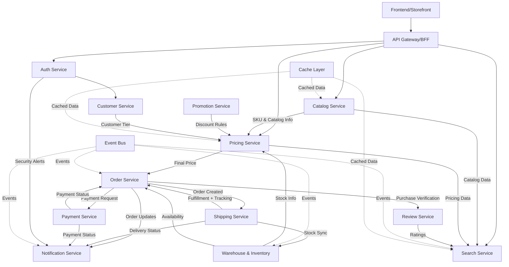

# Event-Driven Flow Diagram

## Main Event Flow Diagram

## Flow Description

### 1. User Authentication & Authorization
- **Frontend** communicates through **API Gateway**
- **Auth Service** handles authentication and authorization
- **Customer Service** manages user profiles and preferences

### 2. Product Discovery & Search
- **Search Service** provides fast product discovery with Elasticsearch
- **Catalog Service** supplies product catalog data to search index
- **Review Service** contributes ratings and reviews to search results

### 3. Pricing Calculation (SKU + Warehouse Based)
- **Pricing Service** acts as central price calculator
- Receives SKU and product info from **Catalog Service**
- Applies discount rules from **Promotion Service** (per SKU + Warehouse)
- Considers customer tiers from **Customer Service**
- Uses warehouse-specific pricing from **Warehouse & Inventory**

### 4. Order Processing
- **Order Service** orchestrates the complete order lifecycle
- **Payment Service** handles secure payment processing
- **Warehouse & Inventory** manages stock reservation and allocation

### 5. Fulfillment & Delivery
- **Shipping Service** manages fulfillment and carrier integration
- Updates inventory levels after delivery
- Provides tracking information

### 6. Communication & Events
- **Event Bus** enables asynchronous communication between services
- **Notification Service** sends multi-channel notifications
- **Cache Layer** optimizes performance for frequently accessed data

### 7. Observability
- **Monitoring & Logging** provides system observability
- **File Storage/CDN** handles media and static content delivery