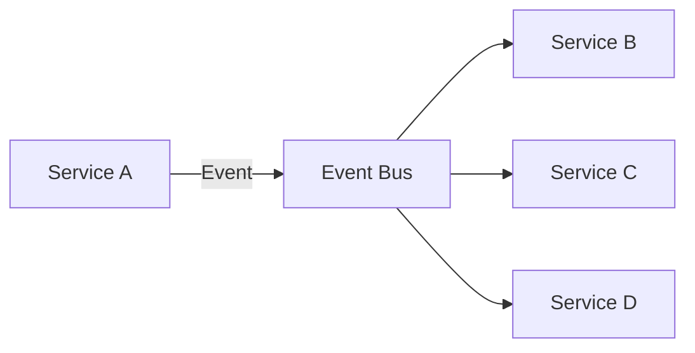
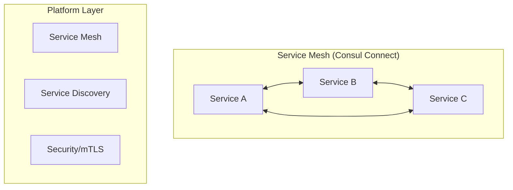
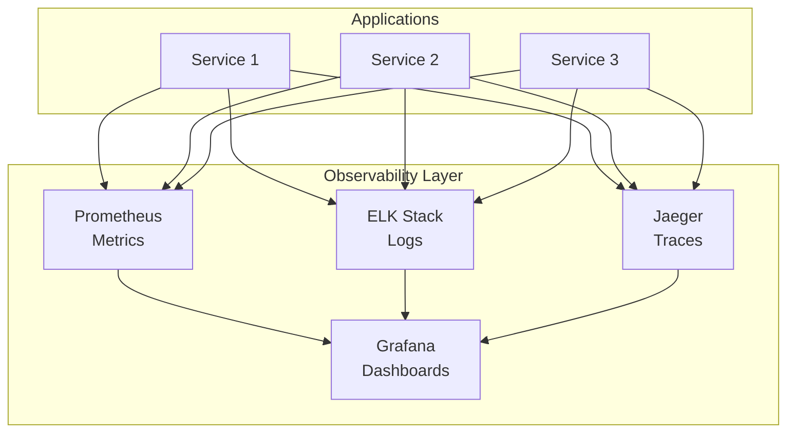

# 4-Layer Cloud-Native Architecture - Benefits & Rationale

## Why 4-Layer Architecture?

### 🎯 Scalability & Maintainability Benefits

#### **Clear Separation of Concerns**
```
🎨 Layer 1: Presentation     → User Experience & Interface
🏢 Layer 2: Application      → Business Logic & Domain Services  
🔧 Layer 3: Infrastructure   → Supporting Services
☁️ Layer 4: Platform/Runtime → Cloud-Native Infrastructure
```

#### **Independent Scaling**
- **Layer 1 (Presentation)**: Scale based on user traffic
- **Layer 2 (Application)**: Scale individual business services based on demand
- **Layer 3 (Infrastructure)**: Scale supporting services independently
- **Layer 4 (Platform)**: Scale infrastructure components (cache, messaging, storage)

#### **Technology Flexibility**
- **Layer 1**: Different frontend technologies (React, Vue, Flutter)
- **Layer 2**: Different languages per service (Go, Node.js, Python)
- **Layer 3**: Specialized technologies (Elasticsearch for Search)
- **Layer 4**: Best-in-class infrastructure tools (Redis, Consul, Dapr)

---

## 🏗️ Architecture Comparison

### 3-Layer vs 4-Layer Architecture

| Aspect | 3-Layer | 4-Layer Cloud-Native |
|--------|---------|---------------------|
| **Separation** | Mixed infrastructure concerns | Clear platform separation |
| **Scalability** | Limited granular scaling | Independent layer scaling |
| **Maintainability** | Infrastructure mixed with services | Clean infrastructure abstraction |
| **Cloud-Native** | Basic cloud support | Full cloud-native patterns |
| **DevOps** | Manual infrastructure management | Automated platform operations |
| **Monitoring** | Basic monitoring | Comprehensive observability |

---

## 📊 Layer Responsibilities

### 🎨 Layer 1: Presentation Layer
**Purpose**: User interaction and experience
- **Components**: Frontend apps, mobile apps, API Gateway
- **Scaling**: Based on user traffic and geographic distribution
- **Technology**: React/Vue/Angular, Flutter, Kong/Nginx
- **Concerns**: UI/UX, routing, load balancing

### 🏢 Layer 2: Application Services Layer  
**Purpose**: Core business logic and domain services
- **Components**: 11 business microservices (Catalog, Order, Payment, etc.)
- **Scaling**: Based on business demand and service-specific load
- **Technology**: Go-Kratos framework, gRPC, HTTP APIs
- **Concerns**: Business rules, data processing, service orchestration

### 🔧 Layer 3: Infrastructure Services Layer
**Purpose**: Supporting services for application layer
- **Components**: 4 infrastructure services (Auth, User, Search, Notification)
- **Scaling**: Based on cross-cutting concerns and shared functionality
- **Technology**: Go-Kratos framework, specialized tools (Elasticsearch)
- **Concerns**: Authentication, search, notifications, user management

### ☁️ Layer 4: Platform & Runtime Layer
**Purpose**: Cloud-native infrastructure and runtime
- **Components**: Dapr, Consul, Redis, monitoring stack
- **Scaling**: Based on infrastructure load and system requirements
- **Technology**: Dapr, Consul, Redis, Prometheus, Jaeger
- **Concerns**: Service mesh, event streaming, observability, storage

---

## 🚀 Cloud-Native Benefits

### **Event-Driven Architecture**

- **Loose Coupling**: Services communicate via events
- **Resilience**: Failure in one service doesn't cascade
- **Scalability**: Event bus handles traffic spikes

### **Service Mesh Integration**

- **Security**: Automatic mTLS between services
- **Observability**: Traffic monitoring and tracing
- **Reliability**: Circuit breakers and retries

### **Observability Stack**


---

## 🔧 Implementation Benefits

### **Development Experience**
- **Clear Boundaries**: Developers know exactly where to implement features
- **Independent Development**: Teams can work on different layers simultaneously
- **Technology Choice**: Each layer can use optimal technology stack
- **Testing Strategy**: Layer-specific testing approaches

### **Deployment & Operations**
- **Independent Deployment**: Deploy layers independently
- **Rolling Updates**: Update services without affecting other layers
- **Blue-Green Deployment**: Layer-level deployment strategies
- **Canary Releases**: Gradual rollout per layer

### **Monitoring & Debugging**
- **Layer-Specific Metrics**: Monitor each layer independently
- **Distributed Tracing**: Track requests across all layers
- **Centralized Logging**: Aggregate logs from all layers
- **Health Checks**: Layer-specific health monitoring

---

## 📈 Scalability Patterns

### **Horizontal Scaling**
```yaml
Layer 1 (Presentation):
  - API Gateway: 3+ instances behind load balancer
  - Frontend: CDN distribution globally

Layer 2 (Application):
  - Each service: 2-10 instances based on load
  - Auto-scaling based on CPU/memory/custom metrics

Layer 3 (Infrastructure):
  - Auth Service: 3+ instances for high availability
  - Search Service: Elasticsearch cluster

Layer 4 (Platform):
  - Redis: Cluster mode with sharding
  - Consul: 3-5 node cluster
  - Monitoring: Distributed across nodes
```

### **Vertical Scaling**
```yaml
Resource Allocation by Layer:
  Layer 1: CPU-optimized (request handling)
  Layer 2: Balanced (business logic processing)
  Layer 3: Memory-optimized (search, caching)
  Layer 4: I/O-optimized (storage, messaging)
```

---

## 🛡️ Security Benefits

### **Defense in Depth**
```
Layer 1: WAF, DDoS protection, API rate limiting
Layer 2: Service-to-service authentication, input validation
Layer 3: RBAC, data encryption, audit logging
Layer 4: Network security, secrets management, mTLS
```

### **Zero Trust Architecture**
- **Layer 1**: External traffic validation
- **Layer 2**: Service identity verification
- **Layer 3**: Permission-based access control
- **Layer 4**: Infrastructure-level security

---

## 📋 Migration Strategy

### **Phased Approach**
```
Phase 1: Setup Layer 4 (Platform infrastructure)
Phase 2: Implement Layer 3 (Infrastructure services)
Phase 3: Migrate Layer 2 (Application services)
Phase 4: Optimize Layer 1 (Presentation layer)
```

### **Risk Mitigation**
- **Layer Independence**: Failure in one layer doesn't affect others
- **Gradual Migration**: Migrate one layer at a time
- **Rollback Strategy**: Easy rollback per layer
- **Testing**: Comprehensive testing at each layer

---

## 🎯 Success Metrics

### **Technical Metrics**
- **Availability**: 99.9% per layer
- **Performance**: <200ms response time across layers
- **Scalability**: 10x traffic handling capability
- **Maintainability**: <2 hours for service updates

### **Business Metrics**
- **Development Velocity**: 50% faster feature delivery
- **Operational Efficiency**: 60% reduction in deployment time
- **Cost Optimization**: 30% infrastructure cost reduction
- **Team Productivity**: Independent team scaling

---

## 🚀 Conclusion

The 4-Layer Cloud-Native Architecture provides:

1. **Better Scalability**: Independent scaling of each layer
2. **Improved Maintainability**: Clear separation of concerns
3. **Enhanced Reliability**: Fault isolation between layers
4. **Operational Excellence**: Cloud-native best practices
5. **Future-Proof**: Ready for cloud-native evolution

This architecture enables the e-commerce platform to scale efficiently, maintain high availability, and adapt to changing business requirements while providing excellent developer experience and operational efficiency.