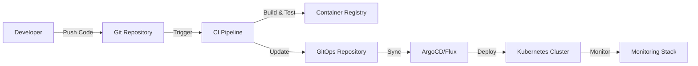

# Deployment Guide

## Deployment Architecture

### Environment Strategy
```
┌─────────────────────────────────────────────────────────────┐
│                    Environment Pipeline                     │
├─────────────────────────────────────────────────────────────┤
│  Development → Staging → Pre-Production → Production       │
│      ↓            ↓           ↓              ↓             │
│   Feature     Integration   Performance    Live Traffic    │
│   Testing      Testing       Testing                       │
└─────────────────────────────────────────────────────────────┘
```

### Kubernetes Deployment

#### Namespace Strategy
```yaml
namespaces:
  # Application Services
  - name: catalog-service
    resources:
      cpu: "2000m"
      memory: "4Gi"
      
  - name: order-service
    resources:
      cpu: "4000m"
      memory: "8Gi"
      
  # Infrastructure Services
  - name: infrastructure
    services: [api-gateway, event-bus, cache, monitoring]
    
  # Shared Services
  - name: shared-services
    services: [auth-service, user-service, notification-service]
```

#### Service Deployment Configuration
```yaml
# Example: Order Service Deployment
apiVersion: apps/v1
kind: Deployment
metadata:
  name: order-service
  namespace: order-service
spec:
  replicas: 3
  selector:
    matchLabels:
      app: order-service
  template:
    metadata:
      labels:
        app: order-service
    spec:
      containers:
      - name: order-service
        image: order-service:v1.0.0
        ports:
        - containerPort: 8080
        env:
        - name: DATABASE_URL
          valueFrom:
            secretKeyRef:
              name: order-service-secrets
              key: database-url
        resources:
          requests:
            cpu: 1000m
            memory: 2Gi
          limits:
            cpu: 2000m
            memory: 4Gi
        livenessProbe:
          httpGet:
            path: /health
            port: 8080
          initialDelaySeconds: 30
          periodSeconds: 10
        readinessProbe:
          httpGet:
            path: /ready
            port: 8080
          initialDelaySeconds: 5
          periodSeconds: 5
```

## CI/CD Pipeline

### Pipeline Stages
```yaml
stages:
  1_build:
    - code_checkout
    - dependency_installation
    - unit_tests
    - code_quality_checks
    - security_scanning
    - docker_build
    
  2_test:
    - integration_tests
    - contract_tests
    - performance_tests
    - security_tests
    
  3_deploy_staging:
    - deploy_to_staging
    - smoke_tests
    - end_to_end_tests
    
  4_deploy_production:
    - manual_approval
    - blue_green_deployment
    - health_checks
    - rollback_capability
```

### GitOps Workflow


## Blue-Green Deployment

### Deployment Strategy
```yaml
blue_green_deployment:
  # Blue Environment (Current Production)
  blue:
    version: "v1.0.0"
    traffic_percentage: 100
    
  # Green Environment (New Version)
  green:
    version: "v1.1.0"
    traffic_percentage: 0
    
  # Cutover Process
  cutover:
    1. Deploy to green environment
    2. Run health checks
    3. Gradually shift traffic (10%, 25%, 50%, 100%)
    4. Monitor metrics and errors
    5. Complete cutover or rollback
```

### Traffic Routing
```yaml
# Istio VirtualService for traffic splitting
apiVersion: networking.istio.io/v1beta1
kind: VirtualService
metadata:
  name: order-service
spec:
  hosts:
  - order-service
  http:
  - match:
    - headers:
        canary:
          exact: "true"
    route:
    - destination:
        host: order-service
        subset: green
  - route:
    - destination:
        host: order-service
        subset: blue
      weight: 90
    - destination:
        host: order-service
        subset: green
      weight: 10
```

## Database Migration

### Migration Strategy
```yaml
database_migration:
  approach: "expand_and_contract"
  
  phases:
    1_expand:
      - Add new columns/tables
      - Maintain backward compatibility
      - Dual write to old and new schema
      
    2_migrate:
      - Migrate existing data
      - Validate data consistency
      - Switch reads to new schema
      
    3_contract:
      - Remove old columns/tables
      - Clean up deprecated code
      - Optimize new schema
```

### Zero-Downtime Migration
```sql
-- Example: Adding new column with default value
ALTER TABLE orders 
ADD COLUMN fulfillment_status VARCHAR(50) 
DEFAULT 'pending' NOT NULL;

-- Create index concurrently
CREATE INDEX CONCURRENTLY idx_orders_fulfillment_status 
ON orders(fulfillment_status);

-- Backfill data in batches
UPDATE orders 
SET fulfillment_status = 'completed' 
WHERE status = 'delivered' 
AND fulfillment_status = 'pending';
```

## Monitoring & Observability

### Health Check Endpoints
```yaml
health_checks:
  liveness:
    path: /health
    description: "Service is running"
    
  readiness:
    path: /ready
    description: "Service is ready to accept traffic"
    dependencies:
      - database_connection
      - external_service_connectivity
      
  startup:
    path: /startup
    description: "Service has completed initialization"
```

### Deployment Metrics
```json
{
  "deployment_metrics": {
    "deployment_frequency": "Daily",
    "lead_time": "< 2 hours",
    "mttr": "< 15 minutes",
    "change_failure_rate": "< 5%"
  }
}
```

## Rollback Procedures

### Automated Rollback Triggers
```yaml
rollback_triggers:
  error_rate:
    threshold: 5%
    window: 5m
    
  response_time:
    threshold: 2000ms
    percentile: 95
    window: 5m
    
  health_check_failures:
    threshold: 3
    window: 2m
```

### Manual Rollback Process
```bash
# Quick rollback using kubectl
kubectl rollout undo deployment/order-service -n order-service

# Rollback to specific revision
kubectl rollout undo deployment/order-service --to-revision=2

# Check rollback status
kubectl rollout status deployment/order-service -n order-service
```

## Security in Deployment

### Container Security
```yaml
security_policies:
  # Pod Security Standards
  pod_security:
    level: "restricted"
    
  # Network Policies
  network_policies:
    - deny_all_ingress
    - allow_specific_services
    
  # Security Contexts
  security_context:
    runAsNonRoot: true
    runAsUser: 1000
    readOnlyRootFilesystem: true
    allowPrivilegeEscalation: false
```

### Secrets Management
```yaml
secrets:
  # Database credentials
  database_secrets:
    type: kubernetes.io/basic-auth
    data:
      username: <base64-encoded>
      password: <base64-encoded>
      
  # External service API keys
  api_keys:
    type: Opaque
    data:
      payment_gateway_key: <base64-encoded>
      email_service_key: <base64-encoded>
```

## Disaster Recovery

### Backup Strategy
```yaml
backup_strategy:
  databases:
    frequency: "every 6 hours"
    retention: "30 days"
    cross_region: true
    
  application_data:
    frequency: "daily"
    retention: "90 days"
    
  configuration:
    frequency: "on change"
    retention: "1 year"
```

### Recovery Procedures
```yaml
recovery_procedures:
  rto: "1 hour"  # Recovery Time Objective
  rpo: "15 minutes"  # Recovery Point Objective
  
  steps:
    1. Assess damage and scope
    2. Activate disaster recovery site
    3. Restore data from backups
    4. Validate system functionality
    5. Redirect traffic to recovery site
    6. Monitor and stabilize
```