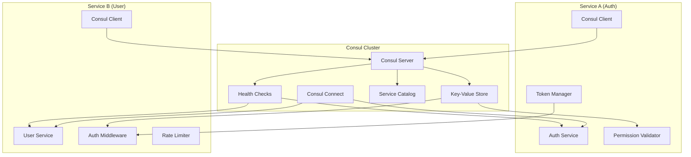

# Service Permission Matrix - Zero Trust Architecture with Consul

## Overview
The Service Permission Matrix implements **Zero Trust security** for service-to-service communication using **Consul** as the backbone for service discovery, configuration management, and security policy enforcement. Every internal API call is authenticated and authorized with granular, endpoint-level permissions.

## Architecture Philosophy

### Zero Trust Principles
1. **Never trust, always verify** - Every service call is authenticated
2. **Least privilege access** - Services get only the permissions they need
3. **Explicit permissions** - All access must be explicitly granted
4. **Audit everything** - Complete logging of all service interactions
5. **Fail secure** - Default deny for all unauthorized access
6. **Dynamic discovery** - Services discover each other through Consul
7. **Centralized policy** - Permissions managed centrally in Consul KV

### Consul-Integrated Security Flow
```
┌─────────────────────────────────────────────────────────────────────────────┐
│              Consul-Integrated Service Security Flow                       │
└─────────────────────────────────────────────────────────────────────────────┘

Service A ──────request──────▶ Service B
    │                            │
    ├─ Query Consul for Service B ├─ Validate service token
    ├─ Load permissions from KV   ├─ Check endpoint permissions  
    ├─ Generate service token     ├─ Verify method + path access
    ├─ Include user context       ├─ Log to audit trail
    └─ Make authenticated call    └─ Process authorized request

                    ▲
                    │
            ┌───────▼───────┐
            │ Consul Cluster│
            │ ┌───────────┐ │
            │ │Service    │ │
            │ │Discovery  │ │
            │ ├───────────┤ │
            │ │Permission │ │
            │ │Matrix (KV)│ │
            │ ├───────────┤ │
            │ │Health     │ │
            │ │Checks     │ │
            │ └───────────┘ │
            └───────────────┘
```

## Consul Integration Architecture

### Consul Components


## Consul-Based Permission Matrix Configuration

### Consul KV Store Structure
```bash
# Consul KV hierarchy for service permissions
consul kv put service-permissions/version "2.0"
consul kv put service-permissions/last_updated "2024-01-15T10:30:00Z"

# Service discovery configuration
consul kv put services/auth-service/config '{...}'
consul kv put services/user-service/config '{...}'

# Permission matrix stored in Consul KV
consul kv put service-permissions/auth-service/user-service '{...}'
consul kv put service-permissions/order-service/payment-service '{...}'
```

### Service Registration with Consul
```go
// Service registration with capabilities and permissions
func RegisterServiceWithConsul(serviceName string, port int, capabilities []string) error {
    registration := &consul.AgentServiceRegistration{
        ID:      fmt.Sprintf("%s-%s", serviceName, instanceID),
        Name:    serviceName,
        Address: getLocalIP(),
        Port:    port,
        Tags:    []string{"v1.2.0", "microservice"},
        Meta: map[string]string{
            "version":      "v1.2.0",
            "capabilities": strings.Join(capabilities, ","),
            "permissions":  getServicePermissions(serviceName),
        },
        Check: &consul.AgentServiceCheck{
            HTTP:                           fmt.Sprintf("http://%s:%d/health", getLocalIP(), port),
            Interval:                       "10s",
            Timeout:                        "3s",
            DeregisterCriticalServiceAfter: "30s",
        },
    }
    
    return consulClient.Agent().ServiceRegister(registration)
}
```

### Permission Matrix in Consul KV
```bash
# Auth Service -> User Service permissions
consul kv put service-permissions/auth-service/user-service '{
  "permissions": ["user:read", "user:validate"],
  "endpoints": [
    {"path": "/v1/user/profile", "methods": ["GET"]},
    {"path": "/v1/user/validate", "methods": ["POST"]}
  ],
  "denied_endpoints": [
    {"path": "/v1/user/profile", "methods": ["PUT", "DELETE"]}
  ],
  "rate_limit": 1000,
  "timeout": "30s",
  "retry_attempts": 3,
  "circuit_breaker": {
    "failure_threshold": 5,
    "recovery_timeout": "60s"
  },
  "description": "Auth service user validation access"
}'

# Order Service -> User Service permissions  
consul kv put service-permissions/order-service/user-service '{
  "permissions": ["user:read", "user:address:write"],
  "endpoints": [
    {"path": "/v1/user/profile", "methods": ["GET"]},
    {"path": "/v1/user/addresses", "methods": ["GET", "POST", "PUT"]}
  ],
  "denied_endpoints": [
    {"path": "/v1/user/profile", "methods": ["PUT", "DELETE"]}
  ],
  "rate_limit": 800,
  "timeout": "30s",
  "description": "Order service user data access"
}'

# Order Service -> Payment Service permissions
consul kv put service-permissions/order-service/payment-service '{
  "permissions": ["payment:create", "payment:read"],
  "endpoints": [
    {"path": "/v1/payments", "methods": ["GET", "POST"]},
    {"path": "/v1/payment-methods", "methods": ["GET"]}
  ],
  "rate_limit": 200,
  "timeout": "45s",
  "description": "Order service payment processing"
}'
```

### Service Configuration in Consul KV
```bash
# Service discovery and capability information
consul kv put services/user-service/config '{
  "service_name": "user-service",
  "version": "v1.2.0",
  "address": "user-service.internal",
  "port": 8001,
  "health_endpoint": "/health",
  "capabilities_endpoint": "/capabilities",
  "swagger_endpoint": "/swagger/index.html",
  "capabilities": [
    "/v1/user/profile",
    "/v1/user/validate",
    "/v1/user/addresses",
    "/v1/user/preferences"
  ],
  "permissions": [
    "user:read",
    "user:write", 
    "user:validate",
    "user:address:read",
    "user:address:write",
    "user:preferences:read",
    "user:preferences:write"
  ],
  "load_balancing": "round_robin",
  "max_connections": 100,
  "connection_timeout": "5s"
}'

consul kv put services/payment-service/config '{
  "service_name": "payment-service",
  "version": "v1.1.0", 
  "address": "payment-service.internal",
  "port": 8003,
  "health_endpoint": "/health",
  "capabilities": [
    "/v1/payments",
    "/v1/payment-methods",
    "/v1/payment-history"
  ],
  "permissions": [
    "payment:create",
    "payment:read",
    "payment:update",
    "payment:refund"
  ]
}'
```

### Configuration Structure
### Complete Permission Matrix Examples

#### Core Business Service Permissions
```bash
# User Service Permissions  
consul kv put service-permissions/user-service/order-service '{
  "permissions": ["order:create", "order:read"],
  "endpoints": [
    {"path": "/v1/orders", "methods": ["GET", "POST"]},
    {"path": "/v1/orders/{id}", "methods": ["GET"]}
  ],
  "rate_limit": 500,
  "timeout": "30s",
  "retry_attempts": 2,
  "description": "User service order management"
}'

consul kv put service-permissions/user-service/customer-service '{
  "permissions": ["customer:read", "customer:update"],
  "endpoints": [
    {"path": "/v1/customers/{id}", "methods": ["GET", "PUT"]},
    {"path": "/v1/customers/{id}/preferences", "methods": ["GET", "PUT"]}
  ],
  "rate_limit": 300,
  "description": "User service customer data access"
}'

# Order Service Permissions
consul kv put service-permissions/order-service/inventory-service '{
  "permissions": ["inventory:read", "inventory:reserve"],
  "endpoints": [
    {"path": "/v1/inventory/check", "methods": ["POST"]},
    {"path": "/v1/inventory/reserve", "methods": ["POST"]},
    {"path": "/v1/inventory/release", "methods": ["POST"]}
  ],
  "rate_limit": 1000,
  "timeout": "15s",
  "circuit_breaker": {
    "failure_threshold": 3,
    "recovery_timeout": "30s"
  },
  "description": "Order service inventory management"
}'

# Payment Service Permissions
consul kv put service-permissions/payment-service/user-service '{
  "permissions": ["user:payment:read"],
  "endpoints": [
    {"path": "/v1/user/payment-methods", "methods": ["GET"]}
  ],
  "denied_endpoints": [
    {"path": "/v1/user/profile", "methods": ["PUT", "DELETE"]},
    {"path": "/v1/user/addresses", "methods": ["POST", "PUT", "DELETE"]}
  ],
  "rate_limit": 300,
  "description": "Payment service payment method access"
}'

consul kv put service-permissions/payment-service/order-service '{
  "permissions": ["order:read", "order:update"],
  "endpoints": [
    {"path": "/v1/orders/{id}", "methods": ["GET", "PUT"]},
    {"path": "/v1/orders/{id}/status", "methods": ["PUT"]}
  ],
  "rate_limit": 500,
  "description": "Payment service order status updates"
}'

# Notification Service Permissions
consul kv put service-permissions/notification-service/user-service '{
  "permissions": ["user:contact:read"],
  "endpoints": [
    {"path": "/v1/user/contact", "methods": ["GET"]},
    {"path": "/v1/user/preferences/notifications", "methods": ["GET"]}
  ],
  "rate_limit": 1000,
  "description": "Notification service contact information"
}'

consul kv put service-permissions/notification-service/order-service '{
  "permissions": ["order:read"],
  "endpoints": [
    {"path": "/v1/orders/{id}", "methods": ["GET"]}
  ],
  "rate_limit": 500,
  "description": "Notification service order information"
}'

# Admin Service Permissions (Full Access)
consul kv put service-permissions/admin-service/user-service '{
  "permissions": ["user:admin:all"],
  "endpoints": [
    {"path": "/v1/user/*", "methods": ["GET", "POST", "PUT", "DELETE"]},
    {"path": "/admin/*", "methods": ["GET", "POST", "PUT", "DELETE"]}
  ],
  "rate_limit": 2000,
  "description": "Admin service full user management"
}'

consul kv put service-permissions/admin-service/order-service '{
  "permissions": ["order:admin:all"],
  "endpoints": [
    {"path": "/v1/orders/*", "methods": ["GET", "POST", "PUT", "DELETE"]},
    {"path": "/admin/*", "methods": ["GET", "POST", "PUT", "DELETE"]}
  ],
  "rate_limit": 2000,
  "description": "Admin service full order management"
}'
```

## Consul Service Discovery + Token Implementation

### Consul Service Manager
```go
type ConsulServiceManager struct {
    client           *consul.Client
    permissionCache  map[string]ServicePermission
    serviceCache     map[string]ServiceInfo
    cacheTTL         time.Duration
    lastUpdate       time.Time
    watchPlans       map[string]*consul.WatchPlan
}

type ServiceInfo struct {
    Name         string            `json:"name"`
    Address      string            `json:"address"`
    Port         int               `json:"port"`
    Tags         []string          `json:"tags"`
    Meta         map[string]string `json:"meta"`
    Version      string            `json:"version"`
    Capabilities []string          `json:"capabilities"`
    Permissions  []string          `json:"permissions"`
}

type ServicePermission struct {
    Permissions      []string          `json:"permissions"`
    Endpoints        []EndpointRule    `json:"endpoints"`
    DeniedEndpoints  []EndpointRule    `json:"denied_endpoints"`
    RateLimit        int               `json:"rate_limit"`
    Timeout          string            `json:"timeout"`
    RetryAttempts    int               `json:"retry_attempts"`
    CircuitBreaker   CircuitBreakerConfig `json:"circuit_breaker"`
    Description      string            `json:"description"`
}

type EndpointRule struct {
    Path    string   `json:"path"`
    Methods []string `json:"methods"`
}

type CircuitBreakerConfig struct {
    FailureThreshold int    `json:"failure_threshold"`
    RecoveryTimeout  string `json:"recovery_timeout"`
}
```

### Enhanced Service Token Structure
```go
type ServiceToken struct {
    FromService      string               `json:"from_service"`
    ToService        string               `json:"to_service"`
    Permissions      []string             `json:"permissions"`
    AllowedPaths     []string             `json:"allowed_paths"`
    DeniedPaths      []string             `json:"denied_paths"`
    ExpiresAt        time.Time            `json:"expires_at"`
    IssuedAt         time.Time            `json:"issued_at"`
    TokenID          string               `json:"token_id"`
    RateLimit        int                  `json:"rate_limit"`
    ConsulSessionID  string               `json:"consul_session_id"`
    ServiceVersion   string               `json:"service_version"`
    CircuitBreaker   CircuitBreakerConfig `json:"circuit_breaker"`
}
```

### Consul-Integrated Service Discovery
```go
func NewConsulServiceManager() *ConsulServiceManager {
    config := consul.DefaultConfig()
    client, _ := consul.NewClient(config)
    
    csm := &ConsulServiceManager{
        client:          client,
        permissionCache: make(map[string]ServicePermission),
        serviceCache:    make(map[string]ServiceInfo),
        cacheTTL:        5 * time.Minute,
        watchPlans:      make(map[string]*consul.WatchPlan),
    }
    
    // Start watching for permission updates
    csm.WatchPermissionUpdates()
    
    return csm
}

// Discover service and load permissions
func (csm *ConsulServiceManager) DiscoverServiceWithPermissions(fromService, toService string) (*ServiceInfo, *ServicePermission, error) {
    // 1. Service Discovery
    serviceInfo, err := csm.discoverService(toService)
    if err != nil {
        return nil, nil, fmt.Errorf("service discovery failed: %w", err)
    }
    
    // 2. Load Permissions from Consul KV
    permissions, err := csm.loadServicePermissions(fromService, toService)
    if err != nil {
        return nil, nil, fmt.Errorf("permission loading failed: %w", err)
    }
    
    return serviceInfo, permissions, nil
}

func (csm *ConsulServiceManager) discoverService(serviceName string) (*ServiceInfo, error) {
    // Check cache first
    if cached, exists := csm.serviceCache[serviceName]; exists {
        if time.Since(csm.lastUpdate) < csm.cacheTTL {
            return &cached, nil
        }
    }
    
    // Query Consul for healthy service instances
    services, _, err := csm.client.Health().Service(serviceName, "", true, nil)
    if err != nil {
        return nil, err
    }
    
    if len(services) == 0 {
        return nil, fmt.Errorf("no healthy instances of %s found", serviceName)
    }
    
    // Select service instance (round-robin, random, etc.)
    service := services[0].Service
    
    serviceInfo := ServiceInfo{
        Name:         serviceName,
        Address:      service.Address,
        Port:         service.Port,
        Tags:         service.Tags,
        Meta:         service.Meta,
        Version:      service.Meta["version"],
        Capabilities: strings.Split(service.Meta["capabilities"], ","),
        Permissions:  strings.Split(service.Meta["permissions"], ","),
    }
    
    // Cache the result
    csm.serviceCache[serviceName] = serviceInfo
    csm.lastUpdate = time.Now()
    
    return &serviceInfo, nil
}

func (csm *ConsulServiceManager) loadServicePermissions(fromService, toService string) (*ServicePermission, error) {
    key := fmt.Sprintf("service-permissions/%s/%s", fromService, toService)
    
    // Check cache
    if cached, exists := csm.permissionCache[key]; exists {
        return &cached, nil
    }
    
    // Load from Consul KV
    kvPair, _, err := csm.client.KV().Get(key, nil)
    if err != nil {
        return nil, err
    }
    
    if kvPair == nil {
        return nil, fmt.Errorf("no permissions found for %s -> %s", fromService, toService)
    }
    
    var permission ServicePermission
    if err := json.Unmarshal(kvPair.Value, &permission); err != nil {
        return nil, err
    }
    
    // Cache the permission
    csm.permissionCache[key] = permission
    
    return &permission, nil
}
```

### Dynamic Permission Updates via Consul Watch
```go
func (csm *ConsulServiceManager) WatchPermissionUpdates() {
    // Watch for permission changes
    watchParams := map[string]interface{}{
        "type":   "keyprefix",
        "prefix": "service-permissions/",
    }
    
    plan, err := consul.NewWatchPlan(watchParams)
    if err != nil {
        log.Fatal("Failed to create watch plan:", err)
    }
    
    plan.Handler = func(idx uint64, data interface{}) {
        if kvPairs, ok := data.(consul.KVPairs); ok {
            csm.updatePermissionCache(kvPairs)
        }
    }
    
    go plan.Run(csm.client.Address())
}

func (csm *ConsulServiceManager) updatePermissionCache(kvPairs consul.KVPairs) {
    for _, kvPair := range kvPairs {
        var permission ServicePermission
        if err := json.Unmarshal(kvPair.Value, &permission); err != nil {
            log.Printf("Failed to unmarshal permission: %v", err)
            continue
        }
        
        // Update cache
        csm.permissionCache[kvPair.Key] = permission
        
        // Notify services of permission changes
        csm.notifyPermissionUpdate(kvPair.Key, permission)
        
        log.Printf("Updated permission cache for %s", kvPair.Key)
    }
}
```

### Token Generation with Consul Integration
```go
type ConsulTokenManager struct {
    consulManager *ConsulServiceManager
    signingKey    []byte
    tokenTTL      time.Duration
}

// Generate token with Consul-loaded permissions
func (ctm *ConsulTokenManager) GenerateToken(fromService, toService string) (*ServiceToken, error) {
    // Load permissions from Consul
    _, permissions, err := ctm.consulManager.DiscoverServiceWithPermissions(fromService, toService)
    if err != nil {
        return nil, fmt.Errorf("failed to load permissions: %w", err)
    }
    
    // Create Consul session for token tracking
    sessionID, err := ctm.createConsulSession(fromService, toService)
    if err != nil {
        return nil, fmt.Errorf("failed to create consul session: %w", err)
    }
    
    // Build allowed and denied paths from permissions
    allowedPaths := ctm.buildAllowedPaths(permissions.Endpoints)
    deniedPaths := ctm.buildDeniedPaths(permissions.DeniedEndpoints)
    
    token := &ServiceToken{
        FromService:     fromService,
        ToService:       toService,
        Permissions:     permissions.Permissions,
        AllowedPaths:    allowedPaths,
        DeniedPaths:     deniedPaths,
        ExpiresAt:       time.Now().Add(ctm.tokenTTL),
        IssuedAt:        time.Now(),
        TokenID:         generateTokenID(),
        RateLimit:       permissions.RateLimit,
        ConsulSessionID: sessionID,
        CircuitBreaker:  permissions.CircuitBreaker,
    }
    
    return token, nil
}

func (ctm *ConsulTokenManager) createConsulSession(fromService, toService string) (string, error) {
    sessionEntry := &consul.SessionEntry{
        Name:      fmt.Sprintf("service-token-%s-%s", fromService, toService),
        TTL:       ctm.tokenTTL.String(),
        Behavior:  consul.SessionBehaviorDelete,
        LockDelay: 1 * time.Second,
    }
    
    sessionID, _, err := ctm.consulManager.client.Session().Create(sessionEntry, nil)
    return sessionID, err
}

func (ctm *ConsulTokenManager) buildAllowedPaths(endpoints []EndpointRule) []string {
    var paths []string
    for _, endpoint := range endpoints {
        for _, method := range endpoint.Methods {
            paths = append(paths, fmt.Sprintf("%s:%s", method, endpoint.Path))
        }
    }
    return paths
}

func (ctm *ConsulTokenManager) buildDeniedPaths(endpoints []EndpointRule) []string {
    var paths []string
    for _, endpoint := range endpoints {
        for _, method := range endpoint.Methods {
            paths = append(paths, fmt.Sprintf("%s:%s", method, endpoint.Path))
        }
    }
    return paths
}
```

### Consul-Integrated Token Validation
```go
type ConsulServiceTokenValidator struct {
    consulManager    *ConsulServiceManager
    signingKey       []byte
    circuitBreakers  map[string]*CircuitBreaker
    rateLimiters     map[string]*RateLimiter
}

func NewConsulServiceTokenValidator(consulManager *ConsulServiceManager, signingKey []byte) *ConsulServiceTokenValidator {
    return &ConsulServiceTokenValidator{
        consulManager:   consulManager,
        signingKey:      signingKey,
        circuitBreakers: make(map[string]*CircuitBreaker),
        rateLimiters:    make(map[string]*RateLimiter),
    }
}

func (cstv *ConsulServiceTokenValidator) ValidateServiceCall(token, method, path string) error {
    // 1. Parse and verify token signature
    serviceToken, err := cstv.parseAndVerifyToken(token)
    if err != nil {
        return fmt.Errorf("invalid service token: %w", err)
    }

    // 2. Check token expiration
    if time.Now().After(serviceToken.ExpiresAt) {
        return fmt.Errorf("service token expired")
    }

    // 3. Validate Consul session (if exists)
    if serviceToken.ConsulSessionID != "" {
        if err := cstv.validateConsulSession(serviceToken.ConsulSessionID); err != nil {
            return fmt.Errorf("consul session invalid: %w", err)
        }
    }

    // 4. Check circuit breaker
    circuitBreakerKey := fmt.Sprintf("%s->%s", serviceToken.FromService, serviceToken.ToService)
    if cb, exists := cstv.circuitBreakers[circuitBreakerKey]; exists {
        if cb.IsOpen() {
            return fmt.Errorf("circuit breaker open for %s", circuitBreakerKey)
        }
    }

    // 5. Check rate limiting
    rateLimitKey := fmt.Sprintf("%s->%s", serviceToken.FromService, serviceToken.ToService)
    if rl, exists := cstv.rateLimiters[rateLimitKey]; exists {
        if !rl.Allow() {
            return fmt.Errorf("rate limit exceeded for %s", rateLimitKey)
        }
    }

    // 6. Validate service permissions
    requestPath := fmt.Sprintf("%s:%s", method, path)
    
    // Check denied paths first (explicit deny takes precedence)
    for _, deniedPath := range serviceToken.DeniedPaths {
        if cstv.matchPath(requestPath, deniedPath) {
            return fmt.Errorf("access explicitly denied: %s for %s", 
                requestPath, serviceToken.FromService)
        }
    }
    
    // Check allowed paths
    for _, allowedPath := range serviceToken.AllowedPaths {
        if cstv.matchPath(requestPath, allowedPath) {
            return nil // Access granted
        }
    }
    
    return fmt.Errorf("access denied: %s not in allowed paths for %s", 
        requestPath, serviceToken.FromService)
}

func (cstv *ConsulServiceTokenValidator) validateConsulSession(sessionID string) error {
    sessionInfo, _, err := cstv.consulManager.client.Session().Info(sessionID, nil)
    if err != nil {
        return err
    }
    
    if sessionInfo == nil {
        return fmt.Errorf("consul session not found")
    }
    
    return nil
}

func (cstv *ConsulServiceTokenValidator) matchPath(requestPath, rulePath string) bool {
    // Support wildcards: GET:/v1/user/* matches GET:/v1/user/profile
    if strings.HasSuffix(rulePath, "*") {
        prefix := strings.TrimSuffix(rulePath, "*")
        return strings.HasPrefix(requestPath, prefix)
    }
    
    // Support path parameters: GET:/v1/orders/{id} matches GET:/v1/orders/123
    if strings.Contains(rulePath, "{") {
        return cstv.matchParameterizedPath(requestPath, rulePath)
    }
    
    return requestPath == rulePath
}

func (cstv *ConsulServiceTokenValidator) matchParameterizedPath(requestPath, rulePath string) bool {
    // Convert rule path to regex: /v1/orders/{id} -> /v1/orders/[^/]+
    regexPattern := strings.ReplaceAll(rulePath, "{id}", "[^/]+")
    regexPattern = strings.ReplaceAll(regexPattern, "{", "[^/]+")
    regexPattern = strings.ReplaceAll(regexPattern, "}", "")
    
    matched, _ := regexp.MatchString(regexPattern, requestPath)
    return matched
}

// Initialize circuit breakers and rate limiters from Consul config
func (cstv *ConsulServiceTokenValidator) InitializeFromConsul() error {
    // Load all service permissions to initialize circuit breakers and rate limiters
    kvPairs, _, err := cstv.consulManager.client.KV().List("service-permissions/", nil)
    if err != nil {
        return err
    }
    
    for _, kvPair := range kvPairs {
        var permission ServicePermission
        if err := json.Unmarshal(kvPair.Value, &permission); err != nil {
            continue
        }
        
        // Extract service names from key: service-permissions/from-service/to-service
        parts := strings.Split(kvPair.Key, "/")
        if len(parts) != 3 {
            continue
        }
        
        fromService, toService := parts[1], parts[2]
        key := fmt.Sprintf("%s->%s", fromService, toService)
        
        // Initialize circuit breaker
        if permission.CircuitBreaker.FailureThreshold > 0 {
            cstv.circuitBreakers[key] = NewCircuitBreaker(
                permission.CircuitBreaker.FailureThreshold,
                parseDuration(permission.CircuitBreaker.RecoveryTimeout),
            )
        }
        
        // Initialize rate limiter
        if permission.RateLimit > 0 {
            cstv.rateLimiters[key] = NewRateLimiter(permission.RateLimit, time.Minute)
        }
    }
    
    return nil
}
```

## Real-World Permission Examples

### E-commerce Service Permissions

#### Order Processing Flow
```yaml
# Order Service needs to:
# 1. Read user profile and addresses
# 2. Check inventory availability
# 3. Process payment
# 4. Send notifications

order-service:
  user-service:
    permissions: [user:read, user:address:read]
    endpoints:
      - path: "/v1/user/profile"
        methods: [GET]
      - path: "/v1/user/addresses"
        methods: [GET]
    description: "Order processing user data access"
    
  inventory-service:
    permissions: [inventory:check, inventory:reserve]
    endpoints:
      - path: "/v1/inventory/availability"
        methods: [POST]
      - path: "/v1/inventory/reserve"
        methods: [POST]
    description: "Order processing inventory management"
    
  payment-service:
    permissions: [payment:create, payment:read]
    endpoints:
      - path: "/v1/payments"
        methods: [POST]
      - path: "/v1/payments/{id}/status"
        methods: [GET]
    description: "Order processing payment handling"
    
  notification-service:
    permissions: [notification:send]
    endpoints:
      - path: "/v1/notifications/order"
        methods: [POST]
    description: "Order processing notifications"
```

#### User Profile Management
```yaml
# User Service needs to:
# 1. Update customer preferences
# 2. Sync with loyalty program
# 3. Update search preferences

user-service:
  customer-service:
    permissions: [customer:read, customer:update]
    endpoints:
      - path: "/v1/customers/{id}"
        methods: [GET, PUT]
      - path: "/v1/customers/{id}/preferences"
        methods: [GET, PUT]
    description: "User profile customer data sync"
    
  loyalty-service:
    permissions: [loyalty:read, loyalty:update]
    endpoints:
      - path: "/v1/loyalty/members/{id}"
        methods: [GET, PUT]
      - path: "/v1/loyalty/points"
        methods: [POST]
    description: "User profile loyalty integration"
    
  search-service:
    permissions: [search:preferences:update]
    endpoints:
      - path: "/v1/search/preferences/{user_id}"
        methods: [PUT]
    description: "User profile search personalization"
```

## Permission Validation Middleware

### Service Authentication Middleware
```go
func ServiceAuthMiddleware(validator *ServiceTokenValidator) gin.HandlerFunc {
    return func(c *gin.Context) {
        // Get service token from header
        serviceToken := c.GetHeader("X-Service-Token")
        if serviceToken == "" {
            c.JSON(403, gin.H{
                "error": "Service token required",
                "code":  "MISSING_SERVICE_TOKEN",
            })
            c.Abort()
            return
        }

        // Validate service token for this specific endpoint
        method := c.Request.Method
        path := c.Request.URL.Path
        
        err := validator.ValidateServiceCall(serviceToken, method, path)
        if err != nil {
            c.JSON(403, gin.H{
                "error":   "Service access denied",
                "code":    "SERVICE_ACCESS_DENIED",
                "details": err.Error(),
            })
            c.Abort()
            return
        }

        // Extract calling service info
        callingService := c.GetHeader("X-Calling-Service")
        c.Set("calling_service", callingService)
        
        // Log service call for audit
        logServiceCall(callingService, method, path, c.GetHeader("X-User-ID"))
        
        c.Next()
    }
}
```

### Rate Limiting per Service
```go
func ServiceRateLimitMiddleware(rateLimiter *ServiceRateLimiter) gin.HandlerFunc {
    return func(c *gin.Context) {
        callingService := c.GetHeader("X-Calling-Service")
        targetService := c.GetHeader("X-Target-Service")
        
        // Check service-specific rate limit
        allowed, resetTime := rateLimiter.CheckServiceLimit(callingService, targetService)
        if !allowed {
            c.Header("X-RateLimit-Reset", resetTime.Format(time.RFC3339))
            c.JSON(429, gin.H{
                "error":   "Service rate limit exceeded",
                "code":    "SERVICE_RATE_LIMIT_EXCEEDED",
                "message": fmt.Sprintf("Rate limit exceeded for %s calling %s", 
                    callingService, targetService),
            })
            c.Abort()
            return
        }
        
        c.Next()
    }
}
```

## Service Call Implementation

### Consul-Integrated Service Client
```go
type ConsulServiceClient struct {
    consulManager *ConsulServiceManager
    tokenManager  *ConsulTokenManager
    httpClient    *http.Client
    serviceName   string
    loadBalancer  LoadBalancer
}

func NewConsulServiceClient(serviceName string, consulManager *ConsulServiceManager) *ConsulServiceClient {
    return &ConsulServiceClient{
        consulManager: consulManager,
        tokenManager:  NewConsulTokenManager(consulManager),
        httpClient:    &http.Client{Timeout: 30 * time.Second},
        serviceName:   serviceName,
        loadBalancer:  NewRoundRobinLoadBalancer(),
    }
}

func (csc *ConsulServiceClient) CallService(targetService, method, path string, body interface{}, userContext *UserContext) (*http.Response, error) {
    // 1. Discover service and load permissions
    serviceInfo, permissions, err := csc.consulManager.DiscoverServiceWithPermissions(csc.serviceName, targetService)
    if err != nil {
        return nil, fmt.Errorf("service discovery failed: %w", err)
    }
    
    // 2. Validate permission before making call
    requestPath := fmt.Sprintf("%s:%s", method, path)
    if !csc.hasPermission(permissions, requestPath) {
        return nil, fmt.Errorf("permission denied: %s not allowed for %s -> %s", 
            requestPath, csc.serviceName, targetService)
    }
    
    // 3. Generate service token with Consul-loaded permissions
    token, err := csc.tokenManager.GenerateToken(csc.serviceName, targetService)
    if err != nil {
        return nil, fmt.Errorf("token generation failed: %w", err)
    }
    
    // 4. Build request URL with discovered service info
    url := fmt.Sprintf("http://%s:%d%s", serviceInfo.Address, serviceInfo.Port, path)
    
    // 5. Create and execute request with timeout from permissions
    timeout := parseDuration(permissions.Timeout)
    ctx, cancel := context.WithTimeout(context.Background(), timeout)
    defer cancel()
    
    req, err := csc.buildRequest(ctx, method, url, body, token, userContext, serviceInfo)
    if err != nil {
        return nil, err
    }
    
    // 6. Execute with retry logic
    return csc.executeWithRetry(req, permissions.RetryAttempts)
}

func (csc *ConsulServiceClient) buildRequest(ctx context.Context, method, url string, body interface{}, token string, userContext *UserContext, serviceInfo *ServiceInfo) (*http.Request, error) {
    var reqBody io.Reader
    if body != nil {
        jsonBody, _ := json.Marshal(body)
        reqBody = bytes.NewReader(jsonBody)
    }
    
    req, err := http.NewRequestWithContext(ctx, method, url, reqBody)
    if err != nil {
        return nil, err
    }
    
    // Service authentication headers
    req.Header.Set("X-Service-Token", token)
    req.Header.Set("X-Calling-Service", csc.serviceName)
    req.Header.Set("X-Target-Service", serviceInfo.Name)
    req.Header.Set("X-Service-Version", serviceInfo.Version)
    req.Header.Set("Content-Type", "application/json")
    
    // User context forwarding
    if userContext != nil {
        req.Header.Set("X-User-ID", userContext.UserID)
        req.Header.Set("X-User-Email", userContext.Email)
        req.Header.Set("X-User-Roles", strings.Join(userContext.Roles, ","))
        req.Header.Set("X-Customer-ID", userContext.CustomerID)
        req.Header.Set("X-JWT-Token", userContext.JWTToken)
    }
    
    // Request tracing and monitoring
    req.Header.Set("X-Request-ID", generateRequestID())
    req.Header.Set("X-Timestamp", time.Now().Format(time.RFC3339))
    req.Header.Set("X-Consul-Session", token) // Include Consul session for tracking
    
    return req, nil
}

func (csc *ConsulServiceClient) executeWithRetry(req *http.Request, maxRetries int) (*http.Response, error) {
    var lastErr error
    
    for attempt := 0; attempt <= maxRetries; attempt++ {
        // Clone request for retry
        reqClone := req.Clone(req.Context())
        
        resp, err := csc.httpClient.Do(reqClone)
        if err == nil && resp.StatusCode < 500 {
            return resp, nil
        }
        
        lastErr = err
        if resp != nil {
            resp.Body.Close()
        }
        
        // Exponential backoff
        if attempt < maxRetries {
            backoff := time.Duration(attempt+1) * time.Second
            time.Sleep(backoff)
        }
    }
    
    return nil, fmt.Errorf("max retries exceeded: %w", lastErr)
}

func (csc *ConsulServiceClient) hasPermission(permissions *ServicePermission, requestPath string) bool {
    // Check denied paths first
    for _, endpoint := range permissions.DeniedEndpoints {
        for _, method := range endpoint.Methods {
            deniedPath := fmt.Sprintf("%s:%s", method, endpoint.Path)
            if csc.matchPath(requestPath, deniedPath) {
                return false
            }
        }
    }
    
    // Check allowed paths
    for _, endpoint := range permissions.Endpoints {
        for _, method := range endpoint.Methods {
            allowedPath := fmt.Sprintf("%s:%s", method, endpoint.Path)
            if csc.matchPath(requestPath, allowedPath) {
                return true
            }
        }
    }
    
    return false
}

func (csc *ConsulServiceClient) matchPath(requestPath, rulePath string) bool {
    // Support wildcards and path parameters
    if strings.HasSuffix(rulePath, "*") {
        prefix := strings.TrimSuffix(rulePath, "*")
        return strings.HasPrefix(requestPath, prefix)
    }
    
    if strings.Contains(rulePath, "{") {
        regexPattern := strings.ReplaceAll(rulePath, "{id}", "[^/]+")
        regexPattern = strings.ReplaceAll(regexPattern, "{", "[^/]+")
        regexPattern = strings.ReplaceAll(regexPattern, "}", "")
        matched, _ := regexp.MatchString(regexPattern, requestPath)
        return matched
    }
    
    return requestPath == rulePath
}
```

### Complete Service Call Example with Consul
```go
// Order Service calling User Service to get user profile
func (os *OrderService) GetUserProfile(userID string, userContext *UserContext) (*UserProfile, error) {
    // This call automatically:
    // 1. Discovers user-service via Consul
    // 2. Loads permissions from Consul KV
    // 3. Validates permission before call
    // 4. Generates service token with Consul session
    // 5. Makes authenticated call with retry logic
    // 6. Logs audit trail
    
    resp, err := os.consulServiceClient.CallService(
        "user-service",
        "GET",
        fmt.Sprintf("/v1/user/profile?user_id=%s", userID),
        nil,
        userContext,
    )
    
    if err != nil {
        return nil, fmt.Errorf("failed to get user profile: %w", err)
    }
    defer resp.Body.Close()
    
    if resp.StatusCode == 403 {
        return nil, fmt.Errorf("access denied: order service not authorized to read user profile")
    }
    
    if resp.StatusCode == 404 {
        return nil, fmt.Errorf("user not found: %s", userID)
    }
    
    var profile UserProfile
    if err := json.NewDecoder(resp.Body).Decode(&profile); err != nil {
        return nil, fmt.Errorf("failed to decode user profile: %w", err)
    }
    
    return &profile, nil
}

// Payment Service calling Order Service to update payment status
func (ps *PaymentService) UpdateOrderPaymentStatus(orderID string, status PaymentStatus, userContext *UserContext) error {
    updateRequest := OrderPaymentUpdate{
        OrderID:       orderID,
        PaymentStatus: status,
        UpdatedAt:     time.Now(),
        UpdatedBy:     ps.serviceName,
    }
    
    resp, err := ps.consulServiceClient.CallService(
        "order-service",
        "PUT",
        fmt.Sprintf("/v1/orders/%s/payment-status", orderID),
        updateRequest,
        userContext,
    )
    
    if err != nil {
        return fmt.Errorf("failed to update order payment status: %w", err)
    }
    defer resp.Body.Close()
    
    if resp.StatusCode != 200 {
        return fmt.Errorf("order service returned status %d", resp.StatusCode)
    }
    
    return nil
}

// Notification Service calling multiple services for order notification
func (ns *NotificationService) SendOrderConfirmation(orderID string, userContext *UserContext) error {
    // Get order details
    orderResp, err := ns.consulServiceClient.CallService(
        "order-service",
        "GET",
        fmt.Sprintf("/v1/orders/%s", orderID),
        nil,
        userContext,
    )
    if err != nil {
        return fmt.Errorf("failed to get order details: %w", err)
    }
    defer orderResp.Body.Close()
    
    var order Order
    json.NewDecoder(orderResp.Body).Decode(&order)
    
    // Get user contact info
    userResp, err := ns.consulServiceClient.CallService(
        "user-service",
        "GET",
        fmt.Sprintf("/v1/user/contact?user_id=%s", order.UserID),
        nil,
        userContext,
    )
    if err != nil {
        return fmt.Errorf("failed to get user contact: %w", err)
    }
    defer userResp.Body.Close()
    
    var contact UserContact
    json.NewDecoder(userResp.Body).Decode(&contact)
    
    // Send notification
    return ns.sendEmail(contact.Email, "Order Confirmation", order)
}
```

## Consul-Integrated Monitoring & Auditing

### Enhanced Service Call Metrics with Consul
```go
type ConsulServiceCallMetrics struct {
    TotalCalls         prometheus.CounterVec   // Total service calls
    CallDuration       prometheus.HistogramVec // Call duration
    AuthFailures       prometheus.CounterVec   // Authentication failures
    PermissionDenied   prometheus.CounterVec   // Permission denied
    RateLimitHits      prometheus.CounterVec   // Rate limit violations
    CircuitBreakerHits prometheus.CounterVec   // Circuit breaker activations
    ServiceDiscovery   prometheus.CounterVec   // Service discovery calls
    ConsulErrors       prometheus.CounterVec   // Consul-related errors
    PermissionUpdates  prometheus.CounterVec   // Permission cache updates
}

func (cscm *ConsulServiceCallMetrics) RecordServiceCall(fromService, toService, method, path string, duration time.Duration, statusCode int, consulSessionID string) {
    labels := prometheus.Labels{
        "from_service":      fromService,
        "to_service":        toService,
        "method":            method,
        "path":              path,
        "status_code":       strconv.Itoa(statusCode),
        "consul_session_id": consulSessionID,
    }
    
    cscm.TotalCalls.With(labels).Inc()
    cscm.CallDuration.With(labels).Observe(duration.Seconds())
    
    if statusCode == 401 {
        cscm.AuthFailures.With(labels).Inc()
    }
    if statusCode == 403 {
        cscm.PermissionDenied.With(labels).Inc()
    }
    if statusCode == 429 {
        cscm.RateLimitHits.With(labels).Inc()
    }
}

func (cscm *ConsulServiceCallMetrics) RecordServiceDiscovery(serviceName string, duration time.Duration, success bool) {
    labels := prometheus.Labels{
        "service_name": serviceName,
        "success":      strconv.FormatBool(success),
    }
    
    cscm.ServiceDiscovery.With(labels).Inc()
}

func (cscm *ConsulServiceCallMetrics) RecordConsulError(operation, errorType string) {
    labels := prometheus.Labels{
        "operation":  operation,
        "error_type": errorType,
    }
    
    cscm.ConsulErrors.With(labels).Inc()
}

func (cscm *ConsulServiceCallMetrics) RecordPermissionUpdate(fromService, toService string) {
    labels := prometheus.Labels{
        "from_service": fromService,
        "to_service":   toService,
    }
    
    cscm.PermissionUpdates.With(labels).Inc()
}
```

### Enhanced Audit Logging with Consul Integration
```go
type ConsulServiceCallAuditLog struct {
    Timestamp           time.Time `json:"timestamp"`
    FromService         string    `json:"from_service"`
    ToService           string    `json:"to_service"`
    Method              string    `json:"method"`
    Path                string    `json:"path"`
    UserID              string    `json:"user_id,omitempty"`
    RequestID           string    `json:"request_id"`
    StatusCode          int       `json:"status_code"`
    Duration            int64     `json:"duration_ms"`
    TokenID             string    `json:"token_id"`
    ConsulSessionID     string    `json:"consul_session_id"`
    Permissions         []string  `json:"permissions"`
    AccessGranted       bool      `json:"access_granted"`
    DenialReason        string    `json:"denial_reason,omitempty"`
    ServiceVersion      string    `json:"service_version"`
    ServiceAddress      string    `json:"service_address"`
    ServicePort         int       `json:"service_port"`
    DiscoveryDuration   int64     `json:"discovery_duration_ms"`
    PermissionSource    string    `json:"permission_source"` // "consul-kv", "cache", "default"
    CircuitBreakerState string    `json:"circuit_breaker_state,omitempty"`
    RetryAttempts       int       `json:"retry_attempts"`
}

func LogConsulServiceCall(
    fromService, toService, method, path, userID string,
    statusCode int, duration time.Duration,
    tokenID, consulSessionID string,
    permissions []string,
    accessGranted bool, denialReason string,
    serviceInfo *ServiceInfo,
    discoveryDuration time.Duration,
    permissionSource string,
    retryAttempts int,
) {
    auditLog := ConsulServiceCallAuditLog{
        Timestamp:           time.Now(),
        FromService:         fromService,
        ToService:           toService,
        Method:              method,
        Path:                path,
        UserID:              userID,
        RequestID:           getRequestID(),
        StatusCode:          statusCode,
        Duration:            duration.Milliseconds(),
        TokenID:             tokenID,
        ConsulSessionID:     consulSessionID,
        Permissions:         permissions,
        AccessGranted:       accessGranted,
        DenialReason:        denialReason,
        ServiceVersion:      serviceInfo.Version,
        ServiceAddress:      serviceInfo.Address,
        ServicePort:         serviceInfo.Port,
        DiscoveryDuration:   discoveryDuration.Milliseconds(),
        PermissionSource:    permissionSource,
        RetryAttempts:       retryAttempts,
    }
    
    // Log to structured logger with Consul context
    logger.WithFields(logrus.Fields{
        "audit_type":        "consul_service_call",
        "consul_session_id": consulSessionID,
        "service_discovery": true,
        "permission_source": permissionSource,
    }).Info("consul_service_call_audit", auditLog)
    
    // Send to audit service for compliance
    auditService.RecordConsulServiceCall(auditLog)
    
    // Store audit trail in Consul KV for distributed access
    auditKey := fmt.Sprintf("audit/service-calls/%s/%s", 
        time.Now().Format("2006-01-02"), 
        generateAuditID())
    
    auditJSON, _ := json.Marshal(auditLog)
    consulClient.KV().Put(&consul.KVPair{
        Key:   auditKey,
        Value: auditJSON,
    }, nil)
}

// Consul Health Check Integration for Audit
func LogConsulHealthCheck(serviceName string, healthy bool, checkDuration time.Duration) {
    healthLog := ConsulHealthCheckLog{
        Timestamp:     time.Now(),
        ServiceName:   serviceName,
        Healthy:       healthy,
        CheckDuration: checkDuration.Milliseconds(),
        CheckType:     "consul_health_check",
    }
    
    logger.WithFields(logrus.Fields{
        "audit_type":    "consul_health_check",
        "service_name":  serviceName,
        "healthy":       healthy,
    }).Info("consul_health_check_audit", healthLog)
}

// Permission Update Audit
func LogPermissionUpdate(fromService, toService string, oldPermissions, newPermissions []string, updatedBy string) {
    permissionLog := ConsulPermissionUpdateLog{
        Timestamp:      time.Now(),
        FromService:    fromService,
        ToService:      toService,
        OldPermissions: oldPermissions,
        NewPermissions: newPermissions,
        UpdatedBy:      updatedBy,
        UpdateSource:   "consul-kv-watch",
    }
    
    logger.WithFields(logrus.Fields{
        "audit_type":   "permission_update",
        "from_service": fromService,
        "to_service":   toService,
        "updated_by":   updatedBy,
    }).Info("permission_update_audit", permissionLog)
}
```

## Consul Integration Benefits

### Enhanced Zero Trust Implementation
1. **Dynamic Service Discovery**: Services automatically discover each other through Consul
2. **Centralized Permission Management**: All permissions stored and managed in Consul KV
3. **Real-time Permission Updates**: Changes propagated instantly via Consul watches
4. **Service Health Integration**: Only healthy services participate in communication
5. **Session-based Token Tracking**: Consul sessions provide additional security layer
6. **Circuit Breaker Integration**: Automatic failure detection and recovery
7. **Load Balancing**: Intelligent routing across multiple service instances

### Operational Excellence with Consul
1. **Service Mesh Ready**: Integration with Consul Connect for mTLS
2. **Configuration Management**: Centralized config in Consul KV
3. **Health Monitoring**: Integrated health checks and service catalog
4. **Service Topology**: Visual representation of service dependencies
5. **Distributed Coordination**: Consul sessions for distributed locking
6. **Multi-Datacenter**: Support for multi-datacenter deployments

### Security Benefits
1. **Default Deny**: All service calls denied by default
2. **Explicit Allow**: Only explicitly configured calls allowed in Consul KV
3. **Least Privilege**: Services get minimum required permissions
4. **Continuous Verification**: Every call authenticated and authorized
5. **Complete Audit Trail**: All service interactions logged with Consul context
6. **Service Isolation**: Services can only call authorized endpoints
7. **Method-Level Control**: Granular HTTP method permissions
8. **Path-Level Control**: Specific endpoint access control
9. **Rate Limiting**: Prevent service abuse and DoS attacks
10. **Token Expiration**: Time-limited service access with Consul sessions

### Attack Surface Reduction
1. **Service Registry Security**: Only registered services can participate
2. **Health-based Routing**: Unhealthy services automatically excluded
3. **Session Validation**: Consul sessions provide additional verification
4. **Circuit Breaker Protection**: Automatic failure isolation
5. **Retry Logic**: Intelligent retry with exponential backoff
6. **Timeout Management**: Configurable timeouts per service pair

### Compliance & Governance
1. **Complete Audit Trail**: All service calls logged with Consul context
2. **Permission Tracking**: Who can access what and when, stored in Consul
3. **Change Management**: Configuration-driven permission updates via Consul KV
4. **Compliance Reporting**: Automated compliance reports with service topology
5. **Security Monitoring**: Real-time security event detection
6. **Distributed Audit**: Audit logs stored in Consul for distributed access
7. **Service Dependency Mapping**: Clear visibility of service interactions

### Performance & Scalability
1. **Permission Caching**: Local caching with Consul watch-based invalidation
2. **Service Discovery Caching**: Cached service locations with TTL
3. **Load Balancing**: Distribute load across healthy service instances
4. **Connection Pooling**: Efficient connection management
5. **Circuit Breaker**: Prevent cascade failures
6. **Parallel Processing**: Concurrent service calls where appropriate

## Implementation Roadmap

### Phase 1: Basic Consul Integration (Week 1-2)
- Set up Consul cluster
- Implement service registration
- Basic service discovery
- Health checks integration

### Phase 2: Permission Matrix in Consul KV (Week 3-4)
- Migrate permissions to Consul KV
- Implement Consul watch for real-time updates
- Permission caching with invalidation
- Basic token generation with Consul sessions

### Phase 3: Advanced Features (Week 5-6)
- Circuit breaker integration
- Rate limiting per service pair
- Retry logic with exponential backoff
- Enhanced audit logging

### Phase 4: Production Hardening (Week 7-8)
- Consul Connect integration for mTLS
- Multi-datacenter support
- Performance optimization
- Monitoring and alerting

This Consul-integrated Service Permission Matrix provides **enterprise-grade security** with **operational excellence** for microservices communication, combining the power of Consul's service mesh capabilities with granular permission management and comprehensive audit trails.