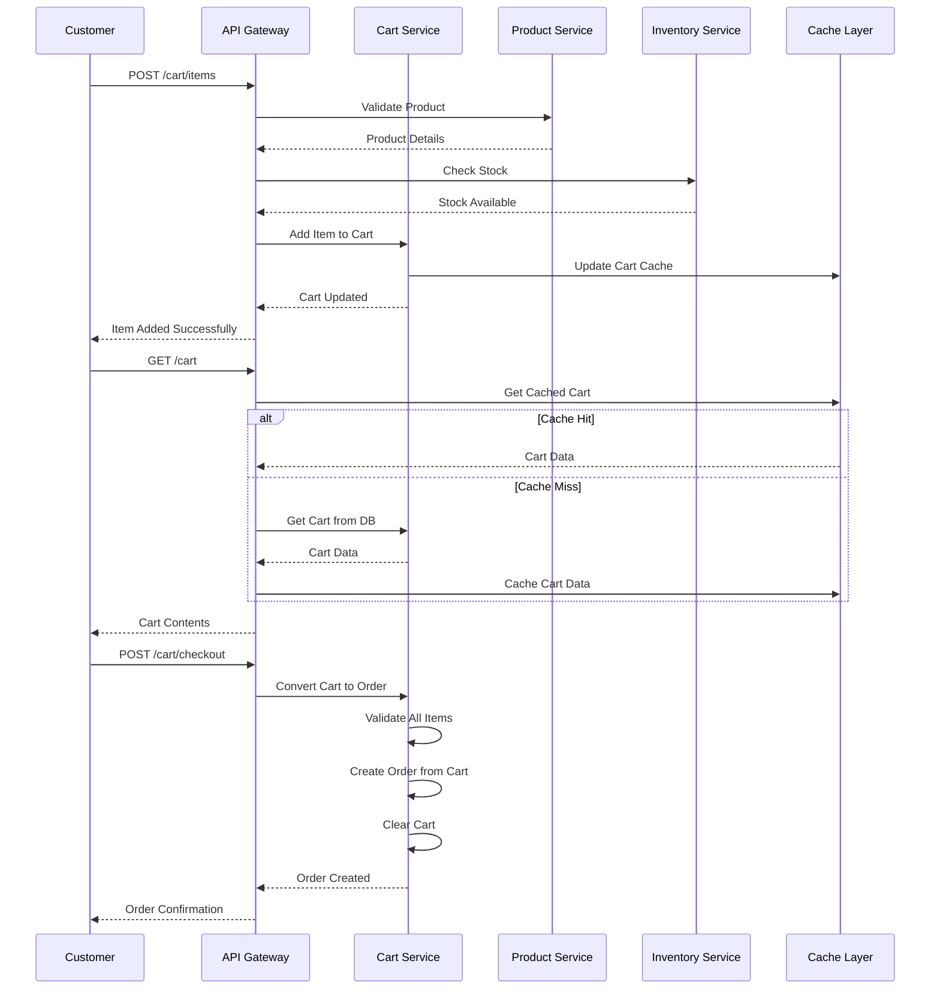
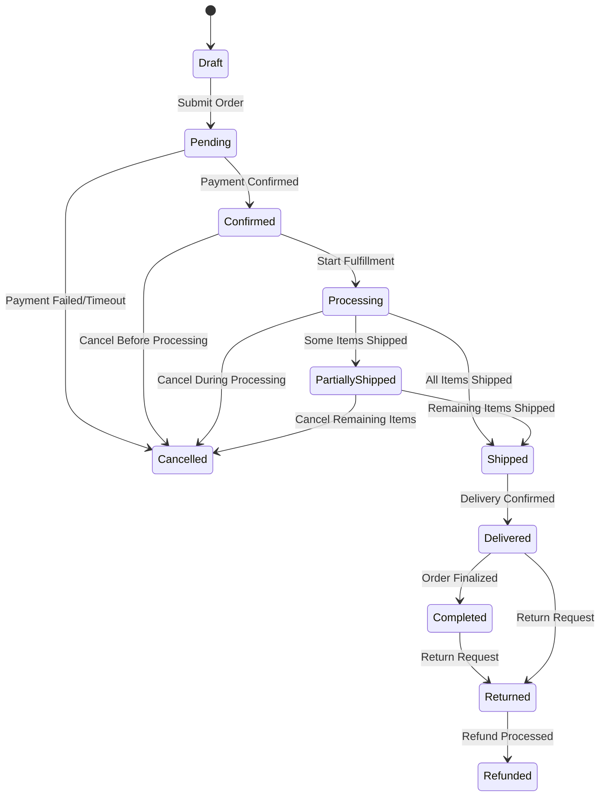
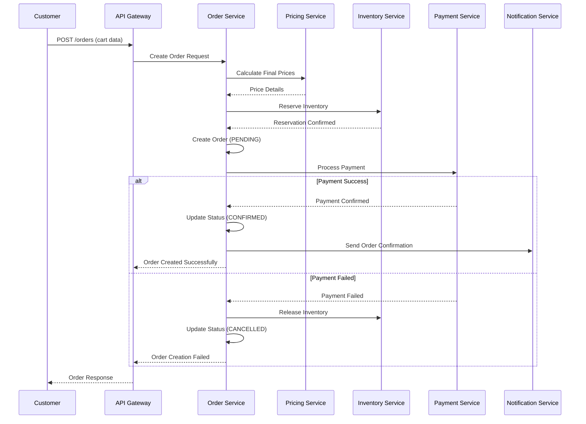
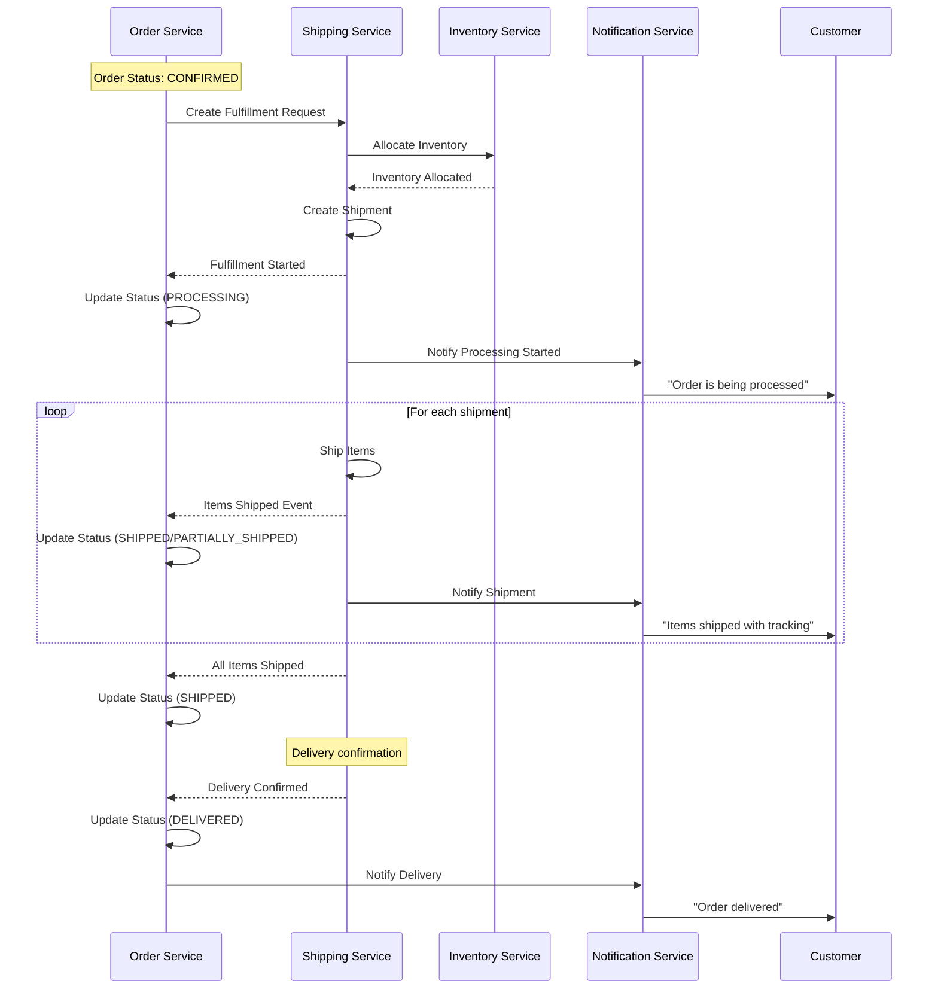
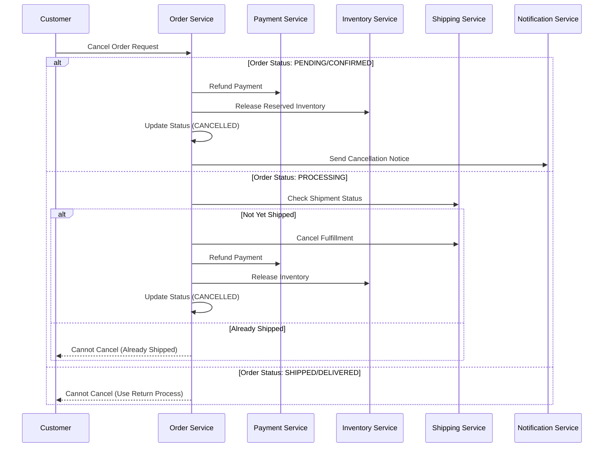

# Order & Cart Service

## Description
Unified service that manages shopping cart operations and processes orders from creation to completion. This service handles both cart management and order lifecycle in a single, cohesive system.

## Outbound Data
- **Cart Data**: Shopping cart contents, totals, session management
- **Order Data**: Order details, payment references, fulfillment instructions
- **Status Updates**: Cart changes, order status transitions
- **Checkout Data**: Cart-to-order conversion information

## Consumers (Services that use this data)

### Shipping Service
- **Purpose**: Create shipment entities (Fulfillment) per order
- **Data Received**: Order details, shipping address, fulfillment requirements

### Notification Service
- **Purpose**: Customer & admin updates
- **Data Received**: Order status, customer info, notification triggers

### Warehouse & Inventory
- **Purpose**: Update reserved stock quantities
- **Data Received**: Product quantities, stock adjustments

### Customer Service
- **Purpose**: Store order history
- **Data Received**: Order records, customer purchase history

### Promotion Service
- **Purpose**: Track applied coupons or promotions
- **Data Received**: Promotion usage, discount applications

## Data Sources
- **Product Service**: Product validation, pricing, and cart item details
- **Promotion Service**: Discount rules and applications for cart/orders
- **Warehouse & Inventory**: Stock availability and reservations
- **Customer Service**: Customer details, addresses, and preferences
- **Pricing Service**: Dynamic pricing for cart calculations

## 🔄 Cart & Order Workflow Diagrams

### Shopping Cart Flow


### Order State Machine


### Order Creation Flow


### Order Fulfillment Flow


### Order Cancellation Flow


## 📡 API Specification

### Base URL
```
Production: https://api.domain.com/v1/orders
Staging: https://staging-api.domain.com/v1/orders
Local: http://localhost:8003/v1/orders
```

### Authentication
- **Type**: JWT Bearer Token
- **Required Scopes**: `orders:read`, `orders:write`, `orders:admin`
- **Rate Limiting**: 500 requests/minute per user

### Shopping Cart APIs

#### POST /cart/items
**Purpose**: Add item to shopping cart

**Request**:
```http
POST /v1/cart/items
Authorization: Bearer {jwt_token}
Content-Type: application/json

{
  "productId": "prod_123",
  "productSku": "LAPTOP-001",
  "quantity": 1,
  "warehouseId": "WH001",
  "sessionId": "cart_session_456",
  "metadata": {
    "source": "product_page"
  }
}
```

**Response**:
```json
{
  "success": true,
  "data": {
    "item": {
      "id": "cart_item_789",
      "productId": "prod_123",
      "productSku": "LAPTOP-001",
      "productName": "Gaming Laptop Pro",
      "quantity": 1,
      "unitPrice": 1169.99,
      "totalPrice": 1169.99,
      "inStock": true,
      "addedAt": "2024-01-15T10:30:00Z"
    },
    "cart": {
      "sessionId": "cart_session_456",
      "itemCount": 3,
      "totalEstimate": 1459.97,
      "currency": "USD"
    }
  }
}
```

#### GET /cart
**Purpose**: Get cart contents

**Request**:
```http
GET /v1/cart?sessionId=cart_session_456
Authorization: Bearer {jwt_token}
```

**Response**:
```json
{
  "success": true,
  "data": {
    "cart": {
      "sessionId": "cart_session_456",
      "userId": "user_123",
      "items": [
        {
          "id": "cart_item_789",
          "productId": "prod_123",
          "productSku": "LAPTOP-001",
          "productName": "Gaming Laptop Pro",
          "quantity": 1,
          "unitPrice": 1169.99,
          "totalPrice": 1169.99,
          "inStock": true,
          "warehouseId": "WH001"
        }
      ],
      "totals": {
        "subtotal": 1169.99,
        "discountTotal": 0.00,
        "taxEstimate": 93.60,
        "shippingEstimate": 15.99,
        "totalEstimate": 1279.58,
        "itemCount": 1,
        "currency": "USD"
      },
      "expiresAt": "2024-01-16T10:30:00Z",
      "updatedAt": "2024-01-15T10:30:00Z"
    }
  }
}
```

#### PUT /cart/items/{itemId}
**Purpose**: Update cart item quantity

**Request**:
```http
PUT /v1/cart/items/cart_item_789
Authorization: Bearer {jwt_token}
Content-Type: application/json

{
  "quantity": 2
}
```

#### DELETE /cart/items/{itemId}
**Purpose**: Remove item from cart

**Request**:
```http
DELETE /v1/cart/items/cart_item_789
Authorization: Bearer {jwt_token}
```

#### POST /cart/checkout
**Purpose**: Convert cart to order

**Request**:
```http
POST /v1/cart/checkout
Authorization: Bearer {jwt_token}
Content-Type: application/json

{
  "sessionId": "cart_session_456",
  "shippingAddress": {
    "firstName": "John",
    "lastName": "Doe",
    "street": "123 Main St",
    "city": "New York",
    "state": "NY",
    "zipCode": "10001",
    "country": "US"
  },
  "paymentMethod": "credit_card",
  "promotionCodes": ["SAVE20"],
  "notes": "Please handle with care"
}
```

**Response**:
```json
{
  "success": true,
  "data": {
    "order": {
      "id": "order_789",
      "orderNumber": "ORD-2024-001234",
      "status": "pending",
      "customerId": "cust_456",
      "totalAmount": 1279.58,
      "currency": "USD",
      "createdAt": "2024-01-15T10:30:00Z"
    }
  }
}
```

#### GET /cart/summary
**Purpose**: Get cart summary for header display

**Request**:
```http
GET /v1/cart/summary?sessionId=cart_session_456
Authorization: Bearer {jwt_token}
```

**Response**:
```json
{
  "success": true,
  "data": {
    "itemCount": 3,
    "totalEstimate": 1459.97,
    "currency": "USD",
    "hasItems": true
  }
}
```

#### POST /cart/merge
**Purpose**: Merge guest cart with user cart after login

**Request**:
```http
POST /v1/cart/merge
Authorization: Bearer {jwt_token}
Content-Type: application/json

{
  "guestSessionId": "guest_cart_123",
  "guestToken": "guest_token_456",
  "userId": "user_789",
  "userSessionId": "user_cart_456",
  "strategy": "MERGE_STRATEGY_MERGE"
}
```

### Order Management APIs

#### POST /orders
**Purpose**: Create a new order from cart/checkout data

**Request**:
```http
POST /v1/orders
Authorization: Bearer {jwt_token}
Content-Type: application/json

{
  "customerId": "cust_456",
  "items": [
    {
      "productId": "prod_123",
      "sku": "LAPTOP-001",
      "quantity": 1,
      "warehouseId": "WH001"
    },
    {
      "productId": "prod_124",
      "sku": "MOUSE-001", 
      "quantity": 2,
      "warehouseId": "WH001"
    }
  ],
  "shippingAddress": {
    "firstName": "John",
    "lastName": "Doe",
    "street": "123 Main St",
    "city": "New York",
    "state": "NY",
    "zipCode": "10001",
    "country": "US",
    "phone": "+1-555-0123"
  },
  "billingAddress": {
    "firstName": "John",
    "lastName": "Doe",
    "street": "123 Main St",
    "city": "New York", 
    "state": "NY",
    "zipCode": "10001",
    "country": "US"
  },
  "paymentMethod": {
    "type": "credit_card",
    "token": "pm_1234567890"
  },
  "couponCode": "SAVE20",
  "notes": "Please handle with care",
  "metadata": {
    "source": "web",
    "campaign": "holiday_sale"
  }
}
```

**Response**:
```json
{
  "success": true,
  "data": {
    "order": {
      "id": "order_789",
      "orderNumber": "ORD-2024-001234",
      "status": "pending",
      "customerId": "cust_456",
      "items": [
        {
          "id": "item_001",
          "productId": "prod_123",
          "sku": "LAPTOP-001",
          "name": "Gaming Laptop Pro",
          "quantity": 1,
          "unitPrice": 1169.99,
          "totalPrice": 1169.99,
          "warehouseId": "WH001"
        },
        {
          "id": "item_002", 
          "productId": "prod_124",
          "sku": "MOUSE-001",
          "name": "Wireless Mouse",
          "quantity": 2,
          "unitPrice": 49.99,
          "totalPrice": 99.98,
          "warehouseId": "WH001"
        }
      ],
      "pricing": {
        "subtotal": 1269.97,
        "discounts": 25.40,
        "tax": 99.64,
        "shipping": 15.99,
        "total": 1360.20,
        "currency": "USD"
      },
      "shippingAddress": {
        "firstName": "John",
        "lastName": "Doe",
        "street": "123 Main St",
        "city": "New York",
        "state": "NY",
        "zipCode": "10001",
        "country": "US",
        "phone": "+1-555-0123"
      },
      "paymentStatus": "pending",
      "estimatedDelivery": "2024-01-20T00:00:00Z",
      "createdAt": "2024-01-15T10:30:00Z",
      "updatedAt": "2024-01-15T10:30:00Z"
    }
  },
  "meta": {
    "requestId": "req_order_123",
    "timestamp": "2024-01-15T10:30:00Z"
  }
}
```

#### GET /orders/{orderId}
**Purpose**: Get detailed order information

**Request**:
```http
GET /v1/orders/order_789
Authorization: Bearer {jwt_token}
```

**Response**:
```json
{
  "success": true,
  "data": {
    "order": {
      "id": "order_789",
      "orderNumber": "ORD-2024-001234",
      "status": "confirmed",
      "customerId": "cust_456",
      "items": [...],
      "pricing": {...},
      "shippingAddress": {...},
      "billingAddress": {...},
      "paymentStatus": "paid",
      "paymentMethod": {
        "type": "credit_card",
        "last4": "1234",
        "brand": "visa"
      },
      "timeline": [
        {
          "status": "pending",
          "timestamp": "2024-01-15T10:30:00Z",
          "note": "Order created"
        },
        {
          "status": "confirmed", 
          "timestamp": "2024-01-15T10:32:00Z",
          "note": "Payment confirmed"
        }
      ],
      "tracking": {
        "carrier": "UPS",
        "trackingNumber": "1Z999AA1234567890",
        "trackingUrl": "https://ups.com/track/1Z999AA1234567890"
      },
      "estimatedDelivery": "2024-01-20T00:00:00Z",
      "createdAt": "2024-01-15T10:30:00Z",
      "updatedAt": "2024-01-15T10:32:00Z"
    }
  }
}
```

#### PUT /orders/{orderId}/status
**Purpose**: Update order status (admin only)

**Request**:
```http
PUT /v1/orders/order_789/status
Authorization: Bearer {admin_jwt_token}
Content-Type: application/json

{
  "status": "processing",
  "note": "Started fulfillment process",
  "notifyCustomer": true
}
```

#### POST /orders/{orderId}/cancel
**Purpose**: Cancel an order

**Request**:
```http
POST /v1/orders/order_789/cancel
Authorization: Bearer {jwt_token}
Content-Type: application/json

{
  "reason": "customer_request",
  "note": "Customer changed mind"
}
```

#### GET /orders/customer/{customerId}
**Purpose**: Get customer's order history

**Request**:
```http
GET /v1/orders/customer/cust_456?page=1&limit=10&status=completed
Authorization: Bearer {jwt_token}
```

#### GET /orders
**Purpose**: Get orders list (admin only)

**Request**:
```http
GET /v1/orders?page=1&limit=20&status=pending&dateFrom=2024-01-01&dateTo=2024-01-31
Authorization: Bearer {admin_jwt_token}
```

## 🗄️ Database Schema

### Primary Database: PostgreSQL

#### cart_sessions
```sql
CREATE TABLE cart_sessions (
    id BIGSERIAL PRIMARY KEY,
    session_id VARCHAR(100) UNIQUE NOT NULL,
    user_id BIGINT,
    guest_token VARCHAR(100),
    expires_at TIMESTAMP WITH TIME ZONE,
    metadata JSONB DEFAULT '{}',
    created_at TIMESTAMP WITH TIME ZONE DEFAULT CURRENT_TIMESTAMP,
    updated_at TIMESTAMP WITH TIME ZONE DEFAULT CURRENT_TIMESTAMP,
    
    -- Indexes
    INDEX idx_cart_sessions_session_id (session_id),
    INDEX idx_cart_sessions_user_id (user_id),
    INDEX idx_cart_sessions_guest_token (guest_token),
    INDEX idx_cart_sessions_expires_at (expires_at)
);
```

#### cart_items
```sql
CREATE TABLE cart_items (
    id BIGSERIAL PRIMARY KEY,
    session_id VARCHAR(100) NOT NULL,
    product_id BIGINT NOT NULL,
    product_sku VARCHAR(100) NOT NULL,
    product_name VARCHAR(255),
    quantity INTEGER NOT NULL CHECK (quantity > 0),
    unit_price DECIMAL(10,2),
    total_price DECIMAL(12,2),
    discount_amount DECIMAL(10,2) DEFAULT 0.00,
    warehouse_id BIGINT,
    in_stock BOOLEAN DEFAULT true,
    metadata JSONB DEFAULT '{}',
    added_at TIMESTAMP WITH TIME ZONE DEFAULT CURRENT_TIMESTAMP,
    updated_at TIMESTAMP WITH TIME ZONE DEFAULT CURRENT_TIMESTAMP,
    
    -- Foreign key constraint
    CONSTRAINT fk_cart_items_session_id 
        FOREIGN KEY (session_id) 
        REFERENCES cart_sessions(session_id) 
        ON DELETE CASCADE,
    
    -- Indexes
    INDEX idx_cart_items_session_id (session_id),
    INDEX idx_cart_items_product_id (product_id),
    INDEX idx_cart_items_product_sku (product_sku),
    INDEX idx_cart_items_warehouse_id (warehouse_id),
    
    -- Unique constraint to prevent duplicate products in same cart
    UNIQUE INDEX idx_cart_items_unique_product_warehouse (session_id, product_id, warehouse_id)
);
```

#### orders
```sql
CREATE TABLE orders (
    id UUID PRIMARY KEY DEFAULT gen_random_uuid(),
    order_number VARCHAR(50) UNIQUE NOT NULL,
    customer_id UUID NOT NULL,
    status VARCHAR(20) NOT NULL DEFAULT 'pending',
    
    -- Pricing
    subtotal DECIMAL(10,2) NOT NULL,
    discount_amount DECIMAL(10,2) DEFAULT 0,
    tax_amount DECIMAL(10,2) DEFAULT 0,
    shipping_amount DECIMAL(10,2) DEFAULT 0,
    total_amount DECIMAL(10,2) NOT NULL,
    currency VARCHAR(3) DEFAULT 'USD',
    
    -- Addresses (JSONB for flexibility)
    shipping_address JSONB NOT NULL,
    billing_address JSONB NOT NULL,
    
    -- Payment
    payment_status VARCHAR(20) DEFAULT 'pending',
    payment_method JSONB,
    payment_reference VARCHAR(100),
    
    -- Fulfillment
    estimated_delivery TIMESTAMP WITH TIME ZONE,
    tracking_info JSONB,
    
    -- Metadata
    notes TEXT,
    metadata JSONB DEFAULT '{}',
    
    -- Audit
    created_at TIMESTAMP WITH TIME ZONE DEFAULT NOW(),
    updated_at TIMESTAMP WITH TIME ZONE DEFAULT NOW(),
    created_by UUID,
    updated_by UUID,
    
    -- Indexes
    INDEX idx_orders_customer (customer_id),
    INDEX idx_orders_status (status),
    INDEX idx_orders_order_number (order_number),
    INDEX idx_orders_payment_status (payment_status),
    INDEX idx_orders_created_at (created_at),
    
    -- Constraints
    CONSTRAINT chk_orders_status CHECK (status IN ('pending', 'confirmed', 'processing', 'shipped', 'partially_shipped', 'delivered', 'completed', 'cancelled', 'returned', 'refunded')),
    CONSTRAINT chk_orders_payment_status CHECK (payment_status IN ('pending', 'paid', 'failed', 'refunded', 'partially_refunded'))
);
```

#### order_items
```sql
CREATE TABLE order_items (
    id UUID PRIMARY KEY DEFAULT gen_random_uuid(),
    order_id UUID NOT NULL REFERENCES orders(id) ON DELETE CASCADE,
    product_id UUID NOT NULL,
    sku VARCHAR(100) NOT NULL,
    name VARCHAR(255) NOT NULL,
    quantity INTEGER NOT NULL,
    unit_price DECIMAL(10,2) NOT NULL,
    total_price DECIMAL(10,2) NOT NULL,
    warehouse_id VARCHAR(50) NOT NULL,
    
    -- Product snapshot at time of order
    product_snapshot JSONB,
    
    -- Fulfillment tracking
    fulfilled_quantity INTEGER DEFAULT 0,
    cancelled_quantity INTEGER DEFAULT 0,
    
    created_at TIMESTAMP WITH TIME ZONE DEFAULT NOW(),
    
    -- Indexes
    INDEX idx_order_items_order (order_id),
    INDEX idx_order_items_product (product_id),
    INDEX idx_order_items_sku (sku),
    INDEX idx_order_items_warehouse (warehouse_id),
    
    -- Constraints
    CONSTRAINT chk_order_items_quantity CHECK (quantity > 0),
    CONSTRAINT chk_order_items_fulfilled CHECK (fulfilled_quantity <= quantity),
    CONSTRAINT chk_order_items_cancelled CHECK (cancelled_quantity <= quantity)
);
```

#### order_status_history
```sql
CREATE TABLE order_status_history (
    id UUID PRIMARY KEY DEFAULT gen_random_uuid(),
    order_id UUID NOT NULL REFERENCES orders(id) ON DELETE CASCADE,
    from_status VARCHAR(20),
    to_status VARCHAR(20) NOT NULL,
    note TEXT,
    changed_by UUID,
    changed_at TIMESTAMP WITH TIME ZONE DEFAULT NOW(),
    
    -- Indexes
    INDEX idx_order_status_history_order (order_id),
    INDEX idx_order_status_history_changed_at (changed_at)
);
```

#### order_events
```sql
CREATE TABLE order_events (
    id UUID PRIMARY KEY DEFAULT gen_random_uuid(),
    order_id UUID NOT NULL REFERENCES orders(id) ON DELETE CASCADE,
    event_type VARCHAR(50) NOT NULL,
    event_data JSONB NOT NULL,
    created_at TIMESTAMP WITH TIME ZONE DEFAULT NOW(),
    
    -- Indexes
    INDEX idx_order_events_order (order_id),
    INDEX idx_order_events_type (event_type),
    INDEX idx_order_events_created_at (created_at),
    
    -- Partitioning by month for performance
    PARTITION BY RANGE (created_at)
);
```

### Cache Schema (Redis)
```
# Cart cache
Key: cart:session:{session_id}
TTL: 1800 seconds (30 minutes)
Value: JSON serialized cart data

# Cart summary cache
Key: cart:summary:{session_id}
TTL: 300 seconds (5 minutes)
Value: Cart item count and total

# User cart mapping
Key: cart:user:{user_id}
TTL: 3600 seconds (1 hour)
Value: Active cart session ID

# Guest cart mapping
Key: cart:guest:{guest_token}
TTL: 3600 seconds (1 hour)
Value: Active cart session ID

# Order cache
Key: orders:order:{order_id}
TTL: 1800 seconds (30 minutes)
Value: JSON serialized order data

# Customer orders cache
Key: orders:customer:{customer_id}:page:{page}
TTL: 300 seconds (5 minutes)
Value: JSON serialized order list

# Order status cache
Key: orders:status:{order_id}
TTL: 600 seconds (10 minutes)
Value: Current order status

# Order processing queue
Key: orders:processing_queue
Type: List
Value: Order IDs pending processing
```

## 📨 Event Schemas

### Published Events

#### CartItemAdded
**Topic**: `orders.cart.item_added`
**Version**: 1.0

```json
{
  "eventId": "evt_cart_123",
  "eventType": "CartItemAdded",
  "version": "1.0",
  "timestamp": "2024-01-15T10:30:00Z",
  "source": "order-service",
  "data": {
    "sessionId": "cart_session_456",
    "userId": "user_123",
    "productId": "prod_123",
    "productSku": "LAPTOP-001",
    "quantity": 1,
    "unitPrice": 1169.99,
    "warehouseId": "WH001"
  }
}
```

#### CartUpdated
**Topic**: `orders.cart.updated`
**Version**: 1.0

#### CartCleared
**Topic**: `orders.cart.cleared`
**Version**: 1.0

#### CartCheckedOut
**Topic**: `orders.cart.checked_out`
**Version**: 1.0

```json
{
  "eventId": "evt_checkout_124",
  "eventType": "CartCheckedOut",
  "version": "1.0",
  "timestamp": "2024-01-15T10:35:00Z",
  "source": "order-service",
  "data": {
    "sessionId": "cart_session_456",
    "userId": "user_123",
    "orderId": "order_789",
    "orderNumber": "ORD-2024-001234",
    "itemCount": 3,
    "totalAmount": 1279.58,
    "currency": "USD"
  }
}
```

#### OrderCreated
**Topic**: `orders.order.created`
**Version**: 1.0

```json
{
  "eventId": "evt_order_123",
  "eventType": "OrderCreated",
  "version": "1.0",
  "timestamp": "2024-01-15T10:30:00Z",
  "source": "order-service",
  "data": {
    "orderId": "order_789",
    "orderNumber": "ORD-2024-001234",
    "customerId": "cust_456",
    "status": "pending",
    "items": [
      {
        "productId": "prod_123",
        "sku": "LAPTOP-001",
        "quantity": 1,
        "warehouseId": "WH001"
      }
    ],
    "totalAmount": 1360.20,
    "currency": "USD",
    "createdAt": "2024-01-15T10:30:00Z"
  },
  "metadata": {
    "correlationId": "corr_checkout_456",
    "causationId": "checkout_completed"
  }
}
```

#### OrderStatusChanged
**Topic**: `orders.order.status_changed`
**Version**: 1.0

```json
{
  "eventId": "evt_status_124",
  "eventType": "OrderStatusChanged",
  "version": "1.0",
  "timestamp": "2024-01-15T10:32:00Z",
  "source": "order-service",
  "data": {
    "orderId": "order_789",
    "orderNumber": "ORD-2024-001234",
    "customerId": "cust_456",
    "fromStatus": "pending",
    "toStatus": "confirmed",
    "reason": "payment_confirmed",
    "changedBy": "system",
    "changedAt": "2024-01-15T10:32:00Z"
  }
}
```

#### OrderCancelled
**Topic**: `orders.order.cancelled`
**Version**: 1.0

#### OrderCompleted
**Topic**: `orders.order.completed`
**Version**: 1.0

### Subscribed Events

#### PaymentConfirmed
**Topic**: `payments.payment.confirmed`
**Source**: payment-service

#### PaymentFailed
**Topic**: `payments.payment.failed`
**Source**: payment-service

#### ShipmentCreated
**Topic**: `shipping.shipment.created`
**Source**: shipping-service

#### DeliveryConfirmed
**Topic**: `shipping.delivery.confirmed`
**Source**: shipping-service

## 🔄 Business Rules

### Order Creation Rules
1. **Inventory Validation**: All items must be in stock
2. **Price Validation**: Prices must be current and valid
3. **Customer Validation**: Customer must exist and be active
4. **Address Validation**: Shipping address must be valid
5. **Payment Validation**: Payment method must be valid

### Order Status Transitions
```
PENDING → CONFIRMED (payment confirmed)
PENDING → CANCELLED (payment failed/timeout)
CONFIRMED → PROCESSING (fulfillment started)
CONFIRMED → CANCELLED (cancelled before processing)
PROCESSING → SHIPPED (all items shipped)
PROCESSING → PARTIALLY_SHIPPED (some items shipped)
PROCESSING → CANCELLED (cancelled during processing)
PARTIALLY_SHIPPED → SHIPPED (remaining items shipped)
SHIPPED → DELIVERED (delivery confirmed)
DELIVERED → COMPLETED (order finalized)
COMPLETED → RETURNED (return initiated)
DELIVERED → RETURNED (return initiated)
RETURNED → REFUNDED (refund processed)
```

### Cancellation Rules
- **PENDING/CONFIRMED**: Can be cancelled, full refund
- **PROCESSING**: Can be cancelled if not yet shipped, full refund
- **SHIPPED**: Cannot be cancelled, must use return process
- **DELIVERED/COMPLETED**: Cannot be cancelled, must use return process

## ⚡ Performance Optimizations

### Database Optimizations
- Partitioned order_events table by month
- Indexed frequently queried columns
- Separate read replicas for reporting queries
- Connection pooling for high concurrency

### Caching Strategy
- **Cart Data**: Cache cart contents for 30 minutes, invalidate on updates
- **Cart Summary**: Cache cart totals for 5 minutes for header display
- **User/Guest Mapping**: Cache session mappings for 1 hour
- **Order Details**: Cache order details for 30 minutes
- **Customer Orders**: Cache order lists for 5 minutes
- **Order Status**: Cache status for 10 minutes
- **Auto-cleanup**: Expired carts cleaned up daily

### Event Processing
- Asynchronous event publishing
- Event deduplication
- Retry mechanism for failed events
- Dead letter queue for unprocessable events