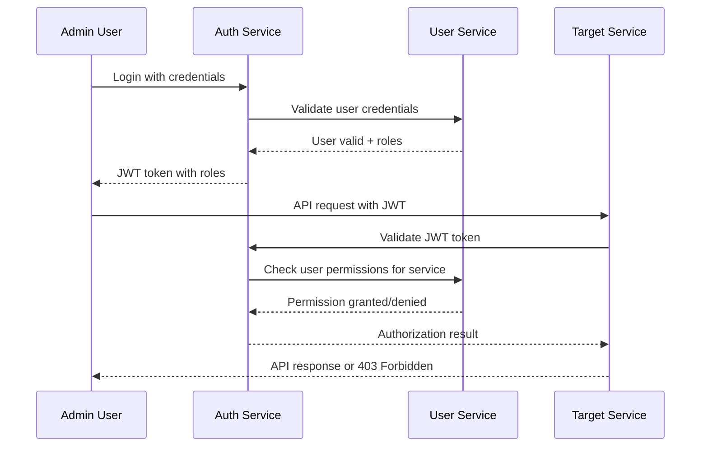

# User Service

## Description
Service that manages internal users (admins, service owners, staff) and their permissions to access different services and resources.

## Core Responsibilities
- Internal user management (admins, staff, service owners)
- Role-based access control (RBAC)
- Permission management per service
- User authentication for internal systems
- Service-to-service authorization
- Admin dashboard access control

## Outbound Data
- User profiles and roles
- Permission matrices
- Service access rights
- User authentication status
- Role hierarchies and assignments

## Consumers (Services that use this data)

### Auth Service
- **Purpose**: Validate internal user permissions and roles
- **Data Received**: User roles, permissions, service access rights

### All Business Services
- **Purpose**: Check if user has permission to access specific operations
- **Data Received**: User permissions, role-based access control

### Notification Service
- **Purpose**: Send admin notifications and alerts
- **Data Received**: Admin user contact information, notification preferences

## Data Sources

### Auth Service
- **Purpose**: Receive authentication events for internal users
- **Data Received**: Login attempts, authentication status

## User Types & Roles

### 1. System Administrators
```json
{
  "role": "system_admin",
  "permissions": {
    "services": ["*"],
    "operations": ["read", "write", "delete", "admin"],
    "scope": "global"
  }
}
```

### 2. Service Owners
```json
{
  "role": "service_owner",
  "permissions": {
    "services": ["catalog-service", "pricing-service"],
    "operations": ["read", "write", "admin"],
    "scope": "service_specific"
  }
}
```

### 3. Operations Staff
```json
{
  "role": "operations_staff",
  "permissions": {
    "services": ["order-service", "shipping-service", "warehouse-service"],
    "operations": ["read", "write"],
    "scope": "operational"
  }
}
```

### 4. Customer Support
```json
{
  "role": "customer_support",
  "permissions": {
    "services": ["customer-service", "order-service", "notification-service"],
    "operations": ["read", "write"],
    "scope": "customer_support"
  }
}
```

### 5. Analytics Team
```json
{
  "role": "analytics",
  "permissions": {
    "services": ["*"],
    "operations": ["read"],
    "scope": "read_only"
  }
}
```

### 6. Finance Team
```json
{
  "role": "finance",
  "permissions": {
    "services": ["order-service", "payment-service", "customer-service"],
    "operations": ["read", "write"],
    "scope": "financial"
  }
}
```

## Permission Matrix

### Service Access Control
| Role | Catalog | Pricing | Promotion | Order | Payment | Shipping | Customer | User | Auth | Notification |
|------|---------|---------|-----------|-------|---------|----------|----------|------|------|--------------|
| **System Admin** | Full | Full | Full | Full | Full | Full | Full | Full | Full | Full |
| **Service Owner** | Owner* | Owner* | Owner* | Owner* | Owner* | Owner* | Owner* | Read | Read | Read |
| **Operations** | Read | Read | Read | Full | Read | Full | Read | None | None | Read |
| **Support** | Read | Read | Read | Full | Read | Read | Full | None | None | Write |
| **Analytics** | Read | Read | Read | Read | Read | Read | Read | None | None | None |
| **Finance** | Read | Read | Read | Full | Full | Read | Read | None | None | Read |

*Owner permissions apply only to services they own

## Main APIs

### User Management
- `POST /users` - Create new internal user
- `GET /users/{id}` - Get user information
- `PUT /users/{id}` - Update user information
- `DELETE /users/{id}` - Deactivate user
- `GET /users` - List users with filters

### Role & Permission Management
- `POST /users/{id}/roles` - Assign role to user
- `DELETE /users/{id}/roles/{roleId}` - Remove role from user
- `GET /users/{id}/permissions` - Get user permissions
- `POST /roles` - Create new role
- `PUT /roles/{id}` - Update role permissions

### Service Access Control
- `GET /users/{id}/service-access` - Get user's service access rights
- `POST /users/{id}/service-access` - Grant service access
- `DELETE /users/{id}/service-access/{serviceId}` - Revoke service access
- `GET /services/{serviceId}/users` - Get users with access to service

### Authentication Integration
- `POST /users/validate-access` - Validate user access to service/operation
- `GET /users/{id}/auth-status` - Get user authentication status
- `POST /users/{id}/reset-password` - Reset user password

## User Profile Structure

```json
{
  "userId": "USR-12345",
  "username": "john.admin",
  "email": "john@company.com",
  "firstName": "John",
  "lastName": "Admin",
  "status": "ACTIVE",
  "roles": [
    {
      "roleId": "ROLE-001",
      "roleName": "service_owner",
      "assignedAt": "2024-01-01T00:00:00Z",
      "assignedBy": "USR-00001"
    }
  ],
  "serviceAccess": [
    {
      "serviceId": "catalog-service",
      "permissions": ["read", "write", "admin"],
      "grantedAt": "2024-01-01T00:00:00Z",
      "grantedBy": "USR-00001"
    }
  ],
  "department": "Engineering",
  "manager": "USR-00002",
  "createdAt": "2024-01-01T00:00:00Z",
  "lastLoginAt": "2024-08-10T14:30:00Z",
  "preferences": {
    "notifications": {
      "email": true,
      "slack": true,
      "sms": false
    },
    "dashboard": {
      "defaultView": "services_overview",
      "refreshInterval": 30
    }
  }
}
```

## Integration with Auth Service

### Authentication Flow for Internal Users


## Service Ownership Model

### Service Owner Responsibilities
- **Full Control**: Over assigned services (CRUD operations)
- **Configuration Management**: Service settings and parameters
- **User Access**: Grant/revoke access to their services
- **Monitoring**: Service health and performance
- **Deployment**: Service updates and releases

### Service Assignment
```json
{
  "serviceOwnership": [
    {
      "userId": "USR-12345",
      "services": ["catalog-service", "pricing-service"],
      "assignedAt": "2024-01-01T00:00:00Z",
      "responsibilities": [
        "service_configuration",
        "user_access_management",
        "deployment_approval",
        "monitoring_alerts"
      ]
    }
  ]
}
```

## Security Features

### Access Control
- **Multi-factor Authentication**: Required for admin users
- **IP Whitelisting**: Restrict access from specific IP ranges
- **Session Management**: Automatic session timeout
- **Audit Logging**: Track all user actions and access attempts

### Permission Validation
- **Real-time Validation**: Check permissions on every request
- **Permission Caching**: Cache user permissions for performance
- **Permission Inheritance**: Role-based permission inheritance
- **Temporary Access**: Grant temporary elevated permissions

## Monitoring & Audit

### User Activity Tracking
- **Login/Logout Events**: Track authentication events
- **Service Access**: Log service access attempts
- **Permission Changes**: Audit role and permission modifications
- **Failed Access Attempts**: Monitor unauthorized access attempts

### Security Alerts
- **Suspicious Activity**: Multiple failed login attempts
- **Privilege Escalation**: Unauthorized permission requests
- **Service Access Violations**: Access to restricted services
- **Account Compromise**: Unusual access patterns

## Integration Points

### Internal Services
- **Auth Service**: User authentication and authorization
- **Notification Service**: Admin alerts and notifications
- **All Business Services**: Permission validation

### External Systems
- **LDAP/Active Directory**: Enterprise user directory integration
- **SSO Providers**: Single sign-on integration
- **Audit Systems**: Security audit and compliance logging
- **Monitoring Tools**: User activity monitoring

## Admin Dashboard Features

### User Management Interface
- **User Directory**: Search and manage internal users
- **Role Assignment**: Visual role and permission management
- **Service Access Matrix**: View and modify service permissions
- **Activity Dashboard**: Monitor user activity and access patterns

### Service Management
- **Service Ownership**: Assign and manage service owners
- **Permission Matrix**: Visual permission management
- **Access Logs**: View service access history
- **Security Alerts**: Monitor security events and violations