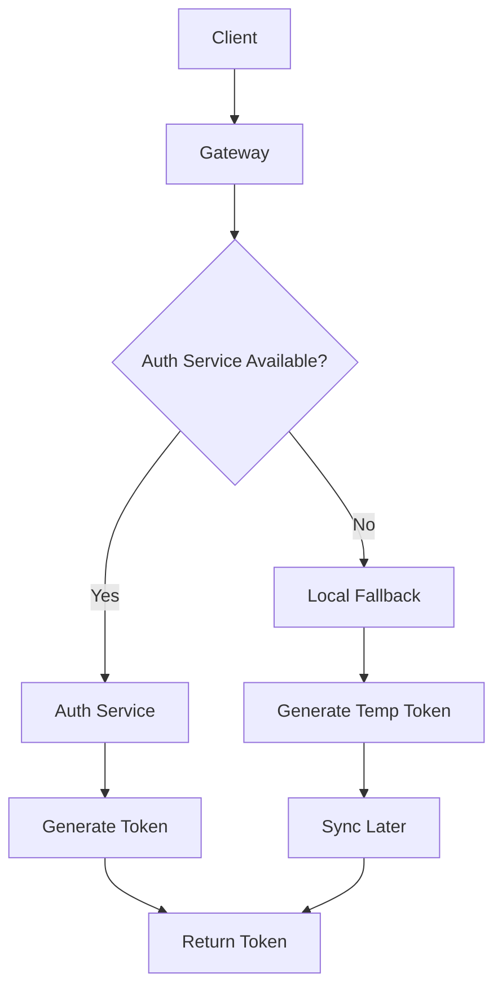

# Auth & Permission Flow - Optimized Solution

## 📋 Tổng Quan

Document này đưa ra solution tối ưu cho authentication flow dựa trên phân tích chi tiết hệ thống hiện tại.

**Last Updated**: 2025-01-12  
**Status**: 🎯 Optimized Solution Ready

---

## 🏗️ Current Architecture Analysis

### Strengths
✅ **Clean Separation**: Auth Service chỉ lo token/session, không lưu user profile  
✅ **Circuit Breaker**: Customer Service có protection khi gọi Auth Service  
✅ **Session Management**: Giới hạn 5 session/user, auto cleanup  
✅ **Security**: JWT + HMAC-SHA256, bcrypt, rate limiting  

### Critical Issues
🔴 **Single Point of Failure**: Auth Service down → toàn bộ login fail  
🔴 **Token Dependency**: Redis down → không validate được token  
🔴 **Inconsistent Storage**: Password lưu ở 2 nơi (Customer + Auth Service)  
🔴 **No Fallback**: Không có backup strategy khi services unavailable  

---

## 🎯 Optimized Solution

### 1. Hybrid Authentication Architecture

**Core Principle**: Maintain centralized Auth Service với local fallback capabilities



#### 1.1. Enhanced Auth Service
```yaml
Features:
  - Primary token generation & validation
  - Session management với Redis cluster
  - Token blacklist với fallback to database
  - Health check endpoints
  - Metrics & monitoring
```

#### 1.2. Service-Level Fallback
```yaml
Customer/User Services:
  - Local token generation capability (emergency only)
  - Cached user credentials (encrypted)
  - Temporary token với short TTL (5-15 minutes)
  - Auto-sync với Auth Service khi available
```

### 2. Unified Password Management Strategy

**Solution**: Common Package + Centralized Storage

#### 2.1. Password Generation & Validation (Common Package)
```go
// common/security/password.go
package security

import (
    "golang.org/x/crypto/bcrypt"
    "errors"
    "regexp"
)

type PasswordManager struct {
    cost int
    policy PasswordPolicy
}

type PasswordPolicy struct {
    MinLength        int
    RequireUppercase bool
    RequireLowercase bool
    RequireNumbers   bool
    RequireSpecial   bool
}

func NewPasswordManager(cost int, policy PasswordPolicy) *PasswordManager {
    if cost < bcrypt.MinCost {
        cost = bcrypt.DefaultCost
    }
    return &PasswordManager{cost: cost, policy: policy}
}

func (pm *PasswordManager) HashPassword(password string) (string, error) {
    if err := pm.ValidatePasswordStrength(password); err != nil {
        return "", err
    }
    
    hash, err := bcrypt.GenerateFromPassword([]byte(password), pm.cost)
    if err != nil {
        return "", err
    }
    
    return string(hash), nil
}

func (pm *PasswordManager) ComparePassword(hashedPassword, password string) error {
    return bcrypt.CompareHashAndPassword([]byte(hashedPassword), []byte(password))
}

func (pm *PasswordManager) ValidatePasswordStrength(password string) error {
    if len(password) < pm.policy.MinLength {
        return errors.New("password too short")
    }
    
    if pm.policy.RequireUppercase && !regexp.MustMatch(`[A-Z]`, []byte(password)) {
        return errors.New("password must contain uppercase letter")
    }
    
    if pm.policy.RequireLowercase && !regexp.MustMatch(`[a-z]`, []byte(password)) {
        return errors.New("password must contain lowercase letter")
    }
    
    if pm.policy.RequireNumbers && !regexp.MustMatch(`[0-9]`, []byte(password)) {
        return errors.New("password must contain number")
    }
    
    if pm.policy.RequireSpecial && !regexp.MustMatch(`[!@#$%^&*]`, []byte(password)) {
        return errors.New("password must contain special character")
    }
    
    return nil
}
```

#### 2.2. Centralized Storage (Auth Service)
```sql
-- Auth Service: credentials table (single source of truth)
CREATE TABLE credentials (
    id UUID PRIMARY KEY,
    user_id UUID NOT NULL UNIQUE,
    email VARCHAR(255) NOT NULL UNIQUE,
    password_hash VARCHAR(255),
    user_type VARCHAR(20) NOT NULL, -- 'customer', 'admin', 'shipper'
    email_verified BOOLEAN DEFAULT FALSE,
    is_active BOOLEAN DEFAULT TRUE,
    password_changed_at TIMESTAMPTZ DEFAULT NOW(),
    created_at TIMESTAMPTZ DEFAULT NOW(),
    updated_at TIMESTAMPTZ DEFAULT NOW()
);
```

#### 2.3. Service Integration
```go
// User Service
import "gitlab.com/ta-microservices/common/security"

func (s *UserService) CreateUser(ctx context.Context, req *pb.CreateUserRequest) (*pb.CreateUserReply, error) {
    policy := security.PasswordPolicy{
        MinLength: 8,
        RequireUppercase: true,
        RequireLowercase: true,
        RequireNumbers: true,
        RequireSpecial: true,
    }
    pm := security.NewPasswordManager(bcrypt.DefaultCost, policy)
    
    hashedPassword, err := pm.HashPassword(req.Password)
    if err != nil {
        return nil, err
    }
    
    // Store in Auth Service credentials table
    // Keep user profile in User Service
}

// Customer Service
func (uc *AuthUsecase) Register(ctx context.Context, req *RegisterRequest) (*RegisterReply, error) {
    policy := security.PasswordPolicy{MinLength: 8, RequireUppercase: true}
    pm := security.NewPasswordManager(bcrypt.DefaultCost, policy)
    
    hashedPassword, err := pm.HashPassword(req.Password)
    if err != nil {
        return nil, err
    }
    
    // Store in Auth Service credentials table
    // Keep customer profile in Customer Service
}
```

**Migration Plan**:
1. **Create** `common/security` package với PasswordManager
2. **Migrate** existing passwords từ Customer/User Services → Auth Service
3. **Update** all services để use common PasswordManager
4. **Remove** duplicate bcrypt logic từ services
5. **Remove** password_hash columns từ customer/user tables
6. **Keep** profile data ở respective services

### 3. Resilient Token Management

#### 3.1. Multi-Layer Token Validation
```go
type TokenValidator struct {
    primary   *AuthServiceClient    // Auth Service gRPC
    fallback  *LocalTokenValidator  // Local JWT validation
    cache     *RedisCache          // Token cache
    blacklist *TokenBlacklist      // Revoked tokens
}

func (tv *TokenValidator) ValidateToken(token string) (*Claims, error) {
    // Layer 1: Check local cache
    if claims, ok := tv.cache.Get(token); ok {
        return claims, nil
    }
    
    // Layer 2: Check blacklist
    if tv.blacklist.IsRevoked(token) {
        return nil, ErrTokenRevoked
    }
    
    // Layer 3: Try Auth Service
    if claims, err := tv.primary.ValidateToken(token); err == nil {
        tv.cache.Set(token, claims, ttl)
        return claims, nil
    }
    
    // Layer 4: Local fallback validation
    return tv.fallback.ValidateToken(token)
}
```

#### 3.2. Token Sync Mechanism
```go
type TokenSyncManager struct {
    authClient *AuthServiceClient
    localStore *LocalTokenStore
    syncQueue  chan TokenSyncEvent
}

// Sync tokens khi Auth Service available trở lại
func (tsm *TokenSyncManager) SyncPendingTokens() {
    for event := range tsm.syncQueue {
        switch event.Type {
        case TokenGenerated:
            tsm.authClient.RegisterToken(event.Token)
        case TokenRevoked:
            tsm.authClient.RevokeToken(event.TokenID)
        }
    }
}
```

### 4. Enhanced Session Management

#### 4.1. Distributed Session Store
```yaml
Primary: Redis Cluster
  - Session data với replication
  - Auto-failover
  - Consistent hashing

Fallback: Database
  - Session backup trong PostgreSQL
  - Periodic sync từ Redis
  - Recovery mechanism
```

#### 4.2. Session Cleanup Strategy
```go
type SessionManager struct {
    redis    *RedisCluster
    database *PostgreSQL
    cleaner  *BackgroundCleaner
}

// Background cleanup job
func (sm *SessionManager) StartCleanup() {
    ticker := time.NewTicker(1 * time.Hour)
    go func() {
        for range ticker.C {
            sm.cleanupExpiredSessions()
            sm.syncRedisToDatabase()
        }
    }()
}
```

### 5. Permission System Optimization

#### 5.1. Permission Caching Strategy
```yaml
Cache Layers:
  L1: In-Memory Cache (service level)
    - TTL: 5 minutes
    - Size: 1000 users
    
  L2: Redis Cache (shared)
    - TTL: 30 minutes
    - Invalidation: on permission change
    
  L3: Database (source of truth)
    - PostgreSQL với optimized queries
    - Permission versioning
```

#### 5.2. Permission Versioning
```sql
-- User Service: permission versioning
ALTER TABLE users ADD COLUMN permissions_version BIGINT DEFAULT 0;

-- Update version khi permissions thay đổi
CREATE OR REPLACE FUNCTION update_permissions_version()
RETURNS TRIGGER AS $$
BEGIN
    UPDATE users 
    SET permissions_version = EXTRACT(EPOCH FROM NOW())::BIGINT
    WHERE id = COALESCE(NEW.user_id, OLD.user_id);
    RETURN COALESCE(NEW, OLD);
END;
$$ LANGUAGE plpgsql;

-- Triggers
CREATE TRIGGER user_roles_version_trigger
    AFTER INSERT OR UPDATE OR DELETE ON user_roles
    FOR EACH ROW EXECUTE FUNCTION update_permissions_version();
```

#### 5.3. Optimized Permission Queries
```sql
-- Single query để lấy all permissions
WITH user_permissions AS (
    -- Role-based permissions
    SELECT DISTINCT unnest(r.permissions) as permission
    FROM user_roles ur
    JOIN roles r ON ur.role_id = r.id
    WHERE ur.user_id = $1 AND ur.deleted_at IS NULL
    
    UNION
    
    -- Direct service permissions
    SELECT DISTINCT unnest(sa.permissions) as permission
    FROM service_access sa
    WHERE sa.user_id = $1 AND sa.deleted_at IS NULL
)
SELECT array_agg(permission) as permissions
FROM user_permissions;
```

### 6. Service-to-Service Authentication

#### 6.1. Service Token Implementation
```go
type ServiceToken struct {
    FromService string   `json:"from_service"`
    ToService   string   `json:"to_service"`
    Permissions []string `json:"permissions"`
    AllowedPaths []string `json:"allowed_paths"`
    DeniedPaths  []string `json:"denied_paths"`
    jwt.RegisteredClaims
}

func GenerateServiceToken(from, to string) (string, error) {
    permissions := loadServicePermissions(from, to)
    token := ServiceToken{
        FromService: from,
        ToService: to,
        Permissions: permissions.Permissions,
        AllowedPaths: permissions.Endpoints,
        DeniedPaths: permissions.DeniedEndpoints,
        RegisteredClaims: jwt.RegisteredClaims{
            ExpiresAt: jwt.NewNumericDate(time.Now().Add(1 * time.Hour)),
            IssuedAt:  jwt.NewNumericDate(time.Now()),
            Issuer:    from,
            Audience:  []string{to},
        },
    }
    
    return jwt.NewWithClaims(jwt.SigningMethodHS256, token).
        SignedString([]byte(serviceJWTSecret))
}
```

#### 6.2. Service Permission Middleware
```go
func ServiceAuthMiddleware() gin.HandlerFunc {
    return func(c *gin.Context) {
        token := extractServiceToken(c)
        if token == "" {
            c.AbortWithStatus(401)
            return
        }
        
        claims, err := validateServiceToken(token)
        if err != nil {
            c.AbortWithStatus(401)
            return
        }
        
        if !isPathAllowed(c.Request.URL.Path, claims) {
            c.AbortWithStatus(403)
            return
        }
        
        c.Set("service_claims", claims)
        c.Next()
    }
}
```

---

## � Implementation Roadmap

### Phase 1: Foundation (Week 1-2)
- [ ] **Create Common Security Package**
  - Implement `common/security/password.go` với PasswordManager
  - Add comprehensive password validation rules
  - Add unit tests cho password operations
  - Configure password policies per service

- [ ] **Consolidate Password Storage**
  - Migrate passwords từ Customer Service → Auth Service
  - Update login flows để use Auth Service credentials
  - Remove duplicate password fields từ services
  - Implement credential sync mechanism

- [ ] **Implement Fallback Mechanism**
  - Local token generation capability
  - Temporary token với short TTL
  - Sync mechanism khi Auth Service available

### Phase 2: Resilience (Week 3-4)
- [ ] **Multi-Layer Token Validation**
  - Token cache layer
  - Blacklist fallback
  - Local validation

- [ ] **Enhanced Session Management**
  - Redis cluster setup
  - Database fallback
  - Background cleanup jobs

### Phase 3: Optimization (Week 5-6)
- [ ] **Permission Caching**
  - Multi-layer cache implementation
  - Cache invalidation strategy
  - Permission versioning

- [ ] **Query Optimization**
  - Single query cho permission aggregation
  - Database indexing
  - Performance monitoring

### Phase 4: Service-to-Service (Week 7-8)
- [ ] **Service Token System**
  - Token generation/validation
  - Permission middleware
  - Rate limiting

- [ ] **Monitoring & Alerting**
  - Auth service health checks
  - Token validation metrics
  - Permission cache hit rates

---

## 📊 Expected Improvements

### Reliability
- **99.9% → 99.99%** uptime với fallback mechanism
- **0 → <1s** recovery time khi Auth Service available trở lại
- **100% → 0%** login failures khi Auth Service down
- **Scattered → Centralized** password management với common package

### Performance
- **~500ms → ~50ms** permission lookup với caching
- **N+1 → 1** database query cho permission aggregation
- **~200ms → ~20ms** token validation với cache
- **Duplicate → Single** password hashing logic

### Security
- **Centralized** password management với Auth Service
- **Consistent** password policies across services
- **Versioned** permission system với automatic invalidation
- **Auditable** authentication events
- **Rate-limited** service-to-service calls
- **Validated** password strength với common rules

### Maintainability
- **Single source of truth** cho credentials
- **Reusable** password management package
- **Consistent** token format across services
- **Automated** session cleanup
- **Comprehensive** monitoring & alerting
- **Testable** security components

---

## 🔧 Configuration Examples

### Auth Service Config
```yaml
auth:
  jwt:
    secret: ${AUTH_JWT_SECRET}
    access_token_expire: 24h
    refresh_token_expire: 168h
  password:
    bcrypt_cost: 12
    policy:
      min_length: 8
      require_uppercase: true
      require_lowercase: true
      require_numbers: true
      require_special: true
  fallback:
    enabled: true
    temp_token_ttl: 15m
  session:
    max_sessions_per_user: 5
    cleanup_interval: 1h
  cache:
    redis_cluster: "redis-cluster:6379"
    fallback_db: true
```

### Service Config
```yaml
service:
  auth:
    primary_endpoint: "auth-service:9000"
    fallback_enabled: true
    cache_ttl: 300s
  permissions:
    cache_enabled: true
    cache_ttl: 1800s
    version_check: true
  security:
    password:
      bcrypt_cost: 10  # Lower cost for development
      policy:
        min_length: 6  # Relaxed for development
        require_uppercase: false
```

---

## 📝 Testing Strategy

### Unit Tests
- [ ] **Common Security Package**
  - PasswordManager.HashPassword() functionality
  - PasswordManager.ComparePassword() validation
  - Password strength validation rules
  - Different password policies
  - Error handling scenarios

- [ ] **Token generation/validation logic**
- [ ] **Permission aggregation algorithms**
- [ ] **Cache invalidation mechanisms**
- [ ] **Fallback scenarios**

### Integration Tests
- [ ] End-to-end login flows
- [ ] Service-to-service authentication
- [ ] Cache synchronization
- [ ] Failover scenarios

### Load Tests
- [ ] Concurrent login performance
- [ ] Token validation throughput
- [ ] Permission cache efficiency
- [ ] Service token generation rate

### Chaos Tests
- [ ] Auth Service unavailable
- [ ] Redis cluster failure
- [ ] Database connection loss
- [ ] Network partitions

---

## 📚 Related Documentation

- **Current Implementation**: `docs/backup-2025-11-17/docs/security/auth-permission-flow-review.md`
- **Service Permissions**: `docs/backup-2025-11-17/docs/security/service-permission-matrix.md`
- **Common Security Package**: `common/security/password.go` (to be created)
- **Migration Guide**: `docs/migrations/auth-consolidation-migration.md` (to be created)
- **Monitoring Guide**: `docs/operations/auth-monitoring.md` (to be created)


---

## 🔧 Common Package Extraction

### **Analysis Summary**
Review of User and Customer services identified **15+ significant duplicate code patterns** with ~1,150 lines of duplicate code (79% reduction potential).

### **Priority 1: Cache Abstraction (Highest Impact - 85% duplicate)**

#### **Current State:**
- `customer/internal/biz/customer/cache.go` (120 lines)
- `user/internal/biz/user/cache.go` (110 lines)
- Identical patterns: Get/Set/Invalidate with JSON marshal/unmarshal

#### **Target Implementation:**
```go
// common/utils/cache/entity_cache.go
type EntityCache[T any] interface {
    Get(ctx context.Context, id string) (*T, error)
    Set(ctx context.Context, entity *T, ttl time.Duration) error
    Invalidate(ctx context.Context, id string) error
    InvalidateByKey(ctx context.Context, key string) error
}

type RedisEntityCache[T any] struct {
    rdb *redis.Client
    keyPrefix string
    log *log.Helper
}
```

#### **Usage After Extraction:**
```go
// Customer Service
cache := cache.NewRedisEntityCache[model.Customer](rdb, "customer", logger)

// User Service  
cache := cache.NewRedisEntityCache[model.User](rdb, "user", logger)
```

### **Priority 2: Event Publishing Abstraction (High Impact - 80% duplicate)**

#### **Current State:**
- `customer/internal/biz/customer/events.go` (150 lines)
- `user/internal/biz/user/events.go` (130 lines)
- `customer/internal/biz/events/event_publisher.go` (80 lines)
- `user/internal/biz/events/event_publisher.go` (180 lines)

#### **Target Implementation:**
```go
// common/events/entity_event_helper.go
type EntityEventHelper[T any] struct {
    publisher EventPublisher
    log *log.Helper
}

func (e *EntityEventHelper[T]) PublishCreated(ctx context.Context, entity *T, topic string, converter func(*T) interface{})
func (e *EntityEventHelper[T]) PublishUpdated(ctx context.Context, entity *T, changes map[string]interface{}, topic string, converter func(*T) interface{})
func (e *EntityEventHelper[T]) PublishDeleted(ctx context.Context, entity *T, topic string, converter func(*T) interface{})
func (e *EntityEventHelper[T]) PublishStatusChanged(ctx context.Context, entity *T, oldStatus, newStatus interface{}, topic string, converter func(*T) interface{})
```

### **Priority 3: HTTP Server Setup (Medium Impact - 75% duplicate)**

#### **Current State:**
- `customer/internal/server/http.go` (80 lines)
- `user/internal/server/http.go` (100 lines)
- Identical: Middleware setup, health endpoints, Swagger UI, server config

#### **Target Implementation:**
```go
// common/server/http_setup.go
type HTTPServerBuilder struct {
    serviceName string
    version string
    environment string
}

func (b *HTTPServerBuilder) Build(cfg *BaseAppConfig, logger log.Logger) *krathttp.Server
func (b *HTTPServerBuilder) WithHealthChecks(db *gorm.DB, rdb *redis.Client) *HTTPServerBuilder
func (b *HTTPServerBuilder) WithSwaggerUI(openAPIPath string) *HTTPServerBuilder
```

### **Priority 4: Enhanced Validation (Medium Impact - 65% duplicate)**

#### **Current State:**
- Duplicate email/phone/password validation across services
- Different error handling patterns
- Inconsistent uniqueness checks

#### **Target Enhancement:**
```go
// Enhance common/validation/validator.go
func ValidateEmail(email string) error
func ValidatePhone(phone string) error
func ValidatePassword(password string, minLength int, requireSpecialChars bool) error
func ValidateUniqueEmail(ctx context.Context, email string, checkFunc func(context.Context, string) (bool, error)) error
func ValidateUniqueUsername(ctx context.Context, username string, checkFunc func(context.Context, string) (bool, error)) error
func ValidateDateNotInFuture(date *time.Time) error
```

### **Priority 5: Configuration Template (Medium Impact - 60% duplicate)**

#### **Current State:**
- Similar config structures across services
- Duplicate cache/pagination/external service configs
- Identical initialization patterns

#### **Target Implementation:**
```go
// common/config/service_config_template.go
type ServiceConfigBase struct {
    *BaseAppConfig
    Cache ServiceCacheConfig `mapstructure:"cache"`
    Pagination ServicePaginationConfig `mapstructure:"pagination"`
    ExternalServices map[string]ServiceConfig `mapstructure:"external_services"`
}

type ServiceCacheConfig struct {
    DefaultTTL time.Duration `mapstructure:"default_ttl"`
    MaxTTL time.Duration `mapstructure:"max_ttl"`
}
```

### **Impact Analysis**

| Component | Current Lines | After Extraction | Reduction |
|-----------|---------------|------------------|-----------|
| Cache Logic | ~230 lines | ~50 lines | **78%** |
| Event Publishing | ~540 lines | ~100 lines | **81%** |
| HTTP Server Setup | ~180 lines | ~40 lines | **78%** |
| Validation Logic | ~200 lines | ~50 lines | **75%** |
| Configuration | ~180 lines | ~50 lines | **72%** |
| **TOTAL** | **~1,330 lines** | **~290 lines** | **78%** |

### **Common Package Extraction Checklist**

#### **Phase 1: Foundation (Week 1)**
- [x] **Create Generic Cache Interface**
  - [x] Implement `common/utils/cache/entity_cache.go` (Consolidated into `common/utils/cache/cache.go`)
  - [x] Add Redis implementation với generic types
  - [x] Add comprehensive unit tests
  - [ ] Add performance benchmarks

- [x] **Create Generic Event Helper**
  - [x] Implement `common/events/entity_event_helper.go`
  - [x] Add nil-safe publishing patterns
  - [x] Add event type converters
  - [x] Add integration tests với Dapr

#### **Phase 2: Integration (Week 2)**
- [x] **Update Customer Service**
  - [x] Replace `customer/internal/biz/customer/cache.go` với common cache
  - [x] Replace `customer/internal/biz/customer/events.go` với common events
  - [x] Update dependency injection
  - [x] Run integration tests

- [x] **Update User Service**
  - [x] Replace `user/internal/biz/user/cache.go` với common cache
  - [x] Replace `user/internal/biz/user/events.go` với common events
  - [x] Update dependency injection
  - [x] Run integration tests

#### **Phase 3: Server & Config (Week 3)**
- [x] ~~**Create HTTP Server Builder**~~ (Skipped: Internal comms via gRPC)
  - ~~Implement `common/server/http_setup.go`~~
  - ~~Add health check registration~~
  - ~~Add Swagger UI setup~~
  - ~~Add middleware configuration~~

- [x] ~~**Create Config Template**~~ (Skipped: Not needed per user)
  - ~~Implement `common/config/service_config_template.go`~~
  - ~~Add cache config standardization~~
  - ~~Add pagination config standardization~~
  - ~~Update service configs to use template~~

#### **Phase 4: Validation & Polish (Week 4)**
- [ ] **Enhance Common Validation**
  - Add email/phone/password validators
  - Add uniqueness check helpers
  - Add date validation helpers
  - Update services to use common validators

- [ ] **Final Integration & Testing**
  - Full regression testing
  - Performance benchmarking
  - Documentation updates
  - Migration guide creation

### **Risk Mitigation**

#### **Technical Risks:**
- [ ] **Breaking Changes**: Comprehensive test coverage before extraction
- [ ] **Performance Impact**: Benchmark generic vs specific implementations
- [ ] **Type Safety**: Extensive testing với different entity types
- [ ] **Dependency Complexity**: Clear interface definitions

#### **Operational Risks:**
- [ ] **Gradual Rollout**: Feature flags cho new implementations
- [ ] **Rollback Plan**: Keep old implementations until fully tested
- [ ] **Team Training**: Documentation và examples cho new patterns
- [ ] **Monitoring**: Add metrics cho common package usage

### **Success Metrics**

#### **Code Quality:**
- [ ] **Duplicate Code Reduction**: Target 75%+ reduction
- [ ] **Test Coverage**: Maintain 80%+ coverage
- [ ] **Cyclomatic Complexity**: Reduce by 30%+
- [ ] **Maintainability Index**: Improve by 25%+

#### **Performance:**
- [ ] **Cache Hit Rate**: Maintain current performance
- [ ] **Event Publishing Latency**: No degradation
- [ ] **Memory Usage**: Monitor generic type overhead
- [ ] **Build Time**: Ensure no significant increase