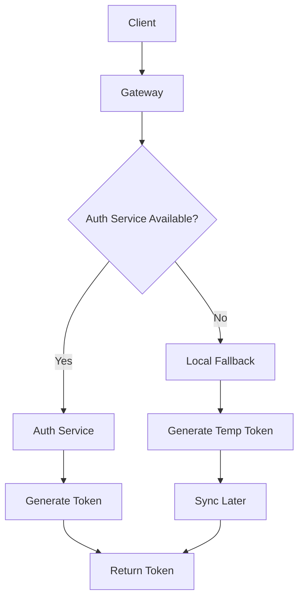

# Auth & Permission Flow - Optimized Solution

## 📋 Tổng Quan

Document này đưa ra solution tối ưu cho authentication flow dựa trên phân tích chi tiết hệ thống hiện tại.

**Last Updated**: 2026-01-13
**Status**: 🚧 Implementation In Progress

---

## 🏗️ Current Architecture Analysis

### Strengths
✅ **Clean Separation**: Auth Service chỉ lo token/session, không lưu user profile  
✅ **Circuit Breaker**: Customer Service có protection khi gọi Auth Service  
✅ **Session Management**: Giới hạn 5 session/user, auto cleanup  
✅ **Security**: JWT + HMAC-SHA256, bcrypt, rate limiting  
✅ **Unified Password Management**: All services use `common/security` package  

### Critical Issues
🔴 **Single Point of Failure**: Auth Service down → toàn bộ login fail  
🔴 **Token Dependency**: Redis down → không validate được token (Logic currently DB dependent for session check)  
🔴 **No Fallback**: Không có backup strategy khi services unavailable  
🔴 **Security Gaps**: 
  - Login endpoints thiếu Rate Limiting & Brute Force Protection (Account Locking).
  - Refresh Token Rotation chưa revoke token cũ (Reuse vulnerability).
  - Customer Service `AuthUsecase` vẫn dùng direct `bcrypt` (Inconsistent).
  - **Gateway Revocation Bypass**: Gateway validates JWT locally but does **NOT** check blacklist. Revoked tokens are accepted until expiration.

---

## 🎯 Optimized Solution

### 1. Hybrid Authentication Architecture

**Core Principle**: Maintain centralized Auth Service với local fallback capabilities

**Status Check (2026-01-13)**: 
- ⚠️ **Hybrid/Fallback NOT Implemented**. Services strictly depend on Auth Service.
- 🔴 **Gateway Bypass**: Local validation skips revocation check.



#### 1.1. Enhanced Auth Service
```yaml
Features:
  - Primary token generation & validation
  - Session management (Currently DB-based, planned migration to Redis)
  - Token blacklist (Planned)
  - Health check endpoints
  - Metrics & monitoring
```

#### 1.2. Service-Level Fallback
```yaml
Customer/User Services:
  - Local token generation capability (emergency only)
  - Cached user credentials (encrypted)
  - Temporary token với short TTL (5-15 minutes)
  - Auto-sync với Auth Service khi available
```

### 2. Unified Password Management Strategy

**Status**: ✅ **Implemented** (User Service), ⚠️ **Partial** (Customer Service)
**Solution**: `common/security` Package + Centralized Storage

#### 2.1. Password Generation & Validation (Common Package)
Using `common/security` package with `PasswordManager`.

#### 2.2. Centralized Storage (Auth Service)
Implementation pending full migration of data. Currently code is unified, but legacy data migration is a separate operational step.

### 3. Resilient Token Management

#### 3.1. Multi-Layer Token Validation
**Status**: 🚧 **Pending** (Currently Layer 3 only)
```go
type TokenValidator struct {
    primary   *AuthServiceClient    // Auth Service gRPC
    fallback  *LocalTokenValidator  // Local JWT validation
    cache     *RedisCache          // Token cache
    blacklist *TokenBlacklist      // Revoked tokens
}
```

### 4. Enhanced Session Management

#### 4.1. Distributed Session Store
**Status**: 🚧 **Pending** (Currently PostgreSQL primary)
```yaml
Target:
  Primary: Redis Cluster
  Fallback: Database
```

### 5. Permission System Optimization

#### 5.1. Permission Caching Strategy
**Status**: 🚧 **Pending** (Currently Direct DB Query)

### 6. Service-to-Service Authentication
**Status**: 🚧 **Pending**

---

## 🚀 Implementation Roadmap

### Phase 1: Foundation (Week 1-2)
- [x] **Create Common Security Package**
  - [x] Implement `common/security/provider.go`
  - [x] Implement PasswordManager logic
  - [x] Add wire providers

- [x] **Refactor Service Password Logic**
  - [x] Update `auth` service to use `common/security`
  - [x] Update `user` service to use `common/security`
  - [x] Update `customer` service to use `common/security` (Found direct bcrypt usage in `AuthUsecase`)
  - [x] Remove duplicate bcrypt usage

- [ ] **Consolidate Password Storage (Data Migration)**
  - [ ] Migrate passwords từ Customer Service → Auth Service (Data)
  - [ ] Sync existing credentials

- [ ] **Implement Fallback Mechanism**
  - [ ] Local token generation capability
  - [ ] Sync mechanism

### Phase 2: Resilience (Week 3-4)
- [ ] **Fix Gateway Security** (Critical)
  - [ ] Inject Redis into Gateway Middleware
  - [ ] Configure `JWTBlacklist` in `JWTValidatorWrapper`
  - [ ] Ensure `SetBlacklist` is called on startup

- [ ] **Multi-Layer Token Validation**
  - [ ] Implement Token Cache Layer (Redis)
  - [ ] Implement Blacklist Layer
  - [ ] Implement Local Validation

- [ ] **Enhanced Session Management**
  - [ ] Migrate Session Primary Store to Redis
  - [ ] Implement Database Fallback Sync

### Phase 2.5: Security Hardening (New)
- [x] **Login Protection**
  - [x] Implement Rate Limiting middleware (Login endpoints)
  - [x] Implement Account Locking (Max failed attempts)
  - [ ] Add Brute Force detection events

- [x] **Token Security**
  - [x] Implement Refresh Token Rotation (Revoke old tokens)
  - [ ] Detect Token Reuse (Family revocation)

### Phase 3: Optimization (Week 5-6)
- [ ] **Permission Caching**
  - [ ] Implement L1/L2 Cache for Permissions
  - [ ] Cache Invalidation Logic
  - [ ] Permission Versioning (`permissions_version` column)

- [ ] **Query Optimization**
  - [ ] Single query permission aggregation (Refine current Join logic)

### Phase 4: Service-to-Service (Week 7-8)
- [ ] **Service Token System**
  - [ ] Token generation/validation
  - [ ] Permission middleware

---

## 🔧 Common Package Extraction Checklist

### **Phase 1: Foundation**
- [x] **Create Generic Cache Interface**
  - [x] Implement `common/utils/cache`
  - [x] Add Redis implementation

- [x] **Create Generic Event Helper**
  - [x] Implement `common/events/entity_event_helper.go`

### **Phase 2: Integration**
- [x] **Update Customer Service**
  - [x] Replace local cache with common
  - [x] Replace local events with common
  - [x] Update dependency injection

- [x] **Update User Service**
  - [x] Replace local cache with common
  - [x] Replace local events with common
  - [x] Update dependency injection

### **Phase 3: Server & Config**
- [ ] **Standardize HTTP Server**
- [ ] **Standardize Configuration**

### **Phase 4: Validation & Polish**
- [x] **Enhance Common Validation**
  - [x] Implement `common/validation/validator.go` (Rich set of validators)
  - [x] Update `user` service usage
  - [x] Update `customer` service usage to full extent
- [ ] **Monitoring**: Add metrics cho common package usage

### **Success Metrics**

#### **Code Quality:**
- [ ] **Duplicate Code Reduction**: Target 75%+ reduction
- [ ] **Test Coverage**: Maintain 80%+ coverage
- [ ] **Cyclomatic Complexity**: Reduce by 30%+
- [ ] **Maintainability Index**: Improve by 25%+

#### **Performance:**
- [ ] **Cache Hit Rate**: Maintain current performance
- [ ] **Event Publishing Latency**: No degradation
- [ ] **Memory Usage**: Monitor generic type overhead
- [ ] **Build Time**: Ensure no significant increase