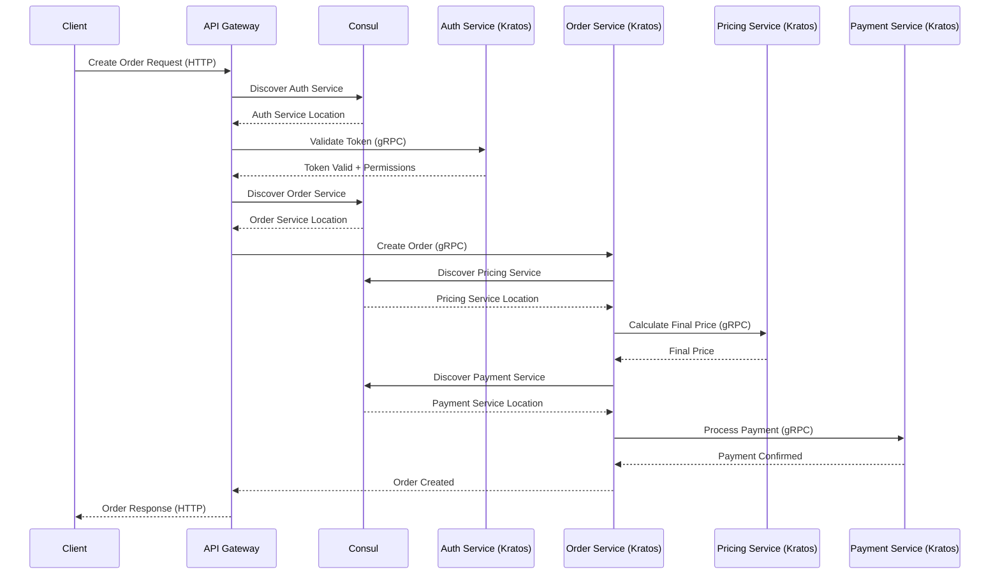
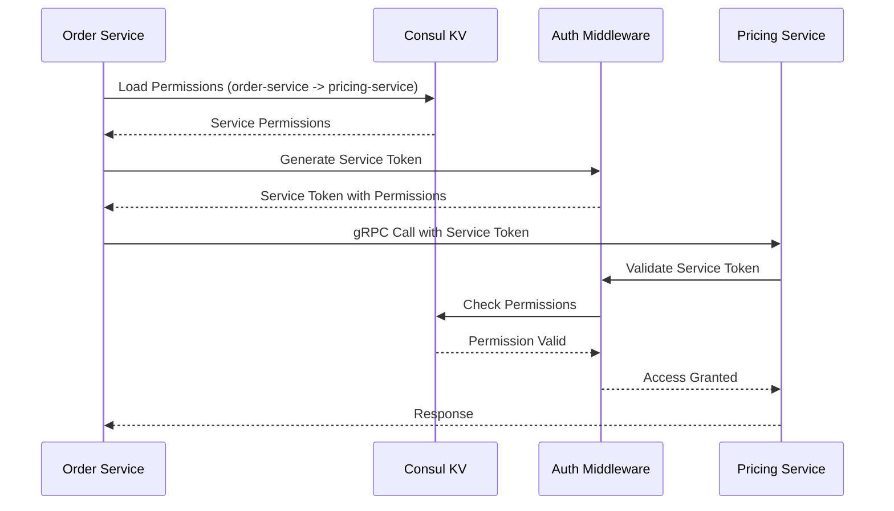
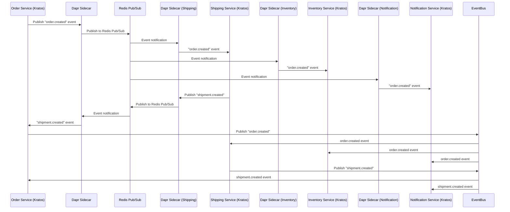
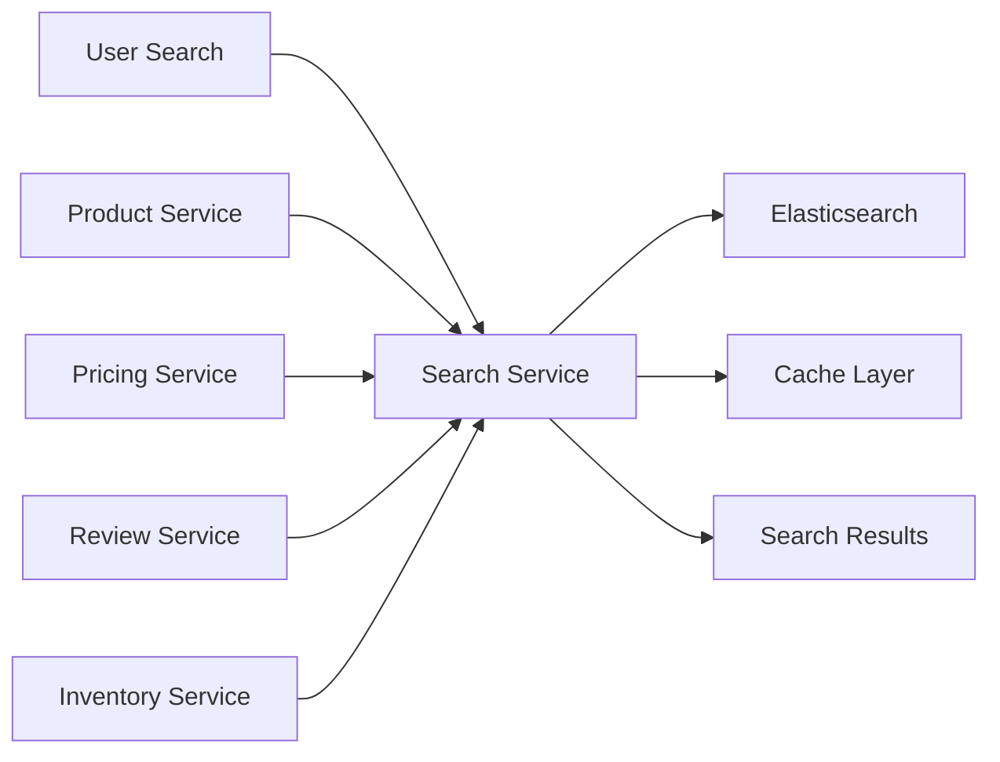
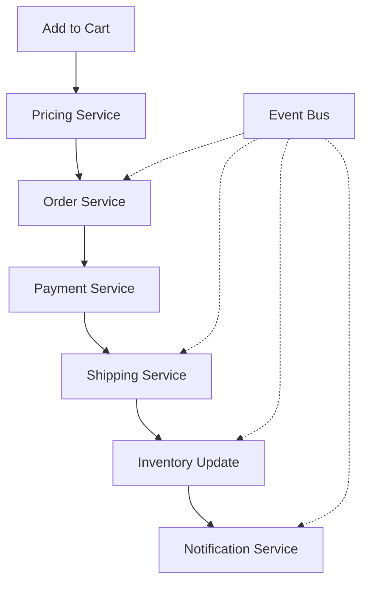
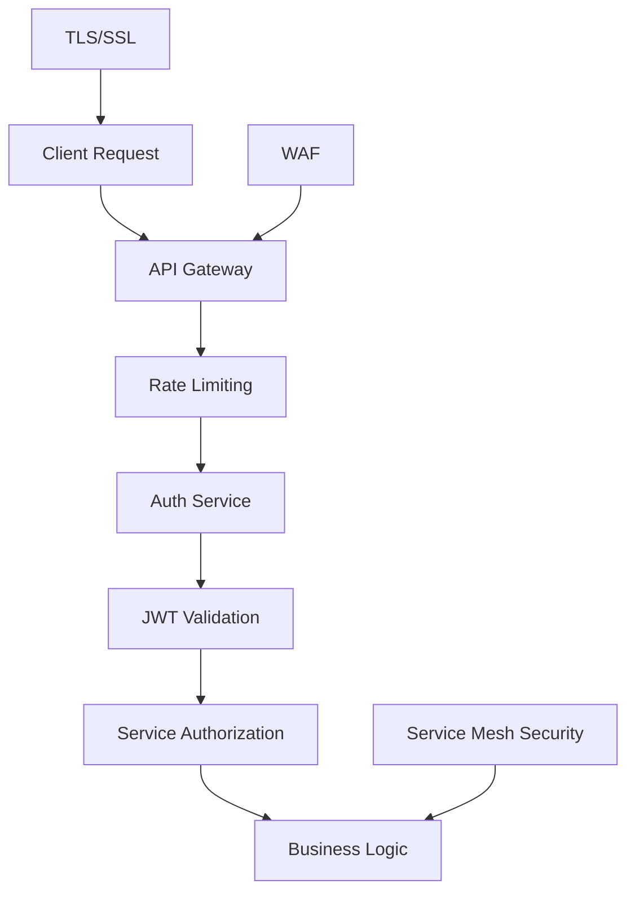

# Complete Microservices Architecture Diagram - Kratos + Consul

## System Architecture Overview with Kratos Framework and Consul Integration

```mermaid
graph TB
    %% Presentation Layer
    subgraph "Presentation Layer"
        UI[Frontend/Storefront]
        ADMIN[Admin Dashboard]
        MOBILE[Mobile App]
        API[API Gateway/BFF<br/>Consul Discovery]
    end
    
    %% Consul Service Mesh Layer
    subgraph "Consul Service Mesh & Discovery"
        CONSUL[Consul Cluster]
        CONSUL_KV[Consul KV Store<br/>Service Permissions]
        CONSUL_HEALTH[Health Checks<br/>Service Catalog]
        CONSUL_CONNECT[Consul Connect<br/>mTLS Optional]
    end
    
    %% Application Services Layer (Kratos)
    subgraph "Application Services Layer (Kratos Framework)"
        subgraph "Core Business Services"
            CAT[Catalog & CMS Service<br/>gRPC:9001 HTTP:8001]
            PRICE[Pricing Service<br/>gRPC:9002 HTTP:8002]
            PROMO[Promotion Service<br/>gRPC:9003 HTTP:8003]
            ORDER[Order Service<br/>gRPC:9004 HTTP:8004]
            PAY[Payment Service<br/>gRPC:9005 HTTP:8005]
            SHIP[Shipping Service<br/>gRPC:9006 HTTP:8006]
            CUST[Customer Service<br/>gRPC:9007 HTTP:8007]
            REV[Review Service<br/>gRPC:9008 HTTP:8008]
            INV[Warehouse & Inventory<br/>gRPC:9009 HTTP:8009]
            ANALYTICS[Analytics & Reporting<br/>gRPC:9010 HTTP:8010]
            LOYALTY[Loyalty & Rewards<br/>gRPC:9011 HTTP:8011]
        end
    end
    
    %% Infrastructure Services Layer (Kratos)
    subgraph "Infrastructure Services Layer (Kratos Framework)"
        AUTH[Auth Service IAM<br/>gRPC:9000 HTTP:8000<br/>Consul Permission Matrix]
        USER[User Service<br/>gRPC:9012 HTTP:8012]
        SEARCH[Search Service<br/>gRPC:9013 HTTP:8013]
        NOTIF[Notification Service<br/>gRPC:9014 HTTP:8014]
        CACHE[Cache Layer<br/>Redis]
        STORAGE[File Storage/CDN]
        MONITOR[Monitoring & Logging<br/>Prometheus + Jaeger]
    end
    
    %% Dapr Event-Driven Runtime Layer
    subgraph "Dapr Event-Driven Runtime"
        DAPR_PUBSUB[Dapr Pub/Sub<br/>Redis Backend]
        DAPR_STATE[Dapr State Store<br/>Redis Backend]
        DAPR_INVOKE[Dapr Service Invocation]
        DAPR_BINDINGS[Dapr Bindings]
        DAPR_SECRETS[Dapr Secrets]
    end
    
    %% External Systems
    subgraph "External Systems"
        PAYGATE[Payment Gateways]
        CARRIERS[Shipping Carriers]
        EMAIL[Email/SMS Providers]
        ELASTIC[Elasticsearch]
        REDIS[Redis Cluster]
        JAEGER[Jaeger Tracing]
        PROMETHEUS[Prometheus Metrics]
    end
    
    %% Consul Connections
    API --> CONSUL
    AUTH --> CONSUL
    CAT --> CONSUL
    PRICE --> CONSUL
    ORDER --> CONSUL
    PAY --> CONSUL
    SHIP --> CONSUL
    CUST --> CONSUL
    USER --> CONSUL
    NOTIF --> CONSUL
    
    %% Service Registration with Consul
    CONSUL --> CONSUL_KV
    CONSUL --> CONSUL_HEALTH
    CONSUL --> CONSUL_CONNECT
    
    %% Connections - Presentation to API
    UI --> API
    ADMIN --> API
    MOBILE --> API
    
    %% API Gateway to Services (via Consul Discovery)
    API -.->|Consul Discovery| AUTH
    API -.->|Consul Discovery| CAT
    API -.->|Consul Discovery| SEARCH
    API -.->|Consul Discovery| ORDER
    API -.->|Consul Discovery| CUST
    
    %% Core Service Interactions (gRPC Internal)
    CAT -.->|gRPC + Consul Auth| PRICE
    PROMO -.->|gRPC + Consul Auth| PRICE
    CUST -.->|gRPC + Consul Auth| PRICE
    INV -.->|gRPC + Consul Auth| PRICE
    LOYALTY -.->|gRPC + Consul Auth| PRICE
    
    PRICE -.->|gRPC + Consul Auth| ORDER
    INV -.->|gRPC + Consul Auth| ORDER
    CUST -.->|gRPC + Consul Auth| ORDER
    LOYALTY -.->|gRPC + Consul Auth| ORDER
    ORDER -.->|gRPC + Consul Auth| PAY
    ORDER -.->|gRPC + Consul Auth| SHIP
    ORDER -.->|gRPC + Consul Auth| REV
    ORDER -.->|gRPC + Consul Auth| ANALYTICS
    ORDER -.->|gRPC + Consul Auth| LOYALTY
    
    %% Search Service Inputs
    CAT -.->|gRPC + Consul Auth| SEARCH
    PRICE -.->|gRPC + Consul Auth| SEARCH
    REV -.->|gRPC + Consul Auth| SEARCH
    INV -.->|gRPC + Consul Auth| SEARCH
    
    %% Analytics Service Inputs
    ORDER -.->|gRPC + Consul Auth| ANALYTICS
    CUST -.->|gRPC + Consul Auth| ANALYTICS
    CAT -.->|gRPC + Consul Auth| ANALYTICS
    REV -.->|gRPC + Consul Auth| ANALYTICS
    INV -.->|gRPC + Consul Auth| ANALYTICS
    
    %% Loyalty Service Interactions
    CUST -.->|gRPC + Consul Auth| LOYALTY
    ORDER -.->|gRPC + Consul Auth| LOYALTY
    LOYALTY -.->|gRPC + Consul Auth| PROMO
    
    %% Dapr Event Bus Connections
    ORDER --> DAPR_PUBSUB
    PAY --> DAPR_PUBSUB
    SHIP --> DAPR_PUBSUB
    INV --> DAPR_PUBSUB
    CUST --> DAPR_PUBSUB
    
    DAPR_PUBSUB --> NOTIF
    DAPR_PUBSUB --> SEARCH
    DAPR_PUBSUB --> CACHE
    
    %% Dapr Service Invocation
    ORDER -.->|Dapr Invoke| PAY
    ORDER -.->|Dapr Invoke| SHIP
    CUST -.->|Dapr Invoke| ORDER
    
    %% Dapr State Store Connections
    ORDER --> DAPR_STATE
    CUST --> DAPR_STATE
    CART --> DAPR_STATE
    
    %% Infrastructure Connections
    AUTH -.->|gRPC + Consul Auth| CUST
    AUTH -.->|gRPC + Consul Auth| USER
    USER -.->|gRPC + Consul Auth| AUTH
    NOTIF --> EMAIL
    PAY --> PAYGATE
    SHIP --> CARRIERS
    SEARCH --> ELASTIC
    CACHE --> REDIS
    
    %% Monitoring (Kratos Built-in)
    MONITOR -.-> PROMETHEUS
    MONITOR -.-> JAEGER
    PROMETHEUS -.-> CAT
    PROMETHEUS -.-> ORDER
    PROMETHEUS -.-> PAY
    PROMETHEUS -.-> SHIP
    PROMETHEUS -.-> USER
    PROMETHEUS -.-> AUTH
    
    JAEGER -.-> CAT
    JAEGER -.-> ORDER
    JAEGER -.-> PAY
    JAEGER -.-> SHIP
    JAEGER -.-> USER
    JAEGER -.-> AUTH
    
    %% Cache Connections
    CACHE -.-> PRICE
    CACHE -.-> CAT
    CACHE -.-> SEARCH
    CACHE -.-> AUTH
    
    %% Storage Connections
    CAT --> STORAGE
    REV --> STORAGE
```

## Kratos + Consul Service Communication Patterns

### 1. Consul Service Discovery + gRPC Communication

### 2. Consul Permission Matrix Validation

### 3. Asynchronous Communication (Dapr Pub/Sub)

## Data Flow Architecture

### 1. Product Discovery Flow

### 2. Order Processing Flow

## Technology Stack by Layer

### Presentation Layer
- **Frontend**: React/Vue.js, Mobile Apps
- **API Gateway**: Kong, AWS API Gateway, or Nginx
- **Load Balancer**: HAProxy, AWS ALB

### Application Services
- **Runtime**: Node.js, Java Spring Boot, Python FastAPI
- **Databases**: PostgreSQL, MongoDB per service
- **API**: REST, GraphQL

### Infrastructure Services
- **Message Queue**: Apache Kafka, RabbitMQ
- **Cache**: Redis Cluster
- **Search**: Elasticsearch
- **Storage**: AWS S3, MinIO
- **Monitoring**: Prometheus, Grafana, ELK Stack

### Deployment & Orchestration
- **Containers**: Docker
- **Orchestration**: Kubernetes
- **Service Mesh**: Istio, Linkerd
- **CI/CD**: Jenkins, GitLab CI, GitHub Actions

## Security Architecture

## Scalability & Performance

### Horizontal Scaling
- Each service can scale independently
- Load balancing across service instances
- Database sharding per service

### Caching Strategy
- **L1 Cache**: Application-level caching
- **L2 Cache**: Redis distributed cache
- **L3 Cache**: CDN for static content

### Performance Optimization
- Async processing via Event Bus
- Database read replicas
- Connection pooling
- Circuit breaker patterns