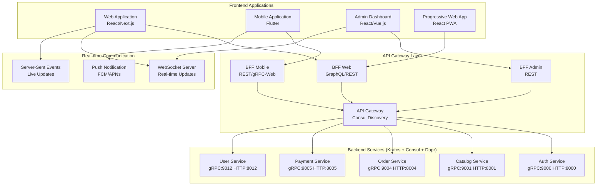

# Frontend Architecture - Multi-Platform E-Commerce

## Overview
Comprehensive frontend architecture supporting **Web**, **Mobile (Flutter)**, and **Admin Dashboard** applications, integrated with **Kratos + Consul + Dapr** backend microservices architecture.

## Multi-Platform Architecture



## Frontend Technology Stack

### 1. Web Application (React/Next.js)
- **Framework**: Next.js 14+ with App Router
- **Language**: TypeScript
- **State Management**: Zustand + React Query
- **UI Library**: Tailwind CSS + Headless UI
- **Authentication**: NextAuth.js with JWT
- **Real-time**: Socket.io client + Server-Sent Events
- **Testing**: Jest + React Testing Library + Playwright
- **Build Tool**: Turbopack
- **Deployment**: Vercel/Netlify

### 2. Mobile Application (Flutter)
- **Framework**: Flutter 3.16+ with Dart 3.2+
- **State Management**: Bloc/Cubit pattern
- **HTTP Client**: Dio with interceptors
- **Local Storage**: Hive + SQLite
- **Navigation**: GoRouter
- **Authentication**: JWT with secure storage
- **Push Notifications**: Firebase Cloud Messaging
- **Testing**: Widget tests + Integration tests
- **Deployment**: App Store + Google Play

### 3. Admin Dashboard (React/Vue.js)
- **Framework**: React 18+ or Vue 3+
- **Language**: TypeScript
- **State Management**: Redux Toolkit + RTK Query
- **UI Library**: Ant Design or Element Plus
- **Charts**: Chart.js or D3.js
- **Real-time**: WebSocket + Server-Sent Events
- **Testing**: Jest + Cypress
- **Deployment**: Docker + Kubernetes

### 4. Progressive Web App (PWA)
- **Base**: React/Next.js web application
- **Service Worker**: Workbox
- **Offline Support**: IndexedDB + Cache API
- **Push Notifications**: Web Push API
- **App Manifest**: PWA configuration
- **Installation**: Add to Home Screen

## Frontend Architecture Patterns

### 1. Clean Architecture (Mobile - Flutter)
```
lib/
├── core/                          # Core functionality
│   ├── constants/                 # App constants
│   ├── errors/                    # Error handling
│   ├── network/                   # API client + interceptors
│   ├── storage/                   # Local storage
│   ├── utils/                     # Utilities
│   └── di/                        # Dependency injection
├── features/                      # Feature modules
│   ├── auth/
│   │   ├── data/                  # Data layer
│   │   │   ├── datasources/       # Remote/Local data sources
│   │   │   ├── models/            # Data models
│   │   │   └── repositories/      # Repository implementations
│   │   ├── domain/                # Domain layer
│   │   │   ├── entities/          # Business entities
│   │   │   ├── repositories/      # Repository interfaces
│   │   │   └── usecases/          # Business logic
│   │   └── presentation/          # Presentation layer
│   │       ├── bloc/              # State management
│   │       ├── pages/             # UI pages
│   │       └── widgets/           # UI components
│   ├── catalog/
│   ├── cart/
│   ├── checkout/
│   └── orders/
└── shared/                        # Shared components
    ├── widgets/                   # Reusable widgets
    └── models/                    # Shared models
```

### 2. Feature-Based Architecture (Web - Next.js)
```
src/
├── app/                           # Next.js App Router
│   ├── (auth)/                    # Auth route group
│   │   ├── login/
│   │   └── register/
│   ├── (shop)/                    # Shop route group
│   │   ├── products/
│   │   ├── cart/
│   │   └── checkout/
│   ├── (account)/                 # Account route group
│   │   ├── profile/
│   │   └── orders/
│   ├── api/                       # API routes
│   ├── globals.css
│   ├── layout.tsx
│   └── page.tsx
├── components/                    # Reusable components
│   ├── ui/                        # Base UI components
│   ├── forms/                     # Form components
│   ├── layout/                    # Layout components
│   └── features/                  # Feature-specific components
├── lib/                           # Utilities and configurations
│   ├── api/                       # API client
│   ├── auth/                      # Authentication
│   ├── store/                     # State management
│   ├── utils/                     # Utility functions
│   └── validations/               # Form validations
├── hooks/                         # Custom React hooks
├── types/                         # TypeScript types
└── constants/                     # App constants
```

### 3. Domain-Driven Design (Admin Dashboard)
```
src/
├── domains/                       # Business domains
│   ├── auth/
│   │   ├── components/
│   │   ├── services/
│   │   ├── stores/
│   │   └── types/
│   ├── products/
│   ├── orders/
│   ├── customers/
│   └── analytics/
├── shared/                        # Shared across domains
│   ├── components/
│   ├── services/
│   ├── stores/
│   ├── utils/
│   └── types/
├── infrastructure/                # External concerns
│   ├── api/
│   ├── storage/
│   └── monitoring/
└── app/                           # Application layer
    ├── router/
    ├── store/
    └── providers/
```

## Backend Integration Patterns

### 1. API Client Configuration
```typescript
// Web/Admin API Client
import axios from 'axios';

const apiClient = axios.create({
  baseURL: process.env.NEXT_PUBLIC_API_URL || 'http://localhost:8080',
  timeout: 30000,
  headers: {
    'Content-Type': 'application/json',
  },
});

// Request interceptor for auth
apiClient.interceptors.request.use((config) => {
  const token = localStorage.getItem('access_token');
  if (token) {
    config.headers.Authorization = `Bearer ${token}`;
  }
  return config;
});

// Response interceptor for error handling
apiClient.interceptors.response.use(
  (response) => response,
  async (error) => {
    if (error.response?.status === 401) {
      // Handle token refresh or redirect to login
      await refreshToken();
    }
    return Promise.reject(error);
  }
);
```

```dart
// Flutter API Client
class ApiClient {
  late final Dio _dio;
  
  ApiClient() {
    _dio = Dio(BaseOptions(
      baseUrl: ApiConstants.baseUrl,
      connectTimeout: const Duration(seconds: 30),
      receiveTimeout: const Duration(seconds: 30),
      headers: {
        'Content-Type': 'application/json',
        'Accept': 'application/json',
      },
    ));
    
    _setupInterceptors();
  }
  
  void _setupInterceptors() {
    // Auth interceptor
    _dio.interceptors.add(AuthInterceptor());
    
    // Retry interceptor with exponential backoff
    _dio.interceptors.add(RetryInterceptor(_dio));
    
    // Consul service discovery interceptor
    _dio.interceptors.add(ConsulDiscoveryInterceptor());
  }
}
```

### 2. Service Discovery Integration
```typescript
// Service Discovery Client (Web)
class ServiceDiscoveryClient {
  private consulUrl = process.env.CONSUL_URL || 'http://localhost:8500';
  
  async discoverService(serviceName: string): Promise<string> {
    const response = await fetch(
      `${this.consulUrl}/v1/health/service/${serviceName}?passing=true`
    );
    const services = await response.json();
    
    if (services.length === 0) {
      throw new Error(`Service ${serviceName} not found`);
    }
    
    // Simple round-robin selection
    const service = services[Math.floor(Math.random() * services.length)];
    return `http://${service.Service.Address}:${service.Service.Port}`;
  }
  
  async callService(serviceName: string, endpoint: string, options: RequestInit = {}) {
    const serviceUrl = await this.discoverService(serviceName);
    return fetch(`${serviceUrl}${endpoint}`, options);
  }
}
```

### 3. Real-time Communication
```typescript
// WebSocket Client (Web/Admin)
class WebSocketClient {
  private ws: WebSocket | null = null;
  private reconnectAttempts = 0;
  private maxReconnectAttempts = 5;
  
  connect(url: string) {
    this.ws = new WebSocket(url);
    
    this.ws.onopen = () => {
      console.log('WebSocket connected');
      this.reconnectAttempts = 0;
    };
    
    this.ws.onmessage = (event) => {
      const data = JSON.parse(event.data);
      this.handleMessage(data);
    };
    
    this.ws.onclose = () => {
      this.reconnect(url);
    };
    
    this.ws.onerror = (error) => {
      console.error('WebSocket error:', error);
    };
  }
  
  private handleMessage(data: any) {
    switch (data.type) {
      case 'order.created':
        // Handle order created event
        break;
      case 'order.status_updated':
        // Handle order status update
        break;
      case 'inventory.updated':
        // Handle inventory update
        break;
    }
  }
  
  private reconnect(url: string) {
    if (this.reconnectAttempts < this.maxReconnectAttempts) {
      setTimeout(() => {
        this.reconnectAttempts++;
        this.connect(url);
      }, Math.pow(2, this.reconnectAttempts) * 1000);
    }
  }
}
```

```dart
// Push Notifications (Flutter)
class PushNotificationService {
  final FirebaseMessaging _firebaseMessaging = FirebaseMessaging.instance;
  
  Future<void> initialize() async {
    // Request permission
    await _firebaseMessaging.requestPermission();
    
    // Get FCM token
    final token = await _firebaseMessaging.getToken();
    print('FCM Token: $token');
    
    // Handle foreground messages
    FirebaseMessaging.onMessage.listen((RemoteMessage message) {
      _handleMessage(message);
    });
    
    // Handle background messages
    FirebaseMessaging.onBackgroundMessage(_firebaseMessagingBackgroundHandler);
    
    // Handle notification taps
    FirebaseMessaging.onMessageOpenedApp.listen((RemoteMessage message) {
      _handleNotificationTap(message);
    });
  }
  
  void _handleMessage(RemoteMessage message) {
    switch (message.data['type']) {
      case 'order_status_update':
        // Handle order status update
        break;
      case 'promotion_available':
        // Handle promotion notification
        break;
    }
  }
}
```

## State Management Patterns

### 1. Web Application (Zustand + React Query)
```typescript
// Store definition
import { create } from 'zustand';
import { persist } from 'zustand/middleware';

interface AuthState {
  user: User | null;
  token: string | null;
  isAuthenticated: boolean;
  login: (email: string, password: string) => Promise<void>;
  logout: () => void;
}

export const useAuthStore = create<AuthState>()(
  persist(
    (set, get) => ({
      user: null,
      token: null,
      isAuthenticated: false,
      
      login: async (email: string, password: string) => {
        const response = await apiClient.post('/auth/login', { email, password });
        const { user, access_token } = response.data;
        
        set({
          user,
          token: access_token,
          isAuthenticated: true,
        });
      },
      
      logout: () => {
        set({
          user: null,
          token: null,
          isAuthenticated: false,
        });
      },
    }),
    {
      name: 'auth-storage',
      partialize: (state) => ({ 
        user: state.user, 
        token: state.token,
        isAuthenticated: state.isAuthenticated,
      }),
    }
  )
);

// React Query for server state
import { useQuery, useMutation, useQueryClient } from '@tanstack/react-query';

export const useProducts = (params: ProductsParams) => {
  return useQuery({
    queryKey: ['products', params],
    queryFn: () => apiClient.get('/products', { params }).then(res => res.data),
    staleTime: 5 * 60 * 1000, // 5 minutes
  });
};

export const useAddToCart = () => {
  const queryClient = useQueryClient();
  
  return useMutation({
    mutationFn: (item: CartItem) => apiClient.post('/cart/items', item),
    onSuccess: () => {
      queryClient.invalidateQueries({ queryKey: ['cart'] });
    },
  });
};
```

### 2. Mobile Application (Flutter Bloc)
```dart
// Auth Bloc
class AuthBloc extends Bloc<AuthEvent, AuthState> {
  final AuthRepository _authRepository;
  
  AuthBloc({required AuthRepository authRepository})
      : _authRepository = authRepository,
        super(AuthInitial()) {
    on<AuthLoginRequested>(_onLoginRequested);
    on<AuthLogoutRequested>(_onLogoutRequested);
    on<AuthCheckRequested>(_onAuthCheckRequested);
  }
  
  Future<void> _onLoginRequested(
    AuthLoginRequested event,
    Emitter<AuthState> emit,
  ) async {
    emit(AuthLoading());
    
    try {
      final user = await _authRepository.login(
        email: event.email,
        password: event.password,
      );
      emit(AuthAuthenticated(user: user));
    } catch (e) {
      emit(AuthError(message: e.toString()));
    }
  }
}

// Product Cubit (simpler state management)
class ProductCubit extends Cubit<ProductState> {
  final ProductRepository _productRepository;
  
  ProductCubit({required ProductRepository productRepository})
      : _productRepository = productRepository,
        super(ProductInitial());
  
  Future<void> loadProducts({
    int page = 1,
    int limit = 20,
    String? category,
    String? search,
  }) async {
    if (page == 1) {
      emit(ProductLoading());
    } else {
      emit(ProductLoadingMore(products: state.products));
    }
    
    try {
      final result = await _productRepository.getProducts(
        page: page,
        limit: limit,
        category: category,
        search: search,
      );
      
      if (page == 1) {
        emit(ProductLoaded(
          products: result.products,
          hasMore: result.hasMore,
        ));
      } else {
        emit(ProductLoaded(
          products: [...state.products, ...result.products],
          hasMore: result.hasMore,
        ));
      }
    } catch (e) {
      emit(ProductError(message: e.toString()));
    }
  }
}
```

### 3. Admin Dashboard (Redux Toolkit)
```typescript
// Auth Slice
import { createSlice, createAsyncThunk } from '@reduxjs/toolkit';

export const loginAsync = createAsyncThunk(
  'auth/login',
  async ({ email, password }: LoginCredentials) => {
    const response = await apiClient.post('/auth/login', { email, password });
    return response.data;
  }
);

const authSlice = createSlice({
  name: 'auth',
  initialState: {
    user: null,
    token: null,
    isAuthenticated: false,
    loading: false,
    error: null,
  },
  reducers: {
    logout: (state) => {
      state.user = null;
      state.token = null;
      state.isAuthenticated = false;
    },
  },
  extraReducers: (builder) => {
    builder
      .addCase(loginAsync.pending, (state) => {
        state.loading = true;
        state.error = null;
      })
      .addCase(loginAsync.fulfilled, (state, action) => {
        state.loading = false;
        state.user = action.payload.user;
        state.token = action.payload.access_token;
        state.isAuthenticated = true;
      })
      .addCase(loginAsync.rejected, (state, action) => {
        state.loading = false;
        state.error = action.error.message || 'Login failed';
      });
  },
});

// RTK Query for API calls
import { createApi, fetchBaseQuery } from '@reduxjs/toolkit/query/react';

export const productsApi = createApi({
  reducerPath: 'productsApi',
  baseQuery: fetchBaseQuery({
    baseUrl: '/api/products',
    prepareHeaders: (headers, { getState }) => {
      const token = (getState() as RootState).auth.token;
      if (token) {
        headers.set('authorization', `Bearer ${token}`);
      }
      return headers;
    },
  }),
  tagTypes: ['Product'],
  endpoints: (builder) => ({
    getProducts: builder.query<ProductsResponse, ProductsParams>({
      query: (params) => ({ url: '', params }),
      providesTags: ['Product'],
    }),
    createProduct: builder.mutation<Product, CreateProductRequest>({
      query: (product) => ({
        url: '',
        method: 'POST',
        body: product,
      }),
      invalidatesTags: ['Product'],
    }),
  }),
});
```

## Performance Optimization

### 1. Web Performance
```typescript
// Code splitting with React.lazy
const ProductDetail = lazy(() => import('./pages/ProductDetail'));
const Cart = lazy(() => import('./pages/Cart'));
const Checkout = lazy(() => import('./pages/Checkout'));

// Image optimization with Next.js
import Image from 'next/image';

<Image
  src="/product-image.jpg"
  alt="Product"
  width={300}
  height={200}
  priority={isAboveFold}
  placeholder="blur"
  blurDataURL="data:image/jpeg;base64,..."
/>

// Virtual scrolling for large lists
import { FixedSizeList as List } from 'react-window';

const ProductList = ({ products }) => (
  <List
    height={600}
    itemCount={products.length}
    itemSize={120}
    itemData={products}
  >
    {ProductItem}
  </List>
);
```

### 2. Mobile Performance
```dart
// Image caching and optimization
CachedNetworkImage(
  imageUrl: product.imageUrl,
  placeholder: (context, url) => const ShimmerWidget(),
  errorWidget: (context, url, error) => const Icon(Icons.error),
  memCacheWidth: 300,
  memCacheHeight: 200,
  maxWidthDiskCache: 600,
  maxHeightDiskCache: 400,
)

// Lazy loading with pagination
class ProductListView extends StatefulWidget {
  @override
  _ProductListViewState createState() => _ProductListViewState();
}

class _ProductListViewState extends State<ProductListView> {
  final ScrollController _scrollController = ScrollController();
  
  @override
  void initState() {
    super.initState();
    _scrollController.addListener(_onScroll);
  }
  
  void _onScroll() {
    if (_scrollController.position.pixels >= 
        _scrollController.position.maxScrollExtent * 0.8) {
      context.read<ProductCubit>().loadMoreProducts();
    }
  }
  
  @override
  Widget build(BuildContext context) {
    return ListView.builder(
      controller: _scrollController,
      itemCount: products.length + (hasMore ? 1 : 0),
      itemBuilder: (context, index) {
        if (index == products.length) {
          return const LoadingWidget();
        }
        return ProductCard(product: products[index]);
      },
    );
  }
}
```

## Security Implementation

### 1. Authentication & Authorization
```typescript
// JWT Token Management (Web)
class TokenManager {
  private static readonly ACCESS_TOKEN_KEY = 'access_token';
  private static readonly REFRESH_TOKEN_KEY = 'refresh_token';
  
  static setTokens(accessToken: string, refreshToken: string) {
    localStorage.setItem(this.ACCESS_TOKEN_KEY, accessToken);
    localStorage.setItem(this.REFRESH_TOKEN_KEY, refreshToken);
  }
  
  static getAccessToken(): string | null {
    return localStorage.getItem(this.ACCESS_TOKEN_KEY);
  }
  
  static async refreshToken(): Promise<string> {
    const refreshToken = localStorage.getItem(this.REFRESH_TOKEN_KEY);
    if (!refreshToken) {
      throw new Error('No refresh token available');
    }
    
    const response = await fetch('/api/auth/refresh', {
      method: 'POST',
      headers: { 'Content-Type': 'application/json' },
      body: JSON.stringify({ refresh_token: refreshToken }),
    });
    
    if (!response.ok) {
      this.clearTokens();
      throw new Error('Token refresh failed');
    }
    
    const { access_token, refresh_token } = await response.json();
    this.setTokens(access_token, refresh_token);
    
    return access_token;
  }
  
  static clearTokens() {
    localStorage.removeItem(this.ACCESS_TOKEN_KEY);
    localStorage.removeItem(this.REFRESH_TOKEN_KEY);
  }
}
```

```dart
// Secure Storage (Flutter)
class SecureTokenStorage {
  static const _storage = FlutterSecureStorage(
    aOptions: AndroidOptions(
      encryptedSharedPreferences: true,
    ),
    iOptions: IOSOptions(
      accessibility: IOSAccessibility.first_unlock_this_device,
    ),
  );
  
  static Future<void> storeTokens({
    required String accessToken,
    required String refreshToken,
  }) async {
    await Future.wait([
      _storage.write(key: 'access_token', value: accessToken),
      _storage.write(key: 'refresh_token', value: refreshToken),
    ]);
  }
  
  static Future<String?> getAccessToken() async {
    return await _storage.read(key: 'access_token');
  }
  
  static Future<void> clearTokens() async {
    await _storage.deleteAll();
  }
}
```

### 2. Input Validation & Sanitization
```typescript
// Form validation with Zod (Web)
import { z } from 'zod';

const loginSchema = z.object({
  email: z.string().email('Invalid email address'),
  password: z.string().min(8, 'Password must be at least 8 characters'),
});

const registerSchema = z.object({
  name: z.string().min(2, 'Name must be at least 2 characters'),
  email: z.string().email('Invalid email address'),
  password: z.string()
    .min(8, 'Password must be at least 8 characters')
    .regex(/^(?=.*[a-z])(?=.*[A-Z])(?=.*\d)/, 'Password must contain uppercase, lowercase, and number'),
  confirmPassword: z.string(),
}).refine((data) => data.password === data.confirmPassword, {
  message: "Passwords don't match",
  path: ["confirmPassword"],
});

// Usage in form
const { register, handleSubmit, formState: { errors } } = useForm({
  resolver: zodResolver(loginSchema),
});
```

```dart
// Form validation (Flutter)
class FormValidators {
  static String? validateEmail(String? value) {
    if (value == null || value.isEmpty) {
      return 'Email is required';
    }
    
    final emailRegex = RegExp(r'^[\w-\.]+@([\w-]+\.)+[\w-]{2,4}$');
    if (!emailRegex.hasMatch(value)) {
      return 'Please enter a valid email address';
    }
    
    return null;
  }
  
  static String? validatePassword(String? value) {
    if (value == null || value.isEmpty) {
      return 'Password is required';
    }
    
    if (value.length < 8) {
      return 'Password must be at least 8 characters';
    }
    
    final passwordRegex = RegExp(r'^(?=.*[a-z])(?=.*[A-Z])(?=.*\d)');
    if (!passwordRegex.hasMatch(value)) {
      return 'Password must contain uppercase, lowercase, and number';
    }
    
    return null;
  }
}
```

## Testing Strategy

### 1. Web Testing
```typescript
// Unit tests with Jest + React Testing Library
import { render, screen, fireEvent, waitFor } from '@testing-library/react';
import { LoginForm } from './LoginForm';

describe('LoginForm', () => {
  it('should display validation errors for invalid input', async () => {
    render(<LoginForm />);
    
    const emailInput = screen.getByLabelText(/email/i);
    const passwordInput = screen.getByLabelText(/password/i);
    const submitButton = screen.getByRole('button', { name: /login/i });
    
    fireEvent.change(emailInput, { target: { value: 'invalid-email' } });
    fireEvent.change(passwordInput, { target: { value: '123' } });
    fireEvent.click(submitButton);
    
    await waitFor(() => {
      expect(screen.getByText(/invalid email address/i)).toBeInTheDocument();
      expect(screen.getByText(/password must be at least 8 characters/i)).toBeInTheDocument();
    });
  });
});

// E2E tests with Playwright
import { test, expect } from '@playwright/test';

test('user can complete checkout process', async ({ page }) => {
  await page.goto('/products');
  
  // Add product to cart
  await page.click('[data-testid="add-to-cart-btn"]');
  await expect(page.locator('[data-testid="cart-count"]')).toHaveText('1');
  
  // Go to cart
  await page.click('[data-testid="cart-link"]');
  await expect(page.locator('[data-testid="cart-item"]')).toBeVisible();
  
  // Proceed to checkout
  await page.click('[data-testid="checkout-btn"]');
  await expect(page).toHaveURL(/.*checkout/);
  
  // Fill checkout form
  await page.fill('[data-testid="email-input"]', 'test@example.com');
  await page.fill('[data-testid="address-input"]', '123 Test St');
  
  // Complete order
  await page.click('[data-testid="place-order-btn"]');
  await expect(page.locator('[data-testid="order-success"]')).toBeVisible();
});
```

### 2. Mobile Testing
```dart
// Widget tests
void main() {
  group('LoginForm Widget Tests', () {
    testWidgets('should display validation errors for invalid input', (tester) async {
      await tester.pumpWidget(
        MaterialApp(
          home: Scaffold(
            body: LoginForm(),
          ),
        ),
      );
      
      // Find form fields
      final emailField = find.byKey(const Key('email_field'));
      final passwordField = find.byKey(const Key('password_field'));
      final loginButton = find.byKey(const Key('login_button'));
      
      // Enter invalid data
      await tester.enterText(emailField, 'invalid-email');
      await tester.enterText(passwordField, '123');
      await tester.tap(loginButton);
      await tester.pump();
      
      // Verify validation errors
      expect(find.text('Please enter a valid email address'), findsOneWidget);
      expect(find.text('Password must be at least 8 characters'), findsOneWidget);
    });
  });
}

// Integration tests
void main() {
  group('E-Commerce App Integration Tests', () {
    testWidgets('complete shopping flow', (tester) async {
      await tester.pumpWidget(MyApp());
      
      // Navigate to product catalog
      await tester.tap(find.byKey(const Key('catalog_tab')));
      await tester.pumpAndSettle();
      
      // Add product to cart
      await tester.tap(find.byKey(const Key('add_to_cart_btn')).first);
      await tester.pumpAndSettle();
      
      // Verify cart badge updated
      expect(find.text('1'), findsOneWidget);
      
      // Navigate to cart
      await tester.tap(find.byKey(const Key('cart_tab')));
      await tester.pumpAndSettle();
      
      // Verify product in cart
      expect(find.byType(CartItem), findsOneWidget);
      
      // Proceed to checkout
      await tester.tap(find.byKey(const Key('checkout_btn')));
      await tester.pumpAndSettle();
      
      // Complete checkout process
      await tester.enterText(find.byKey(const Key('address_field')), '123 Test St');
      await tester.tap(find.byKey(const Key('place_order_btn')));
      await tester.pumpAndSettle();
      
      // Verify order success
      expect(find.text('Order placed successfully!'), findsOneWidget);
    });
  });
}
```

## Deployment & DevOps

### 1. Web Deployment (Next.js)
```yaml
# .github/workflows/deploy-web.yml
name: Deploy Web Application

on:
  push:
    branches: [main]
    paths: ['web/**']

jobs:
  deploy:
    runs-on: ubuntu-latest
    steps:
      - uses: actions/checkout@v4
      
      - name: Setup Node.js
        uses: actions/setup-node@v4
        with:
          node-version: '18'
          cache: 'npm'
          cache-dependency-path: web/package-lock.json
      
      - name: Install dependencies
        run: npm ci
        working-directory: web
      
      - name: Run tests
        run: npm test
        working-directory: web
      
      - name: Build application
        run: npm run build
        working-directory: web
        env:
          NEXT_PUBLIC_API_URL: ${{ secrets.API_URL }}
          NEXT_PUBLIC_CONSUL_URL: ${{ secrets.CONSUL_URL }}
      
      - name: Deploy to Vercel
        uses: amondnet/vercel-action@v25
        with:
          vercel-token: ${{ secrets.VERCEL_TOKEN }}
          vercel-org-id: ${{ secrets.VERCEL_ORG_ID }}
          vercel-project-id: ${{ secrets.VERCEL_PROJECT_ID }}
          working-directory: web
```

### 2. Mobile Deployment (Flutter)
```yaml
# .github/workflows/deploy-mobile.yml
name: Deploy Mobile Application

on:
  push:
    branches: [main]
    paths: ['mobile/**']

jobs:
  build-android:
    runs-on: ubuntu-latest
    steps:
      - uses: actions/checkout@v4
      
      - name: Setup Java
        uses: actions/setup-java@v3
        with:
          distribution: 'zulu'
          java-version: '11'
      
      - name: Setup Flutter
        uses: subosito/flutter-action@v2
        with:
          flutter-version: '3.16.0'
          channel: 'stable'
      
      - name: Install dependencies
        run: flutter pub get
        working-directory: mobile
      
      - name: Run tests
        run: flutter test
        working-directory: mobile
      
      - name: Build APK
        run: flutter build apk --release
        working-directory: mobile
        env:
          API_URL: ${{ secrets.API_URL }}
          CONSUL_URL: ${{ secrets.CONSUL_URL }}
      
      - name: Upload to Play Store
        uses: r0adkll/upload-google-play@v1
        with:
          serviceAccountJsonPlainText: ${{ secrets.GOOGLE_PLAY_SERVICE_ACCOUNT }}
          packageName: com.ecommerce.app
          releaseFiles: mobile/build/app/outputs/flutter-apk/app-release.apk
          track: production

  build-ios:
    runs-on: macos-latest
    steps:
      - uses: actions/checkout@v4
      
      - name: Setup Flutter
        uses: subosito/flutter-action@v2
        with:
          flutter-version: '3.16.0'
          channel: 'stable'
      
      - name: Install dependencies
        run: flutter pub get
        working-directory: mobile
      
      - name: Build iOS
        run: flutter build ios --release --no-codesign
        working-directory: mobile
      
      - name: Upload to App Store
        uses: apple-actions/upload-testflight-build@v1
        with:
          app-path: mobile/build/ios/iphoneos/Runner.app
          issuer-id: ${{ secrets.APPSTORE_ISSUER_ID }}
          api-key-id: ${{ secrets.APPSTORE_API_KEY_ID }}
          api-private-key: ${{ secrets.APPSTORE_API_PRIVATE_KEY }}
```

### 3. Docker Configuration
```dockerfile
# Web Application Dockerfile
FROM node:18-alpine AS base
WORKDIR /app
COPY package*.json ./
RUN npm ci --only=production

FROM node:18-alpine AS build
WORKDIR /app
COPY package*.json ./
RUN npm ci
COPY . .
RUN npm run build

FROM node:18-alpine AS runtime
WORKDIR /app
COPY --from=base /app/node_modules ./node_modules
COPY --from=build /app/.next ./.next
COPY --from=build /app/public ./public
COPY --from=build /app/package.json ./package.json

EXPOSE 3000
CMD ["npm", "start"]
```

## Monitoring & Analytics

### 1. Performance Monitoring
```typescript
// Web Vitals tracking
import { getCLS, getFID, getFCP, getLCP, getTTFB } from 'web-vitals';

function sendToAnalytics(metric) {
  // Send to your analytics service
  analytics.track('Web Vital', {
    name: metric.name,
    value: metric.value,
    id: metric.id,
  });
}

getCLS(sendToAnalytics);
getFID(sendToAnalytics);
getFCP(sendToAnalytics);
getLCP(sendToAnalytics);
getTTFB(sendToAnalytics);

// Error tracking with Sentry
import * as Sentry from '@sentry/nextjs';

Sentry.init({
  dsn: process.env.NEXT_PUBLIC_SENTRY_DSN,
  environment: process.env.NODE_ENV,
  tracesSampleRate: 1.0,
});
```

```dart
// Flutter performance monitoring
import 'package:firebase_performance/firebase_performance.dart';

class PerformanceMonitoring {
  static Future<void> trackScreenView(String screenName) async {
    final trace = FirebasePerformance.instance.newTrace('screen_$screenName');
    await trace.start();
    
    // Screen is displayed
    await Future.delayed(Duration(milliseconds: 100));
    
    await trace.stop();
  }
  
  static Future<T> trackNetworkRequest<T>(
    String name,
    Future<T> Function() request,
  ) async {
    final trace = FirebasePerformance.instance.newTrace('network_$name');
    await trace.start();
    
    try {
      final result = await request();
      trace.putAttribute('success', 'true');
      return result;
    } catch (e) {
      trace.putAttribute('success', 'false');
      trace.putAttribute('error', e.toString());
      rethrow;
    } finally {
      await trace.stop();
    }
  }
}
```

### 2. User Analytics
```typescript
// User behavior tracking
class Analytics {
  static track(event: string, properties?: Record<string, any>) {
    // Send to multiple analytics services
    gtag('event', event, properties);
    mixpanel.track(event, properties);
    amplitude.logEvent(event, properties);
  }
  
  static identify(userId: string, traits?: Record<string, any>) {
    gtag('config', 'GA_MEASUREMENT_ID', { user_id: userId });
    mixpanel.identify(userId);
    amplitude.setUserId(userId);
    
    if (traits) {
      mixpanel.people.set(traits);
      amplitude.setUserProperties(traits);
    }
  }
  
  static page(name: string, properties?: Record<string, any>) {
    gtag('config', 'GA_MEASUREMENT_ID', {
      page_title: name,
      page_location: window.location.href,
      ...properties,
    });
  }
}

// E-commerce tracking
export const trackPurchase = (order: Order) => {
  Analytics.track('Purchase', {
    order_id: order.id,
    value: order.total,
    currency: order.currency,
    items: order.items.map(item => ({
      item_id: item.product_id,
      item_name: item.product_name,
      category: item.category,
      quantity: item.quantity,
      price: item.price,
    })),
  });
};
```

This comprehensive frontend architecture provides a solid foundation for building modern, scalable, and maintainable e-commerce applications across multiple platforms while integrating seamlessly with the Kratos + Consul + Dapr backend architecture.