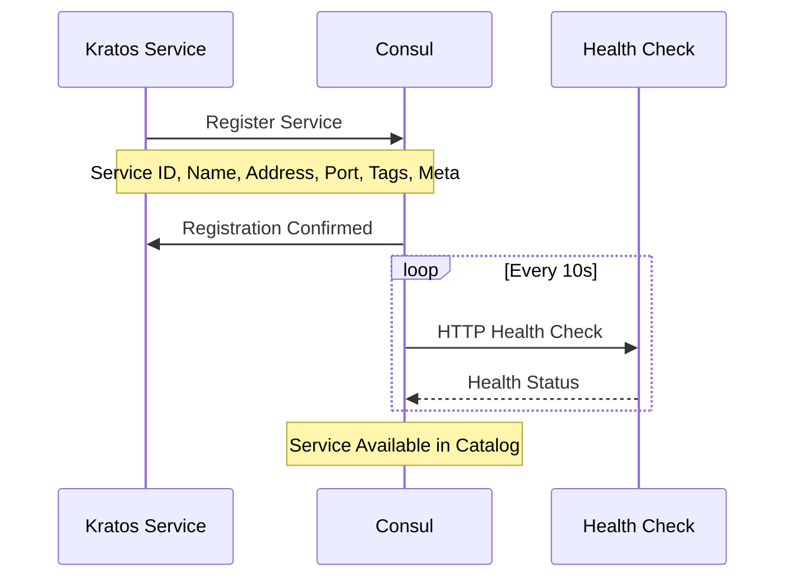
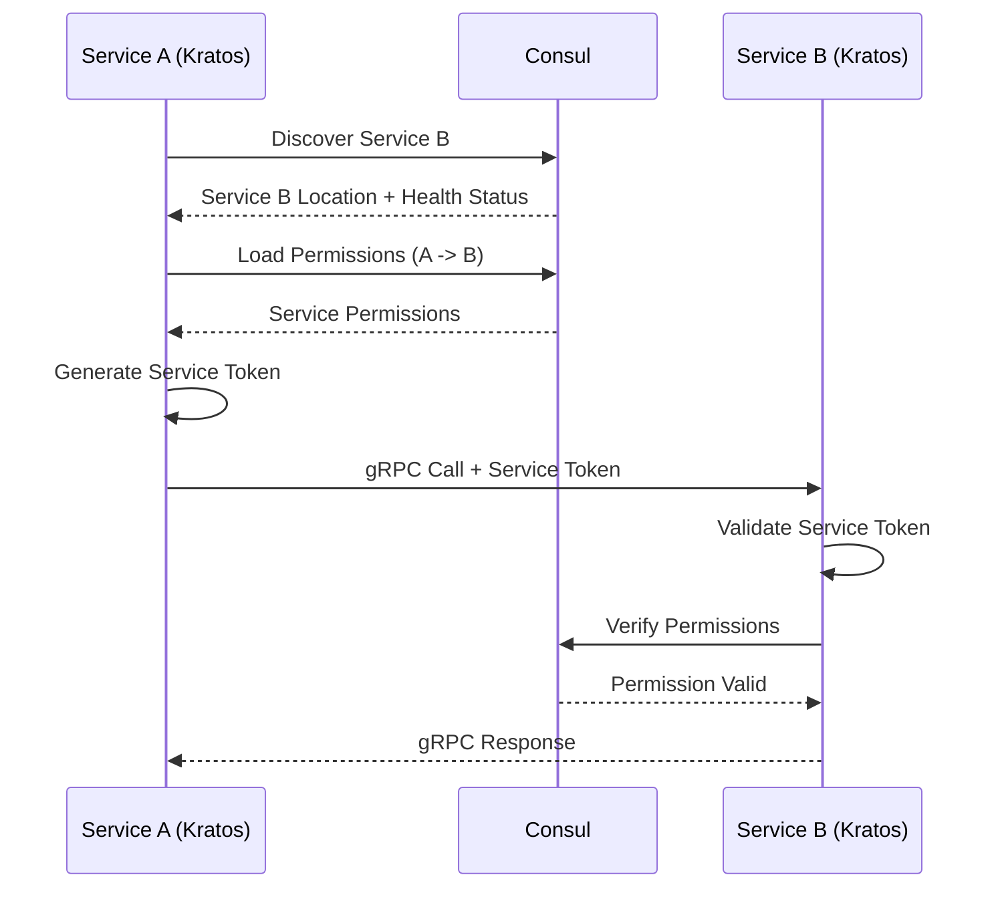
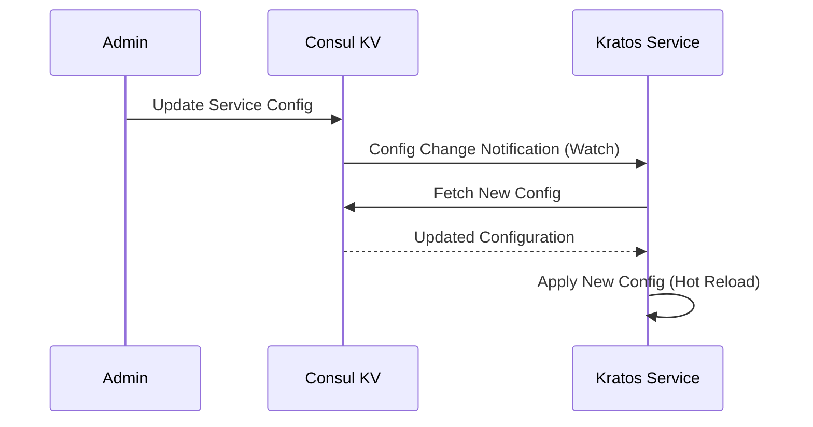
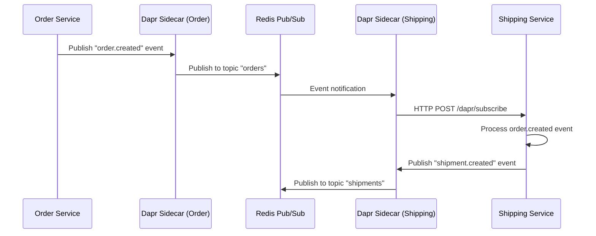
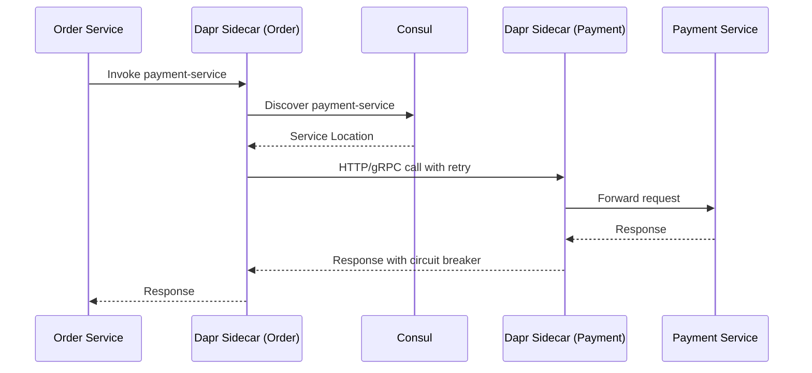

# Kratos + Consul + Dapr Integration Architecture

## Overview
This document describes the integration of **go-kratos/kratos** framework with **Consul** and **Dapr** for building modern, cloud-native microservices with comprehensive service discovery, configuration management, event-driven communication, and security.

## Architecture Components

### 1. Kratos Framework Benefits
- **Dual Protocol Support**: gRPC (internal) + HTTP/REST (external)
- **Built-in Observability**: Prometheus metrics, Jaeger tracing, structured logging
- **Configuration Management**: Multi-source config (file, env, Consul KV)
- **Dependency Injection**: Wire-based compile-time DI
- **Production Ready**: Graceful shutdown, health checks, circuit breakers

### 2. Consul Integration Benefits
- **Service Discovery**: Automatic registration and discovery
- **Health Monitoring**: Integrated health checks and service catalog
- **Configuration Management**: Dynamic config updates via Consul KV
- **Service Permission Matrix**: Centralized service-to-service authorization
- **Session Management**: Distributed coordination and locking

### 3. Dapr Integration Benefits
- **Event-Driven Messaging**: Pub/Sub with Redis backend
- **State Management**: Distributed state store with Redis
- **Service Invocation**: Reliable service-to-service calls
- **External Bindings**: Integration with external systems
- **Secrets Management**: Secure secret handling
- **Multi-Cloud Portability**: Infrastructure abstraction

## Service Architecture Pattern

### Kratos Service Structure
```
service/
├── cmd/server/
│   ├── main.go              # Kratos app initialization
│   ├── wire.go              # Dependency injection
│   └── wire_gen.go          # Generated Wire code
├── internal/
│   ├── conf/                # Configuration (protobuf)
│   ├── data/                # Data access layer
│   ├── biz/                 # Business logic layer
│   ├── service/             # Service layer (gRPC/HTTP)
│   └── server/              # Server setup (gRPC/HTTP)
├── api/                     # Protobuf API definitions
├── configs/                 # Configuration files
└── pkg/                     # Shared utilities
```

### Integration Points

#### Consul Integration Points
1. **Service Registration**: Automatic registration with health checks
2. **Service Discovery**: Dynamic service location resolution
3. **Configuration**: Runtime config updates via Consul KV
4. **Permission Matrix**: Service-to-service authorization
5. **Health Monitoring**: Service health and availability tracking

#### Dapr Integration Points
1. **Event Publishing**: Pub/Sub messaging via Dapr sidecar
2. **Event Subscription**: Event handling with Dapr runtime
3. **State Management**: Distributed state with Redis backend
4. **Service Invocation**: Reliable service calls via Dapr
5. **External Integration**: Bindings to external systems

## Service Communication Flow

### 1. Service Registration


### 2. Service Discovery + gRPC Call


### 3. Configuration Updates


### 4. Dapr Event-Driven Communication


### 5. Dapr Service Invocation


## Implementation Examples

### 1. Service Registration (main.go)
```go
func main() {
    // Load configuration
    c := config.New(
        config.WithSource(
            file.NewSource(flagconf),
            env.NewSource("CATALOG_"),
            consul.NewSource(consulClient, "service-config/catalog-service"),
        ),
    )
    
    // Initialize Consul client
    consulClient, err := consul.NewClient(bc.Consul)
    if err != nil {
        panic(err)
    }
    
    // Create registry
    r := consul.NewRegistry(consulClient)
    
    // Initialize Kratos app with Consul registry
    app, cleanup, err := wireApp(bc.Server, bc.Data, bc.Consul, logger, r)
    if err != nil {
        panic(err)
    }
    defer cleanup()
    
    // Start application
    if err := app.Run(); err != nil {
        panic(err)
    }
}
```

### 2. Service Discovery Client
```go
type ConsulServiceClient struct {
    consulClient *consul.Client
    registry     registry.Discovery
}

func (c *ConsulServiceClient) CallUserService(ctx context.Context, req *pb.GetUserRequest) (*pb.User, error) {
    // Discover service
    instances, err := c.registry.GetService(ctx, "user-service")
    if err != nil {
        return nil, err
    }
    
    // Load permissions from Consul KV
    permissions, err := c.loadServicePermissions("catalog-service", "user-service")
    if err != nil {
        return nil, err
    }
    
    // Generate service token
    token, err := c.generateServiceToken("catalog-service", "user-service", permissions)
    if err != nil {
        return nil, err
    }
    
    // Create gRPC connection
    conn, err := grpc.DialInsecure(
        ctx,
        grpc.WithEndpoint(instances[0].Endpoints[0]),
        grpc.WithMiddleware(
            middleware.Chain(
                middleware.ServiceToken(token),
                middleware.Tracing(),
                middleware.Logging(),
            ),
        ),
    )
    if err != nil {
        return nil, err
    }
    defer conn.Close()
    
    // Make gRPC call
    client := pb.NewUserServiceClient(conn)
    return client.GetUser(ctx, req)
}
```

### 3. Permission Validation Middleware
```go
func ServiceAuthMiddleware(consulClient *consul.Client) middleware.Middleware {
    return func(handler middleware.Handler) middleware.Handler {
        return func(ctx context.Context, req interface{}) (interface{}, error) {
            // Extract service token from metadata
            md, ok := metadata.FromIncomingContext(ctx)
            if !ok {
                return nil, errors.Unauthorized("MISSING_METADATA", "missing metadata")
            }
            
            tokens := md.Get("x-service-token")
            if len(tokens) == 0 {
                return nil, errors.Unauthorized("MISSING_TOKEN", "missing service token")
            }
            
            // Validate service token
            claims, err := validateServiceToken(tokens[0])
            if err != nil {
                return nil, errors.Unauthorized("INVALID_TOKEN", err.Error())
            }
            
            // Check permissions in Consul KV
            method := getMethodFromContext(ctx)
            path := getPathFromContext(ctx)
            
            if err := validateServicePermission(consulClient, claims.FromService, claims.ToService, method, path); err != nil {
                return nil, errors.Forbidden("PERMISSION_DENIED", err.Error())
            }
            
            // Add service context
            ctx = context.WithValue(ctx, "calling_service", claims.FromService)
            
            return handler(ctx, req)
        }
    }
}
```

## Configuration Management

### 1. Multi-Source Configuration
```yaml
# configs/config.yaml
server:
  http:
    addr: 0.0.0.0:8000
  grpc:
    addr: 0.0.0.0:9000

consul:
  address: localhost:8500
  datacenter: dc1
  health_check: true

# Configuration can be overridden by:
# 1. Environment variables (CATALOG_SERVER_HTTP_ADDR)
# 2. Consul KV (service-config/catalog-service)
```

### 2. Consul KV Configuration
```bash
# Store service-specific config in Consul KV
consul kv put service-config/catalog-service/database/max_connections "100"
consul kv put service-config/catalog-service/cache/ttl "300s"
consul kv put service-config/catalog-service/features/new_feature_enabled "true"
```

### 3. Dynamic Configuration Updates
```go
func (s *CatalogService) watchConfigUpdates() {
    // Watch for configuration changes
    watchParams := map[string]interface{}{
        "type":   "keyprefix",
        "prefix": "service-config/catalog-service/",
    }
    
    plan, err := consul.NewWatchPlan(watchParams)
    if err != nil {
        s.log.Error("Failed to create config watch plan", err)
        return
    }
    
    plan.Handler = func(idx uint64, data interface{}) {
        if kvPairs, ok := data.(consul.KVPairs); ok {
            s.updateConfiguration(kvPairs)
        }
    }
    
    go plan.Run(s.consulClient.Address())
}
```

## Service Permission Matrix Integration

### 1. Permission Storage in Consul KV
```bash
# Store service permissions
consul kv put service-permissions/catalog-service/user-service '{
  "permissions": ["user:read", "user:validate"],
  "endpoints": [
    {"path": "/api/v1/users/{id}", "methods": ["GET"]},
    {"path": "/api/v1/users/validate", "methods": ["POST"]}
  ],
  "rate_limit": 1000,
  "timeout": "30s",
  "circuit_breaker": {
    "failure_threshold": 5,
    "recovery_timeout": "60s"
  }
}'
```

### 2. Permission Loading and Caching
```go
type PermissionManager struct {
    consulClient *consul.Client
    cache        map[string]*ServicePermission
    cacheTTL     time.Duration
    mutex        sync.RWMutex
}

func (pm *PermissionManager) GetServicePermissions(fromService, toService string) (*ServicePermission, error) {
    key := fmt.Sprintf("%s->%s", fromService, toService)
    
    // Check cache first
    pm.mutex.RLock()
    if perm, exists := pm.cache[key]; exists {
        pm.mutex.RUnlock()
        return perm, nil
    }
    pm.mutex.RUnlock()
    
    // Load from Consul KV
    consulKey := fmt.Sprintf("service-permissions/%s/%s", fromService, toService)
    kvPair, _, err := pm.consulClient.KV().Get(consulKey, nil)
    if err != nil {
        return nil, err
    }
    
    if kvPair == nil {
        return nil, fmt.Errorf("no permissions found for %s -> %s", fromService, toService)
    }
    
    var permission ServicePermission
    if err := json.Unmarshal(kvPair.Value, &permission); err != nil {
        return nil, err
    }
    
    // Cache the permission
    pm.mutex.Lock()
    pm.cache[key] = &permission
    pm.mutex.Unlock()
    
    return &permission, nil
}
```

## Monitoring and Observability

### 1. Kratos Built-in Metrics
```go
// Metrics are automatically collected for:
// - HTTP request duration and count
// - gRPC request duration and count
// - Database query duration
// - Cache hit/miss rates
// - Service discovery latency
```

### 2. Consul Health Monitoring
```go
// Health check endpoint
func (s *CatalogService) Health(ctx context.Context, req *emptypb.Empty) (*pb.HealthResponse, error) {
    // Check database connectivity
    if err := s.data.DB.Ping(); err != nil {
        return &pb.HealthResponse{Status: "unhealthy", Message: "database unavailable"}, nil
    }
    
    // Check Redis connectivity
    if err := s.data.Redis.Ping(ctx).Err(); err != nil {
        return &pb.HealthResponse{Status: "unhealthy", Message: "redis unavailable"}, nil
    }
    
    // Check Consul connectivity
    if _, err := s.consulClient.Agent().Self(); err != nil {
        return &pb.HealthResponse{Status: "unhealthy", Message: "consul unavailable"}, nil
    }
    
    return &pb.HealthResponse{
        Status:    "healthy",
        Timestamp: timestamppb.Now(),
        Service:   "catalog-service",
        Version:   "v1.0.0",
    }, nil
}
```

### 3. Distributed Tracing
```go
// Tracing is automatically enabled for:
// - HTTP requests
// - gRPC calls
// - Database queries
// - Redis operations
// - Service-to-service calls
// - Consul operations
```

## Deployment Considerations

### 1. Kubernetes Integration
```yaml
apiVersion: apps/v1
kind: Deployment
metadata:
  name: catalog-service
spec:
  template:
    spec:
      containers:
      - name: catalog-service
        image: catalog-service:v1.0.0
        env:
        - name: CATALOG_CONSUL_ADDRESS
          value: "consul.consul.svc.cluster.local:8500"
        ports:
        - containerPort: 8000
          name: http
        - containerPort: 9000
          name: grpc
        livenessProbe:
          httpGet:
            path: /health
            port: 8000
        readinessProbe:
          httpGet:
            path: /health
            port: 8000
```

### 2. Service Mesh Integration
```yaml
# Optional: Consul Connect for automatic mTLS
apiVersion: v1
kind: ConfigMap
metadata:
  name: consul-connect-config
data:
  config.hcl: |
    connect {
      enabled = true
    }
    
    ports {
      grpc = 8502
    }
```

## Benefits Summary

### 1. **Development Experience**
- **Code Generation**: Protobuf-first API development
- **Hot Reload**: Configuration updates without restart
- **Type Safety**: Compile-time dependency injection
- **Testing**: Built-in testing framework

### 2. **Operational Excellence**
- **Service Discovery**: Automatic service registration and discovery
- **Health Monitoring**: Comprehensive health checks
- **Configuration Management**: Centralized and dynamic configuration
- **Observability**: Built-in metrics, tracing, and logging

### 3. **Security**
- **Zero Trust**: Service-to-service authentication and authorization
- **Permission Matrix**: Centralized access control
- **mTLS**: Optional automatic mutual TLS via Consul Connect
- **Audit Trail**: Comprehensive security logging

### 4. **Performance**
- **gRPC**: High-performance internal communication
- **Connection Pooling**: Efficient resource utilization
- **Caching**: Multi-level caching strategy
- **Circuit Breaker**: Automatic failure isolation

This Kratos + Consul integration provides a modern, cloud-native foundation for building scalable, secure, and observable microservices.