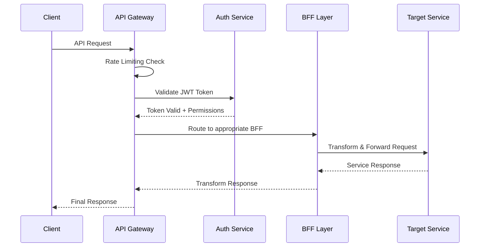

# API Gateway & BFF (Backend for Frontend)

## Description
Centralized API Gateway that serves as the single entry point for all client requests, providing routing, authentication, rate limiting, and request/response transformation.

## Core Responsibilities
- **Request Routing**: Route requests to appropriate microservices
- **Authentication & Authorization**: Validate tokens and permissions
- **Rate Limiting**: Protect services from abuse and overload
- **Request/Response Transformation**: Adapt APIs for different clients
- **Load Balancing**: Distribute requests across service instances
- **Circuit Breaking**: Protect against cascading failures

## Architecture Components

### Gateway Layer
```
┌─────────────────────────────────────────────────────────────┐
│                    API Gateway                              │
├─────────────────────────────────────────────────────────────┤
│  Kong / AWS API Gateway / Azure API Management            │
│  ├── Request Routing & Load Balancing                      │
│  ├── Authentication & Authorization                        │
│  ├── Rate Limiting & Throttling                           │
│  └── Request/Response Transformation                       │
└─────────────────────────────────────────────────────────────┘
```

### BFF Layer (Backend for Frontend)
```
┌─────────────────────────────────────────────────────────────┐
│                Backend for Frontend                         │
├─────────────────────────────────────────────────────────────┤
│  Web BFF (React/Vue Frontend)                             │
│  Mobile BFF (iOS/Android Apps)                            │
│  Admin BFF (Admin Dashboard)                              │
│  Partner BFF (Third-party Integrations)                   │
└─────────────────────────────────────────────────────────────┘
```

## Request Flow

### Standard Request Flow


## Routing Configuration

### Service Routing Rules
```yaml
routes:
  # Catalog Service Routes
  - path: /api/v1/products/*
    service: catalog-service
    methods: [GET, POST, PUT, DELETE]
    auth_required: true
    rate_limit: 1000/minute
    
  # Order Service Routes  
  - path: /api/v1/orders/*
    service: order-service
    methods: [GET, POST, PUT]
    auth_required: true
    rate_limit: 100/minute
    
  # Search Service Routes
  - path: /api/v1/search/*
    service: search-service
    methods: [GET]
    auth_required: false
    rate_limit: 500/minute
    cache_ttl: 300
```

### Load Balancing Strategies
```yaml
load_balancing:
  catalog-service:
    strategy: round_robin
    health_check: /health
    instances:
      - host: catalog-service-1:8080
      - host: catalog-service-2:8080
      - host: catalog-service-3:8080
        
  order-service:
    strategy: least_connections
    health_check: /health
    instances:
      - host: order-service-1:8080
      - host: order-service-2:8080
```

## Authentication & Authorization

### JWT Token Validation
```javascript
// JWT validation middleware
const validateJWT = async (req, res, next) => {
  const token = req.headers.authorization?.replace('Bearer ', '');
  
  if (!token) {
    return res.status(401).json({ error: 'No token provided' });
  }
  
  try {
    const decoded = jwt.verify(token, process.env.JWT_SECRET);
    req.user = decoded;
    
    // Check permissions for specific routes
    const hasPermission = await checkPermissions(decoded.userId, req.path, req.method);
    if (!hasPermission) {
      return res.status(403).json({ error: 'Insufficient permissions' });
    }
    
    next();
  } catch (error) {
    return res.status(401).json({ error: 'Invalid token' });
  }
};
```

### Permission-Based Routing
```yaml
permissions:
  /api/v1/admin/*:
    required_roles: [admin, super_admin]
    
  /api/v1/orders:
    GET: [customer, admin, support]
    POST: [customer, admin]
    PUT: [admin, support]
    DELETE: [admin]
    
  /api/v1/products:
    GET: [public]
    POST: [admin, catalog_manager]
    PUT: [admin, catalog_manager]
    DELETE: [admin]
```

## Rate Limiting & Throttling

### Rate Limiting Strategies
```yaml
rate_limits:
  # Per-user limits
  authenticated_user:
    requests: 1000
    window: 60s
    
  # Per-IP limits  
  anonymous_user:
    requests: 100
    window: 60s
    
  # Per-service limits
  search_service:
    requests: 10000
    window: 60s
    
  # Premium user limits
  premium_user:
    requests: 5000
    window: 60s
```

### Throttling Policies
```javascript
const rateLimitPolicies = {
  // Burst protection
  burst: {
    windowMs: 1000, // 1 second
    max: 10 // max 10 requests per second
  },
  
  // Sustained load protection
  sustained: {
    windowMs: 60000, // 1 minute
    max: 1000 // max 1000 requests per minute
  },
  
  // Daily limits
  daily: {
    windowMs: 86400000, // 24 hours
    max: 100000 // max 100k requests per day
  }
};
```

## BFF (Backend for Frontend) Patterns

### Web BFF
```javascript
// Web BFF - Optimized for web browsers
class WebBFF {
  async getProductPage(productId) {
    // Aggregate data from multiple services
    const [product, pricing, reviews, inventory] = await Promise.all([
      this.catalogService.getProduct(productId),
      this.pricingService.getPrice(productId, this.getWarehouse()),
      this.reviewService.getReviews(productId),
      this.inventoryService.getAvailability(productId)
    ]);
    
    // Transform for web client
    return {
      product: {
        ...product,
        price: pricing.finalPrice,
        availability: inventory.inStock,
        rating: reviews.averageRating,
        reviewCount: reviews.totalReviews
      }
    };
  }
}
```

### Mobile BFF
```javascript
// Mobile BFF - Optimized for mobile apps
class MobileBFF {
  async getProductPage(productId) {
    // Lighter payload for mobile
    const [product, pricing, inventory] = await Promise.all([
      this.catalogService.getProduct(productId),
      this.pricingService.getPrice(productId, this.getWarehouse()),
      this.inventoryService.getAvailability(productId)
    ]);
    
    // Transform for mobile client (smaller payload)
    return {
      id: product.id,
      name: product.name,
      price: pricing.finalPrice,
      currency: pricing.currency,
      inStock: inventory.inStock,
      images: product.images.map(img => ({
        url: img.thumbnails.medium, // Smaller images for mobile
        alt: img.alt
      }))
    };
  }
}
```

## Request/Response Transformation

### Request Transformation
```javascript
// Transform incoming requests
const transformRequest = (req) => {
  // Add correlation ID
  req.headers['x-correlation-id'] = generateCorrelationId();
  
  // Add user context
  if (req.user) {
    req.headers['x-user-id'] = req.user.id;
    req.headers['x-user-roles'] = req.user.roles.join(',');
  }
  
  // Transform query parameters
  if (req.query.sort) {
    req.query.orderBy = req.query.sort;
    delete req.query.sort;
  }
  
  return req;
};
```

### Response Transformation
```javascript
// Transform outgoing responses
const transformResponse = (response, clientType) => {
  switch (clientType) {
    case 'mobile':
      return {
        data: response.data,
        meta: {
          total: response.total,
          page: response.page
        }
      };
      
    case 'web':
      return {
        ...response,
        _links: generateHATEOASLinks(response)
      };
      
    default:
      return response;
  }
};
```

## Circuit Breaker Pattern

### Circuit Breaker Configuration
```yaml
circuit_breakers:
  catalog-service:
    failure_threshold: 5
    timeout: 30s
    reset_timeout: 60s
    
  order-service:
    failure_threshold: 3
    timeout: 10s
    reset_timeout: 30s
    
  payment-service:
    failure_threshold: 2
    timeout: 5s
    reset_timeout: 120s
```

### Fallback Strategies
```javascript
const circuitBreaker = {
  async callService(serviceName, request) {
    try {
      return await this.services[serviceName].call(request);
    } catch (error) {
      // Circuit breaker logic
      if (this.shouldOpenCircuit(serviceName, error)) {
        this.openCircuit(serviceName);
      }
      
      // Return fallback response
      return this.getFallbackResponse(serviceName, request);
    }
  },
  
  getFallbackResponse(serviceName, request) {
    switch (serviceName) {
      case 'catalog-service':
        return { message: 'Product information temporarily unavailable' };
      case 'pricing-service':
        return { price: 'Price on request' };
      default:
        return { error: 'Service temporarily unavailable' };
    }
  }
};
```

## Caching Strategies

### Response Caching
```yaml
cache_policies:
  # Cache product data
  /api/v1/products/*:
    ttl: 300s
    vary_by: [user_id, warehouse_id]
    
  # Cache search results
  /api/v1/search:
    ttl: 600s
    vary_by: [query, filters]
    
  # Don't cache user-specific data
  /api/v1/orders/*:
    cache: false
```

### Cache Invalidation
```javascript
// Event-driven cache invalidation
eventBus.on('catalog.product.updated', (event) => {
  const productId = event.data.productId;
  cache.invalidate(`/api/v1/products/${productId}*`);
});

eventBus.on('pricing.updated', (event) => {
  cache.invalidate('/api/v1/products/*');
  cache.invalidate('/api/v1/search*');
});
```

## Monitoring & Analytics

### Gateway Metrics
```json
{
  "gateway_metrics": {
    "requests_total": {
      "type": "counter",
      "labels": ["method", "path", "status_code", "service"]
    },
    "request_duration_seconds": {
      "type": "histogram",
      "labels": ["method", "path", "service"]
    },
    "rate_limit_hits": {
      "type": "counter",
      "labels": ["user_id", "ip_address"]
    },
    "circuit_breaker_state": {
      "type": "gauge",
      "labels": ["service"]
    }
  }
}
```

### Request Tracing
```javascript
// Distributed tracing integration
const traceRequest = (req, res, next) => {
  const traceId = req.headers['x-trace-id'] || generateTraceId();
  const spanId = generateSpanId();
  
  req.headers['x-trace-id'] = traceId;
  req.headers['x-span-id'] = spanId;
  
  // Log request start
  logger.info('Request started', {
    trace_id: traceId,
    span_id: spanId,
    method: req.method,
    path: req.path,
    user_id: req.user?.id
  });
  
  next();
};
```

## Security Features

### Security Headers
```javascript
const securityHeaders = {
  'X-Content-Type-Options': 'nosniff',
  'X-Frame-Options': 'DENY',
  'X-XSS-Protection': '1; mode=block',
  'Strict-Transport-Security': 'max-age=31536000; includeSubDomains',
  'Content-Security-Policy': "default-src 'self'"
};
```

### Input Validation
```javascript
const validateInput = (schema) => {
  return (req, res, next) => {
    const { error } = schema.validate(req.body);
    if (error) {
      return res.status(400).json({
        error: 'Invalid input',
        details: error.details
      });
    }
    next();
  };
};
```

## Deployment & Scaling

### High Availability Setup
- **Multiple Instances**: Deploy multiple gateway instances
- **Load Balancer**: Use external load balancer (ALB, NLB)
- **Health Checks**: Regular health check endpoints
- **Graceful Shutdown**: Handle shutdown gracefully

### Auto-scaling Configuration
```yaml
autoscaling:
  min_replicas: 3
  max_replicas: 20
  target_cpu_utilization: 70%
  target_memory_utilization: 80%
  scale_up_cooldown: 300s
  scale_down_cooldown: 600s
```