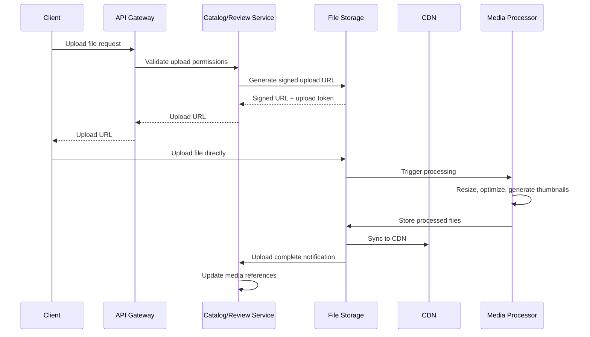

# File Storage & CDN

## Description
Distributed file storage and content delivery network for managing media files, static assets, and document storage across the microservices architecture.

## Core Responsibilities
- Store and serve product images and videos
- Manage review media (photos, videos)
- Handle document storage (invoices, reports)
- Provide fast content delivery via CDN
- Manage file uploads and processing
- Implement file security and access control

## Storage Types

### Product Media
- **Product Images**: High-resolution product photos
- **Product Videos**: Product demonstration videos
- **Category Images**: Category and brand imagery
- **Thumbnails**: Auto-generated thumbnails in multiple sizes

### Review Media
- **Customer Photos**: User-uploaded product photos
- **Review Videos**: Customer review videos
- **Before/After Images**: Product usage comparisons

### System Documents
- **Invoices**: PDF invoices and receipts
- **Reports**: Business and analytics reports
- **User Documents**: Profile pictures, verification documents
- **System Assets**: Icons, logos, static website assets

## Architecture Components

### Storage Layer
```
┌─────────────────────────────────────────────────────────────┐
│                    Storage Backends                         │
├─────────────────────────────────────────────────────────────┤
│  AWS S3 / Azure Blob / Google Cloud Storage               │
│  ├── Raw Storage (original files)                          │
│  ├── Processed Storage (optimized files)                   │
│  └── Backup Storage (disaster recovery)                    │
└─────────────────────────────────────────────────────────────┘
```

### CDN Layer
```
┌─────────────────────────────────────────────────────────────┐
│                    CDN Distribution                         │
├─────────────────────────────────────────────────────────────┤
│  CloudFlare / AWS CloudFront / Azure CDN                  │
│  ├── Edge Locations (global distribution)                  │
│  ├── Cache Rules (TTL and invalidation)                    │
│  └── Security Rules (access control)                       │
└─────────────────────────────────────────────────────────────┘
```

### Processing Layer
```
┌─────────────────────────────────────────────────────────────┐
│                  Media Processing                           │
├─────────────────────────────────────────────────────────────┤
│  Image Processing (resize, optimize, format conversion)    │
│  Video Processing (transcoding, thumbnail generation)      │
│  Document Processing (PDF generation, compression)         │
└─────────────────────────────────────────────────────────────┘
```

## Service Integration

### Catalog Service Integration
```json
{
  "productId": "PROD-12345",
  "media": {
    "images": [
      {
        "id": "IMG-001",
        "type": "primary",
        "url": "https://cdn.example.com/products/prod-12345/main.jpg",
        "thumbnails": {
          "small": "https://cdn.example.com/products/prod-12345/main_150x150.jpg",
          "medium": "https://cdn.example.com/products/prod-12345/main_300x300.jpg",
          "large": "https://cdn.example.com/products/prod-12345/main_800x800.jpg"
        }
      }
    ],
    "videos": [
      {
        "id": "VID-001",
        "type": "demo",
        "url": "https://cdn.example.com/products/prod-12345/demo.mp4",
        "thumbnail": "https://cdn.example.com/products/prod-12345/demo_thumb.jpg"
      }
    ]
  }
}
```

### Review Service Integration
```json
{
  "reviewId": "REV-67890",
  "media": {
    "images": [
      {
        "id": "IMG-002",
        "url": "https://cdn.example.com/reviews/rev-67890/photo1.jpg",
        "caption": "Product in use"
      }
    ]
  }
}
```

## File Upload Flow

### Upload Process


## File Processing Pipeline

### Image Processing
- **Resize**: Multiple sizes (150x150, 300x300, 800x800, 1200x1200)
- **Optimize**: Compression and format optimization (WebP, AVIF)
- **Watermark**: Add watermarks for copyrighted content
- **Quality Control**: Automatic quality assessment

### Video Processing
- **Transcoding**: Multiple formats (MP4, WebM)
- **Compression**: Optimize file sizes
- **Thumbnail Generation**: Extract video thumbnails
- **Streaming**: Prepare for adaptive streaming

### Document Processing
- **PDF Generation**: Convert documents to PDF
- **Compression**: Optimize file sizes
- **Security**: Add password protection if needed
- **Metadata**: Extract and store document metadata

## Security & Access Control

### Access Control Lists (ACL)
```json
{
  "fileId": "FILE-12345",
  "permissions": {
    "public": {
      "read": true,
      "write": false
    },
    "authenticated": {
      "read": true,
      "write": false
    },
    "owner": {
      "read": true,
      "write": true,
      "delete": true
    },
    "admin": {
      "read": true,
      "write": true,
      "delete": true
    }
  }
}
```

### Security Features
- **Signed URLs**: Time-limited access to private files
- **IP Restrictions**: Limit access by IP address
- **Referrer Validation**: Prevent hotlinking
- **Virus Scanning**: Automatic malware detection
- **Content Validation**: File type and size validation

## Performance Optimization

### Caching Strategy
- **CDN Caching**: Long TTL for static assets (1 year)
- **Browser Caching**: Appropriate cache headers
- **Lazy Loading**: Load images on demand
- **Progressive Loading**: Progressive JPEG and WebP

### Delivery Optimization
- **Global CDN**: Edge locations worldwide
- **HTTP/2**: Multiplexed connections
- **Compression**: Gzip and Brotli compression
- **Adaptive Images**: Serve appropriate sizes based on device

## Monitoring & Analytics

### Key Metrics
- **Storage Usage**: Total storage consumption by service
- **Bandwidth Usage**: CDN bandwidth consumption
- **Cache Hit Ratio**: CDN cache effectiveness (target: > 90%)
- **Upload Success Rate**: File upload success rate (target: > 99%)
- **Processing Time**: Media processing duration

### Performance Monitoring
- **Response Times**: File delivery response times
- **Error Rates**: Upload and delivery error rates
- **Geographic Performance**: Performance by region
- **Device Performance**: Performance by device type

## Disaster Recovery

### Backup Strategy
- **Multi-Region Replication**: Files replicated across regions
- **Versioning**: Keep multiple versions of files
- **Point-in-Time Recovery**: Restore files to specific timestamps
- **Cross-Cloud Backup**: Backup to different cloud providers

### Recovery Procedures
- **Automated Failover**: Switch to backup regions automatically
- **Data Integrity Checks**: Regular integrity verification
- **Recovery Testing**: Regular disaster recovery drills
- **RTO/RPO Targets**: Recovery Time < 1 hour, Recovery Point < 15 minutes

## Cost Optimization

### Storage Tiers
- **Hot Storage**: Frequently accessed files
- **Warm Storage**: Occasionally accessed files
- **Cold Storage**: Rarely accessed files (archives)
- **Lifecycle Policies**: Automatic tier transitions

### Cost Monitoring
- **Usage Analytics**: Track storage and bandwidth costs
- **Cost Alerts**: Notify when costs exceed thresholds
- **Optimization Recommendations**: Suggest cost-saving measures
- **Reserved Capacity**: Use reserved instances for predictable usage

## Integration APIs

### Upload API
```
POST /storage/upload
Content-Type: multipart/form-data

{
  "file": <binary>,
  "type": "product_image",
  "productId": "PROD-12345",
  "metadata": {
    "alt": "Product main image",
    "caption": "Premium wireless headphones"
  }
}
```

### Retrieval API
```
GET /storage/files/{fileId}
GET /storage/files/{fileId}/thumbnails/{size}
GET /storage/files/{fileId}/metadata
```

### Management API
```
DELETE /storage/files/{fileId}
PUT /storage/files/{fileId}/permissions
GET /storage/usage/statistics
```