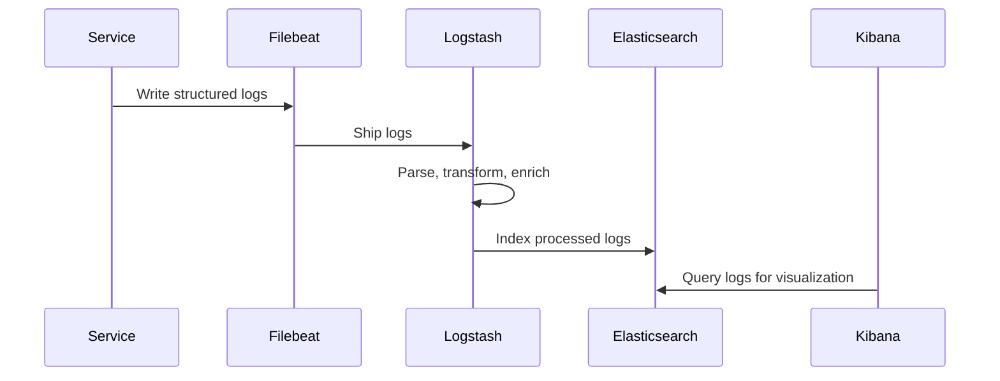

# Monitoring & Logging

## Description
Comprehensive observability stack providing monitoring, logging, alerting, and analytics for the entire microservices ecosystem.

## Core Responsibilities
- Real-time system monitoring and metrics collection
- Centralized logging and log analysis
- Alerting and incident management
- Performance monitoring and optimization
- Security monitoring and threat detection
- Business metrics and analytics

## Architecture Components

### Monitoring Stack
```
┌─────────────────────────────────────────────────────────────┐
│                    Monitoring Layer                         │
├─────────────────────────────────────────────────────────────┤
│  Prometheus (Metrics Collection & Storage)                 │
│  ├── Service Discovery (Kubernetes, Consul)                │
│  ├── Metrics Scraping (Pull-based)                         │
│  ├── Time Series Database                                  │
│  └── Alert Manager (Rule-based Alerting)                   │
└─────────────────────────────────────────────────────────────┘
```

### Logging Stack (ELK)
```
┌─────────────────────────────────────────────────────────────┐
│                     Logging Layer                          │
├─────────────────────────────────────────────────────────────┤
│  Elasticsearch (Log Storage & Search)                      │
│  Logstash (Log Processing & Transformation)                │
│  Kibana (Log Visualization & Dashboards)                   │
│  Filebeat (Log Shipping from Services)                     │
└─────────────────────────────────────────────────────────────┘
```

### Visualization & Dashboards
```
┌─────────────────────────────────────────────────────────────┐
│                  Visualization Layer                       │
├─────────────────────────────────────────────────────────────┤
│  Grafana (Metrics Dashboards)                              │
│  ├── Service Health Dashboards                             │
│  ├── Business Metrics Dashboards                           │
│  ├── Infrastructure Dashboards                             │
│  └── Custom Alert Dashboards                               │
└─────────────────────────────────────────────────────────────┘
```

## Metrics Collection

### Application Metrics
```json
{
  "service_name": "order-service",
  "metrics": {
    "http_requests_total": {
      "type": "counter",
      "labels": ["method", "endpoint", "status_code"]
    },
    "http_request_duration_seconds": {
      "type": "histogram",
      "labels": ["method", "endpoint"]
    },
    "orders_created_total": {
      "type": "counter",
      "labels": ["status", "payment_method"]
    },
    "order_processing_duration_seconds": {
      "type": "histogram",
      "labels": ["order_type"]
    }
  }
}
```

### Infrastructure Metrics
```json
{
  "infrastructure": {
    "cpu_usage_percent": {
      "type": "gauge",
      "labels": ["instance", "service"]
    },
    "memory_usage_bytes": {
      "type": "gauge",
      "labels": ["instance", "service"]
    },
    "disk_usage_percent": {
      "type": "gauge",
      "labels": ["instance", "mount_point"]
    },
    "network_bytes_total": {
      "type": "counter",
      "labels": ["instance", "direction"]
    }
  }
}
```

### Business Metrics
```json
{
  "business": {
    "revenue_total": {
      "type": "counter",
      "labels": ["currency", "payment_method"]
    },
    "conversion_rate": {
      "type": "gauge",
      "labels": ["source", "campaign"]
    },
    "customer_satisfaction_score": {
      "type": "gauge",
      "labels": ["service", "rating"]
    },
    "inventory_turnover_rate": {
      "type": "gauge",
      "labels": ["warehouse", "category"]
    }
  }
}
```

## Logging Strategy

### Log Levels
- **ERROR**: System errors and exceptions
- **WARN**: Warning conditions and potential issues
- **INFO**: General information and business events
- **DEBUG**: Detailed debugging information

### Structured Logging Format
```json
{
  "timestamp": "2024-08-10T14:30:00.123Z",
  "level": "INFO",
  "service": "order-service",
  "instance": "order-service-pod-123",
  "trace_id": "abc123def456",
  "span_id": "789ghi012",
  "message": "Order created successfully",
  "context": {
    "order_id": "ORD-789012",
    "customer_id": "CUST-12345",
    "total_amount": 299.99,
    "currency": "USD"
  },
  "metadata": {
    "user_agent": "Mozilla/5.0...",
    "ip_address": "192.168.1.100",
    "request_id": "req-456789"
  }
}
```

### Log Aggregation Flow


## Alerting & Incident Management

### Alert Categories

#### Critical Alerts (P0)
- **Service Down**: Service unavailable for > 2 minutes
- **High Error Rate**: Error rate > 5% for > 5 minutes
- **Database Connection**: Database connectivity issues
- **Payment Failures**: Payment processing failures > 10%

#### High Priority Alerts (P1)
- **Performance Degradation**: Response time > 2x baseline
- **High Memory Usage**: Memory usage > 85%
- **Disk Space**: Disk usage > 90%
- **Queue Backlog**: Message queue backlog > 1000

#### Medium Priority Alerts (P2)
- **Moderate Performance**: Response time > 1.5x baseline
- **Resource Usage**: CPU/Memory > 70%
- **Cache Miss Rate**: Cache hit rate < 80%
- **Business Metrics**: Conversion rate drop > 20%

### Alert Rules (Prometheus)
```yaml
groups:
  - name: service-health
    rules:
      - alert: ServiceDown
        expr: up{job="order-service"} == 0
        for: 2m
        labels:
          severity: critical
        annotations:
          summary: "Order Service is down"
          description: "Order Service has been down for more than 2 minutes"

      - alert: HighErrorRate
        expr: rate(http_requests_total{status=~"5.."}[5m]) > 0.05
        for: 5m
        labels:
          severity: critical
        annotations:
          summary: "High error rate detected"
          description: "Error rate is {{ $value }} for {{ $labels.service }}"
```

### Incident Response Workflow
```
Alert Triggered → PagerDuty/Slack → On-Call Engineer → 
Investigation → Mitigation → Resolution → Post-Mortem
```

## Distributed Tracing

### Tracing Architecture
```
┌─────────────────────────────────────────────────────────────┐
│                    Tracing Stack                            │
├─────────────────────────────────────────────────────────────┤
│  Jaeger (Distributed Tracing)                              │
│  ├── Jaeger Agent (Local trace collection)                 │
│  ├── Jaeger Collector (Trace aggregation)                  │
│  ├── Jaeger Query (Trace retrieval)                        │
│  └── Jaeger UI (Trace visualization)                       │
└─────────────────────────────────────────────────────────────┘
```

### Trace Context Propagation
```json
{
  "trace_id": "abc123def456ghi789",
  "span_id": "span123456",
  "parent_span_id": "parent789",
  "operation_name": "create_order",
  "start_time": "2024-08-10T14:30:00.123Z",
  "duration": "245ms",
  "tags": {
    "service.name": "order-service",
    "http.method": "POST",
    "http.url": "/orders",
    "http.status_code": 201,
    "customer.id": "CUST-12345"
  },
  "logs": [
    {
      "timestamp": "2024-08-10T14:30:00.150Z",
      "fields": {
        "event": "order_validation_complete",
        "result": "success"
      }
    }
  ]
}
```

## Dashboard Categories

### Service Health Dashboards
- **Service Availability**: Uptime and availability metrics
- **Response Times**: P50, P95, P99 response times
- **Error Rates**: Error rates by service and endpoint
- **Throughput**: Requests per second by service

### Infrastructure Dashboards
- **Resource Utilization**: CPU, Memory, Disk, Network
- **Kubernetes Metrics**: Pod status, resource quotas
- **Database Performance**: Query performance, connections
- **Cache Performance**: Hit rates, memory usage

### Business Dashboards
- **Revenue Metrics**: Real-time revenue tracking
- **Order Metrics**: Order volume, conversion rates
- **Customer Metrics**: Active users, satisfaction scores
- **Inventory Metrics**: Stock levels, turnover rates

### Security Dashboards
- **Authentication**: Login attempts, failures
- **Authorization**: Permission violations
- **Threat Detection**: Suspicious activities
- **Compliance**: Audit trail compliance

## Performance Monitoring

### SLA Monitoring
```yaml
slas:
  order_service:
    availability: 99.9%
    response_time_p95: 500ms
    error_rate: < 0.1%
  
  payment_service:
    availability: 99.95%
    response_time_p95: 1000ms
    error_rate: < 0.05%
  
  search_service:
    availability: 99.5%
    response_time_p95: 200ms
    error_rate: < 0.5%
```

### Performance Baselines
- **Response Time Baselines**: Historical performance data
- **Throughput Baselines**: Expected request volumes
- **Resource Baselines**: Normal resource utilization
- **Error Rate Baselines**: Acceptable error thresholds

## Security Monitoring

### Security Events
- **Failed Authentication**: Multiple failed login attempts
- **Privilege Escalation**: Unauthorized permission requests
- **Data Access**: Unusual data access patterns
- **API Abuse**: Rate limiting violations

### Compliance Monitoring
- **Audit Logs**: Complete audit trail for compliance
- **Data Access**: Track sensitive data access
- **Configuration Changes**: Monitor system configuration changes
- **User Activities**: Track admin and user activities

## Cost Monitoring

### Resource Cost Tracking
- **Compute Costs**: CPU and memory usage costs
- **Storage Costs**: Database and file storage costs
- **Network Costs**: Data transfer and bandwidth costs
- **Third-party Costs**: External service costs

### Cost Optimization
- **Resource Right-sizing**: Optimize resource allocation
- **Usage Analytics**: Identify underutilized resources
- **Cost Alerts**: Alert on cost threshold breaches
- **Savings Recommendations**: Automated cost-saving suggestions

## Integration with Services

### Metrics Endpoints
```
GET /metrics - Prometheus metrics endpoint
GET /health - Health check endpoint
GET /ready - Readiness check endpoint
```

### Log Integration
```javascript
// Service logging example
const logger = require('./logger');

logger.info('Order created', {
  order_id: 'ORD-789012',
  customer_id: 'CUST-12345',
  total_amount: 299.99,
  trace_id: req.headers['x-trace-id']
});
```

### Alert Integration
```yaml
# Alert Manager configuration
route:
  group_by: ['alertname']
  group_wait: 10s
  group_interval: 10s
  repeat_interval: 1h
  receiver: 'web.hook'

receivers:
- name: 'web.hook'
  slack_configs:
  - api_url: 'https://hooks.slack.com/services/...'
    channel: '#alerts'
    title: 'Alert: {{ .GroupLabels.alertname }}'
    text: '{{ range .Alerts }}{{ .Annotations.description }}{{ end }}'
```