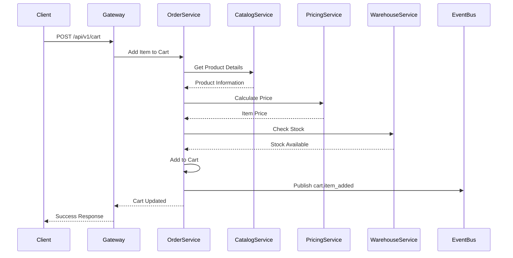
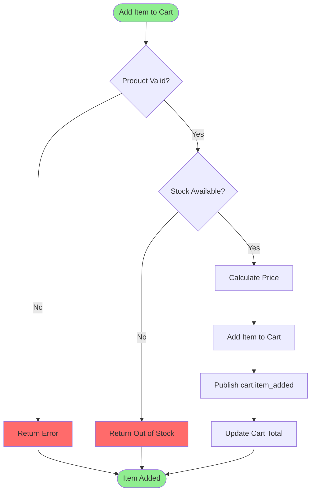

# Cart Management Process

**Domain:** Shopping Experience (DDD)  
**Process ID:** `cart-management`  
**Version:** `v1.0.0`  
**Last Updated:** 2025-11-17  
**Status:** Active

## Overview

### Business Context

The Cart Management process handles shopping cart operations including adding items, updating quantities, removing items, and cart persistence. This process supports both authenticated customers and guest users.

### Success Criteria

- Items can be added to cart
- Cart contents persist across sessions
- Cart prices are calculated in real-time
- Stock availability is checked
- Cart can be cleared or items removed

### Process Scope

**In Scope:**
- Add item to cart
- Update item quantity
- Remove item from cart
- Clear cart
- Get cart contents
- Cart persistence

**Out of Scope:**
- Checkout (handled in Order Placement process)
- Payment (handled in Payment Processing process)

## Services Involved

| Service | Responsibility | Endpoints |
|---------|---------------|-----------|
| Order Service | Cart management | `POST /api/v1/cart`, `GET /api/v1/cart`, `PUT /api/v1/cart/{itemId}`, `DELETE /api/v1/cart/{itemId}` |
| Catalog Service | Product information | `GET /api/v1/products/{id}` |
| Pricing Service | Price calculation | `POST /api/v1/prices/calculate` |
| Warehouse Service | Stock availability | `GET /api/v1/inventory/{sku}` |

## Event Flow

### Event Sequence

| Step | Event Type | Topic | Publisher | Subscribers | Payload Schema |
|------|------------|-------|-----------|--------------|----------------|
| 1 | `order.cart.item_added` | `cart.item_added` | Order Service | Analytics, Recommendation | [cart.item_added.schema.json](../json-schema/cart.item_added.schema.json) |
| 2 | `order.cart.checked_out` | `cart.checked_out` | Order Service | Analytics, Marketing | [cart.checked_out.schema.json](../json-schema/cart.checked_out.schema.json) |

## Flow Charts

### Sequence Diagram

### Business Flow Diagram

## Detailed Flow

### Step 1: Add Item to Cart

**Trigger:** Customer adds product to cart

**Actions:**
1. Validate product exists and is active
2. Check stock availability
3. Calculate item price
4. Add item to cart
5. Update cart totals
6. Publish `cart.item_added` event

**Services:**
- Order Service: Manages cart
- Catalog Service: Validates product
- Pricing Service: Calculates price
- Warehouse Service: Checks stock

**Events:**
- Publishes: `order.cart.item_added`

### Step 2: Update Cart Item

**Trigger:** Customer updates item quantity

**Actions:**
1. Validate new quantity
2. Check stock availability for new quantity
3. Recalculate price
4. Update cart item
5. Update cart totals

**Services:**
- Order Service: Updates cart item

### Step 3: Remove Item from Cart

**Trigger:** Customer removes item from cart

**Actions:**
1. Remove item from cart
2. Recalculate cart totals

**Services:**
- Order Service: Removes cart item

### Step 4: Checkout

**Trigger:** Customer clicks checkout

**Actions:**
1. Validate cart has items
2. Final stock check
3. Final price calculation
4. Publish `cart.checked_out` event
5. Transition to Order Placement process

**Services:**
- Order Service: Processes checkout

**Events:**
- Publishes: `order.cart.checked_out`

## Related Documentation

- [Order Service Documentation](../services/order-service.md)
- [Order Placement Process](./order-placement-process.md)

