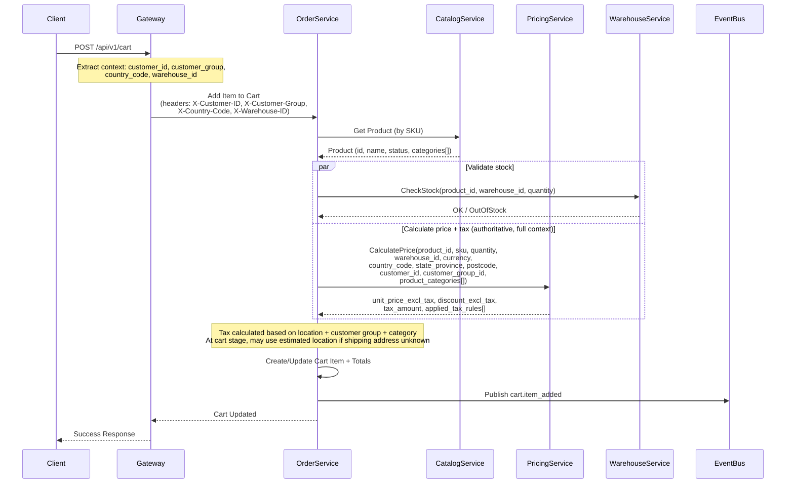

# Cart Management Process

**Domain:** Shopping Experience (DDD)  
**Process ID:** `cart-management`  
**Version:** `v1.0.0`  
**Last Updated:** 2025-11-17  
**Status:** Active

## Overview

### Tax Configuration (Magento-like)

This process follows Magento-style tax semantics:
- Catalog prices are **exclusive of tax** (net pricing).
- Discounts are applied on **prices excluding tax**.
- Tax is calculated based on the **shipping address** (destination-based tax).

Implications:
- `unit_price` and `total_price` in cart represent **excl-tax** amounts.
- `tax_amount` is computed separately and added when presenting `row_total_incl_tax` / order totals.


### Business Context

The Cart Management process handles shopping cart operations including adding items, updating quantities, removing items, and cart persistence. This process supports both authenticated customers and guest users.

### Success Criteria

- Items can be added to cart
- Cart contents persist across sessions
- Cart prices are calculated in real-time
- Stock availability is checked
- Cart can be cleared or items removed

### Process Scope

**In Scope:**
- Add item to cart
- Update item quantity
- Remove item from cart
- Clear cart
- Get cart contents
- Cart persistence

**Out of Scope:**
- Checkout (handled in Order Placement process)
- Payment (handled in Payment Processing process)

## Services Involved

| Service | Responsibility | Endpoints |
|---------|---------------|-----------|
| Order Service | Cart management | `POST /api/v1/cart`, `GET /api/v1/cart`, `PUT /api/v1/cart/{itemId}`, `DELETE /api/v1/cart/{itemId}` |
| Catalog Service | Product information including categories (for category-based tax) | `GET /api/v1/products/{id}` *(returns: id, name, status, categories[])* |
| Pricing Service | Authoritative pricing + tax engine (Magento-like: prices excl tax; tax destination-based, category-based, customer-group-based) | `POST /api/v1/prices/calculate` *(requires: product, location, customer context)* |
| Warehouse Service | Stock availability (requires warehouse context) | `POST /api/v1/inventory/check` *(requires product_id/sku + warehouse_id + quantity)* |

## Event Flow

### Event Sequence

| Step | Event Type | Topic | Publisher | Subscribers | Payload Schema |
|------|------------|-------|-----------|--------------|----------------|
| 1 | `order.cart.item_added` | `cart.item_added` | Order Service | Analytics, Recommendation | [cart.item_added.schema.json](../json-schema/cart.item_added.schema.json) |
| 2 | `order.cart.checked_out` | `cart.checked_out` | Order Service | Analytics, Marketing | [cart.checked_out.schema.json](../json-schema/cart.checked_out.schema.json) |

## Flow Charts

### Sequence Diagram



### Business Flow Diagram

```mermaid
flowchart TD
    Start([Add Item to Cart]) --> ValidateQuantity{Quantity valid?}
    ValidateQuantity -->|No| ErrorQty[Return validation error]
    ValidateQuantity -->|Yes| ValidateProduct{Product exists by SKU?}

    ValidateProduct -->|No| ErrorProduct[Return product not found]
    ValidateProduct -->|Yes| ResolveWarehouse{Resolve warehouse_id}

    ResolveWarehouse --> CheckStock{Stock available in warehouse?}
    CheckStock -->|No| ErrorStock[Return out of stock]
    CheckStock -->|Yes| CalcPrice[Calculate price via Pricing (excl tax)]

    CalcPrice -->|Pricing error| ErrorPrice[Return pricing error]
    CalcPrice -->|OK| UpsertItem[Create or update cart item]

    UpsertItem --> NoteTax[Tax pending until totals calculation
(destination: shipping address)]
    NoteTax --> UpsertItem

    UpsertItem --> RecalcTotals[Compute unit/row totals (excl tax) + tax_amount]
    RecalcTotals --> PublishEvent[Publish cart.item_added]
    PublishEvent --> End([Item Added])

    ErrorQty --> End
    ErrorProduct --> End
    ErrorStock --> End
    ErrorPrice --> End
    ErrorTax --> End

    style Start fill:#90EE90
    style End fill:#90EE90
    style ErrorQty fill:#FF6B6B
    style ErrorProduct fill:#FF6B6B
    style ErrorStock fill:#FF6B6B
    style ErrorPrice fill:#FF6B6B
```

## Detailed Flow

### Step 1: Add Item to Cart

**Trigger:** Customer adds product to cart

**Authoritative implementation (code pointers):**
- `order/internal/service/cart.go` → `CartService.AddToCart`
- `order/internal/biz/cart/add.go` → `UseCase.AddToCart`

**Actions (server-side, authoritative):**
1. Validate quantity (e.g. positive, max-per-item constraints)
2. Get or create cart session (session/user/guest identifiers)
3. Validate product exists by SKU (Catalog)
   - Extract `product_categories[]` from Catalog response
   - Categories used for category-based tax rules (e.g., FOOD reduced VAT, ALCOHOL excise)
4. Extract context from Gateway headers and request:
   - `warehouse_id`: request body → header `X-Warehouse-ID` → default
   - `customer_id`: from auth token or `X-Customer-ID` header
   - `customer_group_id`: from customer profile or `X-Customer-Group` header (RETAIL/B2B/WHOLESALE)
   - Location context:
     - `country_code`: `X-Country-Code` header (IP geolocation) or shipping address
     - `state_province`: `X-State-Province` header or shipping address
     - `postcode`: from shipping address (if available)
5. Check stock availability (Warehouse Inventory) *(required, no client-side fallback)*
6. Call Pricing Service to calculate **authoritative** price and tax:
   - **Input context:**
     - Product: `product_id`, `sku`, `quantity`, `product_categories[]`
     - Warehouse: `warehouse_id`, `currency`
     - Location: `country_code`, `state_province`, `postcode` (for tax)
     - Customer: `customer_id`, `customer_group_id` (for customer-group tax)
   - **Output:**
     - `unit_price_excl_tax`
     - `discount_amount_excl_tax` (if applicable)
     - `tax_amount` (if location available; else 0 or estimated)
     - `applied_tax_rules[]` (for audit/transparency)
7. Create or update cart item and store:
   - `unit_price` (excl tax)
   - `row_total` (excl tax) = unit_price × quantity
   - `discount_amount` (excl tax)
   - `tax_amount` (destination-based, category-aware, customer-group-aware)
   - `row_total_incl_tax` = row_total - discount + tax
8. Publish `cart.item_added` event

**Context Requirements for Tax Calculation:**

**Location Context (destination-based tax):**
- `country_code` (required) - from Gateway headers or shipping address
- `state_province` (recommended) - for state-level tax rules
- `postcode` (required for Magento-like parity) - for postcode-specific rules
- `city` (optional) - for city-level tax if needed

**Customer Context (customer-group tax):**
- `customer_id` - from authentication token
- `customer_group_id` - from customer profile (e.g., RETAIL, B2B, WHOLESALE)
  - Different groups may have different tax rates or exemptions
  - B2B customers may be tax-exempt or have reverse-charge VAT
- `tax_exempt` flag - if customer is tax-exempt

**Product Context (category-based tax):**
- `product_categories[]` - from Catalog service
  - Used for category-specific tax rules
  - Examples:
    - FOOD: reduced VAT (5% instead of 10%)
    - ALCOHOL: excise tax + VAT
    - BOOKS: tax-exempt in some regions

**Magento-like tax timing:**
- Tax is calculated/recalculated when computing totals (destination-based using **shipping address**), considering product categories and customer group.
- Tax rules are matched by: location + category + customer group (with precedence rules).
- At cart stage (before shipping address is known), tax may be **pending** (0) or **estimated** using default location per policy.

**Services:**
- Order Service: Manages cart and enforces authoritative validation
- Catalog Service: Product lookup + price lookup (authoritative for add-to-cart)
- Warehouse Service: Stock check (requires `warehouse_id`)

**Events:**
- Publishes: `order.cart.item_added`

### Step 2: Update Cart Item

**Trigger:** Customer updates item quantity

**Actions:**
1. Validate new quantity
2. Check stock availability for new quantity
3. Recalculate price
4. Update cart item
5. Update cart totals

**Services:**
- Order Service: Updates cart item

### Step 3: Remove Item from Cart

**Trigger:** Customer removes item from cart

**Actions:**
1. Remove item from cart
2. Recalculate cart totals

**Services:**
- Order Service: Removes cart item

### Step 4: Checkout (Out of Scope)

Checkout is handled by the **Order Placement** process.

This process may still support *pre-checkout* cart validation operations (e.g. validate cart contents, sync prices), but the actual checkout flow and `order.cart.checked_out` event publication are documented in:
- [Order Placement Process](./order-placement-process.md)

## Related Documentation

- [Order Service Documentation](../services/order-service.md)
- [Order Placement Process](./order-placement-process.md)

